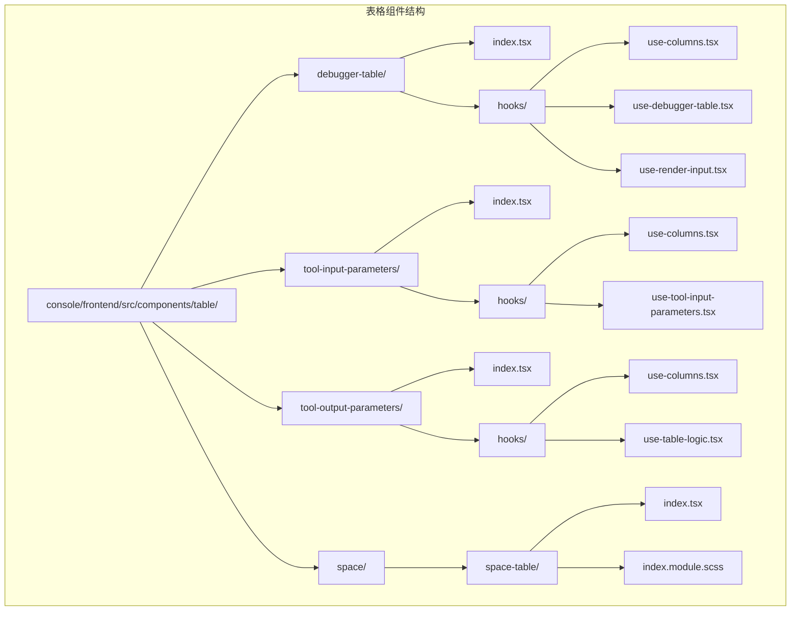
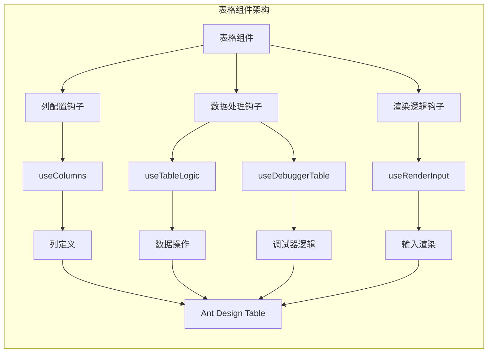
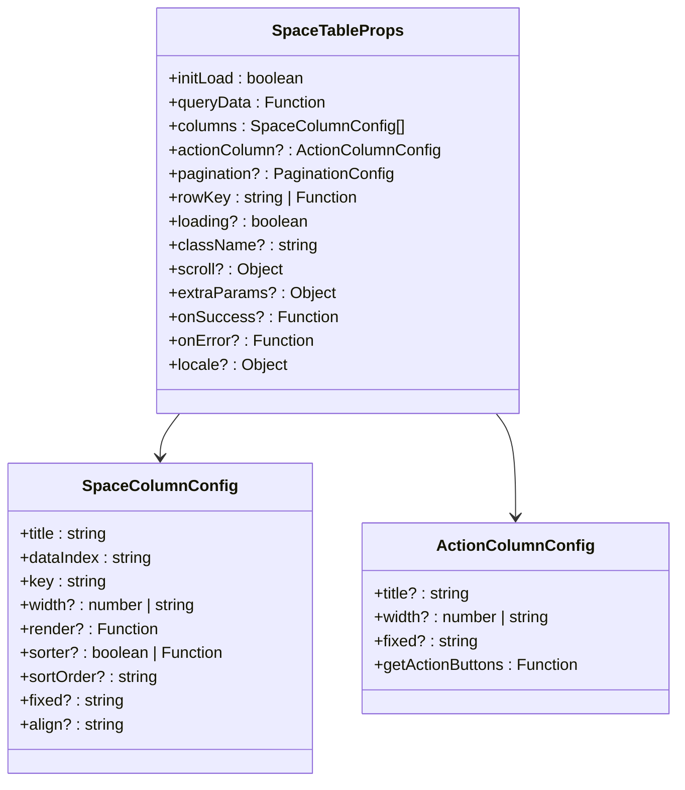
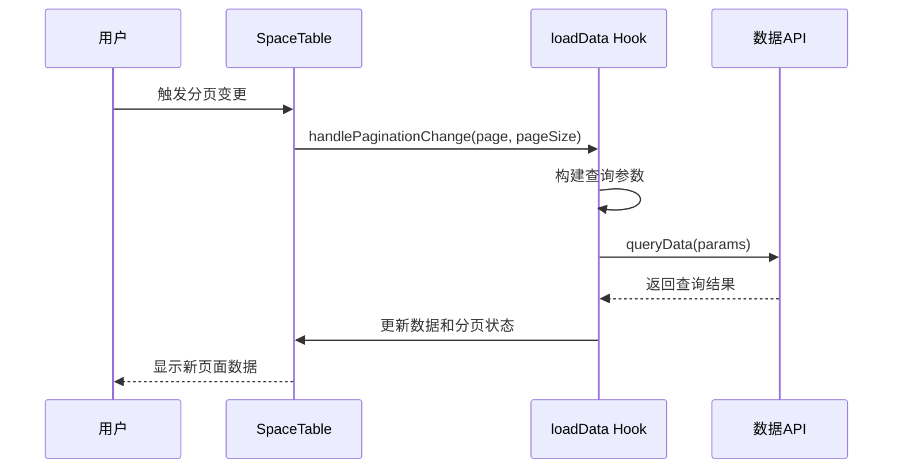
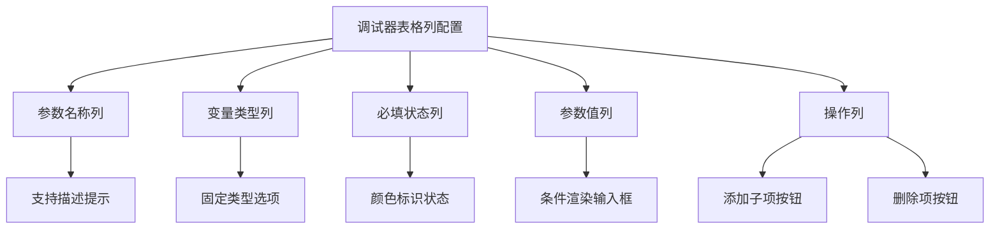
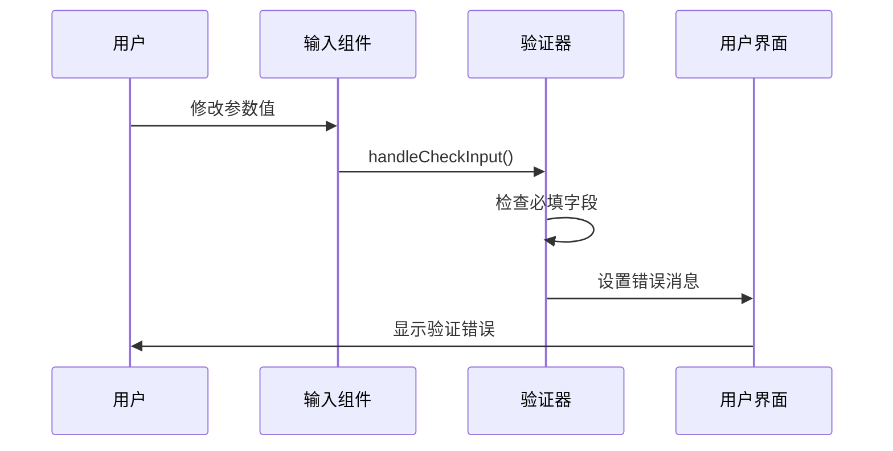
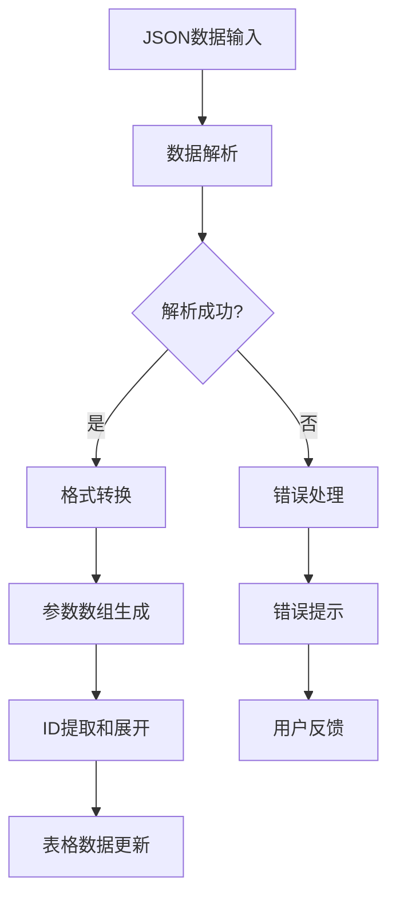
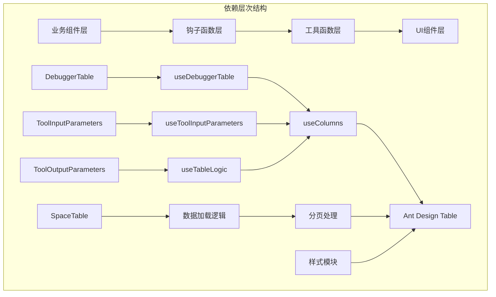

# 表格组件

<cite>
**本文档中引用的文件**
- [debugger-table/index.tsx](file://console/frontend/src/components/table/debugger-table/index.tsx)
- [tool-input-parameters/index.tsx](file://console/frontend/src/components/table/tool-input-parameters/index.tsx)
- [tool-output-parameters/index.tsx](file://console/frontend/src/components/table/tool-output-parameters/index.tsx)
- [space-table/index.tsx](file://console/frontend/src/components/space/space-table/index.tsx)
- [debugger-table/hooks/use-columns.tsx](file://console/frontend/src/components/table/debugger-table/hooks/use-columns.tsx)
- [tool-input-parameters/hooks/use-columns.tsx](file://console/frontend/src/components/table/tool-input-parameters/hooks/use-columns.tsx)
- [tool-output-parameters/hooks/use-columns.tsx](file://console/frontend/src/components/table/tool-output-parameters/hooks/use-columns.tsx)
- [resource.ts](file://console/frontend/src/types/resource.ts)
- [space-table/index.module.scss](file://console/frontend/src/components/space/space-table/index.module.scss)
</cite>

## 目录
1. [简介](#简介)
2. [项目结构](#项目结构)
3. [核心组件](#核心组件)
4. [架构概览](#架构概览)
5. [详细组件分析](#详细组件分析)
6. [依赖关系分析](#依赖关系分析)
7. [性能考虑](#性能考虑)
8. [故障排除指南](#故障排除指南)
9. [结论](#结论)

## 简介

本文档详细分析了 Astron Agent 项目中的表格组件系统，涵盖了调试器表格、工具输入参数表格、工具输出参数表格以及通用空间表格组件的实现。这些表格组件基于 Ant Design 的 Table 组件构建，提供了丰富的功能特性，包括数据驱动、性能优化、可扩展性设计等。

## 项目结构

表格组件分布在以下目录结构中：



**图表来源**
- [debugger-table/index.tsx](file://console/frontend/src/components/table/debugger-table/index.tsx#L1-L74)
- [tool-input-parameters/index.tsx](file://console/frontend/src/components/table/tool-input-parameters/index.tsx#L1-L180)
- [tool-output-parameters/index.tsx](file://console/frontend/src/components/table/tool-output-parameters/index.tsx#L1-L178)
- [space-table/index.tsx](file://console/frontend/src/components/space/space-table/index.tsx#L1-L294)

**章节来源**
- [debugger-table/index.tsx](file://console/frontend/src/components/table/debugger-table/index.tsx#L1-L74)
- [tool-input-parameters/index.tsx](file://console/frontend/src/components/table/tool-input-parameters/index.tsx#L1-L180)
- [tool-output-parameters/index.tsx](file://console/frontend/src/components/table/tool-output-parameters/index.tsx#L1-L178)
- [space-table/index.tsx](file://console/frontend/src/components/space/space-table/index.tsx#L1-L294)

## 核心组件

### 调试器表格 (DebuggerTable)

调试器表格专门用于显示和编辑工具参数配置，支持嵌套结构和动态添加子项。

主要特性：
- 支持参数名称、类型、必填状态、参数值的配置
- 提供展开/折叠功能，支持多层嵌套
- 实时验证参数输入
- 动态添加和删除参数项

### 工具输入参数表格 (ToolInputParameters)

工具输入参数表格用于配置工具的输入参数，支持多种数据类型和验证规则。

主要特性：
- 支持字符串、数字、布尔值、数组、对象等多种数据类型
- 提供请求方法配置（Body、Path、Query、Header）
- 参数验证和错误提示
- 支持数组类型的默认值编辑

### 工具输出参数表格 (ToolOutputParameters)

工具输出参数表格用于配置工具的输出参数，支持从JSON提取和手动添加。

主要特性：
- 支持从JSON数据自动提取参数结构
- 提供手动添加和编辑功能
- 输出参数启用/禁用控制
- 支持复杂的嵌套结构

### 通用空间表格 (SpaceTable)

通用空间表格是一个高度可配置的基础表格组件，适用于各种数据展示场景。

主要特性：
- 数据驱动的列配置
- 内置分页和排序功能
- 支持虚拟滚动
- 可扩展的操作列配置

**章节来源**
- [debugger-table/index.tsx](file://console/frontend/src/components/table/debugger-table/index.tsx#L10-L74)
- [tool-input-parameters/index.tsx](file://console/frontend/src/components/table/tool-input-parameters/index.tsx#L35-L180)
- [tool-output-parameters/index.tsx](file://console/frontend/src/components/table/tool-output-parameters/index.tsx#L25-L178)
- [space-table/index.tsx](file://console/frontend/src/components/space/space-table/index.tsx#L54-L155)

## 架构概览

表格组件采用模块化架构设计，每个表格都有独立的功能模块和钩子函数：



**图表来源**
- [debugger-table/hooks/use-columns.tsx](file://console/frontend/src/components/table/debugger-table/hooks/use-columns.tsx#L1-L129)
- [tool-input-parameters/hooks/use-columns.tsx](file://console/frontend/src/components/table/tool-input-parameters/hooks/use-columns.tsx#L1-L478)
- [tool-output-parameters/hooks/use-columns.tsx](file://console/frontend/src/components/table/tool-output-parameters/hooks/use-columns.tsx#L1-L254)

## 详细组件分析

### SpaceTable 通用表格组件

SpaceTable 是一个高度可配置的基础表格组件，提供了完整的数据管理功能。

#### 核心接口定义



**图表来源**
- [space-table/index.tsx](file://console/frontend/src/components/space/space-table/index.tsx#L54-L103)

#### 分页配置机制

SpaceTable 内置了完整的分页管理机制：



**图表来源**
- [space-table/index.tsx](file://console/frontend/src/components/space/space-table/index.tsx#L155-L200)

#### 样式定制方案

SpaceTable 使用 SCSS 模块化样式系统：

| 样式类名 | 用途 | 特性 |
|---------|------|------|
| `.spaceTable` | 容器根元素 | 设置整体布局和尺寸 |
| `.tableContainer` | 表格容器 | 控制表格区域样式 |
| `.table` | 表格主体 | 定义表格基础样式 |
| `.pagination` | 分页控件 | 自定义分页样式 |

**章节来源**
- [space-table/index.tsx](file://console/frontend/src/components/space/space-table/index.tsx#L104-L294)
- [space-table/index.module.scss](file://console/frontend/src/components/space/space-table/index.module.scss#L1-L178)

### 调试器表格组件

调试器表格专注于工具参数的配置和调试，具有独特的嵌套结构支持。

#### 列配置机制

调试器表格的列配置包含以下核心列：



**图表来源**
- [debugger-table/hooks/use-columns.tsx](file://console/frontend/src/components/table/debugger-table/hooks/use-columns.tsx#L25-L128)

#### 输入渲染逻辑

调试器表格实现了复杂的输入渲染逻辑：

```mermaid
flowchart TD
A[输入渲染] --> B{参数类型判断}
B --> |object|array| C[不渲染输入框]
B --> |其他类型| D[渲染对应输入组件]
D --> E[文本输入]
D --> F[数字输入]
D --> G[布尔开关]
D --> H[选择器]
E --> I[验证错误提示]
F --> I
G --> I
H --> I
I --> J[错误图标和消息]
```

**图表来源**
- [debugger-table/hooks/use-columns.tsx](file://console/frontend/src/components/table/debugger-table/hooks/use-columns.tsx#L60-L85)

**章节来源**
- [debugger-table/index.tsx](file://console/frontend/src/components/table/debugger-table/index.tsx#L10-L74)
- [debugger-table/hooks/use-columns.tsx](file://console/frontend/src/components/table/debugger-table/hooks/use-columns.tsx#L1-L129)

### 工具输入参数表格

工具输入参数表格提供了完整的参数配置功能，支持复杂的类型系统和验证机制。

#### 类型系统支持

| 参数类型 | 渲染组件 | 特殊功能 |
|---------|----------|----------|
| string | Input 文本框 | 支持占位符和验证 |
| number | InputNumber 数字输入 | 数值范围限制 |
| integer | InputNumber 整数输入 | 整数验证 |
| boolean | Switch 开关 | 布尔值切换 |
| array | Select 类型选择 | 仅支持非数组类型 |
| object | Select 类型选择 | 仅支持非数组类型 |

#### 验证和错误处理



**图表来源**
- [tool-input-parameters/hooks/use-columns.tsx](file://console/frontend/src/components/table/tool-input-parameters/hooks/use-columns.tsx#L150-L200)

**章节来源**
- [tool-input-parameters/index.tsx](file://console/frontend/src/components/table/tool-input-parameters/index.tsx#L35-L180)
- [tool-input-parameters/hooks/use-columns.tsx](file://console/frontend/src/components/table/tool-input-parameters/hooks/use-columns.tsx#L1-L478)

### 工具输出参数表格

工具输出参数表格支持从JSON数据自动提取参数结构，提供了灵活的参数配置方式。

#### JSON数据处理流程



**图表来源**
- [tool-output-parameters/index.tsx](file://console/frontend/src/components/table/tool-output-parameters/index.tsx#L85-L110)

#### 操作菜单配置

工具输出参数表格提供了两种添加方式的操作菜单：

| 菜单项 | 功能描述 | 触发方式 |
|--------|----------|----------|
| 手动添加 | 手动配置参数 | 下拉菜单点击 |
| JSON提取 | 从JSON数据提取参数 | 下拉菜单点击 |

**章节来源**
- [tool-output-parameters/index.tsx](file://console/frontend/src/components/table/tool-output-parameters/index.tsx#L25-L178)
- [tool-output-parameters/hooks/use-columns.tsx](file://console/frontend/src/components/table/tool-output-parameters/hooks/use-columns.tsx#L1-L254)

## 依赖关系分析

表格组件系统的依赖关系展现了清晰的分层架构：



**图表来源**
- [debugger-table/index.tsx](file://console/frontend/src/components/table/debugger-table/index.tsx#L1-L10)
- [tool-input-parameters/index.tsx](file://console/frontend/src/components/table/tool-input-parameters/index.tsx#L1-L20)
- [tool-output-parameters/index.tsx](file://console/frontend/src/components/table/tool-output-parameters/index.tsx#L1-L20)

**章节来源**
- [debugger-table/index.tsx](file://console/frontend/src/components/table/debugger-table/index.tsx#L1-L10)
- [tool-input-parameters/index.tsx](file://console/frontend/src/components/table/tool-input-parameters/index.tsx#L1-L20)
- [tool-output-parameters/index.tsx](file://console/frontend/src/components/table/tool-output-parameters/index.tsx#L1-L20)

## 性能考虑

### 数据加载优化

SpaceTable 实现了智能的数据加载策略：

- **懒加载**: initLoad 属性控制是否自动加载数据
- **缓存机制**: 使用 useRef 存储额外参数，避免不必要的重新渲染
- **并发控制**: 使用外部 loading 状态控制加载指示器

### 虚拟滚动支持

SpaceTable 内置了虚拟滚动支持：

```typescript
scroll = {
  scrollToFirstRowOnChange: true,
  y: 'max(120px, calc(100% - 60px))',
}
```

### 内存管理

- 使用 useCallback 优化函数重渲染
- 合理使用 useMemo 缓存计算结果
- 及时清理副作用和定时器

## 故障排除指南

### 常见问题及解决方案

#### 表格数据不更新

**问题症状**: 表格数据显示过期或不正确

**可能原因**:
1. extraParams 变化未触发重新加载
2. queryData 函数返回数据格式错误

**解决方案**:
- 检查 extraParams 的变化检测逻辑
- 验证 queryData 返回的 QueryResult 格式

#### 列配置不生效

**问题症状**: 自定义列配置未按预期显示

**可能原因**:
1. 列配置对象缺少必要属性
2. render 函数返回值格式错误

**解决方案**:
- 确保列配置包含 title、dataIndex、key
- 验证 render 函数返回有效的 ReactNode

#### 性能问题

**问题症状**: 大数据量表格渲染缓慢

**解决方案**:
- 启用虚拟滚动
- 优化 render 函数逻辑
- 使用 shouldComponentUpdate 或 React.memo

**章节来源**
- [space-table/index.tsx](file://console/frontend/src/components/space/space-table/index.tsx#L155-L200)

## 结论

Astron Agent 项目的表格组件系统展现了优秀的软件架构设计：

### 设计原则

1. **数据驱动**: 所有表格都基于数据配置生成，便于维护和扩展
2. **模块化**: 每个表格都有独立的功能模块和钩子函数
3. **可复用性**: 底层 SpaceTable 组件可以适应各种数据展示需求
4. **类型安全**: 使用 TypeScript 提供完整的类型检查
5. **用户体验**: 提供丰富的交互功能和友好的错误提示

### 技术特色

- **高度可配置**: 支持动态列配置和样式定制
- **性能优化**: 内置虚拟滚动和智能加载策略
- **错误处理**: 完善的验证和错误提示机制
- **扩展性强**: 易于添加新的表格类型和功能

### 最佳实践

1. **合理使用 SpaceTable**: 对于通用数据展示场景优先使用 SpaceTable
2. **模块化开发**: 将表格逻辑拆分为独立的钩子函数
3. **类型安全**: 充分利用 TypeScript 的类型系统
4. **性能监控**: 关注大数据量场景下的性能表现
5. **用户体验**: 提供清晰的错误提示和操作反馈

这套表格组件系统为 Astron Agent 提供了强大而灵活的数据展示能力，是项目前端架构的重要组成部分。