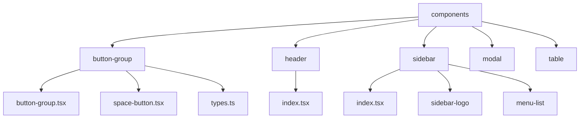
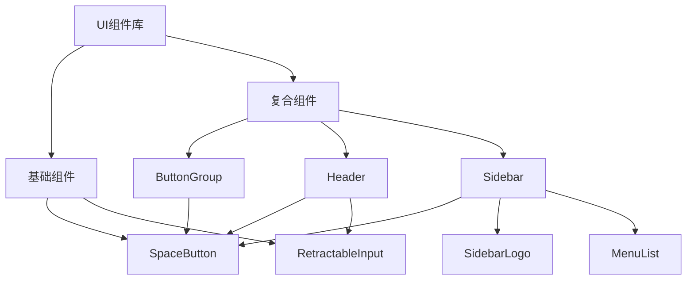
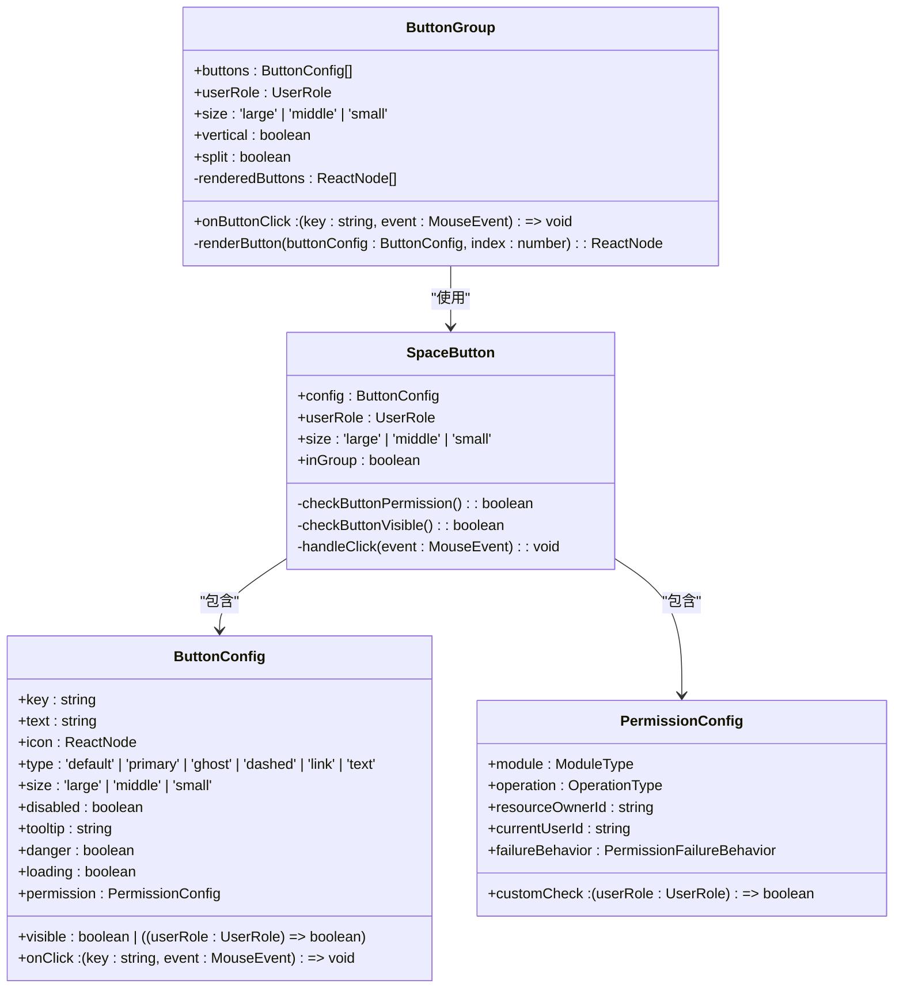
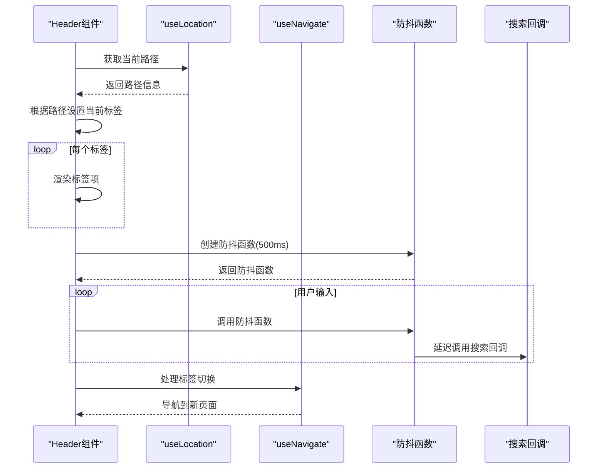
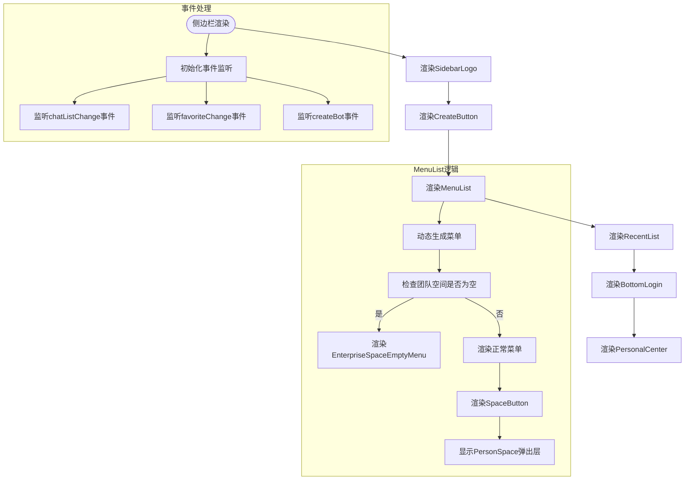
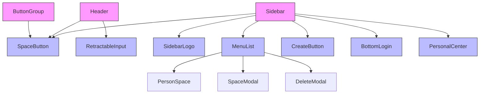

# 通用UI组件

<cite>
**本文档引用的文件**
- [button-group.tsx](file://console/frontend/src/components/button-group/button-group.tsx)
- [space-button.tsx](file://console/frontend/src/components/button-group/space-button.tsx)
- [types.ts](file://console/frontend/src/components/button-group/types.ts)
- [index.tsx](file://console/frontend/src/components/header/index.tsx)
- [sidebar/index.tsx](file://console/frontend/src/components/sidebar/index.tsx)
- [sidebar-logo/index.tsx](file://console/frontend/src/components/sidebar/sidebar-logo/index.tsx)
- [menu-list/index.tsx](file://console/frontend/src/components/sidebar/menu-list/index.tsx)
</cite>

## 目录
1. [介绍](#介绍)
2. [项目结构](#项目结构)
3. [核心组件](#核心组件)
4. [架构概述](#架构概述)
5. [详细组件分析](#详细组件分析)
6. [依赖分析](#依赖分析)
7. [性能考虑](#性能考虑)
8. [故障排除指南](#故障排除指南)
9. [结论](#结论)

## 介绍
本文档详细分析了Astron Agent项目中的通用UI组件库，重点关注可复用的UI组件实现。文档涵盖了按钮组（Button Group）、头部（Header）、侧边栏（Sidebar）等核心组件的设计和实现。通过分析这些组件的props接口、事件回调、样式定制机制（使用Tailwind CSS和SCSS模块），以及响应式设计策略和可访问性（a11y）实现，为开发者提供全面的使用指南和集成示例。文档还阐述了组件库的设计原则，包括一致性、可复用性和可扩展性。

## 项目结构
本项目采用模块化的前端架构，将UI组件组织在`console/frontend/src/components/`目录下。每个组件都有独立的文件夹，包含其主要实现文件、样式文件和相关配置。这种结构化的组织方式提高了代码的可维护性和可复用性。

**Diagram sources**
- [button-group.tsx](file://console/frontend/src/components/button-group/button-group.tsx)
- [index.tsx](file://console/frontend/src/components/header/index.tsx)
- [sidebar/index.tsx](file://console/frontend/src/components/sidebar/index.tsx)

**Section sources**
- [button-group.tsx](file://console/frontend/src/components/button-group/button-group.tsx)
- [index.tsx](file://console/frontend/src/components/header/index.tsx)
- [sidebar/index.tsx](file://console/frontend/src/components/sidebar/index.tsx)

## 核心组件
本节分析项目中的核心UI组件，包括按钮组、头部和侧边栏。这些组件构成了应用的主要用户界面，提供了统一的交互体验和视觉风格。

**Section sources**
- [button-group.tsx](file://console/frontend/src/components/button-group/button-group.tsx)
- [index.tsx](file://console/frontend/src/components/header/index.tsx)
- [sidebar/index.tsx](file://console/frontend/src/components/sidebar/index.tsx)

## 架构概述
Astron Agent的UI组件库采用分层架构设计，将组件分为基础组件和复合组件。基础组件（如SpaceButton）提供基本的UI元素和交互功能，而复合组件（如ButtonGroup、Sidebar）则通过组合基础组件来实现更复杂的功能。

**Diagram sources**
- [button-group.tsx](file://console/frontend/src/components/button-group/button-group.tsx)
- [index.tsx](file://console/frontend/src/components/header/index.tsx)
- [sidebar/index.tsx](file://console/frontend/src/components/sidebar/index.tsx)

## 详细组件分析
本节对各个关键组件进行深入分析，包括其设计模式、实现细节和使用方法。

### 按钮组组件分析
按钮组组件（ButtonGroup）是一个复合组件，用于管理和渲染一组相关的按钮。它通过SpaceButton组件来实现单个按钮的渲染，并提供统一的样式和行为控制。

#### 对象导向组件

**Diagram sources**
- [button-group.tsx](file://console/frontend/src/components/button-group/button-group.tsx)
- [space-button.tsx](file://console/frontend/src/components/button-group/space-button.tsx)
- [types.ts](file://console/frontend/src/components/button-group/types.ts)

### 头部组件分析
头部组件（Header）负责展示页面的导航和操作功能，包括标签页切换和搜索功能。它通过动态配置来适应不同页面的需求。

#### API/服务组件

**Diagram sources**
- [index.tsx](file://console/frontend/src/components/header/index.tsx)

### 侧边栏组件分析
侧边栏组件（Sidebar）是应用的主要导航区域，包含Logo、创建按钮、菜单列表和用户中心等功能。它支持折叠/展开状态，并根据用户角色动态显示内容。

#### 复杂逻辑组件

**Diagram sources**
- [sidebar/index.tsx](file://console/frontend/src/components/sidebar/index.tsx)
- [sidebar-logo/index.tsx](file://console/frontend/src/components/sidebar/sidebar-logo/index.tsx)
- [menu-list/index.tsx](file://console/frontend/src/components/sidebar/menu-list/index.tsx)

**Section sources**
- [sidebar/index.tsx](file://console/frontend/src/components/sidebar/index.tsx)
- [sidebar-logo/index.tsx](file://console/frontend/src/components/sidebar/sidebar-logo/index.tsx)
- [menu-list/index.tsx](file://console/frontend/src/components/sidebar/menu-list/index.tsx)

## 依赖分析
UI组件库的组件之间存在明确的依赖关系，形成了一个层次化的组件结构。基础组件被多个复合组件复用，确保了UI的一致性和代码的可维护性。

**Diagram sources**
- [button-group.tsx](file://console/frontend/src/components/button-group/button-group.tsx)
- [index.tsx](file://console/frontend/src/components/header/index.tsx)
- [sidebar/index.tsx](file://console/frontend/src/components/sidebar/index.tsx)

**Section sources**
- [button-group.tsx](file://console/frontend/src/components/button-group/button-group.tsx)
- [index.tsx](file://console/frontend/src/components/header/index.tsx)
- [sidebar/index.tsx](file://console/frontend/src/components/sidebar/index.tsx)

## 性能考虑
UI组件库在设计时考虑了性能优化，采用了多种技术来提升用户体验。例如，头部组件使用防抖技术来优化搜索性能，避免频繁的API调用；侧边栏组件使用事件总线（eventBus）来管理状态更新，减少不必要的重新渲染。

## 故障排除指南
当遇到UI组件相关的问题时，可以参考以下常见问题的解决方案：

**Section sources**
- [button-group.tsx](file://console/frontend/src/components/button-group/button-group.tsx)
- [index.tsx](file://console/frontend/src/components/header/index.tsx)
- [sidebar/index.tsx](file://console/frontend/src/components/sidebar/index.tsx)

## 结论
Astron Agent的UI组件库通过模块化和分层设计，实现了高度的可复用性和可维护性。核心组件如按钮组、头部和侧边栏不仅提供了丰富的功能，还通过灵活的配置和扩展机制，满足了不同场景下的需求。组件库的设计遵循一致性、可复用性和可扩展性的原则，为开发者提供了高效、可靠的UI开发基础。