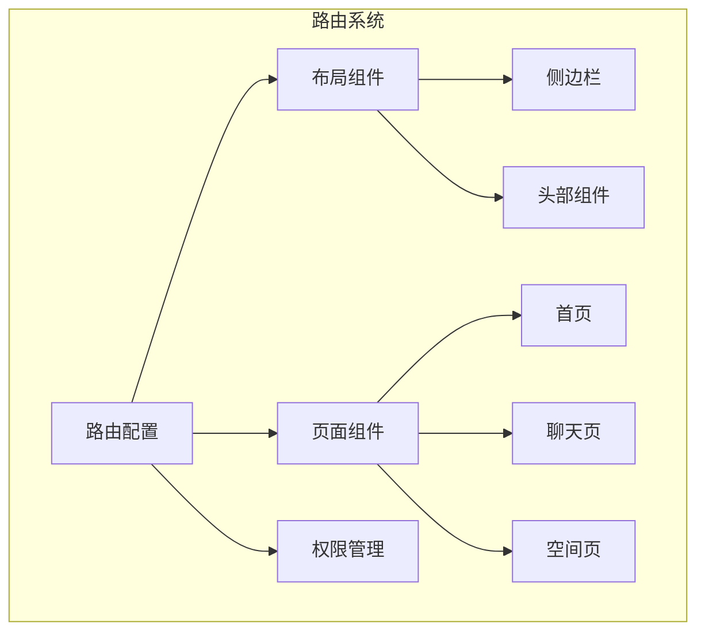
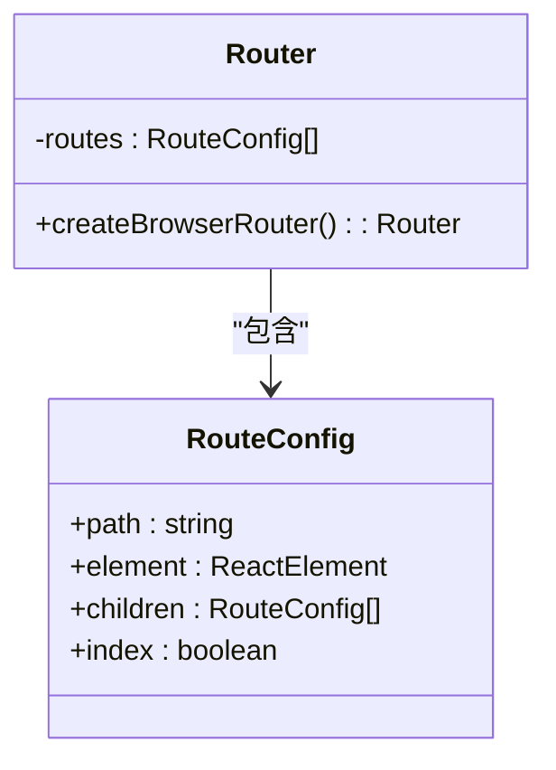
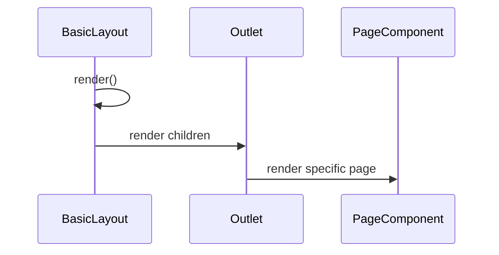
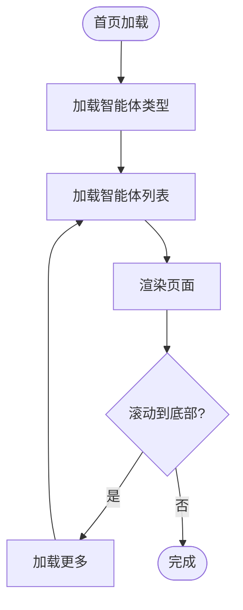
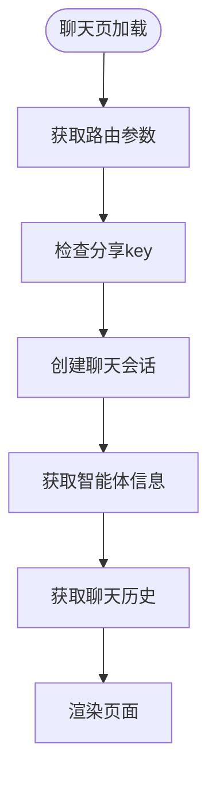
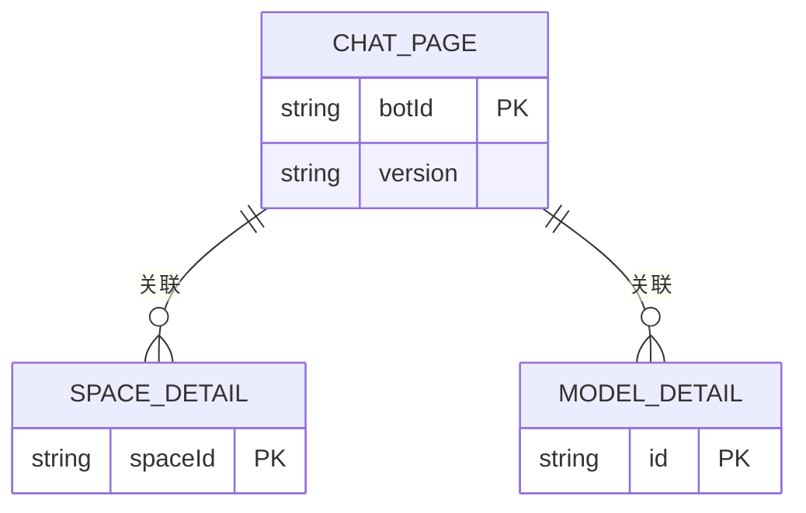
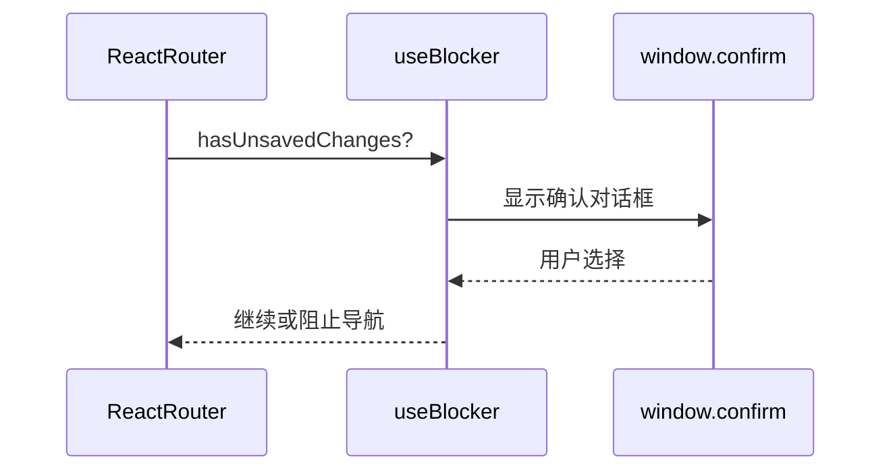
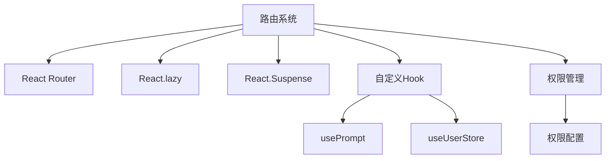

# 路由系统

<cite>
**本文档引用的文件**
- [router/index.tsx](file://console/frontend/src/router/index.tsx)
- [app.tsx](file://console/frontend/src/app.tsx)
- [layouts/index.tsx](file://console/frontend/src/layouts/index.tsx)
- [pages/home-page/index.tsx](file://console/frontend/src/pages/home-page/index.tsx)
- [pages/chat-page/index.tsx](file://console/frontend/src/pages/chat-page/index.tsx)
- [pages/space-page/index.tsx](file://console/frontend/src/pages/space-page/index.tsx)
- [pages/config-page/index.tsx](file://console/frontend/src/pages/config-page/index.tsx)
- [permissions/utils.ts](file://console/frontend/src/permissions/utils.ts)
- [hooks/use-prompt.ts](file://console/frontend/src/hooks/use-prompt.ts)
</cite>

## 目录
1. [简介](#简介)
2. [项目结构](#项目结构)
3. [核心组件](#核心组件)
4. [架构概述](#架构概述)
5. [详细组件分析](#详细组件分析)
6. [依赖分析](#依赖分析)
7. [性能考虑](#性能考虑)
8. [故障排除指南](#故障排除指南)
9. [结论](#结论)

## 简介
本文档详细描述了基于React Router的前端路由系统，涵盖了路由配置、层次结构、动态路由、路由守卫、布局组件集成、路由参数处理以及代码分割策略。系统采用模块化设计，通过懒加载和Suspense实现高效的页面加载性能。

## 项目结构
前端路由系统位于`console/frontend/src`目录下，主要由路由配置、布局组件、页面组件和权限管理四大部分组成。路由配置文件定义了应用的导航结构，布局组件提供统一的UI框架，页面组件实现具体功能，权限管理确保安全访问。



**图示来源**
- [router/index.tsx](file://console/frontend/src/router/index.tsx#L1-L271)
- [layouts/index.tsx](file://console/frontend/src/layouts/index.tsx#L1-L98)

**本节来源**
- [router/index.tsx](file://console/frontend/src/router/index.tsx#L1-L271)
- [app.tsx](file://console/frontend/src/app.tsx#L1-L54)

## 核心组件
路由系统的核心组件包括路由配置、布局组件和页面组件。路由配置使用React Router的createBrowserRouter创建路由实例，页面组件通过React的lazy函数实现懒加载，布局组件通过Outlet提供内容插槽。

**本节来源**
- [router/index.tsx](file://console/frontend/src/router/index.tsx#L1-L271)
- [layouts/index.tsx](file://console/frontend/src/layouts/index.tsx#L1-L98)
- [app.tsx](file://console/frontend/src/app.tsx#L1-L54)

## 架构概述
路由系统采用分层架构，顶层路由定义了应用的主要导航路径，子路由处理特定功能模块的导航。系统通过Suspense和lazy实现代码分割，提高初始加载性能。

```mermaid
graph TD
A[/] --> B[/home]
A --> C[/management/*]
A --> D[/space]
A --> E[/callback]
A --> F[/chat/:botId/:version?]
D --> G[/space/space-detail/:spaceId]
D --> H[/space/config/*]
C --> I[/management/bot-api]
C --> J[/management/model]
C --> K[/management/release/*]
```

**图示来源**
- [router/index.tsx](file://console/frontend/src/router/index.tsx#L1-L271)

## 详细组件分析

### 路由配置分析
路由配置文件定义了应用的所有导航路径，包括静态路由、动态路由和通配符路由。路由通过children属性实现嵌套路由结构。



**图示来源**
- [router/index.tsx](file://console/frontend/src/router/index.tsx#L1-L271)

### 布局组件分析
布局组件提供应用的UI框架，包含侧边栏和内容区域。通过showHeader属性控制头部组件的显示，支持不同页面的布局需求。



**图示来源**
- [layouts/index.tsx](file://console/frontend/src/layouts/index.tsx#L1-L98)

### 页面组件分析
页面组件实现具体功能，通过懒加载提高性能。每个页面组件对应一个路由路径，支持路由参数和查询参数。

#### 首页分析


**图示来源**
- [pages/home-page/index.tsx](file://console/frontend/src/pages/home-page/index.tsx#L1-L507)

#### 聊天页分析


**图示来源**
- [pages/chat-page/index.tsx](file://console/frontend/src/pages/chat-page/index.tsx#L1-L370)

### 动态路由分析
系统支持动态路由参数，通过`:param`语法定义可变路径段。动态路由用于需要根据ID或其他参数显示不同内容的页面。



**图示来源**
- [router/index.tsx](file://console/frontend/src/router/index.tsx#L1-L271)
- [pages/chat-page/index.tsx](file://console/frontend/src/pages/chat-page/index.tsx#L1-L370)

### 路由守卫分析
系统通过自定义Hook实现路由守卫功能，检查用户权限和未保存的更改。usePrompt Hook用于防止用户在有未保存更改时意外离开页面。



**图示来源**
- [hooks/use-prompt.ts](file://console/frontend/src/hooks/use-prompt.ts#L1-L52)

**本节来源**
- [hooks/use-prompt.ts](file://console/frontend/src/hooks/use-prompt.ts#L1-L52)
- [permissions/utils.ts](file://console/frontend/src/permissions/utils.ts#L1-L94)

## 依赖分析
路由系统依赖React Router进行导航管理，依赖React的lazy和Suspense实现代码分割，依赖自定义Hook进行权限检查和状态管理。



**图示来源**
- [router/index.tsx](file://console/frontend/src/router/index.tsx#L1-L271)
- [app.tsx](file://console/frontend/src/app.tsx#L1-L54)

**本节来源**
- [router/index.tsx](file://console/frontend/src/router/index.tsx#L1-L271)
- [app.tsx](file://console/frontend/src/app.tsx#L1-L54)
- [permissions/utils.ts](file://console/frontend/src/permissions/utils.ts#L1-L94)

## 性能考虑
路由系统通过多种策略优化性能，包括代码分割、懒加载、缓存和防抖。页面组件的懒加载减少了初始包大小，提高加载速度。

## 故障排除指南
当路由出现问题时，首先检查路由配置的路径是否正确，确保动态参数的命名一致。检查懒加载的组件路径是否正确，确保Suspense的fallback正常显示。

**本节来源**
- [router/index.tsx](file://console/frontend/src/router/index.tsx#L1-L271)
- [app.tsx](file://console/frontend/src/app.tsx#L1-L54)
- [layouts/index.tsx](file://console/frontend/src/layouts/index.tsx#L1-L98)

## 结论
该路由系统设计合理，功能完整，通过React Router提供了灵活的导航能力。系统采用现代化的代码分割和懒加载技术，确保了良好的性能表现。权限管理和路由守卫机制保障了应用的安全性。