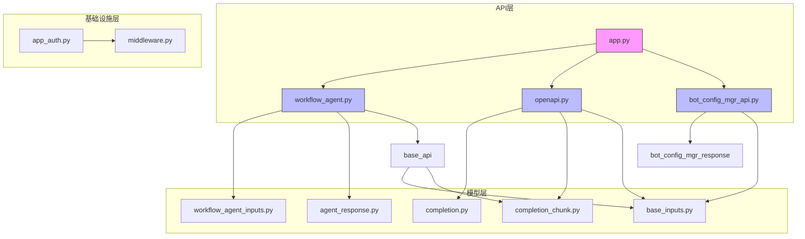
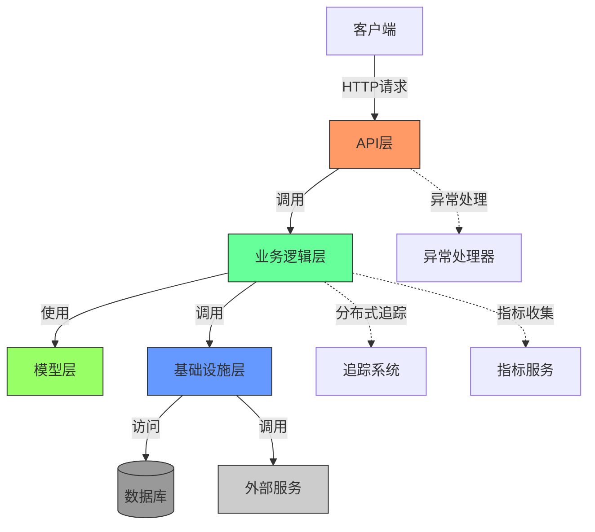
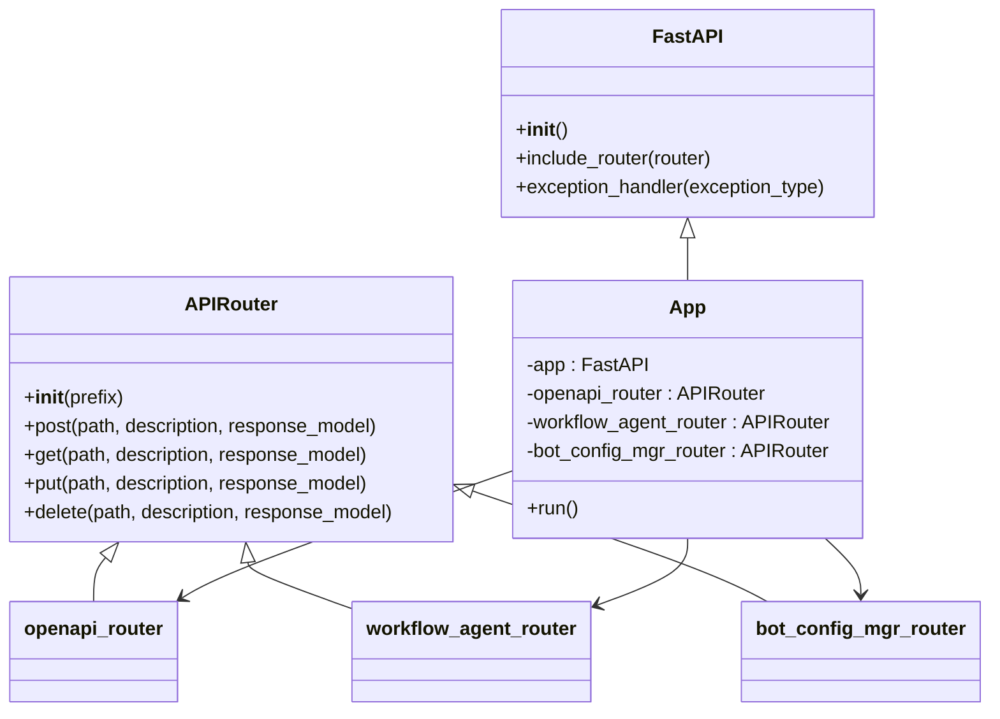
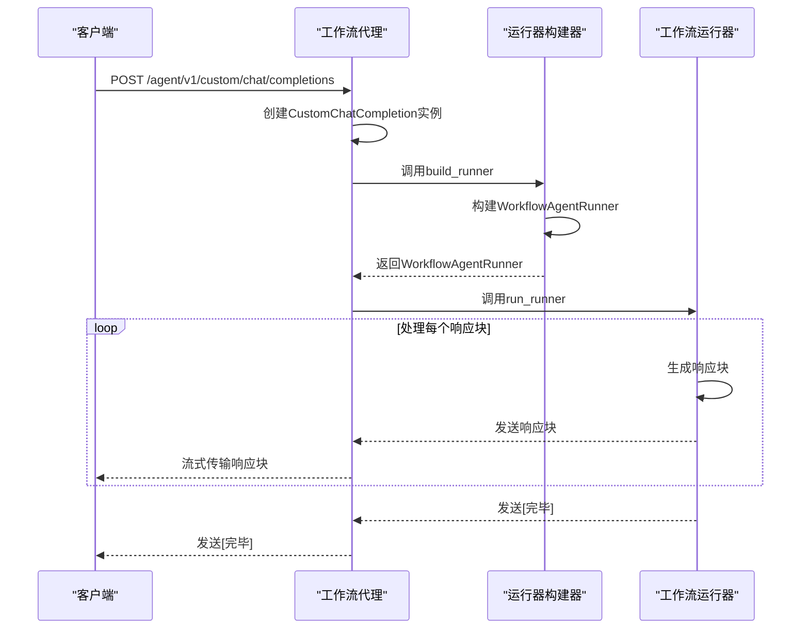
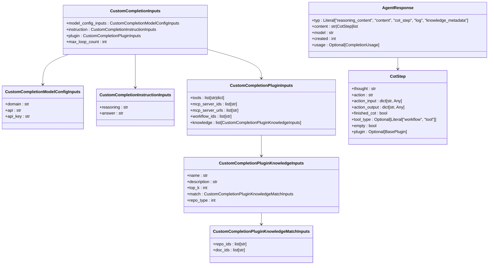
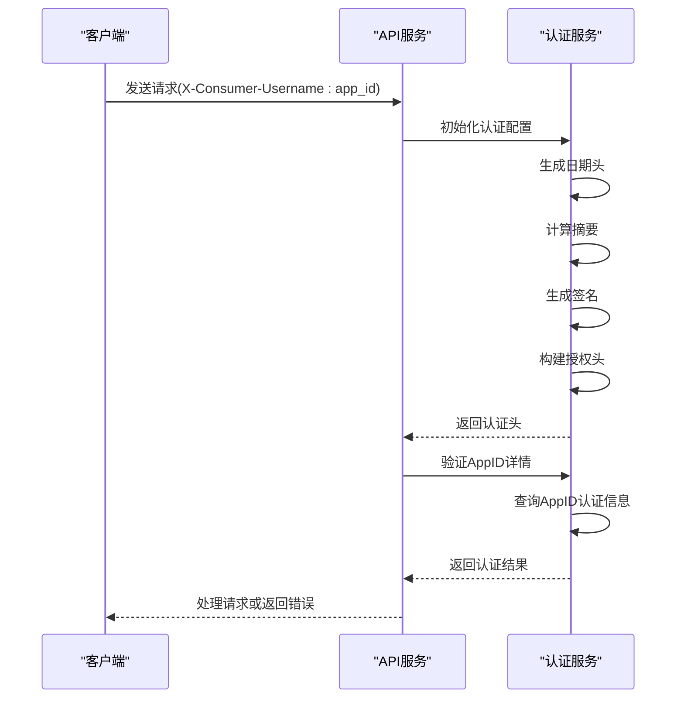
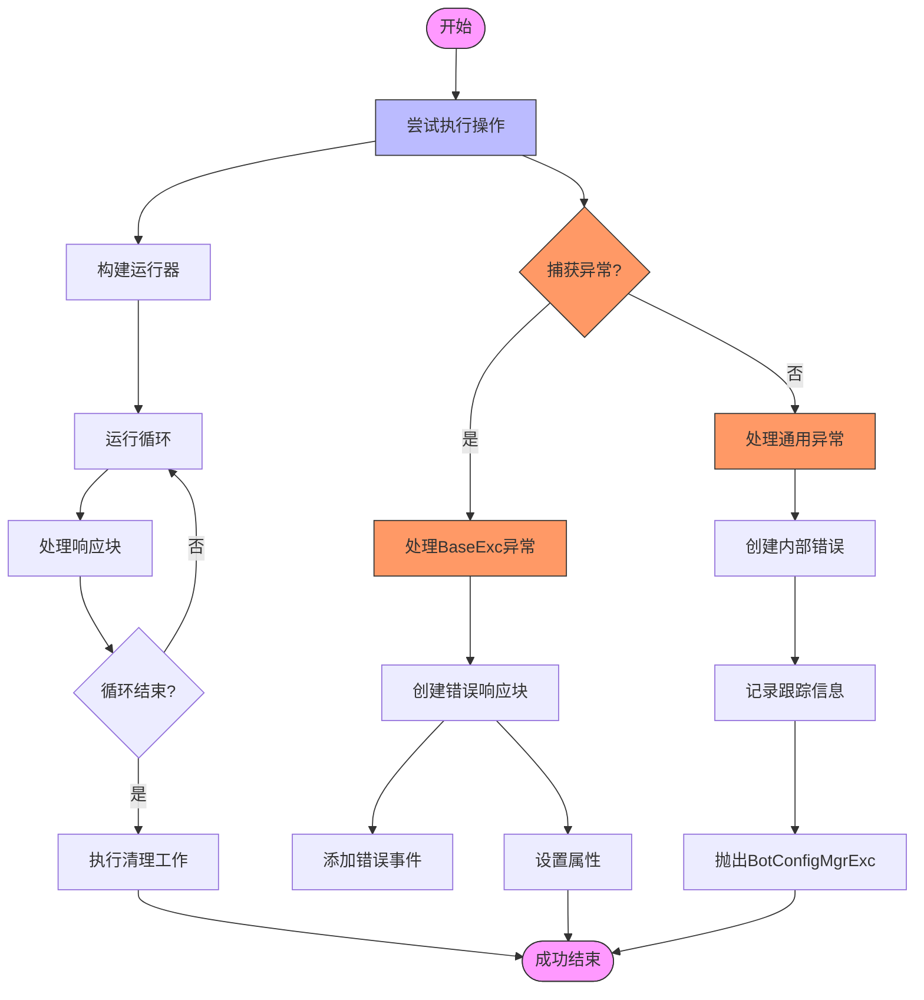
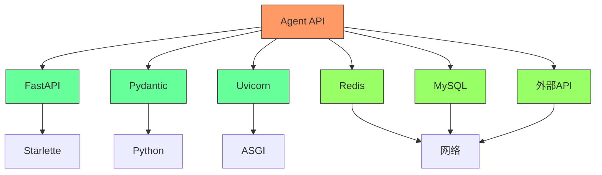

# API接口

<cite>
**本文档引用的文件**
- [app.py](file://core/agent/api/app.py)
- [workflow_agent.py](file://core/agent/api/v1/workflow_agent.py)
- [workflow_agent_inputs.py](file://core/agent/api/schemas/workflow_agent_inputs.py)
- [agent_response.py](file://core/agent/api/schemas/agent_response.py)
- [base_api.py](file://core/agent/api/v1/base_api.py)
- [base_inputs.py](file://core/agent/api/schemas/base_inputs.py)
- [completion.py](file://core/agent/api/schemas/completion.py)
- [completion_chunk.py](file://core/agent/api/schemas/completion_chunk.py)
- [bot_config_mgr_api.py](file://core/agent/api/v1/bot_config_mgr_api.py)
- [openapi.py](file://core/agent/api/v1/openapi.py)
- [middleware.py](file://core/agent/infra/config/middleware.py)
- [app_auth.py](file://core/agent/infra/app_auth.py)
- [codes.py](file://core/agent/exceptions/codes.py)
- [bot_config_mgr_response.py](file://core/agent/api/schemas/bot_config_mgr_response.py)
</cite>

## 目录
1. [简介](#简介)
2. [项目结构](#项目结构)
3. [核心组件](#核心组件)
4. [架构概述](#架构概述)
5. [详细组件分析](#详细组件分析)
6. [依赖分析](#依赖分析)
7. [性能考虑](#性能考虑)
8. [故障排除指南](#故障排除指南)
9. [结论](#结论)

## 简介
本文档详细描述了Agent服务的RESTful API接口设计和端点规范。重点介绍了app.py中的应用初始化和路由注册机制，以及workflow_agent.py中工作流相关端点的实现。文档化了所有HTTP方法、URL路径、请求参数、请求体结构和响应格式。使用workflow_agent_inputs.py和agent_response.py中的Pydantic模型来定义请求和响应的完整数据结构。解释了认证机制、错误处理策略和状态码规范。提供了curl命令示例和Python客户端调用示例，展示如何创建、启动和监控工作流。包含API版本控制策略和向后兼容性考虑。

## 项目结构
Agent服务API位于core/agent/api目录下，采用分层架构设计。主要结构包括：

- **app.py**: 应用入口点，负责初始化FastAPI应用、异常处理和路由注册
- **v1/**: API版本1的端点实现，包含workflow_agent.py、openapi.py和bot_config_mgr_api.py
- **schemas/**: Pydantic模型定义，包括请求输入、响应结构和数据验证
- **utils/**: 工具函数和辅助类

API端点通过前缀/agent/v1进行版本控制，确保向后兼容性。



**图源**
- [app.py](file://core/agent/api/app.py#L1-L85)
- [workflow_agent.py](file://core/agent/api/v1/workflow_agent.py#L1-L106)
- [openapi.py](file://core/agent/api/v1/openapi.py#L1-L210)
- [bot_config_mgr_api.py](file://core/agent/api/v1/bot_config_mgr_api.py#L1-L212)

**节源**
- [app.py](file://core/agent/api/app.py#L1-L85)
- [workflow_agent.py](file://core/agent/api/v1/workflow_agent.py#L1-L106)
- [openapi.py](file://core/agent/api/v1/openapi.py#L1-L210)
- [bot_config_mgr_api.py](file://core/agent/api/v1/bot_config_mgr_api.py#L1-L212)

## 核心组件
Agent服务API的核心组件包括应用初始化、路由注册、请求处理和响应生成。app.py负责初始化FastAPI应用并注册所有API路由。workflow_agent.py实现了工作流相关的端点，处理自定义聊天完成请求。base_api.py提供了基础的完成功能，包括运行上下文管理、错误处理和响应生成。所有请求和响应都通过Pydantic模型进行验证和序列化，确保数据完整性和类型安全。

**节源**
- [app.py](file://core/agent/api/app.py#L1-L85)
- [workflow_agent.py](file://core/agent/api/v1/workflow_agent.py#L1-L106)
- [base_api.py](file://core/agent/api/v1/base_api.py#L1-L227)

## 架构概述
Agent服务API采用分层架构，基于FastAPI框架构建。整体架构包括应用层、业务逻辑层、模型层和基础设施层。应用层负责HTTP请求的接收和响应的发送。业务逻辑层处理具体的业务规则和流程。模型层定义了所有数据结构和验证规则。基础设施层提供了认证、配置管理和日志记录等公共服务。



**图源**
- [app.py](file://core/agent/api/app.py#L1-L85)
- [workflow_agent.py](file://core/agent/api/v1/workflow_agent.py#L1-L106)
- [base_api.py](file://core/agent/api/v1/base_api.py#L1-L227)
- [app_auth.py](file://core/agent/infra/app_auth.py#L1-L194)

## 详细组件分析

### 应用初始化和路由注册
app.py是Agent服务的入口点，负责初始化FastAPI应用和注册所有API路由。它使用FastAPI框架创建应用实例，并注册自定义异常处理器来处理请求验证错误。应用通过include_router方法注册了三个主要的API路由器：openapi_router、workflow_agent_router和bot_config_mgr_router，分别处理开放API、工作流代理和机器人配置管理的请求。



**图源**
- [app.py](file://core/agent/api/app.py#L1-L85)

**节源**
- [app.py](file://core/agent/api/app.py#L1-L85)

### 工作流代理端点实现
workflow_agent.py实现了工作流代理的核心功能，提供自定义聊天完成端点。该端点接收用户请求，构建工作流代理运行器，并流式返回响应。CustomChatCompletion类继承自CompletionBase，实现了build_runner和do_complete方法，用于构建工作流代理运行器和执行代理。



**图源**
- [workflow_agent.py](file://core/agent/api/v1/workflow_agent.py#L1-L106)
- [base_api.py](file://core/agent/api/v1/base_api.py#L1-L227)

**节源**
- [workflow_agent.py](file://core/agent/api/v1/workflow_agent.py#L1-L106)

### 请求和响应数据结构
API使用Pydantic模型定义请求和响应的数据结构。workflow_agent_inputs.py定义了CustomCompletionInputs模型，包含模型配置、指令、插件和最大循环次数等字段。agent_response.py定义了AgentResponse模型，包含响应类型、内容、模型和创建时间等字段。这些模型确保了数据的类型安全和验证。



**图源**
- [workflow_agent_inputs.py](file://core/agent/api/schemas/workflow_agent_inputs.py#L1-L51)
- [agent_response.py](file://core/agent/api/schemas/agent_response.py#L1-L34)

**节源**
- [workflow_agent_inputs.py](file://core/agent/api/schemas/workflow_agent_inputs.py#L1-L51)
- [agent_response.py](file://core/agent/api/schemas/agent_response.py#L1-L34)

### 认证机制
API使用基于AppID的认证机制，通过HTTP头X-Consumer-Username传递AppID。app_auth.py实现了HMAC-SHA256签名认证，确保请求的完整性和真实性。认证配置包括主机、路由、协议、API密钥和密钥，这些配置从环境变量中读取。



**图源**
- [app_auth.py](file://core/agent/infra/app_auth.py#L1-L194)
- [middleware.py](file://core/agent/infra/config/middleware.py#L1-L64)

**节源**
- [app_auth.py](file://core/agent/infra/app_auth.py#L1-L194)

### 错误处理策略
API实现了统一的错误处理策略，使用自定义异常处理器处理请求验证错误。base_api.py中的_run_runner方法捕获所有异常，包括BaseExc和通用异常，并生成相应的错误响应。错误信息包括错误代码、消息和跟踪信息，便于调试和问题定位。



**图源**
- [base_api.py](file://core/agent/api/v1/base_api.py#L1-L227)
- [codes.py](file://core/agent/exceptions/codes.py#L1-L178)

**节源**
- [base_api.py](file://core/agent/api/v1/base_api.py#L1-L227)

### 状态码规范
API使用统一的状态码规范，定义在codes.py文件中。状态码分为多个类别，包括成功、客户端错误、服务器错误和授权错误。每个状态码都有对应的描述信息，便于理解和调试。

| 状态码 | 描述 |
|--------|------|
| 0 | 成功 |
| 10000-10999 | WebSocket相关错误 |
| 40000-40999 | 客户端错误 |
| 40040 | AppID认证信息查询失败 |
| 40500 | Agent内部服务错误 |

**图源**
- [codes.py](file://core/agent/exceptions/codes.py#L1-L178)

**节源**
- [codes.py](file://core/agent/exceptions/codes.py#L1-L178)

### API版本控制策略
API采用URL路径进行版本控制，所有端点都以/agent/v1为前缀。这种策略确保了向后兼容性，允许在不破坏现有客户端的情况下引入新功能。未来版本可以通过添加新的路径前缀（如/agent/v2）来实现。

```mermaid
graph TD
v1[/agent/v1] --> custom[custom/chat/completions]
v1 --> chat[chat/completions]
v1 --> bot-config[bot-config]
v2[/agent/v2] --> custom_v2[custom/chat/completions]
v2 --> chat_v2[chat/completions]
v2 --> bot-config_v2[bot-config]
v2 --> new-endpoint[new/endpoint]
style v1 fill:#f96,stroke:#333
style v2 fill:#6f9,stroke:#333
```

**图源**
- [app.py](file://core/agent/api/app.py#L1-L85)
- [workflow_agent.py](file://core/agent/api/v1/workflow_agent.py#L1-L106)
- [openapi.py](file://core/agent/api/v1/openapi.py#L1-L210)

**节源**
- [app.py](file://core/agent/api/app.py#L1-L85)

## 依赖分析
Agent服务API依赖于多个内部和外部组件。内部依赖包括FastAPI框架、Pydantic模型验证、Uvicorn服务器和各种基础设施服务。外部依赖包括数据库、缓存系统和第三方API服务。这些依赖通过依赖注入和配置管理进行管理，确保系统的可维护性和可扩展性。



**图源**
- [app.py](file://core/agent/api/app.py#L1-L85)
- [middleware.py](file://core/agent/infra/config/middleware.py#L1-L64)

**节源**
- [app.py](file://core/agent/api/app.py#L1-L85)
- [middleware.py](file://core/agent/infra/config/middleware.py#L1-L64)

## 性能考虑
Agent服务API在设计时考虑了性能优化。使用流式响应减少内存占用，通过异步处理提高并发性能，利用缓存减少数据库查询。分布式追踪和指标收集帮助识别性能瓶颈，优化系统性能。

## 故障排除指南
当遇到API调用问题时，首先检查请求格式是否正确，特别是JSON结构和字段类型。验证AppID和认证信息是否正确。查看响应中的错误代码和消息，根据文档中的状态码规范进行问题定位。使用分布式追踪系统查看请求的完整执行路径，识别问题所在。

**节源**
- [base_api.py](file://core/agent/api/v1/base_api.py#L1-L227)
- [codes.py](file://core/agent/exceptions/codes.py#L1-L178)

## 结论
Agent服务API提供了完整的RESTful接口，支持工作流代理、开放API和机器人配置管理功能。通过清晰的分层架构、严格的类型验证和统一的错误处理，确保了API的可靠性、安全性和可维护性。API版本控制策略保证了向后兼容性，支持系统的持续演进。