# Agent服务技术文档

<cite>
**本文档中引用的文件**
- [main.py](file://core/agent/main.py)
- [app.py](file://core/agent/api/app.py)
- [workflow_agent.py](file://core/agent/api/v1/workflow_agent.py)
- [workflow_agent_runner.py](file://core/agent/engine/workflow_agent_runner.py)
- [workflow_agent_builder.py](file://core/agent/service/builder/workflow_agent_builder.py)
- [mysql_client.py](file://core/agent/repository/mysql_client.py)
- [bot_config_client.py](file://core/agent/repository/bot_config_client.py)
- [base.py](file://core/agent/domain/models/base.py)
- [bot_config_table.py](file://core/agent/domain/models/bot_config_table.py)
- [base_builder.py](file://core/agent/service/builder/base_builder.py)
- [agent_exc.py](file://core/agent/exceptions/agent_exc.py)
- [middleware.py](file://core/agent/infra/config/middleware.py)
</cite>

## 目录
1. [简介](#简介)
2. [项目架构概览](#项目架构概览)
3. [应用初始化流程](#应用初始化流程)
4. [API层设计](#api层设计)
5. [工作流执行引擎](#工作流执行引擎)
6. [工作流构建器](#工作流构建器)
7. [数据访问层](#数据访问层)
8. [异常处理机制](#异常处理机制)
9. [配置管理](#配置管理)
10. [性能优化建议](#性能优化建议)
11. [故障排查指南](#故障排查指南)
12. [总结](#总结)

## 简介

Agent服务是astron-agent项目的核心组件，负责协调和管理智能对话代理的完整生命周期。该服务采用模块化架构设计，通过FastAPI框架提供RESTful API接口，支持复杂的工作流编排和多模态交互能力。

### 核心特性

- **工作流驱动架构**：基于节点式工作流引擎，支持复杂的业务逻辑编排
- **多模态插件系统**：集成知识库、工具链、MCP服务器等多种外部资源
- **分布式缓存策略**：结合Redis和MySQL实现高效的数据缓存和持久化
- **实时流式响应**：支持WebSocket和Server-Sent Events的实时通信
- **可观测性支持**：内置分布式追踪、指标收集和日志记录

## 项目架构概览

Agent服务采用分层架构设计，清晰分离关注点，确保系统的可维护性和扩展性。

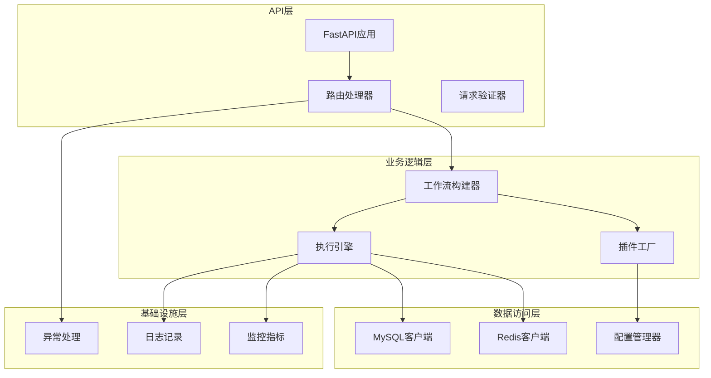

**图表来源**
- [app.py](file://core/agent/api/app.py#L1-L85)
- [workflow_agent_builder.py](file://core/agent/service/builder/workflow_agent_builder.py#L1-L231)
- [workflow_agent_runner.py](file://core/agent/engine/workflow_agent_runner.py#L1-L6)

## 应用初始化流程

Agent服务的启动过程经过精心设计，确保所有依赖项正确初始化并建立连接。

### 初始化序列图

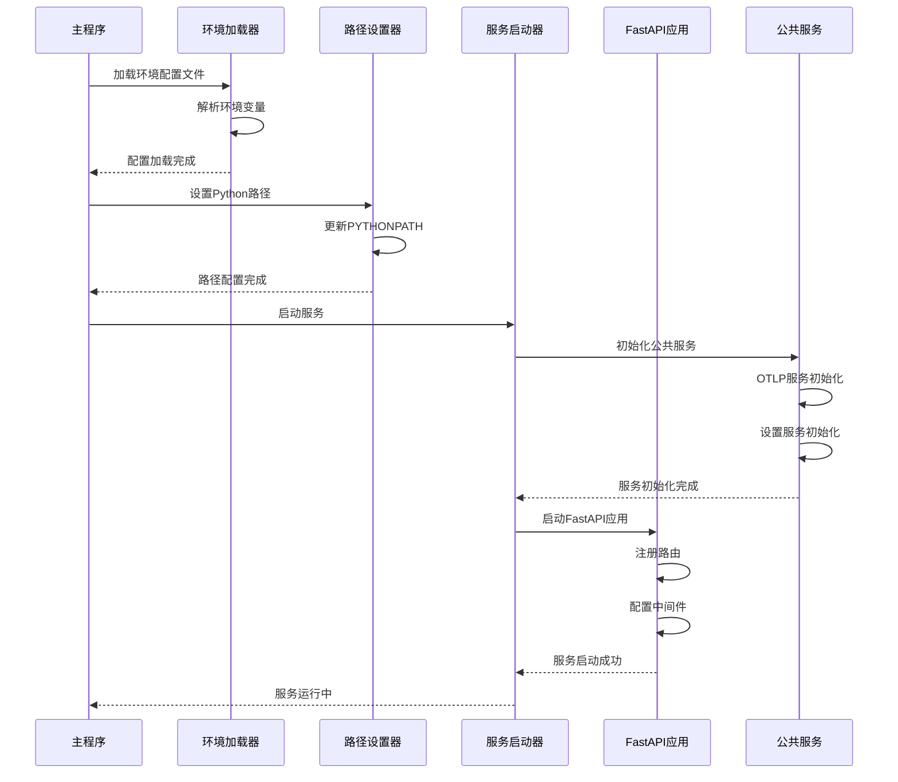

**图表来源**
- [main.py](file://core/agent/main.py#L1-L110)
- [app.py](file://core/agent/api/app.py#L40-L85)

### 关键初始化步骤

1. **环境配置加载**：从`.env`文件读取配置参数，支持注释和格式验证
2. **Python路径设置**：动态调整PYTHONPATH以支持模块导入
3. **公共服务初始化**：启动OTLP分布式追踪、指标收集等基础设施服务
4. **FastAPI应用启动**：配置服务器参数并注册所有API路由

**章节来源**
- [main.py](file://core/agent/main.py#L1-L110)
- [app.py](file://core/agent/api/app.py#L40-L85)

## API层设计

API层采用FastAPI框架构建，提供高性能的RESTful API服务，支持异步处理和自动文档生成。

### 路由设计架构

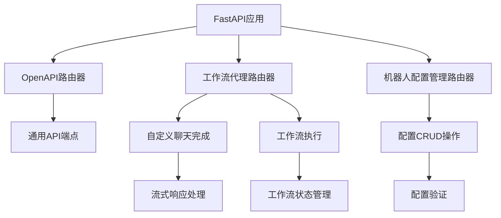

**图表来源**
- [app.py](file://core/agent/api/app.py#L30-L35)
- [workflow_agent.py](file://core/agent/api/v1/workflow_agent.py#L1-L106)

### 请求处理流程

工作流代理API的请求处理遵循严格的验证和执行流程：

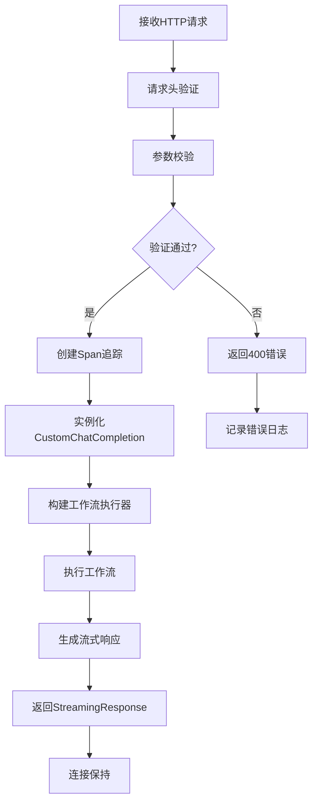

**图表来源**
- [workflow_agent.py](file://core/agent/api/v1/workflow_agent.py#L50-L106)

### 响应格式规范

API响应采用统一的流式JSON格式，支持实时数据传输：

| 字段名 | 类型 | 描述 | 必需 |
|--------|------|------|------|
| code | int | 响应状态码 | 是 |
| message | string | 错误消息（如有） | 否 |
| id | string | 请求唯一标识 | 是 |
| choices | array | 对话选择项数组 | 是 |
| created | int | 创建时间戳 | 是 |
| model | string | 使用的模型名称 | 是 |
| object | string | 对象类型标识 | 是 |

**章节来源**
- [workflow_agent.py](file://core/agent/api/v1/workflow_agent.py#L1-L106)

## 工作流执行引擎

工作流执行引擎是Agent服务的核心组件，负责协调各个节点的执行顺序和状态转换。

### 执行引擎架构

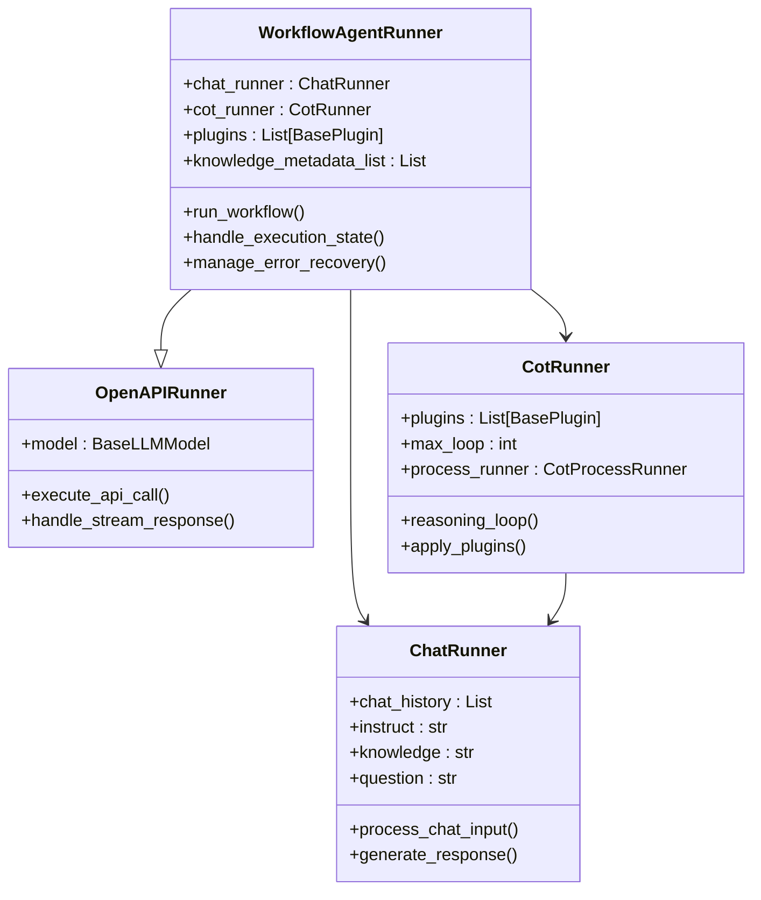

**图表来源**
- [workflow_agent_runner.py](file://core/agent/engine/workflow_agent_runner.py#L1-L6)
- [base_builder.py](file://core/agent/service/builder/base_builder.py#L1-L307)

### 任务调度机制

工作流执行引擎采用事件驱动的调度模式，支持并发和串行任务组合：

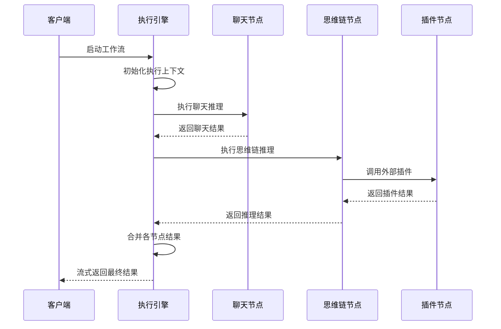

**图表来源**
- [workflow_agent_builder.py](file://core/agent/service/builder/workflow_agent_builder.py#L20-L50)

### 状态管理策略

执行引擎维护复杂的状态管理系统，确保工作流的可靠执行：

| 状态类型 | 描述 | 持久化策略 | 恢复机制 |
|----------|------|------------|----------|
| 工作流状态 | 当前执行阶段和进度 | 内存+Redis缓存 | 自动重试 |
| 节点状态 | 各节点的执行情况 | 数据库记录 | 断点续传 |
| 插件状态 | 外部插件的调用状态 | 实时跟踪 | 超时重试 |
| 错误状态 | 异常发生的位置和原因 | 日志记录 | 错误恢复 |

**章节来源**
- [workflow_agent_runner.py](file://core/agent/engine/workflow_agent_runner.py#L1-L6)
- [base_builder.py](file://core/agent/service/builder/base_builder.py#L1-L307)

## 工作流构建器

工作流构建器负责将用户配置转换为可执行的工作流实例，是连接配置层和执行层的关键桥梁。

### 构建流程架构

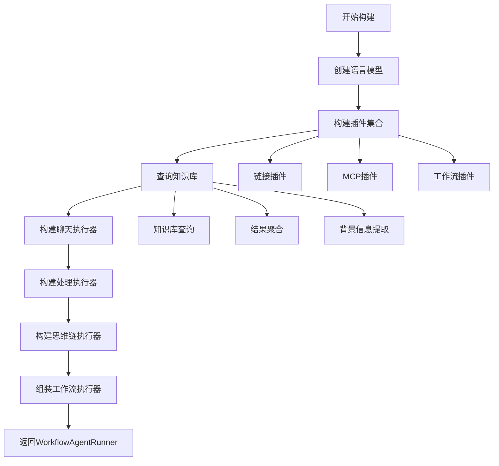

**图表来源**
- [workflow_agent_builder.py](file://core/agent/service/builder/workflow_agent_builder.py#L20-L50)

### 知识库查询优化

构建器实现了智能的知识库查询机制，支持多种RAG类型和查询策略：

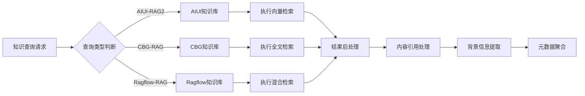

**图表来源**
- [workflow_agent_builder.py](file://core/agent/service/builder/workflow_agent_builder.py#L80-L120)

### 插件系统集成

工作流构建器支持三种类型的插件集成：

| 插件类型 | 实现方式 | 配置参数 | 执行时机 |
|----------|----------|----------|----------|
| 链接插件 | HTTP API调用 | tool_ids, base_url | 思维链推理阶段 |
| MCP插件 | WebSocket连接 | mcp_server_ids, urls | 实时交互阶段 |
| 工作流插件 | 内部递归调用 | workflow_ids | 嵌套执行阶段 |

**章节来源**
- [workflow_agent_builder.py](file://core/agent/service/builder/workflow_agent_builder.py#L1-L231)
- [base_builder.py](file://core/agent/service/builder/base_builder.py#L50-L100)

## 数据访问层

数据访问层采用分层设计，结合Redis缓存和MySQL持久化，提供高性能的数据存储和检索能力。

### 数据访问架构

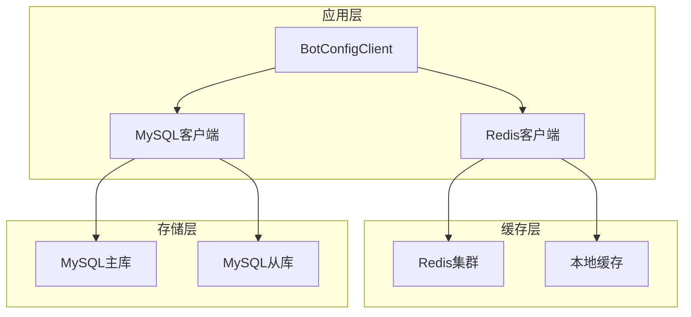

**图表来源**
- [bot_config_client.py](file://core/agent/repository/bot_config_client.py#L1-L311)
- [mysql_client.py](file://core/agent/repository/mysql_client.py#L1-L54)

### 缓存策略设计

数据访问层实现了多层次的缓存策略，优化读写性能：

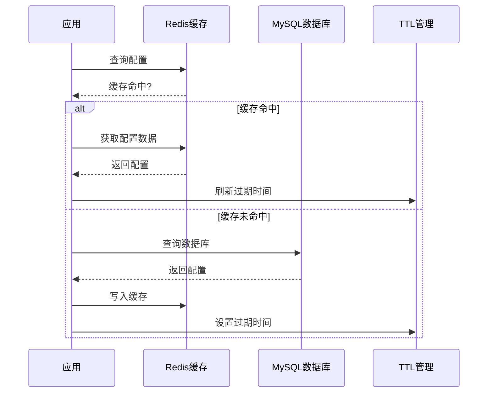

**图表来源**
- [bot_config_client.py](file://core/agent/repository/bot_config_client.py#L40-L80)

### 数据一致性保证

系统采用读写分离和事务管理确保数据一致性：

| 操作类型 | 读策略 | 写策略 | 一致性保证 |
|----------|--------|--------|------------|
| 配置读取 | Redis优先，降级到MySQL | 分布式锁 | 最终一致性 |
| 配置更新 | 先更新MySQL，再清除缓存 | 事务提交 | 强一致性 |
| 配置删除 | 标记删除，清理缓存 | 物理删除 | 强一致性 |
| 批量操作 | 事务包装 | 原子操作 | ACID特性 |

**章节来源**
- [mysql_client.py](file://core/agent/repository/mysql_client.py#L1-L54)
- [bot_config_client.py](file://core/agent/repository/bot_config_client.py#L1-L311)
- [bot_config_table.py](file://core/agent/domain/models/bot_config_table.py#L1-L45)

## 异常处理机制

Agent服务建立了完善的异常处理体系，确保系统的稳定性和用户体验。

### 异常分类体系

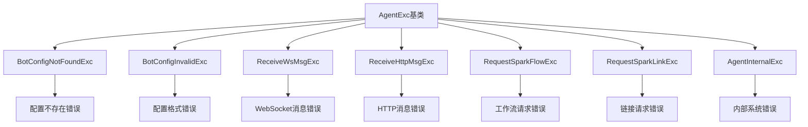

**图表来源**
- [agent_exc.py](file://core/agent/exceptions/agent_exc.py#L1-L27)

### 错误恢复策略

系统针对不同类型的错误采用相应的恢复策略：

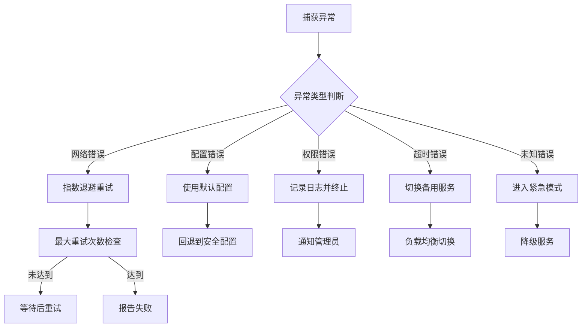

**图表来源**
- [base.py](file://core/agent/domain/models/base.py#L50-L124)

### 监控和告警

异常处理系统集成了完整的监控和告警机制：

| 监控维度 | 指标类型 | 告警阈值 | 处理动作 |
|----------|----------|----------|----------|
| 错误率 | 错误请求数/总请求数 | >5% | 自动扩容 |
| 响应时间 | P95响应时间 | >2秒 | 服务降级 |
| 系统可用性 | 正常响应比例 | <99.9% | 故障转移 |
| 资源使用率 | CPU/内存使用率 | >80% | 资源调度 |

**章节来源**
- [agent_exc.py](file://core/agent/exceptions/agent_exc.py#L1-L27)
- [base.py](file://core/agent/domain/models/base.py#L50-L124)

## 配置管理

Agent服务采用分层配置管理，支持环境隔离和动态配置更新。

### 配置层次结构

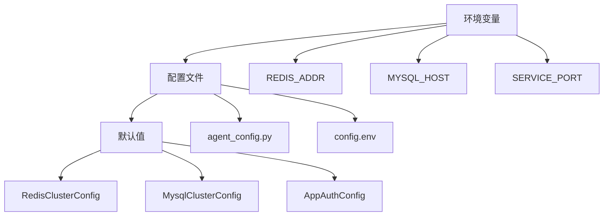

**图表来源**
- [middleware.py](file://core/agent/infra/config/middleware.py#L1-L64)

### 配置加载流程

配置系统采用延迟加载和验证机制，确保配置的有效性：

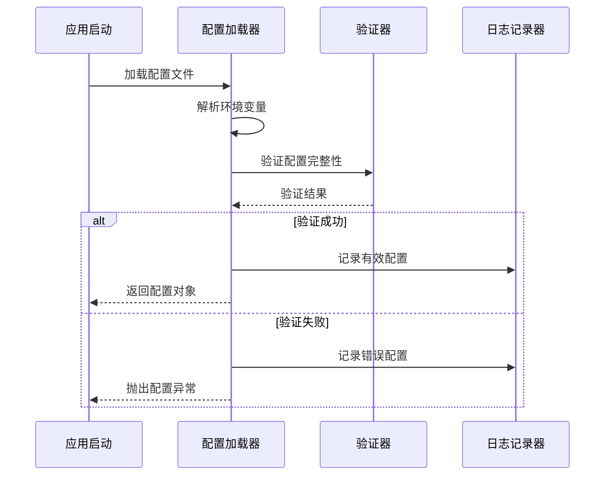

**图表来源**
- [main.py](file://core/agent/main.py#L10-L40)

### 动态配置更新

系统支持部分配置的热更新，无需重启服务：

| 配置类别 | 支持热更新 | 更新方式 | 影响范围 |
|----------|------------|----------|----------|
| 缓存配置 | 是 | 重新初始化客户端 | 全局 |
| 数据库连接 | 是 | 连接池重建 | 数据访问层 |
| 日志级别 | 是 | 动态调整 | 日志系统 |
| 服务端口 | 否 | 需要重启 | 整个服务 |
| 中间件配置 | 是 | 重新注册中间件 | API层 |

**章节来源**
- [middleware.py](file://core/agent/infra/config/middleware.py#L1-L64)
- [main.py](file://core/agent/main.py#L10-L40)

## 性能优化建议

基于对Agent服务架构的理解，提出以下性能优化建议：

### 并发处理优化

1. **连接池配置**：合理设置MySQL连接池大小（推荐200-800），避免连接耗尽
2. **异步处理**：充分利用Python异步特性，减少I/O阻塞
3. **批量操作**：对频繁的小查询进行批量合并处理

### 缓存策略优化

1. **预热机制**：在低峰期预热热点配置数据
2. **分层缓存**：结合本地缓存和分布式缓存，减少网络开销
3. **智能过期**：根据数据访问频率设置不同的TTL

### 数据库优化

1. **索引优化**：为常用查询字段建立复合索引
2. **读写分离**：配置主从复制，分散读压力
3. **慢查询监控**：定期分析和优化慢查询

## 故障排查指南

### 常见问题诊断

| 问题症状 | 可能原因 | 排查方法 | 解决方案 |
|----------|----------|----------|----------|
| 服务启动失败 | 环境变量缺失 | 检查config.env文件 | 补充必需配置 |
| 数据库连接超时 | 网络或配置错误 | 测试数据库连通性 | 检查连接参数 |
| Redis缓存失效 | 集群配置错误 | 验证Redis集群状态 | 修复集群配置 |
| 工作流执行失败 | 插件配置错误 | 检查插件依赖关系 | 更新插件配置 |

### 监控指标分析

关键监控指标包括：

1. **响应时间分布**：P50、P95、P99响应时间趋势
2. **错误率统计**：各类错误的发生频率和占比
3. **资源使用率**：CPU、内存、网络带宽使用情况
4. **队列长度**：待处理请求的数量变化

### 日志分析技巧

有效的日志分析可以帮助快速定位问题：

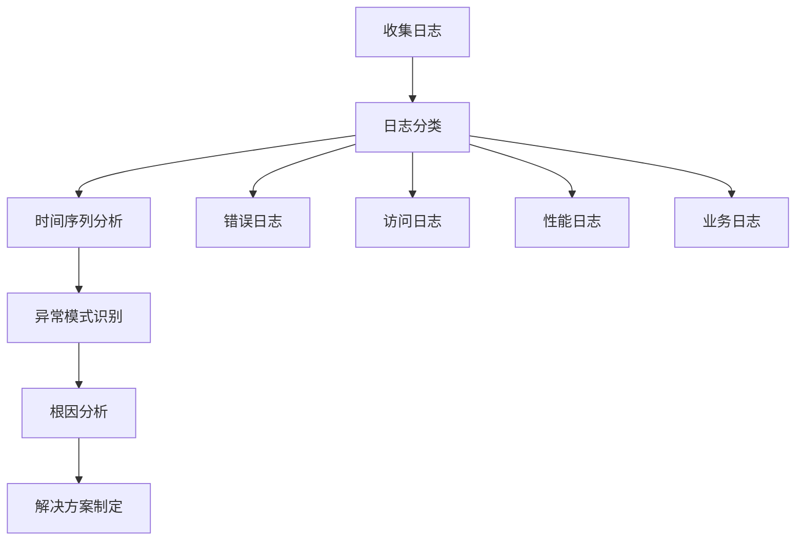

## 总结

Agent服务作为astron-agent项目的核心组件，展现了现代微服务架构的最佳实践。通过模块化设计、分层架构和完善的异常处理机制，该服务能够稳定地支撑复杂的智能对话场景。

### 技术亮点

1. **工作流驱动**：灵活的工作流编排能力，支持复杂的业务逻辑
2. **多模态集成**：统一的插件系统，支持多种外部资源接入
3. **高性能设计**：多层次缓存和异步处理，确保高并发性能
4. **可观测性**：完整的监控和日志体系，便于运维和故障排查

### 发展方向

未来可以考虑以下优化方向：

1. **智能化调度**：基于机器学习的资源调度和负载均衡
2. **边缘计算支持**：在边缘节点部署轻量化Agent实例
3. **联邦学习集成**：支持跨域知识共享和模型训练
4. **量子计算适配**：为特定场景提供量子加速能力

Agent服务的设计充分体现了软件工程的最佳实践，为构建可扩展、可维护的智能系统提供了坚实的基础。