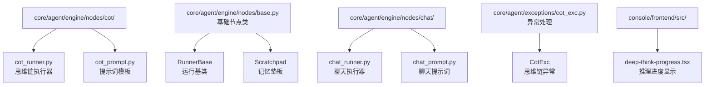
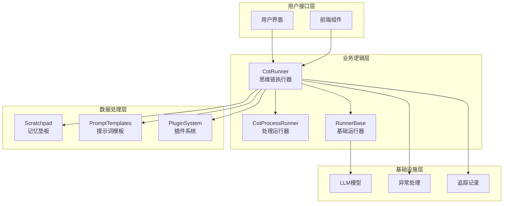
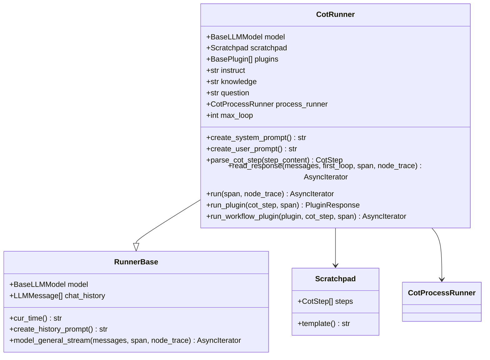
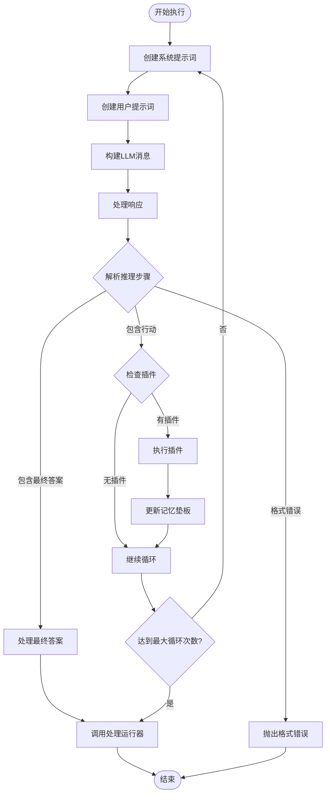
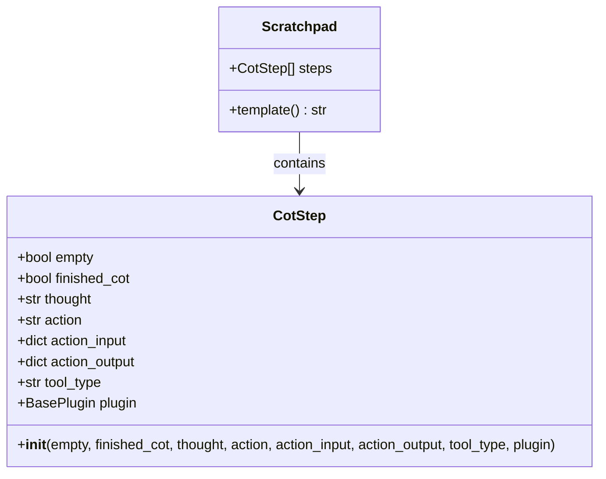
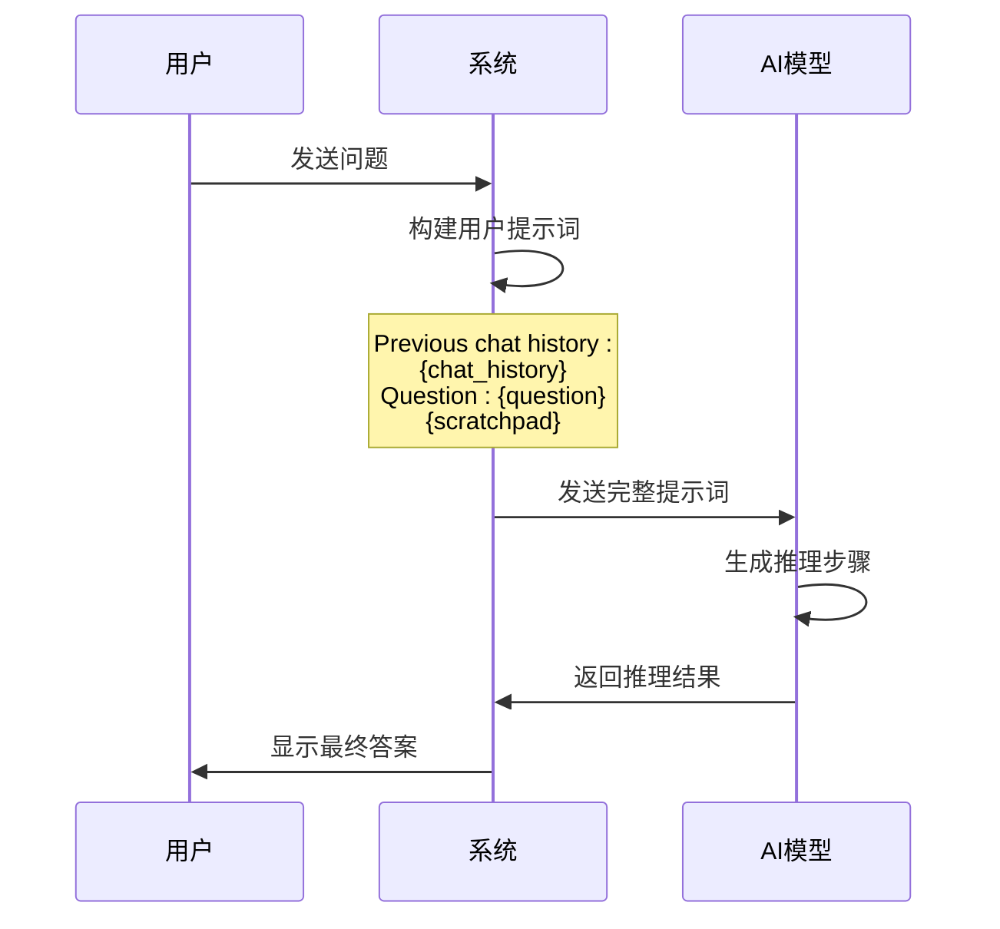
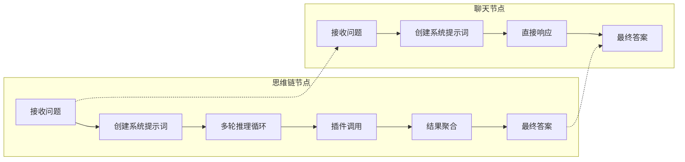
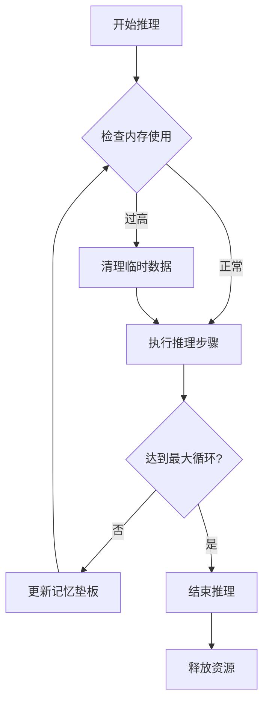
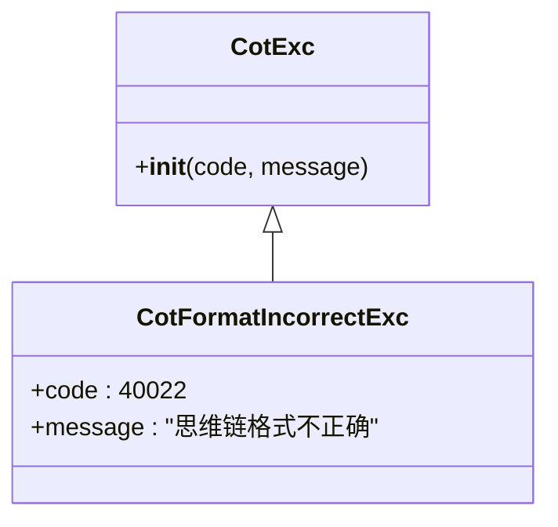

# 思维链节点技术文档

<cite>
**本文档中引用的文件**
- [cot_runner.py](file://core/agent/engine/nodes/cot/cot_runner.py)
- [cot_prompt.py](file://core/agent/engine/nodes/cot/cot_prompt.py)
- [base.py](file://core/agent/engine/nodes/base.py)
- [chat_runner.py](file://core/agent/engine/nodes/chat/chat_runner.py)
- [chat_prompt.py](file://core/agent/engine/nodes/chat/chat_prompt.py)
- [cot_exc.py](file://core/agent/exceptions/cot_exc.py)
- [deep-think-progress.tsx](file://console/frontend/src/pages/chat-page/components/deep-think-progress.tsx)
</cite>

## 目录
1. [简介](#简介)
2. [项目结构](#项目结构)
3. [核心组件](#核心组件)
4. [架构概览](#架构概览)
5. [详细组件分析](#详细组件分析)
6. [思维链提示词模板](#思维链提示词模板)
7. [与聊天节点的差异](#与聊天节点的差异)
8. [配置和使用示例](#配置和使用示例)
9. [性能考量和优化建议](#性能考量和优化建议)
10. [故障排除指南](#故障排除指南)
11. [结论](#结论)

## 简介

思维链节点（Chain of Thought, CoT）是一种先进的AI推理机制，通过分解复杂问题为多个中间推理步骤，逐步引导模型得出最终答案。在astron-agent框架中，思维链节点实现了复杂的多步推理能力，特别适用于需要深度分析、逻辑推理和工具调用的任务场景。

思维链节点的核心优势在于：
- **透明推理过程**：每个推理步骤都清晰可见，便于调试和理解
- **模块化设计**：支持插件系统，可灵活扩展工具集
- **循环迭代**：通过多次迭代优化推理结果
- **错误恢复**：具备完善的异常处理和错误恢复机制

## 项目结构

思维链节点在项目中的组织结构如下：



**图表来源**
- [cot_runner.py](file://core/agent/engine/nodes/cot/cot_runner.py#L1-L50)
- [base.py](file://core/agent/engine/nodes/base.py#L1-L30)
- [chat_runner.py](file://core/agent/engine/nodes/chat/chat_runner.py#L1-L20)

**章节来源**
- [cot_runner.py](file://core/agent/engine/nodes/cot/cot_runner.py#L1-L489)
- [base.py](file://core/agent/engine/nodes/base.py#L1-L160)

## 核心组件

思维链节点由以下核心组件构成：

### CotRunner 类
CotRunner 是思维链节点的主要执行器，负责协调整个推理流程。它继承自 RunnerBase 基础类，提供了完整的思维链执行能力。

### 提示词模板系统
包含系统提示词和用户提示词两部分，定义了思维链的推理格式和交互规范。

### Scratchpad 记忆垫板
用于存储推理过程中的中间步骤，支持动态扩展和查询。

### 插件系统
支持多种类型的插件，包括工具插件、工作流插件和MCP插件。

**章节来源**
- [cot_runner.py](file://core/agent/engine/nodes/cot/cot_runner.py#L30-L80)
- [base.py](file://core/agent/engine/nodes/base.py#L140-L160)

## 架构概览

思维链节点的整体架构采用分层设计，确保了良好的可扩展性和维护性：



**图表来源**
- [cot_runner.py](file://core/agent/engine/nodes/cot/cot_runner.py#L30-L60)
- [base.py](file://core/agent/engine/nodes/base.py#L20-L50)

## 详细组件分析

### CotRunner 执行器分析

CotRunner 是思维链节点的核心执行器，实现了复杂的多步推理逻辑：



**图表来源**
- [cot_runner.py](file://core/agent/engine/nodes/cot/cot_runner.py#L30-L80)
- [base.py](file://core/agent/engine/nodes/base.py#L20-L50)

#### 核心执行流程

思维链节点的执行遵循严格的循环迭代模式：



**图表来源**
- [cot_runner.py](file://core/agent/engine/nodes/cot/cot_runner.py#L400-L489)

**章节来源**
- [cot_runner.py](file://core/agent/engine/nodes/cot/cot_runner.py#L30-L150)

### Scratchpad 记忆垫板

Scratchpad 负责存储和管理推理过程中的中间步骤，是思维链节点的核心记忆组件：



**图表来源**
- [base.py](file://core/agent/engine/nodes/base.py#L140-L160)

**章节来源**
- [base.py](file://core/agent/engine/nodes/base.py#L140-L160)

## 思维链提示词模板

思维链节点使用精心设计的提示词模板来指导AI进行推理：

### 系统提示词结构

系统提示词包含了完整的推理指导和格式要求：

| 组件 | 描述 | 示例 |
|------|------|------|
| 核心能力 | 定义AI的基本功能 | "能够根据用户之前的对话历史和新问题回答问题" |
| 环境信息 | 提供上下文时间信息 | "当前时间是2024-01-01 12:00:00" |
| 用户指令 | 用户的具体要求 | "请计算今天的日期" |
| 知识库信息 | 可选的知识参考 | "知识库提供了关于天气的信息" |
| 执行哲学 | 推理原则和方法论 | "采用逐步推理的方式解决问题" |
| 推理格式 | 必须遵循的格式规范 | "Thought: → Action: → Action Input: → Observation: → Final Answer:" |
| 可用工具 | 可调用的插件列表 | "计算器,搜索引擎,数据库查询" |

### 用户提示词模板

用户提示词定义了具体的对话上下文和问题：



**图表来源**
- [cot_prompt.py](file://core/agent/engine/nodes/cot/cot_prompt.py#L1-L73)

**章节来源**
- [cot_prompt.py](file://core/agent/engine/nodes/cot/cot_prompt.py#L1-L73)

## 与聊天节点的差异

思维链节点与传统的聊天节点在设计理念和实现方式上存在显著差异：

### 功能对比表

| 特性 | 思维链节点 | 聊天节点 |
|------|------------|----------|
| 推理方式 | 多步推理，逐步分解 | 直接回答，单次交互 |
| 输出格式 | 结构化推理步骤 | 自然语言回答 |
| 工具集成 | 支持插件调用和工具链 | 基础对话功能 |
| 循环迭代 | 多轮迭代优化 | 单轮响应 |
| 错误处理 | 完善的异常恢复 | 基础错误处理 |
| 适用场景 | 复杂问题解决 | 日常对话交流 |

### 架构差异图



**图表来源**
- [cot_runner.py](file://core/agent/engine/nodes/cot/cot_runner.py#L400-L489)
- [chat_runner.py](file://core/agent/engine/nodes/chat/chat_runner.py#L15-L40)

### 适用场景分析

#### 思维链节点适用场景
- **复杂数据分析**：需要多步骤的数据处理和分析
- **逻辑推理任务**：涉及因果关系和条件判断的问题
- **工具组合使用**：需要调用多个工具协同完成任务
- **深度知识查询**：需要检索和整合多个知识源
- **规划和决策**：需要制定详细计划和评估方案

#### 聊天节点适用场景  
- **日常咨询**：简单的信息查询和解答
- **情感交流**：需要同理心和情感共鸣的对话
- **快速问答**：即时性的信息获取
- **技术支持**：基本的操作指导和故障排查
- **娱乐互动**：轻松的对话和游戏

**章节来源**
- [cot_runner.py](file://core/agent/engine/nodes/cot/cot_runner.py#L1-L50)
- [chat_runner.py](file://core/agent/engine/nodes/chat/chat_runner.py#L1-L40)

## 配置和使用示例

### 基本配置示例

以下是思维链节点的基本配置和使用方法：

```python
# 基本配置示例路径
# 参考: core/agent/engine/nodes/cot/cot_runner.py#L30-L80
```

### 高级配置选项

| 配置项 | 类型 | 默认值 | 描述 |
|--------|------|--------|------|
| max_loop | int | 30 | 最大循环次数限制 |
| instruct | str | "" | 用户指令说明 |
| knowledge | str | "" | 知识库信息 |
| question | str | "" | 用户问题 |

### 插件集成示例

思维链节点支持多种类型的插件集成：

```python
# 插件集成示例路径
# 参考: core/agent/engine/nodes/cot/cot_runner.py#L450-L489
```

### 前端显示配置

前端组件提供了丰富的推理过程可视化：

```typescript
// 前端显示配置示例路径
// 参考: console/frontend/src/pages/chat-page/components/deep-think-progress.tsx#L1-L90
```

**章节来源**
- [cot_runner.py](file://core/agent/engine/nodes/cot/cot_runner.py#L30-L100)
- [deep-think-progress.tsx](file://console/frontend/src/pages/chat-page/components/deep-think-progress.tsx#L1-L90)

## 性能考量和优化建议

### 性能优化策略

#### 1. 循环次数控制
- 设置合理的 max_loop 值，避免无限循环
- 实现早停机制，在满足条件时提前退出

#### 2. 提示词优化
- 减少不必要的上下文信息
- 使用更精确的关键词匹配
- 缓存常用的提示词模板

#### 3. 并发处理
- 利用异步迭代器处理多个推理步骤
- 实现插件调用的并发执行
- 优化内存使用，及时清理临时数据

#### 4. 缓存机制
- 缓存重复的推理结果
- 实现插件调用结果缓存
- 建立知识库查询缓存

### 性能监控指标

| 指标 | 描述 | 监控方法 |
|------|------|----------|
| 推理时间 | 单个推理步骤耗时 | 时间戳记录 |
| 循环次数 | 实际执行的循环次数 | 计数器统计 |
| Token消耗 | LLM调用的Token使用量 | 使用量追踪 |
| 错误率 | 推理失败的比例 | 异常计数统计 |

### 内存优化建议



**图表来源**
- [cot_runner.py](file://core/agent/engine/nodes/cot/cot_runner.py#L400-L489)

**章节来源**
- [cot_runner.py](file://core/agent/engine/nodes/cot/cot_runner.py#L400-L489)

## 故障排除指南

### 常见问题及解决方案

#### 1. 思维链格式错误

**问题描述**：AI生成的推理步骤不符合预期格式

**解决方案**：
- 检查提示词模板的完整性
- 验证正则表达式匹配规则
- 添加格式验证和重试机制

#### 2. 插件调用失败

**问题描述**：无法正确识别或调用插件

**解决方案**：
- 确认插件名称匹配
- 检查插件参数格式
- 实现插件可用性检测

#### 3. 循环超时

**问题描述**：推理过程陷入无限循环

**解决方案**：
- 设置合理的 max_loop 限制
- 实现循环检测机制
- 添加超时保护

### 异常处理机制



**图表来源**
- [cot_exc.py](file://core/agent/exceptions/cot_exc.py#L1-L10)

### 调试技巧

#### 1. 启用详细日志
- 记录每个推理步骤的详细信息
- 监控插件调用的输入输出
- 追踪Token使用情况

#### 2. 分步验证
- 单独测试提示词模板
- 验证插件功能的正确性
- 检查数据序列化的准确性

#### 3. 性能分析
- 测量各阶段的执行时间
- 分析内存使用趋势
- 识别性能瓶颈

**章节来源**
- [cot_exc.py](file://core/agent/exceptions/cot_exc.py#L1-L10)
- [cot_runner.py](file://core/agent/engine/nodes/cot/cot_runner.py#L80-L120)

## 结论

思维链节点是astron-agent框架中的重要创新组件，它通过分解复杂问题、生成中间推理步骤和逐步优化答案，为AI系统带来了前所未有的推理能力。与传统的聊天节点相比，思维链节点在处理复杂任务、逻辑推理和工具集成方面具有明显优势。

### 主要优势总结

1. **透明性**：每个推理步骤都清晰可见，便于理解和调试
2. **灵活性**：支持多种插件和工具的组合使用
3. **可靠性**：完善的异常处理和错误恢复机制
4. **可扩展性**：模块化设计支持功能扩展和定制

### 应用前景

思维链节点特别适用于以下应用场景：
- **智能客服系统**：处理复杂的客户咨询和问题解决
- **数据分析平台**：进行多步骤的数据挖掘和分析
- **教育培训工具**：提供解题思路和学习指导
- **科研辅助系统**：协助研究人员进行文献检索和分析

随着AI技术的不断发展，思维链节点将在更多领域发挥重要作用，为用户提供更加智能和可靠的服务体验。