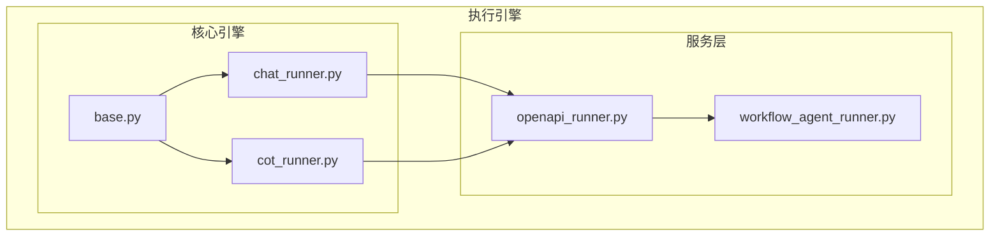
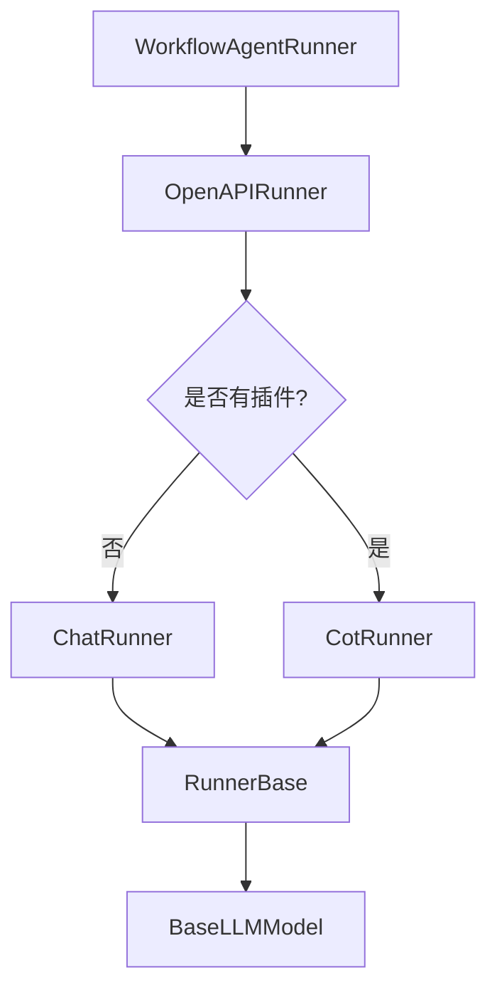
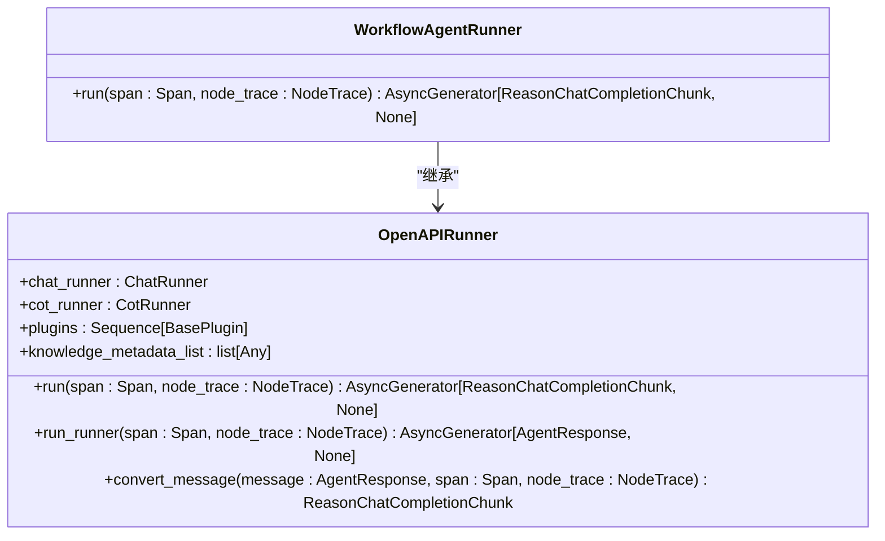
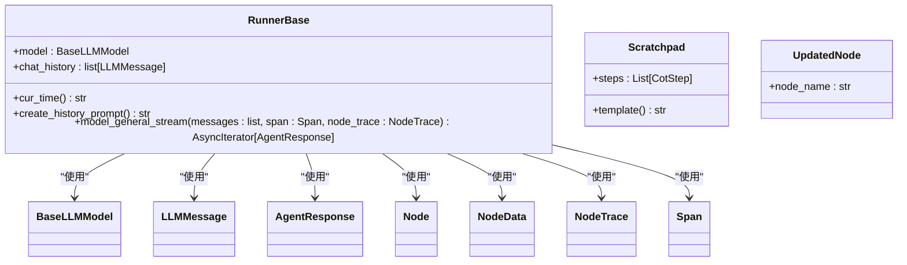
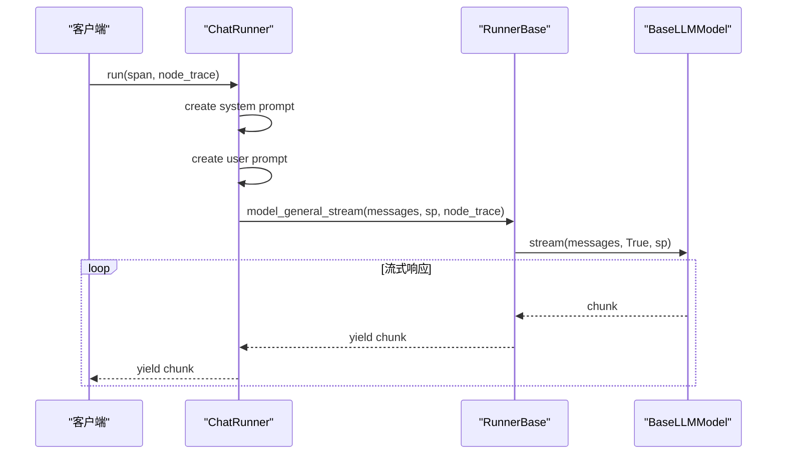
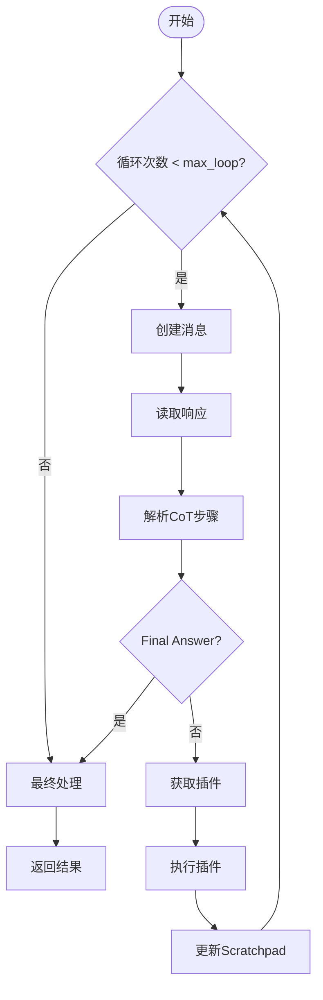
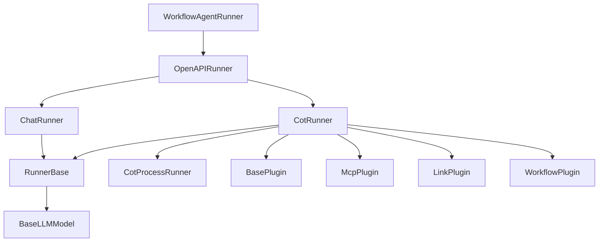

# 执行引擎

<cite>
**本文档中引用的文件**
- [workflow_agent_runner.py](file://core/agent/engine/workflow_agent_runner.py)
- [base.py](file://core/agent/engine/nodes/base.py)
- [chat_runner.py](file://core/agent/engine/nodes/chat/chat_runner.py)
- [cot_runner.py](file://core/agent/engine/nodes/cot/cot_runner.py)
- [openapi_runner.py](file://core/agent/service/runner/openapi_runner.py)
- [base.py](file://core/agent/domain/models/base.py)
- [chat_prompt.py](file://core/agent/engine/nodes/chat/chat_prompt.py)
- [cot_prompt.py](file://core/agent/engine/nodes/cot/cot_prompt.py)
- [agent_response.py](file://core/agent/api/schemas/agent_response.py)
- [node_trace_patch.py](file://core/agent/api/schemas/node_trace_patch.py)
</cite>

## 目录
1. [简介](#简介)
2. [项目结构](#项目结构)
3. [核心组件](#核心组件)
4. [架构概述](#架构概述)
5. [详细组件分析](#详细组件分析)
6. [依赖分析](#依赖分析)
7. [性能考虑](#性能考虑)
8. [故障排除指南](#故障排除指南)
9. [结论](#结论)

## 简介
本文档深入解析astron-agent项目中的执行引擎技术实现，重点分析工作流代理的执行逻辑。文档详细说明了工作流的执行流程，包括节点调度、上下文管理、状态跟踪和错误处理机制。通过分析chat_runner.py和cot_runner.py中不同类型节点的执行策略和差异，以及base.py中定义的节点基类和执行接口，全面揭示了执行引擎的内部工作机制。文档还提供了从接收到执行完成的完整工作流生命周期的序列图，解释了异步执行模型、超时处理和重试策略，并包含性能监控指标和优化建议。

## 项目结构
执行引擎的核心组件位于core/agent目录下，主要分为engine和service两个子模块。engine模块包含工作流执行的核心逻辑，包括节点基类、聊天节点和思维链节点的实现。service模块则负责执行器的管理和调度。这种分层架构使得执行引擎具有良好的可扩展性和可维护性。

**Diagram sources**
- [workflow_agent_runner.py](file://core/agent/engine/workflow_agent_runner.py)
- [openapi_runner.py](file://core/agent/service/runner/openapi_runner.py)
- [chat_runner.py](file://core/agent/engine/nodes/chat/chat_runner.py)
- [cot_runner.py](file://core/agent/engine/nodes/cot/cot_runner.py)
- [base.py](file://core/agent/engine/nodes/base.py)

**Section sources**
- [workflow_agent_runner.py](file://core/agent/engine/workflow_agent_runner.py)
- [openapi_runner.py](file://core/agent/service/runner/openapi_runner.py)

## 核心组件
执行引擎的核心组件包括工作流代理运行器、聊天运行器、思维链运行器和基础运行器。这些组件共同构成了一个完整的执行框架，支持不同类型的工作流执行需求。工作流代理运行器作为顶层执行器，负责协调整个工作流的执行过程。聊天运行器和思维链运行器则分别处理简单的聊天任务和复杂的多步推理任务。基础运行器提供了通用的执行功能，如模型流式处理和历史记录管理。

**Section sources**
- [workflow_agent_runner.py](file://core/agent/engine/workflow_agent_runner.py)
- [chat_runner.py](file://core/agent/engine/nodes/chat/chat_runner.py)
- [cot_runner.py](file://core/agent/engine/nodes/cot/cot_runner.py)
- [base.py](file://core/agent/engine/nodes/base.py)

## 架构概述
执行引擎采用分层架构设计，从上到下分为接口层、执行层和基础层。接口层由workflow_agent_runner.py实现，提供统一的执行接口。执行层包含openapi_runner.py，负责根据配置选择合适的执行策略。基础层由base.py、chat_runner.py和cot_runner.py组成，提供具体的执行逻辑。

**Diagram sources**
- [workflow_agent_runner.py](file://core/agent/engine/workflow_agent_runner.py)
- [openapi_runner.py](file://core/agent/service/runner/openapi_runner.py)
- [chat_runner.py](file://core/agent/engine/nodes/chat/chat_runner.py)
- [cot_runner.py](file://core/agent/engine/nodes/cot/cot_runner.py)
- [base.py](file://core/agent/engine/nodes/base.py)

## 详细组件分析

### 工作流代理运行器分析
工作流代理运行器是执行引擎的入口点，继承自OpenAPIRunner，负责启动和管理整个工作流的执行过程。

**Diagram sources**
- [workflow_agent_runner.py](file://core/agent/engine/workflow_agent_runner.py)
- [openapi_runner.py](file://core/agent/service/runner/openapi_runner.py)

**Section sources**
- [workflow_agent_runner.py](file://core/agent/engine/workflow_agent_runner.py)
- [openapi_runner.py](file://core/agent/service/runner/openapi_runner.py)

### 基础运行器分析
基础运行器(RunnerBase)定义了所有执行器的公共接口和功能，包括模型流式处理、历史记录管理和时间戳生成。

**Diagram sources**
- [base.py](file://core/agent/engine/nodes/base.py)
- [agent_response.py](file://core/agent/api/schemas/agent_response.py)
- [node_trace_patch.py](file://core/agent/api/schemas/node_trace_patch.py)

**Section sources**
- [base.py](file://core/agent/engine/nodes/base.py)

### 聊天运行器分析
聊天运行器(ChatRunner)负责处理简单的聊天任务，通过预定义的系统提示和用户提示模板生成响应。

**Diagram sources**
- [chat_runner.py](file://core/agent/engine/nodes/chat/chat_runner.py)
- [base.py](file://core/agent/engine/nodes/base.py)
- [base.py](file://core/agent/domain/models/base.py)

**Section sources**
- [chat_runner.py](file://core/agent/engine/nodes/chat/chat_runner.py)

### 思维链运行器分析
思维链运行器(CotRunner)负责处理复杂的多步推理任务，支持插件调用和循环执行。

**Diagram sources**
- [cot_runner.py](file://core/agent/engine/nodes/cot/cot_runner.py)

**Section sources**
- [cot_runner.py](file://core/agent/engine/nodes/cot/cot_runner.py)

## 依赖分析
执行引擎的组件之间存在清晰的依赖关系，形成了一个层次化的执行框架。顶层的WorkflowAgentRunner依赖于OpenAPIRunner，后者根据配置选择ChatRunner或CotRunner进行实际执行。ChatRunner和CotRunner都依赖于RunnerBase提供的基础功能，而RunnerBase又依赖于BaseLLMModel进行模型调用。

**Diagram sources**
- [workflow_agent_runner.py](file://core/agent/engine/workflow_agent_runner.py)
- [openapi_runner.py](file://core/agent/service/runner/openapi_runner.py)
- [chat_runner.py](file://core/agent/engine/nodes/chat/chat_runner.py)
- [cot_runner.py](file://core/agent/engine/nodes/cot/cot_runner.py)
- [base.py](file://core/agent/engine/nodes/base.py)
- [base.py](file://core/agent/domain/models/base.py)

**Section sources**
- [workflow_agent_runner.py](file://core/agent/engine/workflow_agent_runner.py)
- [openapi_runner.py](file://core/agent/service/runner/openapi_runner.py)
- [chat_runner.py](file://core/agent/engine/nodes/chat/chat_runner.py)
- [cot_runner.py](file://core/agent/engine/nodes/cot/cot_runner.py)
- [base.py](file://core/agent/engine/nodes/base.py)

## 性能考虑
执行引擎在设计时充分考虑了性能因素，采用了异步执行模型和流式处理机制。通过异步I/O操作，系统能够高效地处理并发请求，避免阻塞。流式处理允许客户端在服务器生成响应的同时逐步接收数据，提高了用户体验。此外，执行引擎还实现了详细的性能监控，包括令牌使用统计、执行时间和资源消耗等指标。

**Section sources**
- [base.py](file://core/agent/engine/nodes/base.py)
- [cot_runner.py](file://core/agent/engine/nodes/cot/cot_runner.py)

## 故障排除指南
当执行引擎出现问题时，可以按照以下步骤进行排查：

1. 检查日志输出，查看是否有错误信息或异常堆栈
2. 验证配置文件，确保所有必要的参数都已正确设置
3. 检查网络连接，确保能够访问所需的外部服务
4. 查看性能监控指标，识别潜在的性能瓶颈
5. 使用调试工具逐步执行工作流，定位问题发生的具体位置

常见的执行问题包括超时错误、插件调用失败和模型响应异常。对于超时错误，可以尝试增加超时时间或优化网络连接。对于插件调用失败，需要检查插件配置和权限设置。对于模型响应异常，可能需要调整提示模板或模型参数。

**Section sources**
- [base.py](file://core/agent/domain/models/base.py)
- [cot_runner.py](file://core/agent/engine/nodes/cot/cot_runner.py)
- [openapi_runner.py](file://core/agent/service/runner/openapi_runner.py)

## 结论
执行引擎通过分层架构和模块化设计，实现了灵活、可扩展的工作流执行能力。从简单的聊天任务到复杂的多步推理，执行引擎都能提供高效、可靠的执行支持。通过深入理解执行引擎的内部机制，开发者可以更好地利用其功能，构建出更智能、更强大的应用。