# 核心引擎技术文档

<cite>
**本文档中引用的文件**
- [workflow_agent_runner.py](file://core/agent/engine/workflow_agent_runner.py)
- [base.py](file://core/agent/domain/models/base.py)
- [nodes/base.py](file://core/agent/engine/nodes/base.py)
- [openapi_runner.py](file://core/agent/service/runner/openapi_runner.py)
- [common_imports.py](file://core/agent/common_imports.py)
- [workflow_agent_builder.py](file://core/agent/service/builder/workflow_agent_builder.py)
- [meter.py](file://core/common/otlp/metrics/meter.py)
- [span.py](file://core/common/otlp/trace/span.py)
</cite>

## 目录
1. [简介](#简介)
2. [项目结构](#项目结构)
3. [核心组件](#核心组件)
4. [架构概览](#架构概览)
5. [详细组件分析](#详细组件分析)
6. [依赖关系分析](#依赖关系分析)
7. [性能考虑](#性能考虑)
8. [故障排除指南](#故障排除指南)
9. [结论](#结论)

## 简介

Astron-Agent核心引擎是一个高度模块化的工作流执行系统，专门设计用于处理复杂的AI代理工作流。该系统采用异步执行模型，提供了强大的工作流编排能力、智能的节点调度机制、完善的上下文管理和状态跟踪功能，以及全面的错误处理和性能监控体系。

核心引擎的主要特点包括：
- 基于Python的异步工作流执行框架
- 模块化的节点设计和插件系统
- 完整的分布式追踪和指标收集
- 智能的资源管理和超时控制
- 可扩展的错误处理和重试机制

## 项目结构

核心引擎采用分层架构设计，主要分为以下几个层次：

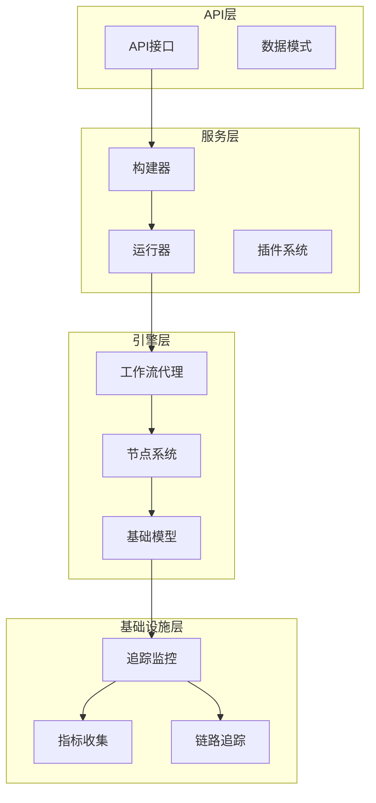

**图表来源**
- [workflow_agent_runner.py](file://core/agent/engine/workflow_agent_runner.py#L1-L6)
- [openapi_runner.py](file://core/agent/service/runner/openapi_runner.py#L1-L20)
- [common_imports.py](file://core/agent/common_imports.py#L1-L30)

**章节来源**
- [workflow_agent_runner.py](file://core/agent/engine/workflow_agent_runner.py#L1-L6)
- [openapi_runner.py](file://core/agent/service/runner/openapi_runner.py#L1-L231)
- [common_imports.py](file://core/agent/common_imports.py#L1-L77)

## 核心组件

### 工作流代理运行器

工作流代理运行器是整个系统的核心执行引擎，负责协调各个节点的执行和管理工作流的生命周期。

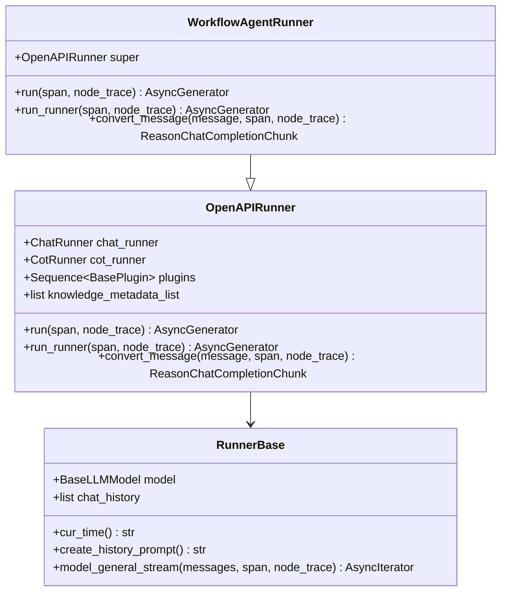

**图表来源**
- [workflow_agent_runner.py](file://core/agent/engine/workflow_agent_runner.py#L1-L6)
- [openapi_runner.py](file://core/agent/service/runner/openapi_runner.py#L20-L50)
- [nodes/base.py](file://core/agent/engine/nodes/base.py#L20-L60)

### 基础LLM模型

基础LLM模型提供了统一的大型语言模型接口，支持流式响应和完整的错误处理机制。

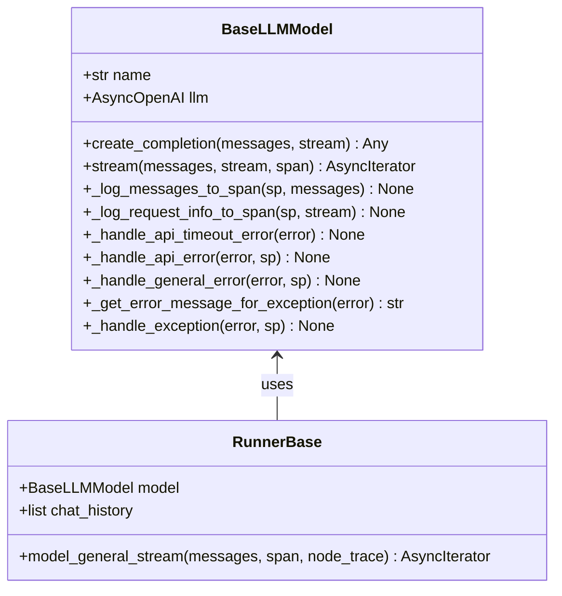

**图表来源**
- [base.py](file://core/agent/domain/models/base.py#L10-L50)
- [nodes/base.py](file://core/agent/engine/nodes/base.py#L20-L80)

**章节来源**
- [workflow_agent_runner.py](file://core/agent/engine/workflow_agent_runner.py#L1-L6)
- [base.py](file://core/agent/domain/models/base.py#L1-L124)
- [nodes/base.py](file://core/agent/engine/nodes/base.py#L1-L160)

## 架构概览

核心引擎采用事件驱动的异步架构，通过精心设计的组件层次结构实现高效的工作流执行。

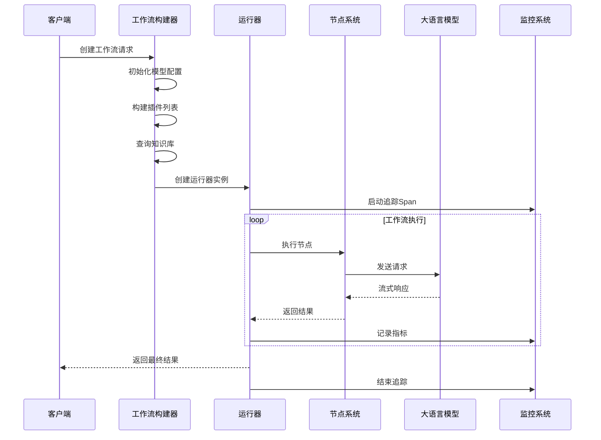

**图表来源**
- [workflow_agent_builder.py](file://core/agent/service/builder/workflow_agent_builder.py#L20-L80)
- [openapi_runner.py](file://core/agent/service/runner/openapi_runner.py#L30-L70)
- [span.py](file://core/common/otlp/trace/span.py#L40-L80)

## 详细组件分析

### 工作流初始化与构建

工作流的初始化过程涉及多个关键步骤，包括模型配置、插件构建、知识库查询等。

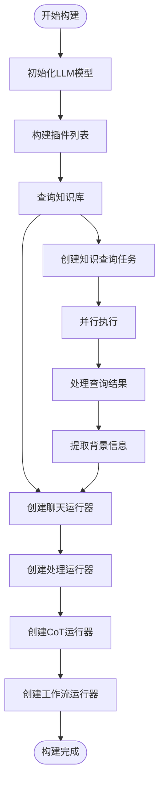

**图表来源**
- [workflow_agent_builder.py](file://core/agent/service/builder/workflow_agent_builder.py#L20-L80)

### 节点调度与执行

节点调度系统负责管理工作流中各个节点的执行顺序和状态转换。

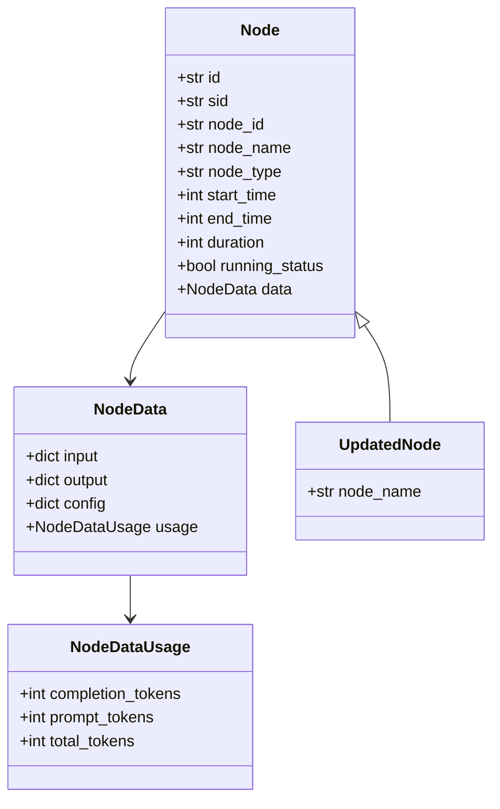

**图表来源**
- [nodes/base.py](file://core/agent/engine/nodes/base.py#L15-L40)
- [common_imports.py](file://core/agent/common_imports.py#L25-L35)

### 上下文管理

上下文管理系统确保工作流执行过程中的状态一致性和数据传递。

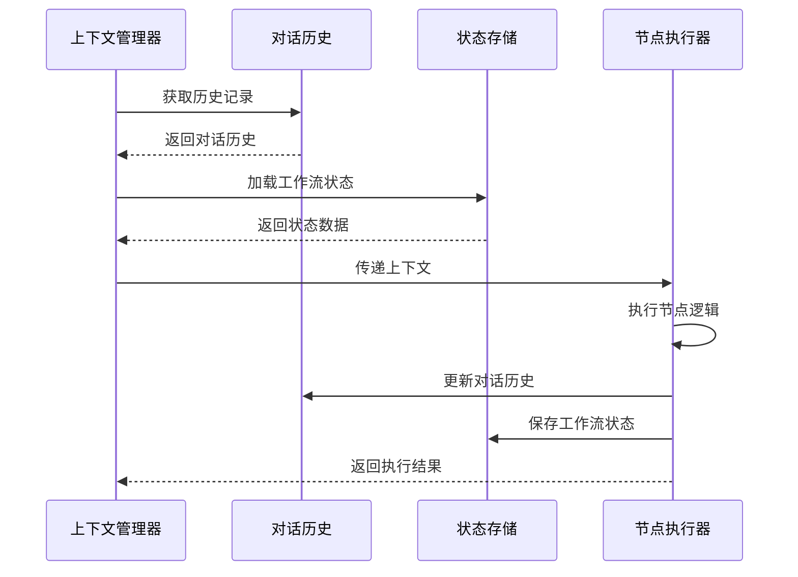

**图表来源**
- [nodes/base.py](file://core/agent/engine/nodes/base.py#L30-L50)

### 状态跟踪与监控

系统提供了完整的状态跟踪和监控机制，支持实时的工作流执行监控。

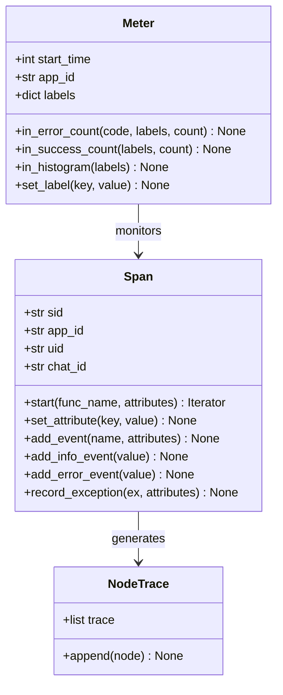

**图表来源**
- [span.py](file://core/common/otlp/trace/span.py#L20-L80)
- [meter.py](file://core/common/otlp/metrics/meter.py#L30-L90)

**章节来源**
- [workflow_agent_builder.py](file://core/agent/service/builder/workflow_agent_builder.py#L1-L231)
- [nodes/base.py](file://core/agent/engine/nodes/base.py#L1-L160)
- [span.py](file://core/common/otlp/trace/span.py#L1-L277)
- [meter.py](file://core/common/otlp/metrics/meter.py#L1-L132)

## 依赖关系分析

核心引擎的依赖关系体现了清晰的分层架构设计，每个层次都有明确的职责边界。

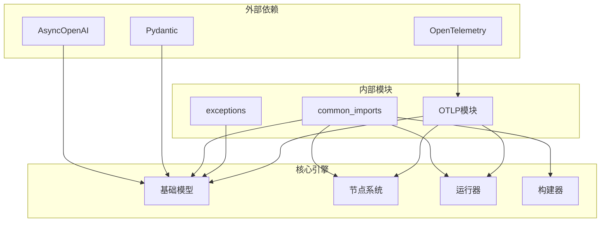

**图表来源**
- [base.py](file://core/agent/domain/models/base.py#L1-L10)
- [common_imports.py](file://core/agent/common_imports.py#L15-L30)
- [openapi_runner.py](file://core/agent/service/runner/openapi_runner.py#L1-L15)

**章节来源**
- [base.py](file://core/agent/domain/models/base.py#L1-L124)
- [common_imports.py](file://core/agent/common_imports.py#L1-L77)
- [openapi_runner.py](file://core/agent/service/runner/openapi_runner.py#L1-L231)

## 性能考虑

### 异步执行模型

系统采用完全异步的执行模型，能够高效处理大量并发请求。

- **流式响应处理**：支持实时的流式数据传输，减少等待时间
- **并发任务管理**：使用asyncio进行并发任务调度
- **内存优化**：采用生成器模式处理大数据流

### 超时与重试策略

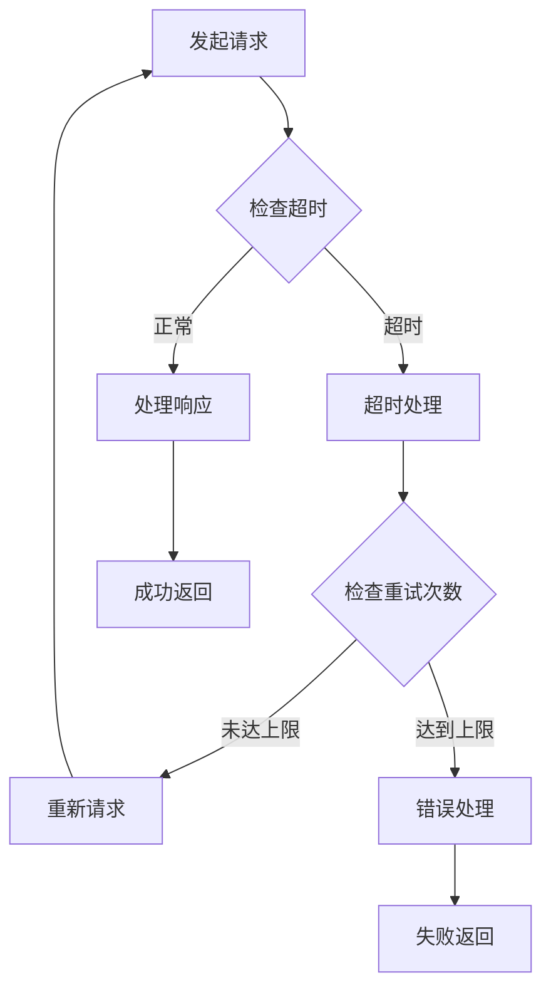

### 性能监控指标

系统提供了全面的性能监控指标：

| 指标类型 | 描述 | 收集方式 |
|---------|------|----------|
| 响应时间 | 工作流执行时间 | Span追踪 |
| 错误率 | 失败请求比例 | Meter计数 |
| 吞吐量 | 每秒处理请求数 | 时间窗口统计 |
| 资源使用 | CPU和内存占用 | 系统监控 |

### 优化建议

1. **连接池管理**：合理配置HTTP连接池大小
2. **缓存策略**：对频繁访问的数据实施缓存
3. **批量处理**：将小请求合并为批量操作
4. **预热机制**：提前加载常用模型和插件

## 故障排除指南

### 常见执行问题

#### 1. 模型连接失败

**症状**：API调用超时或连接被拒绝
**原因**：网络问题、认证失败、服务不可用
**解决方案**：
- 检查网络连接和防火墙设置
- 验证API密钥的有效性
- 查看服务健康状态

#### 2. 内存溢出

**症状**：工作流执行过程中出现内存不足错误
**原因**：大文件处理、递归深度过深、内存泄漏
**解决方案**：
- 实施流式处理替代全量加载
- 设置合理的递归深度限制
- 使用内存分析工具定位泄漏点

#### 3. 并发冲突

**症状**：工作流执行不稳定，出现竞态条件
**原因**：共享状态未正确同步
**解决方案**：
- 使用线程安全的数据结构
- 实施适当的锁机制
- 重构代码以减少共享状态

### 调试技巧

#### 1. 启用详细日志

```python
# 在调试模式下启用详细日志
import logging
logging.basicConfig(level=logging.DEBUG)
```

#### 2. 使用分布式追踪

```python
# 利用Span进行链路追踪
with span.start("DebugNodeExecution") as debug_span:
    # 执行调试代码
    debug_span.add_info_event("调试信息")
```

#### 3. 监控关键指标

```python
# 监控执行时间和错误率
meter = Meter(app_id="debug_app")
meter.in_histogram({"node_type": "debug"})
```

### 排查流程

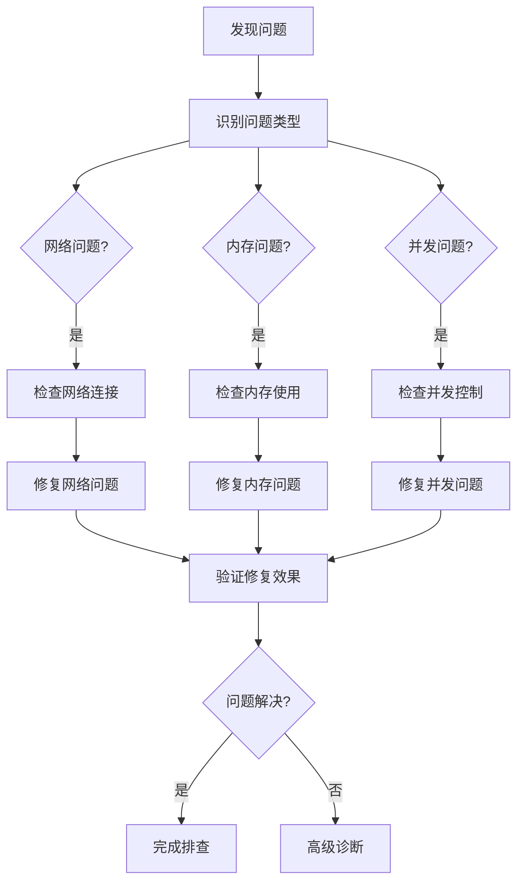

**章节来源**
- [base.py](file://core/agent/domain/models/base.py#L50-L124)
- [span.py](file://core/common/otlp/trace/span.py#L150-L277)
- [meter.py](file://core/common/otlp/metrics/meter.py#L50-L132)

## 结论

Astron-Agent核心引擎是一个设计精良、功能完备的工作流执行系统。它通过以下关键特性实现了高效的AI代理工作流管理：

### 核心优势

1. **模块化设计**：清晰的组件分离和接口定义，便于维护和扩展
2. **异步执行**：完全异步的架构设计，支持高并发处理
3. **完整监控**：基于OpenTelemetry的全面监控体系
4. **智能错误处理**：多层次的错误捕获和恢复机制
5. **可扩展性**：插件化的节点系统支持功能扩展

### 技术亮点

- **流式处理**：支持实时的数据流处理和响应
- **分布式追踪**：完整的链路追踪和性能监控
- **状态管理**：智能的工作流状态跟踪和恢复
- **资源优化**：高效的资源利用和内存管理

### 应用价值

该核心引擎为AI应用提供了强大的工作流编排能力，特别适用于：
- 复杂的AI代理系统
- 多步骤的任务自动化
- 实时的数据处理管道
- 微服务架构中的工作流编排

通过持续的优化和改进，该系统将继续为AI应用的发展提供坚实的技术支撑。