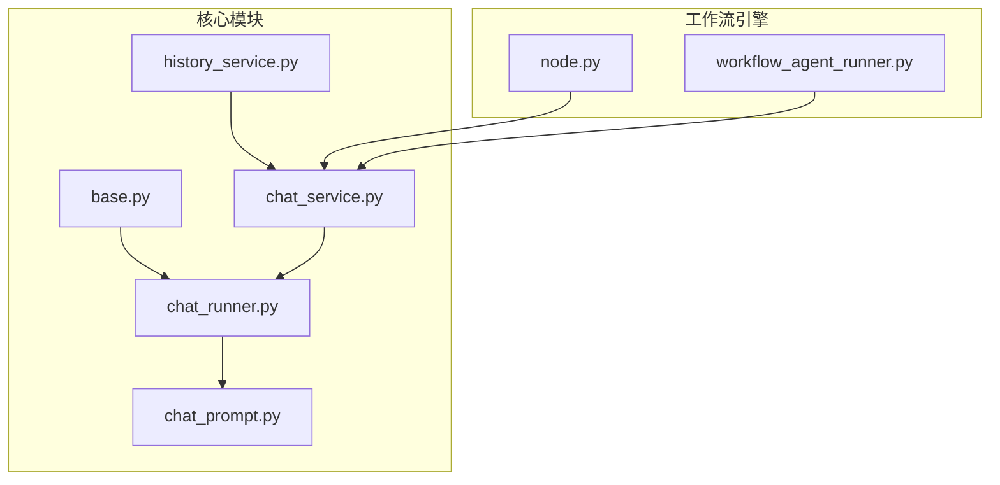
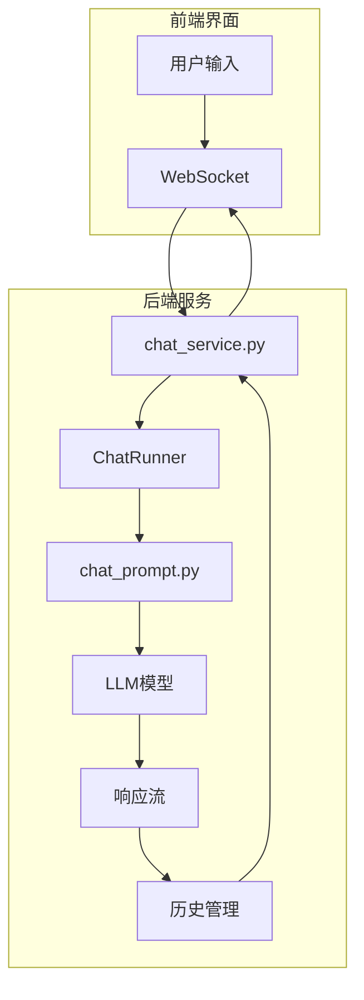
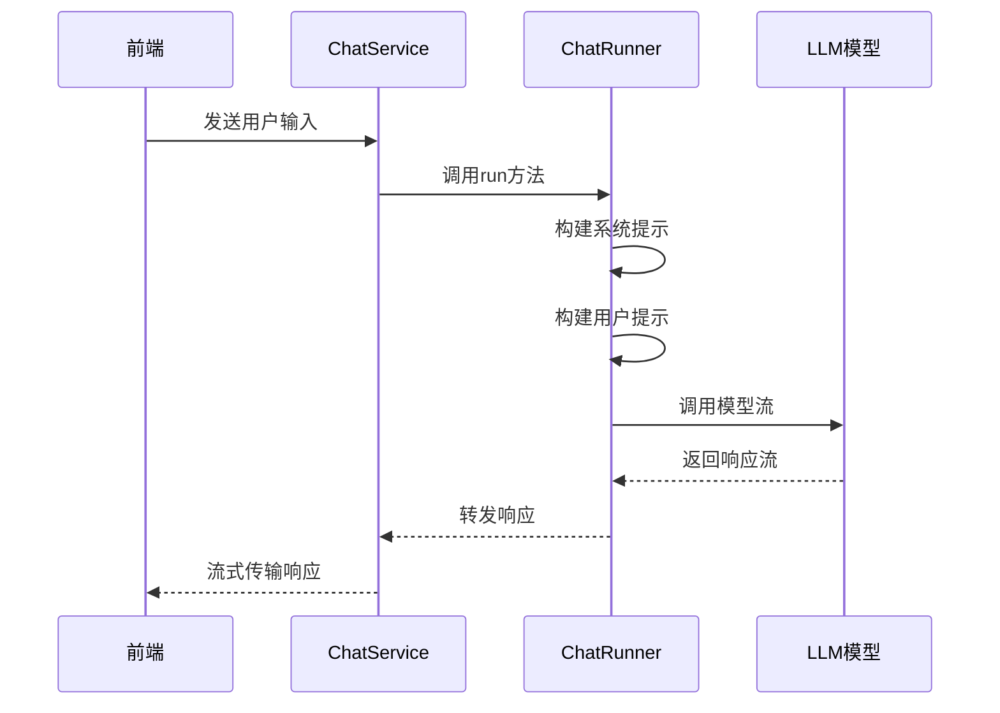
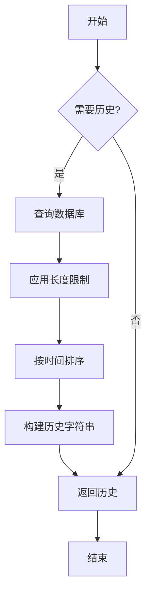
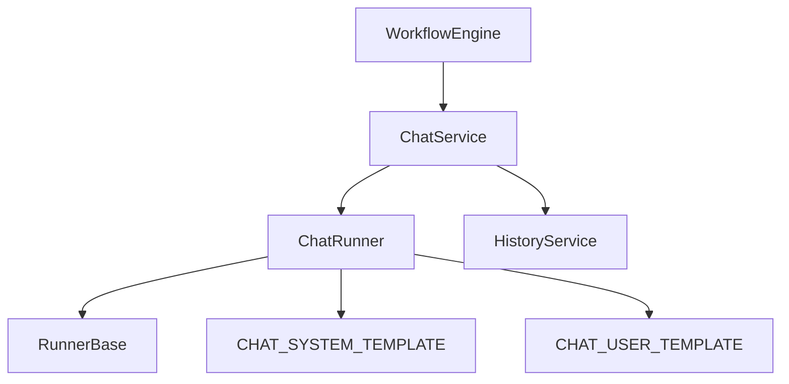

# 聊天节点

<cite>
**本文档引用的文件**  
- [chat_runner.py](file://core/agent/engine/nodes/chat/chat_runner.py)
- [chat_prompt.py](file://core/agent/engine/nodes/chat/chat_prompt.py)
- [base.py](file://core/agent/engine/nodes/base.py)
- [chat_service.py](file://core/workflow/service/chat_service.py)
- [history_service.py](file://core/workflow/service/history_service.py)
- [node.py](file://core/workflow/engine/node.py)
</cite>

## 目录
1. [简介](#简介)
2. [项目结构](#项目结构)
3. [核心组件](#核心组件)
4. [架构概述](#架构概述)
5. [详细组件分析](#详细组件分析)
6. [依赖分析](#依赖分析)
7. [性能考虑](#性能考虑)
8. [故障排除指南](#故障排除指南)
9. [结论](#结论)

## 简介
聊天节点是Astron-Agent系统中的核心组件，负责处理用户输入、调用LLM模型、生成响应并管理对话历史。该节点通过精心设计的提示词模板与格式化逻辑，确保与大语言模型的有效交互。聊天节点与其他节点通过工作流引擎协调工作，形成完整的对话系统。本文档详细解析聊天节点的技术实现，包括其执行逻辑、提示词管理、交互模式及性能优化策略。

## 项目结构
聊天节点相关代码主要分布在`core/agent/engine/nodes/chat/`目录下，包含执行逻辑和提示词模板两个核心文件。工作流服务层位于`core/workflow/service/`目录，负责协调节点间的交互。历史管理服务位于`core/workflow/service/history_service.py`，处理对话历史的存储与检索。



**图表来源**  
- [chat_runner.py](file://core/agent/engine/nodes/chat/chat_runner.py)
- [chat_prompt.py](file://core/agent/engine/nodes/chat/chat_prompt.py)
- [base.py](file://core/agent/engine/nodes/base.py)
- [chat_service.py](file://core/workflow/service/chat_service.py)
- [history_service.py](file://core/workflow/service/history_service.py)
- [node.py](file://core/workflow/engine/node.py)

**章节来源**
- [chat_runner.py](file://core/agent/engine/nodes/chat/chat_runner.py)
- [chat_prompt.py](file://core/agent/engine/nodes/chat/chat_prompt.py)

## 核心组件
聊天节点的核心组件包括`ChatRunner`类和提示词模板系统。`ChatRunner`继承自`RunnerBase`，实现了聊天执行的核心逻辑。提示词模板定义了系统与用户提示的结构，确保与LLM的有效通信。节点通过工作流引擎与其他组件集成，形成完整的对话处理管道。

**章节来源**
- [chat_runner.py](file://core/agent/engine/nodes/chat/chat_runner.py#L1-L40)
- [chat_prompt.py](file://core/agent/engine/nodes/chat/chat_prompt.py#L1-L23)

## 架构概述
聊天节点采用分层架构设计，上层为执行逻辑层，中层为提示词处理层，底层为历史管理与模型调用层。节点通过工作流引擎接收用户输入，经过提示词模板格式化后发送给LLM模型，最后将响应返回给前端界面。整个过程支持流式传输，提供实时的对话体验。



**图表来源**  
- [chat_service.py](file://core/workflow/service/chat_service.py)
- [chat_runner.py](file://core/agent/engine/nodes/chat/chat_runner.py)
- [chat_prompt.py](file://core/agent/engine/nodes/chat/chat_prompt.py)

## 详细组件分析

### ChatRunner分析
`ChatRunner`类是聊天节点的执行核心，负责协调整个对话流程。它继承自`RunnerBase`，利用基类提供的通用功能，如历史记录处理和模型流式调用。

#### 执行逻辑


**图表来源**  
- [chat_runner.py](file://core/agent/engine/nodes/chat/chat_runner.py#L1-L40)
- [base.py](file://core/agent/engine/nodes/base.py#L1-L160)

### 提示词模板分析
提示词模板系统定义了与LLM通信的标准格式，确保一致的交互体验。

#### 模板结构
```mermaid
classDiagram
class CHAT_SYSTEM_TEMPLATE {
+当前时间占位符 {now}
+指令占位符 {instruct}
+知识库占位符 {knowledge}
+系统角色定义
+响应要求
}
class CHAT_USER_TEMPLATE {
+对话历史占位符 {chat_history}
+问题占位符 {question}
+用户角色定义
}
CHAT_SYSTEM_TEMPLATE --> CHAT_USER_TEMPLATE : 组合使用
```

**图表来源**  
- [chat_prompt.py](file://core/agent/engine/nodes/chat/chat_prompt.py#L1-L23)

### 历史管理分析
历史管理服务负责存储和检索对话记录，支持上下文感知的对话。

#### 历史处理流程


**图表来源**  
- [history_service.py](file://core/workflow/service/history_service.py#L1-L186)

**章节来源**
- [history_service.py](file://core/workflow/service/history_service.py#L1-L186)

## 依赖分析
聊天节点依赖多个核心组件协同工作。`ChatRunner`依赖`RunnerBase`提供的基础功能，如历史记录处理和模型调用。提示词模板独立存在，被`ChatRunner`直接引用。工作流服务层依赖节点执行器和历史管理服务，形成完整的调用链。



**图表来源**  
- [chat_runner.py](file://core/agent/engine/nodes/chat/chat_runner.py)
- [base.py](file://core/agent/engine/nodes/base.py)
- [chat_prompt.py](file://core/agent/engine/nodes/chat/chat_prompt.py)
- [chat_service.py](file://core/workflow/service/chat_service.py)
- [history_service.py](file://core/workflow/service/history_service.py)

**章节来源**
- [chat_runner.py](file://core/agent/engine/nodes/chat/chat_runner.py)
- [base.py](file://core/agent/engine/nodes/base.py)

## 性能考虑
聊天节点的性能优化主要集中在以下几个方面：流式传输减少等待时间，历史记录的智能截断避免上下文过长，以及缓存机制提高重复查询效率。建议配置适当的超时机制，防止长时间运行的请求影响系统稳定性。对于高并发场景，应考虑连接池和负载均衡策略。

## 故障排除指南
常见问题包括提示词模板变量未正确替换、历史记录加载失败和模型调用超时。检查日志中的变量替换过程，确保所有占位符都被正确填充。验证数据库连接状态，确保历史记录可以正常读写。监控模型API的响应时间，设置合理的超时阈值。使用调试模式逐步执行，定位问题发生的具体环节。

**章节来源**
- [chat_runner.py](file://core/agent/engine/nodes/chat/chat_runner.py)
- [chat_service.py](file://core/workflow/service/chat_service.py)

## 结论
聊天节点通过精心设计的架构实现了高效的对话处理能力。其模块化设计使得功能扩展和维护更加容易。提示词模板系统确保了与LLM交互的一致性，而流式传输机制提供了流畅的用户体验。通过合理配置和优化，该节点能够满足各种复杂对话场景的需求。