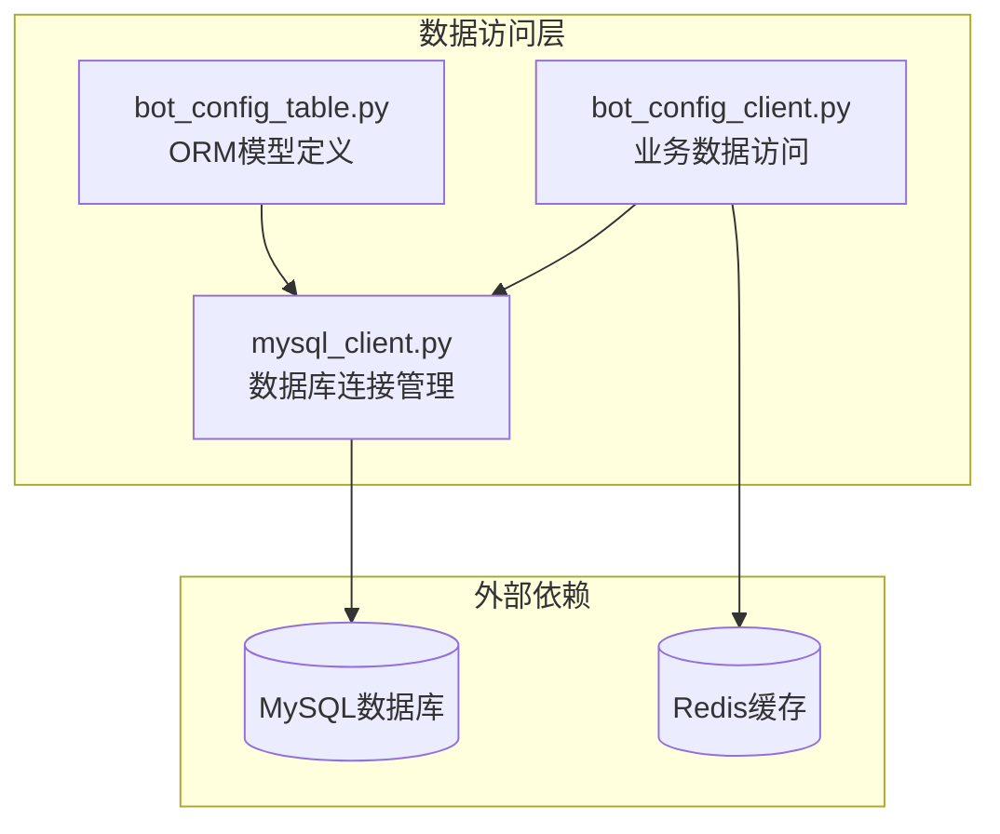
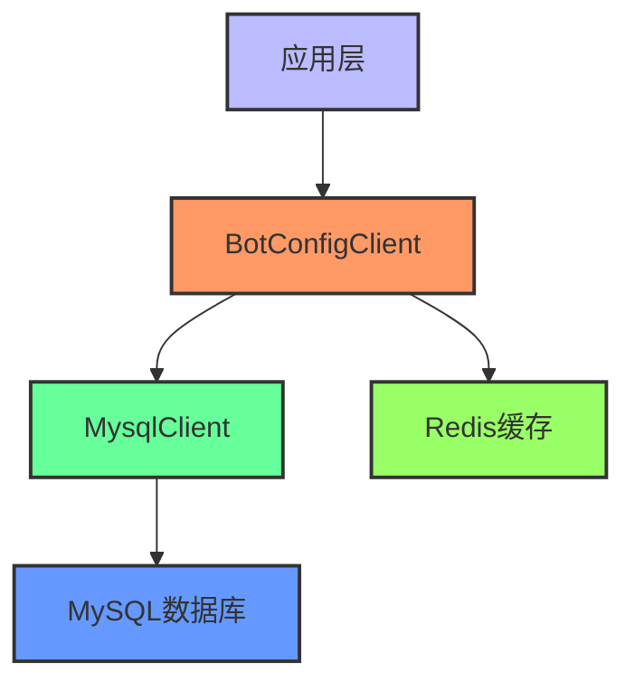
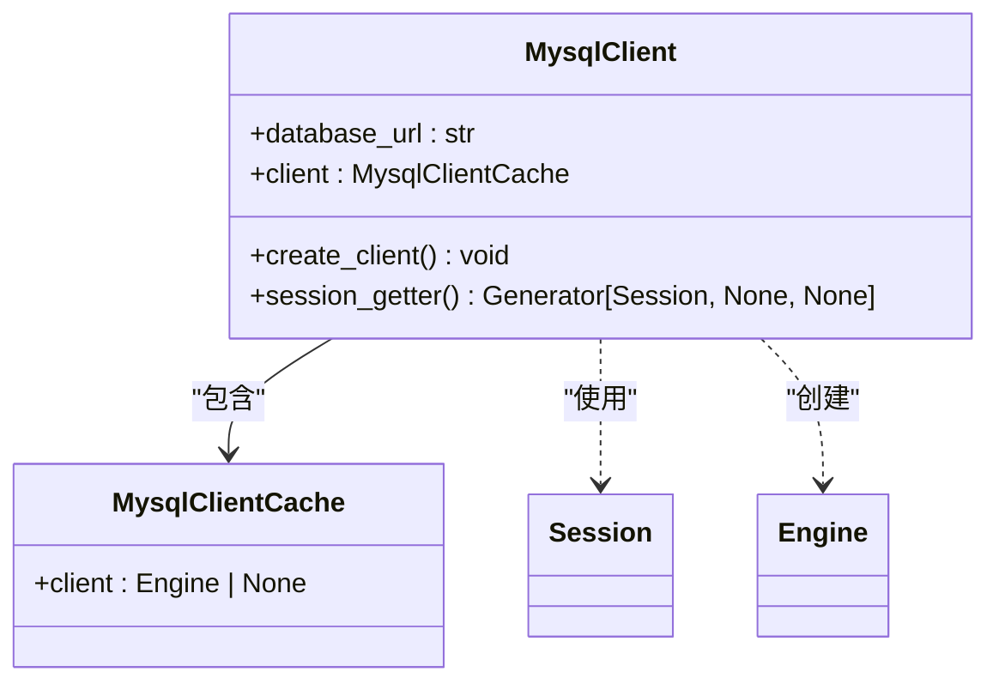
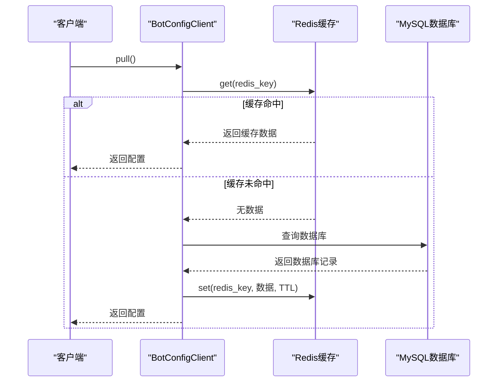
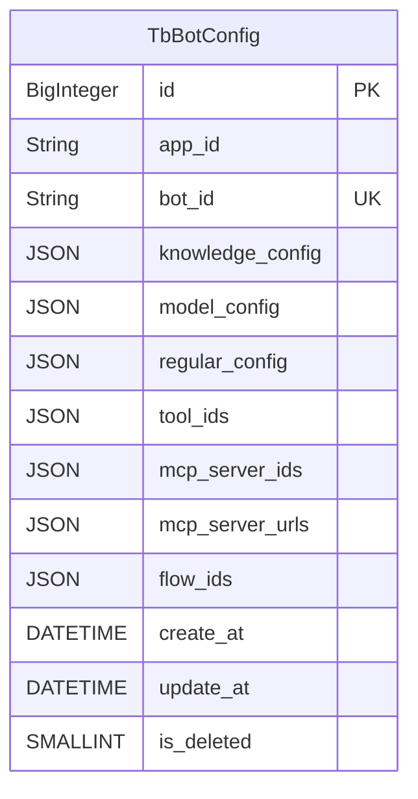
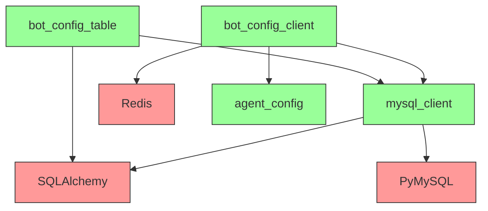

# 数据访问

<cite>
**本文档引用的文件**
- [mysql_client.py](file://core/agent/repository/mysql_client.py)
- [bot_config_client.py](file://core/agent/repository/bot_config_client.py)
- [bot_config_table.py](file://core/agent/domain/models/bot_config_table.py)
- [agent_config.py](file://core/agent/infra/config/__init__.py)
- [test_mysql_client.py](file://core/agent/tests/unit/repository/test_mysql_client.py)
- [test_bot_config_client.py](file://core/agent/tests/unit/repository/test_bot_config_client.py)
</cite>

## 目录
1. [简介](#简介)
2. [项目结构](#项目结构)
3. [核心组件](#核心组件)
4. [架构概述](#架构概述)
5. [详细组件分析](#详细组件分析)
6. [依赖分析](#依赖分析)
7. [性能考虑](#性能考虑)
8. [故障排除指南](#故障排除指南)
9. [结论](#结论)

## 简介
本文档详细说明了Agent服务的数据访问层实现，重点关注MySQL数据库操作、Redis缓存集成和ORM模型映射。文档涵盖了连接管理、查询执行、事务处理、缓存策略和错误处理机制，为开发人员提供了全面的数据访问模式最佳实践。

## 项目结构
Agent服务的数据访问层主要由三个核心模块组成：mysql_client负责数据库连接和会话管理，bot_config_client实现业务实体的特定数据访问逻辑，bot_config_table定义了ORM数据模型。这些模块协同工作，提供高效、可靠的数据访问服务。



**图示来源**
- [mysql_client.py](file://core/agent/repository/mysql_client.py)
- [bot_config_client.py](file://core/agent/repository/bot_config_client.py)
- [bot_config_table.py](file://core/agent/domain/models/bot_config_table.py)

**本节来源**
- [mysql_client.py](file://core/agent/repository/mysql_client.py)
- [bot_config_client.py](file://core/agent/repository/bot_config_client.py)
- [bot_config_table.py](file://core/agent/domain/models/bot_config_table.py)

## 核心组件
数据访问层的核心组件包括MySQL客户端、Bot配置客户端和ORM模型。MySQL客户端提供数据库连接池和会话管理功能，Bot配置客户端实现业务逻辑特定的数据访问操作，ORM模型定义了数据库表结构和关系映射。

**本节来源**
- [mysql_client.py](file://core/agent/repository/mysql_client.py)
- [bot_config_client.py](file://core/agent/repository/bot_config_client.py)
- [bot_config_table.py](file://core/agent/domain/models/bot_config_table.py)

## 架构概述
数据访问层采用分层架构设计，包括连接管理层、业务逻辑层和数据模型层。连接管理层负责数据库连接池管理和会话生命周期控制，业务逻辑层实现特定业务实体的数据访问操作，数据模型层定义了数据库表的ORM映射。



**图示来源**
- [mysql_client.py](file://core/agent/repository/mysql_client.py)
- [bot_config_client.py](file://core/agent/repository/bot_config_client.py)

## 详细组件分析

### MySQL客户端分析
MySQL客户端实现了数据库连接池管理和会话生命周期控制。它使用SQLAlchemy作为ORM框架，通过连接池配置优化数据库连接性能，并提供上下文管理器来确保事务的正确提交或回滚。



**图示来源**
- [mysql_client.py](file://core/agent/repository/mysql_client.py#L1-L54)

**本节来源**
- [mysql_client.py](file://core/agent/repository/mysql_client.py)
- [test_mysql_client.py](file://core/agent/tests/unit/repository/test_mysql_client.py)

### Bot配置客户端分析
Bot配置客户端实现了对Bot配置数据的CRUD操作，采用读取-写入缓存模式优化性能。它首先尝试从Redis缓存中读取数据，如果缓存未命中则从MySQL数据库读取，并将结果写回缓存。



**图示来源**
- [bot_config_client.py](file://core/agent/repository/bot_config_client.py#L30-L311)

**本节来源**
- [bot_config_client.py](file://core/agent/repository/bot_config_client.py)
- [test_bot_config_client.py](file://core/agent/tests/unit/repository/test_bot_config_client.py)

### ORM模型分析
ORM模型定义了数据库表结构和关系映射，使用SQLAlchemy的declarative_base实现。模型类TbBotConfig映射到bot_config表，包含各种配置字段和时间戳字段。



**图示来源**
- [bot_config_table.py](file://core/agent/domain/models/bot_config_table.py#L1-L45)

**本节来源**
- [bot_config_table.py](file://core/agent/domain/models/bot_config_table.py)

## 依赖分析
数据访问层依赖于多个外部组件和内部模块。主要依赖包括SQLAlchemy ORM框架、PyMySQL数据库驱动、Redis客户端和配置管理模块。这些依赖通过合理的封装和抽象，确保了数据访问层的稳定性和可维护性。



**图示来源**
- [mysql_client.py](file://core/agent/repository/mysql_client.py)
- [bot_config_client.py](file://core/agent/repository/bot_config_client.py)
- [bot_config_table.py](file://core/agent/domain/models/bot_config_table.py)
- [agent_config.py](file://core/agent/infra/config/__init__.py)

**本节来源**
- [mysql_client.py](file://core/agent/repository/mysql_client.py)
- [bot_config_client.py](file://core/agent/repository/bot_config_client.py)
- [bot_config_table.py](file://core/agent/domain/models/bot_config_table.py)
- [agent_config.py](file://core/agent/infra/config/__init__.py)

## 性能考虑
数据访问层通过多种机制优化性能，包括连接池配置、缓存策略和查询优化。连接池配置了200的初始大小和800的最大溢出，确保高并发场景下的连接可用性。缓存策略采用Redis作为二级缓存，减少数据库查询压力。

### 连接池配置
```python
pool_size=200,
max_overflow=800,
pool_recycle=3600,
```

### 缓存策略
- 读取操作优先从Redis缓存读取
- 缓存未命中时从数据库读取并写回缓存
- 缓存设置合理的TTL（生存时间）
- 写操作同步更新缓存

**本节来源**
- [mysql_client.py](file://core/agent/repository/mysql_client.py)
- [bot_config_client.py](file://core/agent/repository/bot_config_client.py)

## 故障排除指南
### 常见问题及解决方案
1. **数据库连接失败**
   - 检查数据库URL配置是否正确
   - 验证数据库服务是否正常运行
   - 检查网络连接是否通畅

2. **缓存数据不一致**
   - 确认写操作是否正确更新了缓存
   - 检查缓存TTL设置是否合理
   - 验证Redis服务是否正常运行

3. **性能瓶颈**
   - 监控数据库连接池使用情况
   - 分析慢查询日志
   - 优化缓存命中率

**本节来源**
- [mysql_client.py](file://core/agent/repository/mysql_client.py)
- [bot_config_client.py](file://core/agent/repository/bot_config_client.py)

## 结论
Agent服务的数据访问层通过合理的架构设计和优化策略，提供了高效、可靠的数据访问服务。连接池管理确保了数据库连接的稳定性，缓存策略提升了读取性能，ORM模型简化了数据库操作。建议在实际使用中监控关键性能指标，及时发现和解决潜在问题。