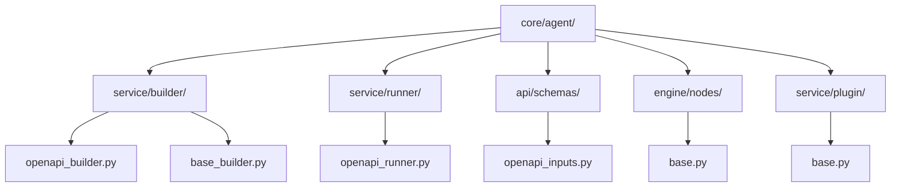
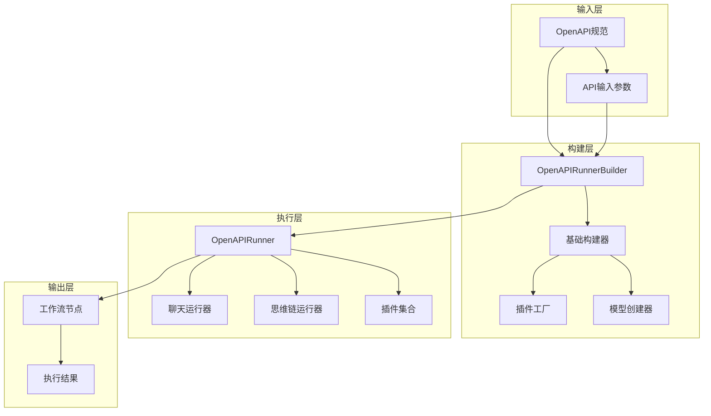
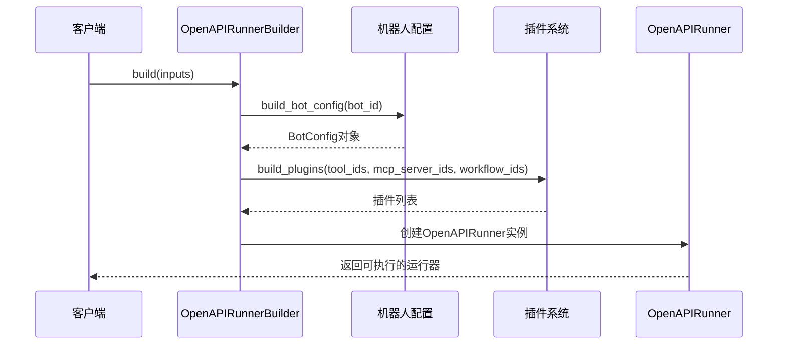
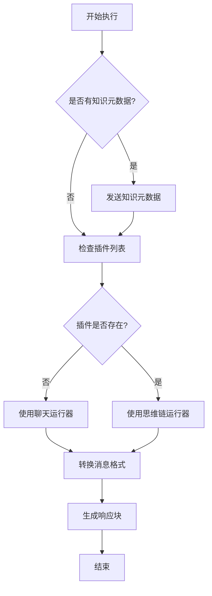
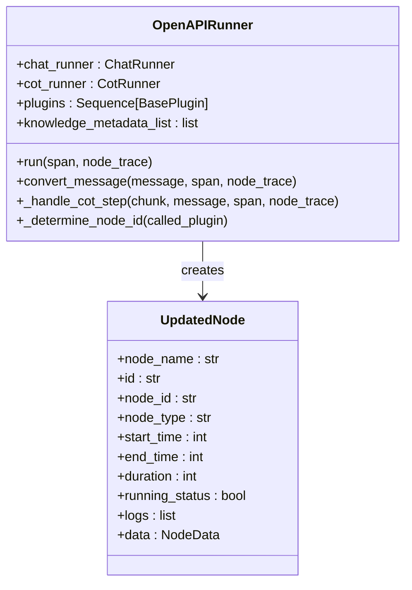
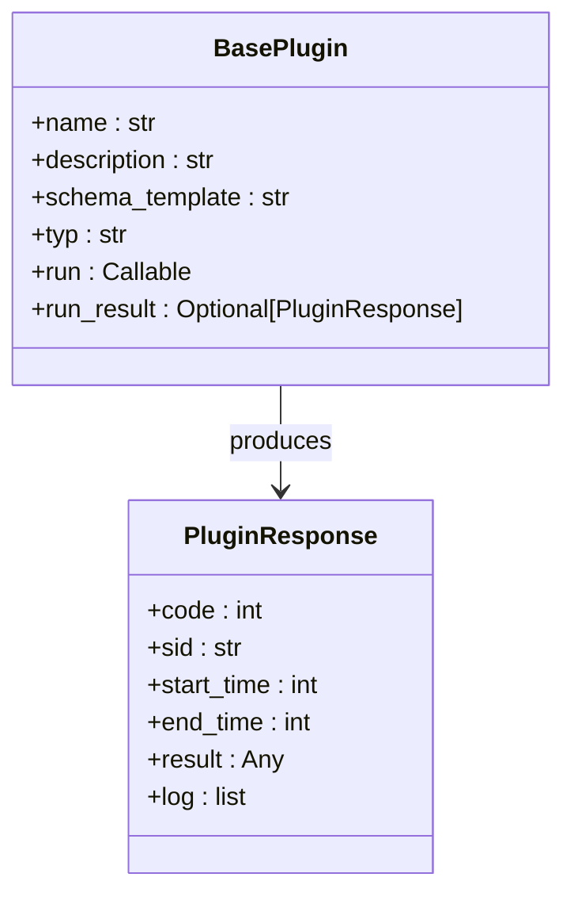
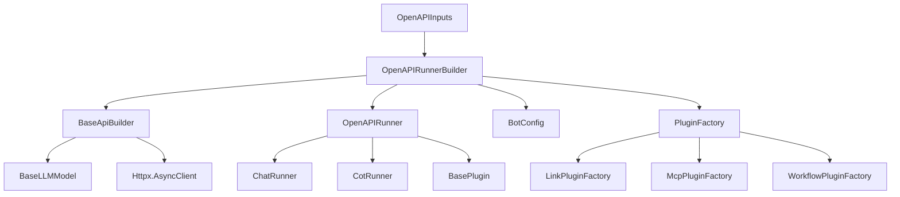

# OpenAPI构建器详细文档

<cite>
**本文档中引用的文件**
- [openapi_builder.py](file://core/agent/service/builder/openapi_builder.py)
- [openapi_inputs.py](file://core/agent/api/schemas/openapi_inputs.py)
- [openapi_runner.py](file://core/agent/service/runner/openapi_runner.py)
- [base_builder.py](file://core/agent/service/builder/base_builder.py)
- [base.py](file://core/agent/service/plugin/base.py)
- [base.py](file://core/agent/engine/nodes/base.py)
</cite>

## 目录
1. [简介](#简介)
2. [项目结构](#项目结构)
3. [核心组件](#核心组件)
4. [架构概览](#架构概览)
5. [详细组件分析](#详细组件分析)
6. [依赖关系分析](#依赖关系分析)
7. [性能考虑](#性能考虑)
8. [故障排除指南](#故障排除指南)
9. [结论](#结论)

## 简介

OpenAPI构建器是astron-agent系统中的核心组件，负责将OpenAPI规范转换为可执行的API代理工作流。该构建器通过解析OpenAPI规范，将其映射到具体的工作流节点，实现RESTful API的自动化调用和响应处理。

OpenAPI构建器的主要职责包括：
- 解析OpenAPI规范文档
- 将API操作转换为工作流节点
- 处理HTTP方法、参数和响应
- 实现认证机制和错误处理
- 提供安全验证和速率限制

## 项目结构

OpenAPI构建器相关文件的组织结构如下：

**图表来源**
- [openapi_builder.py](file://core/agent/service/builder/openapi_builder.py#L1-L157)
- [base_builder.py](file://core/agent/service/builder/base_builder.py#L1-L307)

**章节来源**
- [openapi_builder.py](file://core/agent/service/builder/openapi_builder.py#L1-L157)
- [base_builder.py](file://core/agent/service/builder/base_builder.py#L1-L307)

## 核心组件

OpenAPI构建器由以下核心组件构成：

### OpenAPIRunnerBuilder类
主要的构建器类，继承自BaseApiBuilder，负责构建OpenAPI运行器实例。

### OpenAPIRunner类  
负责执行构建后的OpenAPI工作流，处理消息转换和节点追踪。

### 插件系统
支持多种类型的插件，包括LinkPlugin、McpPlugin和WorkflowPlugin。

### 基础构建器
提供通用的构建功能，如模型创建、插件构建和配置管理。

**章节来源**
- [openapi_builder.py](file://core/agent/service/builder/openapi_builder.py#L12-L157)
- [openapi_runner.py](file://core/agent/service/runner/openapi_runner.py#L25-L231)

## 架构概览

OpenAPI构建器采用分层架构设计，确保模块化和可扩展性：

**图表来源**
- [openapi_builder.py](file://core/agent/service/builder/openapi_builder.py#L12-L50)
- [openapi_runner.py](file://core/agent/service/runner/openapi_runner.py#L25-L80)

## 详细组件分析

### OpenAPIRunnerBuilder详细分析

OpenAPIRunnerBuilder是OpenAPI构建器的核心类，负责将OpenAPI规范转换为可执行的工作流。

#### 主要功能

1. **构建流程**

**图表来源**
- [openapi_builder.py](file://core/agent/service/builder/openapi_builder.py#L15-L50)

2. **知识库查询**
构建器支持从知识库查询相关信息，增强API调用的上下文理解。

3. **插件构建**
支持多种类型的插件集成，包括链接插件、MCP插件和工作流插件。

#### 关键方法分析

**query_knowledge方法**：查询知识库并处理结果
- 查询配置的知识库ID和文档ID
- 使用知识插件工厂创建查询实例
- 处理查询结果并提取背景信息

**_process_knowledge_results方法**：处理知识库查询结果
- 将查询结果按源ID分组
- 处理引用格式（图片、表格）
- 构建元数据列表

**章节来源**
- [openapi_builder.py](file://core/agent/service/builder/openapi_builder.py#L52-L157)

### OpenAPIRunner详细分析

OpenAPIRunner负责执行构建后的工作流，处理各种类型的响应消息。

#### 消息处理流程

**图表来源**
- [openapi_runner.py](file://core/agent/service/runner/openapi_runner.py#L40-L60)

#### 消息类型处理

1. **推理内容处理**：处理思考过程中的内容
2. **普通内容处理**：处理标准回复内容
3. **思维链步骤处理**：处理CoT（思维链）步骤
4. **日志消息处理**：处理调试和日志信息
5. **知识元数据处理**：处理知识库相关数据

#### 节点追踪机制

OpenAPIRunner实现了详细的节点追踪功能，记录每个插件的执行情况：

**图表来源**
- [openapi_runner.py](file://core/agent/service/runner/openapi_runner.py#L25-L80)
- [openapi_runner.py](file://core/agent/service/runner/openapi_runner.py#L180-L230)

**章节来源**
- [openapi_runner.py](file://core/agent/service/runner/openapi_runner.py#L25-L231)

### 插件系统分析

OpenAPI构建器支持多种类型的插件，每种插件都有特定的功能和用途。

#### 插件类型

1. **LinkPlugin**：处理链接类型的API调用
2. **McpPlugin**：处理MCP（Model Context Protocol）协议
3. **WorkflowPlugin**：处理复杂的工作流操作

#### 插件工厂模式

**图表来源**
- [base.py](file://core/agent/service/plugin/base.py#L1-L22)

**章节来源**
- [base.py](file://core/agent/service/plugin/base.py#L1-L22)

### 基础构建器分析

基础构建器提供了OpenAPI构建器所需的核心功能：

#### 核心功能

1. **机器人配置管理**：加载和验证机器人配置
2. **插件构建**：创建和配置各种类型的插件
3. **模型创建**：初始化和配置语言模型
4. **运行器构建**：创建聊天和思维链运行器

#### 安全和性能特性

- SSL证书验证和配置
- 超时和重试机制
- 连接池管理和限制
- 异步HTTP客户端配置

**章节来源**
- [base_builder.py](file://core/agent/service/builder/base_builder.py#L1-L307)

## 依赖关系分析

OpenAPI构建器的依赖关系体现了清晰的分层架构：

**图表来源**
- [openapi_builder.py](file://core/agent/service/builder/openapi_builder.py#L1-L10)
- [base_builder.py](file://core/agent/service/builder/base_builder.py#L1-L20)

**章节来源**
- [openapi_builder.py](file://core/agent/service/builder/openapi_builder.py#L1-L157)
- [base_builder.py](file://core/agent/service/builder/base_builder.py#L1-L307)

## 性能考虑

OpenAPI构建器在设计时充分考虑了性能优化：

### 并发处理
- 使用异步编程模型提高并发能力
- 支持多插件并行执行
- 实现连接池复用减少连接开销

### 缓存策略
- 知识库查询结果缓存
- 插件配置缓存
- 模型响应缓存

### 资源管理
- 自动化的资源清理和释放
- 内存使用监控和优化
- CPU使用率控制

## 故障排除指南

### 常见问题及解决方案

1. **OpenAPI规范解析失败**
   - 检查规范格式是否正确
   - 验证必需字段是否存在
   - 确认JSON/YAML语法正确性

2. **插件加载失败**
   - 检查插件配置是否正确
   - 验证插件依赖是否满足
   - 查看插件日志获取详细错误信息

3. **认证失败**
   - 验证API密钥有效性
   - 检查认证头格式
   - 确认权限配置正确

4. **超时问题**
   - 调整超时配置
   - 检查网络连接稳定性
   - 优化请求参数

**章节来源**
- [base_builder.py](file://core/agent/service/builder/base_builder.py#L250-L307)

## 结论

OpenAPI构建器是一个功能完整、设计精良的组件，成功地将OpenAPI规范转换为可执行的工作流。其主要优势包括：

1. **模块化设计**：清晰的分层架构便于维护和扩展
2. **插件化支持**：灵活的插件系统支持多种API类型
3. **安全性保障**：完善的认证和验证机制
4. **性能优化**：高效的并发处理和资源管理
5. **可观测性**：详细的追踪和日志记录

该构建器为astron-agent系统提供了强大的API自动化能力，支持复杂的业务场景和多样化的API集成需求。通过持续的优化和扩展，它将继续为用户提供更加智能和高效的API服务。