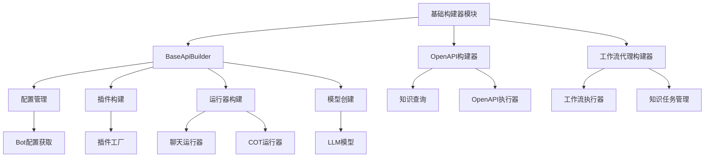
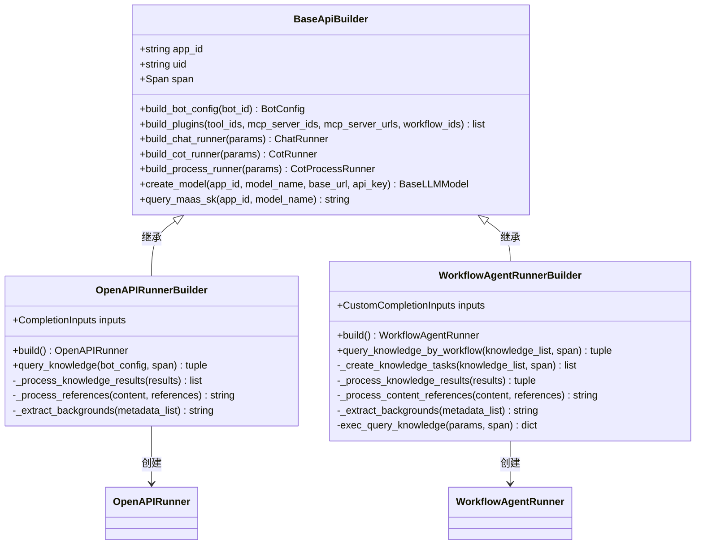
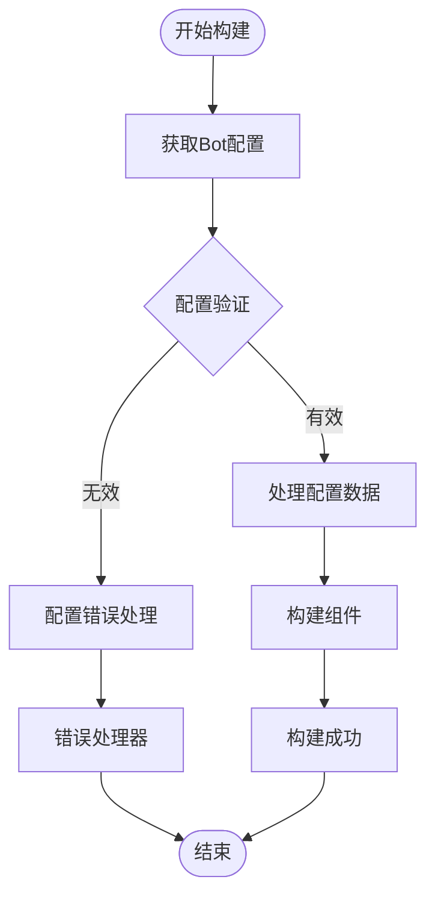
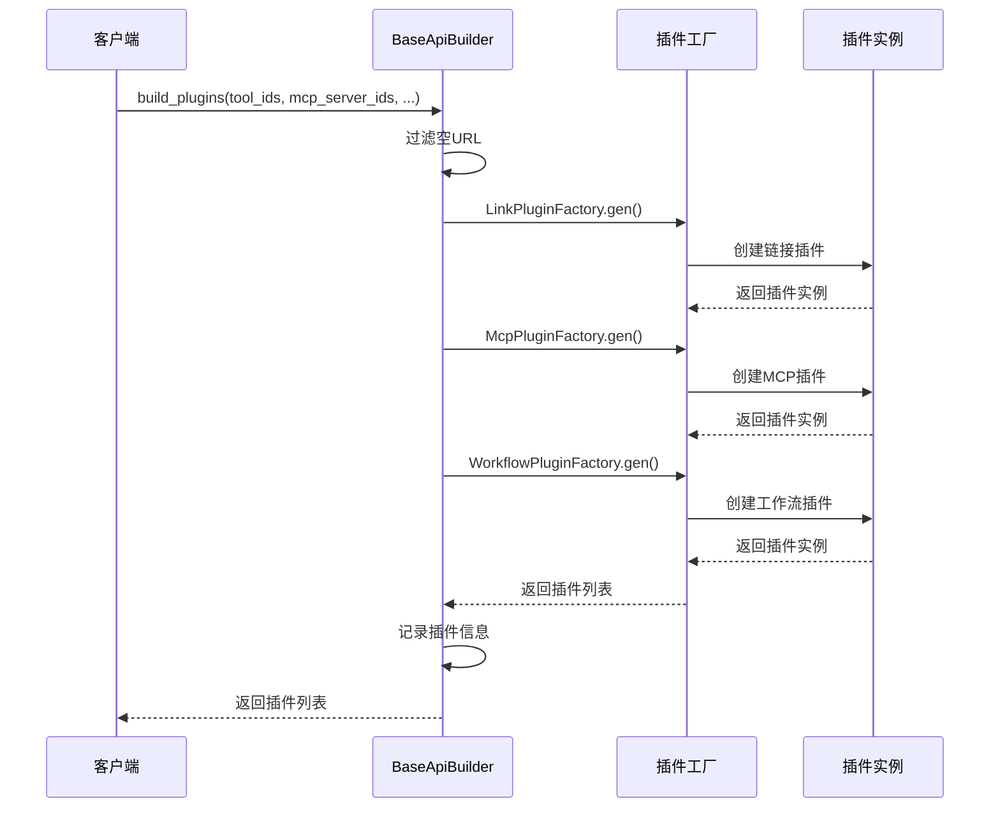
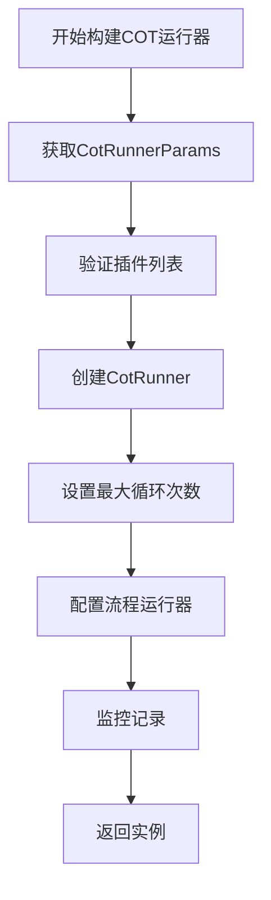
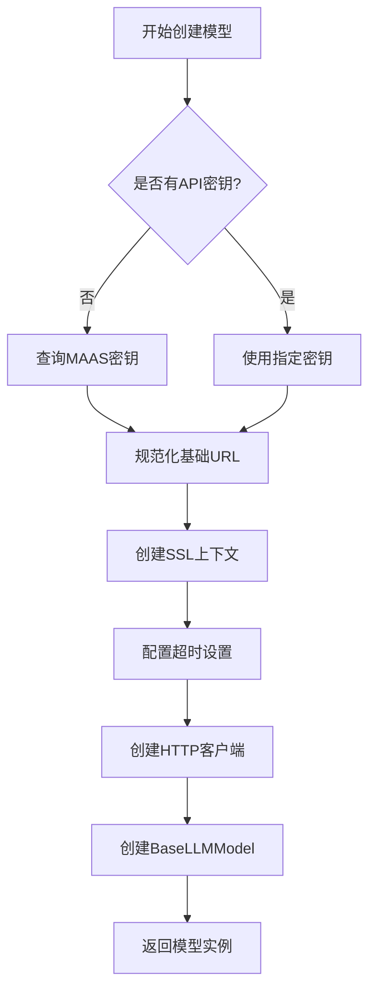
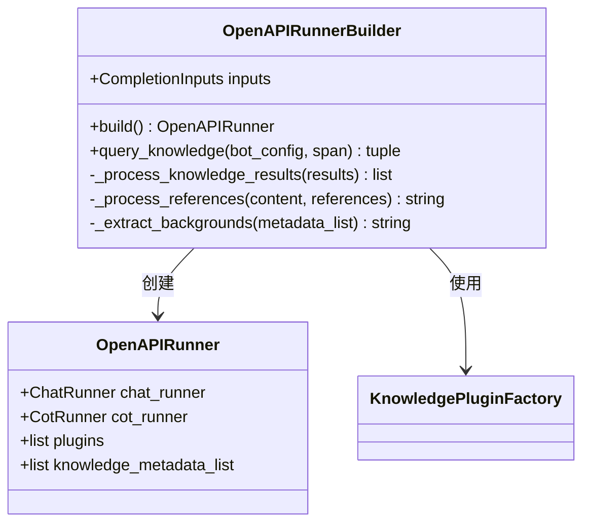
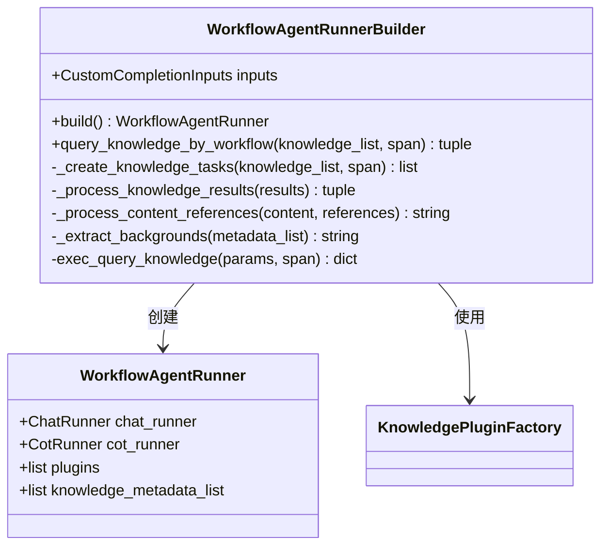
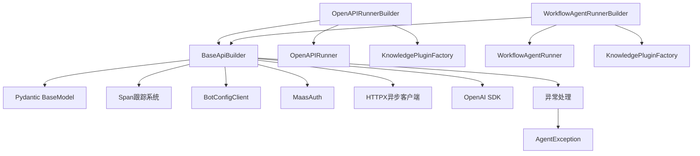
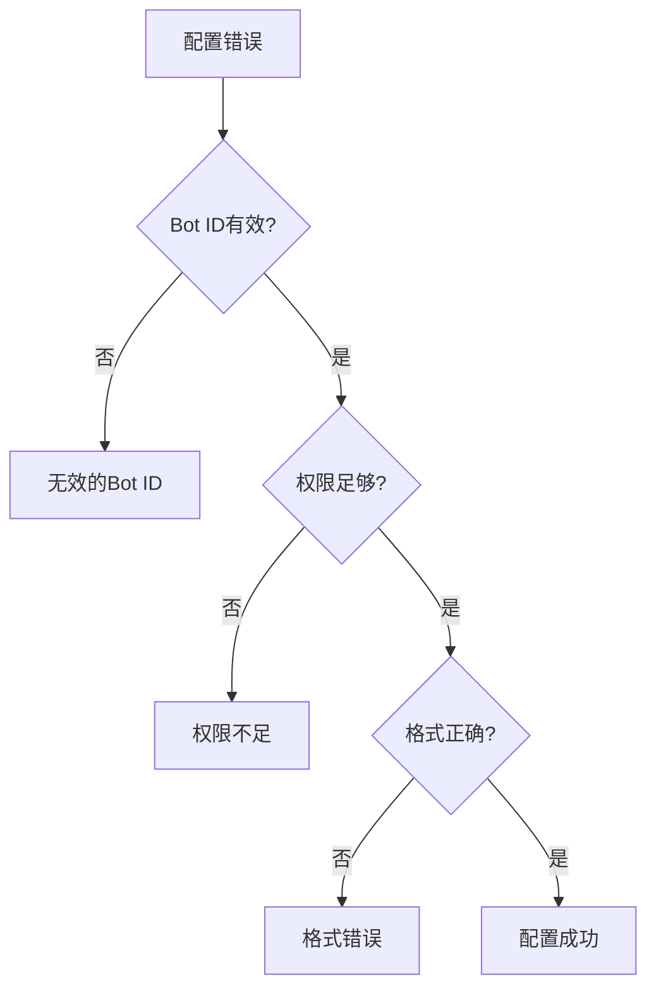

# 基础构建器

<cite>
**本文档中引用的文件**
- [base_builder.py](file://core/agent/service/builder/base_builder.py)
- [openapi_builder.py](file://core/agent/service/builder/openapi_builder.py)
- [workflow_agent_builder.py](file://core/agent/service/builder/workflow_agent_builder.py)
- [base.py](file://core/agent/exceptions/base.py)
</cite>

## 目录
1. [简介](#简介)
2. [项目结构](#项目结构)
3. [核心组件](#核心组件)
4. [架构概览](#架构概览)
5. [详细组件分析](#详细组件分析)
6. [依赖关系分析](#依赖关系分析)
7. [性能考虑](#性能考虑)
8. [故障排除指南](#故障排除指南)
9. [结论](#结论)

## 简介

基础构建器（BaseBuilder）是astron-agent项目中用于构建各种代理和工作流组件的核心抽象基类。它提供了一套标准化的构建流程，包括配置验证、组件初始化、工作流组装等功能，确保所有具体构建器都遵循一致的设计模式和最佳实践。

该系统采用面向对象的设计原则，通过抽象基类定义通用接口，同时允许具体实现类根据特定需求进行定制。这种设计模式提高了代码的可维护性、可扩展性和可测试性。

## 项目结构

**图表来源**
- [base_builder.py](file://core/agent/service/builder/base_builder.py#L44-L307)
- [openapi_builder.py](file://core/agent/service/builder/openapi_builder.py#L1-L157)
- [workflow_agent_builder.py](file://core/agent/service/builder/workflow_agent_builder.py#L1-L231)

**章节来源**
- [base_builder.py](file://core/agent/service/builder/base_builder.py#L1-L307)
- [openapi_builder.py](file://core/agent/service/builder/openapi_builder.py#L1-L157)
- [workflow_agent_builder.py](file://core/agent/service/builder/workflow_agent_builder.py#L1-L231)

## 核心组件

### BaseApiBuilder基类

BaseApiBuilder是所有构建器的基础抽象类，提供了以下核心功能：

#### 核心数据结构

1. **RunnerParams数据类**：定义运行器构建的通用参数
2. **CotRunnerParams数据类**：专门用于COT（Chain of Thought）运行器的参数
3. **配置参数**：
   - `app_id`: 应用程序标识符
   - `uid`: 用户标识符（可选）
   - `span`: 跟踪上下文对象

#### 核心方法分类

| 方法类别 | 方法名称 | 功能描述 |
|---------|---------|---------|
| 配置管理 | `build_bot_config` | 获取并验证机器人配置 |
| 插件管理 | `build_plugins` | 构建和初始化各种插件 |
| 运行器管理 | `build_chat_runner` | 创建聊天运行器实例 |
| 运行器管理 | `build_cot_runner` | 创建COT推理运行器 |
| 运行器管理 | `build_process_runner` | 创建流程处理运行器 |
| 模型管理 | `create_model` | 创建和配置LLM模型 |
| 认证管理 | `query_maas_sk` | 查询MAAS服务密钥 |

**章节来源**
- [base_builder.py](file://core/agent/service/builder/base_builder.py#L44-L307)

## 架构概览

**图表来源**
- [base_builder.py](file://core/agent/service/builder/base_builder.py#L44-L307)
- [openapi_builder.py](file://core/agent/service/builder/openapi_builder.py#L12-L157)
- [workflow_agent_builder.py](file://core/agent/service/builder/workflow_agent_builder.py#L23-L231)

## 详细组件分析

### 配置验证机制

BaseApiBuilder实现了完整的配置验证流程，确保所有输入参数的有效性：

**图表来源**
- [base_builder.py](file://core/agent/service/builder/base_builder.py#L54-L70)

#### 配置验证流程

1. **Bot配置获取**：通过BotConfigClient拉取配置数据
2. **类型转换**：确保返回值为BotConfig对象
3. **事件记录**：使用Span记录配置信息
4. **错误处理**：捕获并处理配置相关的异常

**章节来源**
- [base_builder.py](file://core/agent/service/builder/base_builder.py#L54-L70)

### 插件构建系统

插件系统支持多种类型的插件，包括链接插件、MCP插件和工作流插件：

**图表来源**
- [base_builder.py](file://core/agent/service/builder/base_builder.py#L72-L110)

#### 插件类型支持

| 插件类型 | 工厂类 | 功能描述 |
|---------|-------|---------|
| 链接插件 | LinkPluginFactory | 处理外部API调用 |
| MCP插件 | McpPluginFactory | 处理MCP服务器连接 |
| 工作流插件 | WorkflowPluginFactory | 处理复杂工作流逻辑 |

**章节来源**
- [base_builder.py](file://core/agent/service/builder/base_builder.py#L72-L110)

### 运行器构建流程

BaseApiBuilder提供了三种主要的运行器构建方法：

#### 聊天运行器构建

**图表来源**
- [base_builder.py](file://core/agent/service/builder/base_builder.py#L112-L135)

#### COT运行器构建

COT运行器专门用于链式思维推理过程：

**图表来源**
- [base_builder.py](file://core/agent/service/builder/base_builder.py#L137-L170)

**章节来源**
- [base_builder.py](file://core/agent/service/builder/base_builder.py#L112-L170)

### 模型创建机制

BaseApiBuilder实现了完整的LLM模型创建流程，包括SSL配置、超时设置和重试机制：

**图表来源**
- [base_builder.py](file://core/agent/service/builder/base_builder.py#L232-L307)

#### 模型配置参数

| 参数名称 | 默认值 | 描述 |
|---------|-------|------|
| 连接超时 | 60秒 | HTTP连接建立超时时间 |
| 读取超时 | 5分钟 | 数据读取超时时间 |
| 写入超时 | 30秒 | 数据写入超时时间 |
| 池超时 | 10秒 | 连接池等待超时时间 |
| 最大连接数 | 100 | 最大并发连接数 |
| 最大保活连接 | 20 | 保持活跃状态的最大连接数 |
| 重试次数 | 2次 | 请求失败时的重试次数 |

**章节来源**
- [base_builder.py](file://core/agent/service/builder/base_builder.py#L232-L307)

### 具体构建器实现

#### OpenAPIRunnerBuilder

OpenAPIRunnerBuilder专门用于构建OpenAPI风格的运行器：

**图表来源**
- [openapi_builder.py](file://core/agent/service/builder/openapi_builder.py#L12-L157)

#### WorkflowAgentRunnerBuilder

WorkflowAgentRunnerBuilder用于构建工作流代理运行器：

**图表来源**
- [workflow_agent_builder.py](file://core/agent/service/builder/workflow_agent_builder.py#L23-L231)

**章节来源**
- [openapi_builder.py](file://core/agent/service/builder/openapi_builder.py#L12-L157)
- [workflow_agent_builder.py](file://core/agent/service/builder/workflow_agent_builder.py#L23-L231)

## 依赖关系分析

**图表来源**
- [base_builder.py](file://core/agent/service/builder/base_builder.py#L1-L20)
- [openapi_builder.py](file://core/agent/service/builder/openapi_builder.py#L1-L10)
- [workflow_agent_builder.py](file://core/agent/service/builder/workflow_agent_builder.py#L1-L15)

### 外部依赖

| 依赖包 | 版本要求 | 用途 |
|-------|---------|------|
| pydantic | 最新版本 | 数据验证和序列化 |
| httpx | 最新版本 | 异步HTTP客户端 |
| openai | 最新版本 | OpenAI API客户端 |
| typing-extensions | 可选 | 类型提示增强 |

**章节来源**
- [base_builder.py](file://core/agent/service/builder/base_builder.py#L1-L20)

## 性能考虑

### 并发处理

BaseApiBuilder支持并发操作，特别是在插件构建和知识查询方面：

1. **异步操作**：所有网络请求都是异步的
2. **连接池管理**：HTTP客户端使用连接池优化性能
3. **并发插件构建**：多个插件可以并行构建

### 缓存策略

1. **配置缓存**：Bot配置通过BotConfigClient缓存
2. **模型缓存**：创建的模型实例可以被复用
3. **插件缓存**：插件工厂支持插件实例缓存

### 监控和追踪

BaseApiBuilder集成了完整的监控系统：

1. **Span追踪**：每个构建步骤都有详细的追踪信息
2. **事件记录**：关键操作都会记录到事件系统
3. **性能指标**：自动收集构建时间和资源使用情况

## 故障排除指南

### 常见错误类型

#### 配置错误

#### 模型创建错误

1. **API密钥问题**：检查MAAS认证配置
2. **网络连接问题**：验证基础URL可达性
3. **SSL证书问题**：检查SSL配置和证书有效性

#### 插件构建错误

1. **插件工厂问题**：检查插件工厂配置
2. **依赖缺失**：验证插件所需依赖是否安装
3. **权限问题**：检查插件访问权限

**章节来源**
- [base_builder.py](file://core/agent/service/builder/base_builder.py#L232-L307)

### 错误处理机制

BaseApiBuilder通过以下机制处理错误：

1. **异常捕获**：所有异步操作都有异常捕获
2. **错误传播**：错误信息通过Span传播
3. **降级处理**：部分功能失败时的降级策略

## 结论

基础构建器系统为astron-agent提供了一个强大而灵活的组件构建框架。通过抽象基类的设计，它确保了所有构建器都遵循一致的接口和最佳实践，同时允许具体的实现类根据特定需求进行定制。

### 主要优势

1. **一致性**：所有构建器都遵循相同的接口规范
2. **可扩展性**：新的构建器可以轻松地继承和扩展
3. **可维护性**：集中化的错误处理和监控机制
4. **性能优化**：内置的并发处理和缓存策略

### 最佳实践建议

1. **继承基类**：新构建器应该继承BaseApiBuilder
2. **重写必要方法**：根据具体需求重写build等核心方法
3. **使用监控**：充分利用Span追踪功能
4. **错误处理**：遵循基类的错误处理模式

这个系统为构建复杂的代理和工作流组件提供了坚实的基础，是astron-agent架构中的重要组成部分。