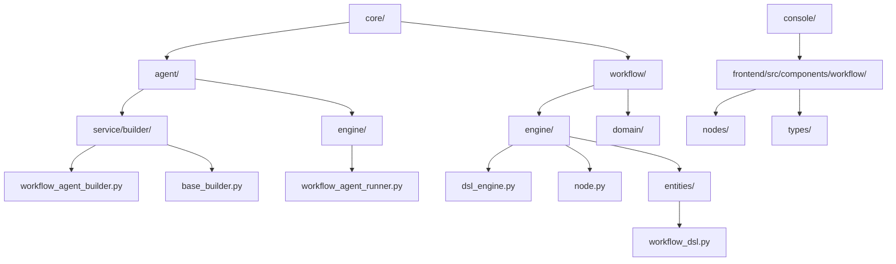
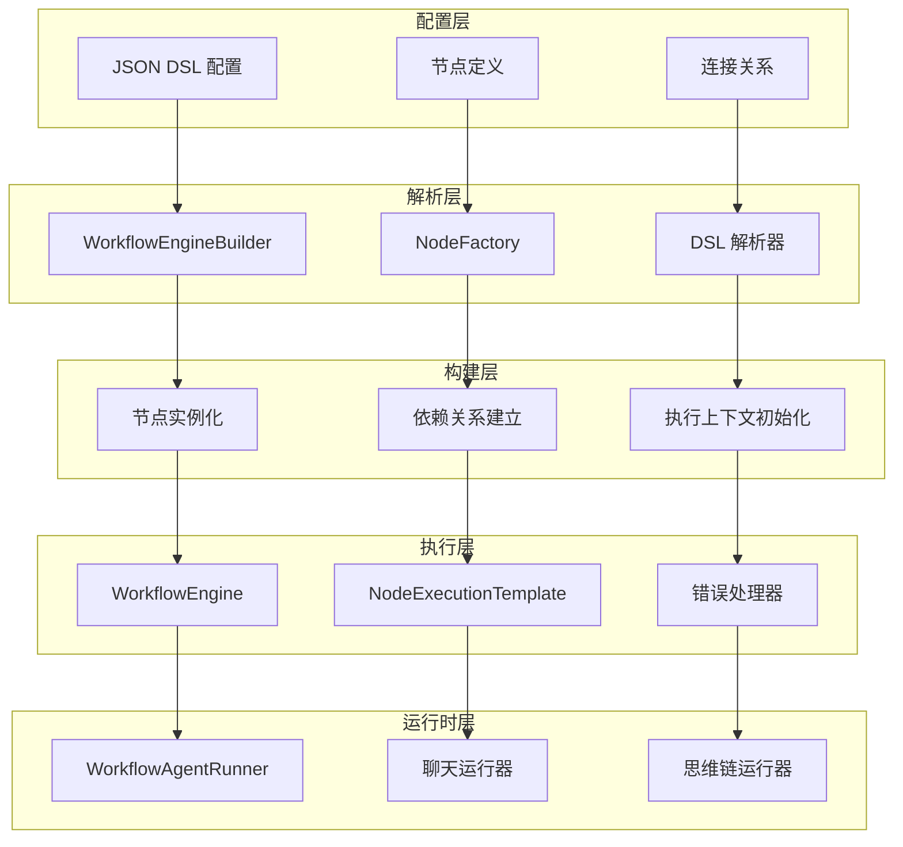
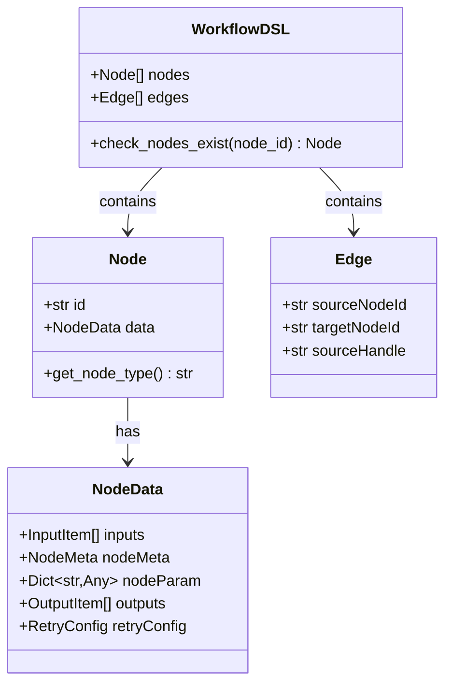
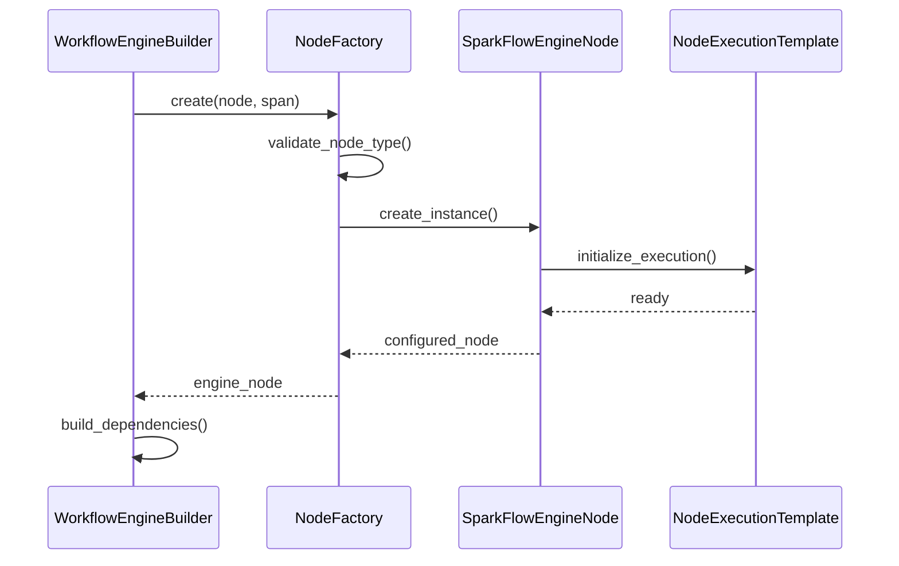
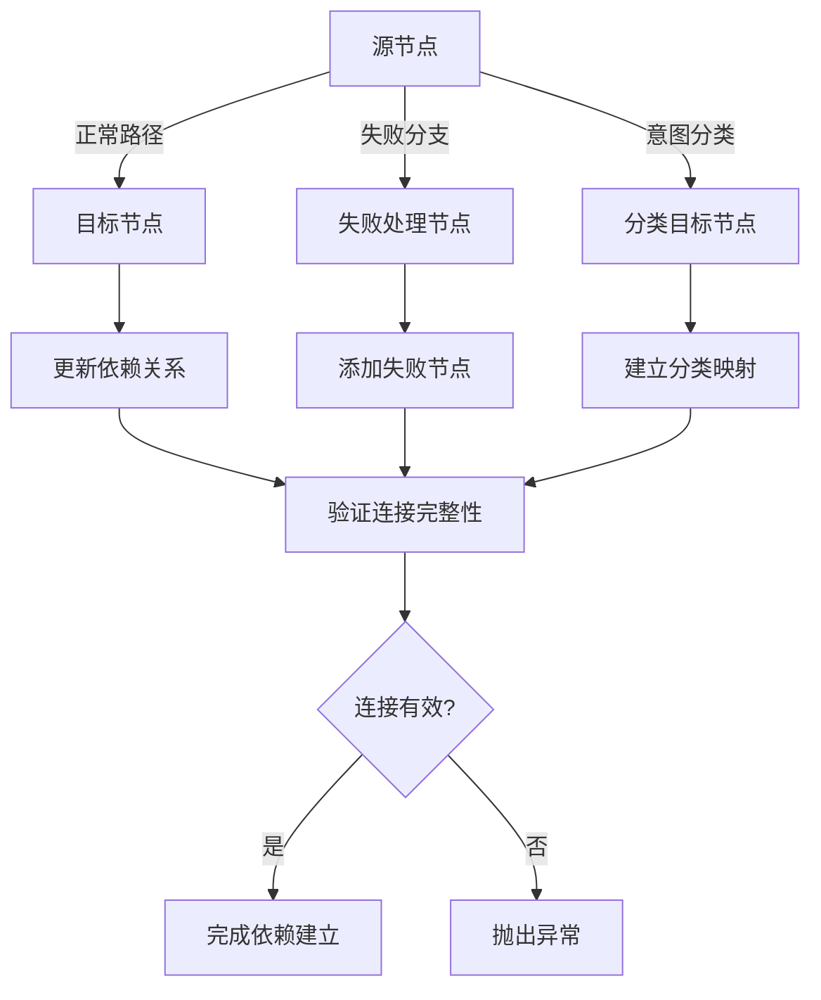
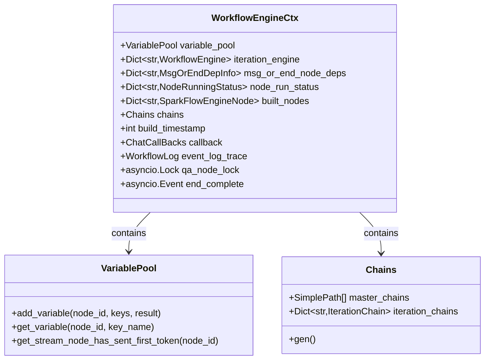
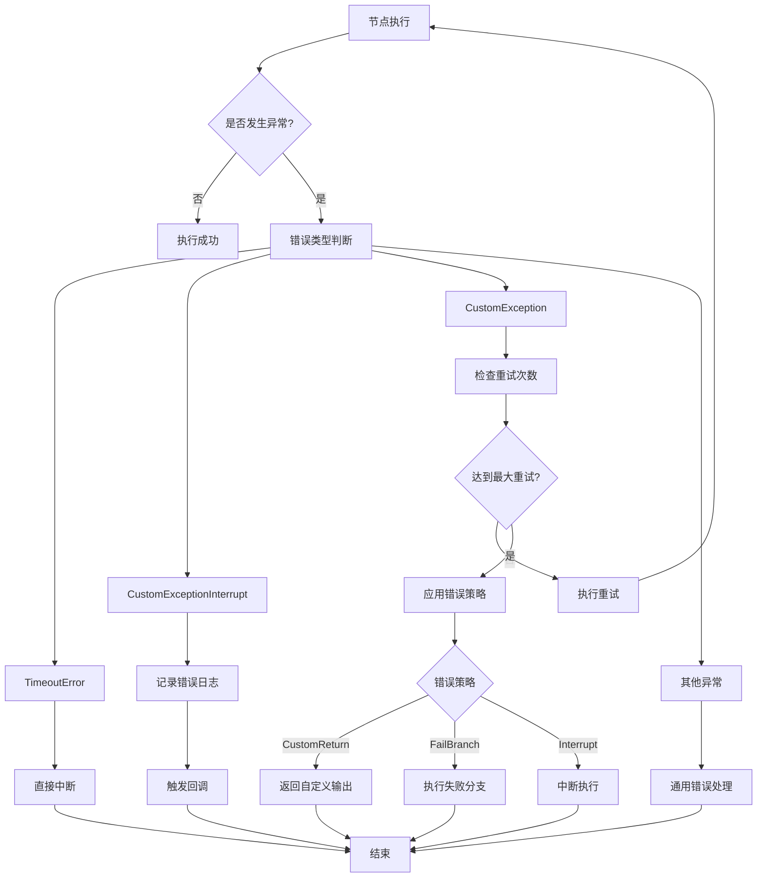
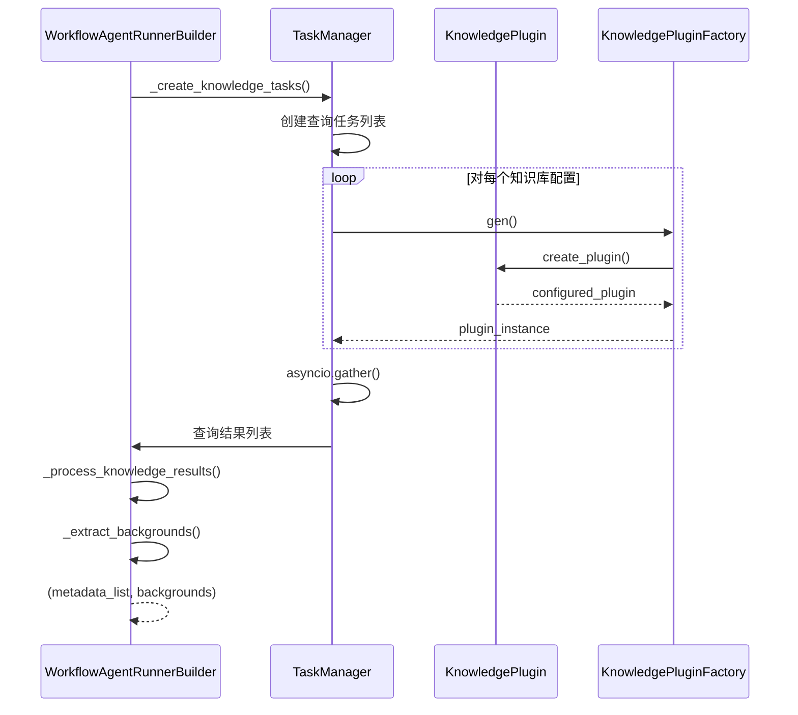
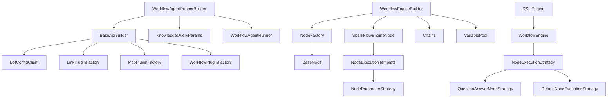

# 工作流构建器详细文档

<cite>
**本文档中引用的文件**
- [workflow_agent_builder.py](file://core/agent/service/builder/workflow_agent_builder.py)
- [dsl_engine.py](file://core/workflow/engine/dsl_engine.py)
- [node.py](file://core/workflow/engine/node.py)
- [workflow_agent_runner.py](file://core/agent/engine/workflow_agent_runner.py)
- [base_builder.py](file://core/agent/service/builder/base_builder.py)
- [workflow_dsl.py](file://core/workflow/engine/entities/workflow_dsl.py)
- [test_workflow_agent_builder.py](file://core/agent/tests/unit/service/builder/test_workflow_agent_builder.py)
</cite>

## 目录
1. [简介](#简介)
2. [项目结构](#项目结构)
3. [核心组件](#核心组件)
4. [架构概览](#架构概览)
5. [详细组件分析](#详细组件分析)
6. [依赖关系分析](#依赖关系分析)
7. [性能考虑](#性能考虑)
8. [故障排除指南](#故障排除指南)
9. [结论](#结论)

## 简介

工作流构建器是 Astron Agent 系统中的核心组件，负责将工作流配置 DSL（领域特定语言）转换为可执行的工作流实例。该系统采用 Builder 模式和多种设计模式，支持复杂的节点解析、连接关系建立和执行上下文初始化，能够处理循环、条件分支和并行执行等复杂工作流模式。

工作流构建器的主要职责包括：
- 将 JSON 格式的工作流配置解析为内部表示
- 建立节点之间的依赖关系和连接
- 初始化执行上下文和变量池
- 处理错误恢复和重试机制
- 支持知识库查询和插件集成

## 项目结构

工作流构建器相关的文件主要分布在以下目录结构中：

**图表来源**
- [workflow_agent_builder.py](file://core/agent/service/builder/workflow_agent_builder.py#L1-L231)
- [dsl_engine.py](file://core/workflow/engine/dsl_engine.py#L1-L800)
- [node.py](file://core/workflow/engine/node.py#L1-L800)

**章节来源**
- [workflow_agent_builder.py](file://core/agent/service/builder/workflow_agent_builder.py#L1-L231)
- [dsl_engine.py](file://core/workflow/engine/dsl_engine.py#L1-L800)

## 核心组件

### WorkflowAgentRunnerBuilder

这是工作流构建器的核心类，继承自 `BaseApiBuilder`，负责构建完整的 `WorkflowAgentRunner` 实例。

#### 主要功能
- **模型创建**：根据配置创建 LLM 模型实例
- **插件构建**：集成工具、MCP 服务器和工作流插件
- **知识查询**：处理知识库查询和背景信息提取
- **运行器构建**：创建聊天、思维链和处理运行器

#### 关键方法
- `build()`：主构建入口，协调所有构建步骤
- `query_knowledge_by_workflow()`：处理知识库查询
- `_create_knowledge_tasks()`：创建知识查询任务
- `_process_knowledge_results()`：处理查询结果

### WorkflowEngineBuilder

工作流引擎构建器，负责将 DSL 定义转换为可执行的引擎实例。

#### 主要功能
- **节点构建**：创建 SparkFlow 引擎节点
- **依赖关系建立**：处理节点间的连接关系
- **执行链构建**：建立执行顺序和依赖链
- **状态管理**：维护节点运行状态

### DSL 引擎

DSL 引擎是工作流执行的核心，提供了完整的执行环境和错误处理机制。

#### 核心特性
- **深度优先搜索执行**：按拓扑顺序执行节点
- **错误处理链**：多层错误处理机制
- **重试策略**：支持自定义重试配置
- **流式处理**：支持流式节点和实时输出

**章节来源**
- [workflow_agent_builder.py](file://core/agent/service/builder/workflow_agent_builder.py#L25-L231)
- [dsl_engine.py](file://core/workflow/engine/dsl_engine.py#L1860-L2377)

## 架构概览

工作流构建器采用分层架构，从配置解析到最终执行形成完整的处理流水线：

**图表来源**
- [workflow_agent_builder.py](file://core/agent/service/builder/workflow_agent_builder.py#L25-L50)
- [dsl_engine.py](file://core/workflow/engine/dsl_engine.py#L1860-L1950)

## 详细组件分析

### 工作流配置 DSL 结构

工作流 DSL 是一个基于 JSON 的配置格式，定义了工作流的节点和连接关系：

**图表来源**
- [workflow_dsl.py](file://core/workflow/engine/entities/workflow_dsl.py#L80-L162)

### 节点解析与实例化

节点解析过程涉及多个步骤，确保每个节点都能正确初始化：

**图表来源**
- [node.py](file://core/workflow/engine/node.py#L700-L800)
- [dsl_engine.py](file://core/workflow/engine/dsl_engine.py#L1860-L1950)

### 连接关系建立

工作流中的节点通过边（Edge）建立连接关系，支持多种连接类型：

**图表来源**
- [dsl_engine.py](file://core/workflow/engine/dsl_engine.py#L2100-L2200)

### 执行上下文初始化

执行上下文包含了工作流执行所需的所有状态信息：

**图表来源**
- [dsl_engine.py](file://core/workflow/engine/dsl_engine.py#L50-L150)

### 错误处理机制

工作流构建器实现了多层次的错误处理机制：

**图表来源**
- [dsl_engine.py](file://core/workflow/engine/dsl_engine.py#L100-L400)

**章节来源**
- [workflow_dsl.py](file://core/workflow/engine/entities/workflow_dsl.py#L80-L162)
- [node.py](file://core/workflow/engine/node.py#L700-L800)
- [dsl_engine.py](file://core/workflow/engine/dsl_engine.py#L1860-L2377)

### 知识库查询处理

工作流构建器集成了强大的知识库查询功能，支持多种 RAG 类型：

**图表来源**
- [workflow_agent_builder.py](file://core/agent/service/builder/workflow_agent_builder.py#L80-L150)

### 插件系统集成

工作流构建器支持多种类型的插件集成：

| 插件类型 | 描述 | 配置方式 | 使用场景 |
|---------|------|----------|----------|
| LinkPlugin | 工具插件 | tool_ids 列表 | 调用外部 API 和工具 |
| McpPlugin | MCP 服务器插件 | mcp_server_ids 或 urls | 连接 MCP 服务器 |
| WorkflowPlugin | 子工作流插件 | workflow_ids 列表 | 嵌套工作流调用 |
| KnowledgePlugin | 知识库插件 | knowledge 配置 | RAG 知识检索 |

**章节来源**
- [workflow_agent_builder.py](file://core/agent/service/builder/workflow_agent_builder.py#L80-L231)
- [base_builder.py](file://core/agent/service/builder/base_builder.py#L50-L150)

## 依赖关系分析

工作流构建器的依赖关系体现了清晰的分层架构：

**图表来源**
- [workflow_agent_builder.py](file://core/agent/service/builder/workflow_agent_builder.py#L1-L20)
- [dsl_engine.py](file://core/workflow/engine/dsl_engine.py#L1-L50)

**章节来源**
- [workflow_agent_builder.py](file://core/agent/service/builder/workflow_agent_builder.py#L1-L20)
- [base_builder.py](file://core/agent/service/builder/base_builder.py#L1-L50)

## 性能考虑

### 缓存机制

工作流构建器实现了多层缓存机制以提高性能：

1. **节点缓存**：已构建的节点实例被缓存在 `built_nodes` 字典中
2. **迭代引擎缓存**：迭代节点的子引擎实例被缓存
3. **变量池缓存**：执行过程中的变量值被高效存储

### 懒加载技术

- **延迟节点创建**：节点只在需要时才创建和配置
- **按需依赖解析**：依赖关系只在执行时动态解析
- **异步任务调度**：知识查询和插件加载采用异步方式

### 并发处理

- **并发知识查询**：多个知识库查询可以并行执行
- **插件并行加载**：不同类型插件可以同时加载
- **流式处理**：支持流式节点的实时处理

### 内存优化

- **对象池化**：重复使用的对象被池化管理
- **及时清理**：不再需要的对象及时释放
- **增量处理**：大型工作流采用增量处理策略

## 故障排除指南

### 常见问题及解决方案

#### 1. 节点类型不支持错误
**症状**：`CustomException: ENG_NODE_PROTOCOL_VALIDATE_ERROR`
**原因**：工作流中使用了不支持的节点类型
**解决**：检查节点类型配置，确保使用支持的节点类型

#### 2. 连接关系无效
**症状**：`CustomException: ENG_BUILD_ERROR`
**原因**：节点间的连接关系不完整或指向不存在的节点
**解决**：验证所有边的目标节点都存在于工作流中

#### 3. 知识库查询超时
**症状**：知识查询任务超时
**解决**：调整超时配置，检查知识库服务可用性

#### 4. 插件加载失败
**症状**：插件创建过程中出现异常
**解决**：检查插件配置，验证插件服务状态

### 调试技巧

1. **启用详细日志**：通过 Span 记录详细的执行跟踪
2. **节点状态监控**：监控 `node_run_status` 字典中的状态变化
3. **变量池检查**：定期检查 `variable_pool` 中的变量值
4. **依赖关系验证**：验证 `msg_or_end_node_deps` 中的依赖关系

**章节来源**
- [dsl_engine.py](file://core/workflow/engine/dsl_engine.py#L100-L200)
- [test_workflow_agent_builder.py](file://core/agent/tests/unit/service/builder/test_workflow_agent_builder.py#L400-L529)

## 结论

工作流构建器是一个功能强大且设计精良的系统，它成功地将复杂的工作流配置转换为可执行的实例。通过采用多种设计模式和最佳实践，该系统具备了以下优势：

### 主要优势

1. **模块化设计**：清晰的分层架构使得系统易于理解和维护
2. **扩展性强**：支持自定义节点类型和插件扩展
3. **容错能力**：完善的错误处理和重试机制
4. **性能优化**：多层缓存和并发处理机制
5. **类型安全**：基于 Pydantic 的强类型验证

### 技术亮点

- **Builder 模式**：优雅的构建流程控制
- **策略模式**：灵活的节点执行策略
- **责任链模式**：可配置的错误处理链
- **模板方法模式**：统一的节点执行模板
- **工厂模式**：灵活的节点和插件创建

### 应用价值

工作流构建器不仅为 Astron Agent 提供了强大的工作流处理能力，其设计理念和实现方式也为其他类似系统提供了宝贵的参考。通过深入理解其实现原理，开发者可以更好地利用这一系统构建复杂的工作流应用，并根据需要进行定制和扩展。