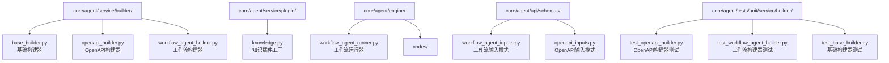
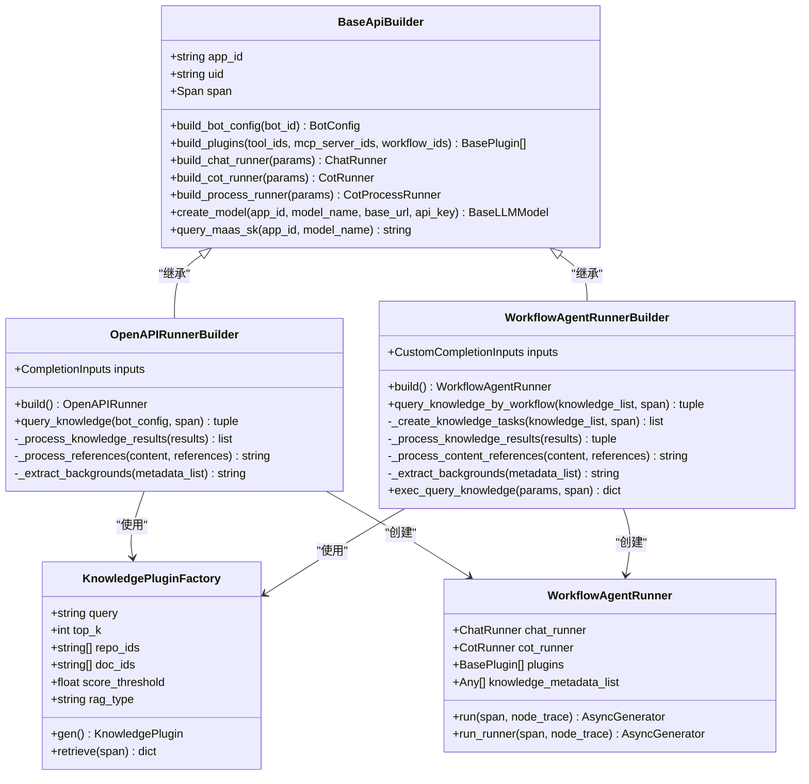
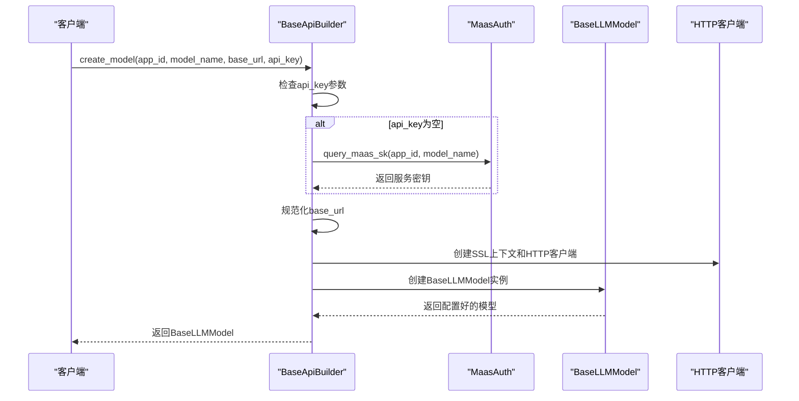
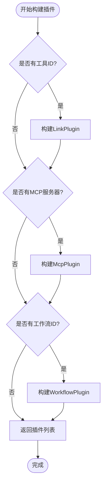
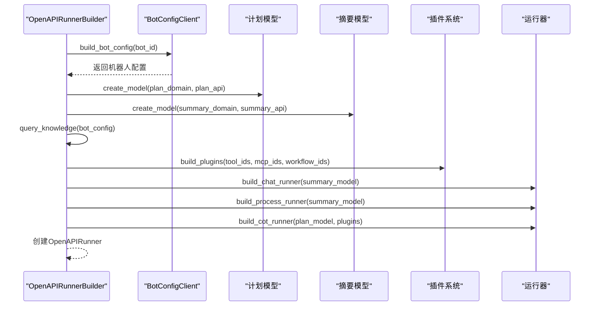
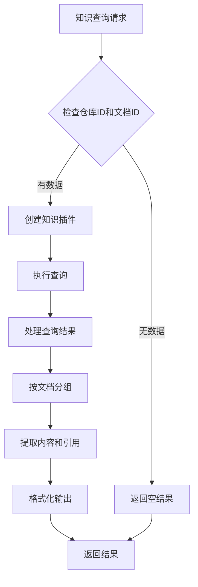
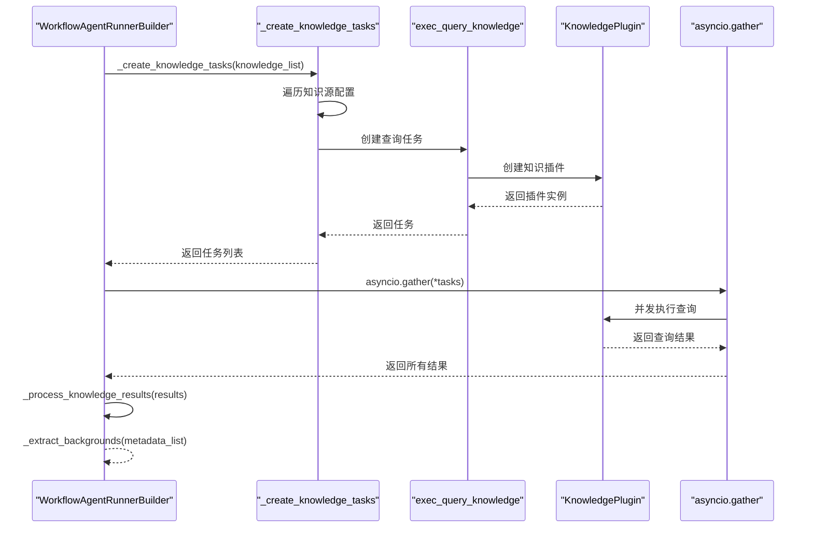
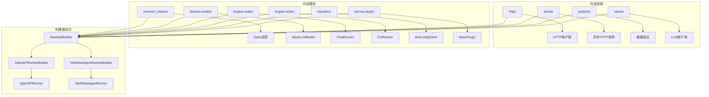

# 构建器

<cite>
**本文档中引用的文件**
- [base_builder.py](file://core/agent/service/builder/base_builder.py)
- [openapi_builder.py](file://core/agent/service/builder/openapi_builder.py)
- [workflow_agent_builder.py](file://core/agent/service/builder/workflow_agent_builder.py)
- [knowledge.py](file://core/agent/service/plugin/knowledge.py)
- [workflow_agent_runner.py](file://core/agent/engine/workflow_agent_runner.py)
- [openapi_runner.py](file://core/agent/service/runner/openapi_runner.py)
- [workflow_agent_inputs.py](file://core/agent/api/schemas/workflow_agent_inputs.py)
- [openapi_inputs.py](file://core/agent/api/schemas/openapi_inputs.py)
- [test_openapi_builder.py](file://core/agent/tests/unit/service/builder/test_openapi_builder.py)
- [test_workflow_agent_builder.py](file://core/agent/tests/unit/service/builder/test_workflow_agent_builder.py)
</cite>

## 目录
1. [简介](#简介)
2. [项目结构](#项目结构)
3. [核心组件](#核心组件)
4. [架构概览](#架构概览)
5. [详细组件分析](#详细组件分析)
6. [依赖关系分析](#依赖关系分析)
7. [性能考虑](#性能考虑)
8. [故障排除指南](#故障排除指南)
9. [结论](#结论)

## 简介

astron-agent项目中的构建器系统是一个高度模块化的工作流构建框架，专门用于将配置数据转换为可执行的工作流实例。该系统通过三个主要的构建器类实现了灵活且可扩展的代理构建能力：

- **BaseApiBuilder**: 提供构建器的基础功能和通用方法
- **OpenAPIRunnerBuilder**: 专门处理基于OpenAPI规范的代理构建
- **WorkflowAgentRunnerBuilder**: 专为工作流代理设计的高级构建器

这些构建器共同构成了一个完整的代理生命周期管理框架，从配置解析到运行时实例的创建，涵盖了验证、转换和优化等关键步骤。

## 项目结构

构建器相关的核心文件组织在以下目录结构中：

**图表来源**
- [base_builder.py](file://core/agent/service/builder/base_builder.py#L1-L50)
- [openapi_builder.py](file://core/agent/service/builder/openapi_builder.py#L1-L30)
- [workflow_agent_builder.py](file://core/agent/service/builder/workflow_agent_builder.py#L1-L30)

**章节来源**
- [base_builder.py](file://core/agent/service/builder/base_builder.py#L1-L307)
- [openapi_builder.py](file://core/agent/service/builder/openapi_builder.py#L1-L157)
- [workflow_agent_builder.py](file://core/agent/service/builder/workflow_agent_builder.py#L1-L231)

## 核心组件

### 基础构建器 (BaseApiBuilder)

BaseApiBuilder是所有构建器的基础类，提供了通用的构建功能和基础设施支持：

#### 核心功能特性：
- **模型创建**: 支持多种LLM模型的创建和配置
- **插件管理**: 统一的插件构建和管理接口
- **运行器构建**: 聊天、思维链和流程运行器的创建
- **知识查询**: 知识库集成和查询功能
- **认证管理**: MaaS服务密钥管理和认证

#### 关键数据结构：
- **RunnerParams**: 运行器构建的通用参数
- **CotRunnerParams**: 思维链运行器的专用参数
- **Span**: 分布式追踪支持

### OpenAPI构建器 (OpenAPIRunnerBuilder)

OpenAPIRunnerBuilder专门处理基于OpenAPI规范的代理构建，具有以下特点：

#### 特殊功能：
- **双模型架构**: 支持计划模型和摘要模型的分离
- **知识库深度集成**: 高级知识查询和处理能力
- **参考处理**: 支持图像和表格等复杂内容格式
- **RAG类型支持**: 多种检索增强生成策略

### 工作流构建器 (WorkflowAgentRunnerBuilder)

WorkflowAgentRunnerBuilder是专门为工作流代理设计的高级构建器：

#### 高级特性：
- **异步知识查询**: 并发知识库查询优化
- **多知识源管理**: 支持多个知识库源的统一管理
- **动态路由**: 基于知识类型的智能路由
- **复杂引用处理**: 高级内容引用和格式化

**章节来源**
- [base_builder.py](file://core/agent/service/builder/base_builder.py#L40-L120)
- [openapi_builder.py](file://core/agent/service/builder/openapi_builder.py#L12-L50)
- [workflow_agent_builder.py](file://core/agent/service/builder/workflow_agent_builder.py#L26-L80)

## 架构概览

构建器系统采用分层架构设计，确保了良好的可扩展性和维护性：

**图表来源**
- [base_builder.py](file://core/agent/service/builder/base_builder.py#L40-L307)
- [openapi_builder.py](file://core/agent/service/builder/openapi_builder.py#L12-L157)
- [workflow_agent_builder.py](file://core/agent/service/builder/workflow_agent_builder.py#L26-L231)

## 详细组件分析

### 基础构建器详细分析

#### 模型创建机制

基础构建器提供了强大的模型创建功能，支持多种配置选项：

**图表来源**
- [base_builder.py](file://core/agent/service/builder/base_builder.py#L250-L307)

#### 插件管理系统

插件系统支持多种类型的插件统一管理：

**图表来源**
- [base_builder.py](file://core/agent/service/builder/base_builder.py#L60-L100)

**章节来源**
- [base_builder.py](file://core/agent/service/builder/base_builder.py#L40-L307)

### OpenAPI构建器详细分析

#### 双模型架构设计

OpenAPI构建器采用了独特的双模型架构，分别处理不同的任务：

**图表来源**
- [openapi_builder.py](file://core/agent/service/builder/openapi_builder.py#L15-L50)

#### 知识库查询优化

OpenAPI构建器提供了高级的知识库查询功能：

**图表来源**
- [openapi_builder.py](file://core/agent/service/builder/openapi_builder.py#L52-L100)

**章节来源**
- [openapi_builder.py](file://core/agent/service/builder/openapi_builder.py#L12-L157)

### 工作流构建器详细分析

#### 异步知识查询系统

工作流构建器引入了先进的异步知识查询机制：

**图表来源**
- [workflow_agent_builder.py](file://core/agent/service/builder/workflow_agent_builder.py#L80-L120)

#### 动态知识源路由

工作流构建器支持多种知识源类型的智能路由：

| 知识源类型 | 数值标识 | RAG类型 | 用途 |
|------------|----------|---------|------|
| AIUI-RAG2 | 1 | AIUI-RAG2 | 默认知识库查询 |
| CBG-RAG | 2 | CBG-RAG | CBG知识库集成 |
| Ragflow-RAG | 3 | Ragflow-RAG | Ragflow知识库 |

**章节来源**
- [workflow_agent_builder.py](file://core/agent/service/builder/workflow_agent_builder.py#L26-L231)

## 依赖关系分析

构建器系统的依赖关系展现了清晰的层次结构：

**图表来源**
- [base_builder.py](file://core/agent/service/builder/base_builder.py#L1-L20)
- [openapi_builder.py](file://core/agent/service/builder/openapi_builder.py#L1-L10)
- [workflow_agent_builder.py](file://core/agent/service/builder/workflow_agent_builder.py#L1-L15)

**章节来源**
- [base_builder.py](file://core/agent/service/builder/base_builder.py#L1-L307)
- [openapi_builder.py](file://core/agent/service/builder/openapi_builder.py#L1-L157)
- [workflow_agent_builder.py](file://core/agent/service/builder/workflow_agent_builder.py#L1-L231)

## 性能考虑

构建器系统在设计时充分考虑了性能优化：

### 并发处理优化
- **异步知识查询**: 工作流构建器使用`asyncio.gather`实现并发知识库查询
- **插件并行构建**: 基础构建器支持插件的并行创建和初始化
- **HTTP连接池**: 使用连接池和超时配置优化网络请求性能

### 内存管理
- **惰性加载**: 知识库内容按需加载和处理
- **对象复用**: 运行器实例的合理复用和生命周期管理
- **垃圾回收**: 及时释放不再需要的资源和缓存

### 缓存策略
- **模型缓存**: LLM模型实例的智能缓存
- **配置缓存**: Bot配置的本地缓存机制
- **插件缓存**: 插件工厂的实例缓存

## 故障排除指南

### 常见构建错误及解决方案

#### 1. 模型创建失败
**症状**: `create_model`方法抛出异常
**原因**: 
- API密钥无效或过期
- 网络连接问题
- URL格式不正确

**解决方案**:
- 验证API密钥的有效性
- 检查网络连接状态
- 确认base_url格式正确（移除/chat/completions后缀）

#### 2. 插件构建错误
**症状**: `build_plugins`方法返回空列表或抛出异常
**原因**:
- 工具ID无效
- MCP服务器不可达
- 工作流ID不存在

**解决方案**:
- 验证工具ID和工作流ID的有效性
- 检查MCP服务器的可用性
- 查看插件工厂的日志输出

#### 3. 知识库查询超时
**症状**: `query_knowledge`方法执行时间过长
**原因**:
- 知识库响应缓慢
- 查询参数不当
- 网络延迟过高

**解决方案**:
- 调整超时设置
- 优化查询条件
- 使用更高效的知识库配置

#### 4. 工作流构建器异步任务失败
**症状**: `_create_knowledge_tasks`返回空列表
**原因**:
- 空知识源列表
- 无效的仓库ID或文档ID
- RAG类型配置错误

**解决方案**:
- 检查知识源配置
- 验证仓库和文档ID
- 使用正确的RAG类型映射

**章节来源**
- [test_openapi_builder.py](file://core/agent/tests/unit/service/builder/test_openapi_builder.py#L400-L500)
- [test_workflow_agent_builder.py](file://core/agent/tests/unit/service/builder/test_workflow_agent_builder.py#L400-L500)

## 结论

astron-agent的构建器系统展现了现代软件架构的最佳实践：

### 设计优势
1. **模块化设计**: 清晰的职责分离和可扩展的架构
2. **类型安全**: 完整的Pydantic验证和类型注解
3. **异步优先**: 全面的异步编程支持
4. **监控友好**: 内置的分布式追踪和日志记录

### 扩展指南
要添加新的构建器类型，建议遵循以下步骤：
1. **继承BaseApiBuilder**: 利用现有的基础设施
2. **定义输入模式**: 创建相应的输入数据模型
3. **实现build方法**: 实现具体的构建逻辑
4. **添加测试用例**: 确保新构建器的质量和稳定性
5. **更新文档**: 维护完整的使用文档

### 最佳实践
- 使用一致的命名约定和错误处理模式
- 充分利用异步编程提高性能
- 实施全面的单元测试覆盖
- 保持与现有构建器的兼容性

这个构建器系统为astron-agent提供了强大而灵活的代理构建能力，支持从简单的聊天机器人到复杂的多模态工作流的各种应用场景。