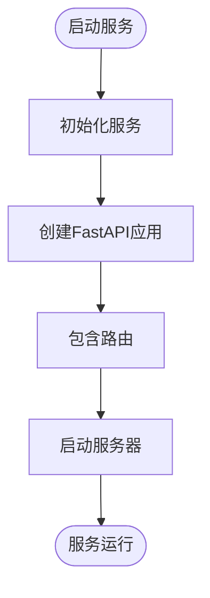

# 后端架构

<cite>
**本文档引用的文件**
- [main.py](file://core/agent/main.py)
- [workflow_agent_runner.py](file://core/agent/engine/workflow_agent_runner.py)
- [main.go](file://core/tenant/main.go)
- [server.go](file://core/tenant/app/server.go)
- [config.go](file://core/tenant/config/config.go)
- [app.py](file://core/agent/api/app.py)
- [openapi_runner.py](file://core/agent/service/runner/openapi_runner.py)
- [router.py](file://core/workflow/api/v1/router.py)
- [knowledge/main.py](file://core/knowledge/main.py)
- [middleware.py](file://core/agent/infra/config/middleware.py)
- [auth.py](file://core/workflow/extensions/fastapi/middleware/auth.py)
- [workflow_agent.py](file://core/agent/api/v1/workflow_agent.py)
</cite>

## 目录
1. [介绍](#介绍)
2. [项目结构](#项目结构)
3. [核心组件](#核心组件)
4. [架构概览](#架构概览)
5. [详细组件分析](#详细组件分析)
6. [依赖分析](#依赖分析)
7. [性能考虑](#性能考虑)
8. [故障排除指南](#故障排除指南)
9. [结论](#结论)

## 介绍
本后端架构文档全面描述了微服务架构的设计与实现，重点阐述了Agent服务作为核心协调者的角色及其与Workflow、Knowledge等服务的交互方式。文档详细解释了FastAPI在各个服务中的应用，包括路由定义、依赖注入和中间件使用。同时，深入分析了工作流执行引擎（workflow_agent_runner.py）的工作原理，以及租户服务（tenant）使用Go语言实现的考虑因素。文档还涵盖了服务间的通信机制、数据一致性保证和错误处理策略，并提供了微服务架构图，展示服务拓扑和通信路径。

## 项目结构
项目采用微服务架构，主要由多个独立的服务组成，每个服务都有其特定的职责和功能。核心服务包括Agent、Workflow、Knowledge、Tenant等，这些服务通过定义良好的API接口进行通信。项目结构清晰地分离了不同功能模块，便于维护和扩展。

**图源**
- [core/agent/main.py](file://core/agent/main.py)
- [core/workflow/main.py](file://core/workflow/main.py)
- [core/knowledge/main.py](file://core/knowledge/main.py)
- [core/tenant/main.go](file://core/tenant/main.go)

**节源**
- [core/agent/main.py](file://core/agent/main.py)
- [core/workflow/main.py](file://core/workflow/main.py)
- [core/knowledge/main.py](file://core/knowledge/main.py)
- [core/tenant/main.go](file://core/tenant/main.go)

## 核心组件
系统的核心组件包括Agent服务、Workflow服务、Knowledge服务和Tenant服务。Agent服务作为核心协调者，负责接收外部请求并协调其他服务完成任务。Workflow服务负责工作流的定义和执行，Knowledge服务提供知识检索功能，Tenant服务则管理租户相关的配置和数据。

**节源**
- [core/agent/main.py](file://core/agent/main.py)
- [core/workflow/main.py](file://core/workflow/main.py)
- [core/knowledge/main.py](file://core/knowledge/main.py)
- [core/tenant/main.go](file://core/tenant/main.go)

## 架构概览
系统采用微服务架构，各服务通过HTTP API进行通信。Agent服务作为前端网关，接收所有外部请求，并根据请求类型将请求转发给相应的后端服务。这种架构设计提高了系统的可扩展性和可维护性。

**图源**
- [core/agent/main.py](file://core/agent/main.py)
- [core/workflow/main.py](file://core/workflow/main.py)
- [core/knowledge/main.py](file://core/knowledge/main.py)
- [core/tenant/main.go](file://core/tenant/main.go)

## 详细组件分析

### Agent服务分析
Agent服务是整个系统的核心协调者，负责接收外部请求并协调其他服务完成任务。该服务使用FastAPI框架构建，提供了RESTful API接口。

#### Agent服务类图

**图源**
- [core/agent/main.py](file://core/agent/main.py)
- [core/agent/engine/workflow_agent_runner.py](file://core/agent/engine/workflow_agent_runner.py)
- [core/agent/service/runner/openapi_runner.py](file://core/agent/service/runner/openapi_runner.py)

### Workflow服务分析
Workflow服务负责工作流的定义和执行，使用FastAPI框架构建，提供了丰富的API接口用于管理工作流。

#### Workflow服务API路由

**图源**
- [core/workflow/api/v1/router.py](file://core/workflow/api/v1/router.py)

### Knowledge服务分析
Knowledge服务提供知识检索功能，使用FastAPI框架构建，通过RAG（Retrieval-Augmented Generation）技术实现知识查询。

#### Knowledge服务启动流程

**图源**
- [core/knowledge/main.py](file://core/knowledge/main.py)

### Tenant服务分析
Tenant服务使用Go语言实现，负责管理租户相关的配置和数据。选择Go语言主要是因为其在并发处理和系统编程方面的优势。

#### Tenant服务启动流程

**图源**
- [core/tenant/main.go](file://core/tenant/main.go)
- [core/tenant/app/server.go](file://core/tenant/app/server.go)
- [core/tenant/config/config.go](file://core/tenant/config/config.go)

**节源**
- [core/tenant/main.go](file://core/tenant/main.go)
- [core/tenant/app/server.go](file://core/tenant/app/server.go)
- [core/tenant/config/config.go](file://core/tenant/config/config.go)

## 依赖分析
系统各组件之间存在明确的依赖关系，这些依赖关系通过接口定义和配置文件进行管理。

**图源**
- [core/agent/infra/config/middleware.py](file://core/agent/infra/config/middleware.py)
- [core/workflow/extensions/fastapi/middleware/auth.py](file://core/workflow/extensions/fastapi/middleware/auth.py)

## 性能考虑
系统在设计时充分考虑了性能因素，采用了多种优化策略：
- 使用FastAPI框架，利用其异步特性提高处理效率
- 通过Redis缓存频繁访问的数据，减少数据库查询
- 使用连接池管理数据库连接，避免频繁创建和销毁连接
- 采用分布式追踪技术，便于性能瓶颈的定位和分析

## 故障排除指南
当系统出现问题时，可以按照以下步骤进行排查：
1. 检查服务日志，查找错误信息
2. 验证配置文件是否正确
3. 检查网络连接是否正常
4. 验证数据库连接是否可用
5. 检查依赖服务是否正常运行

**节源**
- [core/agent/main.py](file://core/agent/main.py)
- [core/tenant/app/server.go](file://core/tenant/app/server.go)

## 结论
本架构文档全面描述了系统的微服务架构设计和实现。通过将系统分解为多个独立的服务，提高了系统的可扩展性和可维护性。Agent服务作为核心协调者，有效地管理了与其他服务的交互。FastAPI框架的使用确保了API接口的高效和可靠。Go语言在Tenant服务中的应用充分发挥了其在系统编程方面的优势。整体架构设计合理，能够满足系统的功能和性能需求。