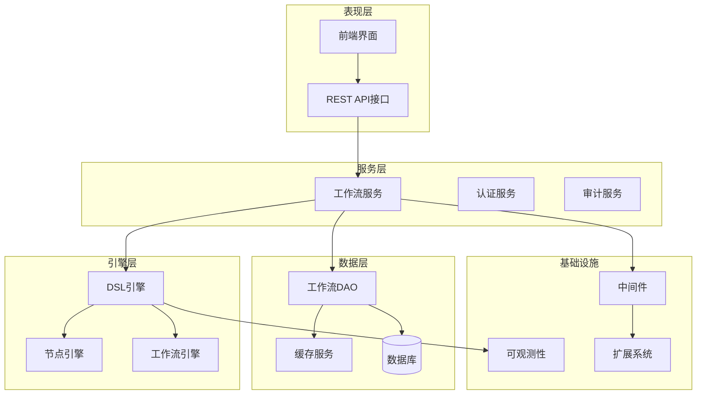
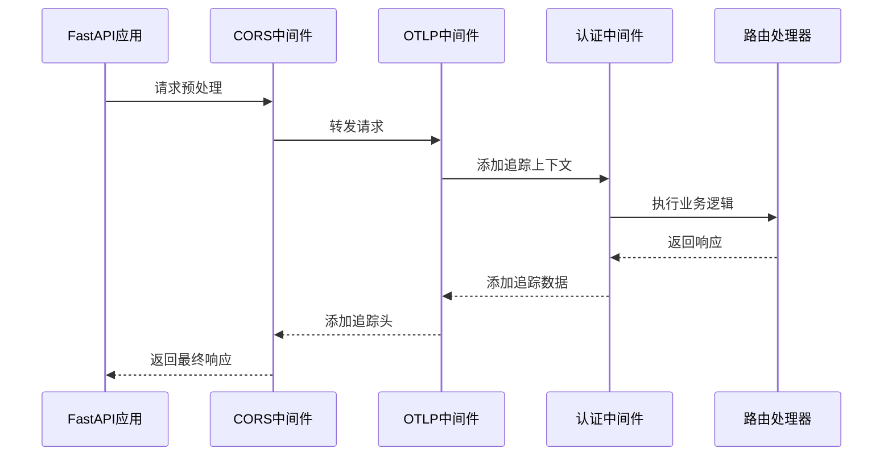
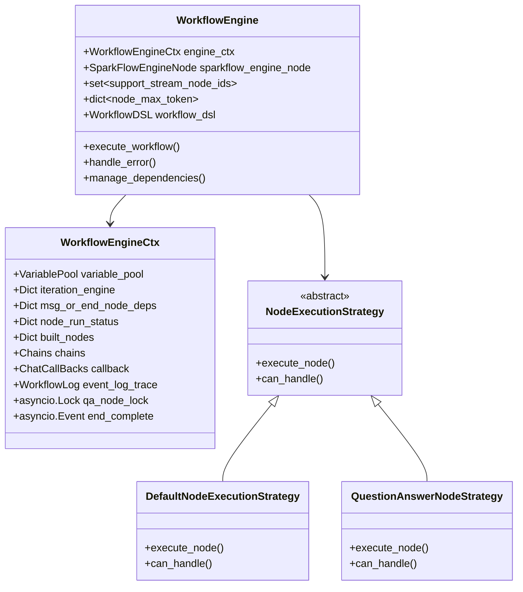
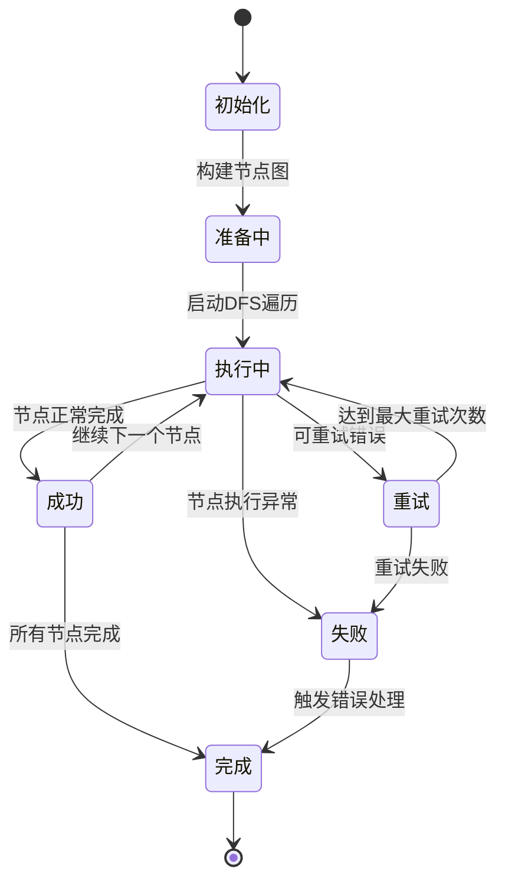
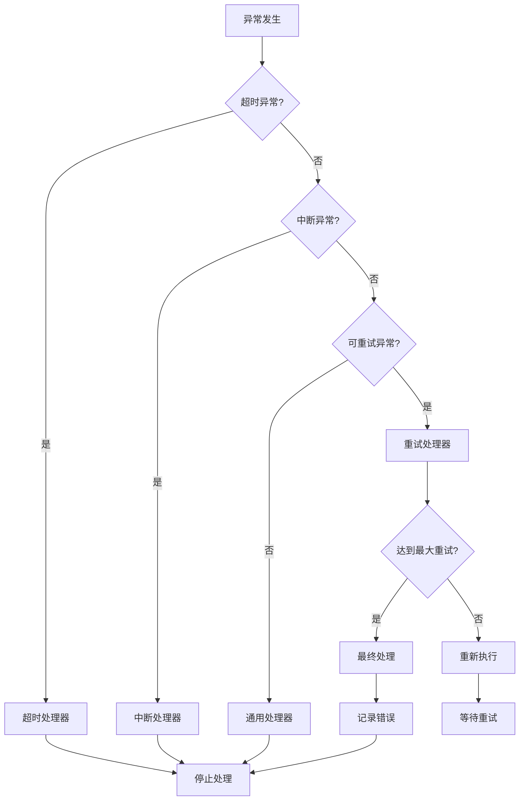
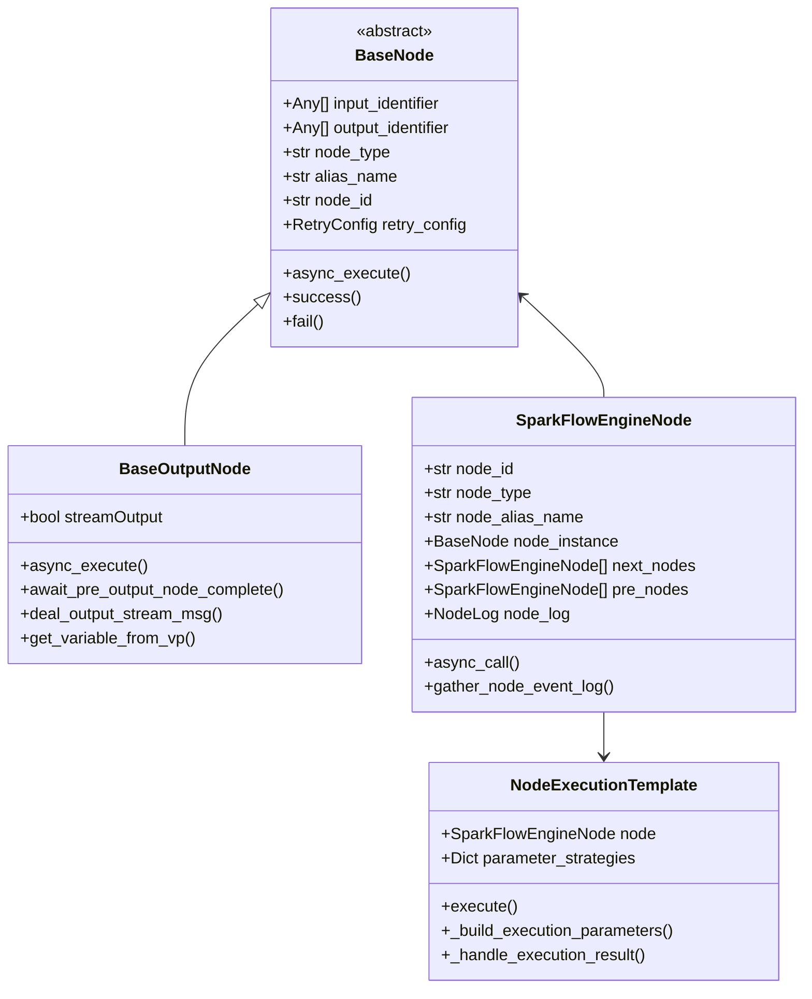
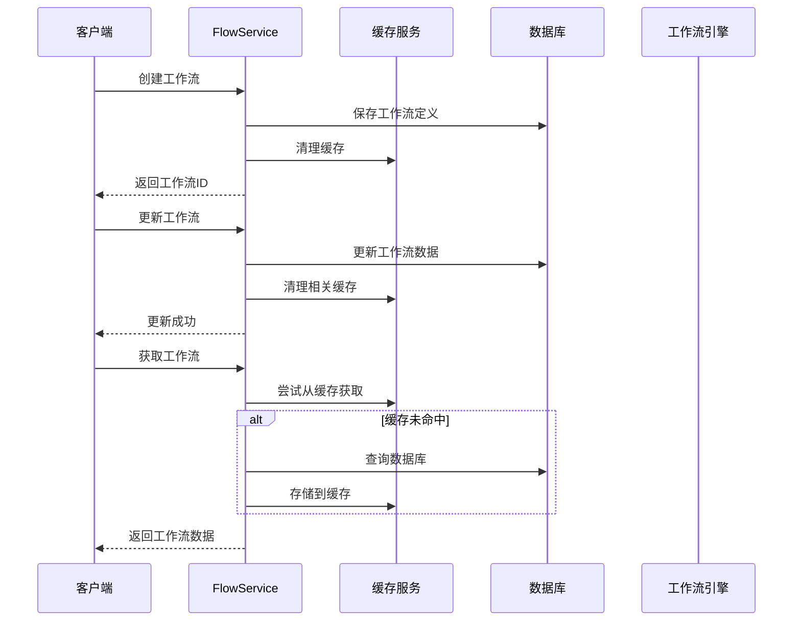
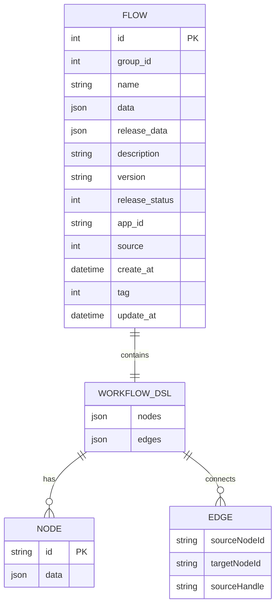
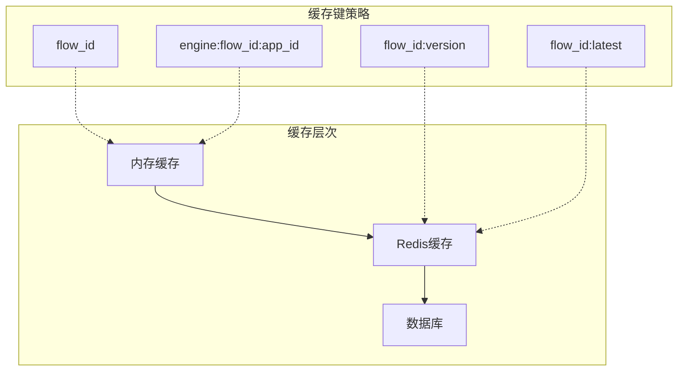
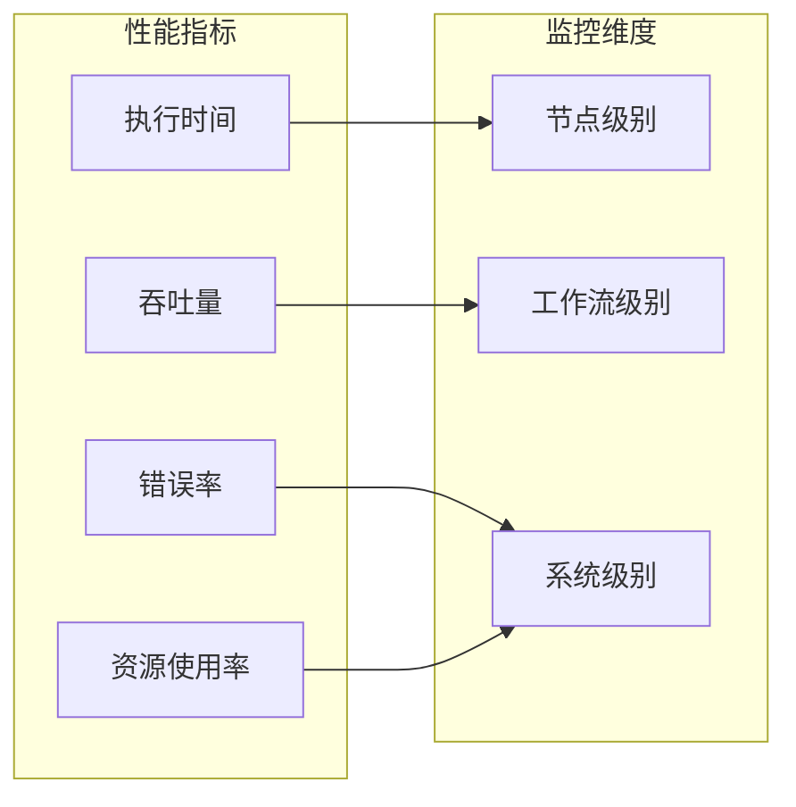

# 工作流服务深度技术文档

<cite>
**本文档引用的文件**
- [main.py](file://core/workflow/main.py)
- [dsl_engine.py](file://core/workflow/engine/dsl_engine.py)
- [node.py](file://core/workflow/engine/node.py)
- [flow_service.py](file://core/workflow/service/flow_service.py)
- [flow.py](file://core/workflow/domain/models/flow.py)
- [base_node.py](file://core/workflow/engine/nodes/base_node.py)
- [flow_node.py](file://core/workflow/engine/nodes/flow/flow_node.py)
- [workflow_dsl.py](file://core/workflow/engine/entities/workflow_dsl.py)
- [initialize.py](file://core/workflow/extensions/middleware/initialize.py)
- [flow.py](file://core/workflow/cache/flow.py)
- [flow_dao.py](file://core/workflow/repository/flow_dao.py)
</cite>

## 目录
1. [概述](#概述)
2. [项目架构](#项目架构)
3. [应用配置与扩展初始化](#应用配置与扩展初始化)
4. [DSL引擎设计](#dsl引擎设计)
5. [节点基类与具体实现](#节点基类与具体实现)
6. [工作流服务层](#工作流服务层)
7. [领域模型与数据持久化](#领域模型与数据持久化)
8. [工作流调试与性能监控](#工作流调试与性能监控)
9. [总结](#总结)

## 概述

工作流服务是一个强大的流程编排引擎，提供了完整的可视化工作流设计、执行和管理能力。该系统采用模块化架构，支持多种节点类型的组合，实现了灵活的工作流自动化解决方案。

核心特性包括：
- 基于DSL（领域特定语言）的工作流定义
- 异步节点执行和流式处理
- 完整的错误处理和重试机制
- 缓存优化和性能监控
- 支持嵌套工作流调用

## 项目架构

工作流服务采用分层架构设计，包含以下主要层次：

**图表来源**
- [main.py](file://core/workflow/main.py#L1-L168)
- [flow_service.py](file://core/workflow/service/flow_service.py#L1-L427)

**章节来源**
- [main.py](file://core/workflow/main.py#L1-L168)
- [flow_service.py](file://core/workflow/service/flow_service.py#L1-L427)

## 应用配置与扩展初始化

### 主应用入口点

工作流服务的主入口点位于 [`main.py`](file://core/workflow/main.py)，负责整个应用的初始化和配置。

#### 核心初始化流程

应用启动时执行以下初始化步骤：

1. **服务初始化**：通过 [`initialize_services()`](file://core/workflow/extensions/middleware/initialize.py#L12-L32) 注册所有中间件服务工厂
2. **FastAPI应用创建**：构建配置化的FastAPI实例
3. **中间件配置**：设置CORS、OTLP追踪、认证中间件
4. **路由注册**：包含工作流相关的API路由
5. **异常处理器**：配置请求验证错误处理

#### 中间件架构

**图表来源**
- [main.py](file://core/workflow/main.py#L30-L80)
- [initialize.py](file://core/workflow/extensions/middleware/initialize.py#L12-L32)

### 扩展系统初始化

扩展系统通过工厂模式管理各种服务的注册和依赖注入：

- **服务工厂**：定义服务创建逻辑
- **依赖管理**：自动解析和注入服务依赖
- **生命周期管理**：确保服务正确初始化和销毁

**章节来源**
- [main.py](file://core/workflow/main.py#L30-L168)
- [initialize.py](file://core/workflow/extensions/middleware/initialize.py#L12-L32)

## DSL引擎设计

### 引擎架构概览

DSL引擎是工作流服务的核心执行引擎，负责解析和执行工作流定义。其设计遵循以下原则：

- **异步执行**：支持非阻塞的节点执行
- **流式处理**：支持实时数据流传输
- **错误恢复**：完善的错误处理和重试机制
- **可扩展性**：支持多种节点类型和执行策略

**图表来源**
- [dsl_engine.py](file://core/workflow/engine/dsl_engine.py#L70-L150)
- [dsl_engine.py](file://core/workflow/engine/dsl_engine.py#L600-L700)

### 节点调度与状态转换

#### 执行上下文管理

[`WorkflowEngineCtx`](file://core/workflow/engine/dsl_engine.py#L70-L150) 是执行过程中的核心上下文对象，包含：

- **变量池**：存储和传递执行过程中的变量
- **节点状态**：跟踪每个节点的运行状态
- **依赖关系**：管理节点间的依赖关系
- **执行链**：维护节点间的执行顺序

#### 状态转换机制

**图表来源**
- [dsl_engine.py](file://core/workflow/engine/dsl_engine.py#L150-L250)

### 错误处理机制

#### 异常处理链

DSL引擎实现了责任链模式的异常处理机制：

**图表来源**
- [dsl_engine.py](file://core/workflow/engine/dsl_engine.py#L250-L400)

#### 重试策略配置

每个节点可以配置独立的重试策略：

- **最大重试次数**：控制重试上限
- **错误策略**：定义不同错误类型的处理方式
- **自定义输出**：在重试失败时返回指定内容
- **超时控制**：防止无限等待

**章节来源**
- [dsl_engine.py](file://core/workflow/engine/dsl_engine.py#L70-L800)

## 节点基类与具体实现

### 节点设计模式

工作流引擎采用模板方法模式和策略模式相结合的设计：

**图表来源**
- [base_node.py](file://core/workflow/engine/nodes/base_node.py#L50-L150)
- [node.py](file://core/workflow/engine/node.py#L400-L500)

### 具体节点类型实现

#### LLM节点

大语言模型节点支持多种模型提供商：

- **讯飞星火**：支持流式和非流式输出
- **OpenAI**：兼容OpenAI API格式
- **自定义模型**：支持第三方模型接入

#### 数据库节点

数据库节点提供标准化的数据操作能力：

- **查询执行**：支持复杂SQL查询
- **事务管理**：确保数据一致性
- **连接池**：优化数据库连接性能

#### 插件节点

插件节点支持外部工具集成：

- **工具调用**：执行外部API或脚本
- **参数映射**：自动处理输入输出转换
- **错误隔离**：防止插件故障影响整体流程

#### 流程节点

流程节点实现工作流嵌套调用：

- **子流程执行**：调用其他工作流作为子任务
- **参数传递**：支持复杂的参数映射
- **结果聚合**：合并多个子流程的结果

**章节来源**
- [base_node.py](file://core/workflow/engine/nodes/base_node.py#L50-L800)
- [node.py](file://core/workflow/engine/node.py#L400-L960)
- [flow_node.py](file://core/workflow/engine/nodes/flow/flow_node.py#L1-L200)

## 工作流服务层

### 核心业务逻辑

工作流服务层提供了完整的业务逻辑封装，包括：

#### 工作流生命周期管理

**图表来源**
- [flow_service.py](file://core/workflow/service/flow_service.py#L20-L100)

#### 调试功能

工作流服务提供了强大的调试功能：

- **节点级调试**：单独测试单个节点
- **输入审计**：安全检查输入参数
- **输出审计**：验证输出内容
- **性能监控**：测量执行时间和资源消耗

#### 版本管理

支持工作流的版本控制：

- **语义化版本**：遵循语义化版本规范
- **发布状态**：区分草稿和已发布版本
- **向后兼容**：确保版本间的兼容性

**章节来源**
- [flow_service.py](file://core/workflow/service/flow_service.py#L20-L427)

## 领域模型与数据持久化

### 数据模型设计

工作流领域的核心数据模型定义了完整的数据结构：

**图表来源**
- [flow.py](file://core/workflow/domain/models/flow.py#L15-L53)
- [workflow_dsl.py](file://core/workflow/engine/entities/workflow_dsl.py#L120-L162)

### 缓存策略

工作流服务实现了多层缓存策略以提升性能：

#### 缓存层次结构

**图表来源**
- [flow.py](file://core/workflow/cache/flow.py#L10-L117)

#### 缓存更新策略

- **写入时清理**：更新数据时立即清理相关缓存
- **定期过期**：设置合理的缓存过期时间
- **智能预热**：根据访问模式预加载热点数据

**章节来源**
- [flow.py](file://core/workflow/domain/models/flow.py#L15-L53)
- [flow.py](file://core/workflow/cache/flow.py#L10-L117)
- [flow_dao.py](file://core/workflow/repository/flow_dao.py#L10-L74)

## 工作流调试与性能监控

### 调试指南

#### 节点调试功能

工作流服务提供了专门的节点调试功能：

1. **输入审计**：检查输入参数的安全性和完整性
2. **执行模拟**：在隔离环境中测试节点逻辑
3. **输出验证**：验证输出内容符合预期格式
4. **性能分析**：测量节点执行时间和资源消耗

#### 调试最佳实践

- **最小化测试范围**：优先测试单个节点
- **参数验证**：确保输入参数符合预期格式
- **边界条件**：测试极端情况和异常输入
- **并发测试**：验证多线程环境下的稳定性

### 性能监控建议

#### 关键指标监控

#### 优化策略

1. **缓存优化**：合理设置缓存策略和过期时间
2. **并发控制**：限制同时执行的工作流数量
3. **资源管理**：监控和调整系统资源配置
4. **异步处理**：充分利用异步执行能力

#### 故障排查

常见问题及解决方案：

- **节点执行超时**：调整超时配置或优化节点逻辑
- **内存泄漏**：检查变量池管理和缓存清理
- **并发冲突**：优化锁机制和资源竞争
- **网络延迟**：配置合适的重试策略和超时时间

## 总结

工作流服务作为一个完整的流程编排引擎，展现了优秀的架构设计和实现质量。其核心优势包括：

### 技术亮点

1. **模块化设计**：清晰的分层架构和职责分离
2. **异步执行**：高性能的异步处理能力
3. **可扩展性**：灵活的节点类型和执行策略
4. **可靠性**：完善的错误处理和重试机制
5. **可观测性**：全面的监控和调试功能

### 应用价值

- **业务自动化**：支持复杂的业务流程自动化
- **系统集成**：提供标准化的系统集成接口
- **开发效率**：降低工作流开发和维护成本
- **运维便利**：提供完善的监控和调试工具

### 发展方向

未来可以考虑的改进方向：

- **AI增强**：集成更多的AI能力
- **云原生**：更好的容器化和微服务支持
- **实时协作**：支持多人实时编辑工作流
- **智能优化**：基于历史数据的自动优化建议

这个工作流服务为现代应用提供了强大而灵活的流程编排能力，是构建复杂业务系统的理想选择。