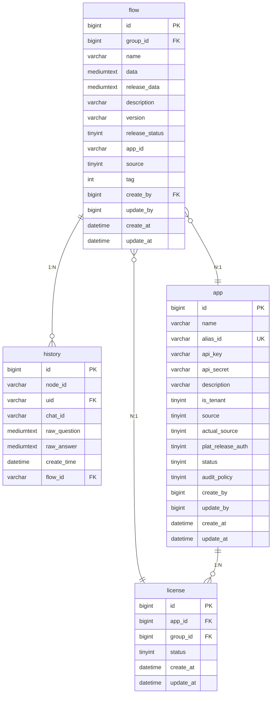

# 关系模型

<cite>
**本文档中引用的文件**  
- [flow.py](file://core/workflow/domain/models/flow.py)
- [history.py](file://core/workflow/domain/models/history.py)
- [license.py](file://core/workflow/domain/models/license.py)
- [flow_service.py](file://core/workflow/service/flow_service.py)
- [history_service.py](file://core/workflow/service/history_service.py)
- [flow_dao.py](file://core/workflow/repository/flow_dao.py)
- [license_dao.py](file://core/workflow/repository/license_dao.py)
- [workflow.sql](file://docker/astronAgent/mysql/workflow.sql)
</cite>

## 目录
1. [引言](#引言)
2. [工作流与历史记录的关系](#工作流与历史记录的关系)
3. [工作流与许可证的关系](#工作流与许可证的关系)
4. [用户与工作流的关系](#用户与工作流的关系)
5. [实体关系图（ER图）](#实体关系图（er图）)
6. [数据查询与聚合](#数据查询与聚合)
7. [结论](#结论)

## 引言
本文档详细分析工作流系统中各数据实体之间的关系。重点阐述工作流（flow）与历史记录（history）之间的一对多关系，如何通过`flow_id`外键关联执行实例。同时解释工作流与许可证（license）之间的关联关系，说明租户级别的授权如何限制工作流的创建和执行。此外，描述用户与工作流之间的归属关系，以及如何通过`created_by`字段建立联系。最后提供ER图描述实体间的关系，包括基数比、级联操作和完整性约束，并说明在数据查询和聚合时如何利用这些关系。

## 工作流与历史记录的关系
工作流（flow）与历史记录（history）之间存在一对多的关系。每个工作流可以有多个历史记录，这些记录通过`flow_id`外键与工作流关联。历史记录表`workflow_node_history`中的`flow_id`字段引用工作流表`flow`的`id`字段，从而建立这种关系。

历史记录表存储了工作流节点的执行历史，包括用户问题、节点响应和执行元数据。`flow_id`字段允许将特定工作流的执行历史与其定义关联起来，便于追踪和审计。

**Section sources**
- [flow.py](file://core/workflow/domain/models/flow.py#L17-L51)
- [history.py](file://core/workflow/domain/models/history.py#L16-L43)
- [workflow.sql](file://docker/astronAgent/mysql/workflow.sql#L100-L113)

## 工作流与许可证的关系
工作流与许可证之间通过应用和组的关联进行连接。许可证表`license`包含`app_id`和`group_id`字段，分别引用应用表`app`和工作流表`flow`的`group_id`。这种设计实现了租户级别的授权，限制了工作流的创建和执行。

当用户尝试访问或执行工作流时，系统会检查相应的许可证状态。如果许可证无效或不存在，访问将被拒绝。这种机制确保了只有授权用户才能使用特定工作流，实现了资源的访问控制。

**Section sources**
- [license.py](file://core/workflow/domain/models/license.py#L13-L35)
- [flow_service.py](file://core/workflow/service/flow_service.py#L100-L130)
- [license_dao.py](file://core/workflow/repository/license_dao.py#L10-L45)
- [workflow.sql](file://docker/astronAgent/mysql/workflow.sql#L80-L99)

## 用户与工作流的关系
用户与工作流之间的关系通过`created_by`字段建立。工作流表`flow`中的`create_by`字段记录了创建该工作流的用户ID。这个字段建立了工作流与其创建者之间的归属关系，便于追踪工作流的来源和管理权限。

此外，历史记录表`workflow_node_history`中的`uid`字段记录了触发执行的用户ID，进一步扩展了用户与工作流实例之间的交互关系。这种设计支持多用户环境下的工作流管理和审计。

**Section sources**
- [flow.py](file://core/workflow/domain/models/flow.py#L17-L51)
- [history.py](file://core/workflow/domain/models/history.py#L16-L43)
- [workflow.sql](file://docker/astronAgent/mysql/workflow.sql#L60-L79)

## 实体关系图（ER图）


**Diagram sources**
- [flow.py](file://core/workflow/domain/models/flow.py#L17-L51)
- [history.py](file://core/workflow/domain/models/history.py#L16-L43)
- [license.py](file://core/workflow/domain/models/license.py#L13-L35)
- [workflow.sql](file://docker/astronAgent/mysql/workflow.sql#L60-L113)

## 数据查询与聚合
在数据查询和聚合时，可以利用上述关系进行高效的数据库操作。例如，要获取特定工作流的所有执行历史，可以使用`flow_id`进行JOIN操作：

```sql
SELECT h.*, f.name as flow_name 
FROM workflow_node_history h 
JOIN flow f ON h.flow_id = f.id 
WHERE f.id = ?;
```

要检查用户是否有权访问特定工作流，可以结合许可证和应用信息进行查询：

```sql
SELECT l.status 
FROM license l 
JOIN app a ON l.app_id = a.id 
WHERE a.alias_id = ? AND l.group_id = ?;
```

这些查询利用了外键约束和索引，确保了查询性能和数据完整性。

**Section sources**
- [flow_service.py](file://core/workflow/service/flow_service.py#L100-L130)
- [history_service.py](file://core/workflow/service/history_service.py#L50-L100)
- [flow_dao.py](file://core/workflow/repository/flow_dao.py#L10-L73)
- [license_dao.py](file://core/workflow/repository/license_dao.py#L10-L45)

## 结论
本文档详细分析了工作流系统中各数据实体之间的关系。工作流与历史记录之间的一对多关系通过`flow_id`外键实现，支持执行历史的追踪。工作流与许可证之间的关联通过应用和组的连接实现租户级别的授权控制。用户与工作流之间的归属关系通过`created_by`字段建立，支持权限管理和审计。ER图清晰地展示了这些实体间的关系，包括基数比、级联操作和完整性约束。在数据查询和聚合时，可以充分利用这些关系进行高效的数据库操作，确保系统的性能和数据完整性。