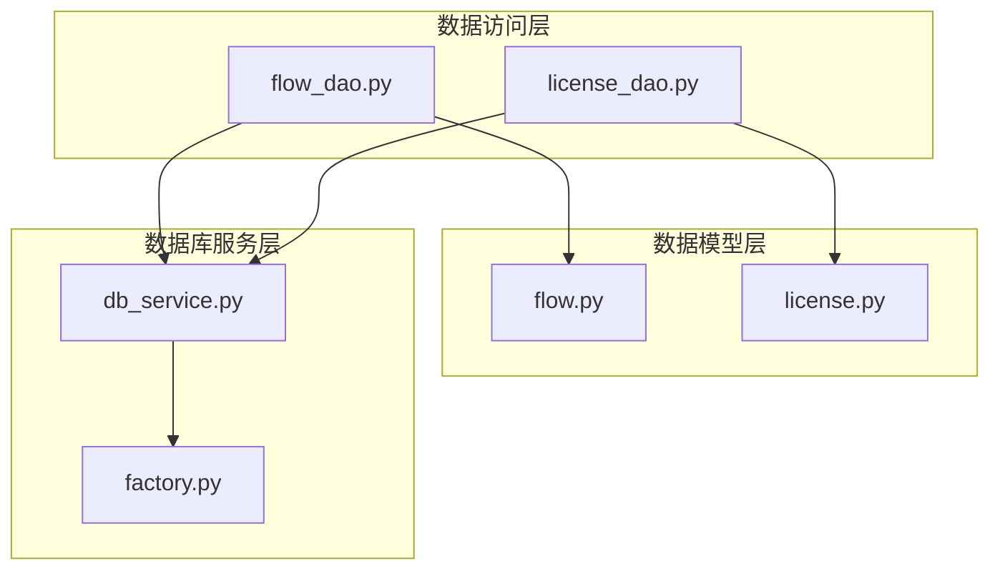
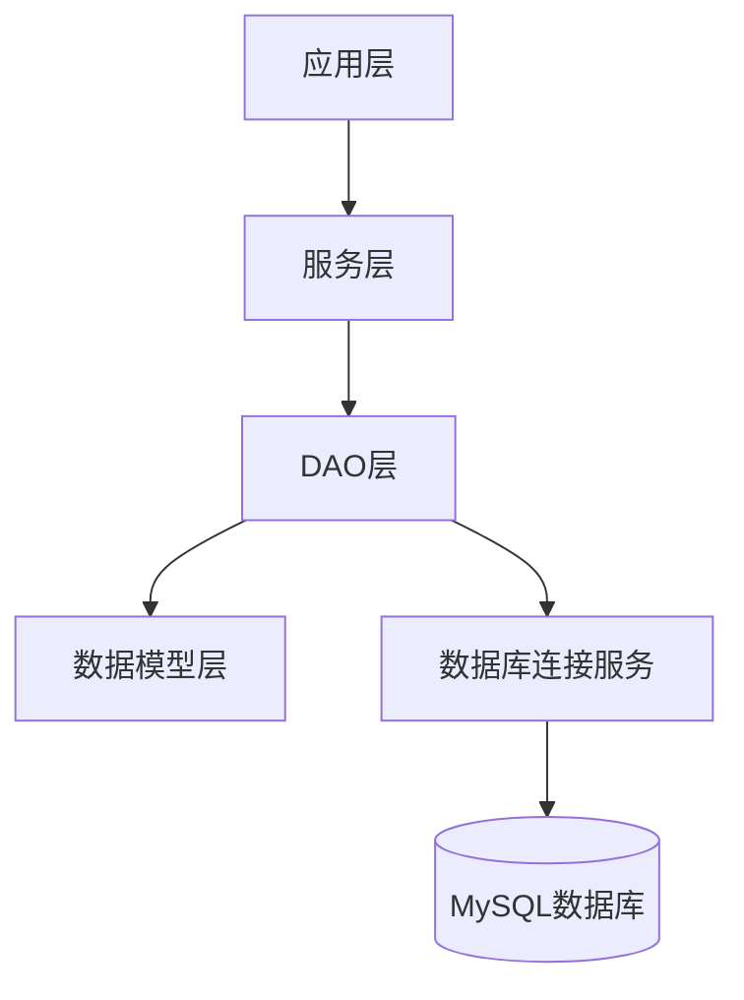
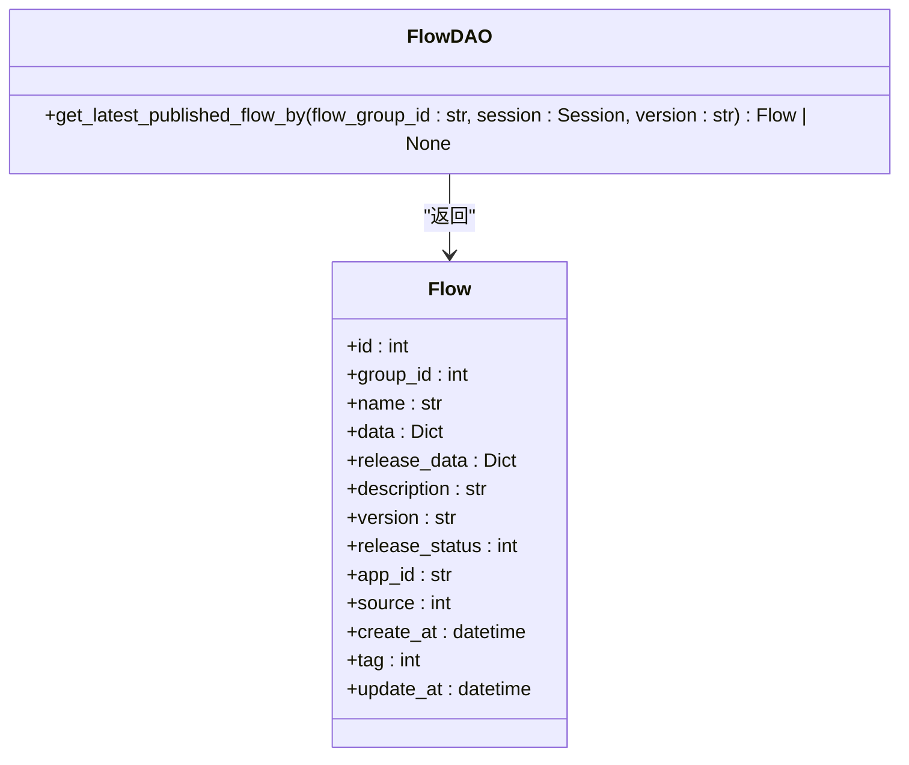
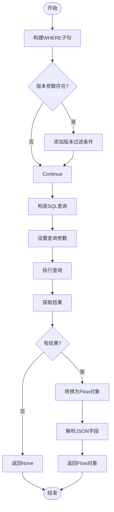
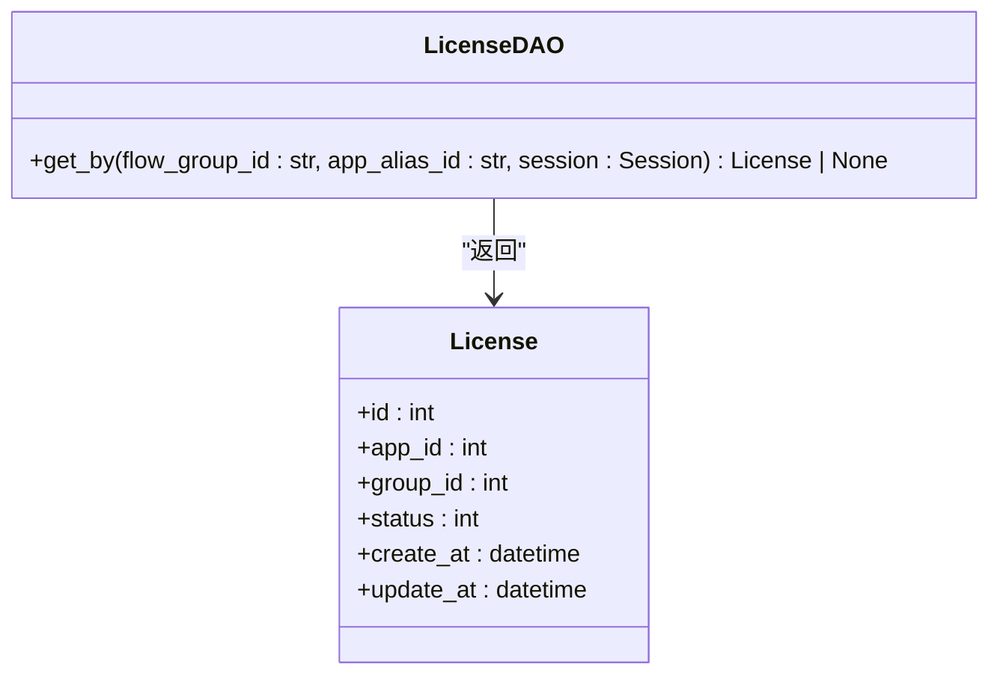
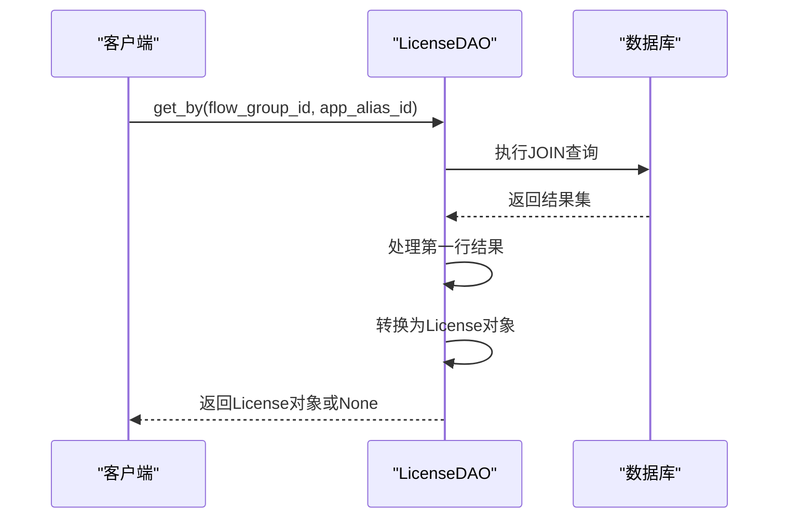
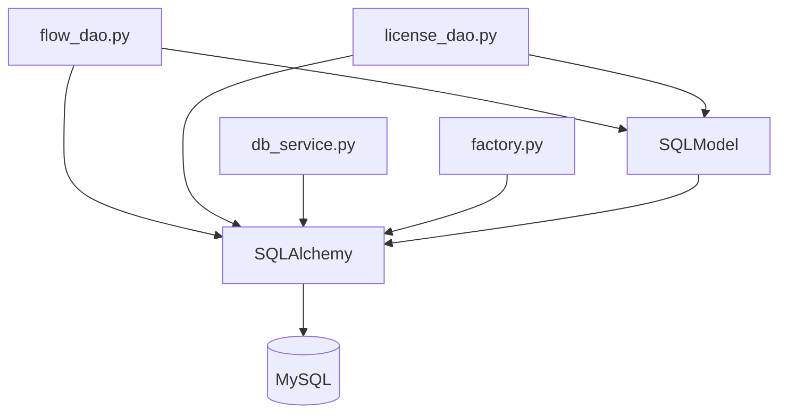

# 持久化策略

<cite>
**本文档引用的文件**
- [flow_dao.py](file://core/workflow/repository/flow_dao.py)
- [license_dao.py](file://core/workflow/repository/license_dao.py)
- [flow.py](file://core/workflow/domain/models/flow.py)
- [license.py](file://core/workflow/domain/models/license.py)
- [db_service.py](file://core/common/service/db/db_service.py)
- [factory.py](file://core/common/service/db/factory.py)
</cite>

## 目录
1. [简介](#简介)
2. [项目结构](#项目结构)
3. [核心组件](#核心组件)
4. [架构概述](#架构概述)
5. [详细组件分析](#详细组件分析)
6. [依赖分析](#依赖分析)
7. [性能考量](#性能考量)
8. [故障排除指南](#故障排除指南)
9. [结论](#结论)

## 简介
本文档详细说明了astron-agent工作流系统的数据持久化策略。重点分析了数据访问对象（DAO）层的实现，特别是`flow_dao.py`中的CRUD操作方法和`license_dao.py`中的许可证验证方法。文档还描述了数据库连接管理、事务处理、异常处理策略以及查询优化技术。

## 项目结构
工作流系统的数据持久化功能主要位于`core/workflow/repository`目录下，包含`flow_dao.py`和`license_dao.py`两个核心DAO文件。数据模型定义在`core/workflow/domain/models`目录中，而数据库连接服务由`core/common/service/db`模块提供。

**Diagram sources**
- [flow_dao.py](file://core/workflow/repository/flow_dao.py)
- [license_dao.py](file://core/workflow/repository/license_dao.py)
- [flow.py](file://core/workflow/domain/models/flow.py)
- [license.py](file://core/workflow/domain/models/license.py)
- [db_service.py](file://core/common/service/db/db_service.py)
- [factory.py](file://core/common/service/db/factory.py)

**Section sources**
- [flow_dao.py](file://core/workflow/repository/flow_dao.py)
- [license_dao.py](file://core/workflow/repository/license_dao.py)

## 核心组件
工作流系统的持久化策略基于SQLAlchemy和SQLModel框架实现，提供了对工作流和许可证数据的高效访问。`flow_dao.py`实现了工作流数据的CRUD操作，而`license_dao.py`负责许可证验证和配额检查。

**Section sources**
- [flow_dao.py](file://core/workflow/repository/flow_dao.py#L1-L73)
- [license_dao.py](file://core/workflow/repository/license_dao.py#L1-L45)

## 架构概述
系统采用分层架构，将数据访问逻辑与业务逻辑分离。DAO层直接与数据库交互，通过SQLModel定义的数据模型进行数据操作。数据库连接由核心服务层统一管理，确保连接池的高效利用。

**Diagram sources**
- [flow_dao.py](file://core/workflow/repository/flow_dao.py)
- [license_dao.py](file://core/workflow/repository/license_dao.py)
- [db_service.py](file://core/common/service/db/db_service.py)

## 详细组件分析

### Flow DAO分析
`flow_dao.py`实现了工作流数据的访问逻辑，主要包含`get_latest_published_flow_by`方法，用于根据流程组ID和版本获取最新的已发布工作流。

#### CRUD操作方法

**Diagram sources**
- [flow_dao.py](file://core/workflow/repository/flow_dao.py#L15-L73)
- [flow.py](file://core/workflow/domain/models/flow.py#L15-L52)

#### SQL查询逻辑
`get_latest_published_flow_by`方法构建了复杂的SQL查询，使用位运算检查发布状态，并按语义版本号排序。查询使用参数绑定机制防止SQL注入攻击。

**Diagram sources**
- [flow_dao.py](file://core/workflow/repository/flow_dao.py#L15-L73)

### License DAO分析
`license_dao.py`实现了许可证数据的访问逻辑，主要包含`get_by`方法，用于根据流程组ID和应用别名ID获取许可证信息。

#### 许可证验证方法

**Diagram sources**
- [license_dao.py](file://core/workflow/repository/license_dao.py#L15-L45)
- [license.py](file://core/workflow/domain/models/license.py#L15-L36)

#### 配额检查逻辑
`get_by`方法通过JOIN操作在app表和license表之间建立关联，确保能够准确找到与特定应用和流程组相关的许可证。

**Diagram sources**
- [license_dao.py](file://core/workflow/repository/license_dao.py#L15-L45)

## 依赖分析
系统依赖于SQLAlchemy和SQLModel库进行数据库操作，这些依赖在多个模块中都有使用。

**Diagram sources**
- [flow_dao.py](file://core/workflow/repository/flow_dao.py)
- [license_dao.py](file://core/workflow/repository/license_dao.py)
- [db_service.py](file://core/common/service/db/db_service.py)
- [factory.py](file://core/common/service/db/factory.py)

**Section sources**
- [flow_dao.py](file://core/workflow/repository/flow_dao.py)
- [license_dao.py](file://core/workflow/repository/license_dao.py)
- [db_service.py](file://core/common/service/db/db_service.py)
- [factory.py](file://core/common/service/db/factory.py)

## 性能考量
系统通过多种技术优化数据访问性能：

1. **索引使用**：在`flow`表的`group_id`、`name`、`version`和`release_status`字段上创建了索引，加速查询性能。
2. **分页查询**：虽然在分析的DAO方法中未直接体现，但系统设计支持分页查询以处理大量数据。
3. **连接池**：通过`db_service.py`和`factory.py`实现的数据库连接池，减少了连接创建和销毁的开销。
4. **参数化查询**：所有SQL查询都使用参数绑定，既提高了安全性，又可以通过查询计划缓存提升性能。

**Section sources**
- [flow_dao.py](file://core/workflow/repository/flow_dao.py)
- [db_service.py](file://core/common/service/db/db_service.py)

## 故障排除指南
当遇到数据访问问题时，可以按照以下步骤进行排查：

1. **检查数据库连接**：确认数据库服务是否正常运行，连接参数是否正确。
2. **验证SQL查询**：检查DAO方法中的SQL语句是否正确，特别是参数绑定和条件逻辑。
3. **查看日志**：检查应用日志中是否有数据库相关的错误信息。
4. **检查数据模型**：确认数据模型定义与数据库表结构是否匹配。
5. **测试查询性能**：对于性能问题，使用数据库性能分析工具检查查询执行计划。

**Section sources**
- [flow_dao.py](file://core/workflow/repository/flow_dao.py)
- [license_dao.py](file://core/workflow/repository/license_dao.py)
- [db_service.py](file://core/common/service/db/db_service.py)

## 结论
astron-agent工作流系统的数据持久化策略设计合理，通过分层架构实现了数据访问逻辑的清晰分离。系统充分利用了SQLAlchemy和SQLModel的功能，提供了安全、高效的数据访问能力。建议在未来的开发中进一步完善CRUD操作的完整性，添加更多的查询优化和缓存策略，以提升系统整体性能。