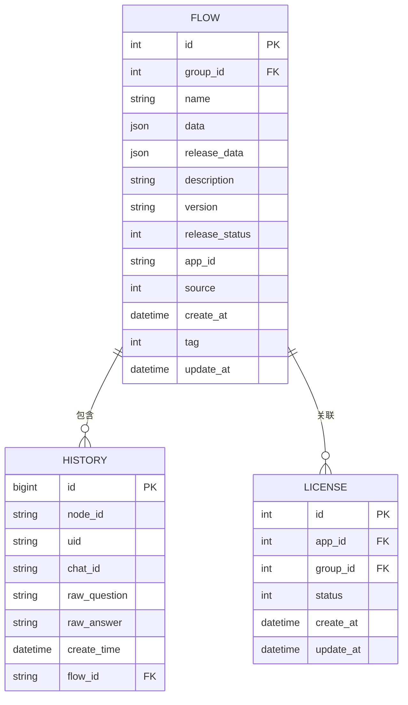
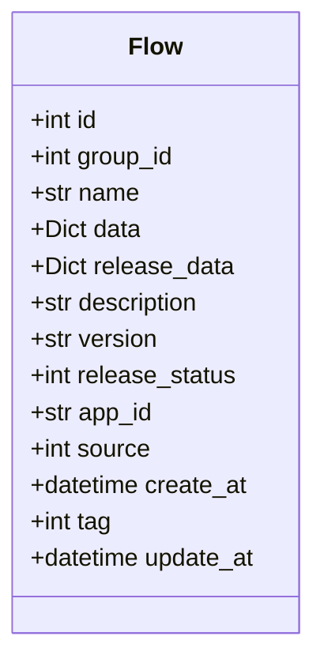
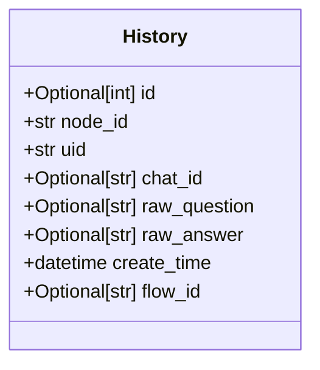
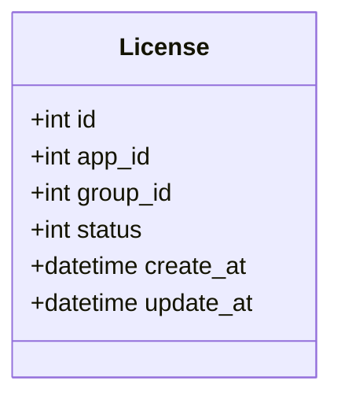
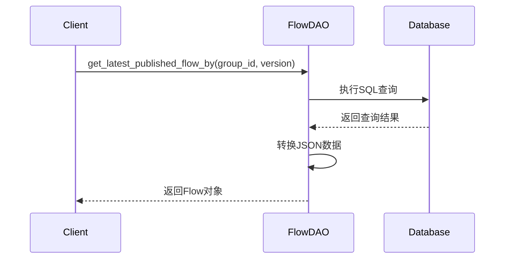
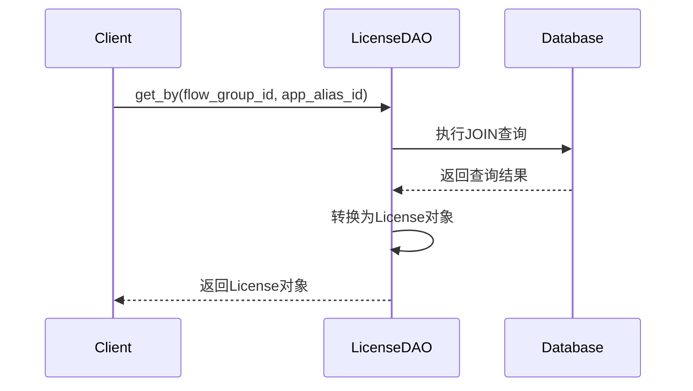
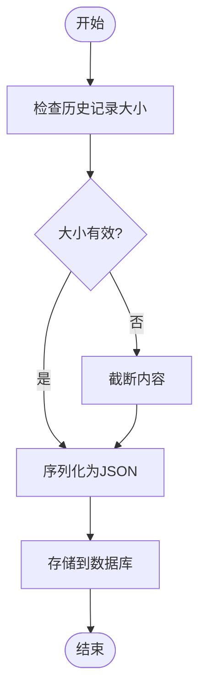

# 数据模型

<cite>
**本文档引用的文件**
- [flow.py](file://core/workflow/domain/models/flow.py)
- [history.py](file://core/workflow/domain/models/history.py)
- [license.py](file://core/workflow/domain/models/license.py)
- [flow_dao.py](file://core/workflow/repository/flow_dao.py)
- [license_dao.py](file://core/workflow/repository/license_dao.py)
- [history_service.py](file://core/workflow/service/history_service.py)
</cite>

## 目录
1. [引言](#引言)
2. [核心实体与关系](#核心实体与关系)
3. [工作流模型](#工作流模型)
4. [历史记录模型](#历史记录模型)
5. [许可证模型](#许可证模型)
6. [数据库表结构](#数据库表结构)
7. [数据访问对象(DAO)层](#数据访问对象dao层)
8. [数据生命周期管理](#数据生命周期管理)

## 引言
本文档全面描述了Astron-Agent项目中的工作流数据模型，详细解析了核心实体及其关系。文档深入分析了工作流模型、历史记录模型和许可证模型的实现，包括字段定义、数据库表结构、主外键关系、索引设计和约束条件。同时，文档解释了数据访问对象(DAO)层如何实现CRUD操作和查询优化，并提供了数据生命周期管理策略。

## 核心实体与关系
本系统的核心数据模型由三个主要实体组成：工作流(Flow)、历史记录(History)和许可证(License)。这些实体通过特定的关系相互连接，形成了一个完整的业务逻辑体系。



**图示来源**
- [flow.py](file://core/workflow/domain/models/flow.py#L1-L53)
- [history.py](file://core/workflow/domain/models/history.py#L1-L44)
- [license.py](file://core/workflow/domain/models/license.py#L1-L36)

## 工作流模型
工作流模型是系统的核心，用于定义和存储工作流的结构、元数据和版本信息。

### 字段定义
工作流模型包含以下关键字段：

| 字段名 | 类型 | 描述 | 约束 |
|-------|------|------|------|
| id | int | 唯一工作流标识符（自动生成） | 主键，唯一 |
| group_id | int | 工作流组标识符，用于组织工作流 | 外键，索引，唯一 |
| name | str | 工作流名称 | 索引 |
| data | Dict | 工作流结构数据（存储为JSON） | - |
| release_data | Dict | 发布的工作流数据（存储为JSON） | - |
| description | str | 工作流描述 | 索引 |
| version | str | 工作流版本字符串 | 索引 |
| release_status | int | 发布状态（0=未发布，1=已发布） | - |
| app_id | str | 关联的应用程序标识符 | - |
| source | int | 工作流来源标识符 | - |
| create_at | datetime | 创建时间戳 | - |
| tag | int | 工作流标签，用于分类 | - |
| update_at | datetime | 最后更新时间戳 | - |



**图示来源**
- [flow.py](file://core/workflow/domain/models/flow.py#L1-L53)

**本节来源**
- [flow.py](file://core/workflow/domain/models/flow.py#L1-L53)

## 历史记录模型
历史记录模型用于跟踪工作流节点的执行历史，包括用户交互和节点响应。

### 字段定义
历史记录模型包含以下关键字段：

| 字段名 | 类型 | 描述 | 约束 |
|-------|------|------|------|
| id | Optional[int] | 唯一历史记录标识符（自增） | 主键，自动递增 |
| node_id | str | 执行节点的标识符 | 非空，最大长度255 |
| uid | str | 触发执行的用户标识符 | 非空，最大长度255 |
| chat_id | Optional[str] | 可选的聊天会话标识符 | 最大长度255 |
| raw_question | Optional[str] | 原始用户问题或输入 | - |
| raw_answer | Optional[str] | 节点的原始响应 | - |
| create_time | datetime | 创建时间戳 | - |
| flow_id | Optional[str] | 可选的工作流标识符 | 最大长度255 |



**图示来源**
- [history.py](file://core/workflow/domain/models/history.py#L1-L44)

**本节来源**
- [history.py](file://core/workflow/domain/models/history.py#L1-L44)

## 许可证模型
许可证模型用于管理应用程序的许可证分配和状态。

### 字段定义
许可证模型包含以下关键字段：

| 字段名 | 类型 | 描述 | 约束 |
|-------|------|------|------|
| id | int | 唯一许可证标识符（自动生成） | 主键，唯一 |
| app_id | int | 关联的应用程序标识符 | - |
| group_id | int | 关联的组标识符 | - |
| status | int | 许可证状态（1=激活，0=停用） | 索引 |
| create_at | datetime | 创建时间戳 | - |
| update_at | datetime | 最后更新时间戳 | - |



**图示来源**
- [license.py](file://core/workflow/domain/models/license.py#L1-L36)

**本节来源**
- [license.py](file://core/workflow/domain/models/license.py#L1-L36)

## 数据库表结构
本节详细描述了数据库表的结构、主外键关系、索引设计和约束条件。

### 表结构详情
```sql
-- 工作流表
CREATE TABLE `flow` (
  `id` int NOT NULL AUTO_INCREMENT,
  `group_id` int NOT NULL,
  `name` varchar(255) DEFAULT '',
  `data` json DEFAULT NULL,
  `release_data` json DEFAULT NULL,
  `description` varchar(255) DEFAULT '',
  `version` varchar(50) DEFAULT '',
  `release_status` int DEFAULT '0',
  `app_id` varchar(255) DEFAULT '',
  `source` int DEFAULT '0',
  `create_at` datetime DEFAULT CURRENT_TIMESTAMP,
  `tag` int DEFAULT '0',
  `update_at` datetime DEFAULT CURRENT_TIMESTAMP ON UPDATE CURRENT_TIMESTAMP,
  PRIMARY KEY (`id`),
  UNIQUE KEY `idx_group_id` (`group_id`),
  KEY `idx_name` (`name`),
  KEY `idx_description` (`description`),
  KEY `idx_version` (`version`),
  KEY `idx_release_status` (`release_status`)
);

-- 历史记录表
CREATE TABLE `workflow_node_history` (
  `id` bigint NOT NULL AUTO_INCREMENT,
  `node_id` varchar(255) NOT NULL,
  `uid` varchar(255) NOT NULL,
  `chat_id` varchar(255) DEFAULT NULL,
  `raw_question` text,
  `raw_answer` text,
  `create_time` datetime DEFAULT CURRENT_TIMESTAMP,
  `flow_id` varchar(255) DEFAULT NULL,
  PRIMARY KEY (`id`),
  KEY `idx_node_id` (`node_id`),
  KEY `idx_uid` (`uid`),
  KEY `idx_chat_id` (`chat_id`),
  KEY `idx_flow_id` (`flow_id`)
);

-- 许可证表
CREATE TABLE `license` (
  `id` int NOT NULL AUTO_INCREMENT,
  `app_id` int NOT NULL,
  `group_id` int NOT NULL,
  `status` int DEFAULT '1',
  `create_at` datetime DEFAULT CURRENT_TIMESTAMP,
  `update_at` datetime DEFAULT CURRENT_TIMESTAMP ON UPDATE CURRENT_TIMESTAMP,
  PRIMARY KEY (`id`),
  KEY `idx_status` (`status`)
);
```

### 主外键关系
- **工作流表(flow)** 与 **历史记录表(workflow_node_history)** 通过 `flow_id` 字段建立一对多关系
- **工作流表(flow)** 与 **许可证表(license)** 通过 `group_id` 字段建立一对多关系
- **应用表(app)** 与 **许可证表(license)** 通过 `app_id` 字段建立一对多关系

### 索引设计
- **工作流表**：在 `group_id`、`name`、`description`、`version` 和 `release_status` 字段上创建了索引，以优化查询性能
- **历史记录表**：在 `node_id`、`uid`、`chat_id` 和 `flow_id` 字段上创建了索引，以支持高效的查询操作
- **许可证表**：在 `status` 字段上创建了索引，以快速筛选激活或停用的许可证

### 约束条件
- **主键约束**：每个表都有一个主键字段，确保记录的唯一性
- **唯一约束**：工作流表的 `group_id` 字段具有唯一约束，防止重复的组ID
- **非空约束**：历史记录表的 `node_id` 和 `uid` 字段为非空，确保关键信息的完整性
- **默认值约束**：多个字段设置了默认值，如 `create_at` 和 `update_at` 使用当前时间戳

**本节来源**
- [flow.py](file://core/workflow/domain/models/flow.py#L1-L53)
- [history.py](file://core/workflow/domain/models/history.py#L1-L44)
- [license.py](file://core/workflow/domain/models/license.py#L1-L36)

## 数据访问对象(DAO)层
DAO层负责与数据库进行交互，提供对工作流、历史记录和许可证数据的CRUD操作。

### 工作流DAO
工作流DAO提供了对工作流数据的访问操作，包括查询最新发布的流程。



**图示来源**
- [flow_dao.py](file://core/workflow/repository/flow_dao.py#L1-L73)

#### 查询最新发布的工作流
```python
def get_latest_published_flow_by(
    flow_group_id: str, session: Session, version: str = ""
) -> Flow | None:
    """
    根据组ID和可选版本检索最新发布的流程。
    
    此函数查询数据库以获取基于流程组ID的最新发布流程。
    它支持通过特定版本进行过滤，并按语义版本控制（主版本.次版本格式）对结果进行排序。
    """
```

**本节来源**
- [flow_dao.py](file://core/workflow/repository/flow_dao.py#L1-L73)

### 许可证DAO
许可证DAO提供了对许可证数据的访问操作，通过应用和流程组关系进行查询。



**图示来源**
- [license_dao.py](file://core/workflow/repository/license_dao.py#L1-L45)

#### 通过流程组ID和应用别名ID检索许可证
```python
def get_by(flow_group_id: str, app_alias_id: str, session: Session) -> License | None:
    """
    通过流程组ID和应用别名ID检索许可证信息。
    
    此函数在应用表和许可证表之间执行JOIN操作，
    以查找与特定应用和流程组关联的许可证。
    """
```

**本节来源**
- [license_dao.py](file://core/workflow/repository/license_dao.py#L1-L45)

### 查询优化
- **语义版本排序**：在查询最新发布的工作流时，使用语义版本控制进行排序，确保返回正确的版本
- **位运算检查**：使用位运算检查发布状态，提高查询效率
- **参数化查询**：使用参数化查询防止SQL注入攻击
- **结果缓存**：在服务层实现缓存机制，减少数据库查询次数

## 数据生命周期管理
本节描述了系统的数据生命周期管理策略，包括数据归档和清理机制。

### 历史记录管理
系统通过历史服务模块管理对话历史和聊天记录，实施了以下策略：



**图示来源**
- [history_service.py](file://core/workflow/service/history_service.py#L1-L185)

#### 限制与约束
- **最大历史记录大小**：每个节点最多保留10条历史记录
- **令牌限制**：为LLM处理设置95%的8192令牌限制（约7782令牌）
- **数据库行长度限制**：为mediumText最大长度16MB的95%（约15.9MB）

#### 历史记录添加
```python
def add_history(
    flow_id: str,
    node_id: str,
    uid: str,
    raw_question: dict,
    raw_answer: dict,
    chat_id: Optional[str] = None,
    **kwargs: Any,
) -> None:
    """
    向数据库添加新的对话历史记录。
    
    如果内容超过数据库行长度限制，则会进行截断。
    问题和答案数据会被序列化为JSON字符串后存储。
    """
```

#### 历史记录检索
```python
def get_history(
    flow_id: str,
    uid: str,
    node_max_token: Optional[Dict[str, int]] = None,
    history_size: int = MAX_HISTORY_SIZE,
) -> List[Dict]:
    """
    检索特定流程和用户的对话历史。
    
    支持按节点的最大令牌限制进行过滤，
    并返回指定数量的最新历史记录。
    """
```

### 数据归档策略
- **自动清理**：定期清理过期的历史记录，保持数据库性能
- **分层存储**：将活跃数据和归档数据分离存储，优化查询性能
- **备份机制**：实施定期备份策略，确保数据安全

### 数据清理机制
- **基于时间的清理**：根据创建时间自动删除超过保留期限的数据
- **基于大小的清理**：当数据量达到阈值时触发清理操作
- **手动清理**：提供管理接口用于手动清理特定数据

**本节来源**
- [history_service.py](file://core/workflow/service/history_service.py#L1-L185)