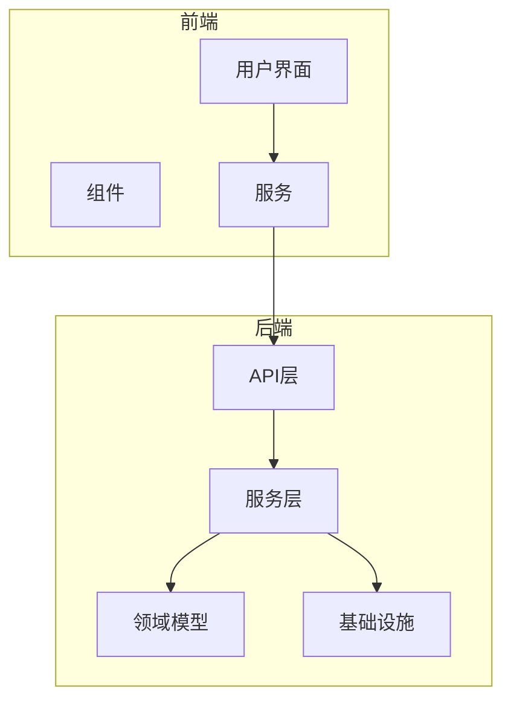
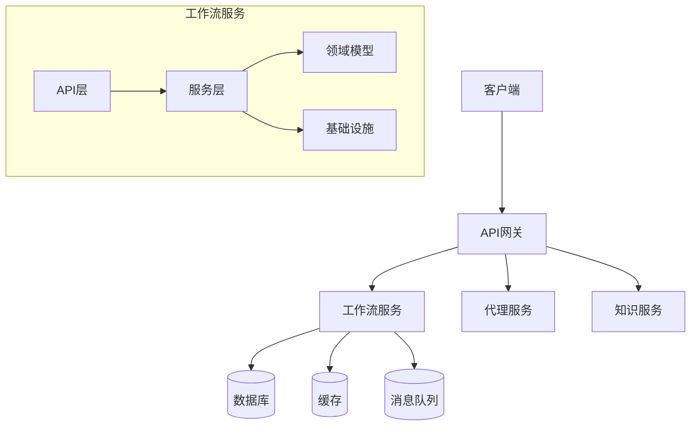
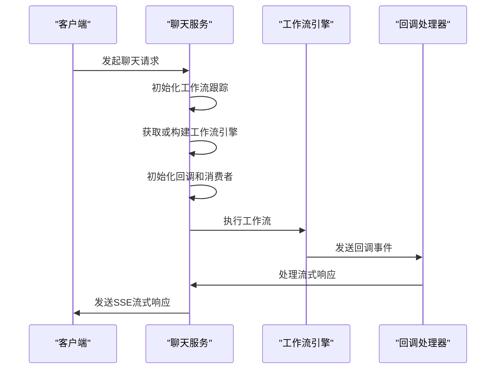
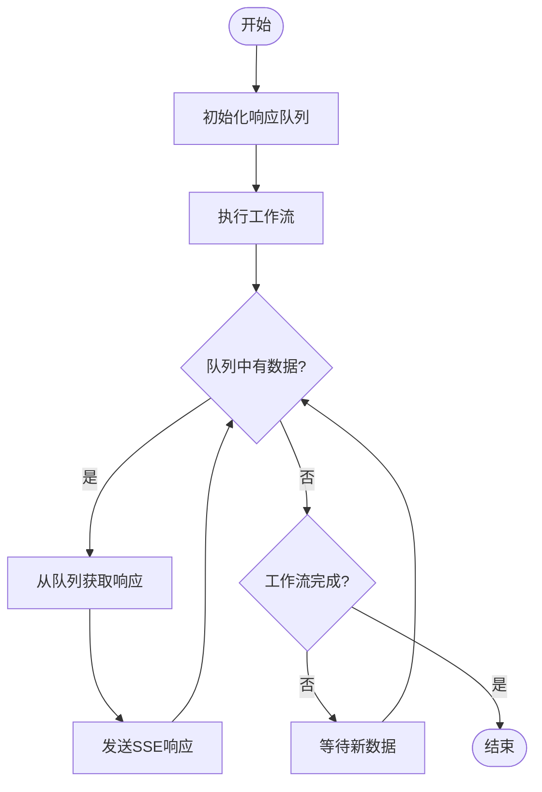
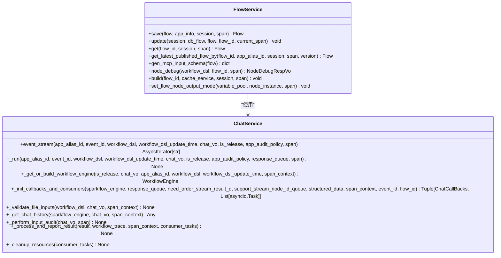
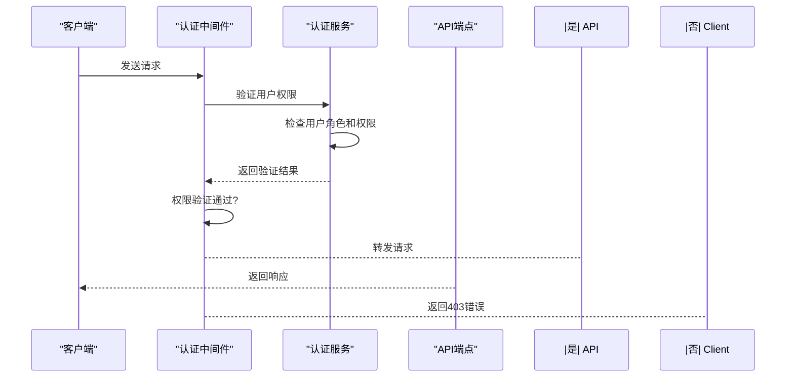
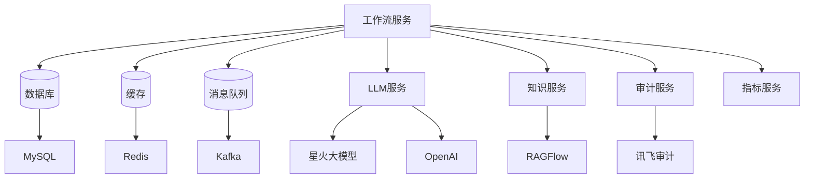

# 服务接口

<cite>
**本文档中引用的文件**  
- [app.py](file://core/agent/api/app.py)
- [base_api.py](file://core/agent/api/v1/base_api.py)
- [openapi.py](file://core/agent/api/v1/openapi.py)
- [chat_service.py](file://core/workflow/service/chat_service.py)
- [flow_service.py](file://core/workflow/service/flow_service.py)
- [debug.py](file://core/workflow/api/v1/chat/debug.py)
- [auth.py](file://core/workflow/api/v1/flow/auth.py)
</cite>

## 目录
1. [介绍](#介绍)
2. [项目结构](#项目结构)
3. [核心组件](#核心组件)
4. [架构概述](#架构概述)
5. [详细组件分析](#详细组件分析)
6. [依赖分析](#依赖分析)
7. [性能考虑](#性能考虑)
8. [故障排除指南](#故障排除指南)
9. [结论](#结论)
10. [附录](#附录)（如有必要）

## 介绍
本文档旨在为工作流服务API提供完整的参考文档，涵盖所有公开接口。文档详细描述了RESTful API的端点设计，包括工作流创建、更新、执行和调试接口。重点解释了聊天API（open.py, debug.py）的请求/响应模式，特别是流式响应（SSE）的实现机制。同时说明了认证接口（auth.py）如何验证用户权限。

文档将包含每个API端点的HTTP方法、URL路径、请求参数、请求体结构、响应格式和错误码。提供curl命令示例和客户端调用代码片段。此外，文档将说明服务层（chat_service.py, flow_service.py）如何协调领域模型和基础设施层来实现业务逻辑。

## 项目结构
该项目采用分层架构设计，主要分为前端和后端两个部分。后端核心服务位于`core/`目录下，包含多个微服务模块，如agent、workflow、knowledge等。每个模块都有清晰的分层结构，包括api、domain、service、repository等子目录。

工作流服务的核心API位于`core/workflow/api/v1/`目录下，通过FastAPI框架实现。服务层位于`core/workflow/service/`目录，负责协调领域模型和基础设施层。领域模型定义在`core/workflow/domain/`目录，而基础设施相关的实现则在`core/workflow/infra/`目录。

**Diagram sources**
- [app.py](file://core/agent/api/app.py)
- [base_api.py](file://core/agent/api/v1/base_api.py)

**Section sources**
- [app.py](file://core/agent/api/app.py)
- [base_api.py](file://core/agent/api/v1/base_api.py)

## 核心组件
工作流服务的核心组件包括API网关、服务协调器、领域模型和基础设施层。API网关负责接收外部请求并进行初步验证。服务协调器（如chat_service.py和flow_service.py）负责协调业务逻辑的执行。

领域模型定义了工作流的核心概念，如Flow、Node、Chat等。这些模型通过服务层与基础设施层（如数据库、缓存、消息队列）进行交互。整个系统采用依赖注入的方式管理服务间的依赖关系。

**Section sources**
- [chat_service.py](file://core/workflow/service/chat_service.py)
- [flow_service.py](file://core/workflow/service/flow_service.py)

## 架构概述
系统采用微服务架构，各服务通过API进行通信。工作流服务作为核心服务之一，提供RESTful API供前端和其他服务调用。系统架构遵循Clean Architecture原则，将业务逻辑与技术实现分离。

**Diagram sources**
- [app.py](file://core/agent/api/app.py)
- [chat_service.py](file://core/workflow/service/chat_service.py)

## 详细组件分析

### 聊天服务分析
聊天服务（chat_service.py）是工作流服务的核心组件之一，负责处理聊天相关的业务逻辑。该服务通过event_stream函数提供SSE流式响应，支持实时聊天功能。

**Diagram sources**
- [chat_service.py](file://core/workflow/service/chat_service.py)
- [event_stream](file://core/workflow/service/chat_service.py#L0-L100)

#### 流式响应实现
聊天服务通过asyncio.Queue实现流式响应机制。当工作流引擎执行时，回调处理器将结果放入响应队列，聊天服务从队列中读取数据并通过SSE协议发送给客户端。

**Diagram sources**
- [chat_service.py](file://core/workflow/service/chat_service.py#L0-L200)

**Section sources**
- [chat_service.py](file://core/workflow/service/chat_service.py#L0-L500)

### 工作流服务分析
工作流服务（flow_service.py）负责管理工作流的生命周期，包括创建、更新、删除和执行工作流。该服务通过协调领域模型和基础设施层来实现业务逻辑。

**Diagram sources**
- [flow_service.py](file://core/workflow/service/flow_service.py)
- [chat_service.py](file://core/workflow/service/chat_service.py)

**Section sources**
- [flow_service.py](file://core/workflow/service/flow_service.py#L0-L400)
- [chat_service.py](file://core/workflow/service/chat_service.py#L0-L100)

### 认证服务分析
认证服务（auth.py）负责验证用户权限，确保只有授权用户才能访问特定资源。该服务通过中间件方式集成到API路由中，对每个请求进行权限检查。

**Diagram sources**
- [auth.py](file://core/workflow/api/v1/flow/auth.py)
- [auth_middleware](file://core/workflow/extensions/fastapi/middleware/auth.py)

**Section sources**
- [auth.py](file://core/workflow/api/v1/flow/auth.py#L0-L50)
- [auth_middleware](file://core/workflow/extensions/fastapi/middleware/auth.py#L0-L100)

## 依赖分析
工作流服务依赖于多个内部和外部组件。内部依赖包括数据库、缓存、消息队列等基础设施服务。外部依赖包括LLM服务、知识库服务等。

**Diagram sources**
- [flow_service.py](file://core/workflow/service/flow_service.py)
- [chat_service.py](file://core/workflow/service/chat_service.py)

**Section sources**
- [flow_service.py](file://core/workflow/service/flow_service.py#L0-L50)
- [chat_service.py](file://core/workflow/service/chat_service.py#L0-L50)

## 性能考虑
工作流服务在设计时充分考虑了性能因素。通过缓存机制减少数据库查询，使用异步编程提高并发处理能力，采用流式响应降低内存占用。

服务还实现了分布式追踪，通过OTLP协议收集性能指标和调用链信息，便于性能监控和问题排查。对于耗时操作，如工作流构建和节点调试，服务提供了异步执行模式。

## 故障排除指南
当遇到API调用失败时，首先检查请求参数是否符合规范。对于流式响应问题，确认客户端是否正确处理SSE协议。对于性能问题，检查系统资源使用情况和缓存命中率。

常见错误码包括：
- 40002：请求参数验证失败
- 40301：权限不足
- 50001：内部服务错误
- 50002：工作流执行失败

**Section sources**
- [base_api.py](file://core/agent/api/v1/base_api.py#L0-L50)
- [exceptions](file://core/agent/exceptions)

## 结论
本文档详细介绍了工作流服务API的设计和实现。通过分层架构和清晰的职责划分，系统实现了高内聚、低耦合的设计目标。流式响应机制和异步处理能力确保了系统的高性能和可扩展性。

未来可以进一步优化缓存策略，增加更多监控指标，提升系统的可观测性。同时可以考虑引入更智能的错误处理机制，提高系统的健壮性。