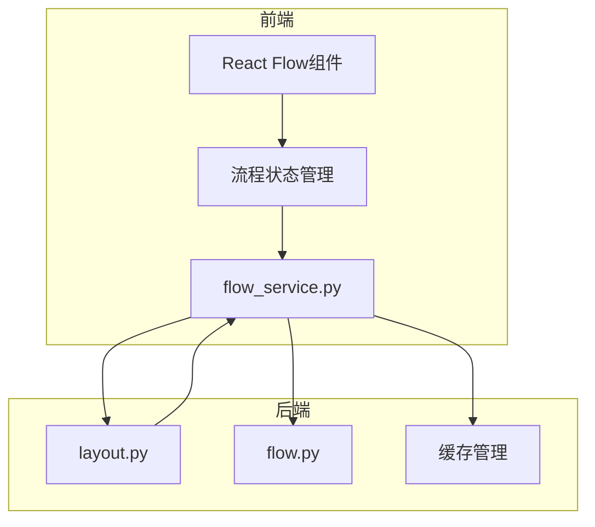
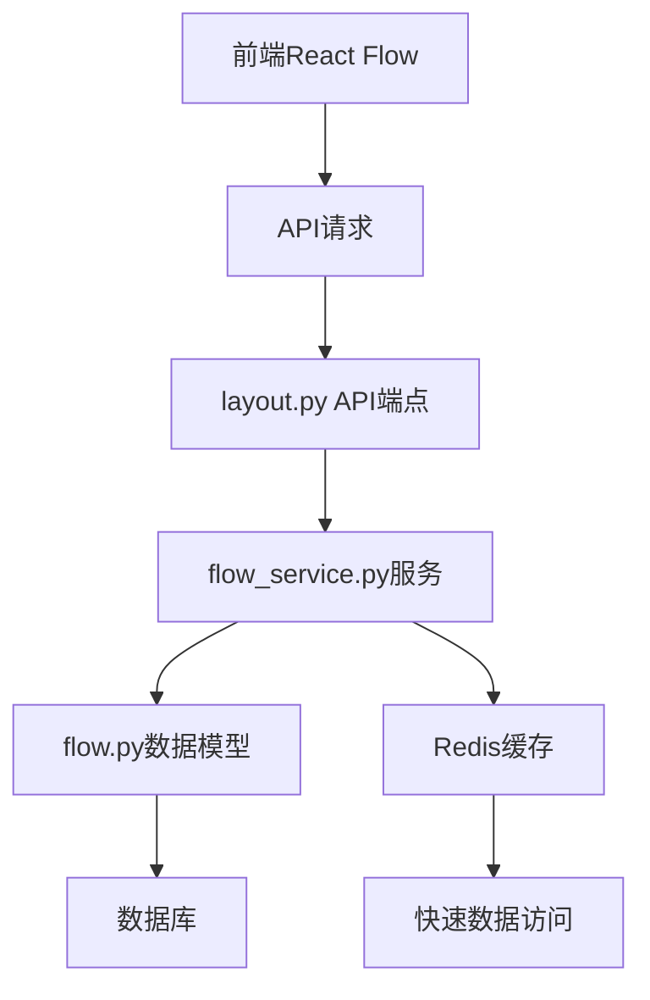
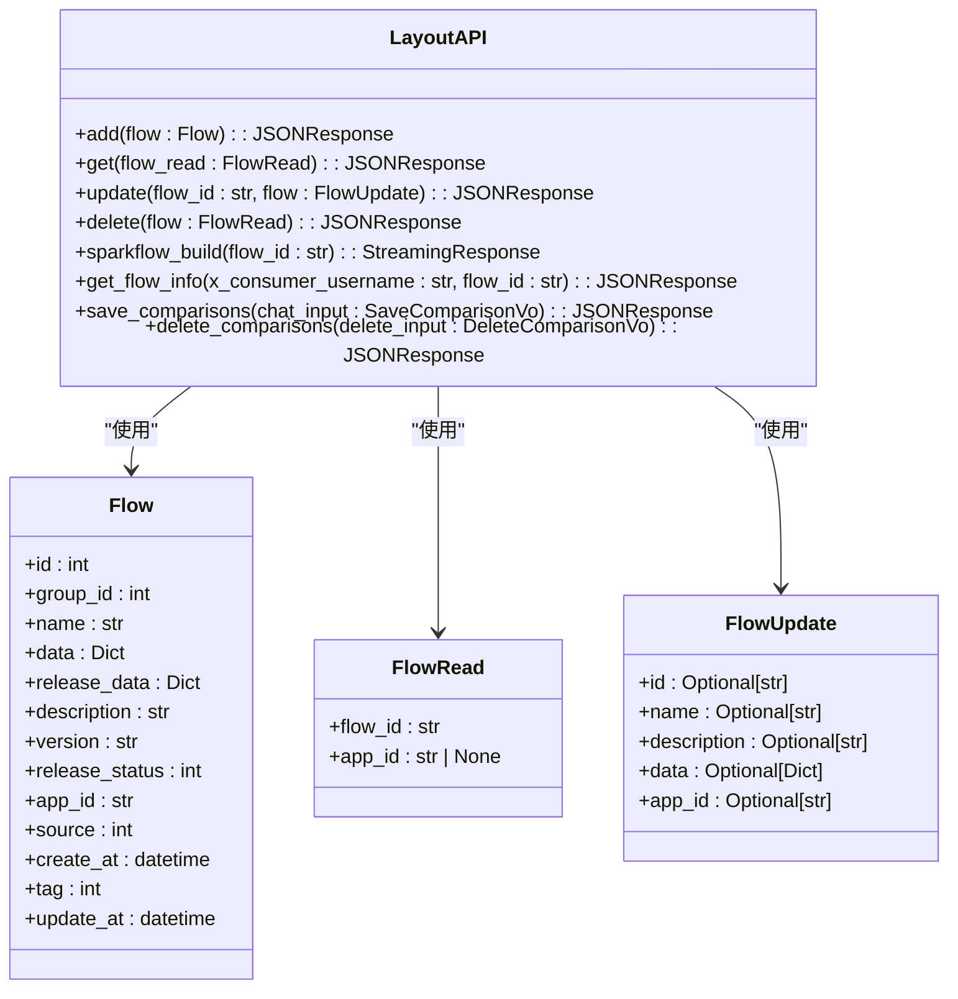
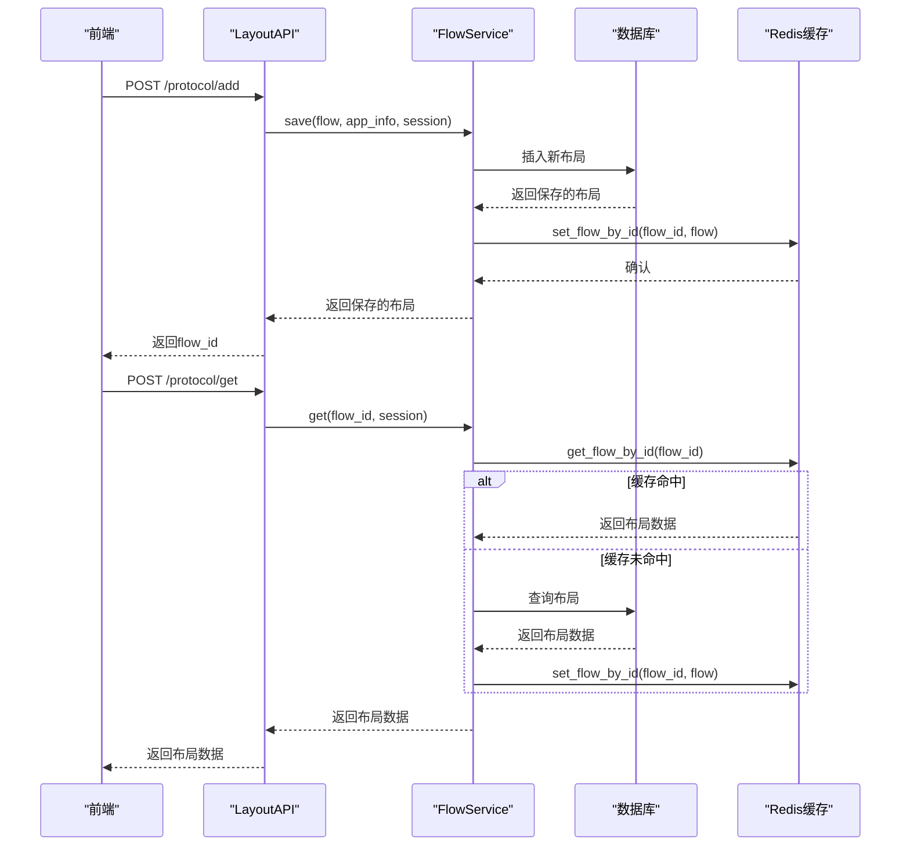
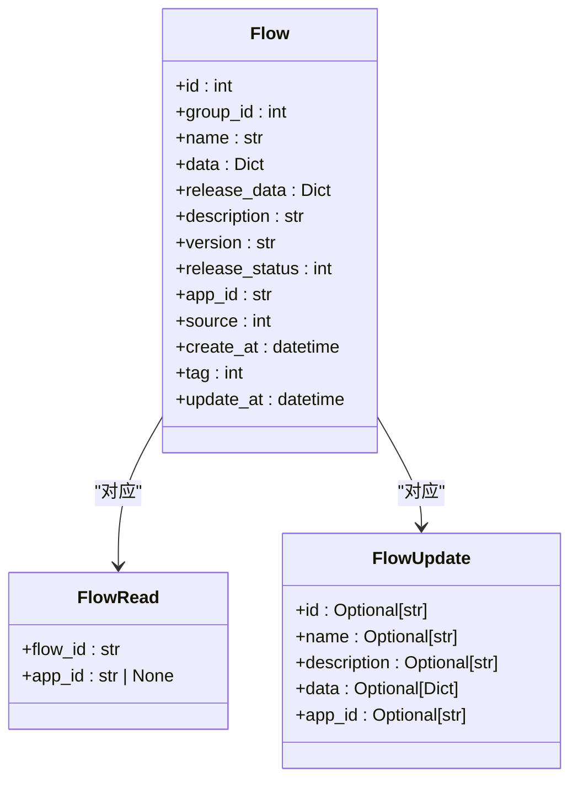
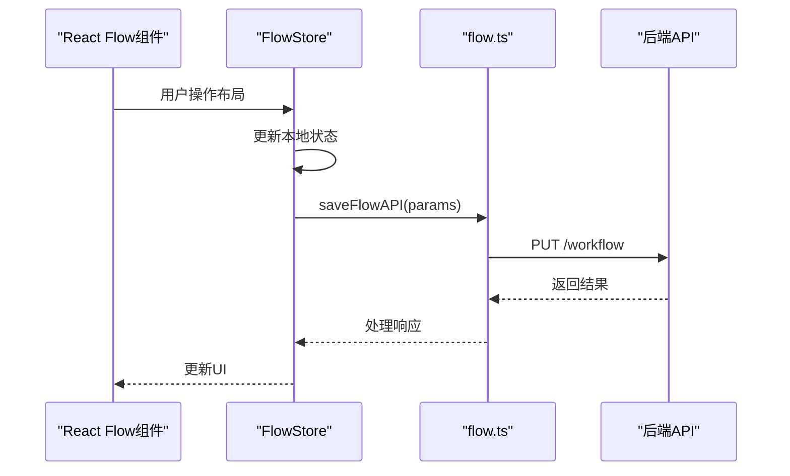
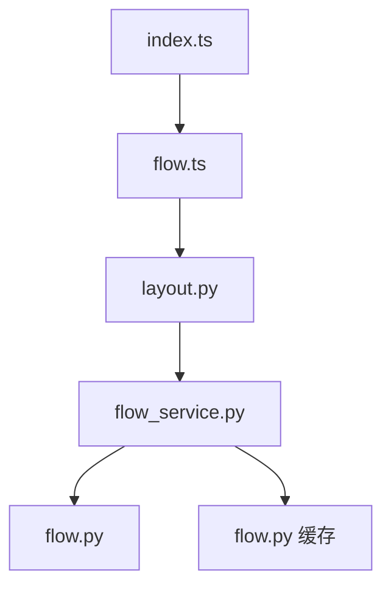

# 流程布局管理API

<cite>
**本文档引用的文件**  
- [layout.py](file://core/workflow/api/v1/flow/layout.py)
- [flow_service.py](file://core/workflow/service/flow_service.py)
- [flow.py](file://core/workflow/domain/models/flow.py)
- [flow.py](file://core/workflow/cache/flow.py)
- [flow.ts](file://console/frontend/src/services/flow.ts)
- [index.ts](file://console/frontend/src/components/workflow/types/zustand/flow/index.ts)
</cite>

## 目录
1. [简介](#简介)
2. [项目结构](#项目结构)
3. [核心组件](#核心组件)
4. [架构概述](#架构概述)
5. [详细组件分析](#详细组件分析)
6. [依赖分析](#依赖分析)
7. [性能考虑](#性能考虑)
8. [故障排除指南](#故障排除指南)
9. [结论](#结论)

## 简介
本文档详细介绍了流程布局管理API，该API用于管理工作流的可视化布局。系统实现了布局的保存、检索和更新功能，支持与前端React Flow组件的集成。后端通过flow_service.py处理布局数据的持久化存储和版本管理，而flow.py定义了布局数据结构。API提供了完整的HTTP端点来操作布局数据，包括保存、获取、更新和删除工作流布局。

## 项目结构
流程布局管理功能分布在前后端多个模块中。后端主要位于core/workflow/api/v1/flow目录下的layout.py文件中，负责处理布局相关的API请求。服务层在core/workflow/service目录下的flow_service.py中实现，负责业务逻辑处理。数据模型定义在core/workflow/domain/models/flow.py中。前端部分位于console/frontend/src/components/workflow目录下，使用React Flow库实现可视化编辑器。

**图示来源**
- [layout.py](file://core/workflow/api/v1/flow/layout.py)
- [flow_service.py](file://core/workflow/service/flow_service.py)
- [flow.py](file://core/workflow/domain/models/flow.py)
- [flow.py](file://core/workflow/cache/flow.py)
- [flow.ts](file://console/frontend/src/services/flow.ts)

**章节来源**
- [layout.py](file://core/workflow/api/v1/flow/layout.py)
- [flow_service.py](file://core/workflow/service/flow_service.py)
- [flow.py](file://core/workflow/domain/models/flow.py)

## 核心组件
流程布局管理API的核心组件包括布局API端点、流程服务、数据模型和缓存管理。layout.py文件定义了所有布局操作的HTTP端点，flow_service.py实现了布局数据的持久化逻辑，flow.py定义了布局数据结构，而缓存管理组件负责提高数据访问性能。

**章节来源**
- [layout.py](file://core/workflow/api/v1/flow/layout.py#L1-L50)
- [flow_service.py](file://core/workflow/service/flow_service.py#L1-L50)
- [flow.py](file://core/workflow/domain/models/flow.py#L1-L20)

## 架构概述
流程布局管理系统的架构采用分层设计，从前端React Flow组件到后端API端点，再到服务层和数据访问层。系统通过RESTful API提供布局管理功能，支持完整的CRUD操作。数据持久化通过SQLModel实现，缓存使用Redis提高性能。前端通过zustand进行状态管理，与后端API进行数据同步。

**图示来源**
- [layout.py](file://core/workflow/api/v1/flow/layout.py)
- [flow_service.py](file://core/workflow/service/flow_service.py)
- [flow.py](file://core/workflow/domain/models/flow.py)
- [flow.py](file://core/workflow/cache/flow.py)

## 详细组件分析

### 布局API端点分析
布局API端点提供了完整的布局管理功能，包括保存、获取、更新和删除操作。这些端点使用FastAPI框架实现，支持JSON格式的数据交换。

#### API端点类图

**图示来源**
- [layout.py](file://core/workflow/api/v1/flow/layout.py#L1-L394)

**章节来源**
- [layout.py](file://core/workflow/api/v1/flow/layout.py#L1-L394)

### 流程服务分析
flow_service.py模块提供了布局数据的持久化存储和版本管理功能。它处理布局的保存、更新、检索和删除操作，并管理缓存以提高性能。

#### 流程服务序列图

**图示来源**
- [flow_service.py](file://core/workflow/service/flow_service.py#L1-L427)
- [layout.py](file://core/workflow/api/v1/flow/layout.py#L1-L394)

**章节来源**
- [flow_service.py](file://core/workflow/service/flow_service.py#L1-L427)

### 数据模型分析
flow.py文件定义了流程布局的数据结构，使用SQLModel作为ORM框架。数据模型包含了布局的元数据、结构数据和版本信息。

#### 数据模型类图

**图示来源**
- [flow.py](file://core/workflow/domain/models/flow.py#L1-L53)

**章节来源**
- [flow.py](file://core/workflow/domain/models/flow.py#L1-L53)

### 前端集成分析
前端使用React Flow库实现可视化工作流编辑器，通过flow.ts文件中的服务函数与后端API进行通信。

#### 前端集成序列图

**图示来源**
- [flow.ts](file://console/frontend/src/services/flow.ts#L1-L205)
- [index.ts](file://console/frontend/src/components/workflow/types/zustand/flow/index.ts#L1-L53)

**章节来源**
- [flow.ts](file://console/frontend/src/services/flow.ts#L1-L205)
- [index.ts](file://console/frontend/src/components/workflow/types/zustand/flow/index.ts#L1-L53)

## 依赖分析
流程布局管理系统的组件之间存在明确的依赖关系。API端点依赖于服务层，服务层依赖于数据模型和缓存组件。前端服务依赖于API端点，形成清晰的调用链。

**图示来源**
- [layout.py](file://core/workflow/api/v1/flow/layout.py)
- [flow_service.py](file://core/workflow/service/flow_service.py)
- [flow.py](file://core/workflow/domain/models/flow.py)
- [flow.py](file://core/workflow/cache/flow.py)
- [flow.ts](file://console/frontend/src/services/flow.ts)
- [index.ts](file://console/frontend/src/components/workflow/types/zustand/flow/index.ts)

**章节来源**
- [layout.py](file://core/workflow/api/v1/flow/layout.py)
- [flow_service.py](file://core/workflow/service/flow_service.py)
- [flow.py](file://core/workflow/domain/models/flow.py)

## 性能考虑
系统通过多种方式优化性能。首先，使用Redis缓存频繁访问的布局数据，减少数据库查询。其次，API端点使用FastAPI的依赖注入系统，确保资源的有效管理。此外，服务层在更新布局时会清除相关缓存，确保数据一致性。

## 故障排除指南
当遇到布局管理问题时，可以按照以下步骤进行排查：
1. 检查API端点是否正常运行
2. 验证数据库连接是否正常
3. 检查Redis缓存服务是否可用
4. 查看日志文件中的错误信息
5. 验证请求数据格式是否正确

**章节来源**
- [layout.py](file://core/workflow/api/v1/flow/layout.py#L1-L394)
- [flow_service.py](file://core/workflow/service/flow_service.py#L1-L427)

## 结论
流程布局管理API提供了一套完整的解决方案，用于管理工作流的可视化布局。系统通过清晰的分层架构，实现了布局的保存、检索、更新和删除功能。前后端通过标准化的API进行通信，确保了系统的可维护性和可扩展性。缓存机制的引入显著提高了数据访问性能，而详细的错误处理确保了系统的稳定性。