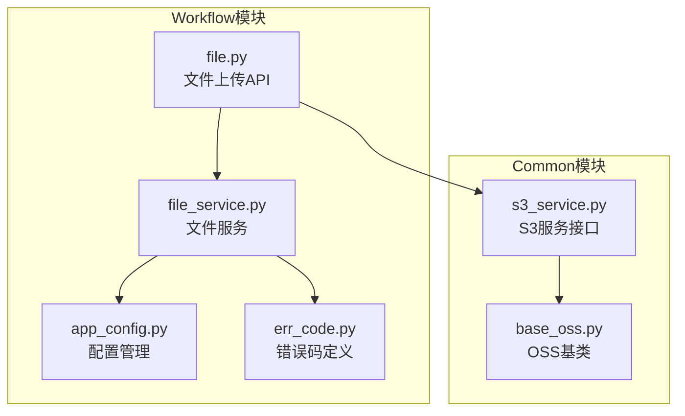
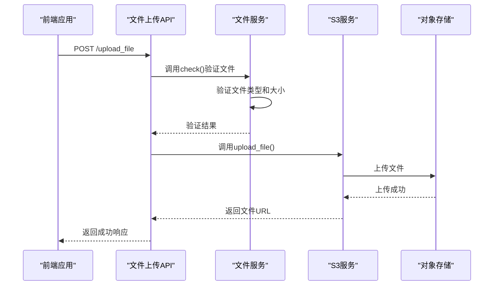
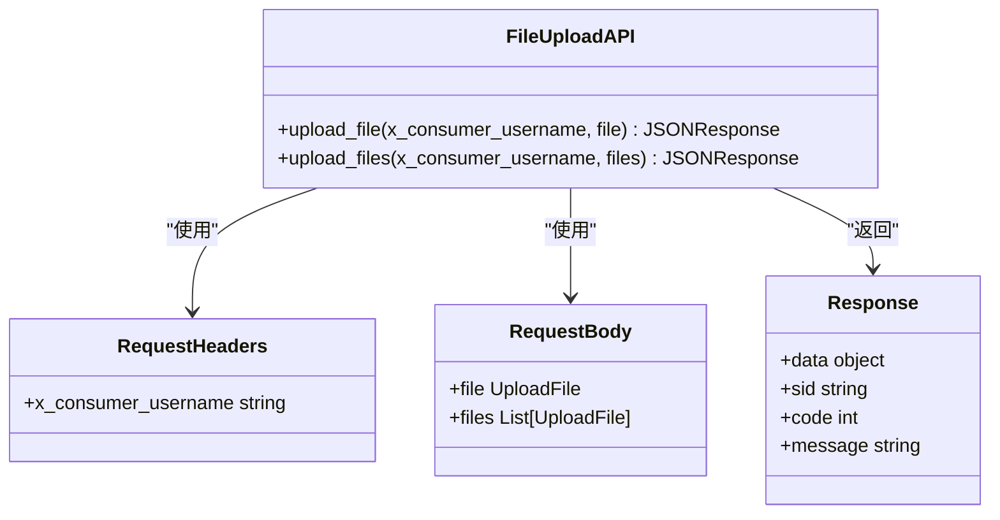
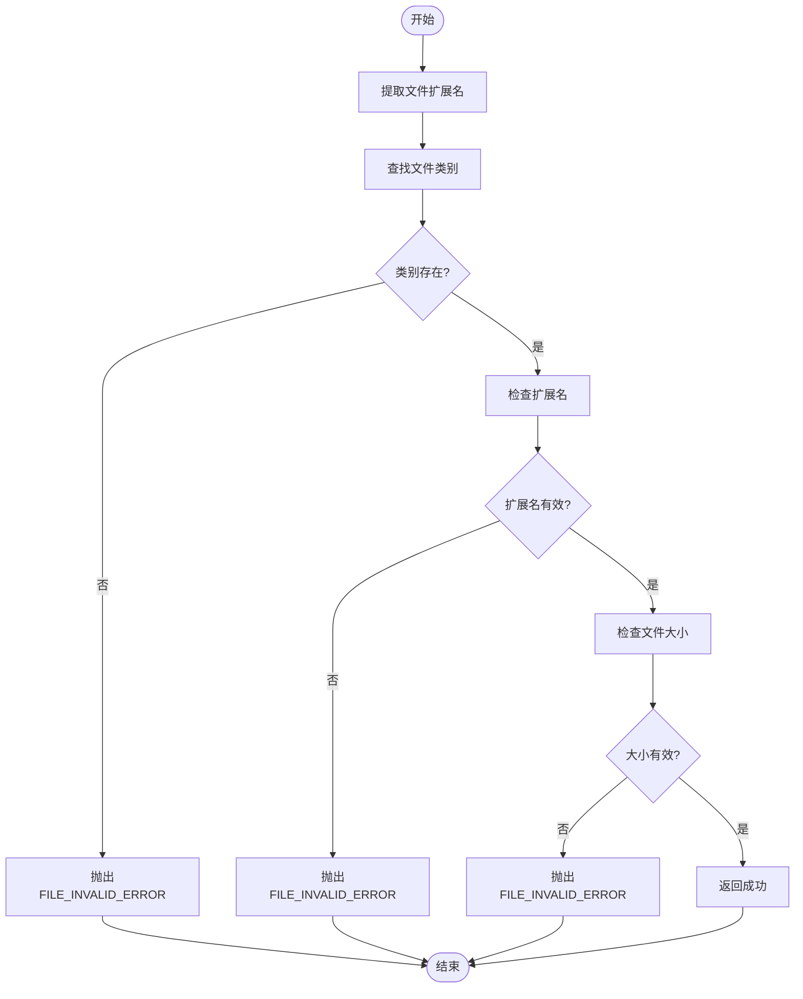
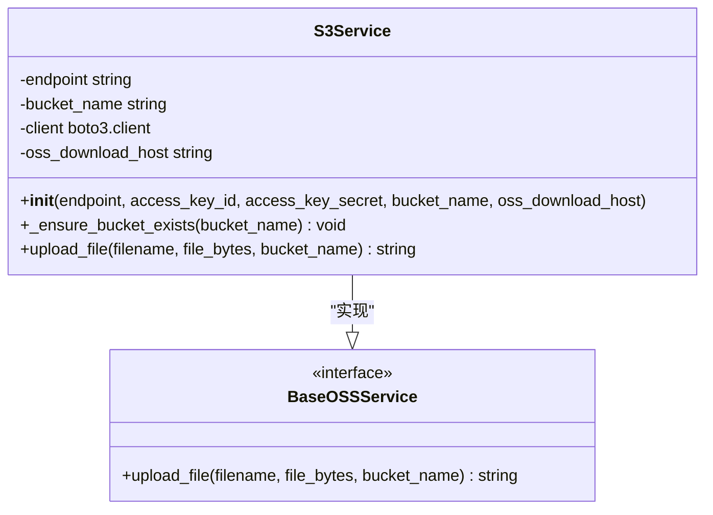
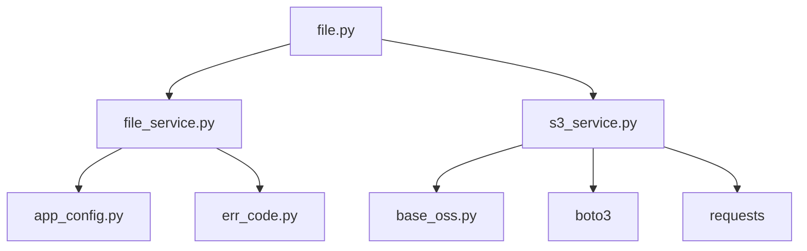

# 流程文件操作API

<cite>
**本文档引用的文件**  
- [file.py](file://core/workflow/api/v1/flow/file.py)
- [file_service.py](file://core/workflow/service/file_service.py)
- [s3_service.py](file://core/common/service/oss/s3_service.py)
- [app_config.py](file://core/workflow/configs/app_config.py)
- [err_code.py](file://core/workflow/exception/errors/err_code.py)
</cite>

## 目录
1. [简介](#简介)
2. [项目结构](#项目结构)
3. [核心组件](#核心组件)
4. [架构概述](#架构概述)
5. [详细组件分析](#详细组件分析)
6. [依赖分析](#依赖分析)
7. [性能考虑](#性能考虑)
8. [故障排除指南](#故障排除指南)
9. [结论](#结论)
10. [附录](#附录)（如有必要）

## 简介
本文档详细说明了流程文件操作API，重点介绍文件上传、下载和管理功能的实现。文档涵盖了file.py中实现的文件上传端点，file_service.py中处理的文件元数据存储和验证逻辑，以及s3_service.py提供的OSS服务接口。详细描述了HTTP方法、URL路径、请求参数、请求体结构、响应格式和可能的HTTP状态码，并提供了curl示例和前端代码片段。

## 项目结构
流程文件操作功能主要分布在core/workflow和core/common两个核心模块中。workflow模块负责API端点和业务逻辑，common模块提供底层OSS服务支持。



**图表来源**
- [file.py](file://core/workflow/api/v1/flow/file.py)
- [file_service.py](file://core/workflow/service/file_service.py)
- [s3_service.py](file://core/common/service/oss/s3_service.py)
- [app_config.py](file://core/workflow/configs/app_config.py)

**章节来源**
- [file.py](file://core/workflow/api/v1/flow/file.py)
- [file_service.py](file://core/workflow/service/file_service.py)
- [s3_service.py](file://core/common/service/oss/s3_service.py)

## 核心组件
核心组件包括文件上传API、文件服务和S3服务。文件上传API提供HTTP端点，文件服务处理文件验证和元数据管理，S3服务负责与对象存储的交互。

**章节来源**
- [file.py](file://core/workflow/api/v1/flow/file.py#L1-L111)
- [file_service.py](file://core/workflow/service/file_service.py#L1-L32)
- [s3_service.py](file://core/common/service/oss/s3_service.py#L1-L197)

## 架构概述
系统采用分层架构，前端通过HTTP请求调用文件上传API，API层调用文件服务进行验证，文件服务再调用S3服务进行实际的文件存储。



**图表来源**
- [file.py](file://core/workflow/api/v1/flow/file.py#L1-L111)
- [file_service.py](file://core/workflow/service/file_service.py#L1-L32)
- [s3_service.py](file://core/common/service/oss/s3_service.py#L1-L197)

## 详细组件分析

### 文件上传API分析
文件上传API提供单文件和多文件上传功能，通过POST方法接收multipart/form-data格式的请求。

#### API端点定义


**图表来源**
- [file.py](file://core/workflow/api/v1/flow/file.py#L1-L111)

### 文件服务分析
文件服务负责验证上传文件的类型和大小是否符合配置要求。

#### 文件验证流程


**图表来源**
- [file_service.py](file://core/workflow/service/file_service.py#L1-L32)
- [app_config.py](file://core/workflow/configs/app_config.py#L1-L148)

**章节来源**
- [file_service.py](file://core/workflow/service/file_service.py#L1-L32)
- [app_config.py](file://core/workflow/configs/app_config.py#L1-L148)

### S3服务分析
S3服务提供与S3兼容的对象存储服务的接口，支持文件上传和公共读取访问。

#### S3服务类结构


**图表来源**
- [s3_service.py](file://core/common/service/oss/s3_service.py#L1-L197)

**章节来源**
- [s3_service.py](file://core/common/service/oss/s3_service.py#L1-L197)

## 依赖分析
系统依赖关系清晰，各组件职责分明。API层依赖服务层，服务层依赖配置和OSS服务。



**图表来源**
- [file.py](file://core/workflow/api/v1/flow/file.py)
- [file_service.py](file://core/workflow/service/file_service.py)
- [s3_service.py](file://core/common/service/oss/s3_service.py)

**章节来源**
- [file.py](file://core/workflow/api/v1/flow/file.py)
- [file_service.py](file://core/workflow/service/file_service.py)
- [s3_service.py](file://core/common/service/oss/s3_service.py)

## 性能考虑
系统在文件上传过程中考虑了性能优化，包括使用UUID生成唯一文件名避免冲突，以及通过S3的公共读取策略减少后续访问的开销。

## 故障排除指南
常见问题包括文件类型不支持、文件大小超限和存储服务连接失败。对应的错误码分别为FILE_INVALID_ERROR(23601)、FILE_INVALID_ERROR(23601)和FILE_STORAGE_ERROR(23604)。

**章节来源**
- [err_code.py](file://core/workflow/exception/errors/err_code.py#L1-L404)
- [file_service.py](file://core/workflow/service/file_service.py#L1-L32)
- [s3_service.py](file://core/common/service/oss/s3_service.py#L1-L197)

## 结论
流程文件操作API提供了完整的文件上传和管理功能，通过分层架构实现了良好的可维护性和扩展性。系统支持单文件和多文件上传，具有完善的验证机制和错误处理。

## 附录

### 文件上传API详细规格

#### 单文件上传端点
- **HTTP方法**: POST
- **URL路径**: /upload_file
- **请求头**:
  - x_consumer_username: 消费者用户名
- **请求体**: multipart/form-data，包含file字段
- **响应格式**: JSON
  ```json
  {
    "data": {
      "url": "文件访问URL"
    },
    "sid": "会话ID",
    "code": 0,
    "message": "Success"
  }
  ```
- **可能的HTTP状态码**:
  - 200: 上传成功
  - 400: 参数验证错误
  - 500: 文件存储错误

#### 多文件上传端点
- **HTTP方法**: POST
- **URL路径**: /upload_files
- **请求头**:
  - x_consumer_username: 消费者用户名
- **请求体**: multipart/form-data，包含files字段（文件数组）
- **响应格式**: JSON
  ```json
  {
    "data": {
      "urls": ["文件1URL", "文件2URL", ...]
    },
    "sid": "会话ID",
    "code": 0,
    "message": "Success"
  }
  ```
- **可能的HTTP状态码**:
  - 200: 上传成功
  - 400: 参数验证错误
  - 500: 文件存储错误

### 文件验证规则
系统根据app_config.py中的FILE_POLICY配置验证文件，支持的文件类型和大小限制如下：

| 文件类别 | 支持的扩展名 | 大小限制 |
|---------|------------|---------|
| 文档 | pdf, doc, docx, txt, md | 100MB |
| 表格 | xls, xlsx, csv | 50MB |
| 图像 | png, jpg, jpeg, gif | 20MB |
| 音频 | mp3, wav, m4a | 100MB |
| 视频 | mp4, avi, mov | 500MB |

### curl示例
```bash
# 单文件上传
curl -X POST https://api.example.com/upload_file \
  -H "x_consumer_username: your_app_id" \
  -F "file=@/path/to/your/file.pdf"

# 多文件上传
curl -X POST https://api.example.com/upload_files \
  -H "x_consumer_username: your_app_id" \
  -F "files=@/path/to/file1.pdf" \
  -F "files=@/path/to/file2.docx"
```

### 前端代码片段
```typescript
// 前端文件上传示例
const uploadFile = async (file: File, appId: string) => {
  const formData = new FormData();
  formData.append('file', file);
  
  const response = await fetch('/upload_file', {
    method: 'POST',
    headers: {
      'x_consumer_username': appId
    },
    body: formData
  });
  
  const result = await response.json();
  return result.data.url;
};

// 上传工作流相关文件
const uploadWorkflowFile = async (workflowFile: File) => {
  try {
    const fileUrl = await uploadFile(workflowFile, 'workflow_app');
    console.log('文件上传成功:', fileUrl);
    return fileUrl;
  } catch (error) {
    console.error('文件上传失败:', error);
    throw error;
  }
};
```

### 错误码参考
| 错误码 | 错误消息 | 说明 |
|-------|--------|------|
| 23601 | Invalid file | 文件无效（类型或大小不符合要求） |
| 23604 | File storage failed | 文件存储失败 |
| 460 | Parameter validation error | 参数验证错误 |