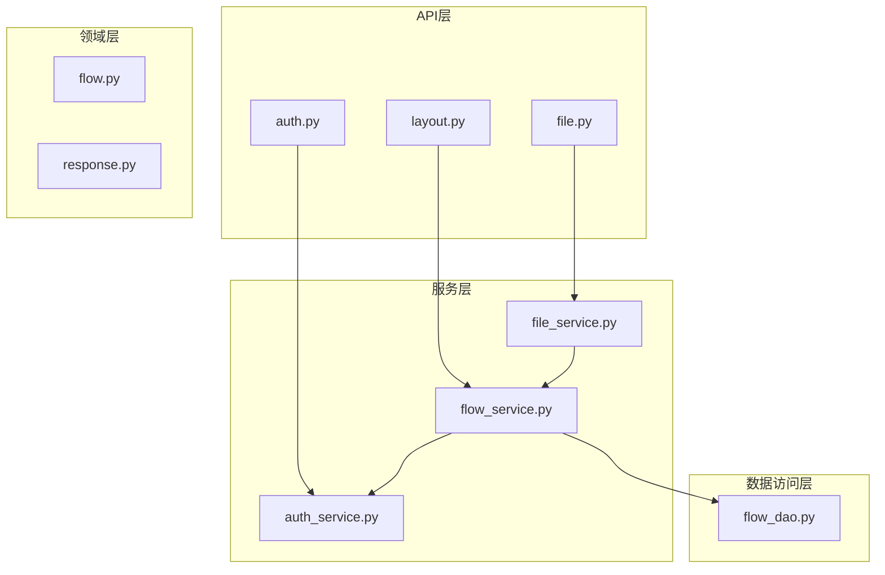
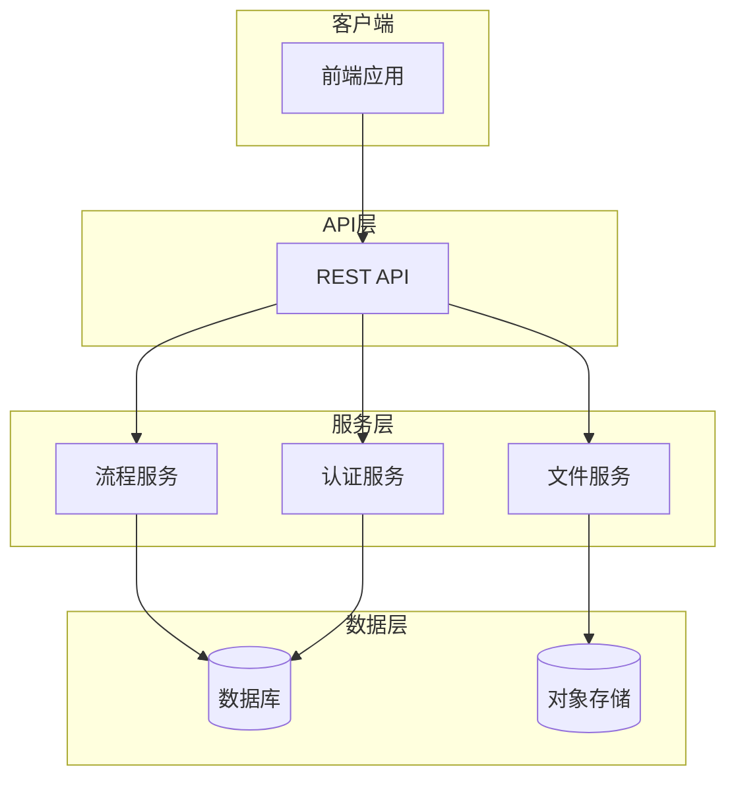
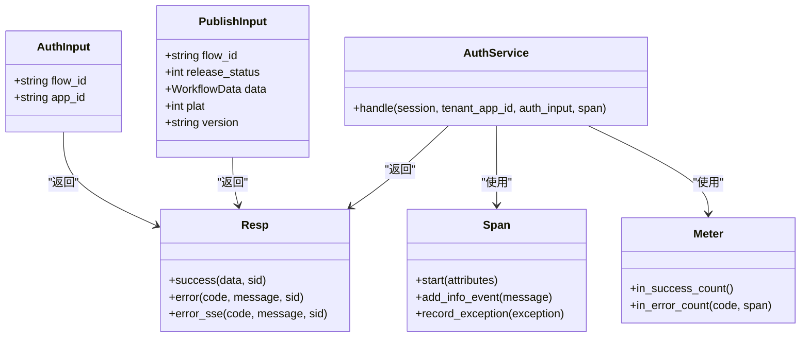
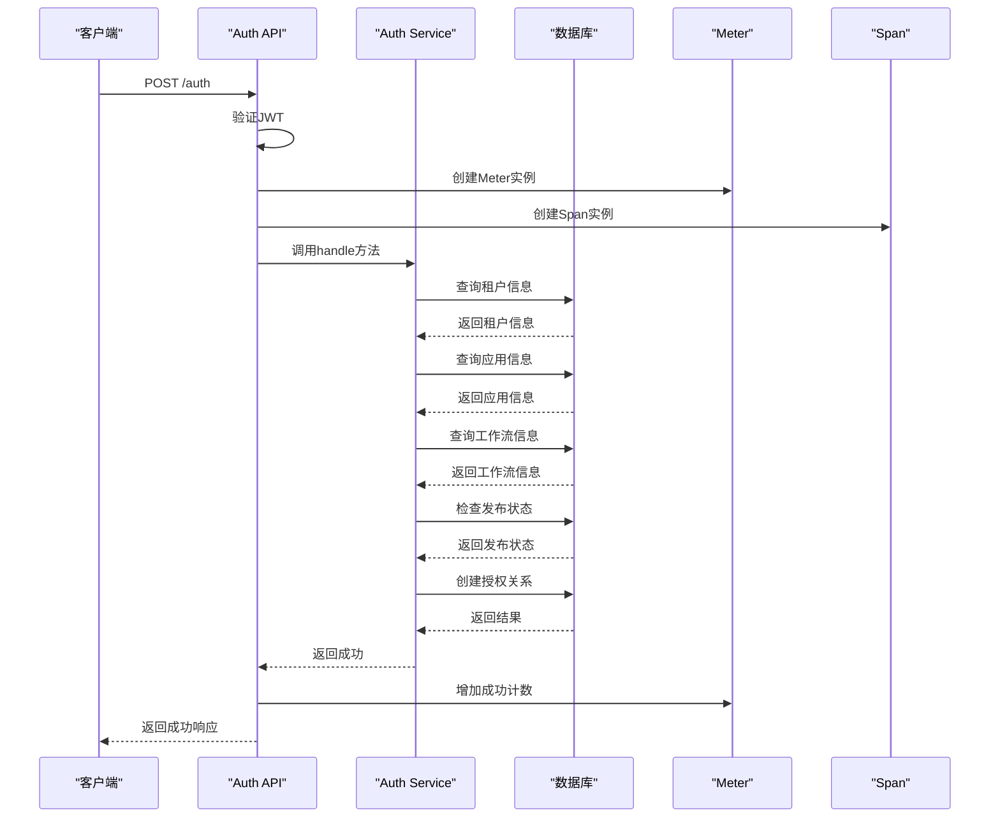
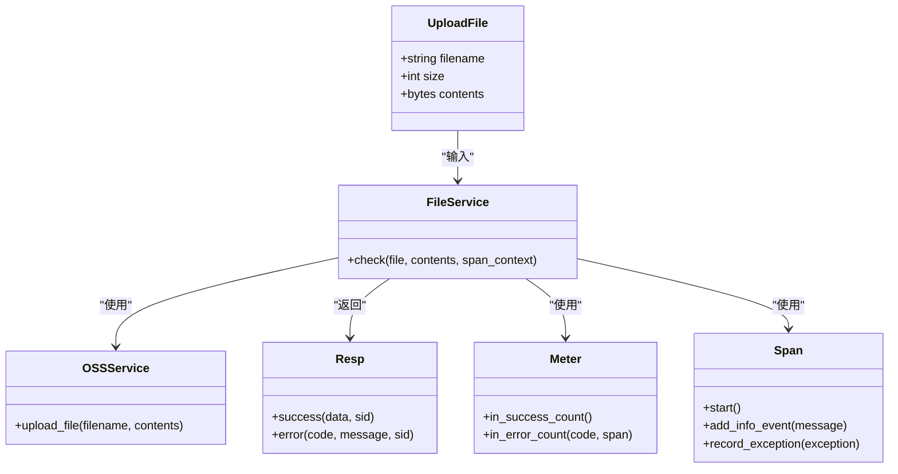
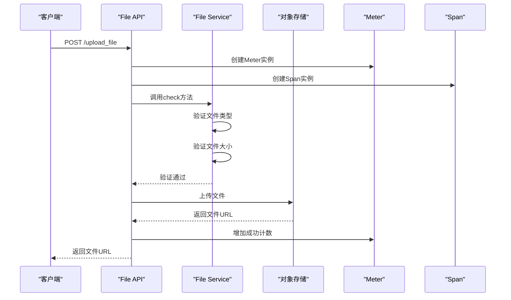
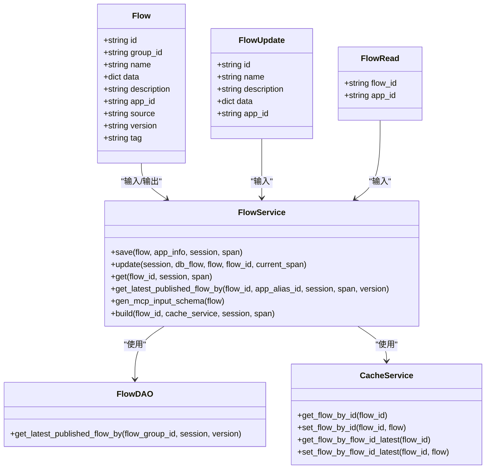
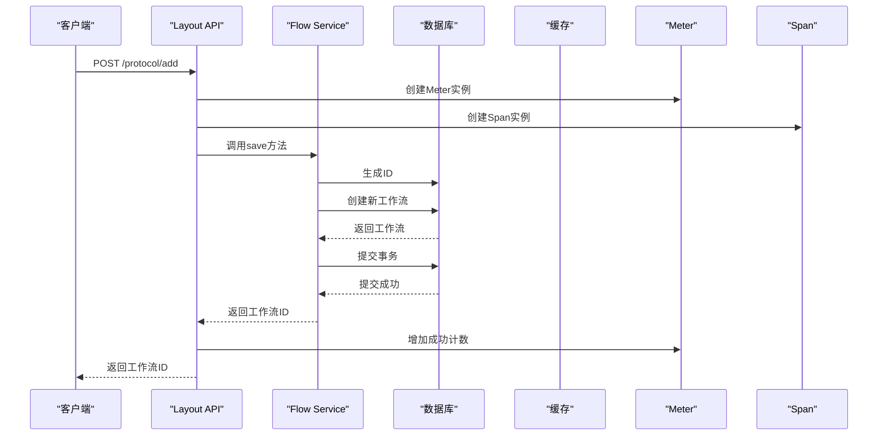
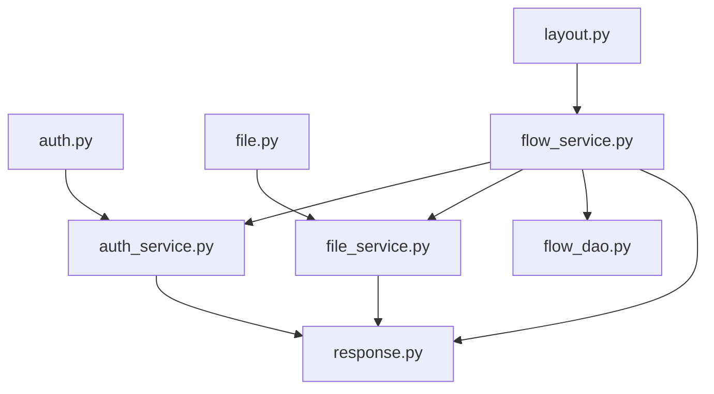

# 流程管理API

<cite>
**本文档中引用的文件**   
- [auth.py](file://core/workflow/api/v1/flow/auth.py)
- [file.py](file://core/workflow/api/v1/flow/file.py)
- [layout.py](file://core/workflow/api/v1/flow/layout.py)
- [flow_service.py](file://core/workflow/service/flow_service.py)
- [file_service.py](file://core/workflow/service/file_service.py)
- [auth_service.py](file://core/workflow/service/auth_service.py)
- [flow.py](file://core/workflow/domain/entities/flow.py)
- [response.py](file://core/workflow/domain/entities/response.py)
- [flow_dao.py](file://core/workflow/repository/flow_dao.py)
</cite>

## 目录
1. [简介](#简介)
2. [项目结构](#项目结构)
3. [核心组件](#核心组件)
4. [架构概述](#架构概述)
5. [详细组件分析](#详细组件分析)
6. [依赖分析](#依赖分析)
7. [性能考虑](#性能考虑)
8. [故障排除指南](#故障排除指南)
9. [结论](#结论)

## 简介
本文档为流程管理API提供了完整的参考文档，涵盖了工作流的认证、文件操作和布局管理功能。文档详细描述了认证端点的实现，包括JWT验证、权限检查和租户隔离机制。同时说明了文件上传下载接口如何与对象存储系统集成，以及布局管理API如何保存和检索工作流的可视化布局信息。文档包含了每个端点的HTTP方法、URL路径、请求参数、请求体结构（包括JSON Schema）、响应格式和可能的HTTP状态码，并重点说明了流程服务如何协调数据库操作、权限验证和文件存储。

## 项目结构
该流程管理API位于`core/workflow`目录下，采用模块化设计，主要分为API层、服务层、领域层和数据访问层。API层包含`auth.py`、`file.py`和`layout.py`三个主要模块，分别处理认证、文件操作和布局管理功能。服务层包含`flow_service.py`、`file_service.py`和`auth_service.py`等核心服务类，负责业务逻辑处理。领域层定义了`flow.py`中的数据模型，而数据访问层通过`flow_dao.py`与数据库交互。

**图源**
- [auth.py](file://core/workflow/api/v1/flow/auth.py)
- [file.py](file://core/workflow/api/v1/flow/file.py)
- [layout.py](file://core/workflow/api/v1/flow/layout.py)
- [flow_service.py](file://core/workflow/service/flow_service.py)
- [file_service.py](file://core/workflow/service/file_service.py)
- [auth_service.py](file://core/workflow/service/auth_service.py)
- [flow.py](file://core/workflow/domain/entities/flow.py)
- [flow_dao.py](file://core/workflow/repository/flow_dao.py)

**章节源**
- [auth.py](file://core/workflow/api/v1/flow/auth.py)
- [file.py](file://core/workflow/api/v1/flow/file.py)
- [layout.py](file://core/workflow/api/v1/flow/layout.py)

## 核心组件
流程管理API的核心组件包括认证服务、文件服务和流程服务。认证服务负责处理JWT验证、权限检查和租户隔离，确保只有授权用户才能访问特定资源。文件服务管理文件上传下载操作，与对象存储系统集成，提供安全的文件处理功能。流程服务是系统的核心，协调数据库操作、权限验证和文件存储，处理工作流的创建、更新、删除和执行等复杂业务逻辑。

**章节源**
- [flow_service.py](file://core/workflow/service/flow_service.py)
- [auth_service.py](file://core/workflow/service/auth_service.py)
- [file_service.py](file://core/workflow/service/file_service.py)

## 架构概述
流程管理API采用分层架构设计，从上到下分为API层、服务层、领域层和数据访问层。API层暴露RESTful端点，接收客户端请求并返回响应。服务层包含核心业务逻辑，协调不同组件之间的交互。领域层定义了业务实体和数据模型，确保数据的一致性和完整性。数据访问层负责与数据库交互，执行CRUD操作。

**图源**
- [flow_service.py](file://core/workflow/service/flow_service.py)
- [file_service.py](file://core/workflow/service/file_service.py)
- [auth_service.py](file://core/workflow/service/auth_service.py)

## 详细组件分析
### 认证组件分析
认证组件负责处理工作流系统的身份验证和授权。它通过`auth.py`中的端点接收认证请求，使用`auth_service.py`中的业务逻辑进行处理。认证机制包括JWT验证、权限检查和租户隔离，确保只有授权用户才能访问特定资源。

#### 认证类图

**图源**
- [auth.py](file://core/workflow/api/v1/flow/auth.py)
- [auth_service.py](file://core/workflow/service/auth_service.py)
- [flow.py](file://core/workflow/domain/entities/flow.py)
- [response.py](file://core/workflow/domain/entities/response.py)

#### 认证序列图

**图源**
- [auth.py](file://core/workflow/api/v1/flow/auth.py)
- [auth_service.py](file://core/workflow/service/auth_service.py)

**章节源**
- [auth.py](file://core/workflow/api/v1/flow/auth.py#L1-L119)
- [auth_service.py](file://core/workflow/service/auth_service.py#L1-L83)

### 文件操作组件分析
文件操作组件负责处理工作流系统的文件上传下载功能。它通过`file.py`中的端点接收文件上传请求，使用`file_service.py`中的业务逻辑进行处理。文件服务与对象存储系统集成，提供安全的文件处理功能。

#### 文件操作类图

**图源**
- [file.py](file://core/workflow/api/v1/flow/file.py)
- [file_service.py](file://core/workflow/service/file_service.py)

#### 文件上传序列图

**图源**
- [file.py](file://core/workflow/api/v1/flow/file.py)
- [file_service.py](file://core/workflow/service/file_service.py)

**章节源**
- [file.py](file://core/workflow/api/v1/flow/file.py#L1-L111)
- [file_service.py](file://core/workflow/service/file_service.py#L1-L32)

### 布局管理组件分析
布局管理组件负责处理工作流的创建、更新、删除和构建等操作。它通过`layout.py`中的端点接收布局管理请求，使用`flow_service.py`中的业务逻辑进行处理。流程服务协调数据库操作、权限验证和文件存储，处理复杂的业务逻辑。

#### 布局管理类图

**图源**
- [layout.py](file://core/workflow/api/v1/flow/layout.py)
- [flow_service.py](file://core/workflow/service/flow_service.py)
- [flow_dao.py](file://core/workflow/repository/flow_dao.py)

#### 工作流创建序列图

**图源**
- [layout.py](file://core/workflow/api/v1/flow/layout.py)
- [flow_service.py](file://core/workflow/service/flow_service.py)

**章节源**
- [layout.py](file://core/workflow/api/v1/flow/layout.py#L1-L393)
- [flow_service.py](file://core/workflow/service/flow_service.py#L1-L426)

## 依赖分析
流程管理API的组件之间存在明确的依赖关系。API层依赖于服务层，服务层依赖于领域层和数据访问层。认证服务、文件服务和流程服务之间也存在相互依赖关系，共同完成复杂的业务逻辑。

**图源**
- [auth.py](file://core/workflow/api/v1/flow/auth.py)
- [file.py](file://core/workflow/api/v1/flow/file.py)
- [layout.py](file://core/workflow/api/v1/flow/layout.py)
- [flow_service.py](file://core/workflow/service/flow_service.py)
- [auth_service.py](file://core/workflow/service/auth_service.py)
- [file_service.py](file://core/workflow/service/file_service.py)
- [flow_dao.py](file://core/workflow/repository/flow_dao.py)

**章节源**
- [auth.py](file://core/workflow/api/v1/flow/auth.py)
- [file.py](file://core/workflow/api/v1/flow/file.py)
- [layout.py](file://core/workflow/api/v1/flow/layout.py)
- [flow_service.py](file://core/workflow/service/flow_service.py)

## 性能考虑
流程管理API在设计时考虑了性能优化。通过缓存机制减少数据库查询，使用异步处理提高响应速度，以及通过批量操作减少网络开销。此外，API还实现了流式响应，对于大文件上传和长时间运行的操作提供更好的用户体验。

## 故障排除指南
当遇到API调用失败时，首先检查请求的认证信息是否正确，包括JWT令牌和必要的请求头。其次，验证请求体的JSON格式是否符合API文档要求。对于文件上传操作，确保文件大小和类型符合限制。如果问题仍然存在，查看返回的错误码和消息，根据错误码进行相应的处理。

**章节源**
- [response.py](file://core/workflow/domain/entities/response.py)

## 结论
流程管理API提供了一套完整的解决方案，用于管理工作流的认证、文件操作和布局。通过清晰的分层架构和模块化设计，API实现了高内聚低耦合，便于维护和扩展。文档详细描述了各个组件的功能和交互，为开发者提供了全面的参考。