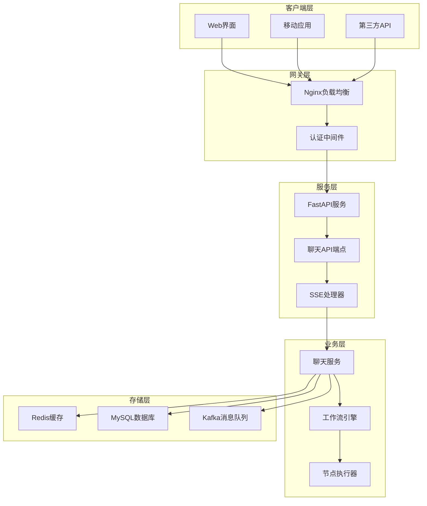
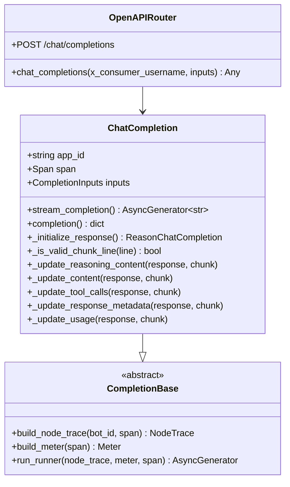
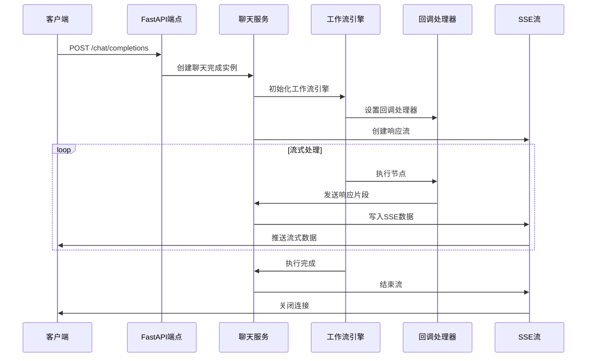
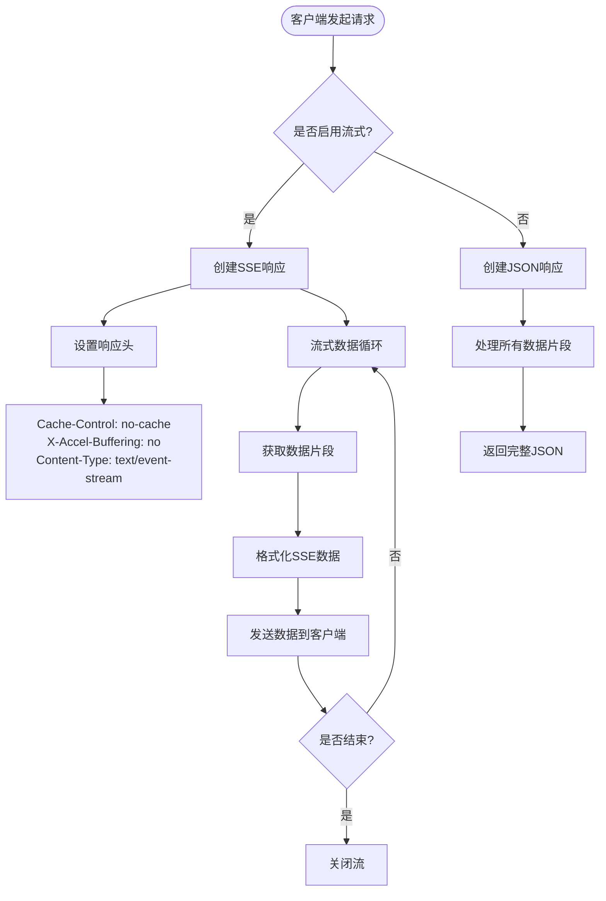
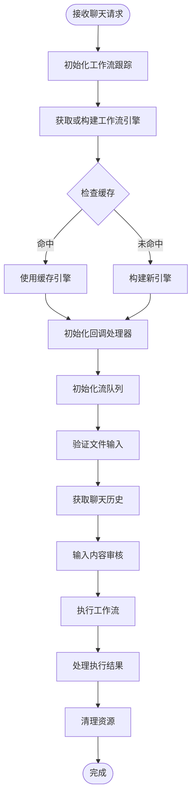
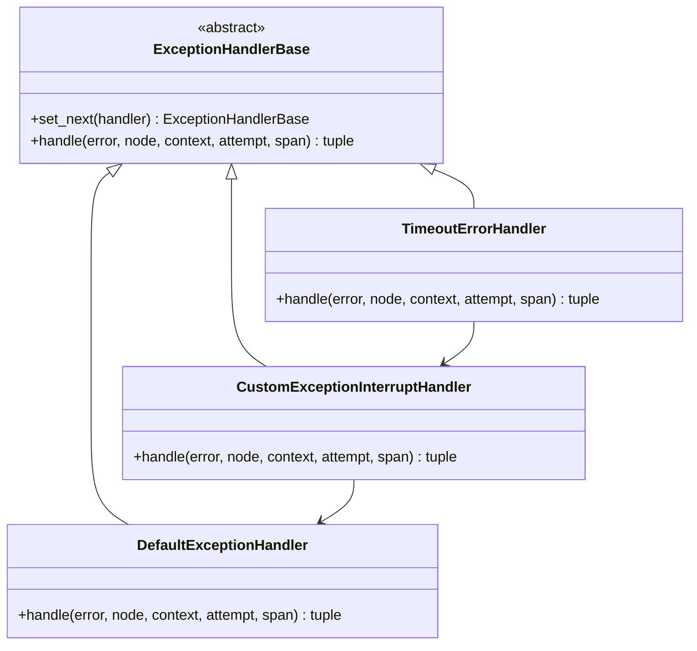
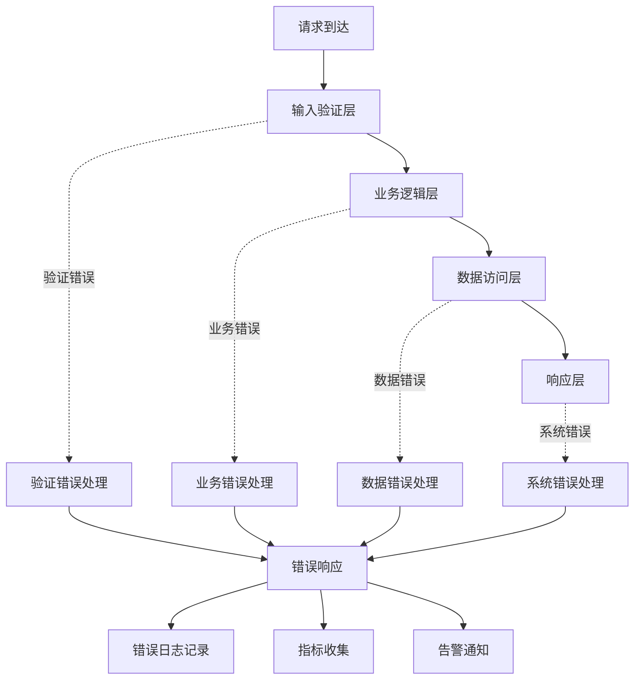

# 基础聊天接口

<cite>
**本文档引用的文件**
- [openapi.py](file://core/agent/api/v1/openapi.py)
- [chat_service.py](file://core/workflow/service/chat_service.py)
- [completion_chunk.py](file://core/agent/api/schemas/completion_chunk.py)
- [completion.py](file://core/agent/api/schemas/completion.py)
- [chat.ts](file://console/frontend/src/services/chat.ts)
- [chat.ts](file://console/frontend/src/utils/chat.ts)
- [dsl_engine.py](file://core/workflow/engine/dsl_engine.py)
- [ws.js](file://console/frontend/src/utils/record/ws.js)
- [index.jsx](file://console/frontend/src/components/voice-broadcast/index.jsx)
</cite>

## 目录
1. [简介](#简介)
2. [系统架构概览](#系统架构概览)
3. [核心组件分析](#核心组件分析)
4. [API端点详解](#api端点详解)
5. [SSE流式传输机制](#sse流式传输机制)
6. [请求参数与响应格式](#请求参数与响应格式)
7. [客户端示例代码](#客户端示例代码)
8. [聊天服务核心逻辑](#聊天服务核心逻辑)
9. [错误处理与性能优化](#错误处理与性能优化)
10. [故障排除指南](#故障排除指南)

## 简介

基础聊天接口是一个基于FastAPI框架构建的实时聊天服务，采用Server-Sent Events (SSE) 技术实现实时流式响应。该接口支持多种认证方式，提供灵活的工作流引擎集成，并具备完善的错误处理和性能优化机制。

### 主要特性

- **实时流式响应**：基于SSE技术，提供毫秒级响应延迟
- **多认证支持**：支持Header认证等多种认证方式
- **工作流集成**：深度集成工作流引擎，支持复杂业务逻辑
- **错误恢复**：完善的异常处理和自动重试机制
- **性能优化**：缓存机制、连接池管理和资源清理

## 系统架构概览



**图表来源**
- [openapi.py](file://core/agent/api/v1/openapi.py#L1-L50)
- [chat_service.py](file://core/workflow/service/chat_service.py#L1-L100)

## 核心组件分析

### FastAPI聊天API端点

聊天接口的核心实现位于`openapi.py`文件中，提供了完整的RESTful API功能。



**图表来源**
- [openapi.py](file://core/agent/api/v1/openapi.py#L25-L100)

### 聊天服务核心架构

聊天服务负责协调整个聊天流程，包括工作流引擎初始化、回调处理和响应流生成。



**图表来源**
- [chat_service.py](file://core/workflow/service/chat_service.py#L25-L150)
- [openapi.py](file://core/agent/api/v1/openapi.py#L180-L210)

**章节来源**
- [openapi.py](file://core/agent/api/v1/openapi.py#L1-L210)
- [chat_service.py](file://core/workflow/service/chat_service.py#L1-L200)

## API端点详解

### 基础聊天完成端点

主要的聊天完成端点位于`/agent/v1/chat/completions`，支持流式和非流式两种模式。

#### 端点定义

| 属性 | 值 |
|------|-----|
| 路径 | `/agent/v1/chat/completions` |
| 方法 | `POST` |
| 认证 | Header认证（`x_consumer_username`） |
| 内容类型 | `application/json` |
| 响应类型 | `text/event-stream`（流式）或 `application/json`（非流式） |

#### 请求头参数

| 参数名 | 类型 | 必需 | 描述 |
|--------|------|------|------|
| `x_consumer_username` | string | 是 | 消费者用户名，用于身份认证 |
| `Content-Type` | string | 是 | 请求内容类型，必须为`application/json` |
| `Accept` | string | 否 | 响应接受类型，默认为`text/event-stream` |

#### 请求体结构

```typescript
interface CompletionInputs {
    bot_id: string;           // 智能体ID
    uid: string;              // 用户ID
    stream: boolean;          // 是否启用流式响应
    parameters: object;       // 输入参数对象
    meta_data: MetaData;      // 元数据信息
}

interface MetaData {
    caller: string;           // 调用方标识
    caller_sid: string;       // 调用方会话ID
    timestamp: number;        // 时间戳
}
```

#### 响应格式

##### 非流式响应
```json
{
    "id": "chat_cmpl-123456789",
    "created": 1640995200,
    "model": "astron-agent-v1",
    "object": "chat.completion",
    "choices": [{
        "index": 0,
        "message": {
            "role": "assistant",
            "content": "这是完整的响应内容",
            "reasoning_content": "推理过程..."
        },
        "finish_reason": "stop"
    }],
    "usage": {
        "prompt_tokens": 10,
        "completion_tokens": 50,
        "total_tokens": 60
    }
}
```

##### 流式响应数据帧格式
```
data: {"id":"chat_cmpl-123","created":1640995200,"model":"astron-agent-v1","object":"chat.completion.chunk","choices":[{"index":0,"delta":{"role":"assistant","content":"这是"},"finish_reason":null}]}

data: {"id":"chat_cmpl-123","created":1640995200,"model":"astron-agent-v1","object":"chat.completion.chunk","choices":[{"index":0,"delta":{"content":"流式"},"finish_reason":null}]}

data: [DONE]
```

**章节来源**
- [openapi.py](file://core/agent/api/v1/openapi.py#L180-L210)

## SSE流式传输机制

### SSE连接建立

SSE（Server-Sent Events）连接通过`StreamingResponse`实现，支持持久化连接和自动重连。



**图表来源**
- [openapi.py](file://core/agent/api/v1/openapi.py#L190-L210)

### 数据帧格式规范

每个SSE数据帧遵循以下格式：

```
data: {JSON序列化的响应数据}

[空行]
```

#### 响应字段说明

| 字段 | 类型 | 描述 |
|------|------|------|
| `id` | string | 响应唯一标识符 |
| `created` | integer | 创建时间戳 |
| `model` | string | 使用的模型名称 |
| `object` | string | 对象类型（chunk） |
| `choices` | array | 选择结果数组 |
| `usage` | object | Token使用统计 |

### 心跳机制

系统实现了内置的心跳机制来维持连接活跃：

```python
# 心跳检测间隔（默认值）
PING_INTERVAL = 30  # 秒

# 心跳响应格式
PING_RESPONSE = "data: {\"ping\": \"pong\"}\n\n"
```

### 连接管理

#### 连接超时配置

| 超时类型 | 默认值 | 可配置范围 |
|----------|--------|------------|
| 连接超时 | 600秒 | 300-1800秒 |
| 发送超时 | 600秒 | 300-1800秒 |
| 读取超时 | 600秒 | 300-1800秒 |

#### 连接池管理

```python
# 连接池配置
POOL_SIZE = 100
MAX_CONNECTIONS = 1000
KEEP_ALIVE_TIMEOUT = 30
```

**章节来源**
- [openapi.py](file://core/agent/api/v1/openapi.py#L180-L210)

## 请求参数与响应格式

### 请求参数详解

#### 核心参数

| 参数名 | 类型 | 必需 | 默认值 | 描述 |
|--------|------|------|--------|------|
| `bot_id` | string | 是 | - | 指定使用的智能体ID |
| `uid` | string | 是 | - | 用户唯一标识符 |
| `stream` | boolean | 否 | `false` | 是否启用流式响应 |
| `parameters` | object | 是 | `{}` | 包含具体输入参数的对象 |

#### 高级参数配置

```typescript
interface AdvancedParams {
    temperature?: number;     // 温度值（0.0-2.0）
    max_tokens?: number;      // 最大生成Token数
    top_k?: number;          // Top-K采样参数
    top_p?: number;          // Top-P采样参数
    repetition_penalty?: number; // 重复惩罚系数
    stop_sequences?: string[];   // 停止序列
    seed?: number;           // 随机种子
}
```

### 响应格式规范

#### 基础响应结构

```typescript
interface ChatCompletionResponse {
    id: string;                    // 响应ID
    created: number;               // 创建时间戳
    model: string;                 // 使用的模型
    object: "chat.completion";     // 对象类型
    choices: Choice[];             // 选择结果
    usage?: Usage;                 // Token使用情况
    code?: number;                 // 状态码
    message?: string;              // 状态消息
}

interface Choice {
    index: number;                 // 选择索引
    message: Message;              // 消息内容
    finish_reason: FinishReason;   // 结束原因
}

interface Message {
    role: "assistant";             // 角色
    content: string;              // 内容
    reasoning_content?: string;   // 推理内容
    tool_calls?: ToolCall[];      // 工具调用
}
```

#### 流式响应数据结构

```typescript
interface ChatCompletionChunk {
    id: string;                    // 响应ID
    created: number;               // 创建时间戳
    model: string;                 // 使用的模型
    object: "chat.completion.chunk"; // 对象类型
    choices: ChunkChoice[];        // 块选择
    code?: number;                 // 状态码
    message?: string;              // 状态消息
    usage?: Usage;                 // Token使用情况
}

interface ChunkChoice {
    index: number;                 // 块索引
    delta: Delta;                  // 增量数据
    finish_reason: FinishReason | null; // 结束原因
}

interface Delta {
    role?: "assistant";            // 角色
    content?: string;             // 内容增量
    reasoning_content?: string;   // 推理内容增量
    tool_calls?: ToolCall[];      // 工具调用增量
}
```

**章节来源**
- [completion.py](file://core/agent/api/schemas/completion.py#L1-L48)
- [completion_chunk.py](file://core/agent/api/schemas/completion_chunk.py#L1-L46)

## 客户端示例代码

### Python客户端示例

#### 基础流式请求

```python
import requests
import json
from typing import Generator

def chat_completion_stream(
    url: str,
    app_id: str,
    bot_id: str,
    user_input: str,
    user_id: str = "default_user"
) -> Generator[dict, None, None]:
    """
    发起流式聊天完成请求
    
    Args:
        url: API端点URL
        app_id: 应用ID
        bot_id: 智能体ID
        user_input: 用户输入内容
        user_id: 用户ID
        
    Yields:
        解析后的响应数据
    """
    headers = {
        "x_consumer_username": app_id,
        "Content-Type": "application/json"
    }
    
    data = {
        "bot_id": bot_id,
        "uid": user_id,
        "stream": True,
        "parameters": {
            "messages": [{"role": "user", "content": user_input}]
        }
    }
    
    with requests.post(
        url,
        headers=headers,
        json=data,
        stream=True,
        timeout=(30, 600)  # (连接超时, 读取超时)
    ) as response:
        response.raise_for_status()
        
        for line in response.iter_lines():
            if line:
                line_str = line.decode('utf-8')
                if line_str.startswith('data: '):
                    try:
                        data = json.loads(line_str[6:])
                        yield data
                    except json.JSONDecodeError:
                        print(f"解析错误: {line_str}")

# 使用示例
url = "http://localhost:8000/agent/v1/chat/completions"
app_id = "your_app_id"
bot_id = "your_bot_id"

for chunk in chat_completion_stream(url, app_id, bot_id, "你好"):
    if 'choices' in chunk and chunk['choices']:
        content = chunk['choices'][0]['delta'].get('content', '')
        print(content, end='', flush=True)
```

#### 非流式请求

```python
def chat_completion_non_stream(
    url: str,
    app_id: str,
    bot_id: str,
    user_input: str,
    user_id: str = "default_user"
) -> dict:
    """
    发起非流式聊天完成请求
    """
    headers = {
        "x_consumer_username": app_id,
        "Content-Type": "application/json"
    }
    
    data = {
        "bot_id": bot_id,
        "uid": user_id,
        "stream": False,
        "parameters": {
            "messages": [{"role": "user", "content": user_input}]
        }
    }
    
    response = requests.post(
        url,
        headers=headers,
        json=data,
        timeout=(30, 600)
    )
    
    response.raise_for_status()
    return response.json()
```

### JavaScript客户端示例

#### 基础SSE连接

```javascript
class ChatClient {
    constructor(baseUrl, appId) {
        this.baseUrl = baseUrl;
        this.appId = appId;
        this.eventSource = null;
        this.isConnected = false;
        this.messageBuffer = [];
    }
    
    connect(userId, botId, userInput) {
        const url = `${this.baseUrl}/agent/v1/chat/completions`;
        
        const headers = {
            'x_consumer_username': this.appId,
            'Content-Type': 'application/json'
        };
        
        const body = JSON.stringify({
            bot_id: botId,
            uid: userId,
            stream: true,
            parameters: {
                messages: [{role: 'user', content: userInput}]
            }
        });
        
        // 创建EventSource连接
        this.eventSource = new EventSource(`${url}?${Date.now()}`, {
            withCredentials: true
        });
        
        this.eventSource.onopen = () => {
            console.log('SSE连接已建立');
            this.isConnected = true;
        };
        
        this.eventSource.onmessage = (event) => {
            if (event.data === '[DONE]') {
                this.eventSource.close();
                this.isConnected = false;
                return;
            }
            
            try {
                const data = JSON.parse(event.data);
                this.messageBuffer.push(data);
                this.handleMessage(data);
            } catch (error) {
                console.error('解析SSE数据失败:', error);
            }
        };
        
        this.eventSource.onerror = (error) => {
            console.error('SSE连接错误:', error);
            this.isConnected = false;
            this.eventSource.close();
        };
    }
    
    handleMessage(data) {
        if (data.choices && data.choices[0]) {
            const content = data.choices[0].delta.content || '';
            // 处理接收到的内容
            this.onMessageReceived(content);
        }
    }
    
    onMessageReceived(content) {
        // 子类实现此方法处理接收到的消息
        console.log('接收到消息:', content);
    }
    
    disconnect() {
        if (this.eventSource) {
            this.eventSource.close();
            this.isConnected = false;
        }
    }
    
    // 获取完整消息历史
    getFullMessage() {
        return this.messageBuffer
            .filter(item => item.choices && item.choices[0])
            .map(item => item.choices[0].delta.content || '')
            .join('');
    }
}

// 使用示例
const client = new ChatClient('http://localhost:8000', 'your_app_id');

client.onMessageReceived = (content) => {
    // 在这里处理接收到的实时内容
    document.getElementById('chat-output').textContent += content;
};

client.connect('user123', 'bot456', '你好，有什么可以帮助的？');
```

#### WebSocket客户端示例

```javascript
class WebSocketClient {
    constructor(url, tokenParams) {
        this.url = url;
        this.tokenParams = tokenParams;
        this.ws = null;
        this.isConnected = false;
        this.messageQueue = [];
        this.onMessage = null;
        this.onError = null;
        this.onClose = null;
    }
    
    connect() {
        const fullUrl = this.assembleRequestUrl();
        this.ws = new WebSocket(fullUrl);
        
        this.ws.onopen = () => {
            console.log('WebSocket连接已建立');
            this.isConnected = true;
            this.processMessageQueue();
        };
        
        this.ws.onmessage = (event) => {
            try {
                const data = JSON.parse(event.data);
                if (this.onMessage) {
                    this.onMessage(data);
                }
            } catch (error) {
                console.error('解析WebSocket消息失败:', error);
                if (this.onError) {
                    this.onError(error);
                }
            }
        };
        
        this.ws.onerror = (error) => {
            console.error('WebSocket错误:', error);
            if (this.onError) {
                this.onError(error);
            }
        };
        
        this.ws.onclose = (event) => {
            console.log('WebSocket连接已关闭', event);
            this.isConnected = false;
            if (this.onClose) {
                this.onClose(event);
            }
        };
    }
    
    assembleRequestUrl() {
        return `${this.url}?appid=${this.tokenParams.appid}&ts=${this.tokenParams.ts}&signa=${this.tokenParams.signa}`;
    }
    
    sendMessage(message) {
        if (this.isConnected) {
            this.ws.send(JSON.stringify(message));
        } else {
            this.messageQueue.push(message);
        }
    }
    
    processMessageQueue() {
        while (this.messageQueue.length > 0 && this.isConnected) {
            const message = this.messageQueue.shift();
            this.ws.send(JSON.stringify(message));
        }
    }
    
    disconnect() {
        if (this.ws) {
            this.ws.close();
        }
    }
}

// 使用示例
const tokenParams = {
    url: 'ws://localhost:8000/api/rpa-openapi/ws',
    appid: 'your_app_id',
    ts: Date.now(),
    signa: 'your_signature'
};

const wsClient = new WebSocketClient('ws://localhost:8000/api/rpa-openapi/ws', tokenParams);

wsClient.onMessage = (data) => {
    console.log('收到消息:', data);
};

wsClient.connect();
```

### 前端React Hook示例

```typescript
import { useState, useEffect, useCallback } from 'react';

interface ChatMessage {
    role: 'user' | 'assistant';
    content: string;
    reasoning?: string;
}

interface ChatResponse {
    id: string;
    choices: Array<{
        index: number;
        message: {
            role: 'assistant';
            content: string;
            reasoning_content?: string;
        };
        finish_reason: string;
    }>;
    usage?: {
        prompt_tokens: number;
        completion_tokens: number;
        total_tokens: number;
    };
}

export function useChatCompletion() {
    const [messages, setMessages] = useState<ChatMessage[]>([]);
    const [isLoading, setIsLoading] = useState(false);
    const [error, setError] = useState<string | null>(null);
    
    const sendMessage = useCallback(async (message: string) => {
        setIsLoading(true);
        setError(null);
        
        try {
            // 添加用户消息到历史
            setMessages(prev => [...prev, { role: 'user', content: message }]);
            
            // 发起流式请求
            const response = await fetch('/agent/v1/chat/completions', {
                method: 'POST',
                headers: {
                    'x_consumer_username': 'your_app_id',
                    'Content-Type': 'application/json'
                },
                body: JSON.stringify({
                    bot_id: 'your_bot_id',
                    uid: 'user123',
                    stream: true,
                    parameters: {
                        messages: [
                            ...messages.map(m => ({ role: m.role, content: m.content })),
                            { role: 'user', content: message }
                        ]
                    }
                })
            });
            
            if (!response.ok) {
                throw new Error(`HTTP error! status: ${response.status}`);
            }
            
            const reader = response.body?.getReader();
            if (!reader) {
                throw new Error('无法读取响应流');
            }
            
            let assistantMessage = '';
            
            while (true) {
                const { done, value } = await reader.read();
                if (done) break;
                
                const chunk = new TextDecoder().decode(value);
                const lines = chunk.split('\n');
                
                for (const line of lines) {
                    if (line.startsWith('data: ')) {
                        const jsonData = line.slice(6);
                        if (jsonData === '[DONE]') {
                            break;
                        }
                        
                        try {
                            const parsed: ChatResponse = JSON.parse(jsonData);
                            if (parsed.choices && parsed.choices[0]) {
                                const content = parsed.choices[0].message.content || '';
                                assistantMessage += content;
                                
                                // 更新助手消息
                                setMessages(prev => {
                                    const lastMessage = prev[prev.length - 1];
                                    if (lastMessage?.role === 'assistant') {
                                        return [...prev.slice(0, -1), {
                                            ...lastMessage,
                                            content: assistantMessage
                                        }];
                                    }
                                    return [...prev, { role: 'assistant', content: assistantMessage }];
                                });
                            }
                        } catch (parseError) {
                            console.error('解析JSON失败:', parseError);
                        }
                    }
                }
            }
            
        } catch (err) {
            setError(err instanceof Error ? err.message : '未知错误');
        } finally {
            setIsLoading(false);
        }
    }, [messages]);
    
    return {
        messages,
        isLoading,
        error,
        sendMessage
    };
}
```

**章节来源**
- [chat.ts](file://console/frontend/src/services/chat.ts#L1-L261)
- [ws.js](file://console/frontend/src/utils/record/ws.js#L1-L53)

## 聊天服务核心逻辑

### 工作流引擎集成

聊天服务深度集成了工作流引擎，支持复杂的业务逻辑处理。



**图表来源**
- [chat_service.py](file://core/workflow/service/chat_service.py#L400-L600)

### 会话状态管理

聊天服务维护详细的会话状态，包括：

#### 状态跟踪

| 状态类型 | 描述 | 存储位置 |
|----------|------|----------|
| 会话ID | 唯一会话标识符 | 内存/Redis |
| 用户上下文 | 用户相关配置和偏好 | 数据库 |
| 历史记录 | 对话历史和上下文 | 数据库 |
| 引擎状态 | 工作流引擎实例状态 | 缓存 |

#### 会话生命周期

```python
class ChatSession:
    def __init__(self, session_id: str, user_id: str):
        self.session_id = session_id
        self.user_id = user_id
        self.created_at = datetime.utcnow()
        self.last_activity = datetime.utcnow()
        self.status = "active"
        self.context = {}
        self.history = []
    
    def update_activity(self):
        """更新会话活动时间"""
        self.last_activity = datetime.utcnow()
    
    def add_message(self, message: dict):
        """添加消息到会话历史"""
        self.history.append(message)
        self.update_activity()
    
    def get_context(self) -> dict:
        """获取会话上下文"""
        return {
            "session_id": self.session_id,
            "user_id": self.user_id,
            "created_at": self.created_at.isoformat(),
            "last_activity": self.last_activity.isoformat(),
            "message_count": len(self.history)
        }
```

### 异常处理机制

#### 异常分类处理



**图表来源**
- [dsl_engine.py](file://core/workflow/engine/dsl_engine.py#L150-L250)

#### 错误恢复策略

| 错误类型 | 恢复策略 | 重试次数 | 退避策略 |
|----------|----------|----------|----------|
| 网络超时 | 自动重试 | 3次 | 指数退避 |
| 认证失败 | 重新认证 | 1次 | 立即重试 |
| 业务逻辑错误 | 记录日志 | 0次 | 不重试 |
| 资源不足 | 降级处理 | 2次 | 固定间隔 |

**章节来源**
- [chat_service.py](file://core/workflow/service/chat_service.py#L1-L800)
- [dsl_engine.py](file://core/workflow/engine/dsl_engine.py#L1-L200)

## 错误处理与性能优化

### 错误处理策略

#### 分层错误处理



#### 错误代码定义

| 错误码 | 错误类型 | 描述 | 处理策略 |
|--------|----------|------|----------|
| 1001 | VALIDATION_ERROR | 请求参数验证失败 | 立即返回错误 |
| 1002 | AUTHENTICATION_ERROR | 认证失败 | 返回401状态码 |
| 1003 | RATE_LIMIT_ERROR | 请求频率超限 | 返回429状态码 |
| 1004 | WORKFLOW_ERROR | 工作流执行错误 | 记录日志，返回部分结果 |
| 1005 | TIMEOUT_ERROR | 请求超时 | 自动重试 |
| 1006 | UNKNOWN_ERROR | 未知错误 | 记录详细日志 |

### 性能优化建议

#### 缓存策略

```python
# 缓存配置示例
CACHE_CONFIG = {
    "engine_cache_ttl": 3600,      # 引擎缓存生存时间（秒）
    "workflow_cache_ttl": 1800,    # 工作流缓存生存时间（秒）
    "history_cache_ttl": 600,      # 历史记录缓存生存时间（秒）
    "session_cache_ttl": 1800,     # 会话缓存生存时间（秒）
}

# 缓存键命名规范
CACHE_KEYS = {
    "engine": f"engine:{flow_id}:{version}",
    "workflow": f"workflow:{flow_id}",
    "history": f"history:{user_id}:{flow_id}",
    "session": f"session:{session_id}"
}
```

#### 连接池优化

```python
# 数据库连接池配置
DATABASE_POOL_CONFIG = {
    "min_size": 5,
    "max_size": 20,
    "max_queries": 50000,
    "max_inactive_connection_lifetime": 300
}

# Redis连接池配置
REDIS_POOL_CONFIG = {
    "max_connections": 100,
    "retry_on_timeout": True,
    "socket_timeout": 5,
    "socket_connect_timeout": 5
}
```

#### 并发控制

```python
# 并发限制配置
CONCURRENCY_LIMITS = {
    "max_concurrent_requests": 100,
    "max_streaming_connections": 50,
    "max_workflow_executions": 20,
    "max_history_fetches": 10
}

# 信号量控制
semaphore = asyncio.Semaphore(CONCURRENCY_LIMITS["max_concurrent_requests"])
```

### 监控和指标

#### 关键性能指标（KPI）

| 指标名称 | 计算方式 | 目标值 | 告警阈值 |
|----------|----------|--------|----------|
| 请求响应时间 | P95响应时间 | < 2秒 | > 5秒 |
| 错误率 | 错误请求数/总请求数 | < 1% | > 5% |
| 并发连接数 | 当前活跃连接数 | < 80% | > 90% |
| 缓存命中率 | 缓存命中次数/总查询次数 | > 80% | < 60% |
| 工作流执行时间 | 工作流平均执行时间 | < 10秒 | > 30秒 |

#### 日志记录策略

```python
# 结构化日志配置
LOG_CONFIG = {
    "level": "INFO",
    "format": "{time} {level} {message}",
    "rotation": "10 MB",
    "retention": "7 days",
    "enqueue": True,
    "serialize": True
}

# 关键操作日志
logger.info(
    "聊天请求处理",
    extra={
        "flow_id": flow_id,
        "user_id": user_id,
        "request_id": request_id,
        "duration_ms": duration_ms,
        "status": "success"
    }
)
```

**章节来源**
- [chat_service.py](file://core/workflow/service/chat_service.py#L600-L800)

## 故障排除指南

### 常见问题诊断

#### 连接问题

| 问题症状 | 可能原因 | 解决方案 |
|----------|----------|----------|
| 连接超时 | 网络延迟或服务器负载过高 | 检查网络状况，增加超时时间 |
| 连接被拒绝 | 服务未启动或端口被占用 | 确认服务状态和端口监听 |
| SSL握手失败 | 证书问题或协议不匹配 | 检查SSL配置和证书有效性 |

#### 流式传输问题

| 问题症状 | 可能原因 | 解决方案 |
|----------|----------|----------|
| 数据丢失 | 网络不稳定或客户端断开 | 实现重连机制和数据校验 |
| 响应缓慢 | 服务器处理能力不足 | 优化服务器性能和并发控制 |
| 格式错误 | 数据编码或解析问题 | 检查数据编码格式和解析逻辑 |

#### 工作流执行问题

| 问题症状 | 可能原因 | 解决方案 |
|----------|----------|----------|
| 执行失败 | 节点配置错误或依赖缺失 | 检查工作流配置和节点依赖 |
| 性能下降 | 数据库查询慢或缓存失效 | 优化查询语句和缓存策略 |
| 内存泄漏 | 资源未正确释放 | 检查资源清理逻辑 |

### 调试工具和技巧

#### 日志分析

```bash
# 查看API服务日志
tail -f /var/log/astron-agent/api.log

# 查看工作流执行日志
grep "workflow_execution" /var/log/astron-agent/workflow.log

# 分析错误日志
grep -E "(ERROR|EXCEPTION)" /var/log/astron-agent/*.log | tail -100
```

#### 性能监控

```bash
# 监控API响应时间
curl -w "@curl-format.txt" -o /dev/null -s "http://localhost:8000/agent/v1/chat/completions"

# curl-format.txt内容：
#     time_namelookup:  %{time_namelookup}\n
#        time_connect:  %{time_connect}\n
#     time_appconnect:  %{time_appconnect}\n
#    time_pretransfer:  %{time_pretransfer}\n
#       time_redirect:  %{time_redirect}\n
#  time_starttransfer:  %{time_starttransfer}\n
#                     ----------\n
#          time_total:  %{time_total}\n
```

#### 健康检查

```python
# 健康检查端点
@app.get("/health")
async def health_check():
    """健康检查端点"""
    try:
        # 检查数据库连接
        async with db_pool.acquire() as conn:
            await conn.fetchval("SELECT 1")
        
        # 检查Redis连接
        await redis.ping()
        
        # 检查工作流引擎状态
        engine_status = await workflow_engine.get_status()
        
        return {
            "status": "healthy",
            "timestamp": datetime.utcnow().isoformat(),
            "database": "connected",
            "redis": "connected",
            "workflow_engine": engine_status
        }
        
    except Exception as e:
        return {
            "status": "unhealthy",
            "error": str(e),
            "timestamp": datetime.utcnow().isoformat()
        }
```

### 最佳实践建议

#### 开发阶段

1. **本地测试环境配置**
   - 使用Docker容器化部署
   - 配置本地开发数据库
   - 设置Mock服务进行单元测试

2. **API文档维护**
   - 使用OpenAPI规范生成文档
   - 定期更新API变更记录
   - 提供交互式API测试界面

3. **代码质量保证**
   - 实施代码审查流程
   - 使用静态代码分析工具
   - 编写全面的单元测试

#### 生产环境

1. **监控告警**
   - 设置关键指标监控
   - 配置自动化告警规则
   - 建立故障响应流程

2. **容量规划**
   - 定期评估系统负载
   - 制定扩容计划
   - 实施自动扩缩容策略

3. **安全加固**
   - 定期更新依赖包
   - 实施访问控制策略
   - 加密敏感数据传输

**章节来源**
- [openapi.py](file://core/agent/api/v1/openapi.py#L180-L210)
- [chat_service.py](file://core/workflow/service/chat_service.py#L700-L800)