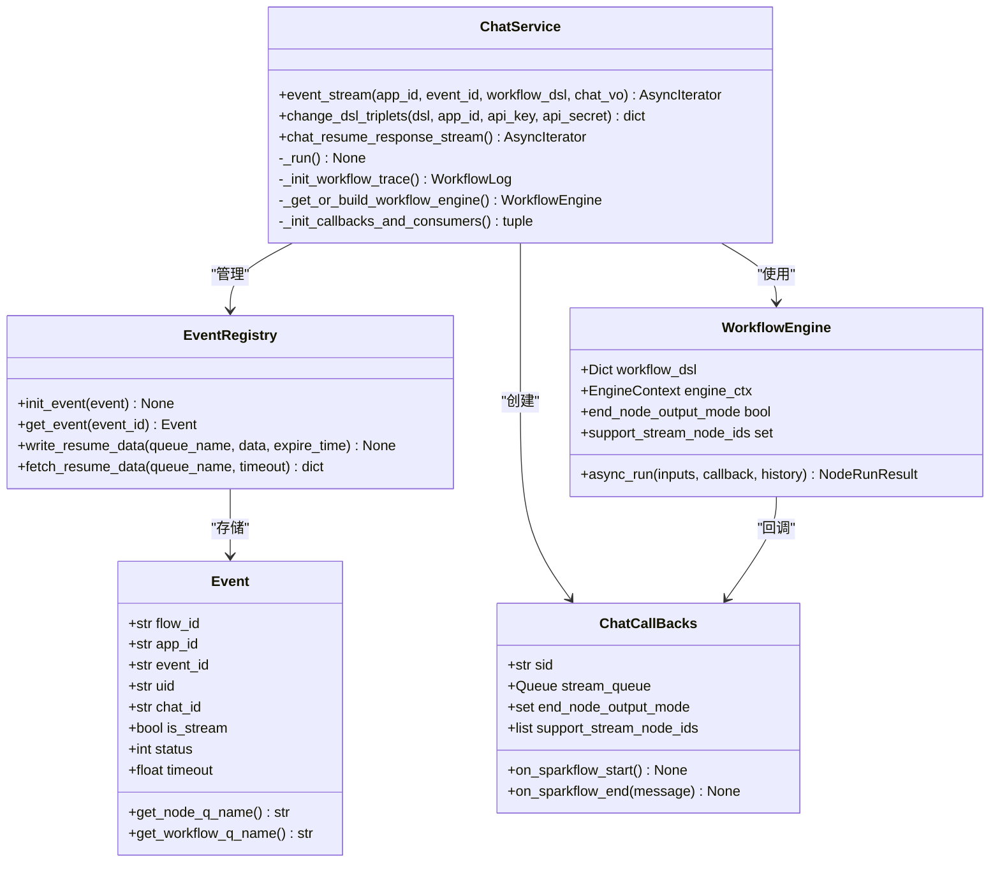
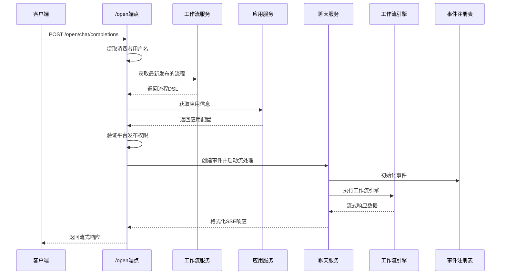
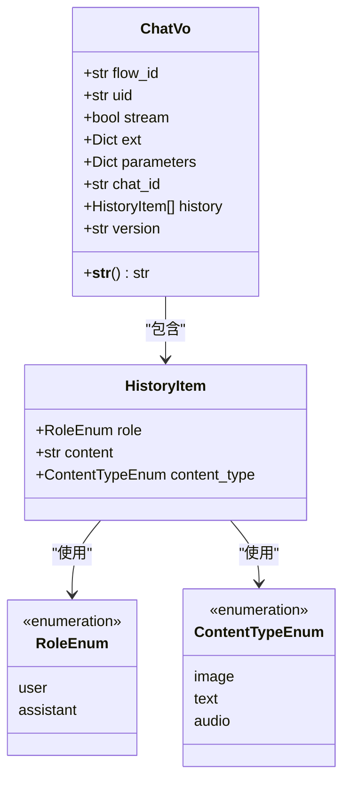
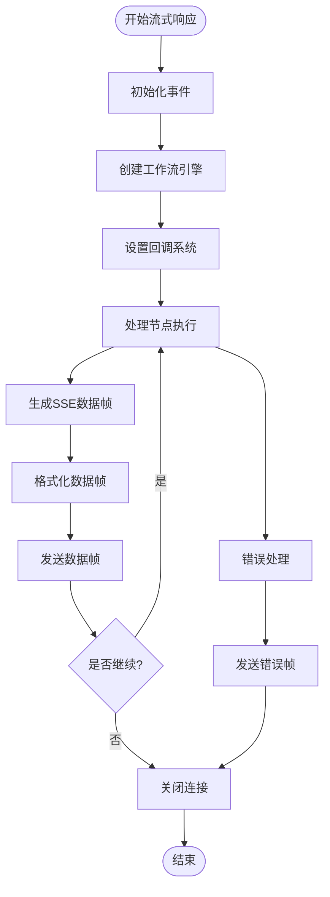
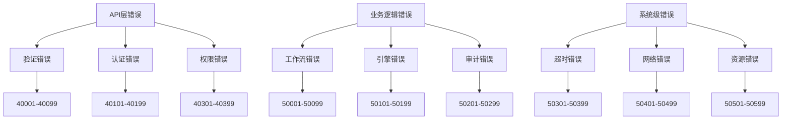
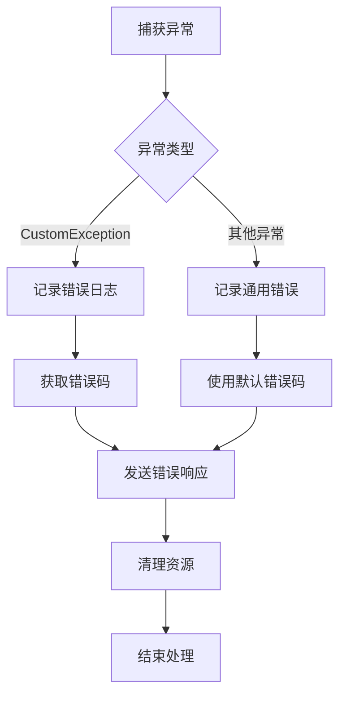
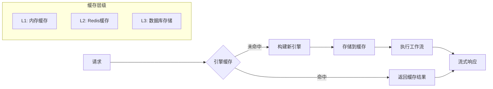

# 聊天API详细文档

<cite>
**本文档中引用的文件**
- [open.py](file://core/workflow/api/v1/chat/open.py)
- [debug.py](file://core/workflow/api/v1/chat/debug.py)
- [chat_service.py](file://core/workflow/service/chat_service.py)
- [chat.py](file://core/workflow/domain/entities/chat.py)
- [response.py](file://core/workflow/domain/entities/response.py)
- [openai_types_sse.py](file://core/workflow/engine/callbacks/openai_types_sse.py)
</cite>

## 目录
1. [简介](#简介)
2. [项目架构概览](#项目架构概览)
3. [核心组件分析](#核心组件分析)
4. [/open端点详细说明](#open端点详细说明)
5. [/debug端点详细说明](#debug端点详细说明)
6. [请求参数和响应格式](#请求参数和响应格式)
7. [流式响应处理](#流式响应处理)
8. [客户端示例代码](#客户端示例代码)
9. [错误处理和异常管理](#错误处理和异常管理)
10. [性能优化和最佳实践](#性能优化和最佳实践)
11. [故障排除指南](#故障排除指南)

## 简介

astron-agent的聊天API提供了基于工作流引擎的实时对话功能，支持SSE（Server-Sent Events）流式传输响应。该系统通过两个主要端点提供服务：
- `/open` 端点：生产环境使用的正式API
- `/debug` 端点：开发和调试专用的简化版本

系统采用事件驱动架构，能够处理复杂的多节点工作流，并提供实时的流式响应能力。

## 项目架构概览

```mermaid
graph TB
subgraph "前端层"
WebUI[Web界面]
JSClient[JavaScript客户端]
PyClient[Python客户端]
end
subgraph "API网关层"
FastAPI[FastAPI服务器]
Auth[身份验证]
Middleware[中间件]
end
subgraph "业务逻辑层"
OpenAPI[/open端点]
DebugAPI[/debug端点]
ChatService[聊天服务]
FlowService[工作流服务]
end
subgraph "引擎层"
WorkflowEngine[工作流引擎]
NodeExecutors[节点执行器]
CallbackSystem[回调系统]
end
subgraph "数据层"
EventRegistry[事件注册表]
RedisCache[Redis缓存]
Database[数据库]
end
WebUI --> FastAPI
JSClient --> FastAPI
PyClient --> FastAPI
FastAPI --> Auth
Auth --> Middleware
Middleware --> OpenAPI
Middleware --> DebugAPI
OpenAPI --> ChatService
DebugAPI --> ChatService
ChatService --> FlowService
ChatService --> WorkflowEngine
WorkflowEngine --> NodeExecutors
WorkflowEngine --> CallbackSystem
CallbackSystem --> EventRegistry
EventRegistry --> RedisCache
FlowService --> Database
```

**图表来源**
- [open.py](file://core/workflow/api/v1/chat/open.py#L1-L50)
- [debug.py](file://core/workflow/api/v1/chat/debug.py#L1-L50)
- [chat_service.py](file://core/workflow/service/chat_service.py#L1-L100)

## 核心组件分析

### 聊天服务架构



**图表来源**
- [chat_service.py](file://core/workflow/service/chat_service.py#L25-L150)
- [openai_types_sse.py](file://core/workflow/engine/callbacks/openai_types_sse.py#L1-L100)

**章节来源**
- [chat_service.py](file://core/workflow/service/chat_service.py#L1-L200)
- [openai_types_sse.py](file://core/workflow/engine/callbacks/openai_types_sse.py#L1-L200)

## /open端点详细说明

### 端点功能概述

`/open/chat/completions` 端点是生产环境的主要聊天API入口，提供完整的认证、审计和发布验证功能。

### 请求处理流程



**图表来源**
- [open.py](file://core/workflow/api/v1/chat/open.py#L35-L120)
- [chat_service.py](file://core/workflow/service/chat_service.py#L30-L100)

### 认证和授权机制

| 组件 | 功能 | 配置 |
|------|------|------|
| 头部认证 | `x_consumer_username` 头部验证 | 必需头部，标识消费者应用 |
| 平台验证 | 检查工作流在目标平台的发布状态 | 支持星尘、开放、AI UI平台 |
| 审计策略 | 根据应用配置决定是否启用内容审计 | DEFAULT vs AGENT_PLATFORM |
| 凭证替换 | 替换DSL中的模型提供商凭据 | 自动替换为应用凭据 |

### 发布验证规则

系统会检查工作流的发布状态以确保安全性：

```python
# 发布状态验证逻辑
if (db_flow.release_status == 0) or (
    db_flow.release_status & TenantPublishMatrix(Platform.XINGCHEN).get_take_off and
    db_flow.release_status & TenantPublishMatrix(Platform.KAI_FANG).get_take_off and
    db_flow.release_status & TenantPublishMatrix(Platform.AI_UI).get_take_off
):
    return await Streaming.send_error(
        LLMGenerate.workflow_end_error(span_context.sid, CodeEnum.FLOW_NOT_PUBLISH_ERROR.code, CodeEnum.FLOW_NOT_PUBLISH_ERROR.msg)
    )
```

**章节来源**
- [open.py](file://core/workflow/api/v1/chat/open.py#L35-L120)

## /debug端点详细说明

### 端点功能对比

| 特性 | /open端点 | /debug端点 |
|------|-----------|------------|
| 认证要求 | 完整的头部认证 | 仅基本参数验证 |
| 平台验证 | 严格的发布状态检查 | 跳过发布验证 |
| 审计策略 | 根据应用配置 | 默认禁用审计 |
| 缓存机制 | 启用引擎缓存 | 跳过缓存 |
| 错误处理 | 详细的错误报告 | 简化的错误响应 |

### 调试模式优势

调试端点专为开发和测试设计，具有以下特点：

1. **绕过发布验证**：无需工作流发布即可运行
2. **简化审计**：默认禁用内容审核
3. **快速响应**：跳过缓存和复杂验证
4. **详细日志**：提供更多调试信息

### 使用场景

- 开发阶段的工作流测试
- 快速原型验证
- 故障排除和问题诊断
- 性能基准测试

**章节来源**
- [debug.py](file://core/workflow/api/v1/chat/debug.py#L30-L100)

## 请求参数和响应格式

### ChatVo 请求结构



**图表来源**
- [chat.py](file://core/workflow/domain/entities/chat.py#L35-L95)

### 请求参数详解

| 参数名 | 类型 | 必需 | 描述 | 示例 |
|--------|------|------|------|------|
| `flow_id` | string | 是 | 工作流唯一标识符 | `"wf_12345"` |
| `uid` | string | 否 | 用户标识符，最大40字符 | `"user123"` |
| `stream` | boolean | 否 | 是否启用流式响应 | `true` |
| `ext` | object | 否 | 扩展字段，自定义配置 | `{}` |
| `parameters` | object | 是 | 工作流参数对象 | `{"input": "用户输入"}` |
| `chat_id` | string | 否 | 对话标识符，最大128字符 | `"chat_67890"` |
| `history` | array | 否 | 聊天历史记录 | `[{"role": "user", "content": "你好"}]` |
| `version` | string | 否 | 工作流版本号 | `"v1.0"` |

### 响应格式规范

#### 成功响应结构

```json
{
  "code": 0,
  "message": "success",
  "id": "session_id",
  "created": 1640995200,
  "workflow_step": {
    "node": {
      "id": "node_id",
      "alias_name": "节点名称",
      "finish_reason": "stop",
      "inputs": {},
      "outputs": {},
      "executed_time": 0.123
    },
    "seq": 1,
    "progress": 1.0
  },
  "choices": [
    {
      "delta": {
        "role": "assistant",
        "content": "响应内容",
        "reasoning_content": "推理过程"
      },
      "index": 0,
      "finish_reason": "stop"
    }
  ],
  "usage": {
    "completion_tokens": 50,
    "prompt_tokens": 10,
    "total_tokens": 60
  }
}
```

#### 错误响应结构

```json
{
  "code": 40001,
  "message": "工作流未发布错误",
  "id": "session_id",
  "created": 1640995200
}
```

**章节来源**
- [chat.py](file://core/workflow/domain/entities/chat.py#L35-L95)
- [response.py](file://core/workflow/domain/entities/response.py#L1-L100)

## 流式响应处理

### SSE 数据帧格式

系统使用Server-Sent Events标准格式传输流式数据：



**图表来源**
- [chat_service.py](file://core/workflow/service/chat_service.py#L200-L300)
- [response.py](file://core/workflow/domain/entities/response.py#L100-L186)

### 数据帧结构

每个SSE数据帧遵循以下格式：

```
data: {"key": "value", "key": "value"}
```

#### 常见数据帧类型

| 帧类型 | 格式 | 用途 |
|--------|------|------|
| 节点开始 | `{"workflow_step": {...}, "choices": [...]}` | 标识新节点开始执行 |
| 内容增量 | `{"choices": [{"delta": {"content": "部分响应"}}]}` | 流式传输响应内容 |
| 节点完成 | `{"workflow_step": {...}, "choices": [...], "usage": {...}}` | 节点执行完成 |
| 工作流结束 | `{"workflow_step": {...}, "choices": [...], "usage": {...}}` | 工作流执行完成 |
| 中断事件 | `{"event_data": {...}}` | 节点中断或需要用户输入 |

### 心跳机制

系统实现了智能的心跳机制来维持连接活跃：

```python
# 心跳检测逻辑
try:
    response = await asyncio.wait_for(
        audit_strategy.context.output_queue.get(),
        timeout=QueueTimeout.PingQT.value
    )
except asyncio.TimeoutError:
    response = LLMGenerate._ping(sid=last_response.id if last_response else "", node_info=node)
```

### 连接管理

| 连接状态 | 超时时间 | 处理策略 |
|----------|----------|----------|
| 正常活跃 | 30秒 | 继续传输数据 |
| 心跳超时 | 10秒 | 发送ping帧保持连接 |
| 异常断开 | 立即 | 清理资源并关闭连接 |
| 超时断开 | 60秒 | 强制关闭连接 |

**章节来源**
- [response.py](file://core/workflow/domain/entities/response.py#L100-L186)
- [openai_types_sse.py](file://core/workflow/engine/callbacks/openai_types_sse.py#L400-L500)

## 客户端示例代码

### Python 客户端示例

```python
import asyncio
import json
import aiohttp
from typing import AsyncGenerator

class AstronChatClient:
    def __init__(self, base_url: str, api_key: str):
        self.base_url = base_url
        self.api_key = api_key
        
    async def chat_completion(self, flow_id: str, user_input: str, 
                            stream: bool = True) -> AsyncGenerator[dict, None]:
        """发送聊天请求并处理流式响应"""
        url = f"{self.base_url}/open/chat/completions"
        headers = {
            "Content-Type": "application/json",
            "Authorization": f"Bearer {self.api_key}",
            "x-consumer-username": "your_app_id"
        }
        
        data = {
            "flow_id": flow_id,
            "parameters": {"input": user_input},
            "stream": stream,
            "uid": "user123",
            "ext": {}
        }
        
        async with aiohttp.ClientSession() as session:
            async with session.post(url, headers=headers, json=data) as response:
                if response.status == 200:
                    async for line in response.content:
                        line_str = line.decode('utf-8')
                        if line_str.startswith('data: '):
                            try:
                                yield json.loads(line_str[6:])
                            except json.JSONDecodeError:
                                continue
                else:
                    error_data = await response.json()
                    raise Exception(f"API Error: {error_data}")
```

### JavaScript 客户端示例

```javascript
class AstronChatClient {
    constructor(baseUrl, apiKey) {
        this.baseUrl = baseUrl;
        this.apiKey = apiKey;
    }
    
    async chatCompletion(flowId, userInput, options = {}) {
        const {
            stream = true,
            userId = 'user123',
            ext = {}
        } = options;
        
        const url = `${this.baseUrl}/open/chat/completions`;
        const headers = {
            'Content-Type': 'application/json',
            'Authorization': `Bearer ${this.apiKey}`,
            'x-consumer-username': 'your_app_id'
        };
        
        const data = {
            flow_id: flowId,
            parameters: { input: userInput },
            stream,
            uid: userId,
            ext
        };
        
        const response = await fetch(url, {
            method: 'POST',
            headers,
            body: JSON.stringify(data)
        });
        
        if (!response.ok) {
            throw new Error(`HTTP error! status: ${response.status}`);
        }
        
        if (stream) {
            return this.handleStreamResponse(response);
        } else {
            return response.json();
        }
    }
    
    handleStreamResponse(response) {
        const reader = response.body.getReader();
        const decoder = new TextDecoder();
        
        return {
            [Symbol.asyncIterator]: async function* () {
                let buffer = '';
                
                while (true) {
                    const { done, value } = await reader.read();
                    if (done) break;
                    
                    buffer += decoder.decode(value, { stream: true });
                    const lines = buffer.split('\n\n');
                    
                    for (let i = 0; i < lines.length - 1; i++) {
                        const line = lines[i].replace(/^data: /, '');
                        if (line.trim()) {
                            try {
                                yield JSON.parse(line);
                            } catch (e) {
                                console.warn('Invalid JSON:', line);
                            }
                        }
                    }
                    
                    buffer = lines[lines.length - 1];
                }
                
                // 处理剩余的缓冲数据
                if (buffer.trim()) {
                    try {
                        yield JSON.parse(buffer.replace(/^data: /, ''));
                    } catch (e) {
                        console.warn('Invalid JSON at end:', buffer);
                    }
                }
            }
        };
    }
}
```

### 前端集成示例

```javascript
// React Hook 实现
import { useState, useEffect } from 'react';

function useAstronChat() {
    const [messages, setMessages] = useState([]);
    const [isLoading, setIsLoading] = useState(false);
    const [error, setError] = useState(null);
    
    const sendMessage = async (flowId, message) => {
        try {
            setIsLoading(true);
            setError(null);
            
            const client = new AstronChatClient('/api', 'your_api_key');
            const stream = await client.chatCompletion(flowId, message, {
                stream: true,
                userId: 'current_user'
            });
            
            let fullResponse = '';
            for await (const chunk of stream) {
                if (chunk.choices && chunk.choices[0].delta.content) {
                    fullResponse += chunk.choices[0].delta.content;
                    setMessages(prev => {
                        const lastMessage = prev[prev.length - 1];
                        if (lastMessage && lastMessage.role === 'assistant') {
                            return [...prev.slice(0, -1), {
                                ...lastMessage,
                                content: fullResponse
                            }];
                        }
                        return [...prev, {
                            role: 'assistant',
                            content: fullResponse
                        }];
                    });
                }
            }
            
        } catch (err) {
            setError(err.message);
        } finally {
            setIsLoading(false);
        }
    };
    
    return { messages, isLoading, error, sendMessage };
}
```

**章节来源**
- [chat_service.py](file://core/workflow/service/chat_service.py#L25-L150)

## 错误处理和异常管理

### 错误分类体系



### 错误响应格式

所有错误都遵循统一的响应格式：

```json
{
  "code": 40001,
  "message": "错误描述信息",
  "id": "session_id",
  "created": 1640995200
}
```

### 常见错误码

| 错误码 | 错误类型 | 描述 | 解决方案 |
|--------|----------|------|----------|
| 40001 | FLOW_NOT_PUBLISH_ERROR | 工作流未发布 | 发布工作流或使用debug端点 |
| 40002 | PROTOCOL_VALIDATION_ERROR | 协议验证失败 | 检查请求参数格式 |
| 40101 | AUTHENTICATION_ERROR | 认证失败 | 检查API密钥和头部信息 |
| 40301 | PERMISSION_DENIED | 权限不足 | 检查应用权限配置 |
| 50001 | WORKFLOW_EXECUTION_ERROR | 工作流执行错误 | 检查工作流配置 |
| 50101 | ENGINE_INITIALIZATION_ERROR | 引擎初始化失败 | 检查引擎配置和依赖 |
| 50301 | TIMEOUT_ERROR | 请求超时 | 增加超时时间或优化工作流 |

### 异常处理策略



**图表来源**
- [open.py](file://core/workflow/api/v1/chat/open.py#L120-L180)
- [debug.py](file://core/workflow/api/v1/chat/debug.py#L100-L150)

**章节来源**
- [open.py](file://core/workflow/api/v1/chat/open.py#L120-L180)
- [debug.py](file://core/workflow/api/v1/chat/debug.py#L100-L150)

## 性能优化和最佳实践

### 缓存策略

系统实现了多层次的缓存机制来提升性能：



### 性能优化建议

| 优化方面 | 建议措施 | 预期效果 |
|----------|----------|----------|
| 连接池管理 | 使用连接池复用HTTP连接 | 减少连接建立开销 |
| 缓存策略 | 合理设置缓存过期时间 | 提升响应速度 |
| 流式处理 | 启用流式响应减少延迟 | 改善用户体验 |
| 并发控制 | 限制同时处理的请求数量 | 防止资源耗尽 |
| 资源监控 | 监控内存和CPU使用情况 | 及时发现性能瓶颈 |

### 超时配置

| 组件 | 默认超时 | 可配置范围 | 说明 |
|------|----------|------------|------|
| 工作流执行 | 30秒 | 10-300秒 | 整个工作流的最大执行时间 |
| 节点执行 | 10秒 | 5-60秒 | 单个节点的最大执行时间 |
| 审计处理 | 5秒 | 2-15秒 | 内容审核的最大处理时间 |
| 心跳检测 | 10秒 | 5-30秒 | 连接保活检测间隔 |
| 缓存过期 | 300秒 | 60-1800秒 | 引擎缓存的有效期 |

### 监控指标

系统提供以下关键性能指标：

```python
# 性能监控指标
metrics = {
    "request_count": Counter("总请求数"),
    "success_count": Counter("成功请求数"),
    "error_count": Counter("错误请求数"),
    "response_time": Histogram("响应时间分布"),
    "active_connections": Gauge("活跃连接数"),
    "cache_hit_rate": Gauge("缓存命中率")
}
```

**章节来源**
- [chat_service.py](file://core/workflow/service/chat_service.py#L150-L250)

## 故障排除指南

### 常见问题诊断

#### 1. 连接问题

**症状**：客户端无法建立连接或连接频繁断开

**排查步骤**：
1. 检查网络连通性
2. 验证防火墙设置
3. 确认SSL证书有效性
4. 检查代理配置

**解决方案**：
```bash
# 测试连接
curl -I "https://api.example.com/open/chat/completions" \
     -H "x-consumer-username: your_app_id" \
     -H "Authorization: Bearer your_api_key"
```

#### 2. 认证失败

**症状**：返回401错误或认证相关异常

**排查步骤**：
1. 验证API密钥格式
2. 检查头部信息完整性
3. 确认应用权限配置
4. 验证时间戳有效性

#### 3. 工作流执行失败

**症状**：返回工作流执行错误

**排查步骤**：
1. 检查工作流发布状态
2. 验证节点配置正确性
3. 查看引擎日志详情
4. 测试工作流独立执行

#### 4. 流式响应异常

**症状**：流式响应中断或数据丢失

**排查步骤**：
1. 检查网络稳定性
2. 验证客户端处理逻辑
3. 监控服务器负载
4. 检查内存使用情况

### 日志分析

系统提供详细的日志记录用于问题诊断：

```python
# 关键日志级别
logger.info("工作流执行开始: flow_id={}", flow_id)
logger.warning("缓存未命中: engine_cache_miss")
logger.error("工作流执行失败: {}", error_message)
logger.debug("节点执行详情: node_id={}, elapsed_time={}", node_id, elapsed_time)
```

### 性能调优

#### 内存优化
- 合理设置工作流缓存大小
- 及时清理过期的事件记录
- 优化大对象的序列化

#### 网络优化
- 启用HTTP/2协议
- 使用连接池复用
- 压缩传输数据

#### 并发优化
- 调整异步任务数量
- 优化队列处理逻辑
- 监控资源使用情况

**章节来源**
- [chat_service.py](file://core/workflow/service/chat_service.py#L400-L600)

## 结论

astron-agent的聊天API提供了一个强大而灵活的实时对话解决方案。通过SSE流式传输、事件驱动架构和完善的错误处理机制，系统能够满足各种复杂的业务需求。开发者可以通过本文档提供的详细指导，快速集成和使用该API，构建高质量的聊天应用。

关键特性总结：
- **实时流式响应**：基于SSE技术的低延迟数据传输
- **灵活的认证机制**：支持多种认证和授权策略
- **强大的工作流引擎**：支持复杂的多节点业务逻辑
- **完善的错误处理**：全面的异常管理和恢复机制
- **丰富的监控指标**：全方位的性能和健康状态监控

通过遵循本文档的最佳实践和优化建议，开发者可以充分发挥该API的潜力，构建高性能、高可用的聊天应用。