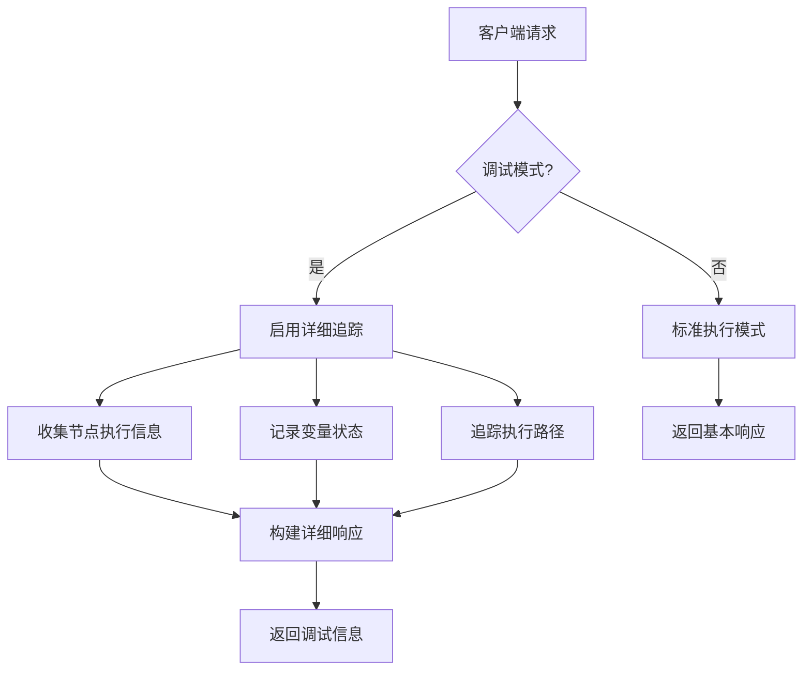
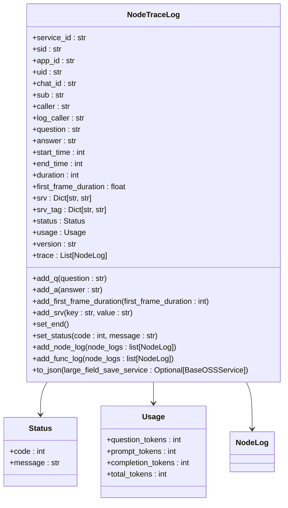
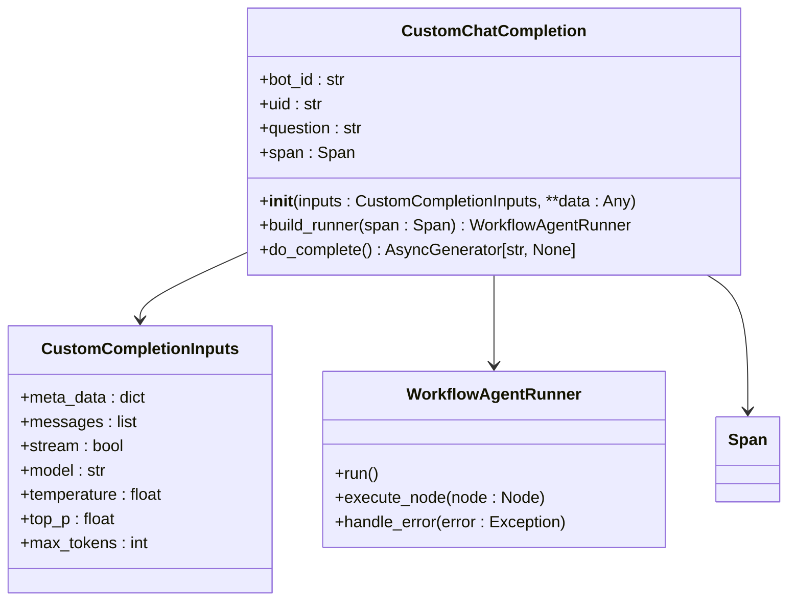
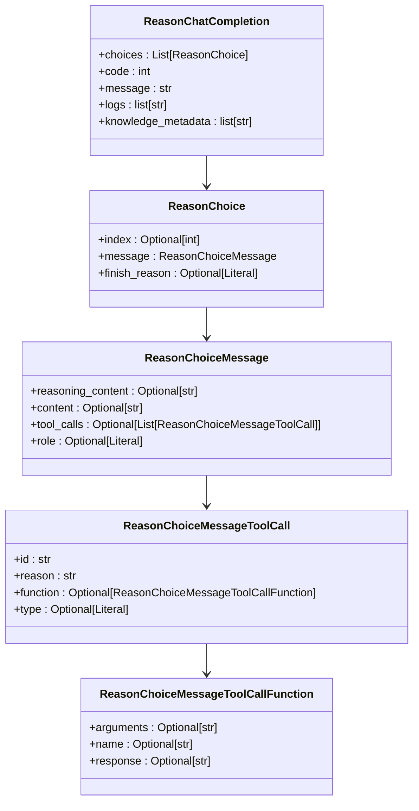
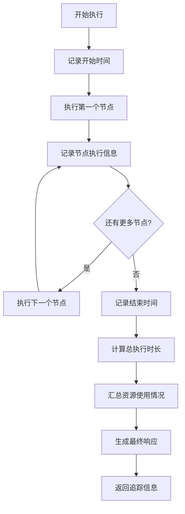
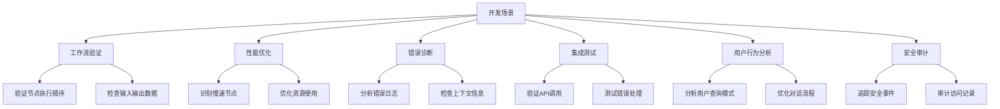

# 调试接口

<cite>
**本文档中引用的文件**
- [node_trace_patch.py](file://core/agent/api/schemas/node_trace_patch.py)
- [node_trace_log.py](file://core/common/otlp/log_trace/node_trace_log.py)
- [workflow_agent.py](file://core/agent/api/v1/workflow_agent.py)
- [completion.py](file://core/agent/api/schemas/completion.py)
- [use-node-debugger.ts](file://console/frontend/src/components/workflow/types/nodes/components.ts)
- [debugger-table.tsx](file://console/frontend/src/components/plugin-store/debugger-table.tsx)
- [trace.py](file://workflow/extensions/otlp/trace/trace.py)
</cite>

## 目录
1. [介绍](#介绍)
2. [调试接口概述](#调试接口概述)
3. [调试模式下的行为差异](#调试模式下的行为差异)
4. [请求参数差异](#请求参数差异)
5. [响应结构分析](#响应结构分析)
6. [工作流执行追踪信息](#工作流执行追踪信息)
7. [示例响应数据](#示例响应数据)
8. [开发与故障排除使用场景](#开发与故障排除使用场景)
9. [客户端调用示例](#客户端调用示例)
10. [结论](#结论)

## 介绍
调试接口是Astron-Agent系统中的关键开发工具，为开发者提供了深入洞察工作流执行过程的能力。该接口在调试模式下运行，能够返回详细的节点执行信息、变量状态和执行路径，帮助开发者快速识别和解决工作流中的问题。通过这个接口，开发者可以获得比基础聊天接口更丰富的追踪信息，包括每个节点的输入、输出和执行状态。

**Section sources**
- [node_trace_patch.py](file://core/agent/api/schemas/node_trace_patch.py)
- [node_trace_log.py](file://core/common/otlp/log_trace/node_trace_log.py)

## 调试接口概述
调试接口是基于OpenTelemetry标准实现的分布式追踪系统，为工作流执行提供了详细的调试信息。该接口通过`/agent/v1/custom/chat/completions`端点暴露，允许开发者在调试模式下执行工作流并获取详细的执行追踪数据。

接口的核心功能是收集和返回工作流执行过程中的详细信息，包括节点执行时间、输入输出数据、状态变化和错误信息。这些信息对于开发和故障排除至关重要，可以帮助开发者理解工作流的实际执行情况，识别性能瓶颈，并快速定位问题根源。

调试接口与基础聊天接口的主要区别在于其返回信息的详细程度。在调试模式下，系统会启用详细的日志记录和追踪功能，捕获每个节点的执行细节，而基础模式则只返回最终结果。



**Diagram sources**
- [workflow_agent.py](file://core/agent/api/v1/workflow_agent.py)
- [node_trace_log.py](file://core/common/otlp/log_trace/node_trace_log.py)

**Section sources**
- [workflow_agent.py](file://core/agent/api/v1/workflow_agent.py)
- [trace.py](file://workflow/extensions/otlp/trace/trace.py)

## 调试模式下的行为差异
在调试模式下，系统的行为与正常模式有显著差异，主要体现在日志记录、性能监控和错误处理等方面。

首先，在日志记录方面，调试模式会启用详细的节点级日志记录。系统会为每个执行的节点创建`NodeTraceLog`对象，记录节点的开始时间、结束时间、执行时长和状态信息。这些日志信息通过`node_trace_patch.py`中的`NodeTracePatch`类进行管理，该类扩展了`NodeTraceLog`并提供了记录开始和结束时间的方法。

其次，在性能监控方面，调试模式会收集更详细的性能指标。系统会记录每个节点的执行时间，包括首次响应时间(`first_frame_duration`)，并计算总执行时长。这些信息对于识别性能瓶颈和优化工作流至关重要。

在错误处理方面，调试模式提供了更详细的错误信息。当节点执行失败时，系统不仅会记录错误代码和消息，还会保存相关的上下文信息，如输入参数、环境变量和调用堆栈，帮助开发者快速定位问题根源。



**Diagram sources**
- [node_trace_log.py](file://core/common/otlp/log_trace/node_trace_log.py)
- [base.py](file://core/common/otlp/log_trace/base.py)

**Section sources**
- [node_trace_log.py](file://core/common/otlp/log_trace/node_trace_log.py)
- [node_trace_patch.py](file://core/agent/api/schemas/node_trace_patch.py)

## 请求参数差异
调试接口的请求参数与基础聊天接口相比，包含了额外的调试相关字段，这些字段用于控制调试行为和收集调试信息。

主要的请求参数定义在`CustomCompletionInputs`类中，该类继承自基础输入类并添加了调试相关的属性。与基础接口相比，调试接口的请求参数主要增加了以下特性：

1. **元数据字段**：包含`caller`字段，用于标识调用者，这在分布式系统中对于追踪请求来源非常重要。

2. **追踪上下文**：通过`Span`对象传递分布式追踪上下文，允许跨服务的请求追踪。

3. **调试标志**：虽然在代码中没有显式定义，但系统通过环境变量和配置来控制调试模式的启用。

4. **详细的输入验证**：在调试模式下，系统会对输入参数进行更严格的验证，并返回详细的验证错误信息。

请求参数的结构设计遵循OpenAPI规范，使用Pydantic模型进行类型验证和文档生成。这种设计确保了接口的类型安全性和文档的准确性。



**Diagram sources**
- [workflow_agent.py](file://core/agent/api/v1/workflow_agent.py)
- [completion.py](file://core/agent/api/schemas/completion.py)

**Section sources**
- [workflow_agent.py](file://core/agent/api/v1/workflow_agent.py)
- [completion.py](file://core/agent/api/schemas/completion.py)

## 响应结构分析
调试接口的响应结构比基础聊天接口更加丰富和详细，包含了完整的执行追踪信息。响应的主要组成部分包括：

1. **基本响应信息**：与基础接口相同的响应结构，包含`choices`、`code`、`message`等字段。

2. **执行日志**：通过`logs`字段返回详细的执行日志，记录了工作流执行过程中的关键事件。

3. **知识库元数据**：通过`knowledge_metadata`字段返回与知识库查询相关的信息。

4. **详细的节点追踪**：在`NodeTraceLog`对象中包含每个节点的详细执行信息。

响应结构的设计遵循ReasonChatCompletion模型，该模型扩展了标准的ChatCompletion模型，添加了调试所需的各种字段。这种设计既保持了与标准API的兼容性，又提供了额外的调试信息。



**Diagram sources**
- [completion.py](file://core/agent/api/schemas/completion.py)

**Section sources**
- [completion.py](file://core/agent/api/schemas/completion.py)

## 工作流执行追踪信息
工作流执行追踪信息是调试接口的核心功能，提供了工作流执行过程的完整视图。这些信息通过`NodeTraceLog`类进行组织和管理，包含了执行过程中的各种关键数据。

追踪信息的主要组成部分包括：

1. **执行时间信息**：包括`start_time`、`end_time`和`duration`，用于分析性能和识别瓶颈。

2. **资源使用信息**：通过`usage`对象记录token使用情况，包括`question_tokens`、`prompt_tokens`、`completion_tokens`和`total_tokens`。

3. **状态信息**：通过`status`对象记录执行状态，包括`code`和`message`。

4. **节点执行信息**：通过`trace`列表记录每个节点的执行日志，形成完整的执行路径。

5. **服务上下文信息**：通过`srv`和`srv_tag`字典记录服务相关的上下文信息。

这些追踪信息对于开发和故障排除至关重要。开发者可以通过分析这些信息来理解工作流的实际执行情况，识别性能瓶颈，验证业务逻辑的正确性，并快速定位和解决错误。



**Diagram sources**
- [node_trace_log.py](file://core/common/otlp/log_trace/node_trace_log.py)
- [base.py](file://core/common/otlp/log_trace/base.py)

**Section sources**
- [node_trace_log.py](file://core/common/otlp/log_trace/node_trace_log.py)

## 示例响应数据
以下是一个典型的调试接口响应示例，展示了调试信息的结构和格式：

```json
{
  "choices": [
    {
      "index": 0,
      "message": {
        "reasoning_content": "根据用户查询分析，需要调用天气查询插件获取当前天气信息。",
        "content": "今天北京天气晴朗，气温25度。",
        "tool_calls": [
          {
            "id": "call_12345",
            "reason": "需要获取实时天气数据",
            "function": {
              "name": "get_weather",
              "arguments": "{\"location\": \"北京\"}",
              "response": "{\"temperature\": 25, \"condition\": \"晴\"}"
            },
            "type": "tool"
          }
        ],
        "role": "assistant"
      },
      "finish_reason": "stop"
    }
  ],
  "code": 0,
  "message": "success",
  "logs": [
    "开始执行工作流",
    "调用天气查询插件",
    "获取到天气数据",
    "生成最终响应"
  ],
  "knowledge_metadata": [
    "weather_api_call_duration: 234ms",
    "weather_api_response_code: 200"
  ]
}
```

这个示例展示了调试接口返回的完整信息，包括：
- **reasoning_content**：系统的思考过程，解释了为什么采取特定的行动
- **tool_calls**：调用的工具及其参数和响应
- **logs**：详细的执行日志
- **knowledge_metadata**：与知识库查询相关的元数据

这些信息对于理解系统行为和调试问题非常有价值。

**Section sources**
- [completion.py](file://core/agent/api/schemas/completion.py)

## 开发与故障排除使用场景
调试接口在开发和故障排除中有多种重要的使用场景：

1. **工作流验证**：在开发新的工作流时，使用调试接口可以验证工作流的逻辑是否正确，确保每个节点都按预期执行。

2. **性能优化**：通过分析执行时间信息，识别性能瓶颈，优化慢速节点或减少不必要的调用。

3. **错误诊断**：当工作流执行失败时，详细的错误日志和上下文信息可以帮助快速定位问题根源。

4. **集成测试**：在集成第三方服务或插件时，调试接口可以验证集成是否正确工作。

5. **用户行为分析**：通过分析用户查询和系统响应，优化对话流程和用户体验。

6. **安全审计**：详细的执行日志可以用于安全审计，追踪潜在的安全问题。

在实际使用中，开发者通常会结合前端的调试工具（如`use-node-debugger.ts`中的`UseNodeDebuggerReturn`接口）来可视化调试信息，使调试过程更加直观和高效。



**Diagram sources**
- [use-node-debugger.ts](file://console/frontend/src/components/workflow/types/nodes/components.ts)
- [debugger-table.tsx](file://console/frontend/src/components/plugin-store/debugger-table.tsx)

**Section sources**
- [use-node-debugger.ts](file://console/frontend/src/components/workflow/types/nodes/components.ts)

## 客户端调用示例
以下是调试接口的客户端调用示例，展示了如何从不同编程语言中调用该接口：

### Python示例
```python
import requests
import json

url = "http://localhost:8000/agent/v1/custom/chat/completions"
headers = {
    "Content-Type": "application/json",
    "X-Consumer-Username": "test_app"
}

data = {
    "inputs": {
        "meta_data": {
            "caller": "debug_client"
        },
        "messages": [
            {
                "role": "user",
                "content": "今天北京天气怎么样？"
            }
        ],
        "stream": False
    }
}

response = requests.post(url, headers=headers, json=data)
if response.status_code == 200:
    result = response.json()
    print(json.dumps(result, indent=2, ensure_ascii=False))
else:
    print(f"Error: {response.status_code} - {response.text}")
```

### JavaScript示例
```javascript
async function callDebugEndpoint() {
    const url = 'http://localhost:8000/agent/v1/custom/chat/completions';
    const response = await fetch(url, {
        method: 'POST',
        headers: {
            'Content-Type': 'application/json',
            'X-Consumer-Username': 'test_app'
        },
        body: JSON.stringify({
            inputs: {
                meta_data: {
                    caller: 'debug_client'
                },
                messages: [
                    {
                        role: 'user',
                        content: '今天北京天气怎么样？'
                    }
                ],
                stream: false
            }
        })
    });
    
    if (response.ok) {
        const data = await response.json();
        console.log(JSON.stringify(data, null, 2));
    } else {
        console.error(`Error: ${response.status} - ${await response.text()}`);
    }
}

callDebugEndpoint();
```

这些示例展示了如何构造请求并处理响应。在实际使用中，开发者可以根据需要添加更多的调试参数和错误处理逻辑。

**Section sources**
- [workflow_agent.py](file://core/agent/api/v1/workflow_agent.py)

## 结论
调试接口是Astron-Agent系统中不可或缺的开发工具，为开发者提供了深入洞察工作流执行过程的能力。通过详细的节点执行信息、变量状态和执行路径追踪，开发者可以快速识别和解决工作流中的问题，优化性能，并确保系统的稳定性和可靠性。

该接口的设计充分考虑了开发和故障排除的需求，提供了丰富的调试信息，同时保持了与标准API的兼容性。通过合理使用调试接口，开发者可以显著提高开发效率，缩短问题解决时间，并提升系统的整体质量。

在未来的发展中，建议进一步增强调试接口的功能，如支持更高级的过滤和搜索功能，提供可视化分析工具，以及与其他监控系统的集成，为开发者提供更加全面和高效的调试体验。