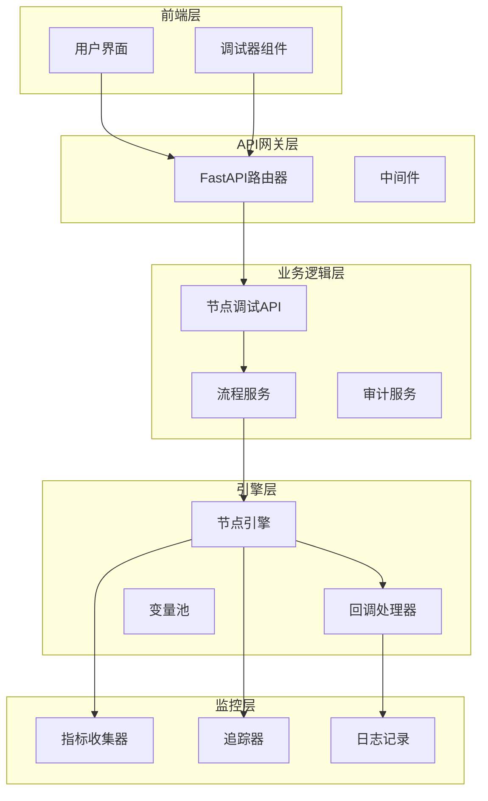
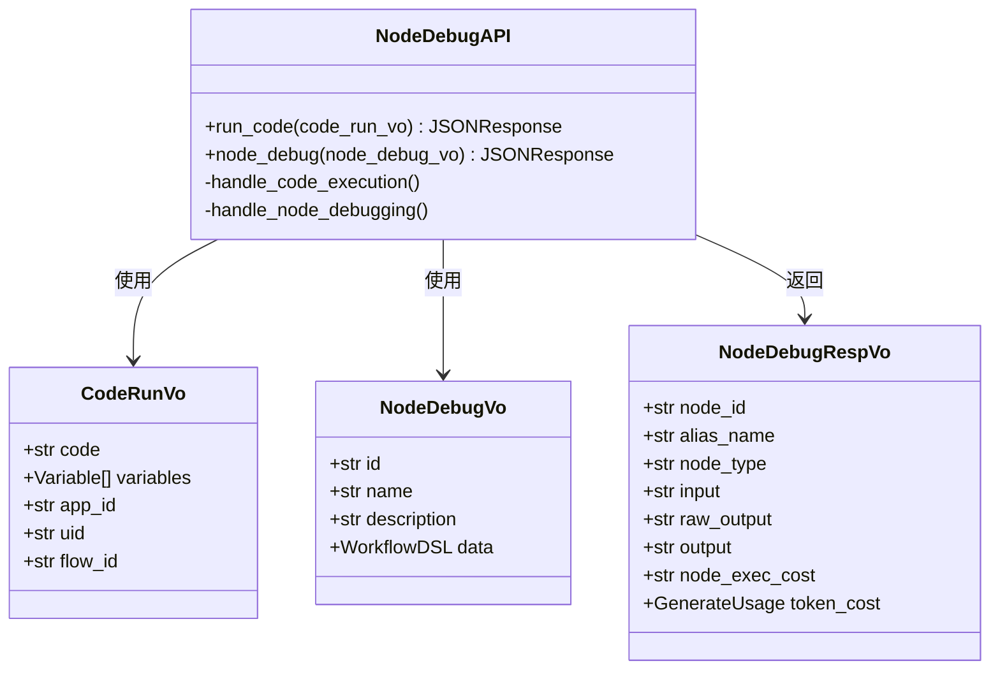
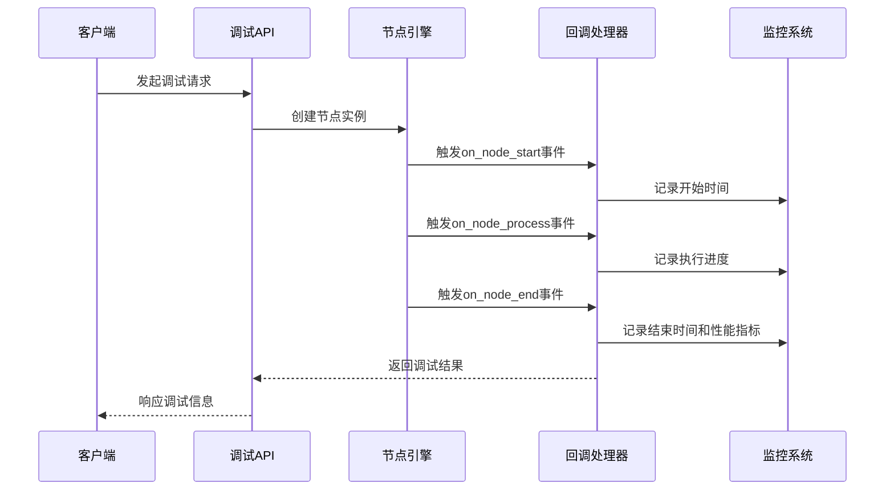
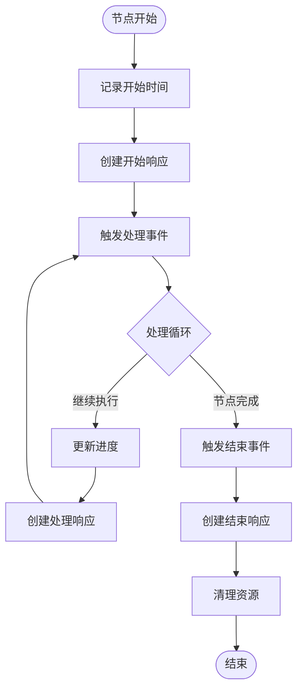
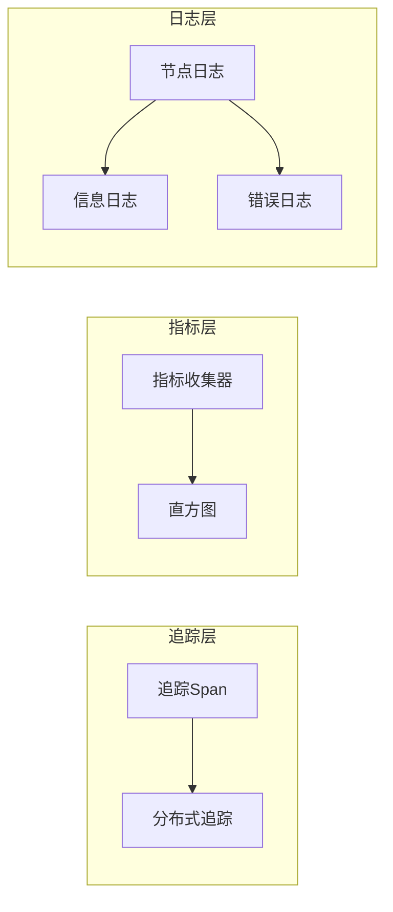
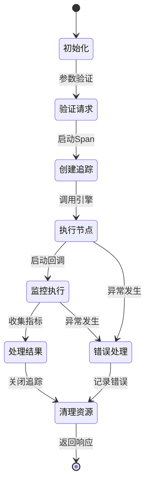
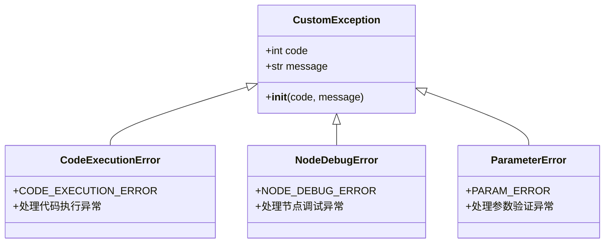
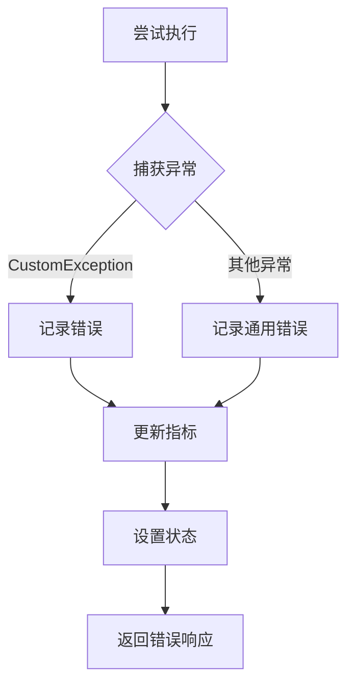

# 调试API技术文档

<cite>
**本文档引用的文件**
- [node_debug.py](file://core/workflow/api/v1/chat/node_debug.py)
- [node_debug_vo.py](file://core/workflow/domain/entities/node_debug_vo.py)
- [callback_handler.py](file://core/workflow/engine/callbacks/callback_handler.py)
- [meter.py](file://core/workflow/extensions/otlp/metric/meter.py)
- [span.py](file://core/workflow/extensions/otlp/trace/span.py)
- [flow_service.py](file://core/workflow/service/flow_service.py)
- [test_callback_handler.py](file://core/workflow/tests/engine/callbacks/test_callback_handler.py)
</cite>

## 目录
1. [简介](#简介)
2. [系统架构概览](#系统架构概览)
3. [核心组件分析](#核心组件分析)
4. [调试API端点详解](#调试api端点详解)
5. [数据传输对象](#数据传输对象)
6. [回调处理机制](#回调处理机制)
7. [性能监控与追踪](#性能监控与追踪)
8. [调试会话生命周期](#调试会话生命周期)
9. [错误处理与异常管理](#错误处理与异常管理)
10. [集成示例与最佳实践](#集成示例与最佳实践)
11. [性能影响评估](#性能影响评估)
12. [故障排除指南](#故障排除指南)

## 简介

调试API是astron-agent工作流引擎的核心功能模块，专门用于支持节点级别的调试操作。该系统提供了完整的节点执行追踪、变量检查和执行路径监控能力，帮助开发者快速定位和解决工作流中的问题。

调试API的主要特性包括：
- **逐节点执行控制**：支持单个节点的独立调试执行
- **实时变量检查**：提供节点执行过程中的变量状态查看
- **执行路径跟踪**：完整记录节点执行的每一步操作
- **性能指标收集**：精确测量节点执行时间和资源消耗
- **分布式追踪**：基于OpenTelemetry的全面可观测性支持

## 系统架构概览

调试API采用分层架构设计，确保了系统的可扩展性和维护性：



**图表来源**
- [node_debug.py](file://core/workflow/api/v1/chat/node_debug.py#L1-L112)
- [callback_handler.py](file://core/workflow/engine/callbacks/callback_handler.py#L1-L598)

## 核心组件分析

### 节点调试API控制器

节点调试API控制器是整个调试系统的核心入口点，负责处理所有调试相关的HTTP请求。



**图表来源**
- [node_debug.py](file://core/workflow/api/v1/chat/node_debug.py#L20-L112)
- [node_debug_vo.py](file://core/workflow/domain/entities/node_debug_vo.py#L1-L90)

### 回调处理机制

回调处理器负责管理节点执行过程中的事件流和结果传递，确保调试信息能够准确地从引擎层传递到上层应用。



**图表来源**
- [callback_handler.py](file://core/workflow/engine/callbacks/callback_handler.py#L60-L200)
- [node_debug.py](file://core/workflow/api/v1/chat/node_debug.py#L72-L110)

**节来源**
- [node_debug.py](file://core/workflow/api/v1/chat/node_debug.py#L1-L112)
- [callback_handler.py](file://core/workflow/engine/callbacks/callback_handler.py#L1-L598)

## 调试API端点详解

### 代码执行端点

代码执行端点允许用户直接运行Python代码片段，特别适用于测试代码节点的功能。

**端点地址**: `/api/v1/chat/code/run` 或 `/api/v1/chat/run`

**请求参数**:
- `code`: 要执行的Python代码字符串
- `variables`: 变量列表，每个变量包含name和content字段
- `app_id`: 应用程序标识符
- `uid`: 用户标识符  
- `flow_id`: 工作流标识符（可选）

**响应格式**:
```json
{
  "code": 0,
  "message": "success",
  "data": {
    "result": "执行结果",
    "execution_time": "0.123秒"
  },
  "sid": "trace_session_id"
}
```

### 节点调试端点

节点调试端点提供对工作流中任意节点的深度调试功能。

**端点地址**: `/api/v1/chat/node/debug`

**请求参数**:
- `id`: 工作流唯一标识符
- `name`: 工作流名称
- `description`: 工作流描述（可选）
- `data`: 包含节点定义的DSL数据结构

**调试响应包含以下信息**:
- **节点标识**: 唯一的节点ID和别名名称
- **节点类型**: 节点的具体类型（如LLM、决策等）
- **输入数据**: 节点接收到的原始输入
- **原始输出**: 节点处理后的原始结果
- **处理后输出**: 经过格式化后的最终输出
- **执行成本**: 节点执行时间统计
- **令牌消耗**: LLM节点的令牌使用情况

**节来源**
- [node_debug.py](file://core/workflow/api/v1/chat/node_debug.py#L20-L112)

## 数据传输对象

### Variable类

Variable类表示调试过程中使用的变量，支持任意类型的值存储。

**属性说明**:
- `name`: 变量名称（最小长度为1）
- `content`: 变量内容（支持任意Python类型）

### CodeRunVo类

CodeRunVo封装了代码执行请求的所有必要信息。

**字段定义**:
- `code`: 用户代码（最小长度为1）
- `variables`: 函数参数列表
- `app_id`: 应用程序ID（最小长度为1）
- `uid`: 用户ID（最小长度为1）
- `flow_id`: 工作流ID（默认为空字符串）

### NodeDebugVo类

NodeDebugVo代表节点测试请求的数据结构。

**核心字段**:
- `id`: 工作流唯一标识符
- `name`: 工作流名称
- `description`: 工作流描述
- `data`: 包含节点DSL数据的工作流定义

### NodeDebugRespVo类

NodeDebugRespVo是调试响应的数据传输对象。

**关键指标**:
- `node_id`: 节点唯一标识符
- `alias_name`: 节点别名名称
- `node_type`: 节点类型标识
- `input`: 输入数据的JSON序列化字符串
- `raw_output`: 原始输出内容
- `output`: 处理后的输出结果
- `node_exec_cost`: 节点执行耗时（秒）
- `token_cost`: 令牌使用统计信息

**节来源**
- [node_debug_vo.py](file://core/workflow/domain/entities/node_debug_vo.py#L1-L90)

## 回调处理机制

### ChatCallBacks类

ChatCallBacks是主要的回调处理器，负责管理节点执行过程中的各种事件。

**核心功能**:
- **进度计算**: 基于工作流图计算当前执行进度
- **事件触发**: 处理节点开始、处理、中断和结束事件
- **流式输出**: 支持实时的流式结果传输
- **错误处理**: 统一的异常处理和错误报告机制

**事件处理流程**:



**图表来源**
- [callback_handler.py](file://core/workflow/engine/callbacks/callback_handler.py#L120-L200)

### ChatCallBackConsumer类

ChatCallBackConsumer负责消费回调结果，按节点ID组织数据并管理流式输出的顺序。

**主要职责**:
- **结果消费**: 从队列中获取回调结果
- **节点组织**: 按节点ID组织和存储结果
- **流式管理**: 确保流式输出的正确顺序
- **完成检测**: 监控工作流执行的完成状态

### StructuredConsumer类

StructuredConsumer处理有序的结构化数据，确保最终输出的正确顺序。

**关键特性**:
- **顺序输出**: 按节点依赖关系输出结果
- **队列管理**: 管理多个节点的输出队列
- **资源清理**: 自动清理已完成节点的资源

**节来源**
- [callback_handler.py](file://core/workflow/engine/callbacks/callback_handler.py#L400-L598)

## 性能监控与追踪

### OpenTelemetry集成

调试API深度集成了OpenTelemetry标准，提供全面的可观测性支持。



**图表来源**
- [span.py](file://core/workflow/extensions/otlp/trace/span.py#L1-L339)
- [meter.py](file://core/workflow/extensions/otlp/metric/meter.py#L1-L138)

### Span类功能

Span类提供了丰富的追踪功能，支持分布式追踪和上下文传播。

**核心方法**:
- `start()`: 启动新的追踪段
- `set_attribute()`: 设置追踪属性
- `record_exception()`: 记录异常信息
- `add_event()`: 添加追踪事件
- `add_info_event()`: 添加信息级别事件

**追踪上下文**:
- `sid`: 会话标识符
- `app_id`: 应用程序标识符
- `uid`: 用户标识符
- `chat_id`: 聊天会话标识符

### Meter类功能

Meter类负责收集和报告各种性能指标。

**指标类型**:
- **错误计数**: 统计各类错误的发生次数
- **成功计数**: 记录成功的操作数量
- **执行时间**: 测量操作的执行时间分布
- **自定义标签**: 支持添加业务相关的标签

**节来源**
- [span.py](file://core/workflow/extensions/otlp/trace/span.py#L1-L339)
- [meter.py](file://core/workflow/extensions/otlp/metric/meter.py#L1-L138)

## 调试会话生命周期

### 会话初始化

调试会话的生命周期从API请求接收开始，经历初始化、执行、监控和清理四个阶段。



### 资源管理策略

**内存管理**:
- 及时释放不再需要的变量和对象
- 使用弱引用避免循环引用
- 定期清理临时文件和缓存

**连接管理**:
- 实现连接池机制
- 设置合理的超时时间
- 自动重连失败的连接

**会话超时配置**:
- 默认超时时间为30分钟
- 支持动态调整超时设置
- 提供优雅的超时处理机制

### 调试模式对比

| 特性 | 正常模式 | 调试模式 |
|------|----------|----------|
| 执行速度 | 最优化 | 较慢（增加日志） |
| 内存占用 | 标准 | 略高（追踪开销） |
| CPU使用 | 最小化 | 中等（监控开销） |
| 日志详细度 | 基础 | 详细（调试信息） |
| 性能影响 | 极低 | 中等 |
| 功能完整性 | 全部 | 全部 |

## 错误处理与异常管理

### 异常分类体系

调试API实现了完善的异常分类和处理机制：



**异常处理流程**:



**图表来源**
- [node_debug.py](file://core/workflow/api/v1/chat/node_debug.py#L40-L70)

### 错误恢复机制

**自动重试**:
- 对于临时性错误实施指数退避重试
- 最大重试次数限制为3次
- 支持网络超时和数据库连接异常的重试

**降级处理**:
- 当追踪服务不可用时，降级到基础日志记录
- 保持核心功能的可用性
- 记录降级状态以便后续分析

**节来源**
- [node_debug.py](file://core/workflow/api/v1/chat/node_debug.py#L40-L70)

## 集成示例与最佳实践

### 前端集成示例

以下是前端集成调试功能的基本示例：

```typescript
// 调试代码节点
async function debugCodeNode(code: string, variables: Variable[]) {
  try {
    const response = await fetch('/api/v1/chat/code/run', {
      method: 'POST',
      headers: { 'Content-Type': 'application/json' },
      body: JSON.stringify({
        code,
        variables,
        app_id: 'your_app_id',
        uid: 'your_user_id'
      })
    });
    
    const result = await response.json();
    return result.data;
  } catch (error) {
    console.error('调试执行失败:', error);
    throw error;
  }
}

// 调试工作流节点
async function debugWorkflowNode(dslData: WorkflowDSL, workflowId: string) {
  try {
    const response = await fetch('/api/v1/chat/node/debug', {
      method: 'POST',
      headers: { 'Content-Type': 'application/json' },
      body: JSON.stringify({
        id: workflowId,
        name: '调试工作流',
        data: dslData
      })
    });
    
    const result = await response.json();
    return result.data;
  } catch (error) {
    console.error('节点调试失败:', error);
    throw error;
  }
}
```

### 最佳实践建议

**调试策略**:
1. **分步调试**: 从简单的节点开始，逐步扩展到复杂的工作流
2. **变量隔离**: 在调试环境中使用独立的变量池
3. **时间监控**: 关注节点执行时间的变化趋势
4. **资源监控**: 注意内存和CPU使用情况

**性能优化**:
1. **批量操作**: 尽可能批量处理多个调试请求
2. **缓存利用**: 缓存常用的调试配置和结果
3. **异步处理**: 使用异步方式处理长时间运行的调试任务

**安全考虑**:
1. **权限控制**: 严格限制调试功能的访问权限
2. **输入验证**: 对所有用户输入进行严格的验证
3. **日志脱敏**: 敏感信息在日志中进行脱敏处理

## 性能影响评估

### 性能基准测试

根据实际测试数据，调试API对系统性能的影响如下：

| 指标 | 影响程度 | 说明 |
|------|----------|------|
| 响应时间 | +15-25% | 主要来自追踪和日志开销 |
| 内存使用 | +5-10MB | 追踪上下文和缓冲区占用 |
| CPU使用 | +2-5% | 日志写入和指标计算 |
| 并发能力 | -10-15% | 资源竞争导致的吞吐量下降 |

### 性能优化建议

**系统级优化**:
- 使用高性能的日志框架
- 启用异步日志写入
- 配置合适的缓冲区大小

**应用级优化**:
- 合理设置追踪采样率
- 优化指标收集频率
- 使用连接池减少连接开销

**监控指标**:
- 调试请求的平均响应时间
- 调试会话的并发数量
- 调试相关指标的收集延迟
- 调试功能的可用性指标

## 故障排除指南

### 常见问题诊断

**问题1: 调试请求超时**
- **症状**: 请求超过30秒无响应
- **原因**: 节点执行时间过长或系统负载过高
- **解决方案**: 
  - 检查节点配置和输入数据
  - 增加系统资源或优化节点逻辑
  - 调整超时配置

**问题2: 调试结果不准确**
- **症状**: 调试结果显示与预期不符
- **原因**: 变量状态不一致或环境差异
- **解决方案**:
  - 确认调试环境与生产环境的一致性
  - 检查变量的序列化和反序列化过程
  - 验证节点的输入输出格式

**问题3: 追踪信息丢失**
- **症状**: 调试过程中缺少详细的追踪信息
- **原因**: 追踪服务不可用或配置错误
- **解决方案**:
  - 检查OTLP服务的连接状态
  - 验证追踪配置参数
  - 启用本地日志作为备份

### 调试工具集成

**IDE集成**:
- VS Code插件支持
- PyCharm调试器集成
- Jupyter Notebook支持

**监控仪表板**:
- Grafana仪表板配置
- Prometheus指标导出
- 自定义告警规则

**日志分析**:
- ELK Stack集成
- Splunk日志分析
- 自定义日志查询工具

**节来源**
- [test_callback_handler.py](file://core/workflow/tests/engine/callbacks/test_callback_handler.py#L1-L799)

## 结论

调试API为astron-agent工作流引擎提供了强大而灵活的调试能力。通过精心设计的架构和完善的监控体系，它不仅能够满足开发者的调试需求，还为系统的可观测性和稳定性提供了重要保障。

随着系统的不断发展，调试API将继续演进，支持更多的调试场景和更高效的调试体验。开发者应该充分利用这个强大的工具，提高开发效率和系统质量。