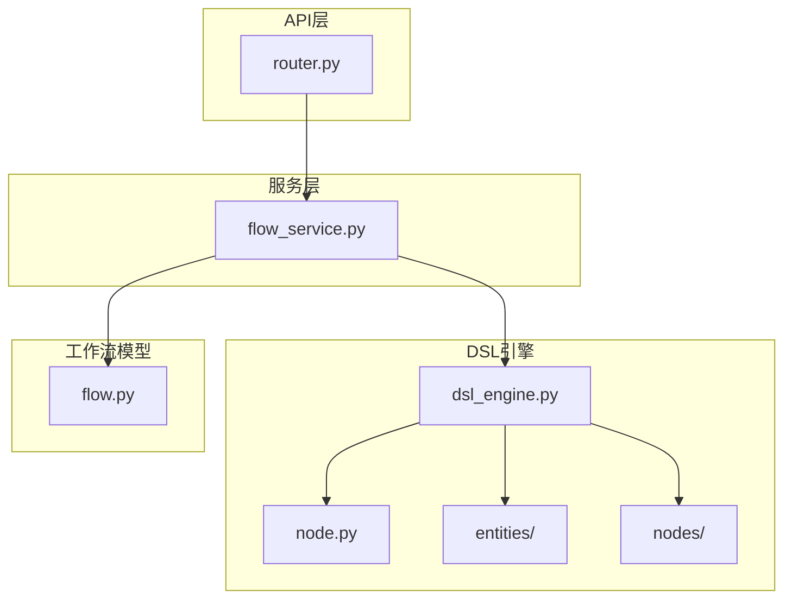
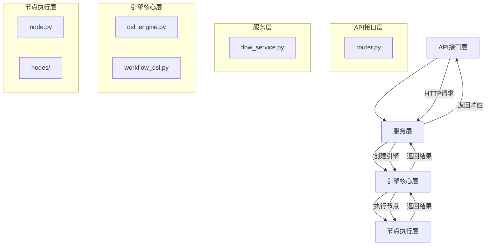
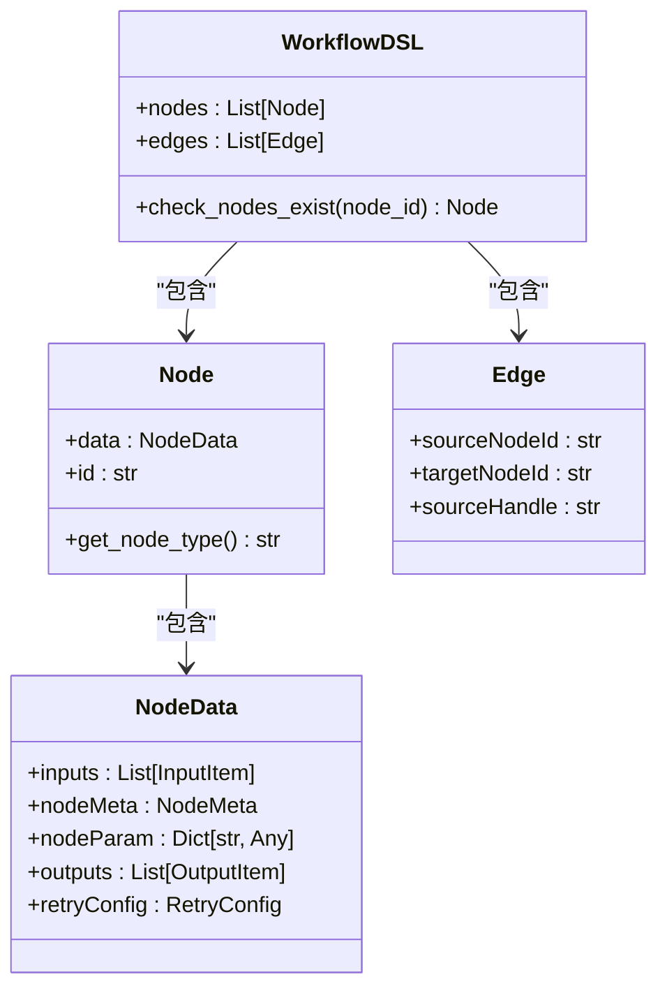
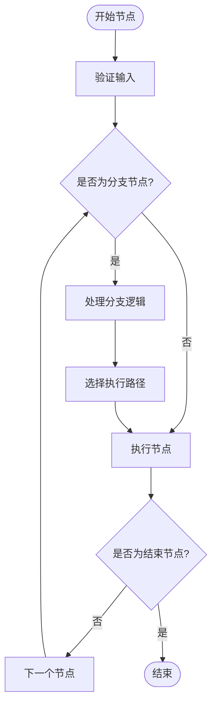
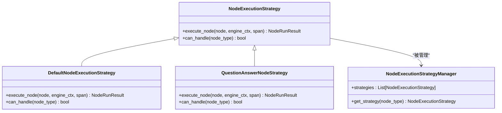
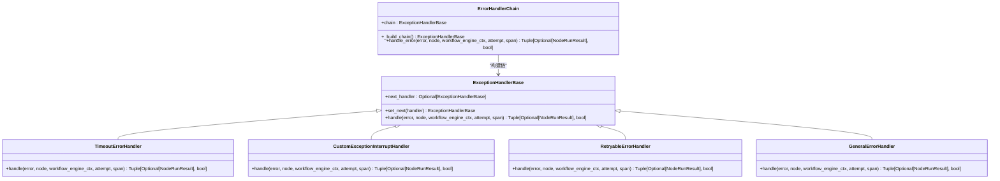
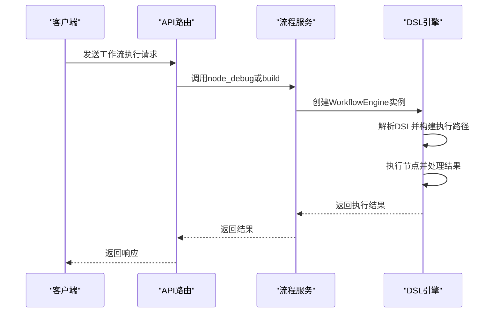
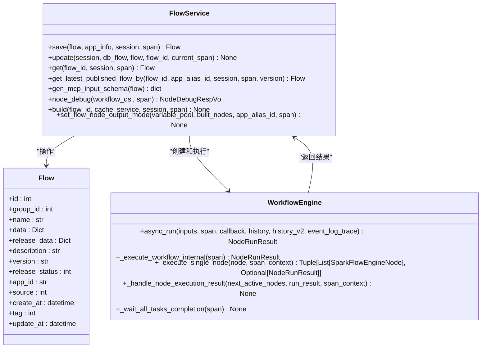
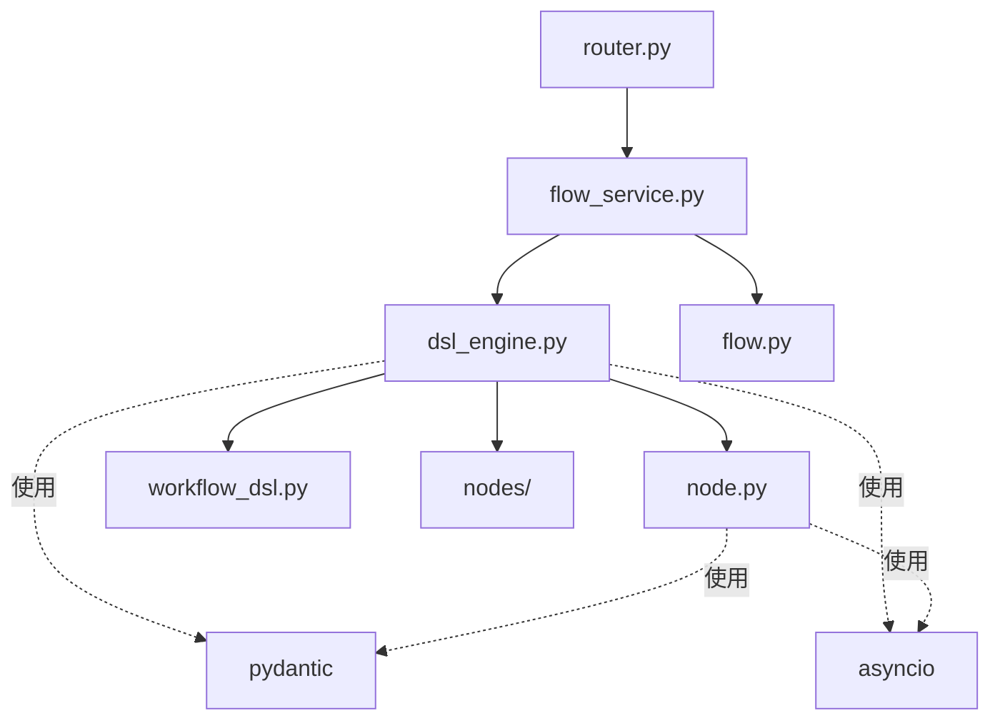

# DSL引擎

<cite>
**本文档引用的文件**  
- [dsl_engine.py](file://core/workflow/engine/dsl_engine.py)
- [workflow_dsl.py](file://core/workflow/engine/entities/workflow_dsl.py)
- [node.py](file://core/workflow/engine/node.py)
- [flow.py](file://core/workflow/domain/models/flow.py)
- [router.py](file://core/workflow/api/v1/router.py)
- [flow_service.py](file://core/workflow/service/flow_service.py)
</cite>

## 目录
1. [简介](#简介)
2. [项目结构](#项目结构)
3. [核心组件](#核心组件)
4. [架构概述](#架构概述)
5. [详细组件分析](#详细组件分析)
6. [依赖分析](#依赖分析)
7. [性能考虑](#性能考虑)
8. [故障排除指南](#故障排除指南)
9. [结论](#结论)

## 简介
DSL引擎是astron-agent项目的核心组件，负责将JSON格式的工作流定义转换为可执行的图结构。该引擎实现了完整的DSL解析、节点连接验证、执行路径构建等功能，支持循环、条件分支等复杂控制流的处理。引擎采用模块化设计，通过策略模式、模板方法模式和责任链模式等设计模式，实现了高内聚低耦合的架构。它与API层和工作流模型紧密集成，为整个系统提供可靠的工作流执行能力。

## 项目结构
DSL引擎位于`core/workflow/engine`目录下，主要由DSL解析、节点执行、错误处理等模块组成。引擎与工作流模型、API路由等组件协同工作，形成完整的工作流处理系统。

**图源**
- [dsl_engine.py](file://core/workflow/engine/dsl_engine.py)
- [node.py](file://core/workflow/engine/node.py)
- [flow.py](file://core/workflow/domain/models/flow.py)
- [router.py](file://core/workflow/api/v1/router.py)
- [flow_service.py](file://core/workflow/service/flow_service.py)

## 核心组件
DSL引擎的核心组件包括工作流引擎(WorkflowEngine)、节点工厂(NodeFactory)、执行策略管理器(NodeExecutionStrategyManager)和错误处理链(ErrorHandlerChain)。这些组件协同工作，将DSL定义的工作流转换为可执行的图结构，并处理执行过程中的各种情况。

**节源**
- [dsl_engine.py](file://core/workflow/engine/dsl_engine.py#L0-L2379)
- [node.py](file://core/workflow/engine/node.py#L0-L960)

## 架构概述
DSL引擎采用分层架构设计，从上到下分为API接口层、服务层、引擎核心层和节点执行层。这种分层设计使得各组件职责清晰，便于维护和扩展。

**图源**
- [dsl_engine.py](file://core/workflow/engine/dsl_engine.py#L0-L2379)
- [workflow_dsl.py](file://core/workflow/engine/entities/workflow_dsl.py#L0-L162)
- [node.py](file://core/workflow/engine/node.py#L0-L960)
- [flow_service.py](file://core/workflow/service/flow_service.py#L0-L427)
- [router.py](file://core/workflow/api/v1/router.py#L0-L42)

## 详细组件分析

### DSL解析与验证
DSL引擎首先解析JSON格式的工作流定义，将其转换为内部数据结构。引擎对DSL进行严格的验证，确保节点存在、连接有效、参数正确。

**图源**
- [workflow_dsl.py](file://core/workflow/engine/entities/workflow_dsl.py#L0-L162)

### 执行路径构建
引擎根据DSL定义的节点和边构建执行路径，使用深度优先搜索算法遍历工作流图。执行路径的构建考虑了条件分支、循环等复杂控制流。

**图源**
- [dsl_engine.py](file://core/workflow/engine/dsl_engine.py#L0-L2379)

### 节点执行策略
引擎采用策略模式处理不同类型的节点执行。每种节点类型都有对应的执行策略，确保执行逻辑的正确性和一致性。

**图源**
- [dsl_engine.py](file://core/workflow/engine/dsl_engine.py#L0-L2379)

### 错误处理机制
引擎采用责任链模式实现错误处理，不同类型的错误由不同的处理器处理，形成一个处理链。这种设计使得错误处理逻辑清晰且易于扩展。

**图源**
- [dsl_engine.py](file://core/workflow/engine/dsl_engine.py#L0-L2379)

### 与API层集成
DSL引擎通过服务层与API层集成，API层接收外部请求，服务层创建和管理引擎实例，执行工作流并返回结果。

**图源**
- [router.py](file://core/workflow/api/v1/router.py#L0-L42)
- [flow_service.py](file://core/workflow/service/flow_service.py#L0-L427)
- [dsl_engine.py](file://core/workflow/engine/dsl_engine.py#L0-L2379)

### 与工作流模型数据交互
DSL引擎与工作流模型通过服务层进行数据交互。工作流模型存储工作流的定义和元数据，引擎从模型中获取DSL定义并执行。

**图源**
- [flow.py](file://core/workflow/domain/models/flow.py#L0-L53)
- [flow_service.py](file://core/workflow/service/flow_service.py#L0-L427)
- [dsl_engine.py](file://core/workflow/engine/dsl_engine.py#L0-L2379)

## 依赖分析
DSL引擎依赖于多个核心组件，包括工作流模型、API路由、节点实现等。这些依赖关系通过服务层进行管理，确保了组件间的松耦合。

**图源**
- [dsl_engine.py](file://core/workflow/engine/dsl_engine.py#L0-L2379)
- [node.py](file://core/workflow/engine/node.py#L0-L960)
- [workflow_dsl.py](file://core/workflow/engine/entities/workflow_dsl.py#L0-L162)
- [flow_service.py](file://core/workflow/service/flow_service.py#L0-L427)
- [router.py](file://core/workflow/api/v1/router.py#L0-L42)
- [flow.py](file://core/workflow/domain/models/flow.py#L0-L53)

## 性能考虑
DSL引擎在设计时充分考虑了性能因素。引擎采用异步执行模型，支持并发处理多个工作流实例。通过缓存机制减少重复的DSL解析和引擎构建开销。深度优先搜索算法确保了执行路径的高效遍历。错误处理链的设计避免了异常情况下的性能瓶颈。

## 故障排除指南
当DSL引擎出现问题时，可以从以下几个方面进行排查：
1. 检查DSL定义是否符合规范，节点ID是否存在，连接是否有效
2. 查看日志中的错误信息，确定错误类型和发生位置
3. 检查节点参数配置是否正确，特别是输入输出的类型匹配
4. 验证工作流模型数据是否完整，版本是否正确
5. 确认API请求参数是否符合要求

**节源**
- [dsl_engine.py](file://core/workflow/engine/dsl_engine.py#L0-L2379)
- [flow_service.py](file://core/workflow/service/flow_service.py#L0-L427)

## 结论
DSL引擎是astron-agent项目的核心组件，它通过将JSON格式的工作流定义转换为可执行的图结构，实现了灵活、可靠的工作流执行能力。引擎采用先进的设计模式和架构，支持复杂的控制流和错误处理，与系统其他组件紧密集成，为整个平台提供了强大的工作流处理能力。通过持续优化和改进，DSL引擎将继续为项目的发展提供坚实的基础。