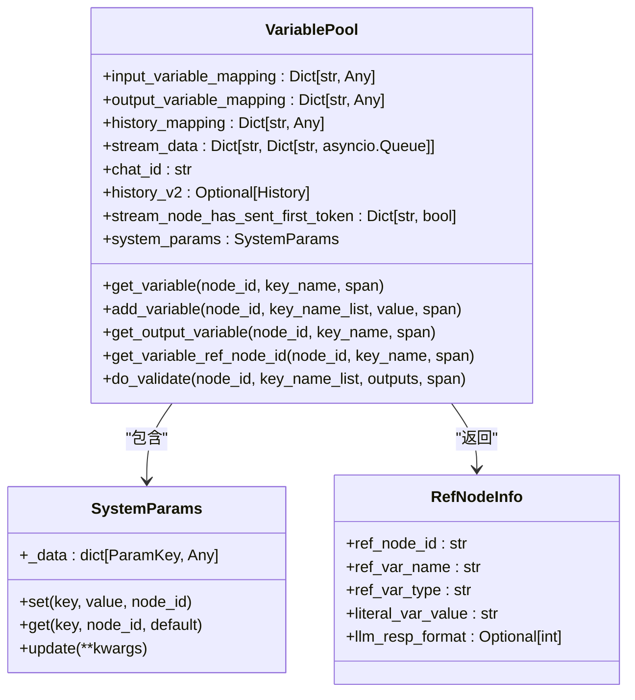
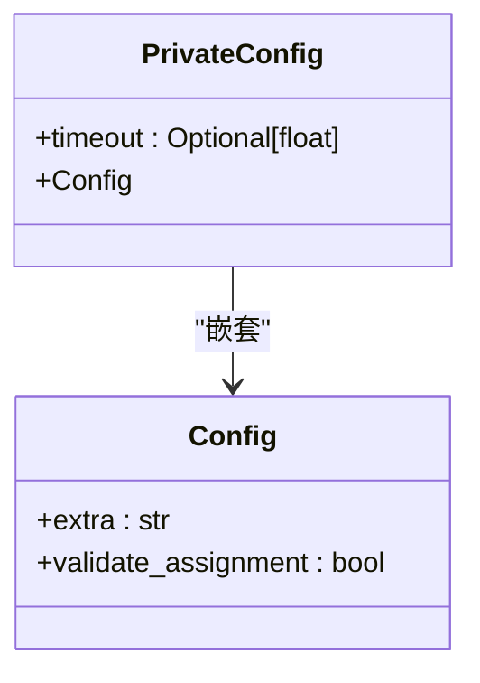
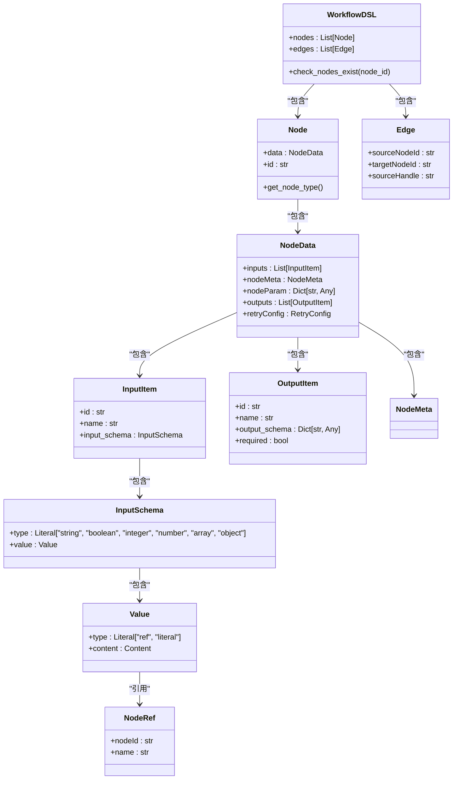
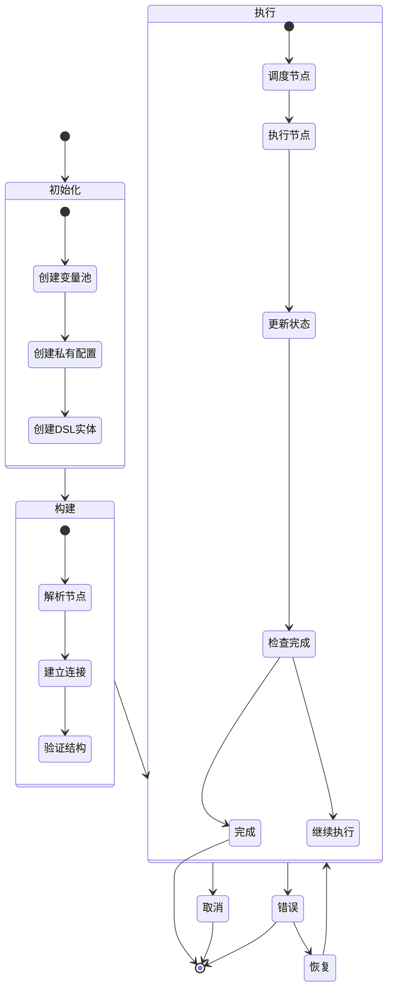
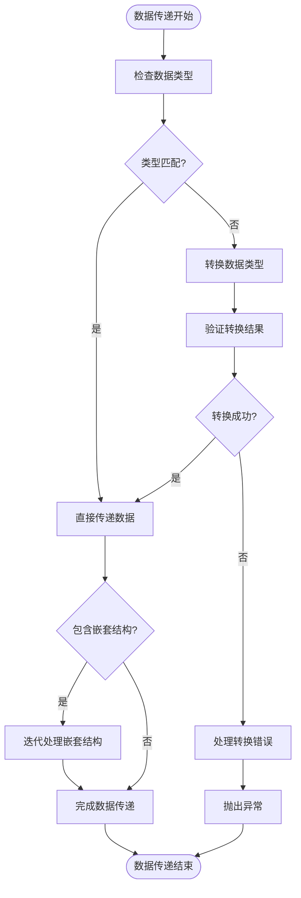
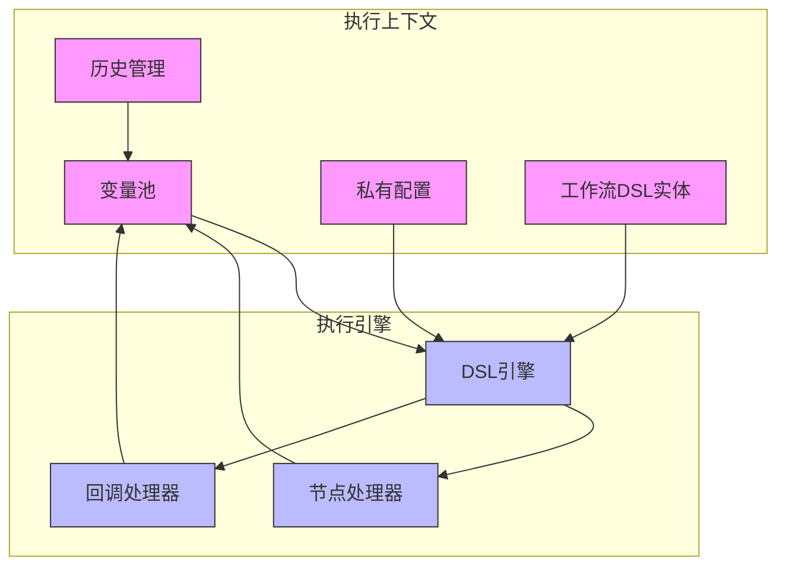

# 执行上下文

<cite>
**本文档引用的文件**   
- [variable_pool.py](file://core/workflow/engine/entities/variable_pool.py)
- [private_config.py](file://core/workflow/engine/entities/private_config.py)
- [workflow_dsl.py](file://core/workflow/engine/entities/workflow_dsl.py)
- [dsl_engine.py](file://core/workflow/engine/dsl_engine.py)
- [node.py](file://core/workflow/engine/node.py)
- [history.py](file://core/workflow/engine/entities/history.py)
</cite>

## 目录
1. [执行上下文概述](#执行上下文概述)
2. [变量池机制](#变量池机制)
3. [私有配置管理](#私有配置管理)
4. [工作流DSL实体](#工作流dsl实体)
5. [上下文生命周期与作用域](#上下文生命周期与作用域)
6. [数据传递与序列化](#数据传递与序列化)
7. [执行上下文架构](#执行上下文架构)
8. [实际应用示例](#实际应用示例)

## 执行上下文概述

执行上下文是工作流引擎的核心组件，负责在工作流执行期间管理状态和数据传递。它通过变量池、私有配置和工作流DSL实体三个主要组件协同工作，确保工作流节点间的数据流动和状态管理。执行上下文不仅支持全局变量、局部变量和上下文变量的管理，还提供了敏感信息保护和运行时配置管理功能。

执行上下文的设计遵循了策略模式和模板方法模式，通过`VariablePool`类管理变量，`PrivateConfig`类管理私有配置，`WorkflowDSL`类表示工作流的结构和状态。这些组件共同构成了一个完整的执行环境，支持复杂工作流的执行和管理。

**Section sources**
- [variable_pool.py](file://core/workflow/engine/entities/variable_pool.py#L0-L806)
- [private_config.py](file://core/workflow/engine/entities/private_config.py#L0-L11)
- [workflow_dsl.py](file://core/workflow/engine/entities/workflow_dsl.py#L0-L161)

## 变量池机制

变量池（VariablePool）是执行上下文的核心组件，负责管理工作流执行期间的所有变量。它通过输入变量映射和输出变量映射来实现节点间的数据传递，支持全局变量、局部变量和上下文变量的管理。

变量池的主要功能包括：
- **变量解析**：通过`get_variable`方法解析变量引用，支持字面量值和节点引用两种类型
- **变量存储**：通过`input_variable_mapping`和`output_variable_mapping`两个字典分别存储输入和输出变量
- **历史管理**：通过`history_mapping`和`history_v2`管理对话历史，支持不同格式的历史记录
- **流式处理**：通过`stream_data`和`stream_node_has_sent_first_token`支持流式节点的数据传递

变量池的实现采用了深拷贝机制，确保在工作流分支执行时每个分支都有独立的变量状态。同时，它还提供了变量验证功能，通过`do_validate`方法确保变量值符合预定义的模式。

**Diagram sources **
- [variable_pool.py](file://core/workflow/engine/entities/variable_pool.py#L0-L806)

**Section sources**
- [variable_pool.py](file://core/workflow/engine/entities/variable_pool.py#L0-L806)

## 私有配置管理

私有配置（PrivateConfig）是执行上下文的安全组件，负责管理敏感信息和运行时配置。它使用Pydantic模型来定义配置结构，确保配置的类型安全和数据验证。

私有配置的主要特点包括：
- **超时管理**：通过`timeout`字段设置操作超时时间，默认为2分钟
- **配置验证**：通过Pydantic的`Config`类设置额外验证规则，如禁止额外字段和验证赋值
- **敏感信息保护**：作为私有配置，不直接暴露给工作流节点，仅在必要时提供访问

私有配置的设计遵循了最小权限原则，只暴露必要的配置项，同时通过Pydantic的验证机制确保配置的正确性。这种设计既保证了配置的灵活性，又确保了系统的安全性。

**Diagram sources **
- [private_config.py](file://core/workflow/engine/entities/private_config.py#L0-L11)

**Section sources**
- [private_config.py](file://core/workflow/engine/entities/private_config.py#L0-L11)

## 工作流DSL实体

工作流DSL实体（WorkflowDSL）是执行上下文的结构组件，负责表示工作流的执行状态和进度。它使用Pydantic模型来定义工作流的节点、边和连接关系，为工作流引擎提供结构化的执行计划。

工作流DSL实体的主要组成部分包括：
- **节点（Node）**：表示工作流中的单个处理单元，包含节点ID、类型和配置
- **边（Edge）**：表示节点间的连接关系，定义数据流动的方向
- **输入/输出项**：定义节点的输入输出接口，包括名称、类型和模式
- **引用（NodeRef）**：支持节点间的引用关系，实现数据传递和依赖管理

工作流DSL实体的设计采用了领域特定语言（DSL）的思想，将工作流的结构和逻辑分离，使得工作流的定义更加清晰和可维护。同时，它还提供了节点存在性检查功能，确保工作流的完整性和正确性。

**Diagram sources **
- [workflow_dsl.py](file://core/workflow/engine/entities/workflow_dsl.py#L0-L161)

**Section sources**
- [workflow_dsl.py](file://core/workflow/engine/entities/workflow_dsl.py#L0-L161)

## 上下文生命周期与作用域

执行上下文的生命周期从工作流启动开始，到工作流完成或取消结束。在整个生命周期中，上下文管理着变量、配置和状态的创建、使用和销毁。

上下文的作用域规则如下：
- **全局作用域**：系统参数和全局配置在整个工作流执行期间有效
- **节点作用域**：节点的输入输出变量仅在该节点执行期间有效
- **流式作用域**：流式节点的数据在流式传输期间有效，通过队列进行管理
- **历史作用域**：对话历史在会话期间有效，支持不同格式的存储和检索

上下文的内存管理策略包括：
- **引用计数**：通过引用计数管理对象的生命周期，避免内存泄漏
- **缓存机制**：通过内置缓存减少重复计算，提高执行效率
- **异步清理**：在异步任务完成后自动清理相关资源，确保内存的有效利用

**Diagram sources **
- [variable_pool.py](file://core/workflow/engine/entities/variable_pool.py#L0-L806)
- [private_config.py](file://core/workflow/engine/entities/private_config.py#L0-L11)
- [workflow_dsl.py](file://core/workflow/engine/entities/workflow_dsl.py#L0-L161)

**Section sources**
- [variable_pool.py](file://core/workflow/engine/entities/variable_pool.py#L0-L806)
- [private_config.py](file://core/workflow/engine/entities/private_config.py#L0-L11)
- [workflow_dsl.py](file://core/workflow/engine/entities/workflow_dsl.py#L0-L161)

## 数据传递与序列化

执行上下文通过变量池实现节点间的数据传递，支持复杂数据结构的序列化和反序列化。数据传递机制包括：
- **直接传递**：通过变量引用直接传递数据，适用于简单数据类型
- **映射传递**：通过输入输出映射传递数据，支持嵌套结构的访问
- **流式传递**：通过异步队列传递流式数据，支持实时处理

复杂数据结构的序列化和反序列化通过以下机制实现：
- **类型映射**：通过`schema_type_map_python`字典实现模式类型到Python类型的映射
- **默认值**：通过`schema_type_default_value`字典提供各种类型的默认值
- **迭代处理**：通过`iteration_array`函数处理嵌套数组和对象结构

数据传递的安全性通过以下措施保障：
- **类型验证**：在数据传递前后进行类型验证，确保数据的正确性
- **边界检查**：对数组和对象的访问进行边界检查，防止越界访问
- **异常处理**：在数据传递过程中捕获和处理异常，确保系统的稳定性

**Diagram sources **
- [variable_pool.py](file://core/workflow/engine/entities/variable_pool.py#L0-L806)

**Section sources**
- [variable_pool.py](file://core/workflow/engine/entities/variable_pool.py#L0-L806)

## 执行上下文架构

执行上下文的架构由多个组件协同工作，形成一个完整的执行环境。主要组件包括变量池、私有配置、工作流DSL实体和执行引擎。

执行上下文的架构设计遵循了单一职责原则，每个组件只负责特定的功能。变量池负责数据管理，私有配置负责安全配置，工作流DSL实体负责结构定义，执行引擎负责流程控制。这种设计使得系统更加模块化，易于维护和扩展。

**Diagram sources **
- [variable_pool.py](file://core/workflow/engine/entities/variable_pool.py#L0-L806)
- [private_config.py](file://core/workflow/engine/entities/private_config.py#L0-L11)
- [workflow_dsl.py](file://core/workflow/engine/entities/workflow_dsl.py#L0-L161)
- [dsl_engine.py](file://core/workflow/engine/dsl_engine.py#L0-L2379)

**Section sources**
- [variable_pool.py](file://core/workflow/engine/entities/variable_pool.py#L0-L806)
- [private_config.py](file://core/workflow/engine/entities/private_config.py#L0-L11)
- [workflow_dsl.py](file://core/workflow/engine/entities/workflow_dsl.py#L0-L161)
- [dsl_engine.py](file://core/workflow/engine/dsl_engine.py#L0-L2379)

## 实际应用示例

在实际应用中，用户输入通过执行上下文在节点间流动，实现复杂的工作流处理。以下是一个典型的应用场景：

1. **用户输入处理**：用户输入通过开始节点进入工作流，被存储在变量池中
2. **数据传递**：输入数据通过变量引用在节点间传递，每个节点可以访问和修改数据
3. **条件判断**：决策节点根据输入数据的值决定执行路径
4. **数据处理**：处理节点对数据进行转换和计算，结果存储回变量池
5. **输出生成**：结束节点收集所有处理结果，生成最终输出

复杂数据结构的序列化和反序列化在以下场景中发挥作用：
- **对象传递**：当需要在节点间传递复杂对象时，通过序列化将其转换为JSON格式
- **数组处理**：当需要处理数组数据时，通过迭代机制逐个处理每个元素
- **嵌套结构**：当需要访问嵌套数据结构时，通过点号表示法进行路径导航

执行上下文的这些机制确保了工作流的灵活性和可靠性，支持各种复杂应用场景的实现。

**Section sources**
- [variable_pool.py](file://core/workflow/engine/entities/variable_pool.py#L0-L806)
- [workflow_dsl.py](file://core/workflow/engine/entities/workflow_dsl.py#L0-L161)
- [dsl_engine.py](file://core/workflow/engine/dsl_engine.py#L0-L2379)