# 核心引擎架构文档

<cite>
**本文档引用的文件**
- [dsl_engine.py](file://core/workflow/engine/dsl_engine.py)
- [node.py](file://core/workflow/engine/node.py)
- [main.py](file://core/workflow/main.py)
- [graceful_shutdown.py](file://core/workflow/extensions/graceful_shutdown/graceful_shutdown.py)
- [variable_pool.py](file://core/workflow/engine/entities/variable_pool.py)
- [callback_handler.py](file://core/workflow/engine/callbacks/callback_handler.py)
- [workflow_dsl.py](file://core/workflow/engine/entities/workflow_dsl.py)
- [node_entities.py](file://core/workflow/engine/entities/node_entities.py)
</cite>

## 目录
1. [概述](#概述)
2. [系统架构](#系统架构)
3. [DSL引擎设计](#dsl引擎设计)
4. [节点基类与执行生命周期](#节点基类与执行生命周期)
5. [应用启动流程](#应用启动流程)
6. [并发模型与异步执行](#并发模型与异步执行)
7. [错误处理与容错策略](#错误处理与容错策略)
8. [性能优化](#性能优化)
9. [优雅关闭机制](#优雅关闭机制)
10. [总结](#总结)

## 概述

Astron Agent的核心引擎是一个基于Python的分布式工作流执行系统，采用深度优先搜索算法和异步执行模型来处理复杂的业务流程。该引擎通过DSL（领域特定语言）定义工作流结构，支持多种节点类型和复杂的依赖关系管理。

### 核心特性

- **DSL驱动的工作流定义**：使用JSON格式的DSL描述工作流结构
- **深度优先搜索执行**：基于DFS算法的节点执行顺序控制
- **异步并发执行**：支持高并发的异步任务处理
- **智能错误处理**：多层次的错误处理和重试机制
- **流式输出支持**：支持实时流式结果输出
- **优雅关闭机制**：确保正在运行的工作流能够安全完成

## 系统架构

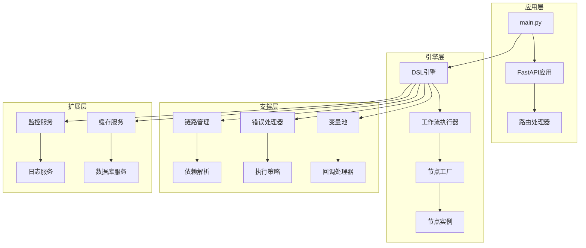

**图表来源**
- [main.py](file://core/workflow/main.py#L1-L168)
- [dsl_engine.py](file://core/workflow/engine/dsl_engine.py#L1-L2379)

**章节来源**
- [main.py](file://core/workflow/main.py#L1-L168)
- [dsl_engine.py](file://core/workflow/engine/dsl_engine.py#L1-L2379)

## DSL引擎设计

### 引擎核心架构

DSL引擎是整个工作流系统的核心，负责解析JSON格式的工作流定义，构建执行图，并调度节点执行。

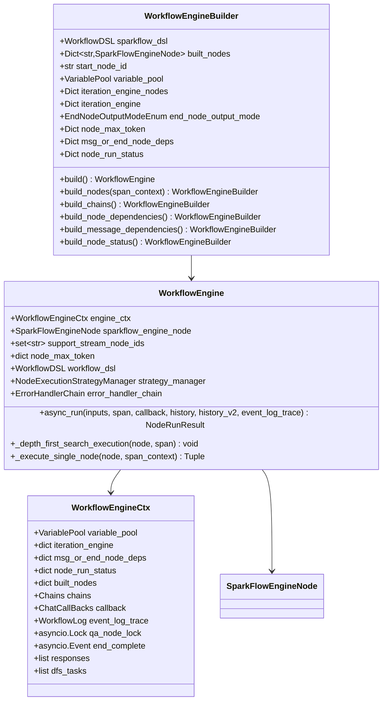

**图表来源**
- [dsl_engine.py](file://core/workflow/engine/dsl_engine.py#L50-L150)
- [dsl_engine.py](file://core/workflow/engine/dsl_engine.py#L2200-L2379)

### 工作流定义解析

DSL引擎通过以下步骤解析JSON格式的工作流定义：

1. **节点构建阶段**：将JSON节点定义转换为引擎节点实例
2. **链路构建阶段**：建立节点间的执行链路关系
3. **依赖解析阶段**：解析消息节点和结束节点的依赖关系
4. **状态初始化阶段**：初始化节点运行状态和变量池

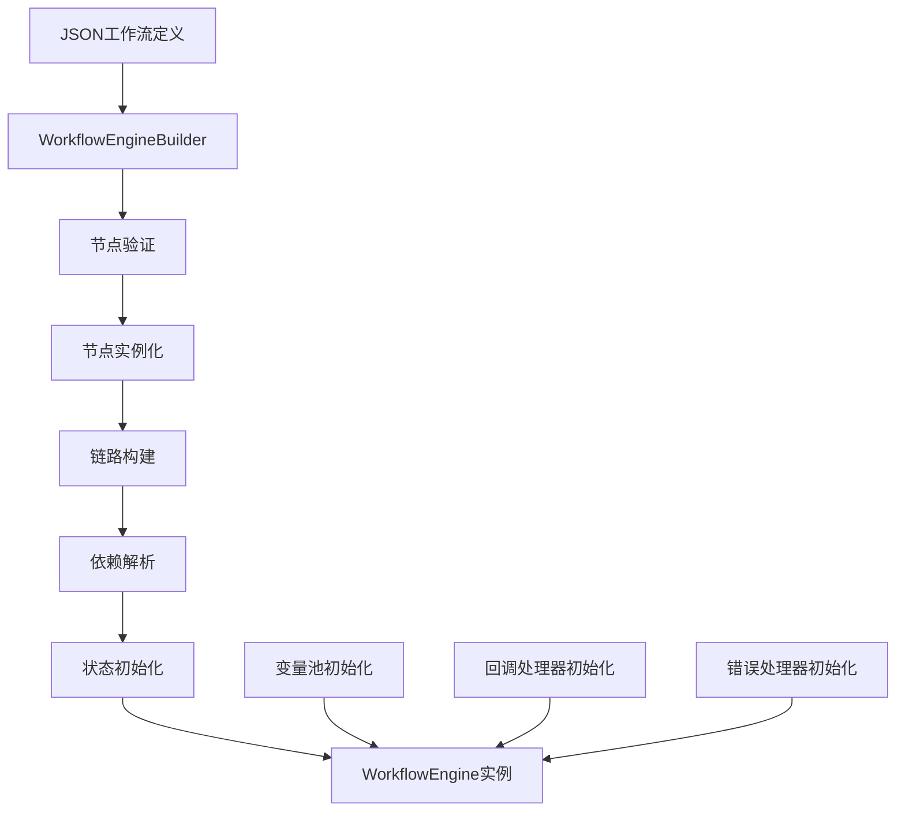

**图表来源**
- [dsl_engine.py](file://core/workflow/engine/dsl_engine.py#L2250-L2379)

**章节来源**
- [dsl_engine.py](file://core/workflow/engine/dsl_engine.py#L50-L200)
- [dsl_engine.py](file://core/workflow/engine/dsl_engine.py#L2200-L2379)

## 节点基类与执行生命周期

### 节点基类设计

节点基类采用模板方法模式和策略模式的组合，提供了统一的执行接口和灵活的扩展机制。

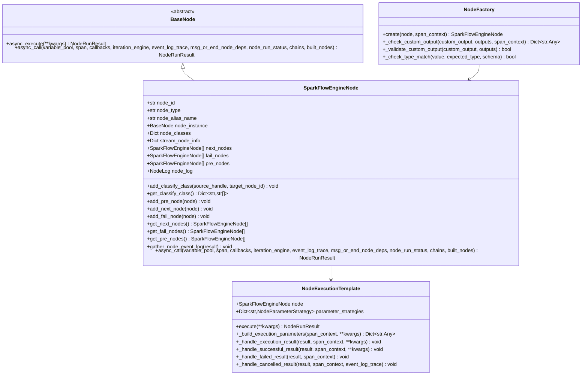

**图表来源**
- [node.py](file://core/workflow/engine/node.py#L400-L600)
- [node.py](file://core/workflow/engine/node.py#L600-L800)

### 执行生命周期

节点的执行生命周期包含以下阶段：

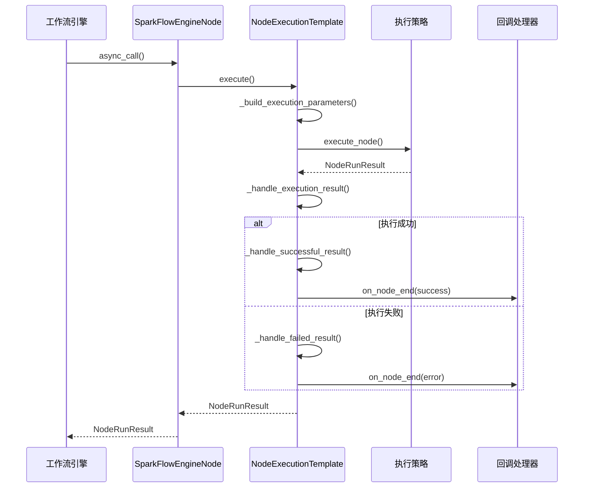

**图表来源**
- [node.py](file://core/workflow/engine/node.py#L400-L500)
- [dsl_engine.py](file://core/workflow/engine/dsl_engine.py#L1000-L1200)

**章节来源**
- [node.py](file://core/workflow/engine/node.py#L400-L800)
- [dsl_engine.py](file://core/workflow/engine/dsl_engine.py#L1000-L1400)

## 应用启动流程

### 中间件与扩展初始化

主应用入口点负责初始化整个系统的基础设施和服务。

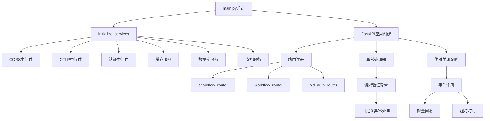

**图表来源**
- [main.py](file://core/workflow/main.py#L20-L100)

### 服务初始化流程

应用启动时按照以下顺序初始化各个组件：

1. **环境配置加载**：读取环境变量和配置文件
2. **中间件注册**：按优先级注册各种中间件
3. **路由注册**：注册API路由和处理器
4. **异常处理**：设置全局异常处理器
5. **生命周期事件**：注册启动和关闭事件处理器

**章节来源**
- [main.py](file://core/workflow/main.py#L20-L168)

## 并发模型与异步执行

### 深度优先搜索执行模型

工作流引擎采用深度优先搜索算法来确定节点的执行顺序，确保依赖关系得到正确处理。

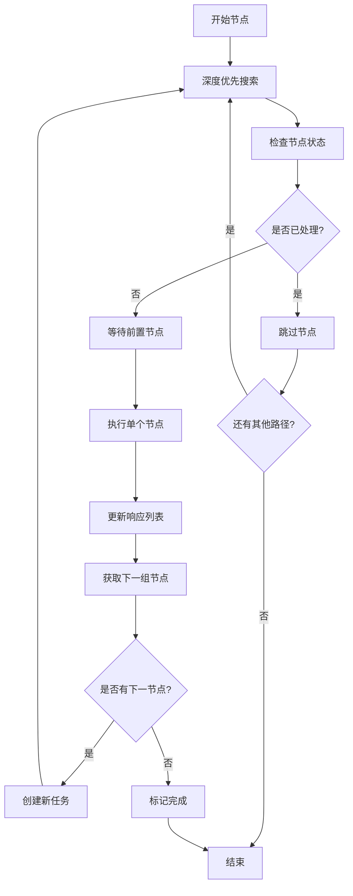

**图表来源**
- [dsl_engine.py](file://core/workflow/engine/dsl_engine.py#L1400-L1600)

### 任务管理与并发控制

引擎使用以下机制来管理并发执行：

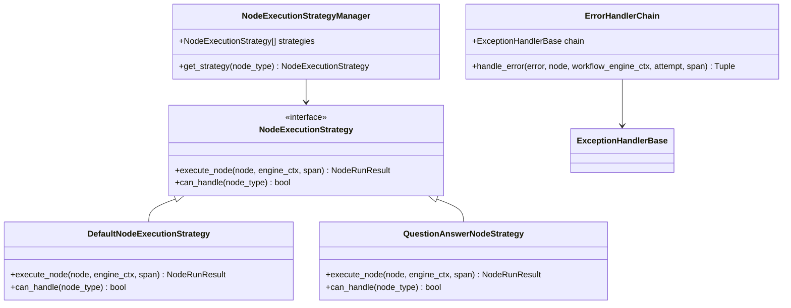

**图表来源**
- [dsl_engine.py](file://core/workflow/engine/dsl_engine.py#L600-L800)

**章节来源**
- [dsl_engine.py](file://core/workflow/engine/dsl_engine.py#L1400-L1800)

## 错误处理与容错策略

### 多层次错误处理机制

引擎实现了基于责任链模式的错误处理机制，能够根据不同类型的错误采取相应的处理策略。

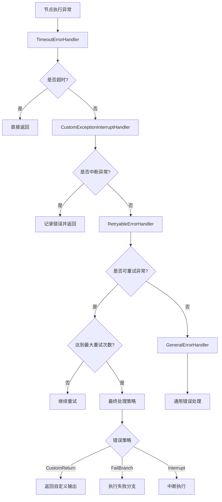

**图表来源**
- [dsl_engine.py](file://core/workflow/engine/dsl_engine.py#L150-L400)

### 重试机制与错误恢复

引擎支持多种重试策略和错误恢复机制：

| 错误类型 | 处理策略 | 重试条件 | 最终处理 |
|---------|---------|---------|---------|
| 超时错误 | 直接中断 | 不适用 | 抛出异常 |
| 自定义中断 | 记录错误 | 不适用 | 返回结果 |
| 可重试异常 | 条件重试 | 首次令牌未发送 | 继续重试 |
| 最终重试失败 | 策略处理 | 达到最大重试次数 | 根据策略处理 |

**章节来源**
- [dsl_engine.py](file://core/workflow/engine/dsl_engine.py#L150-L600)

## 性能优化

### 节点执行批处理

引擎通过以下机制优化节点执行性能：

1. **并发执行控制**：使用信号量控制并发节点数量
2. **任务队列管理**：维护DFS任务队列进行有序处理
3. **内存优化**：使用对象池减少内存分配
4. **缓存策略**：缓存节点实例和执行上下文

### 变量池优化

变量池实现了高效的变量存储和检索机制：

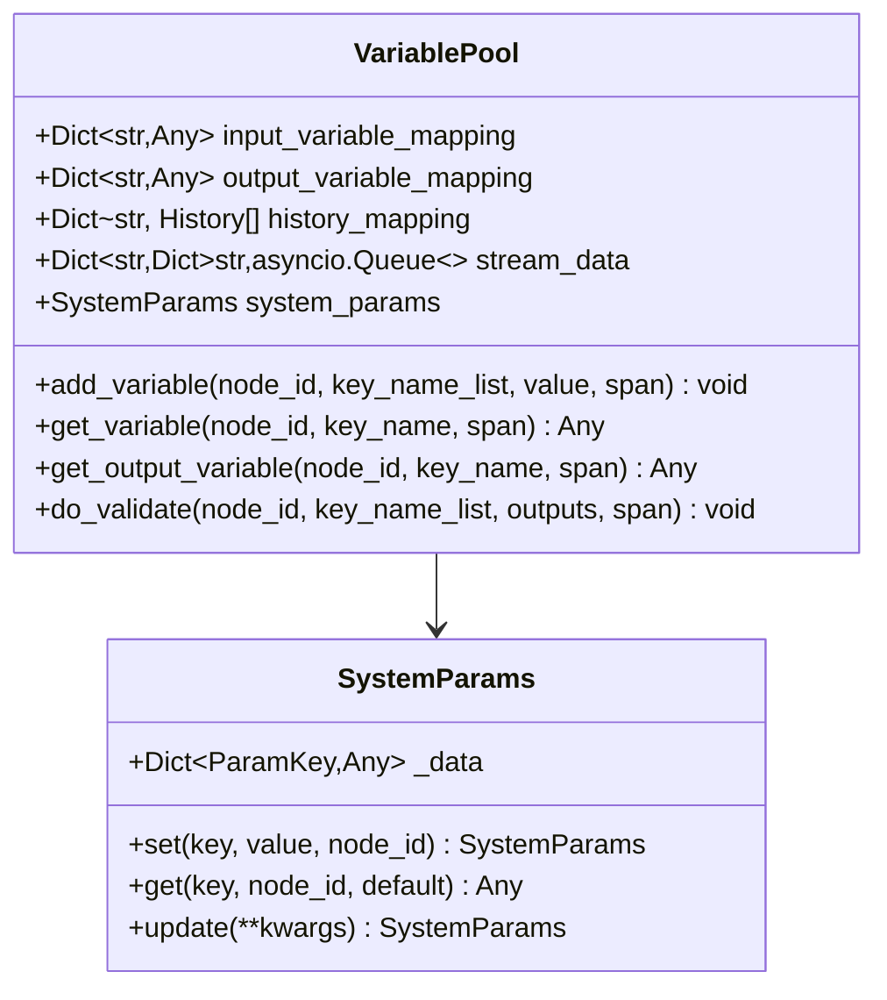

**图表来源**
- [variable_pool.py](file://core/workflow/engine/entities/variable_pool.py#L200-L400)

### 流式输出优化

引擎支持高效的流式输出处理：

- **分段输出**：支持节点级别的分段输出
- **有序传输**：确保消息节点的有序传输
- **缓冲管理**：合理管理输出缓冲区大小
- **背压控制**：防止生产者过快导致消费者阻塞

**章节来源**
- [variable_pool.py](file://core/workflow/engine/entities/variable_pool.py#L200-L806)
- [callback_handler.py](file://core/workflow/engine/callbacks/callback_handler.py#L1-L200)

## 优雅关闭机制

### 关闭流程设计

优雅关闭机制确保正在运行的工作流能够安全完成，而不会中断用户的服务体验。

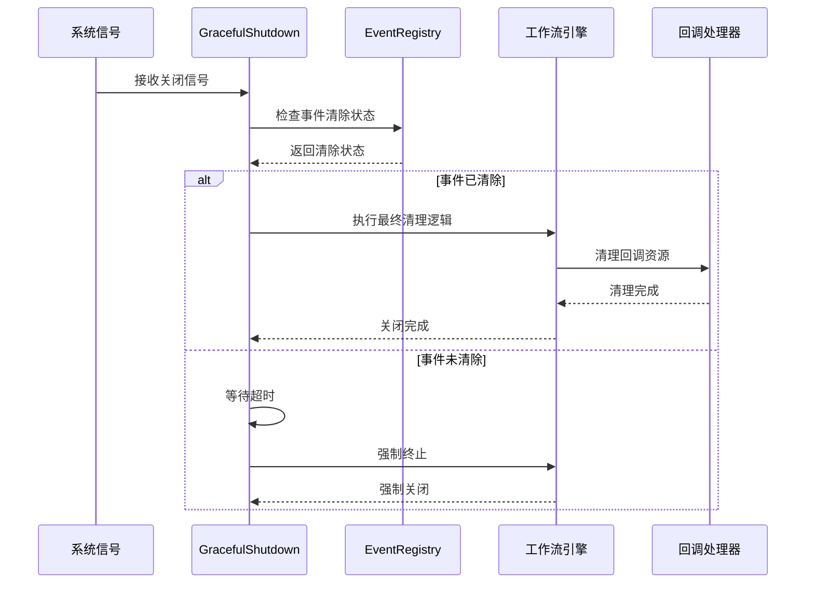

**图表来源**
- [graceful_shutdown.py](file://core/workflow/extensions/graceful_shutdown/graceful_shutdown.py#L1-L82)

### 资源清理策略

优雅关闭包含以下清理步骤：

1. **事件等待**：等待所有工作流事件完成
2. **超时检查**：设置合理的超时时间
3. **强制终止**：超时后强制终止未完成的任务
4. **资源释放**：释放数据库连接、缓存等资源
5. **日志记录**：记录关闭过程和状态

**章节来源**
- [graceful_shutdown.py](file://core/workflow/extensions/graceful_shutdown/graceful_shutdown.py#L1-L82)

## 总结

Astron Agent的核心引擎是一个设计精良的分布式工作流执行系统，具有以下特点：

### 架构优势

- **模块化设计**：清晰的分层架构便于维护和扩展
- **异步并发**：基于asyncio的高性能并发执行
- **容错性强**：多层次的错误处理和恢复机制
- **可扩展性**：插件化的节点设计支持功能扩展

### 技术创新

- **DSL驱动**：JSON格式的工作流定义简化了业务逻辑表达
- **智能调度**：深度优先搜索算法确保依赖关系正确处理
- **流式输出**：支持实时流式结果输出提升用户体验
- **优雅关闭**：确保服务中断时的数据完整性

### 性能特征

- **高并发**：支持大量并发工作流同时执行
- **低延迟**：异步执行和缓存机制减少响应时间
- **资源高效**：合理的资源管理和内存优化
- **可监控**：完整的追踪和监控体系

该核心引擎为Astron Agent提供了强大的工作流处理能力，支持复杂的业务场景和高并发需求，是整个系统稳定运行的重要保障。