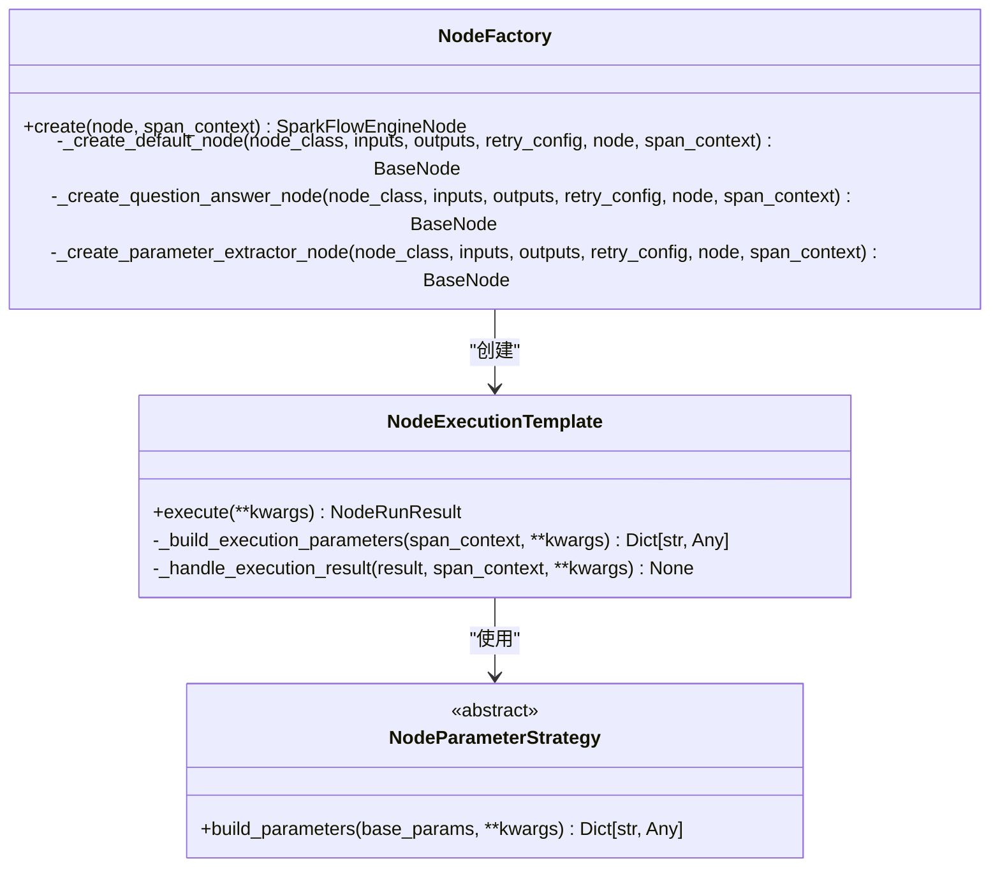
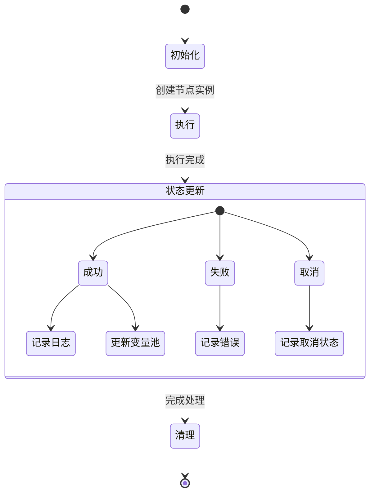
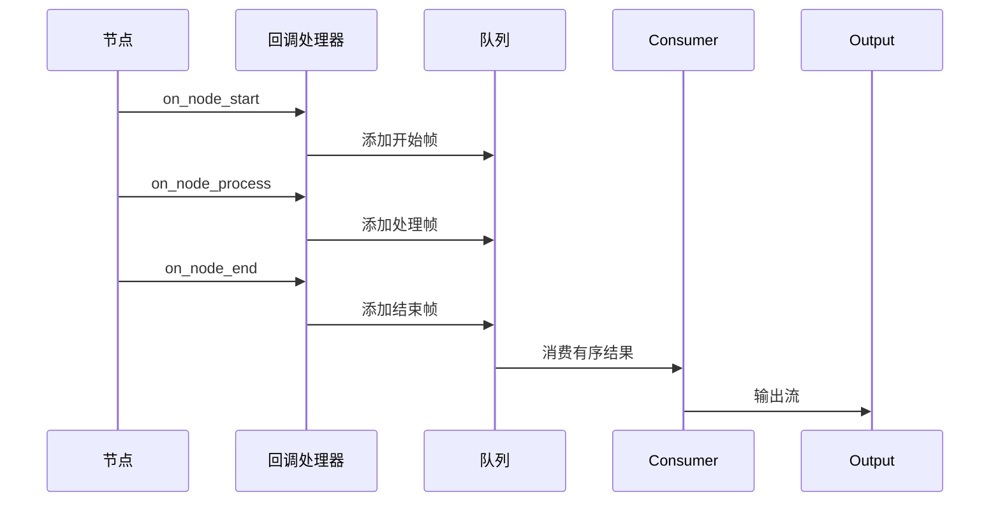
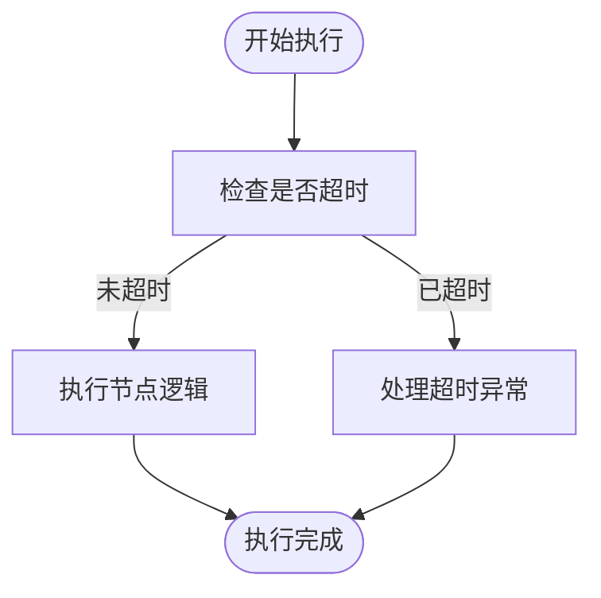
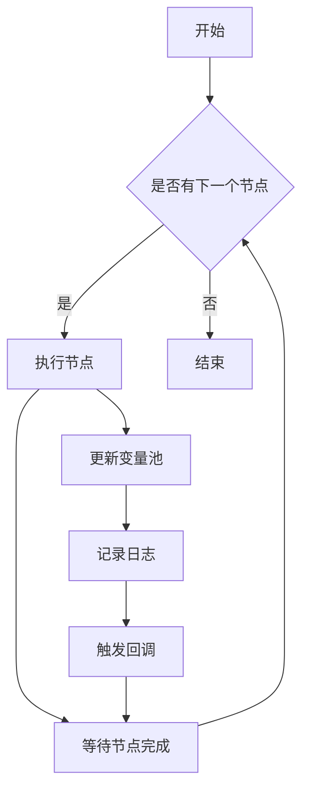
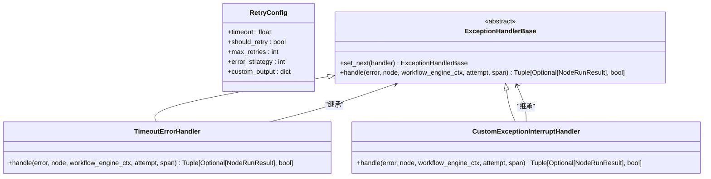
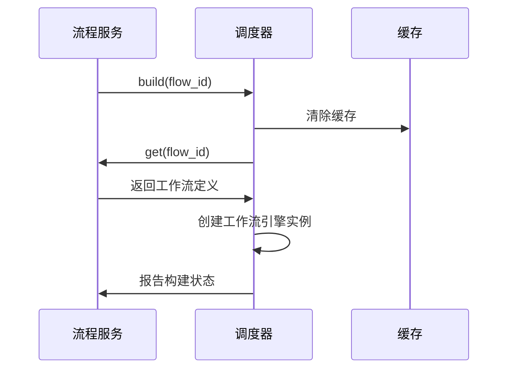

# 节点调度器

<cite>
**本文档引用的文件**  
- [node.py](file://core/workflow/engine/node.py)
- [callback_handler.py](file://core/workflow/engine/callbacks/callback_handler.py)
- [timeout.py](file://core/workflow/consts/engine/timeout.py)
- [flow_service.py](file://core/workflow/service/flow_service.py)
</cite>

## 目录
1. [引言](#引言)
2. [节点调度机制](#节点调度机制)
3. [节点生命周期管理](#节点生命周期管理)
4. [回调处理器实现](#回调处理器实现)
5. [超时机制](#超时机制)
6. [调度算法与并发控制](#调度算法与并发控制)
7. [优先级管理与错误恢复](#优先级管理与错误恢复)
8. [与流程服务的交互](#与流程服务的交互)
9. [结论](#结论)

## 引言
节点调度器是工作流引擎的核心组件，负责管理节点的执行调度、生命周期、状态更新和清理。它通过调度算法、并发控制、优先级管理和错误恢复策略，确保工作流中各个节点能够高效、可靠地执行。节点调度器与回调处理器、超时机制和流程服务紧密协作，实现复杂的业务流程自动化。

## 节点调度机制
节点调度器通过`NodeExecutionTemplate`类实现节点执行的模板方法模式。该模板方法定义了节点执行的通用流程，包括参数构建、执行逻辑和结果处理。不同类型的节点通过`NodeParameterStrategy`策略模式来构建特定的执行参数。

调度器使用工厂模式`NodeFactory`创建节点实例，根据节点类型选择相应的节点类。节点执行过程中，调度器会记录节点的输入输出数据、token消耗和LLM输出等信息，并通过`VariablePool`变量池管理节点间的变量传递。

**图源**
- [node.py](file://core/workflow/engine/node.py#L100-L300)

**本节源**
- [node.py](file://core/workflow/engine/node.py#L100-L300)

## 节点生命周期管理
节点的生命周期包括初始化、执行、状态更新和清理四个阶段。在初始化阶段，`SparkFlowEngineNode`类通过`__init__`方法创建节点实例，并设置节点的基本信息和日志记录器。节点的执行通过`async_call`方法异步调用，该方法使用`NodeExecutionTemplate`模板执行节点逻辑。

状态更新主要在`_handle_execution_result`方法中完成，根据节点执行结果的状态（成功、失败或取消）进行相应的处理。对于成功的执行结果，调度器会将结果添加到变量池中，并记录执行日志。清理工作主要由Python的垃圾回收机制自动完成，但调度器会显式地清理节点间的引用关系，防止内存泄漏。

**图源**
- [node.py](file://core/workflow/engine/node.py#L301-L500)

**本节源**
- [node.py](file://core/workflow/engine/node.py#L301-L500)

## 回调处理器实现
回调处理器`ChatCallBacks`类实现了节点执行的前后置操作、日志记录和事件通知。它通过一系列`on_*`方法处理不同类型的事件，如工作流开始(`on_sparkflow_start`)、节点开始(`on_node_start`)、节点处理(`on_node_process`)、节点中断(`on_node_interrupt`)和节点结束(`on_node_end`)。

回调处理器使用`_put_frame_into_queue`方法将响应帧添加到适当的队列中进行排序。对于消息节点和结束节点，响应帧会被添加到`order_stream_result_q`队列中以确保有序输出；对于其他节点，响应帧会直接添加到`stream_queue`中。`ChatCallBackConsumer`和`StructuredConsumer`类负责从队列中消费回调结果，并按顺序输出到最终的流队列中。

**图源**
- [callback_handler.py](file://core/workflow/engine/callbacks/callback_handler.py#L50-L200)

**本节源**
- [callback_handler.py](file://core/workflow/engine/callbacks/callback_handler.py#L50-L200)

## 超时机制
超时机制通过`QueueTimeout`枚举类定义，包含`AsyncQT`（异步队列超时，600秒）和`PingQT`（Ping队列超时，30秒）两个超时值。这些超时值用于防止节点长时间阻塞，确保工作流能够及时响应和处理。

在节点执行过程中，如果某个操作超过了预设的超时时间，系统会抛出`asyncio.TimeoutError`异常，中断当前的执行流程。`TimeoutErrorHandler`类专门处理这种超时异常，确保系统能够优雅地处理超时情况，而不是无限期地等待。

**图源**
- [timeout.py](file://core/workflow/consts/engine/timeout.py)

**本节源**
- [timeout.py](file://core/workflow/consts/engine/timeout.py)

## 调度算法与并发控制
节点调度器采用深度优先搜索(DFS)算法来遍历工作流中的节点。每个节点的执行都是异步的，通过`asyncio`库实现并发控制。调度器使用`WorkflowEngineCtx`类来管理执行上下文，包括变量池、迭代引擎、节点依赖关系和执行链等。

为了确保线程安全，调度器使用`asyncio.Lock`来保护共享资源，如问题回答节点的执行。`WorkflowEngineCtx`中的`qa_node_lock`锁确保问题回答节点的串行执行，避免并发访问导致的数据竞争。

**图源**
- [dsl_engine.py](file://core/workflow/engine/dsl_engine.py#L50-L100)

**本节源**
- [dsl_engine.py](file://core/workflow/engine/dsl_engine.py#L50-L100)

## 优先级管理与错误恢复
节点调度器通过`RetryConfig`类实现错误恢复策略，包含超时、是否重试、最大重试次数、错误处理策略和自定义输出等配置。当节点执行失败时，调度器会根据重试配置决定是否重试以及如何处理错误。

对于支持流式输出的节点类型（如LLM、AGENT、KNOWLEDGE_PRO、FLOW），调度器会继续执行后续节点；对于不支持流式输出的节点类型（如DATABASE、PLUGIN、CODE、DECISION_MAKING、KNOWLEDGE_BASE、PARAMETER_EXTRACTOR），调度器也会继续执行后续节点。这种设计确保了工作流的健壮性，即使某些节点失败，整个流程也不会完全中断。

**图源**
- [retry_config.py](file://core/workflow/engine/entities/retry_config.py)
- [dsl_engine.py](file://core/workflow/engine/dsl_engine.py#L101-L150)

**本节源**
- [retry_config.py](file://core/workflow/engine/entities/retry_config.py)
- [dsl_engine.py](file://core/workflow/engine/dsl_engine.py#L101-L150)

## 与流程服务的交互
节点调度器与`flow_service.py`中的流程服务紧密协作。流程服务提供了工作流的创建、更新、检索、调试和执行等功能。`build`函数用于构建和验证工作流，清除相关缓存并创建工作流引擎实例。`node_debug`函数用于调试单个工作流节点，执行输入审计、节点执行和输出审计。

调度器通过`WorkflowEngineFactory`创建工作流引擎实例，并使用`VariablePool`管理节点间的变量传递。流程服务还负责处理工作流的发布和权限验证，确保只有授权用户才能访问和执行特定的工作流。

**图源**
- [flow_service.py](file://core/workflow/service/flow_service.py#L200-L300)

**本节源**
- [flow_service.py](file://core/workflow/service/flow_service.py#L200-L300)

## 结论
节点调度器通过精心设计的架构和算法，实现了高效、可靠的节点调度和管理。它采用模板方法模式和策略模式来处理不同类型的节点，使用工厂模式创建节点实例，通过回调处理器实现事件通知和日志记录，利用超时机制防止节点长时间阻塞。调度器还实现了深度优先搜索算法进行节点遍历，使用异步编程实现并发控制，并通过重试配置和异常处理机制确保工作流的健壮性。与流程服务的紧密协作使得节点调度器能够支持复杂的工作流管理和调试功能。