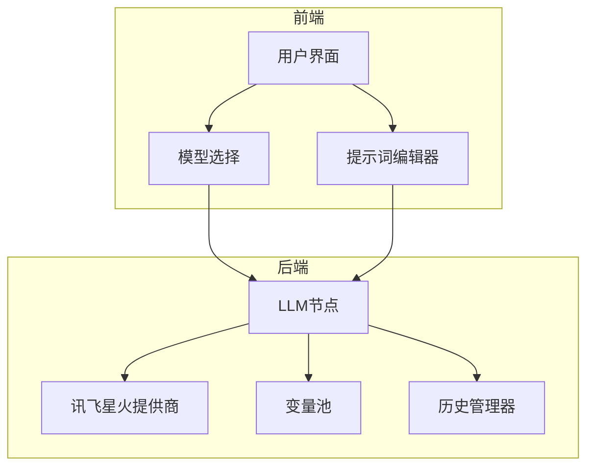
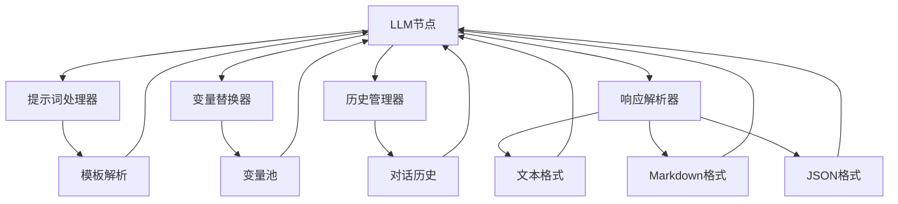
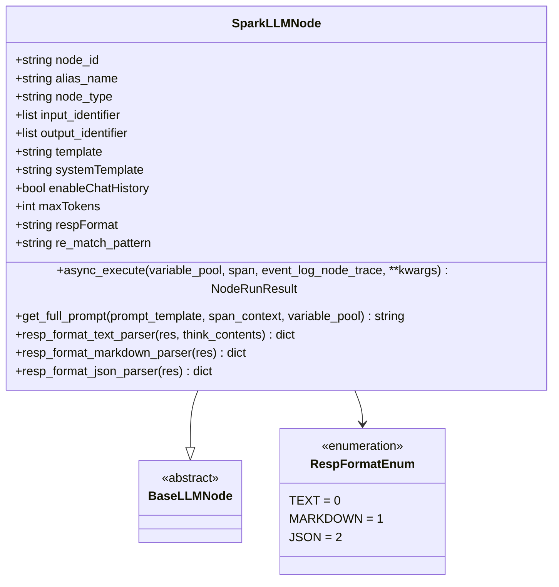
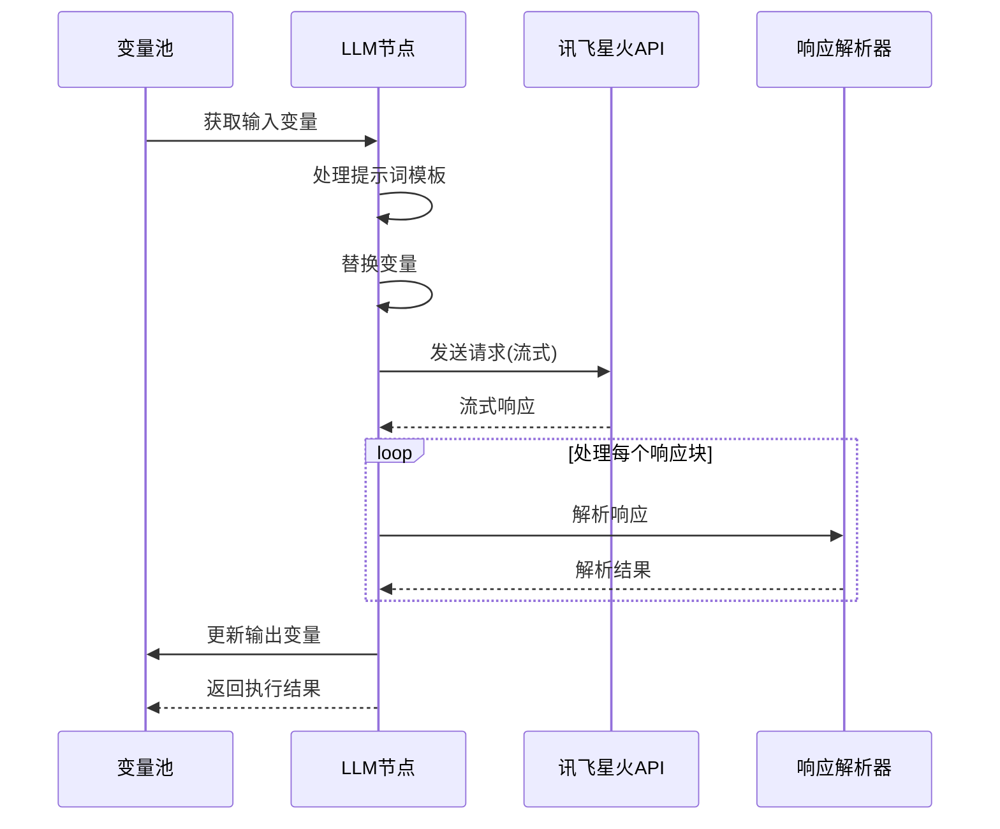
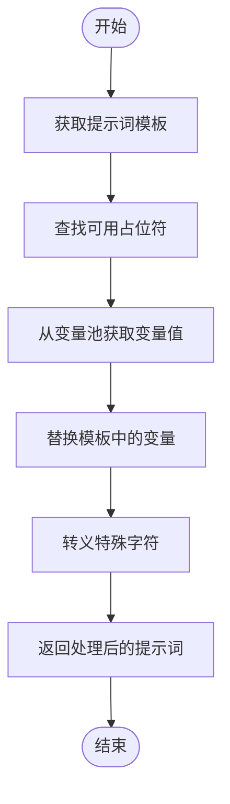
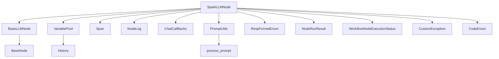

# LLM节点

<cite>
**本文档引用的文件**
- [spark_llm_node.py](file://core/workflow/engine/nodes/llm/spark_llm_node.py)
- [const.py](file://core/workflow/infra/providers/llm/iflytek_spark/const.py)
- [base_node.py](file://core/workflow/engine/nodes/base_node.py)
- [prompt.py](file://core/workflow/engine/nodes/util/prompt.py)
- [prompt_ai_personal.py](file://core/workflow/engine/nodes/llm/prompt_ai_personal.py)
</cite>

## 目录
1. [简介](#简介)
2. [项目结构](#项目结构)
3. [核心组件](#核心组件)
4. [架构概述](#架构概述)
5. [详细组件分析](#详细组件分析)
6. [依赖分析](#依赖分析)
7. [性能考虑](#性能考虑)
8. [故障排除指南](#故障排除指南)
9. [结论](#结论)

## 简介
LLM节点是Astron-Agent工作流系统中的核心组件，负责与讯飞星火大模型进行集成和交互。该节点实现了完整的提示词处理、变量替换、流式响应处理和函数调用功能，为智能体提供强大的语言理解和生成能力。

## 项目结构
LLM节点的实现分布在多个模块中，主要位于core/workflow/engine/nodes/llm目录下。该节点与前端组件协同工作，通过标准化的接口与讯飞星火大模型进行通信。

**图示来源**
- [spark_llm_node.py](file://core/workflow/engine/nodes/llm/spark_llm_node.py)
- [const.py](file://core/workflow/infra/providers/llm/iflytek_spark/const.py)

**章节来源**
- [spark_llm_node.py](file://core/workflow/engine/nodes/llm/spark_llm_node.py)

## 核心组件
LLM节点的核心功能包括提示词模板解析、变量替换、响应格式化和流式处理。节点通过继承BaseLLMNode基类，实现了与讯飞星火大模型的异步通信和完整的错误处理机制。

**章节来源**
- [spark_llm_node.py](file://core/workflow/engine/nodes/llm/spark_llm_node.py)
- [base_node.py](file://core/workflow/engine/nodes/base_node.py)

## 架构概述
LLM节点采用分层架构设计，将提示词处理、模型通信和响应解析等功能分离。这种设计提高了代码的可维护性和扩展性，使得不同功能模块可以独立演进。

**图示来源**
- [spark_llm_node.py](file://core/workflow/engine/nodes/llm/spark_llm_node.py)
- [prompt.py](file://core/workflow/engine/nodes/util/prompt.py)

## 详细组件分析

### LLM节点分析
LLM节点是工作流系统中与大语言模型交互的核心组件，负责处理提示词、管理对话历史和解析模型响应。

#### 类图

**图示来源**
- [spark_llm_node.py](file://core/workflow/engine/nodes/llm/spark_llm_node.py)
- [const.py](file://core/workflow/infra/providers/llm/iflytek_spark/const.py)

#### 执行流程

**图示来源**
- [spark_llm_node.py](file://core/workflow/engine/nodes/llm/spark_llm_node.py)

#### 提示词处理流程

**图示来源**
- [spark_llm_node.py](file://core/workflow/engine/nodes/llm/spark_llm_node.py)
- [prompt.py](file://core/workflow/engine/nodes/util/prompt.py)

**章节来源**
- [spark_llm_node.py](file://core/workflow/engine/nodes/llm/spark_llm_node.py)

### 配置参数说明
LLM节点支持多种配置参数，允许用户根据具体需求调整模型行为。

| 参数 | 描述 | 默认值 | 范围 |
|------|------|--------|------|
| 模型选择 | 选择使用的讯飞星火大模型版本 | v3.5 | v1.5, v2.0, v3.5 |
| 温度参数 | 控制生成文本的随机性 | 0.5 | 0.0-1.0 |
| 最大生成长度 | 限制生成文本的最大token数 | 2048 | 1-8192 |
| Top K | 采样时考虑的最高概率词汇数 | 5 | 1-100 |
| 响应格式 | 指定期望的响应格式 | TEXT | TEXT, MARKDOWN, JSON |

**章节来源**
- [spark_llm_node.py](file://core/workflow/engine/nodes/llm/spark_llm_node.py)

## 依赖分析
LLM节点依赖于多个核心组件和服务，这些依赖关系确保了节点功能的完整性和可靠性。

**图示来源**
- [spark_llm_node.py](file://core/workflow/engine/nodes/llm/spark_llm_node.py)

**章节来源**
- [spark_llm_node.py](file://core/workflow/engine/nodes/llm/spark_llm_node.py)

## 性能考虑
为了优化LLM节点的性能，建议采用以下策略：

1. **连接池配置**：复用与讯飞星火API的连接，减少连接建立的开销
2. **响应缓存**：对重复的查询请求进行缓存，避免不必要的API调用
3. **批量处理**：将多个小请求合并为批量请求，提高吞吐量
4. **流式处理**：使用流式API及时处理响应，减少等待时间
5. **超时设置**：合理设置请求超时，避免长时间等待

**章节来源**
- [spark_llm_node.py](file://core/workflow/engine/nodes/llm/spark_llm_node.py)

## 故障排除指南
当LLM节点出现问题时，可以参考以下常见问题和解决方案：

1. **认证失败**：检查API密钥和应用ID是否正确配置
2. **响应格式错误**：验证JSON响应的格式是否符合预期，特别是包含换行符的情况
3. **变量替换失败**：确保变量名称在输入标识符中定义，并检查变量池中是否存在对应值
4. **流式处理中断**：检查网络连接稳定性，适当增加重试次数
5. **性能瓶颈**：监控API调用延迟，考虑启用缓存或优化提示词

**章节来源**
- [spark_llm_node.py](file://core/workflow/engine/nodes/llm/spark_llm_node.py)

## 结论
LLM节点作为Astron-Agent系统的核心组件，提供了强大而灵活的大语言模型集成能力。通过完善的提示词处理、变量替换和响应解析机制，该节点能够满足各种复杂的AI应用场景需求。未来可以通过引入更多优化策略和增强错误处理能力，进一步提升节点的性能和可靠性。