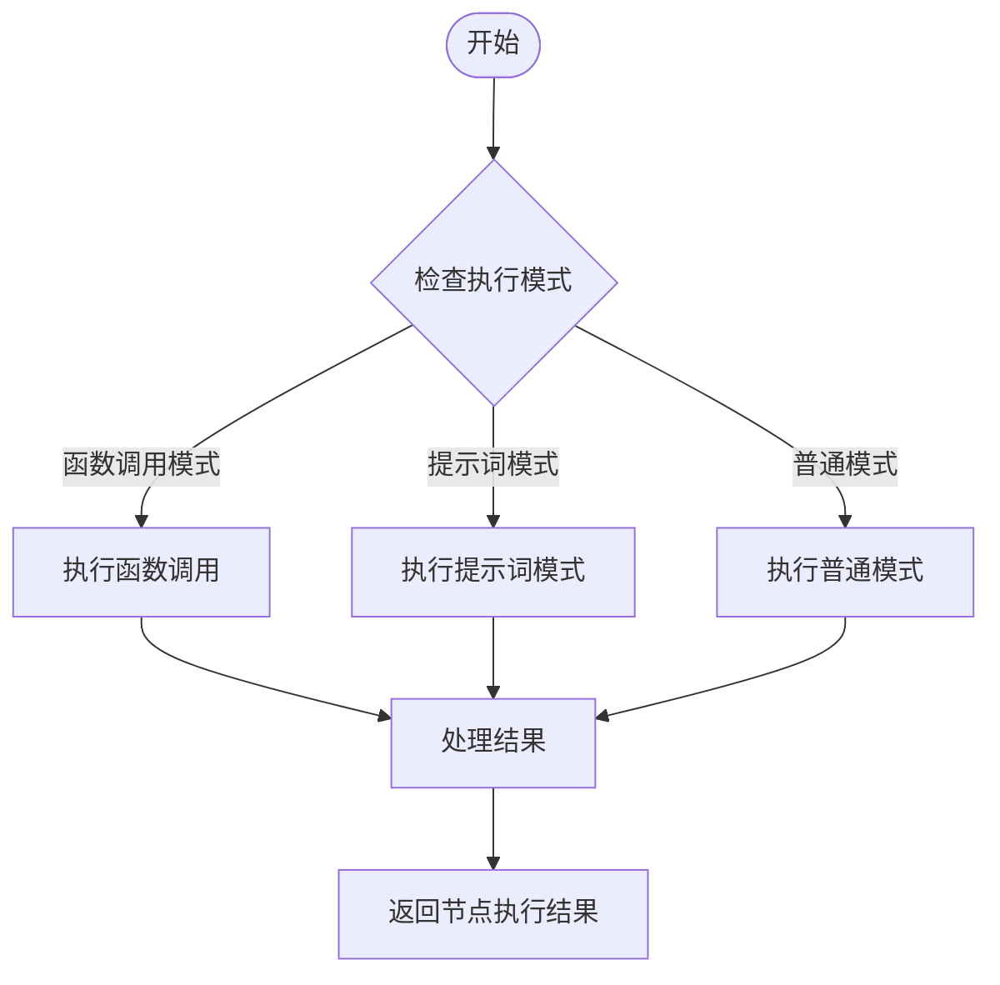
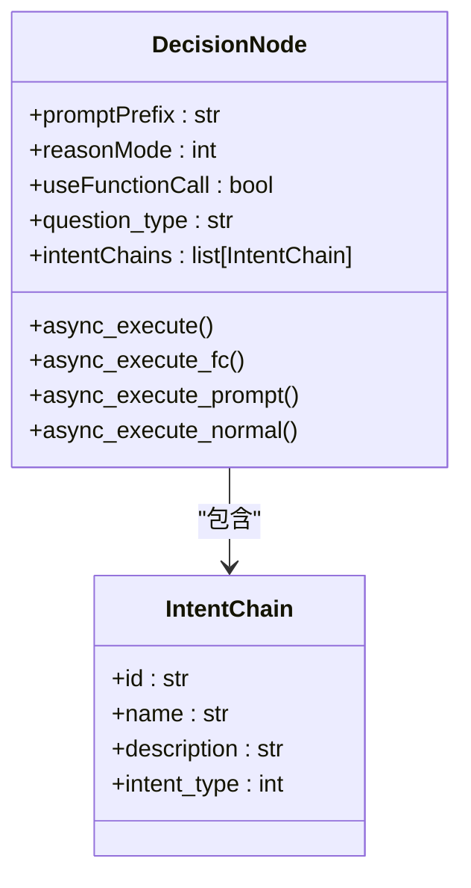
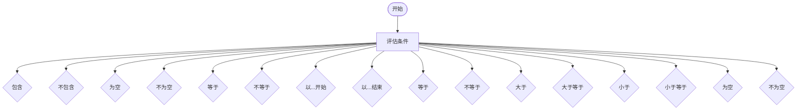
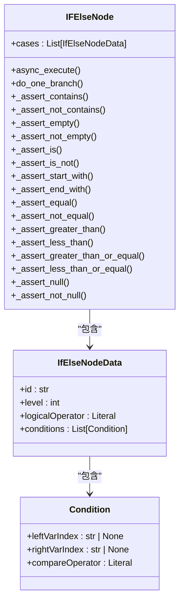
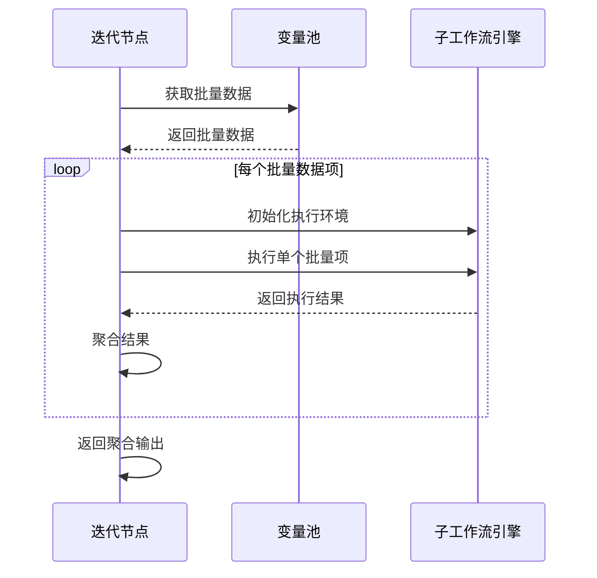
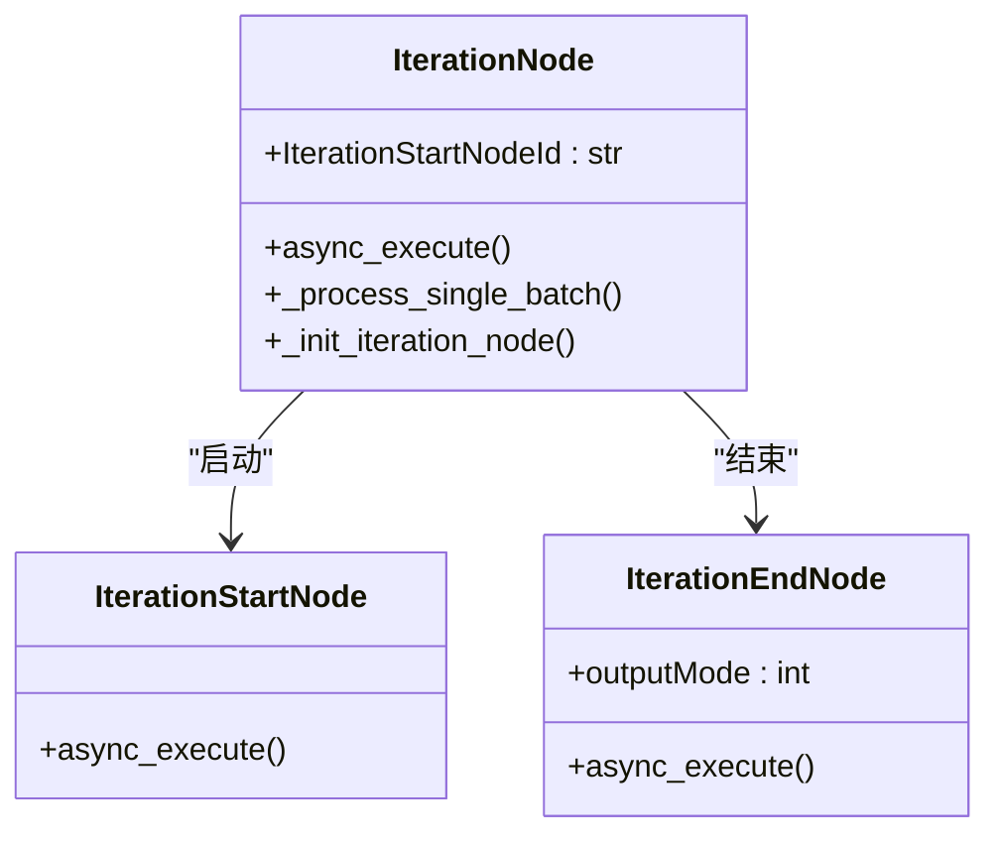
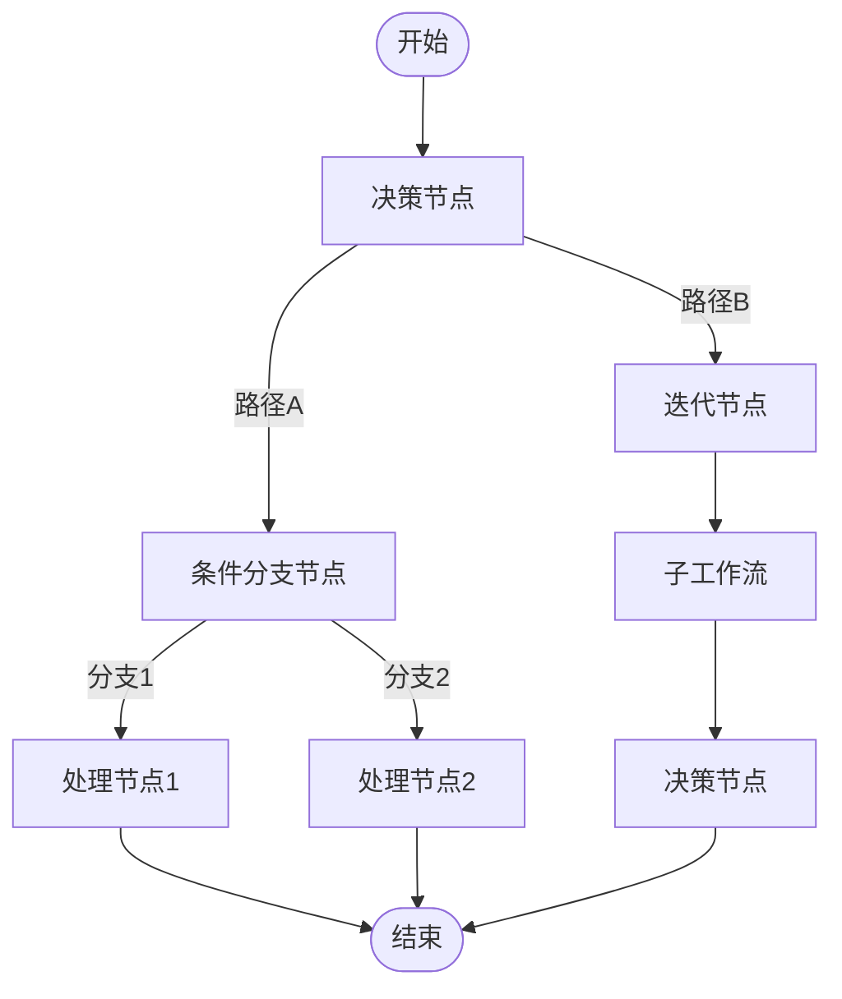
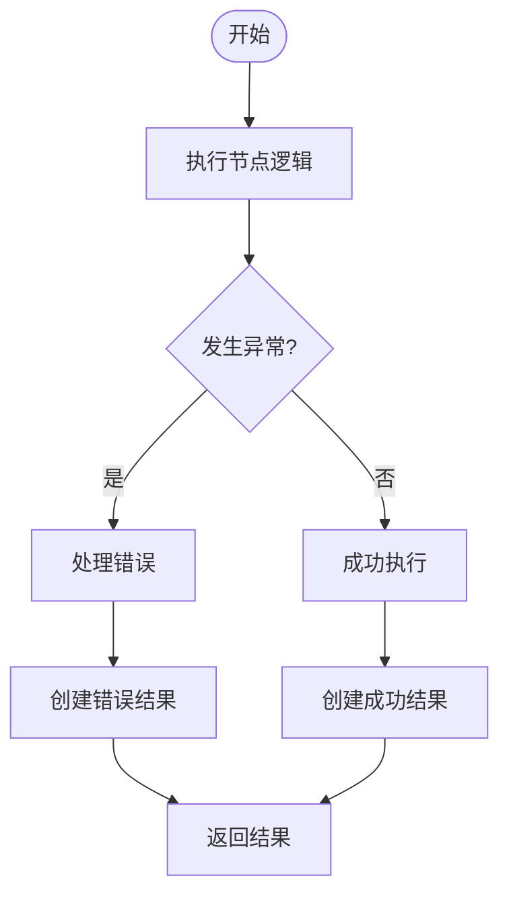

# 控制流节点

<cite>
**本文档中引用的文件**  
- [decision_node.py](file://core/workflow/engine/nodes/decision/decision_node.py)
- [if_else_node.py](file://core/workflow/engine/nodes/if_else/if_else_node.py)
- [iteration_node.py](file://core/workflow/engine/nodes/iteration/iteration_node.py)
- [base_node.py](file://core/workflow/engine/nodes/base_node.py)
- [node_run_result.py](file://core/workflow/engine/nodes/entities/node_run_result.py)
</cite>

## 目录
1. [引言](#引言)
2. [决策节点](#决策节点)
3. [条件分支节点](#条件分支节点)
4. [迭代节点](#迭代节点)
5. [控制流节点组合使用](#控制流节点组合使用)
6. [错误处理机制](#错误处理机制)
7. [结论](#结论)

## 引言

控制流节点是工作流引擎中的核心组件，负责管理程序执行路径的分支、循环和条件判断。本技术文档详细说明了三种主要的控制流节点：决策节点（decision_node.py）、条件分支节点（if_else_node.py）和迭代节点（iteration_node.py）。这些节点通过不同的机制实现复杂的流程控制，支持基于LLM输出的逻辑判断、条件表达式解析和循环执行模式。

**Section sources**
- [decision_node.py](file://core/workflow/engine/nodes/decision/decision_node.py#L1-L647)
- [if_else_node.py](file://core/workflow/engine/nodes/if_else/if_else_node.py#L1-L700)
- [iteration_node.py](file://core/workflow/engine/nodes/iteration/iteration_node.py#L1-L373)

## 决策节点

决策节点（DecisionNode）是基于LLM输出进行逻辑判断和路径选择的核心组件。它支持多种执行模式，包括函数调用模式、提示词模式和普通分类模式，能够根据用户输入和意图分类确定工作流的下一步路径。

### 执行模式

决策节点通过`reasonMode`参数选择执行模式：
- **函数调用模式**（useFunctionCall=True）：使用Spark Function Call AI进行意图分类
- **提示词模式**（reasonMode=1）：使用结构化提示词进行意图分类
- **普通模式**：使用构造的提示词模板进行分类

**Diagram sources**
- [decision_node.py](file://core/workflow/engine/nodes/decision/decision_node.py#L1-L647)

### 意图链配置

决策节点通过`intentChains`参数配置意图链，每个意图链包含ID、名称、描述和类型。系统根据这些配置构建函数调用schema或分类类别，用于确定用户意图。

**Diagram sources**
- [decision_node.py](file://core/workflow/engine/nodes/decision/decision_node.py#L1-L647)

### 路径选择机制

决策节点的路径选择机制基于LLM输出的解析和验证。系统使用JSON Schema验证LLM返回的结构化数据，确保输出格式的正确性。当验证失败时，系统会使用默认ID作为回退路径。

**Section sources**
- [decision_node.py](file://core/workflow/engine/nodes/decision/decision_node.py#L1-L647)

## 条件分支节点

条件分支节点（IFElseNode）实现了基于条件表达式的分支执行机制。它支持多种比较操作符，包括字符串、数值和集合的比较，能够处理复杂的条件逻辑。

### 条件表达式解析

条件分支节点通过`Condition`类定义条件表达式，每个条件包含左变量索引、右变量索引和比较操作符。系统支持以下比较操作符：

**Diagram sources**
- [if_else_node.py](file://core/workflow/engine/nodes/if_else/if_else_node.py#L1-L700)

### 分支执行机制

条件分支节点通过`cases`参数配置多个分支，每个分支包含ID、级别和逻辑操作符（and/or）。系统按照优先级顺序评估分支，遵循短路原则，一旦找到匹配的分支就停止评估。

**Diagram sources**
- [if_else_node.py](file://core/workflow/engine/nodes/if_else/if_else_node.py#L1-L700)

### 逻辑操作符

条件分支节点支持两种逻辑操作符：
- **and**：所有条件都必须为真
- **or**：至少一个条件为真

系统使用`match`语句实现各种比较操作符的逻辑判断，确保条件评估的准确性和效率。

**Section sources**
- [if_else_node.py](file://core/workflow/engine/nodes/if_else/if_else_node.py#L1-L700)

## 迭代节点

迭代节点（IterationNode）实现了循环执行模式，能够对批量数据进行逐项处理。它通过子工作流的方式执行迭代，支持迭代变量管理和终止条件判断。

### 循环执行模式

迭代节点通过`IterationStartNodeId`参数指定子工作流的起始节点ID。系统为每个批量数据项创建独立的执行环境，运行完整的子工作流迭代。

**Diagram sources**
- [iteration_node.py](file://core/workflow/engine/nodes/iteration/iteration_node.py#L1-L373)

### 迭代变量管理

迭代节点通过`_process_single_batch`方法管理迭代变量。系统为每个迭代创建临时变量池的副本，确保迭代之间的变量隔离。

**Diagram sources**
- [iteration_node.py](file://core/workflow/engine/nodes/iteration/iteration_node.py#L1-L373)

### 终止条件判断

迭代节点的终止条件由子工作流的结束节点（IterationEndNode）控制。系统通过`outputMode`参数配置输出模式，决定如何处理迭代结果。

**Section sources**
- [iteration_node.py](file://core/workflow/engine/nodes/iteration/iteration_node.py#L1-L373)

## 控制流节点组合使用

在复杂工作流中，控制流节点可以组合使用，实现高级的流程控制逻辑。例如，可以在迭代节点内部使用决策节点，或在条件分支节点中嵌套迭代节点。

**Diagram sources**
- [decision_node.py](file://core/workflow/engine/nodes/decision/decision_node.py#L1-L647)
- [if_else_node.py](file://core/workflow/engine/nodes/if_else/if_else_node.py#L1-L700)
- [iteration_node.py](file://core/workflow/engine/nodes/iteration/iteration_node.py#L1-L373)

## 错误处理机制

控制流节点实现了完善的错误处理机制，确保在异常情况下仍能提供有意义的输出。

### 错误处理策略

所有控制流节点都实现了异常捕获和处理机制。当执行过程中发生异常时，节点会返回失败状态的`NodeRunResult`，包含错误信息和输入数据。

**Diagram sources**
- [node_run_result.py](file://core/workflow/engine/nodes/entities/node_run_result.py#L1-L81)

### 边界情况处理

控制流节点特别处理了多种边界情况：
- **空值处理**：对null、空字符串、空列表等进行特殊处理
- **类型转换**：在比较操作中自动处理类型转换
- **默认路径**：当没有匹配条件时使用默认分支
- **短路评估**：在条件分支中实现短路评估以提高效率

**Section sources**
- [decision_node.py](file://core/workflow/engine/nodes/decision/decision_node.py#L1-L647)
- [if_else_node.py](file://core/workflow/engine/nodes/if_else/if_else_node.py#L1-L700)
- [iteration_node.py](file://core/workflow/engine/nodes/iteration/iteration_node.py#L1-L373)

## 结论

控制流节点是工作流引擎中实现复杂业务逻辑的关键组件。决策节点、条件分支节点和迭代节点分别提供了基于LLM的智能判断、基于条件表达式的分支控制和批量数据的循环处理能力。这些节点通过统一的`NodeRunResult`接口返回执行结果，支持灵活的错误处理和边界情况处理。在实际应用中，这些节点可以组合使用，构建出复杂而强大的工作流系统。