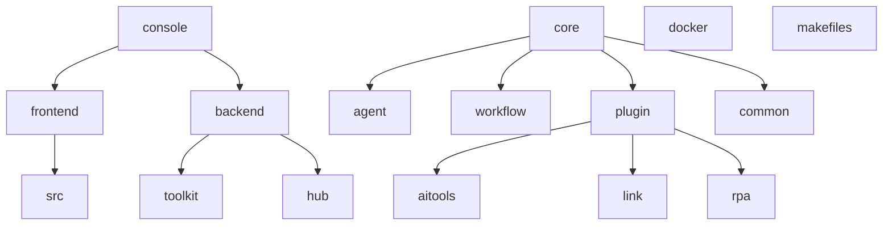
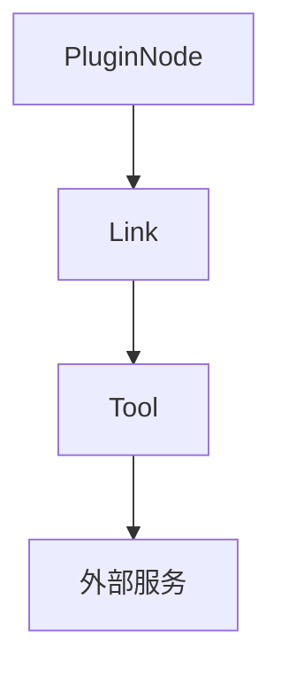
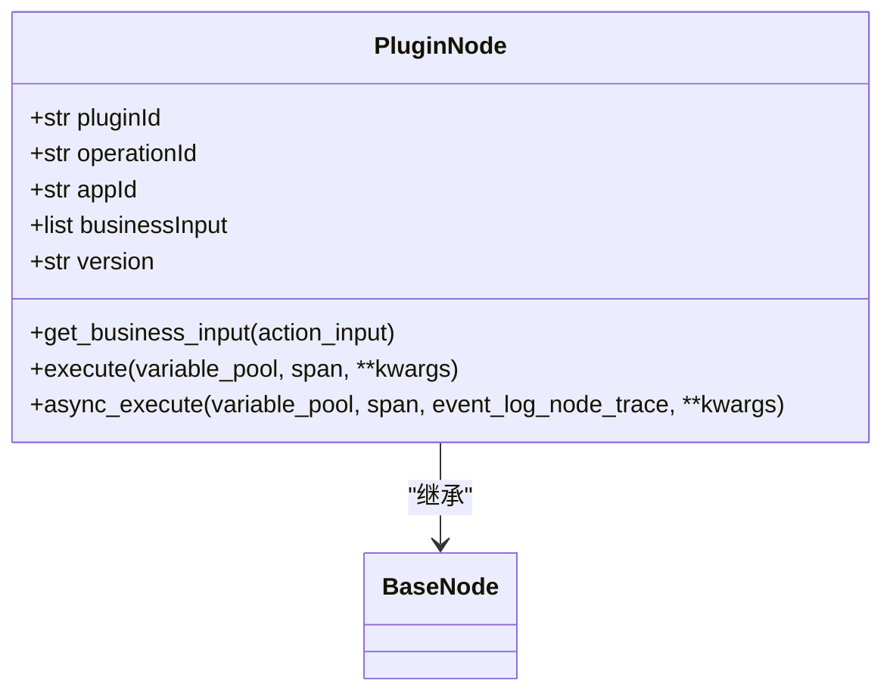
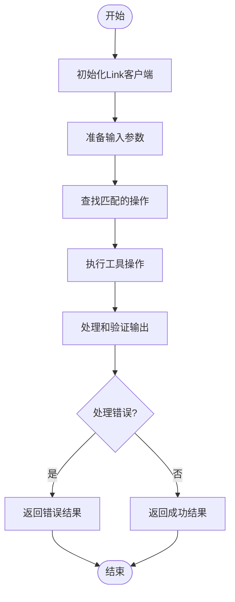
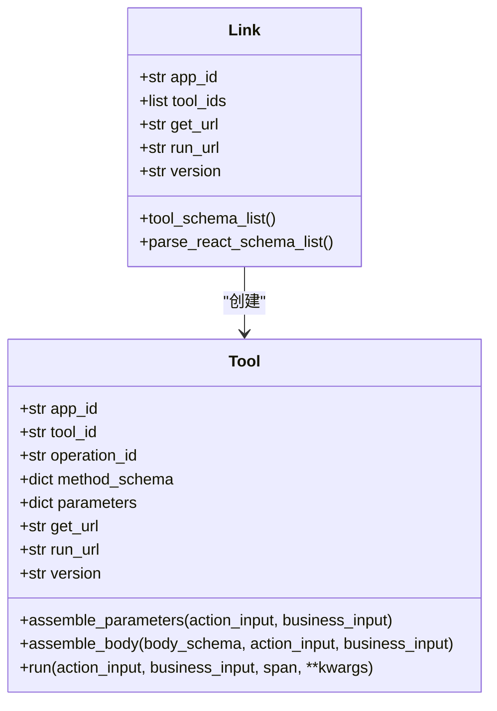
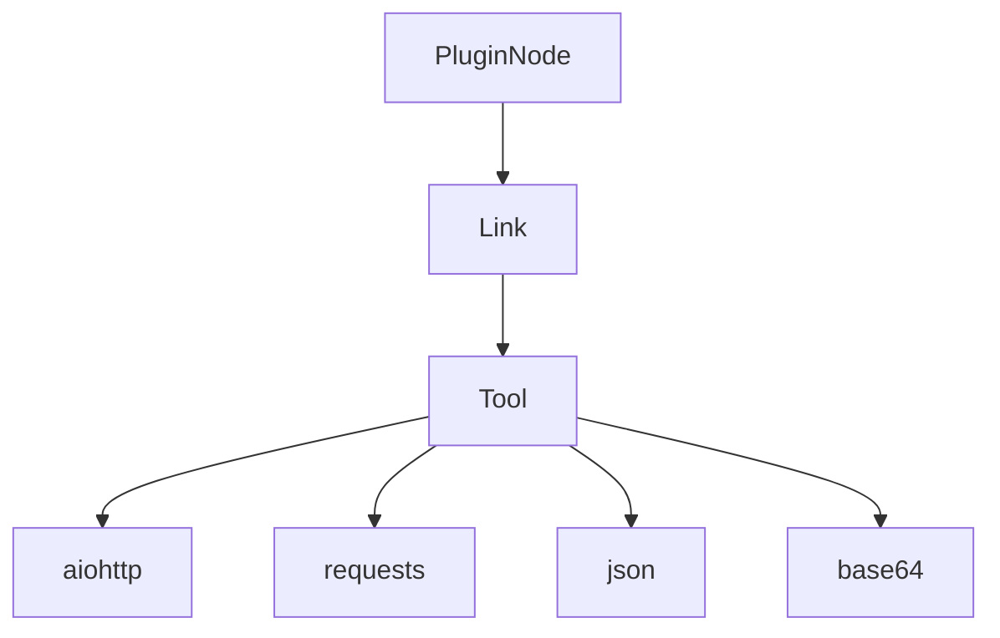

# 插件节点

<cite>
**本文档引用的文件**
- [plugin_node.py](file://core/workflow/engine/nodes/plugin_tool/plugin_node.py)
- [link_client.py](file://core/workflow/engine/nodes/plugin_tool/link_client.py)
- [plugin_store.ts](file://console/frontend/src/services/plugin.ts)
- [plugin-create/index.tsx](file://console/frontend/src/pages/resource-management/plugin-create/index.tsx)
- [plugin.ts](file://console/frontend/src/locales/zh-ZH/plugin.ts)
- [aitools/main.py](file://core/plugin/aitools/main.py)
- [rpa/main.py](file://core/plugin/rpa/main.py)
</cite>

## 目录
1. [简介](#简介)
2. [项目结构](#项目结构)
3. [核心组件](#核心组件)
4. [架构概述](#架构概述)
5. [详细组件分析](#详细组件分析)
6. [依赖分析](#依赖分析)
7. [性能考虑](#性能考虑)
8. [故障排除指南](#故障排除指南)
9. [结论](#结论)

## 简介
插件节点是Astron Agent系统中的关键组件，负责调用外部插件服务，包括RPA（机器人流程自动化）、AI工具和链接插件。该节点通过Link系统与外部服务通信，实现了灵活的插件发现、注册和调用机制。插件节点支持多种插件类型，允许用户通过配置输入参数映射、认证信息等来调用不同的外部服务。本文档详细介绍了插件节点的实现，包括请求/响应格式的序列化和反序列化过程，以及错误处理机制和超时策略。

## 项目结构
Astron Agent项目的结构清晰地划分了前端和后端组件，以及核心服务和插件。项目主要分为以下几个部分：

- **console**: 包含前端和后端管理界面
  - **frontend**: 前端用户界面，使用React构建
  - **backend**: 后端服务，提供API接口
- **core**: 核心服务和插件实现
  - **agent**: 代理服务核心逻辑
  - **workflow**: 工作流引擎
  - **plugin**: 插件服务实现
- **docker**: Docker配置文件
- **makefiles**: 构建脚本



**Diagram sources**
- [project_structure](file://project_structure)

## 核心组件
插件节点的核心组件包括`PluginNode`类和`Link`客户端。`PluginNode`类负责执行外部工具，而`Link`客户端负责与外部服务通信。

**Section sources**
- [plugin_node.py](file://core/workflow/engine/nodes/plugin_tool/plugin_node.py)
- [link_client.py](file://core/workflow/engine/nodes/plugin_tool/link_client.py)

## 架构概述
插件节点的架构基于Link系统，通过HTTP请求与外部服务通信。`PluginNode`类通过`Link`客户端获取工具的OpenAPI schema，并创建`Tool`实例来执行具体的操作。



**Diagram sources**
- [plugin_node.py](file://core/workflow/engine/nodes/plugin_tool/plugin_node.py)
- [link_client.py](file://core/workflow/engine/nodes/plugin_tool/link_client.py)

## 详细组件分析

### PluginNode 分析
`PluginNode`类是插件节点的核心，负责执行外部工具。它通过`execute`方法调用外部服务，并处理输入和输出参数。

#### 类图


**Diagram sources**
- [plugin_node.py](file://core/workflow/engine/nodes/plugin_tool/plugin_node.py)

#### 执行流程


**Diagram sources**
- [plugin_node.py](file://core/workflow/engine/nodes/plugin_tool/plugin_node.py)

### Link 客户端分析
`Link`客户端负责与外部服务通信，获取工具的OpenAPI schema，并创建`Tool`实例。

#### 类图


**Diagram sources**
- [link_client.py](file://core/workflow/engine/nodes/plugin_tool/link_client.py)

#### 请求流程
```mermaid
sequenceDiagram
participant PluginNode
participant Link
participant Tool
participant ExternalService
PluginNode->>Link : 初始化Link客户端
Link->>Link : 调用tool_schema_list()
Link->>ExternalService : GET /api/v1/tools/versions
ExternalService-->>Link : 返回OpenAPI schema
Link->>Link : 调用parse_react_schema_list()
Link->>Tool : 创建Tool实例
Tool->>Tool : 调用assemble_parameters()
Tool->>Tool : 调用assemble_body()
Tool->>ExternalService : POST /api/v1/tools/http_run
ExternalService-->>Tool : 返回响应
Tool-->>Link : 返回解析后的响应
Link-->>PluginNode : 返回执行结果
```

**Diagram sources**
- [link_client.py](file://core/workflow/engine/nodes/plugin_tool/link_client.py)

## 依赖分析
插件节点依赖于多个外部服务和库，包括aiohttp用于异步HTTP请求，requests用于同步HTTP请求，以及json和base64用于数据序列化和反序列化。



**Diagram sources**
- [plugin_node.py](file://core/workflow/engine/nodes/plugin_tool/plugin_node.py)
- [link_client.py](file://core/workflow/engine/nodes/plugin_tool/link_client.py)

## 性能考虑
插件节点的性能主要受外部服务的响应时间和网络延迟影响。为了提高性能，可以考虑以下优化措施：
- 使用缓存来减少重复的HTTP请求
- 优化输入参数的处理，减少不必要的数据转换
- 使用异步IO来提高并发处理能力

## 故障排除指南
在使用插件节点时，可能会遇到以下常见问题：
- **连接错误**: 检查外部服务的URL和网络连接
- **认证失败**: 确认认证信息正确无误
- **参数错误**: 检查输入参数是否符合OpenAPI schema的要求
- **超时**: 增加超时时间或优化外部服务的性能

**Section sources**
- [plugin_node.py](file://core/workflow/engine/nodes/plugin_tool/plugin_node.py)
- [link_client.py](file://core/workflow/engine/nodes/plugin_tool/link_client.py)

## 结论
插件节点是Astron Agent系统中实现外部服务集成的关键组件。通过Link系统，插件节点能够灵活地调用RPA、AI工具和链接插件，支持多种插件类型和复杂的输入输出参数映射。本文档详细介绍了插件节点的实现，包括架构、核心组件、执行流程和错误处理机制，为开发者提供了全面的技术参考。