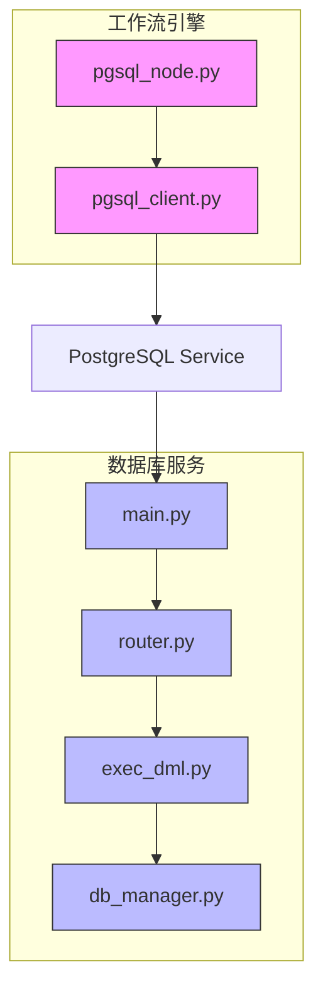
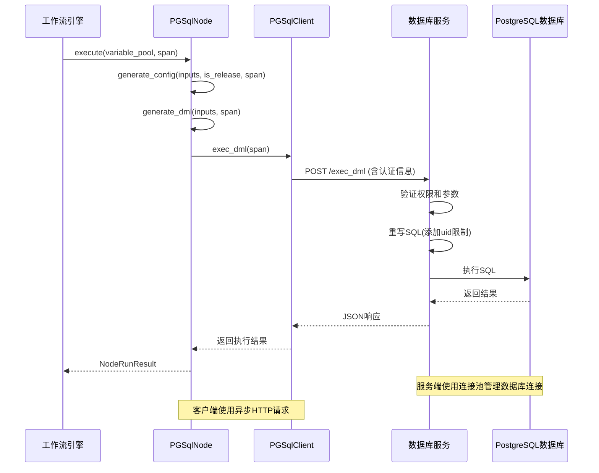
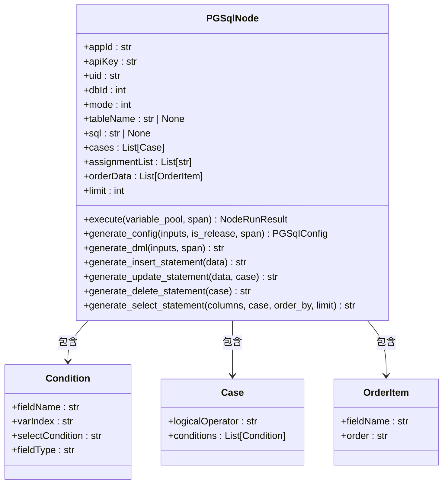
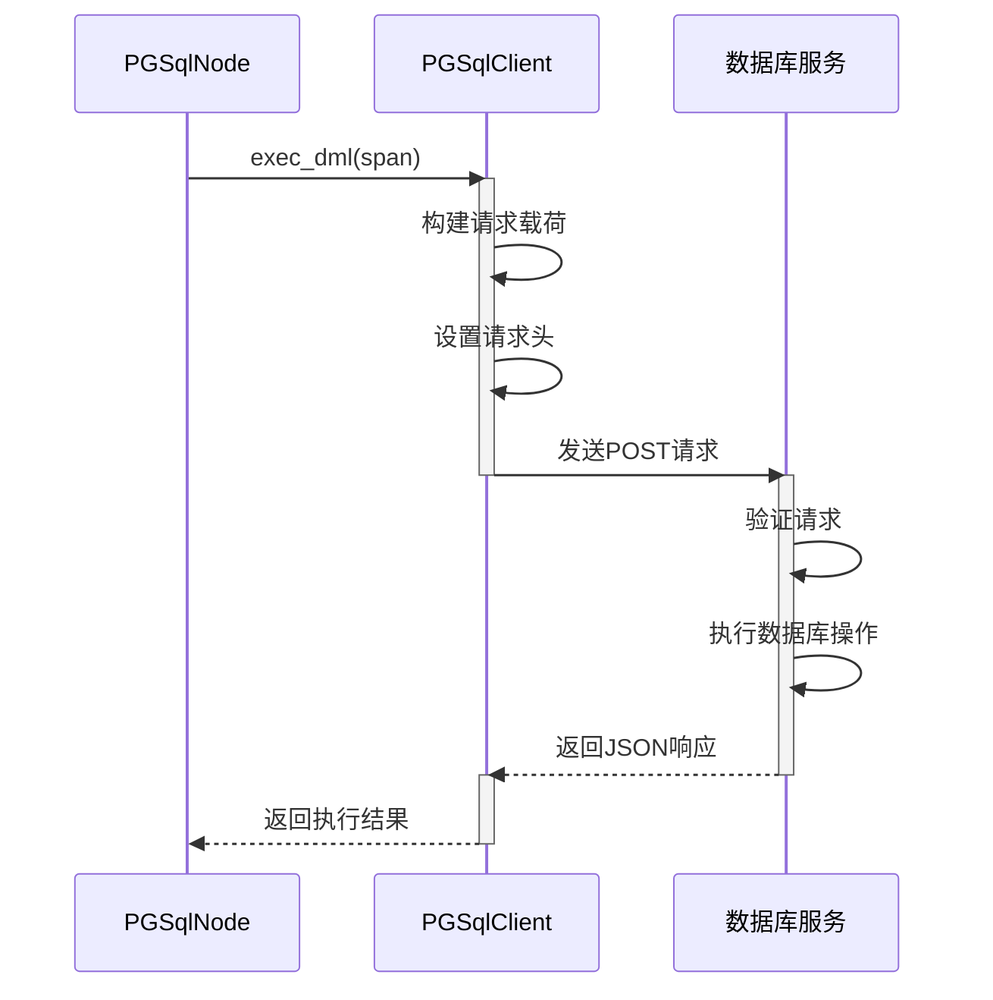
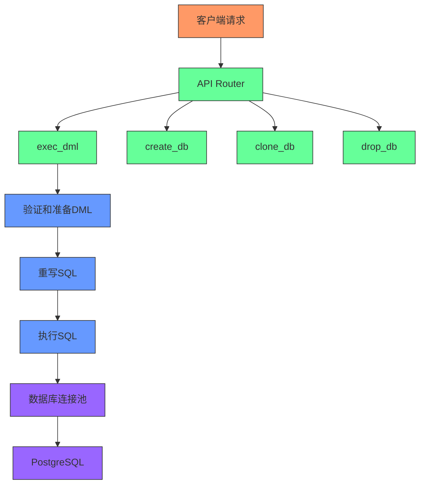
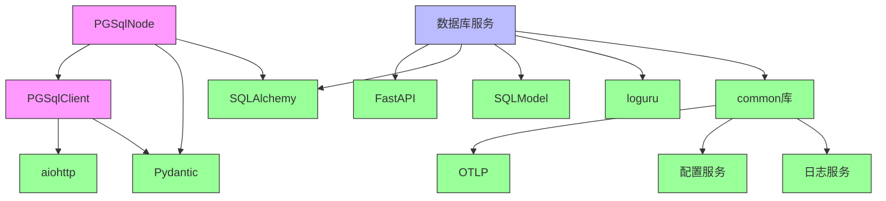

# 数据库节点

<cite>
**本文档中引用的文件**  
- [pgsql_node.py](file://core/workflow/engine/nodes/pgsql/pgsql_node.py)
- [pgsql_client.py](file://core/workflow/engine/nodes/pgsql/pgsql_client.py)
- [main.py](file://core/memory/database/main.py)
- [db_manager.py](file://core/memory/database/repository/middleware/database/db_manager.py)
- [exec_dml.py](file://core/memory/database/api/v1/exec_dml.py)
- [exec_dml_types.py](file://core/memory/database/api/schemas/exec_dml_types.py)
- [db_operator.py](file://core/memory/database/api/v1/db_operator.py)
- [http_resp.py](file://core/memory/database/domain/entity/views/http_resp.py)
</cite>

## 目录
1. [简介](#简介)
2. [项目结构](#项目结构)
3. [核心组件](#核心组件)
4. [架构概述](#架构概述)
5. [详细组件分析](#详细组件分析)
6. [依赖分析](#依赖分析)
7. [性能考虑](#性能考虑)
8. [故障排除指南](#故障排除指南)
9. [结论](#结论)

## 简介
本文档详细介绍了astron-agent项目中数据库节点的实现，重点分析了pgsql_node.py的核心功能。该节点作为工作流引擎的一部分，提供了与PostgreSQL数据库服务的集成能力，支持执行SQL查询和更新操作。文档将深入探讨节点如何通过参数化查询执行各种数据库操作，包括数据查询、插入、更新和删除。同时，文档将解释节点与memory/database服务的集成方式、API调用机制、连接池管理、事务处理和错误恢复策略。此外，还将提供数据库连接配置的详细说明，展示各种使用场景的示例，并讨论安全考虑和性能优化建议。

## 项目结构
数据库节点功能分布在多个模块中，形成了清晰的分层架构。核心工作流引擎位于`core/workflow`目录下，其中`core/workflow/engine/nodes/pgsql`包含pgsql_node.py和pgsql_client.py等核心文件。数据库服务实现位于`core/memory/database`目录，提供了REST API接口和底层数据库操作。这种分离的设计使得工作流引擎可以独立于具体的数据库实现，通过标准化的API进行通信。

**图源**  
- [pgsql_node.py](file://core/workflow/engine/nodes/pgsql/pgsql_node.py)
- [pgsql_client.py](file://core/workflow/engine/nodes/pgsql/pgsql_client.py)
- [main.py](file://core/memory/database/main.py)
- [router.py](file://core/memory/database/api/router.py)
- [exec_dml.py](file://core/memory/database/api/v1/exec_dml.py)
- [db_manager.py](file://core/memory/database/repository/middleware/database/db_manager.py)

**节源**  
- [pgsql_node.py](file://core/workflow/engine/nodes/pgsql/pgsql_node.py)
- [main.py](file://core/memory/database/main.py)

## 核心组件
数据库节点的核心组件包括pgsql_node.py中的PGSqlNode类，负责处理工作流中的数据库操作请求；pgsql_client.py中的PGSqlClient类，作为与数据库服务通信的客户端；以及memory/database服务中的API端点，处理具体的数据库操作。PGSqlNode类实现了BaseNode接口，提供了异步执行方法，能够根据配置的模式（查询、插入、更新、删除或自定义SQL）生成相应的SQL语句并执行。PGSqlClient类封装了与数据库服务的HTTP通信，处理认证、请求构建和响应解析。数据库服务端通过FastAPI框架暴露REST API，使用SQLAlchemy进行异步数据库操作，并通过连接池管理数据库连接。

**节源**  
- [pgsql_node.py](file://core/workflow/engine/nodes/pgsql/pgsql_node.py#L1-L667)
- [pgsql_client.py](file://core/workflow/engine/nodes/pgsql/pgsql_client.py#L1-L161)
- [exec_dml.py](file://core/memory/database/api/v1/exec_dml.py#L1-L456)

## 架构概述
数据库节点的架构采用分层设计，分为工作流层、客户端层和服务层。工作流层的PGSqlNode负责解析节点配置，根据操作模式生成相应的数据库操作指令。客户端层的PGSqlClient将这些指令转换为HTTP请求，通过API与数据库服务通信。服务层的memory/database服务接收请求，验证权限，执行SQL操作，并返回结果。整个架构通过OTLP（OpenTelemetry Protocol）实现分布式追踪，每个操作都有对应的Span记录执行过程，便于监控和调试。

**图源**  
- [pgsql_node.py](file://core/workflow/engine/nodes/pgsql/pgsql_node.py#L1-L667)
- [pgsql_client.py](file://core/workflow/engine/nodes/pgsql/pgsql_client.py#L1-L161)
- [exec_dml.py](file://core/memory/database/api/v1/exec_dml.py#L1-L456)

## 详细组件分析
### PGSqlNode分析
PGSqlNode是工作流中执行数据库操作的核心节点，继承自BaseNode类。它支持五种操作模式：自定义SQL（CUSTOM）、添加（ADD）、更新（UPDATE）、搜索（SEARCH）和删除（DELETE）。节点通过Pydantic模型进行配置验证，确保输入参数的正确性。在执行过程中，节点首先根据输入变量替换占位符，然后根据操作模式生成相应的SQL语句。对于INSERT操作，节点会生成包含所有字段的INSERT语句；对于UPDATE和DELETE操作，节点会根据WHERE条件生成相应的语句；对于SELECT操作，节点会根据指定的列、排序和限制条件生成查询语句。

#### PGSqlNode类图

**图源**  
- [pgsql_node.py](file://core/workflow/engine/nodes/pgsql/pgsql_node.py#L1-L667)

**节源**  
- [pgsql_node.py](file://core/workflow/engine/nodes/pgsql/pgsql_node.py#L1-L667)

### PGSqlClient分析
PGSqlClient是与数据库服务通信的客户端，负责将数据库操作请求发送到memory/database服务。客户端使用PGSqlConfig对象封装所有必要的连接参数，包括应用ID、API密钥、数据库ID、用户ID、空间ID和要执行的DML语句。客户端通过环境变量PGSQL_BASE_URL确定服务地址，使用Bearer Token进行认证，并在请求头中包含X-Consumer-Username用于标识调用者。客户端使用aiohttp库进行异步HTTP通信，确保不会阻塞工作流的执行。

#### PGSqlClient序列图

**图源**  
- [pgsql_client.py](file://core/workflow/engine/nodes/pgsql/pgsql_client.py#L1-L161)

**节源**  
- [pgsql_client.py](file://core/workflow/engine/nodes/pgsql/pgsql_client.py#L1-L161)

### 数据库服务分析
数据库服务是独立的FastAPI应用，提供RESTful API接口供客户端调用。服务使用SQLAlchemy的异步功能与PostgreSQL数据库通信，并通过连接池管理数据库连接，提高性能和资源利用率。服务实现了完整的CRUD操作，包括创建、克隆、删除数据库以及执行DML语句。所有API端点都实现了详细的错误处理和日志记录，确保系统的稳定性和可维护性。

#### 数据库服务架构图

**图源**  
- [main.py](file://core/memory/database/main.py#L1-L187)
- [exec_dml.py](file://core/memory/database/api/v1/exec_dml.py#L1-L456)
- [db_manager.py](file://core/memory/database/repository/middleware/database/db_manager.py#L1-L133)

## 依赖分析
数据库节点的依赖关系清晰地展示了各组件之间的交互。PGSqlNode依赖于PGSqlClient进行服务调用，PGSqlClient依赖于aiohttp库进行HTTP通信。数据库服务端依赖于FastAPI框架、SQLAlchemy ORM和PostgreSQL数据库。所有组件都依赖于common库中的工具函数和服务，如OTLP追踪、日志记录和配置管理。这种依赖关系确保了组件之间的松耦合，便于维护和扩展。

**图源**  
- [pgsql_node.py](file://core/workflow/engine/nodes/pgsql/pgsql_node.py)
- [pgsql_client.py](file://core/workflow/engine/nodes/pgsql/pgsql_client.py)
- [main.py](file://core/memory/database/main.py)
- [requirements.txt](file://requirements.txt) (隐式依赖)

## 性能考虑
数据库节点在设计时充分考虑了性能因素。客户端使用异步HTTP请求，避免阻塞工作流执行。服务端使用连接池管理数据库连接，减少连接建立的开销。SQL语句的生成和执行都经过优化，使用SQLAlchemy的text()函数和bindparams()方法防止SQL注入，同时提高执行效率。对于SELECT操作，服务端默认添加LIMIT 100限制，防止返回过多数据影响性能。此外，系统通过OTLP监控各项性能指标，如请求处理时间、数据库执行时间和错误率，便于及时发现和解决性能瓶颈。

## 故障排除指南
当数据库节点出现问题时，可以从以下几个方面进行排查：首先检查环境变量PGSQL_BASE_URL是否正确设置；其次验证应用ID、API密钥和数据库ID是否有效；然后检查输入参数是否符合要求，特别是SQL语句的语法是否正确；最后查看日志和追踪信息，定位具体的错误原因。常见的错误包括数据库连接失败、权限不足、SQL语法错误和超时等。系统提供了详细的错误码和错误信息，帮助快速定位和解决问题。

**节源**  
- [pgsql_client.py](file://core/workflow/engine/nodes/pgsql/pgsql_client.py#L1-L161)
- [exec_dml.py](file://core/memory/database/api/v1/exec_dml.py#L1-L456)
- [http_resp.py](file://core/memory/database/domain/entity/views/http_resp.py#L1-L83)

## 结论
数据库节点作为astron-agent工作流引擎的重要组成部分，提供了强大而灵活的数据库操作能力。通过分层架构设计，节点实现了与数据库服务的松耦合，支持多种数据库操作模式和参数化查询。系统的安全机制有效防止了SQL注入等常见攻击，而性能优化措施确保了高效的数据处理能力。详细的错误处理和监控功能使得系统更加稳定可靠。未来可以考虑增加更多的数据库操作模式，如批量插入和事务支持，进一步提升节点的功能性和实用性。