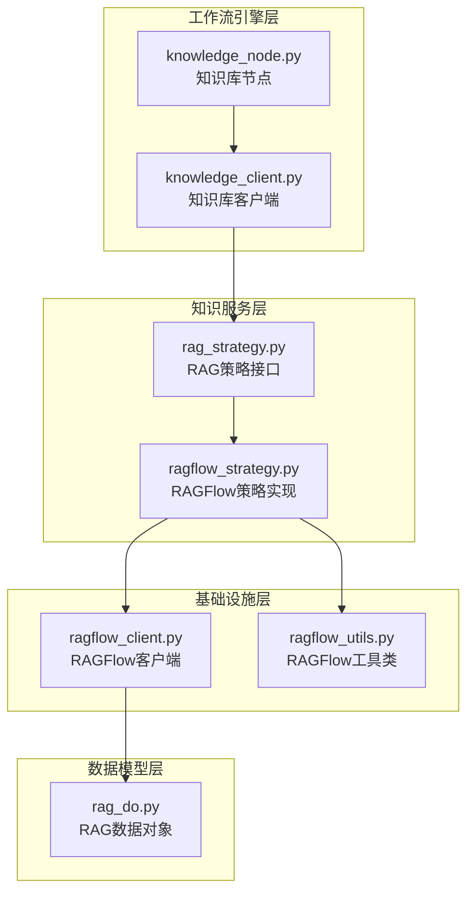
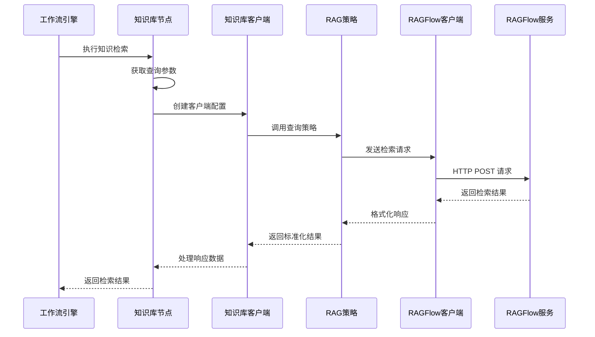
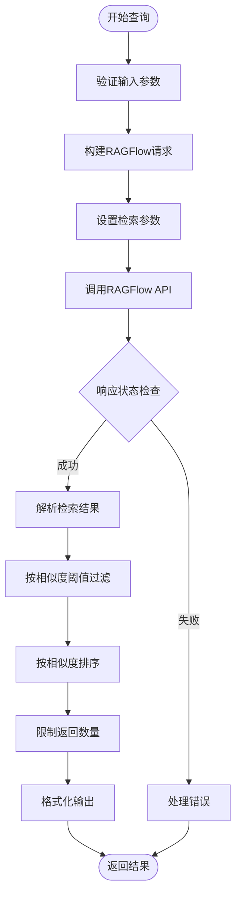
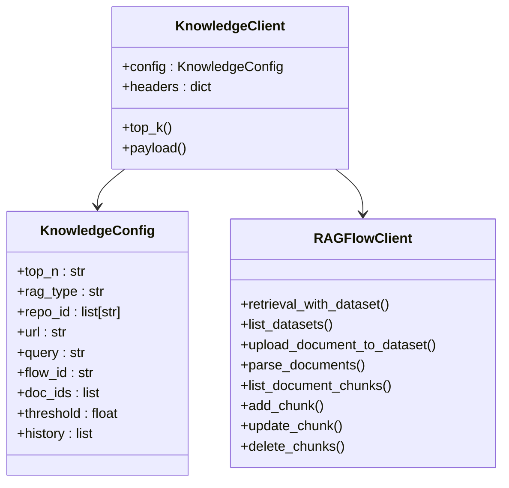
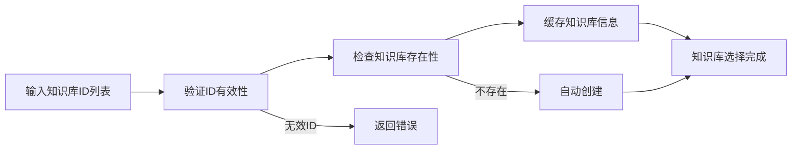
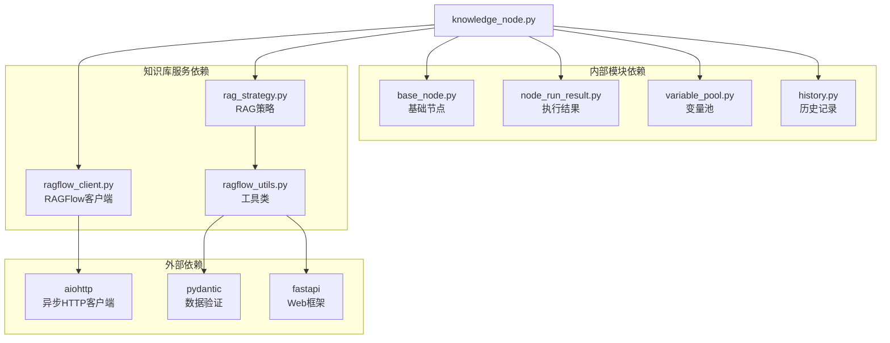
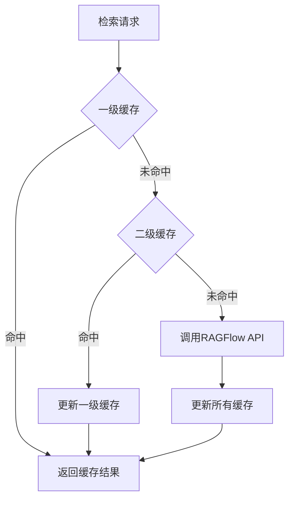

# 知识库节点技术文档

<cite>
**本文档中引用的文件**
- [knowledge_node.py](file://core/workflow/engine/nodes/knowledge/knowledge_node.py)
- [knowledge_client.py](file://core/workflow/engine/nodes/knowledge/knowledge_client.py)
- [ragflow_client.py](file://core/knowledge/infra/ragflow/ragflow_client.py)
- [ragflow_strategy.py](file://core/knowledge/service/impl/ragflow_strategy.py)
- [ragflow_utils.py](file://core/knowledge/infra/ragflow/ragflow_utils.py)
- [rag_do.py](file://core/knowledge/domain/entity/rag_do.py)
- [rag_strategy.py](file://core/knowledge/service/rag_strategy.py)
- [base_node.py](file://core/workflow/engine/nodes/base_node.py)
- [ragflow_strategy_test.py](file://core/knowledge/tests/service/impl/ragflow_strategy_test.py)
</cite>

## 目录
1. [简介](#简介)
2. [项目结构](#项目结构)
3. [核心组件](#核心组件)
4. [架构概览](#架构概览)
5. [详细组件分析](#详细组件分析)
6. [依赖关系分析](#依赖关系分析)
7. [性能考虑](#性能考虑)
8. [故障排除指南](#故障排除指南)
9. [结论](#结论)

## 简介

知识库节点是 Astron Agent 工作流引擎中的核心组件，专门负责实现检索增强生成（RAG）功能。该节点通过与 RAGFlow 知识库服务集成，能够执行语义搜索、文档检索和智能问答等功能。本文档详细介绍了知识库节点的技术实现、配置方法和使用场景。

## 项目结构

知识库节点的实现分布在多个模块中，形成了清晰的分层架构：

**图表来源**
- [knowledge_node.py](file://core/workflow/engine/nodes/knowledge/knowledge_node.py#L1-L176)
- [knowledge_client.py](file://core/workflow/engine/nodes/knowledge/knowledge_client.py#L1-L153)
- [rag_strategy.py](file://core/knowledge/service/rag_strategy.py#L1-L87)
- [ragflow_strategy.py](file://core/knowledge/service/impl/ragflow_strategy.py#L1-L1016)

**章节来源**
- [knowledge_node.py](file://core/workflow/engine/nodes/knowledge/knowledge_node.py#L1-L176)
- [ragflow_strategy.py](file://core/knowledge/service/impl/ragflow_strategy.py#L1-L1016)

## 核心组件

### 知识库节点（KnowledgeNode）

知识库节点是整个 RAG 功能的核心入口，继承自基础节点类，提供了完整的知识检索能力。

#### 主要特性：
- **异步执行**：支持非阻塞的知识检索操作
- **多知识库支持**：可同时查询多个知识库
- **灵活配置**：支持多种检索参数配置
- **历史记录集成**：可结合聊天历史进行上下文检索

#### 关键配置参数：

| 参数名称 | 类型 | 默认值 | 描述 |
|---------|------|--------|------|
| topN | str | "5" | 返回的最相关结果数量 |
| ragType | str | "AIUI-RAG2" | 使用的 RAG 类型 |
| repoId | list[str] | 必需 | 要搜索的知识库 ID 列表 |
| docIds | list | [] | 特定文档 ID 列表（可选） |
| score | float | 0.1 | 最小相似度阈值 |
| enableChatHistoryV2 | EnableChatHistoryV2 | 启用 | 是否启用聊天历史 |

**章节来源**
- [knowledge_node.py](file://core/workflow/engine/nodes/knowledge/knowledge_node.py#L18-L35)

### 知识库客户端（KnowledgeClient）

知识库客户端负责与知识库服务的实际通信，封装了 HTTP 请求逻辑。

#### 核心功能：
- **请求构建**：根据配置参数构建 API 请求
- **响应处理**：解析和验证 API 响应
- **错误处理**：统一的异常处理机制

**章节来源**
- [knowledge_client.py](file://core/workflow/engine/nodes/knowledge/knowledge_client.py#L54-L153)

## 架构概览

知识库节点采用分层架构设计，确保了良好的可维护性和扩展性：

**图表来源**
- [knowledge_node.py](file://core/workflow/engine/nodes/knowledge/knowledge_node.py#L58-L120)
- [knowledge_client.py](file://core/workflow/engine/nodes/knowledge/knowledge_client.py#L65-L120)
- [ragflow_strategy.py](file://core/knowledge/service/impl/ragflow_strategy.py#L30-L80)

## 详细组件分析

### 查询向量化和相似性搜索

知识库节点通过以下流程实现高效的查询向量化和相似性搜索：

**图表来源**
- [ragflow_strategy.py](file://core/knowledge/service/impl/ragflow_strategy.py#L30-L80)
- [ragflow_utils.py](file://core/knowledge/infra/ragflow/ragflow_utils.py#L60-L100)

#### 检索参数配置

知识库节点支持丰富的检索参数配置，以满足不同的业务需求：

| 参数类别 | 参数名称 | 配置方式 | 作用 |
|---------|----------|----------|------|
| 基础参数 | query | 输入变量池 | 查询字符串 |
| 数量控制 | top_k | topN 字段 | 返回结果数量 |
| 质量控制 | threshold | score 字段 | 相似度阈值 |
| 知识库范围 | repo_id | repoId 字段 | 指定知识库 |
| 文档范围 | doc_ids | docIds 字段 | 指定文档 |
| 上下文 | history | enableChatHistoryV2 | 聊天历史 |

**章节来源**
- [ragflow_strategy.py](file://core/knowledge/service/impl/ragflow_strategy.py#L30-L80)

### 与 RAGFlow 知识库服务的集成

知识库节点通过 RAGFlow 客户端实现与知识库服务的深度集成：

#### API 调用机制

**图表来源**
- [ragflow_client.py](file://core/knowledge/infra/ragflow/ragflow_client.py#L1-L829)
- [knowledge_client.py](file://core/workflow/engine/nodes/knowledge/knowledge_client.py#L9-L51)

#### 结果处理策略

知识库节点实现了多层次的结果处理策略：

1. **原始数据获取**：从 RAGFlow 服务获取原始检索结果
2. **质量过滤**：基于相似度阈值过滤低质量结果
3. **格式转换**：将 RAGFlow 格式转换为标准格式
4. **排序优化**：按相似度分数重新排序结果

**章节来源**
- [ragflow_utils.py](file://core/knowledge/infra/ragflow/ragflow_utils.py#L60-L100)

### 知识库选择和配置

#### 知识库 ID 管理

知识库节点支持灵活的知识库选择机制：

**图表来源**
- [ragflow_utils.py](file://core/knowledge/infra/ragflow/ragflow_utils.py#L100-L150)

#### 检索参数优化

为了提高检索效果，知识库节点提供了多种参数优化策略：

| 优化策略 | 实现方式 | 效果 |
|---------|----------|------|
| 相似度阈值调整 | 动态设置 threshold 参数 | 提高结果质量 |
| 结果数量限制 | top_k 参数控制 | 平衡质量和性能 |
| 文档范围限定 | doc_ids 参数指定 | 缩小搜索范围 |
| 上下文增强 | enableChatHistoryV2 集成 | 提供更多上下文信息 |

**章节来源**
- [knowledge_node.py](file://core/workflow/engine/nodes/knowledge/knowledge_node.py#L80-L100)

## 依赖关系分析

知识库节点的依赖关系体现了清晰的分层架构：

**图表来源**
- [knowledge_node.py](file://core/workflow/engine/nodes/knowledge/knowledge_node.py#L1-L20)
- [ragflow_client.py](file://core/knowledge/infra/ragflow/ragflow_client.py#L1-L50)

**章节来源**
- [knowledge_node.py](file://core/workflow/engine/nodes/knowledge/knowledge_node.py#L1-L20)
- [ragflow_client.py](file://core/knowledge/infra/ragflow/ragflow_client.py#L1-L50)

## 性能考虑

### 索引优化策略

为了提高检索性能，知识库节点采用了多种优化策略：

1. **连接池管理**：使用 aiohttp 的连接池减少连接开销
2. **会话复用**：缓存 HTTP 会话避免重复建立连接
3. **并发控制**：限制最大并发连接数防止资源耗尽
4. **超时配置**：合理设置请求超时时间

### 缓存策略

知识库节点实现了多级缓存机制：

### 性能监控指标

| 指标名称 | 监控目的 | 优化建议 |
|---------|----------|----------|
| 请求响应时间 | 检测网络延迟 | 优化超时配置 |
| 并发请求数 | 监控系统负载 | 调整连接池大小 |
| 错误率 | 质量监控 | 增强错误处理 |
| 缓存命中率 | 性能优化 | 调整缓存策略 |

## 故障排除指南

### 常见问题及解决方案

#### 1. 知识库连接失败

**症状**：API 调用返回连接错误
**原因**：网络问题或服务不可用
**解决方案**：
- 检查 RAGFlow 服务状态
- 验证网络连接
- 查看环境变量配置

#### 2. 检索结果为空

**症状**：查询成功但无匹配结果
**原因**：相似度阈值过高或知识库为空
**解决方案**：
- 降低 score 阈值
- 检查知识库内容
- 验证查询语句

#### 3. 性能问题

**症状**：检索响应缓慢
**原因**：并发过高或网络延迟
**解决方案**：
- 优化并发配置
- 调整超时参数
- 启用缓存机制

**章节来源**
- [ragflow_client.py](file://core/knowledge/infra/ragflow/ragflow_client.py#L200-L300)
- [knowledge_node.py](file://core/workflow/engine/nodes/knowledge/knowledge_node.py#L120-L176)

## 结论

知识库节点作为 Astron Agent 中的核心组件，通过精心设计的架构和完善的功能实现了高效的检索增强生成能力。其主要优势包括：

1. **模块化设计**：清晰的分层架构便于维护和扩展
2. **灵活配置**：丰富的参数配置满足不同业务需求
3. **高性能**：优化的网络请求和缓存机制保证性能
4. **稳定性**：完善的错误处理和重试机制确保可靠性

通过本文档的详细介绍，开发者可以深入理解知识库节点的工作原理，并能够有效地配置和使用这一强大的功能组件。随着系统的不断发展，知识库节点将继续演进，为用户提供更加智能和高效的知识检索服务。