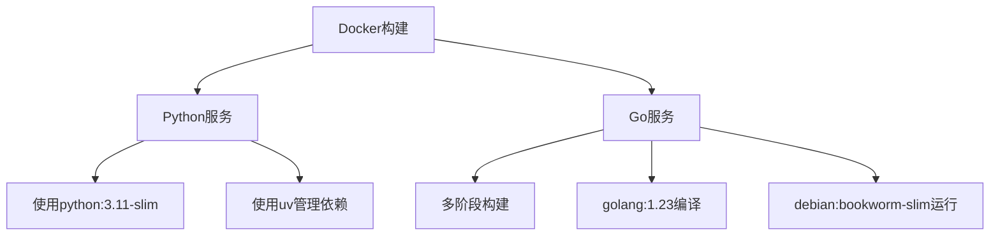
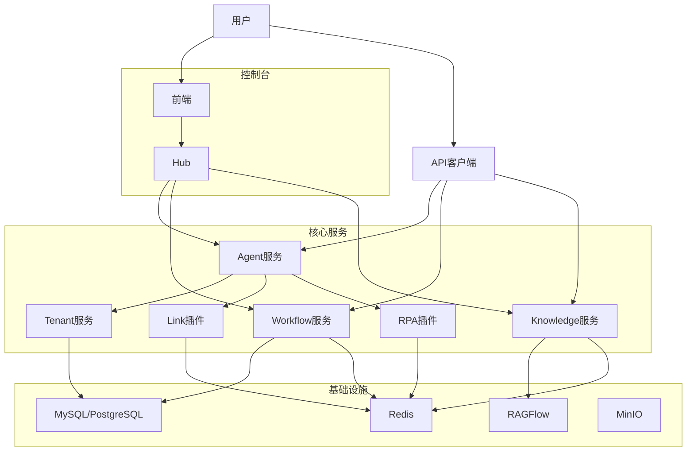
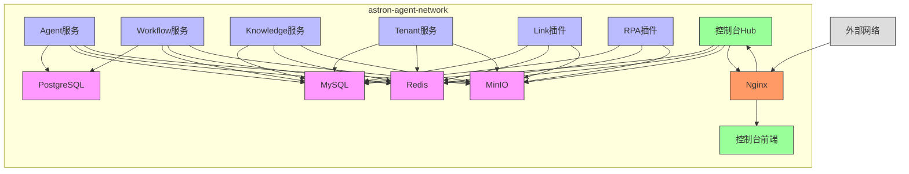

# 微服务概览

<cite>
**本文档引用的文件**  
- [docker-compose.yaml](file://docker/astronAgent/docker-compose.yaml)
- [main.py](file://core/agent/main.py)
- [main.py](file://core/workflow/main.py)
- [main.py](file://core/knowledge/main.py)
- [server.go](file://core/tenant/app/server.go)
- [app.py](file://core/agent/api/app.py)
- [router.py](file://core/workflow/api/v1/router.py)
- [api.py](file://core/knowledge/api/v1/api.py)
- [Dockerfile](file://core/agent/Dockerfile)
- [Dockerfile](file://core/workflow/Dockerfile)
- [Dockerfile](file://core/knowledge/Dockerfile)
- [Dockerfile](file://core/tenant/Dockerfile)
- [package.json](file://console/frontend/package.json)
- [pom.xml](file://console/backend/pom.xml)
</cite>

## 目录
1. [系统架构概述](#系统架构概述)
2. [微服务职责划分](#微服务职责划分)
3. [服务间通信机制](#服务间通信机制)
4. [容器化部署与编排](#容器化部署与编排)
5. [基础设施组件](#基础设施组件)
6. [微服务架构优势](#微服务架构优势)
7. [系统上下文图](#系统上下文图)
8. [容器部署图](#容器部署图)

## 系统架构概述

astron-agent平台采用微服务架构设计，将系统功能分解为多个独立的服务组件，每个服务负责特定的业务领域。该架构基于Docker和Docker Compose实现服务编排，通过RESTful API进行服务间通信，并利用多种基础设施组件提供缓存、消息队列、对象存储等支持。

系统主要由核心微服务、基础设施服务和控制台服务三大部分组成。核心微服务包括Agent、Workflow、Knowledge、Tenant、Plugin等服务，分别处理智能代理、工作流引擎、知识库管理、租户管理和插件集成等核心功能。基础设施服务提供数据库、缓存、消息队列和对象存储等基础支持。控制台服务则提供用户界面和管理功能。

**Section sources**
- [docker-compose.yaml](file://docker/astronAgent/docker-compose.yaml)

## 微服务职责划分

### Agent服务
Agent服务是平台的核心组件之一，负责处理智能代理的创建、配置和运行。该服务基于Python和FastAPI框架构建，提供RESTful API接口用于代理的生命周期管理。Agent服务与其他服务紧密协作，通过HTTP调用获取工作流定义、知识库数据和插件功能。

**Section sources**
- [main.py](file://core/agent/main.py)
- [app.py](file://core/agent/api/app.py)

### Workflow服务
Workflow服务作为工作流引擎，负责管理和执行复杂的业务流程。该服务同样基于Python和FastAPI框架，提供工作流的创建、调试、执行和监控功能。Workflow服务支持多种路由配置，包括/v1、/workflow/v1和/sparkflow/v1等不同版本的API端点，确保向后兼容性。

**Section sources**
- [main.py](file://core/workflow/main.py)
- [router.py](file://core/workflow/api/v1/router.py)

### Knowledge服务
Knowledge服务专注于知识库管理，提供文档分割、知识块存储、更新、删除和查询等功能。该服务实现RAG（检索增强生成）相关API接口，支持多种知识库策略。服务通过工厂模式动态选择合适的RAG策略来处理不同的知识库类型。

**Section sources**
- [main.py](file://core/knowledge/main.py)
- [api.py](file://core/knowledge/api/v1/api.py)

### Tenant服务
Tenant服务负责租户管理，基于Go语言和Gin框架构建。该服务处理租户的创建、配置和认证，为多租户架构提供支持。服务提供健康检查接口（/ping）和路由初始化功能，确保与其他服务的集成。

**Section sources**
- [server.go](file://core/tenant/app/server.go)

### Plugin服务
Plugin服务包含多个插件类型，如RPA、Link和AI Tools，提供特定领域的功能扩展。这些插件服务通过标准化接口与核心系统集成，支持自动化流程、外部系统连接和AI工具调用等功能。

**Section sources**
- [docker-compose.yaml](file://docker/astronAgent/docker-compose.yaml)

## 服务间通信机制

astron-agent平台的微服务之间主要通过RESTful API进行通信。每个服务暴露特定的HTTP端点，其他服务通过HTTP客户端调用这些端点来实现功能协作。

### RESTful API调用
服务间通信采用标准的HTTP协议，使用GET、POST、PUT、DELETE等方法进行数据交互。例如，Agent服务通过HTTP调用获取工作流定义（GET_WORKFLOWS_URL）和知识库数据（CHUNK_QUERY_URL）。API调用通常包含认证信息和特定的请求头，确保安全性和正确路由。

### 环境变量配置
服务间的通信地址通过环境变量进行配置，实现了配置与代码的分离。在docker-compose.yaml文件中，每个服务都定义了与其他服务通信的URL环境变量，如GET_LINK_URL、GET_WORKFLOWS_URL、CHUNK_QUERY_URL等。这种设计使得服务可以在不同环境中灵活部署，而无需修改代码。

### 错误处理与重试
服务间通信包含完善的错误处理机制。当API调用失败时，调用方服务会根据错误类型进行相应的处理，可能包括重试、降级或返回用户友好的错误信息。部分服务还实现了断路器模式，防止故障在服务间传播。

**Section sources**
- [docker-compose.yaml](file://docker/astronAgent/docker-compose.yaml)
- [app.py](file://core/agent/api/app.py)
- [api.py](file://core/knowledge/api/v1/api.py)

## 容器化部署与编排

### Docker实现
每个微服务都通过Dockerfile进行容器化打包。不同服务根据其技术栈采用不同的基础镜像：Python服务使用python:3.11-slim基础镜像，而Go服务则使用golang:1.23进行编译，最终部署到轻量级的debian:bookworm-slim镜像中。

容器化过程中，使用uv工具管理Python依赖，通过uv export和uv pip install命令安装依赖包。Go服务采用多阶段构建，先在builder阶段编译二进制文件，再将其复制到运行时镜像中，有效减小了最终镜像的大小。

**Diagram sources**
- [Dockerfile](file://core/agent/Dockerfile)
- [Dockerfile](file://core/workflow/Dockerfile)
- [Dockerfile](file://core/knowledge/Dockerfile)
- [Dockerfile](file://core/tenant/Dockerfile)

### Docker Compose编排
平台使用Docker Compose进行服务编排，通过docker-compose.yaml文件定义所有服务的配置。编排文件包含基础设施服务、核心服务和控制台服务三大类。

服务编排的关键特性包括：
- **依赖管理**：通过depends_on配置确保服务启动顺序，如核心服务依赖数据库和缓存服务健康运行
- **网络配置**：所有服务共享astron-agent-network网络，实现容器间通信
- **卷挂载**：配置数据卷用于持久化存储，如数据库数据、日志文件和配置文件
- **健康检查**：为关键服务配置健康检查，确保服务正常运行

**Section sources**
- [docker-compose.yaml](file://docker/astronAgent/docker-compose.yaml)

## 基础设施组件

### 服务发现
平台通过Docker Compose的内部DNS机制实现服务发现。服务间通过服务名称进行通信，如core-workflow、core-knowledge等。这种基于容器网络的服务发现机制简化了服务间调用的配置。

### 配置管理
配置管理采用环境变量驱动的方式，通过.env文件或Docker Compose的environment配置传递参数。核心配置包括数据库连接、端口设置、认证信息等。部分服务还使用配置文件，如Tenant服务的config.toml。

### 健康检查
关键服务都配置了健康检查机制，确保服务的可用性。数据库服务通过pg_isready或mysqladmin ping命令检查，缓存服务通过redis-cli ping检查，应用服务通过HTTP端点检查。健康检查的配置包括间隔时间、超时时间和重试次数。

### 监控与追踪
平台集成OTLP（OpenTelemetry Protocol）支持分布式追踪和指标收集。服务通过OTLP_ENDPOINT配置将追踪数据发送到集中式监控系统。每个服务初始化时注册OTLP服务，实现请求级别的追踪和性能监控。

**Section sources**
- [docker-compose.yaml](file://docker/astronAgent/docker-compose.yaml)
- [main.py](file://core/agent/main.py)
- [main.py](file://core/workflow/main.py)

## 微服务架构优势

### 可扩展性
微服务架构提供了良好的可扩展性。每个服务可以独立水平扩展，根据负载需求调整实例数量。例如，高负载的Agent服务可以增加多个实例，而低负载的Tenant服务保持单实例运行。Docker Compose的workers配置支持多进程运行，进一步提升单个服务的处理能力。

### 独立部署
各微服务可以独立开发、测试和部署，降低了发布风险。团队可以采用不同的技术栈开发不同服务，如Python用于AI相关服务，Go用于高性能服务。CI/CD流程可以针对单个服务进行，加快迭代速度。

### 故障隔离
微服务架构实现了故障隔离。一个服务的故障不会直接影响其他服务的运行。通过服务依赖的健康检查和超时配置，系统能够快速检测和处理故障。例如，数据库服务故障时，依赖它的核心服务会等待其恢复，而控制台服务仍可正常访问。

### 技术多样性
架构支持技术多样性，不同服务可以根据需求选择最适合的技术栈。Python服务用于AI和数据处理，Go服务用于高性能后端，Java服务用于控制台后端，React用于前端界面。这种技术多样性使每个服务都能发挥最佳性能。

**Section sources**
- [docker-compose.yaml](file://docker/astronAgent/docker-compose.yaml)
- [pom.xml](file://console/backend/pom.xml)
- [package.json](file://console/frontend/package.json)

## 系统上下文图

**Diagram sources**
- [docker-compose.yaml](file://docker/astronAgent/docker-compose.yaml)

## 容器部署图

**Diagram sources**
- [docker-compose.yaml](file://docker/astronAgent/docker-compose.yaml)