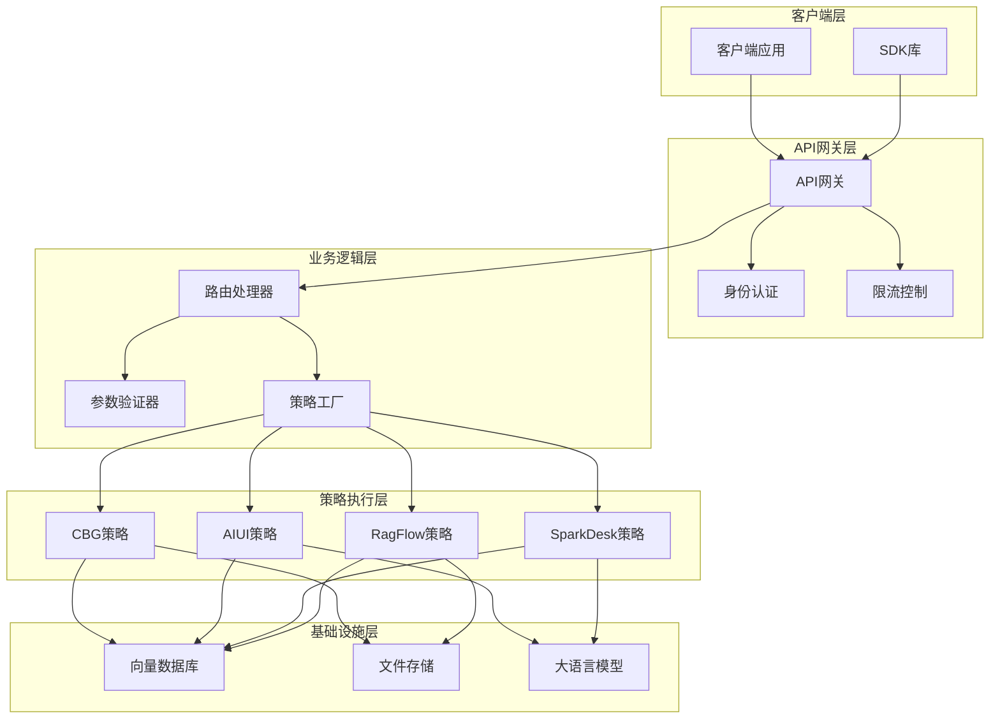
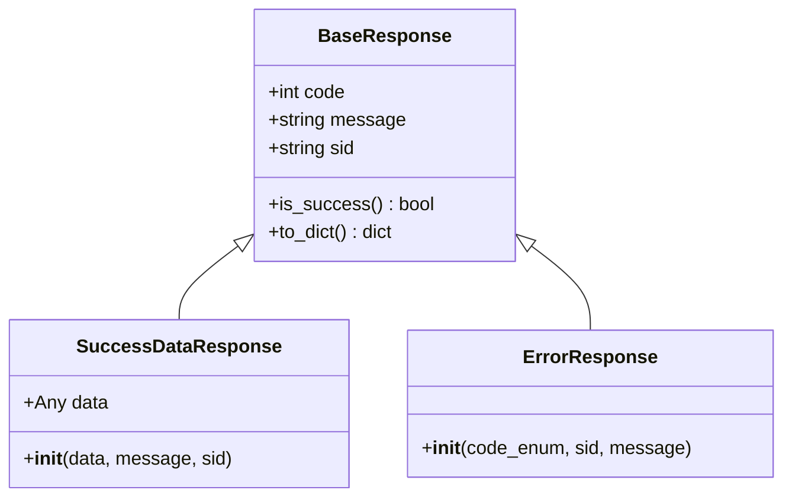
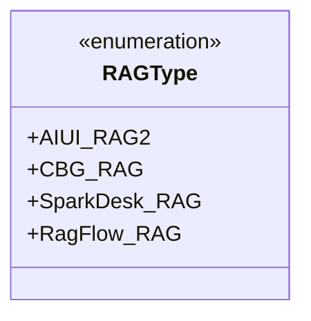

# 知识库服务API参考文档

<cite>
**本文档中引用的文件**
- [api.py](file://core/knowledge/api/v1/api.py)
- [response.py](file://core/knowledge/domain/response.py)
- [constants.py](file://core/knowledge/consts/constants.py)
- [error_code.py](file://core/knowledge/consts/error_code.py)
- [chunk_dto.py](file://core/knowledge/domain/entity/chunk_dto.py)
- [rag_do.py](file://core/knowledge/domain/entity/rag_do.py)
- [rag_strategy_factory.py](file://core/knowledge/service/rag_strategy_factory.py)
- [rag_strategy.py](file://core/knowledge/service/rag_strategy.py)
- [cbg_strategy.py](file://core/knowledge/service/impl/cbg_strategy.py)
- [ragflow_strategy.py](file://core/knowledge/service/impl/ragflow_strategy.py)
</cite>

## 目录
1. [简介](#简介)
2. [系统架构](#系统架构)
3. [响应格式规范](#响应格式规范)
4. [错误代码说明](#错误代码说明)
5. [API端点详解](#api端点详解)
6. [数据模型定义](#数据模型定义)
7. [使用示例](#使用示例)
8. [最佳实践](#最佳实践)

## 简介

astron-agent知识库服务提供了完整的RAG（检索增强生成）功能API接口，支持文档上传、分块处理、知识库管理、向量检索等核心操作。该服务采用模块化设计，支持多种RAG后端策略（CBG-RAG、AIUI-RAG2、SparkDesk-RAG、RagFlow-RAG），为不同场景提供灵活的知识管理解决方案。

## 系统架构



**图表来源**
- [api.py](file://core/knowledge/api/v1/api.py#L1-L50)
- [rag_strategy_factory.py](file://core/knowledge/service/rag_strategy_factory.py#L1-L30)

## 响应格式规范

所有API响应都遵循统一的标准格式，确保客户端能够一致地处理返回结果。

### 基础响应结构



**图表来源**
- [response.py](file://core/knowledge/domain/response.py#L10-L58)

### 成功响应格式

| 字段名 | 类型 | 必填 | 描述 |
|--------|------|------|------|
| code | int | 是 | 响应状态码，0表示成功 |
| message | string | 是 | 响应消息，成功时通常为"success" |
| sid | string | 否 | 分布式追踪ID，用于链路追踪 |
| data | Any | 否 | 实际业务数据，根据具体接口而定 |

### 错误响应格式

| 字段名 | 类型 | 必填 | 描述 |
|--------|------|------|------|
| code | int | 是 | 错误状态码 |
| message | string | 是 | 错误消息描述 |
| sid | string | 否 | 分布式追踪ID |

**章节来源**
- [response.py](file://core/knowledge/domain/response.py#L1-L58)

## 错误代码说明

系统定义了完整的错误代码体系，涵盖参数校验、业务异常、第三方服务调用等各种场景。

### 参数校验错误

| 错误代码 | 错误名称 | 描述 |
|----------|----------|------|
| 10001 | ParameterCheckException | 参数校验异常 |
| 10002 | MissingParameter | 缺少必要参数 |
| 10003 | ParameterInvalid | 参数无效 |

### RAG操作错误

| 错误代码 | 错误名称 | 描述 |
|----------|----------|------|
| 10016 | FileSplitFailed | 文件分割失败 |
| 10017 | ChunkSaveFailed | 块保存失败 |
| 10018 | ChunkUpdateFailed | 块更新失败 |
| 10019 | ChunkDeleteFailed | 块删除失败 |
| 10020 | ChunkQueryFailed | 块查询失败 |

### 第三方服务错误

| 错误代码 | 错误名称 | 描述 |
|----------|----------|------|
| 10024 | GetFileContentFailed | 文件内容获取失败 |
| 10025 | FileStorageError | 文件存储失败 |
| 10026 | CBG_RAGError | 星火知识库请求失败 |
| 10027 | AIUI_RAGError | AIUI知识库请求失败 |
| 10028 | DESK_RAGError | 星火桌面知识库请求失败 |

### 系统级错误

| 错误代码 | 错误名称 | 描述 |
|----------|----------|------|
| 11111 | ThirdPartyServiceFailed | 第三方服务调用失败 |
| 14999 | ServiceException | 服务异常 |

**章节来源**
- [error_code.py](file://core/knowledge/consts/error_code.py#L1-L47)

## API端点详解

### 文档分割接口

#### 接口描述
解析用户提供的文本内容，然后进行分块处理。

#### HTTP方法
POST `/knowledge/v1/document/split`

#### 请求参数

| 参数名 | 类型 | 必填 | 描述 | 示例值 |
|--------|------|------|------|--------|
| file | string | 是 | 文件内容或路径 | "文档内容..." |
| resourceType | int | 否 | 资源类型：0-普通文件，1-URL网页 | 0 |
| ragType | RAGType | 是 | RAG类型枚举 | "CBG-RAG" |
| lengthRange | List[int] | 否 | 分割长度范围 | [256, 1024] |
| overlap | int | 否 | 重叠长度 | 16 |
| separator | List[string] | 否 | 分隔符列表 | ["\n", ". "] |
| cutOff | List[string] | 否 | 截断标记列表 | ["---", "***"] |
| titleSplit | bool | 否 | 是否按标题分割 | false |

#### 请求体示例
```json
{
  "file": "这是一段测试文档内容...",
  "resourceType": 0,
  "ragType": "CBG-RAG",
  "lengthRange": [256, 1024],
  "overlap": 16,
  "separator": ["\n", ". ", "。"],
  "titleSplit": false
}
```

#### 响应格式
成功时返回分块后的文档信息数组，包含每个块的详细内容和元数据。

**章节来源**
- [api.py](file://core/knowledge/api/v1/api.py#L130-L170)

### 文件上传接口

#### 接口描述
支持表单数据模式的文件上传和分块处理。

#### HTTP方法
POST `/knowledge/v1/document/upload`

#### 请求参数

| 参数名 | 类型 | 必填 | 描述 | 示例值 |
|--------|------|------|------|--------|
| file | UploadFile | 是 | 上传的文件对象 | - |
| ragType | RAGType | 是 | RAG类型枚举 | "CBG-RAG" |
| lengthRange | string | 否 | 长度范围JSON字符串 | "[256, 1024]" |
| separator | string | 否 | 分隔符JSON字符串 | "[\"\\n\", \". \"]" |

#### 请求体示例
使用multipart/form-data格式上传文件：
```
Content-Disposition: form-data; name="file"; filename="document.txt"
Content-Type: text/plain

文件内容...

Content-Disposition: form-data; name="ragType"
CBG-RAG

Content-Disposition: form-data; name="lengthRange"
[256, 1024]
```

#### 响应格式
返回文件处理结果，包括文档ID和分块信息。

**章节来源**
- [api.py](file://core/knowledge/api/v1/api.py#L200-L250)

### 块保存接口

#### 接口描述
将分块数据保存到数据库，或添加新的块。

#### HTTP方法
POST `/knowledge/v1/chunks/save`

#### 请求参数

| 参数名 | 类型 | 必填 | 描述 |
|--------|------|------|------|
| docId | string | 是 | 文档ID |
| group | string | 是 | 组标识符 |
| uid | string | 否 | 用户ID |
| chunks | List[Any] | 是 | 块列表，至少包含一个元素 |
| ragType | RAGType | 是 | RAG类型 |

#### 请求体示例
```json
{
  "docId": "doc_12345",
  "group": "group_abc",
  "uid": "user_67890",
  "chunks": [
    {
      "content": "这是第一个块的内容",
      "metadata": {
        "chunk_id": "chunk_1",
        "position": 1
      }
    }
  ],
  "ragType": "CBG-RAG"
}
```

#### 响应格式
返回保存操作的结果，包含成功保存的块数量或其他相关信息。

**章节来源**
- [api.py](file://core/knowledge/api/v1/api.py#L252-L290)

### 块更新接口

#### 接口描述
更新知识库中的块信息。

#### HTTP方法
POST `/knowledge/v1/chunk/update`

#### 请求参数

| 参数名 | 类型 | 必填 | 描述 |
|--------|------|------|------|
| docId | string | 是 | 文档ID |
| group | string | 是 | 组标识符 |
| uid | string | 否 | 用户ID |
| chunks | List[dict] | 是 | 块字典列表，至少包含一个元素 |
| ragType | RAGType | 是 | RAG类型 |

#### 请求体示例
```json
{
  "docId": "doc_12345",
  "group": "group_abc",
  "uid": "user_67890",
  "chunks": [
    {
      "chunkId": "chunk_1",
      "content": "更新后的内容",
      "metadata": {
        "updated_at": "2024-01-01T10:00:00Z"
      }
    }
  ],
  "ragType": "CBG-RAG"
}
```

#### 响应格式
返回更新操作的结果，包含更新成功的块数量。

**章节来源**
- [api.py](file://core/knowledge/api/v1/api.py#L292-L330)

### 块删除接口

#### 接口描述
删除知识库中的块。

#### HTTP方法
POST `/knowledge/v1/chunk/delete`

#### 请求参数

| 参数名 | 类型 | 必填 | 描述 |
|--------|------|------|------|
| docId | string | 是 | 文档ID |
| chunkIds | List[string] | 否 | 块ID列表 |
| ragType | RAGType | 是 | RAG类型 |

#### 请求体示例
```json
{
  "docId": "doc_12345",
  "chunkIds": ["chunk_1", "chunk_2"],
  "ragType": "CBG-RAG"
}
```

#### 响应格式
返回删除操作的结果，包含删除成功的块数量。

**章节来源**
- [api.py](file://core/knowledge/api/v1/api.py#L332-L370)

### 块查询接口

#### 接口描述
基于用户输入内容检索相似的文档块。

#### HTTP方法
POST `/knowledge/v1/chunk/query`

#### 请求参数

| 参数名 | 类型 | 必填 | 描述 |
|--------|------|------|------|
| query | string | 是 | 查询文本 |
| topN | int | 是 | 返回结果数量，范围1~5 |
| match | QueryMatch | 是 | 匹配条件 |
| ragType | RAGType | 是 | RAG类型 |

#### QueryMatch参数

| 参数名 | 类型 | 必填 | 描述 |
|--------|------|------|------|
| docIds | List[string] | 否 | 文档ID列表 |
| repoId | List[string] | 是 | 知识库ID列表，至少包含一个元素 |
| threshold | float | 否 | 相似度阈值，范围0~1，默认0 |
| flowId | string | 否 | 流程ID |

#### 请求体示例
```json
{
  "query": "人工智能的发展历史",
  "topN": 3,
  "match": {
    "repoId": ["repo_123"],
    "threshold": 0.7
  },
  "ragType": "CBG-RAG"
}
```

#### 响应格式
返回查询结果数组，每个结果包含相似度分数、文档信息和上下文内容。

**章节来源**
- [api.py](file://core/knowledge/api/v1/api.py#L372-L410)

### 文档查询接口

#### 接口描述
查询文档块信息。

#### HTTP方法
POST `/knowledge/v1/document/chunk`

#### 请求参数

| 参数名 | 类型 | 必填 | 描述 |
|--------|------|------|------|
| docId | string | 是 | 文档ID |
| ragType | RAGType | 是 | RAG类型 |

#### 请求体示例
```json
{
  "docId": "doc_12345",
  "ragType": "CBG-RAG"
}
```

#### 响应格式
返回文档的所有块信息列表。

**章节来源**
- [api.py](file://core/knowledge/api/v1/api.py#L412-L430)

### 文档名称查询接口

#### 接口描述
查询文档名称信息。

#### HTTP方法
POST `/knowledge/v1/document/name`

#### 请求参数

| 参数名 | 类型 | 必填 | 描述 |
|--------|------|------|------|
| docId | string | 是 | 文档ID |
| ragType | RAGType | 是 | RAG类型 |

#### 请求体示例
```json
{
  "docId": "doc_12345",
  "ragType": "CBG-RAG"
}
```

#### 响应格式
返回文档的名称和其他基本信息。

**章节来源**
- [api.py](file://core/knowledge/api/v1/api.py#L432-L450)

## 数据模型定义

### RAG类型枚举



**图表来源**
- [chunk_dto.py](file://core/knowledge/domain/entity/chunk_dto.py#L10-L15)

### 核心数据模型

#### FileSplitReq - 文件分割请求
| 字段名 | 类型 | 必填 | 描述 |
|--------|------|------|------|
| file | string | 是 | 文件内容或路径 |
| resourceType | int | 否 | 资源类型 |
| ragType | RAGType | 是 | RAG类型 |
| lengthRange | List[int] | 否 | 分割长度范围 |
| overlap | int | 否 | 重叠长度 |
| separator | List[string] | 否 | 分隔符列表 |
| cutOff | List[string] | 否 | 截断标记列表 |
| titleSplit | bool | 否 | 是否按标题分割 |

#### ChunkSaveReq - 块保存请求
| 字段名 | 类型 | 必填 | 描述 |
|--------|------|------|------|
| docId | string | 是 | 文档ID |
| group | string | 是 | 组标识符 |
| uid | string | 否 | 用户ID |
| chunks | List[Any] | 是 | 块列表 |
| ragType | RAGType | 是 | RAG类型 |

#### ChunkQueryReq - 块查询请求
| 字段名 | 类型 | 必填 | 描述 |
|--------|------|------|------|
| query | string | 是 | 查询文本 |
| topN | int | 是 | 结果数量 |
| match | QueryMatch | 是 | 匹配条件 |
| ragType | RAGType | 是 | RAG类型 |

#### QueryMatch - 查询匹配条件
| 字段名 | 类型 | 必填 | 描述 |
|--------|------|------|------|
| docIds | List[string] | 否 | 文档ID列表 |
| repoId | List[string] | 是 | 知识库ID列表 |
| threshold | float | 否 | 相似度阈值 |
| flowId | string | 否 | 流程ID |

**章节来源**
- [chunk_dto.py](file://core/knowledge/domain/entity/chunk_dto.py#L1-L163)

### 数据对象模型

#### ChunkInfo - 块信息
| 字段名 | 类型 | 描述 |
|--------|------|------|
| docId | Union[str, int] | 文档标识符 |
| chunkId | Union[int, str] | 块标识符 |
| content | string | 块内容 |

#### FileInfo - 文件信息
| 字段名 | 类型 | 描述 |
|--------|------|------|
| docId | Union[str, int] | 文档标识符 |
| fileName | string | 文件名称 |
| fileStatus | string | 文件状态 |
| fileQuantity | int | 文件数量 |

**章节来源**
- [rag_do.py](file://core/knowledge/domain/entity/rag_do.py#L1-L52)

## 使用示例

### curl命令示例

#### 1. 文件分割
```bash
curl -X POST "http://localhost:8000/knowledge/v1/document/split" \
  -H "Content-Type: application/json" \
  -H "app_id: your_app_id" \
  -d '{
    "file": "这是一段测试文档内容，包含多个段落和知识点。",
    "resourceType": 0,
    "ragType": "CBG-RAG",
    "lengthRange": [256, 1024],
    "overlap": 16,
    "separator": ["\n", ". ", "。"],
    "titleSplit": false
  }'
```

#### 2. 文件上传
```bash
curl -X POST "http://localhost:8000/knowledge/v1/document/upload" \
  -F "file=@document.pdf" \
  -F "ragType=CBG-RAG" \
  -F "lengthRange=[256, 1024]" \
  -F "separator=[\"\\n\", \". \"]" \
  -H "app_id: your_app_id"
```

#### 3. 块查询
```bash
curl -X POST "http://localhost:8000/knowledge/v1/chunk/query" \
  -H "Content-Type: application/json" \
  -H "app_id: your_app_id" \
  -d '{
    "query": "机器学习算法",
    "topN": 5,
    "match": {
      "repoId": ["knowledge_repo_123"],
      "threshold": 0.7
    },
    "ragType": "CBG-RAG"
  }'
```

### Python SDK示例

```python
import requests
import json

class KnowledgeAPIClient:
    def __init__(self, base_url, app_id):
        self.base_url = base_url
        self.app_id = app_id
        self.headers = {"app_id": app_id}
    
    def split_document(self, file_content, rag_type="CBG-RAG"):
        """分割文档"""
        url = f"{self.base_url}/knowledge/v1/document/split"
        payload = {
            "file": file_content,
            "resourceType": 0,
            "ragType": rag_type,
            "lengthRange": [256, 1024],
            "overlap": 16
        }
        response = requests.post(url, json=payload, headers=self.headers)
        return response.json()
    
    def query_chunks(self, query_text, repo_id, threshold=0.7):
        """查询相似块"""
        url = f"{self.base_url}/knowledge/v1/chunk/query"
        payload = {
            "query": query_text,
            "topN": 5,
            "match": {
                "repoId": [repo_id],
                "threshold": threshold
            },
            "ragType": "CBG-RAG"
        }
        response = requests.post(url, json=payload, headers=self.headers)
        return response.json()

# 使用示例
client = KnowledgeAPIClient("http://localhost:8000", "your_app_id")
result = client.split_document("这是一个测试文档内容...")
print(json.dumps(result, indent=2, ensure_ascii=False))
```

### JavaScript SDK示例

```javascript
class KnowledgeAPIClient {
    constructor(baseUrl, appId) {
        this.baseUrl = baseUrl;
        this.appId = appId;
        this.headers = {
            "Content-Type": "application/json",
            "app_id": appId
        };
    }
    
    async splitDocument(fileContent, ragType = "CBG-RAG") {
        const url = `${this.baseUrl}/knowledge/v1/document/split`;
        const payload = {
            file: fileContent,
            resourceType: 0,
            ragType: ragType,
            lengthRange: [256, 1024],
            overlap: 16
        };
        
        const response = await fetch(url, {
            method: "POST",
            headers: this.headers,
            body: JSON.stringify(payload)
        });
        
        return await response.json();
    }
    
    async queryChunks(queryText, repoId, threshold = 0.7) {
        const url = `${this.baseUrl}/knowledge/v1/chunk/query`;
        const payload = {
            query: queryText,
            topN: 5,
            match: {
                repoId: [repoId],
                threshold: threshold
            },
            ragType: "CBG-RAG"
        };
        
        const response = await fetch(url, {
            method: "POST",
            headers: this.headers,
            body: JSON.stringify(payload)
        });
        
        return await response.json();
    }
}

// 使用示例
const client = new KnowledgeAPIClient("http://localhost:8000", "your_app_id");
const result = await client.splitDocument("这是一个测试文档...");
console.log(JSON.stringify(result, null, 2));
```

## 最佳实践

### 1. 参数验证
- 始终验证必填参数的存在性和有效性
- 对于复杂参数（如JSON字符串），进行格式验证
- 设置合理的默认值和边界检查

### 2. 错误处理
- 捕获并处理所有可能的异常情况
- 提供有意义的错误消息给客户端
- 记录详细的日志以便问题排查

### 3. 性能优化
- 对于大量数据的操作，考虑分批处理
- 实现适当的缓存机制
- 监控API响应时间和资源使用情况

### 4. 安全考虑
- 验证文件类型和大小限制
- 实施适当的访问控制
- 加密敏感数据传输

### 5. 版本管理
- 保持API版本兼容性
- 渐进式弃用旧版本
- 提供清晰的迁移指南

### 6. 监控和日志
- 实施全面的监控指标
- 记录关键操作的日志
- 设置告警机制

通过遵循这些最佳实践，可以确保知识库服务API的稳定性、安全性和可维护性，为上层应用提供可靠的知识管理能力。