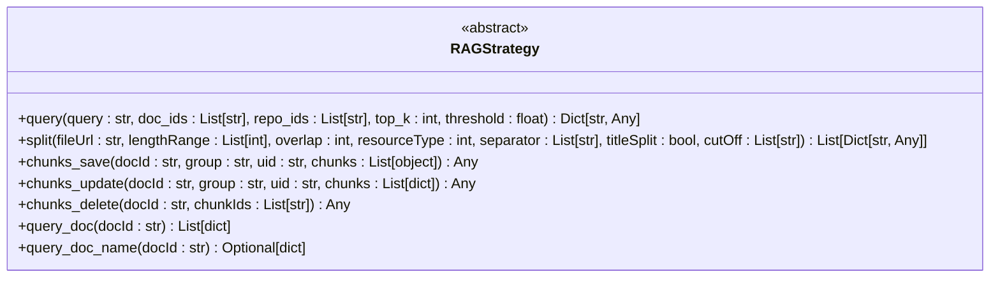
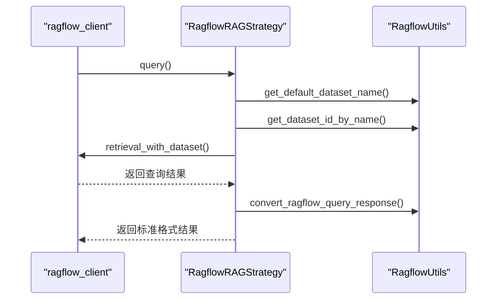
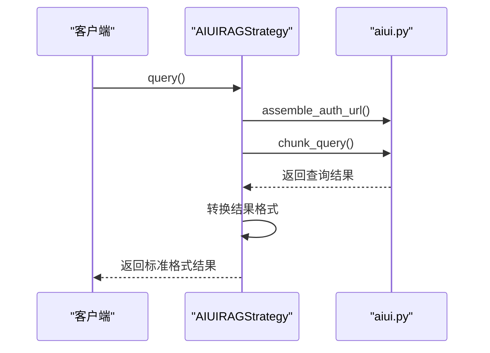
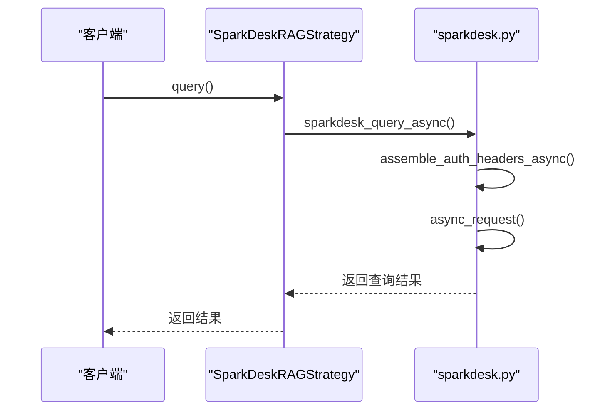
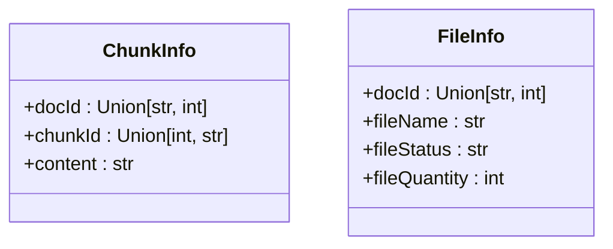
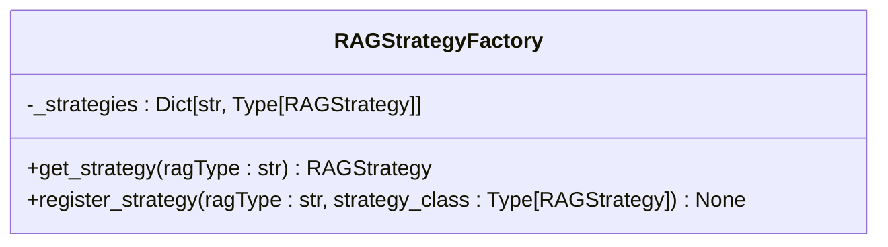

# RAG策略

<cite>
**本文档中引用的文件**   
- [rag_strategy.py](file://core/knowledge/service/rag_strategy.py)
- [ragflow_strategy.py](file://core/knowledge/service/impl/ragflow_strategy.py)
- [aiui_strategy.py](file://core/knowledge/service/impl/aiui_strategy.py)
- [sparkdesk_strategy.py](file://core/knowledge/service/impl/sparkdesk_strategy.py)
- [cbg_strategy.py](file://core/knowledge/service/impl/cbg_strategy.py)
- [rag_strategy_factory.py](file://core/knowledge/service/rag_strategy_factory.py)
- [ragflow_client.py](file://core/knowledge/infra/ragflow/ragflow_client.py)
- [ragflow_utils.py](file://core/knowledge/infra/ragflow/ragflow_utils.py)
- [aiui.py](file://core/knowledge/infra/aiui/aiui.py)
- [sparkdesk.py](file://core/knowledge/infra/desk/sparkdesk.py)
- [rag_do.py](file://core/knowledge/domain/entity/rag_do.py)
</cite>

## 目录
1. [引言](#引言)
2. [基础策略接口](#基础策略接口)
3. [RAGFlow策略实现](#ragflow策略实现)
4. [AIUI策略实现](#aiui策略实现)
5. [SparkDesk策略实现](#sparkdesk策略实现)
6. [CBG策略实现](#cbg策略实现)
7. [策略工厂与集成](#策略工厂与集成)
8. [策略选择指南](#策略选择指南)
9. [结论](#结论)

## 引言
本文档深入分析知识库服务的RAG（检索增强生成）策略实现，重点介绍不同策略的特性和适用场景。文档详细说明了`ragflow_strategy.py`的实现细节，包括与Ragflow系统的集成方式、API调用模式和数据同步机制。同时分析了`aiui_strategy.py`如何与AIUI系统交互处理语音和文本数据，描述了`sparkdesk_strategy.py`和`cbg_strategy.py`的实现特点。文档还解释了基础策略接口（`rag_strategy.py`）的契约定义，并提供策略选择指南，帮助开发者根据业务需求选择合适的知识库后端。

## 基础策略接口
`rag_strategy.py`文件定义了所有RAG策略类必须实现的抽象接口，采用抽象基类（ABC）模式确保所有具体策略实现的一致性。

**图表来源**
- [rag_strategy.py](file://core/knowledge/service/rag_strategy.py#L0-L86)

**本节来源**
- [rag_strategy.py](file://core/knowledge/service/rag_strategy.py#L0-L86)

## RAGFlow策略实现
`ragflow_strategy.py`实现了基于RAGFlow系统的RAG策略，提供了完整的文档处理和知识管理功能。

### 核心功能
RAGFlow策略实现了基础接口的所有方法，其核心功能包括：
- **查询功能**：通过`query`方法执行RAG查询，使用RAGFlow的检索API获取结果，并转换为标准格式。
- **文档分割**：通过`split`方法将文件分割成多个块，完整流程包括检查或创建数据集、文件下载/读取、上传文档、触发解析、等待解析完成和获取块结果。
- **块操作**：支持块的保存、更新和删除操作，通过`chunks_save`、`chunks_update`和`chunks_delete`方法实现。

### 实现细节
RAGFlow策略的实现依赖于`ragflow_client.py`和`ragflow_utils.py`两个辅助模块。`ragflow_client.py`提供了与RAGFlow API交互的功能调用接口，采用模块级会话管理和配置缓存机制。`ragflow_utils.py`则提供了文档处理的辅助方法，包括文件处理、配置构建和格式转换等。

**图表来源**
- [ragflow_strategy.py](file://core/knowledge/service/impl/ragflow_strategy.py#L0-L799)
- [ragflow_client.py](file://core/knowledge/infra/ragflow/ragflow_client.py#L0-L799)
- [ragflow_utils.py](file://core/knowledge/infra/ragflow/ragflow_utils.py#L0-L560)

**本节来源**
- [ragflow_strategy.py](file://core/knowledge/service/impl/ragflow_strategy.py#L0-L799)
- [ragflow_client.py](file://core/knowledge/infra/ragflow/ragflow_client.py#L0-L799)
- [ragflow_utils.py](file://core/knowledge/infra/ragflow/ragflow_utils.py#L0-L560)

## AIUI策略实现
`aiui_strategy.py`实现了基于AIUI系统的RAG策略，专门用于处理语音和文本数据的交互。

### 与AIUI系统交互
AIUI策略通过`aiui.py`模块与AIUI系统进行交互，主要功能包括：
- **查询功能**：通过`chunk_query`方法执行RAG查询，使用AIUI的认证机制组装请求URL。
- **文档解析**：通过`document_parse`方法解析文档，支持PDF、图片和URL等多种资源类型。
- **块分割**：通过`chunk_split`方法将文档分割成多个块，支持自定义分隔符和长度范围。

### 数据处理
AIUI策略在处理查询结果时，会将AIUI系统的响应转换为标准格式，包括提取分数、文档ID、标题、内容等信息。对于文档分割，策略会强制设置`titleSplit`为`True`，并使用默认的分隔符列表。

**图表来源**
- [aiui_strategy.py](file://core/knowledge/service/impl/aiui_strategy.py#L0-L269)
- [aiui.py](file://core/knowledge/infra/aiui/aiui.py#L0-L333)

**本节来源**
- [aiui_strategy.py](file://core/knowledge/service/impl/aiui_strategy.py#L0-L269)
- [aiui.py](file://core/knowledge/infra/aiui/aiui.py#L0-L333)

## SparkDesk策略实现
`sparkdesk_strategy.py`实现了基于讯飞星火大模型的RAG策略，主要提供查询功能。

### 功能特点
SparkDesk策略的实现相对简单，主要特点包括：
- **查询功能**：通过`sparkdesk_query_async`方法异步执行RAG查询，支持指定知识库ID列表。
- **限制**：该策略不支持文档分割、块保存、更新、删除等操作，所有相关方法均抛出`NotImplementedError`异常。

### API调用模式
SparkDesk策略采用异步HTTP请求模式，通过`async_request`方法发送请求，使用`assemble_auth_headers_async`方法构建认证请求头。请求头包含应用ID、时间戳和签名等信息，确保请求的安全性。

**图表来源**
- [sparkdesk_strategy.py](file://core/knowledge/service/impl/sparkdesk_strategy.py#L0-L177)
- [sparkdesk.py](file://core/knowledge/infra/desk/sparkdesk.py#L0-L169)

**本节来源**
- [sparkdesk_strategy.py](file://core/knowledge/service/impl/sparkdesk_strategy.py#L0-L177)
- [sparkdesk.py](file://core/knowledge/infra/desk/sparkdesk.py#L0-L169)

## CBG策略实现
`cbg_strategy.py`实现了基于星火大模型的RAG策略，提供了完整的RAG功能。

### 核心功能
CBG策略实现了基础接口的所有方法，其核心功能包括：
- **查询功能**：通过`new_topk_search`方法执行RAG查询，支持指定文档ID列表和topK值。
- **文档分割**：通过`upload`和`get_chunks`方法实现文档分割，支持自定义分隔符和长度范围。
- **块操作**：支持块的保存、更新和删除操作，通过`dataset_addchunk`、`dataset_updchunk`和`dataset_delchunk`方法实现。

### 数据模型
CBG策略使用`rag_do.py`中定义的数据模型类，包括`ChunkInfo`和`FileInfo`，用于表示文档块和文件信息。这些数据模型在查询文档内容和名称时被使用。

**图表来源**
- [cbg_strategy.py](file://core/knowledge/service/impl/cbg_strategy.py#L0-L374)
- [rag_do.py](file://core/knowledge/domain/entity/rag_do.py#L0-L52)

**本节来源**
- [cbg_strategy.py](file://core/knowledge/service/impl/cbg_strategy.py#L0-L374)
- [rag_do.py](file://core/knowledge/domain/entity/rag_do.py#L0-L52)

## 策略工厂与集成
`rag_strategy_factory.py`实现了RAG策略工厂，负责根据策略类型创建相应的策略实例。

### 工厂模式
策略工厂采用工厂模式，通过`get_strategy`方法根据`ragType`参数获取对应的策略实例。工厂内部维护了一个策略类的字典，支持的策略类型包括：
- "AIUI-RAG2"
- "SparkDesk-RAG"
- "CBG-RAG"
- "Ragflow-RAG"

### 策略注册
工厂还提供了`register_strategy`方法，允许注册新的RAG策略。该方法会检查策略类是否为`RAGStrategy`的子类，并确保不是抽象类，从而保证策略的可用性。

**图表来源**
- [rag_strategy_factory.py](file://core/knowledge/service/rag_strategy_factory.py#L0-L94)

**本节来源**
- [rag_strategy_factory.py](file://core/knowledge/service/rag_strategy_factory.py#L0-L94)

## 策略选择指南
根据不同的业务需求和技术特点，开发者可以选择合适的RAG策略：

### RAGFlow策略
适用于需要完整文档处理和知识管理功能的场景，如企业知识库、文档管理系统等。该策略提供了最全面的功能，包括文档分割、块操作和查询等。

### AIUI策略
适用于需要处理语音和文本数据的场景，如智能客服、语音助手等。该策略与AIUI系统深度集成，能够处理多种资源类型的文档。

### SparkDesk策略
适用于只需要查询功能的轻量级场景，如简单的问答系统。该策略不支持文档分割和块操作，但查询性能较好。

### CBG策略
适用于需要完整RAG功能且与星火大模型集成的场景，如智能问答、知识检索等。该策略提供了与RAGFlow策略类似的功能，但基于不同的后端系统。

## 结论
本文档详细分析了知识库服务的RAG策略实现，涵盖了RAGFlow、AIUI、SparkDesk和CBG四种策略。每种策略都有其特定的应用场景和技术特点，开发者应根据具体的业务需求选择合适的策略。RAGFlow策略提供了最全面的功能，适合复杂的知识管理场景；AIUI策略擅长处理语音和文本数据；SparkDesk策略轻量级，适合简单的查询需求；CBG策略则与星火大模型深度集成，适合需要高性能查询的场景。