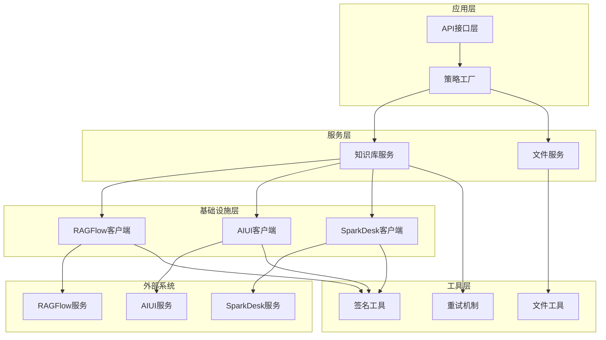
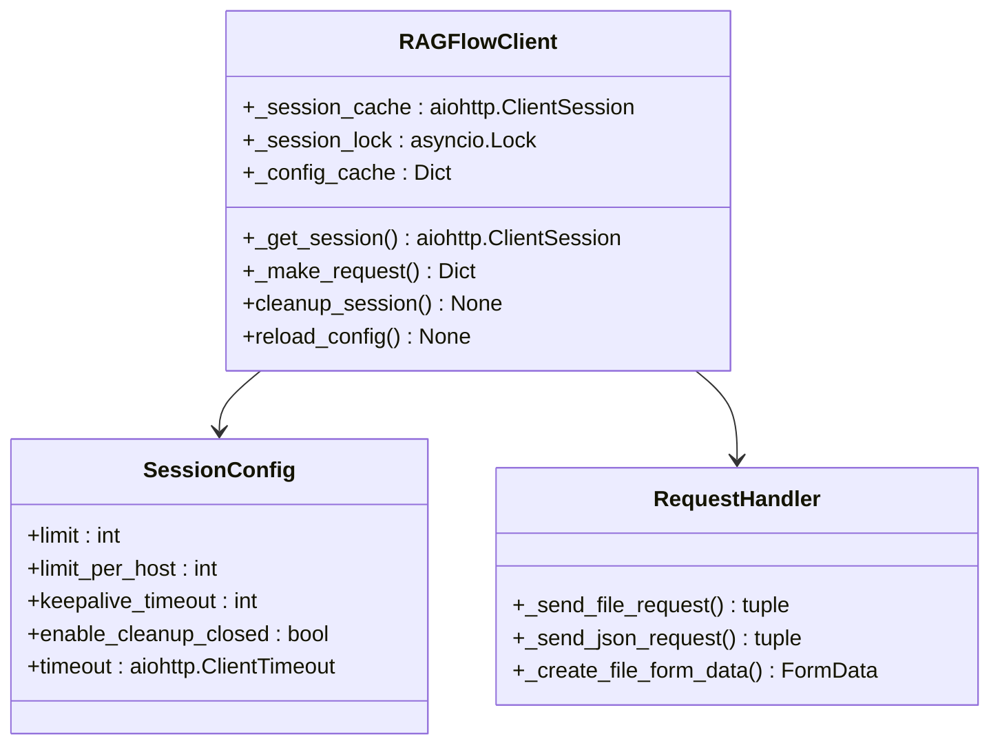
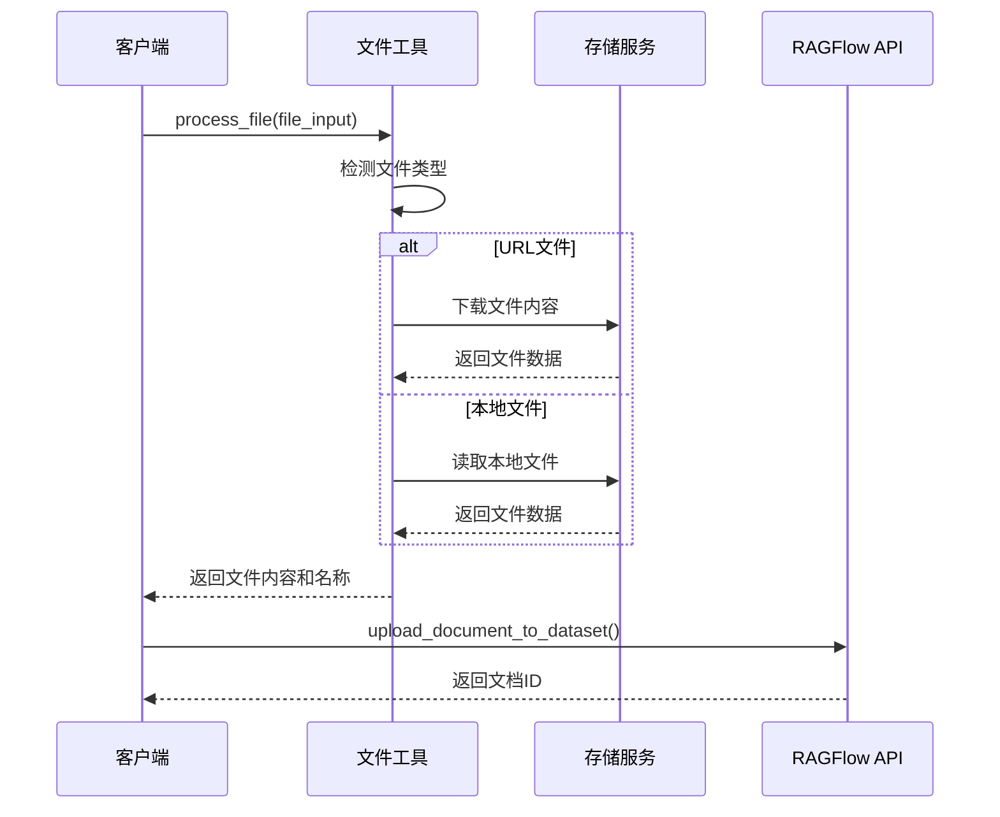
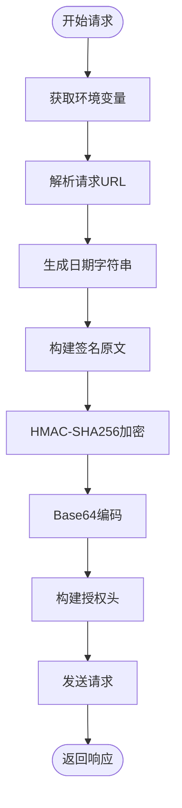
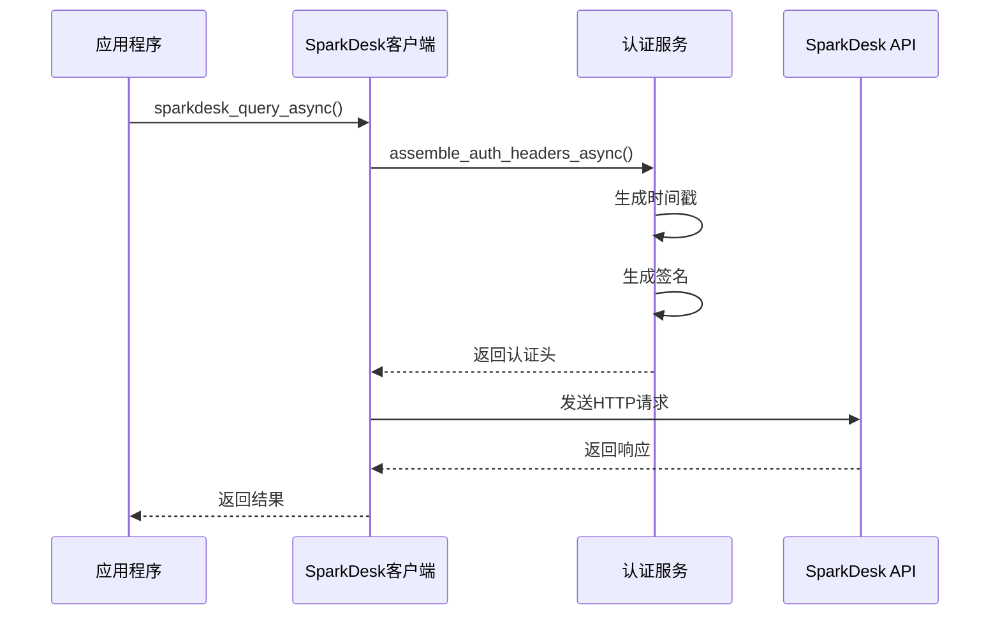
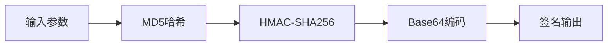
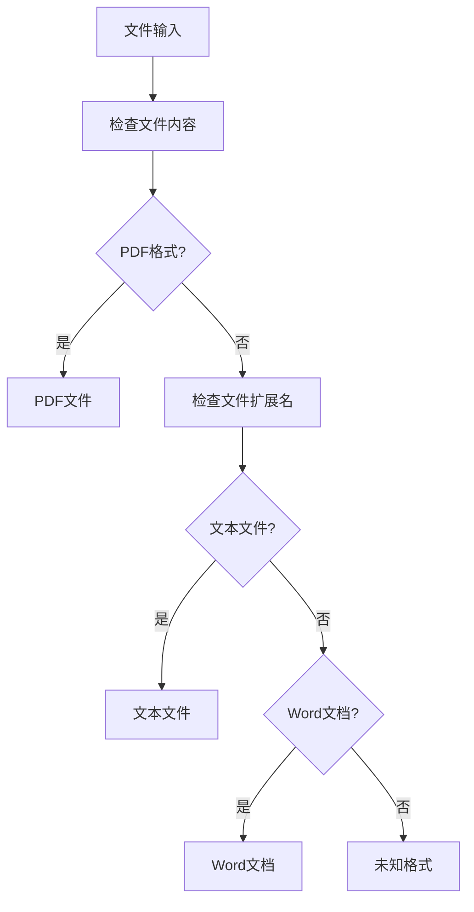
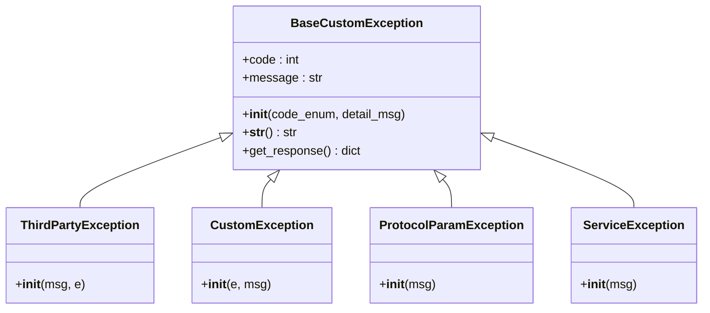
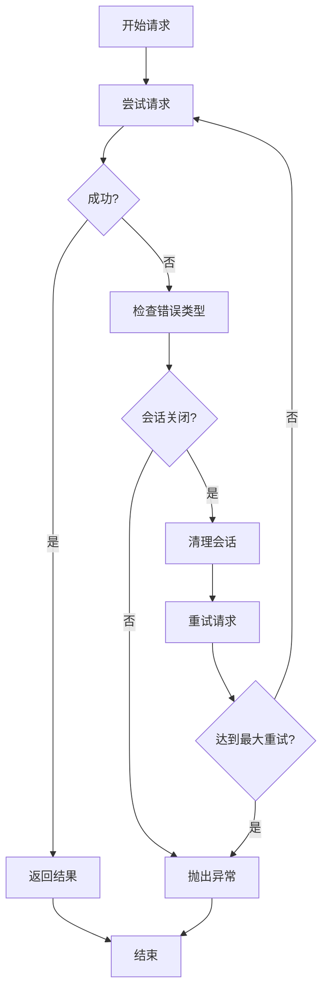
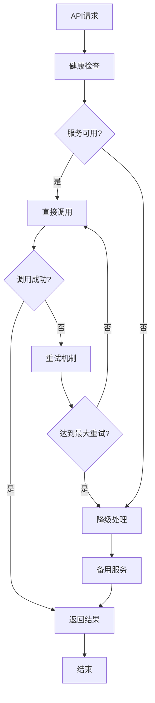

# 基础设施集成

<cite>
**本文档引用的文件**
- [ragflow_client.py](file://core/knowledge/infra/ragflow/ragflow_client.py)
- [ragflow_utils.py](file://core/knowledge/infra/ragflow/ragflow_utils.py)
- [spark_signature.py](file://core/knowledge/utils/spark_signature.py)
- [file_utils.py](file://core/knowledge/utils/file_utils.py)
- [aiui.py](file://core/knowledge/infra/aiui/aiui.py)
- [sparkdesk.py](file://core/knowledge/infra/desk/sparkdesk.py)
- [exception.py](file://core/knowledge/exceptions/exception.py)
- [error_code.py](file://core/knowledge/consts/error_code.py)
- [constants.py](file://core/knowledge/consts/constants.py)
- [ragflow_strategy.py](file://core/knowledge/service/impl/ragflow_strategy.py)
- [sparkdesk_strategy.py](file://core/knowledge/service/impl/sparkdesk_strategy.py)
</cite>

## 目录
1. [概述](#概述)
2. [系统架构](#系统架构)
3. [RAGFlow客户端集成](#ragflow客户端集成)
4. [外部API封装](#外部api封装)
5. [认证与安全](#认证与安全)
6. [文件处理机制](#文件处理机制)
7. [错误处理与重试策略](#错误处理与重试策略)
8. [网络配置最佳实践](#网络配置最佳实践)
9. [故障转移机制](#故障转移机制)
10. [性能优化建议](#性能优化建议)

## 概述

astron-agent的知识库服务采用模块化架构设计，通过多个专门的基础设施组件实现与外部系统的无缝集成。该系统支持多种知识库服务提供商，包括RAGFlow、AIUI和SparkDesk等，提供了统一的抽象接口和强大的容错能力。

核心特性：
- **多供应商支持**：同时集成RAGFlow、AIUI、SparkDesk等多个知识库服务
- **异步处理**：基于aiohttp的异步HTTP客户端，支持高并发请求
- **连接池管理**：智能连接池配置，优化网络资源利用率
- **自动重试**：内置指数退避重试机制，提高系统可靠性
- **签名验证**：完整的API签名和身份验证机制
- **文件处理**：统一的文件上传、下载和格式转换流程

## 系统架构



**图表来源**
- [ragflow_client.py](file://core/knowledge/infra/ragflow/ragflow_client.py#L1-L50)
- [aiui.py](file://core/knowledge/infra/aiui/aiui.py#L1-L50)
- [sparkdesk.py](file://core/knowledge/infra/desk/sparkdesk.py#L1-L50)

## RAGFlow客户端集成

### HTTP客户端配置

RAGFlow客户端实现了完整的HTTP通信基础设施，包括连接池管理、超时控制和会话缓存。

#### 连接池管理



**图表来源**
- [ragflow_client.py](file://core/knowledge/infra/ragflow/ragflow_client.py#L100-L150)

#### 请求签名机制

RAGFlow客户端使用基于API密钥的身份验证：

- **认证头格式**：`Authorization: Bearer {api_token}`
- **用户代理**：`OpenStellar-RAGFlow/1.0`
- **超时配置**：可配置的总超时时间，默认30秒

#### 重试策略

系统实现了智能重试机制：

1. **最大重试次数**：2次
2. **错误检测**：自动识别会话关闭错误
3. **指数退避**：每次重试间隔递增
4. **资源清理**：重试失败后清理会话资源

**章节来源**
- [ragflow_client.py](file://core/knowledge/infra/ragflow/ragflow_client.py#L200-L300)

### 文件处理流程



**图表来源**
- [ragflow_utils.py](file://core/knowledge/infra/ragflow/ragflow_utils.py#L200-L300)

**章节来源**
- [ragflow_utils.py](file://core/knowledge/infra/ragflow/ragflow_utils.py#L150-L250)

## 外部API封装

### AIUI客户端实现

AIUI客户端提供了完整的语音识别和文档处理功能，支持多种认证方式。

#### 认证机制



**图表来源**
- [aiui.py](file://core/knowledge/infra/aiui/aiui.py#L20-L50)

#### 支持的功能

- **文档解析**：支持PDF、图片等多种文件格式
- **分块查询**：基于语义相似度的文档检索
- **内容分割**：灵活的文本分块策略
- **批量操作**：支持文档和分块的批量管理

**章节来源**
- [aiui.py](file://core/knowledge/infra/aiui/aiui.py#L60-L120)

### SparkDesk客户端实现

SparkDesk客户端专注于大模型知识库的查询和交互。

#### 异步请求处理



**图表来源**
- [sparkdesk.py](file://core/knowledge/infra/desk/sparkdesk.py#L40-L80)

#### 签名算法

SparkDesk使用基于HMAC-SHA1的签名算法：

1. **输入参数**：appid、时间戳、api_secret
2. **MD5计算**：对appid+timestamp组合进行MD5哈希
3. **HMAC加密**：使用api_secret对MD5结果进行HMAC-SHA1加密
4. **Base64编码**：最终结果进行Base64编码

**章节来源**
- [sparkdesk.py](file://core/knowledge/infra/desk/sparkdesk.py#L120-L170)
- [spark_signature.py](file://core/knowledge/utils/spark_signature.py#L10-L69)

## 认证与安全

### 签名算法实现

系统实现了多种签名算法以确保API调用的安全性：

#### RAGFlow签名（Bearer Token）

- **格式**：`Authorization: Bearer {api_token}`
- **用途**：内部API访问控制
- **配置**：通过环境变量`RAGFLOW_API_TOKEN`设置

#### AIUI签名（HMAC-SHA256）



**图表来源**
- [aiui.py](file://core/knowledge/infra/aiui/aiui.py#L20-L50)

#### SparkDesk签名（HMAC-SHA1）

- **算法**：HMAC-SHA1
- **编码**：Base64
- **参数**：appid、timestamp、api_secret

**章节来源**
- [spark_signature.py](file://core/knowledge/utils/spark_signature.py#L10-L69)

### 环境变量配置

| 变量名 | 描述 | 默认值 | 必需 |
|--------|------|--------|------|
| `RAGFLOW_BASE_URL` | RAGFlow服务地址 | - | 是 |
| `RAGFLOW_API_TOKEN` | API访问令牌 | - | 是 |
| `RAGFLOW_TIMEOUT` | 请求超时时间(秒) | 30 | 否 |
| `AIUI_API_KEY` | AIUI API密钥 | - | 是 |
| `AIUI_API_SECRET` | AIUI API密钥 | - | 是 |
| `DESK_APP_ID` | SparkDesk应用ID | - | 是 |
| `DESK_API_SECRET` | SparkDesk API密钥 | - | 是 |

## 文件处理机制

### 文件类型检测

系统实现了智能的文件类型检测机制：



**图表来源**
- [ragflow_utils.py](file://core/knowledge/infra/ragflow/ragflow_utils.py#L500-L560)

### 文件上传流程

1. **输入验证**：检查文件路径或URL的有效性
2. **内容读取**：根据输入类型选择下载或本地读取
3. **格式转换**：确保文件内容为字节流格式
4. **表单构建**：创建multipart/form-data格式的请求体
5. **上传执行**：发送文件到目标服务

**章节来源**
- [ragflow_utils.py](file://core/knowledge/infra/ragflow/ragflow_utils.py#L250-L350)

### URL文件处理

对于远程文件，系统提供了完整的下载和验证机制：

- **HTTP状态检查**：验证下载成功
- **内容长度验证**：确保文件非空
- **文件名提取**：从URL或响应头中提取文件名
- **编码处理**：正确处理UTF-8编码的文件名

**章节来源**
- [ragflow_utils.py](file://core/knowledge/infra/ragflow/ragflow_utils.py#L180-L220)

## 错误处理与重试策略

### 异常层次结构



**图表来源**
- [exception.py](file://core/knowledge/exceptions/exception.py#L15-L50)

### 错误码定义

| 错误码 | 类型 | 描述 |
|--------|------|------|
| 10001 | 参数检查异常 | 参数验证失败 |
| 10026 | AIUI知识库错误 | AIUI服务请求失败 |
| 10027 | AIUI知识库错误 | AIUI服务请求失败 |
| 10028 | DESK知识库错误 | SparkDesk服务请求失败 |
| 11111 | 第三方服务失败 | 通用第三方服务错误 |

**章节来源**
- [error_code.py](file://core/knowledge/consts/error_code.py#L15-L45)

### 重试机制

#### RAGFlow客户端重试



**图表来源**
- [ragflow_client.py](file://core/knowledge/infra/ragflow/ragflow_client.py#L300-L400)

#### 超时配置

- **连接超时**：默认30秒
- **读取超时**：默认30秒
- **写入超时**：默认30秒
- **总超时**：可配置的全局超时

**章节来源**
- [ragflow_client.py](file://core/knowledge/infra/ragflow/ragflow_client.py#L100-L150)

## 网络配置最佳实践

### 连接池优化

#### RAGFlow连接池配置

```python
# 连接池参数配置
connector = aiohttp.TCPConnector(
    limit=100,           # 总连接数限制
    limit_per_host=30,   # 每个主机的最大连接数
    keepalive_timeout=600,  # 连接保持时间
    enable_cleanup_closed=True,  # 启用已关闭连接清理
)
```

#### 超时设置策略

| 组件 | 连接超时 | 读取超时 | 写入超时 | 总超时 |
|------|----------|----------|----------|--------|
| RAGFlow | 30秒 | 30秒 | 30秒 | 30秒 |
| AIUI | 30秒 | 30秒 | 30秒 | 30秒 |
| SparkDesk | 30秒 | 30秒 | 30秒 | 30秒 |

### 环境变量配置

推荐的环境变量配置：

```bash
# RAGFlow配置
export RAGFLOW_BASE_URL="https://api.ragflow.com"
export RAGFLOW_API_TOKEN="your-api-token"
export RAGFLOW_TIMEOUT="60"
export RAGFLOW_DEFAULT_GROUP="astron-knowledge-base"

# AIUI配置
export AIUI_API_KEY="your-api-key"
export AIUI_API_SECRET="your-api-secret"
export AIUI_URL_V2="https://api.aiui.com/v2"
export AIUI_CLIENT_TIMEOUT="30.0"

# SparkDesk配置
export DESK_APP_ID="your-app-id"
export DESK_API_SECRET="your-api-secret"
export DESK_RAG_URL="https://api.sparkdesk.com/rag"
export DESK_CLIENT_TIMEOUT="30"
```

**章节来源**
- [ragflow_client.py](file://core/knowledge/infra/ragflow/ragflow_client.py#L100-L120)

## 故障转移机制

### 服务可用性监控



### 降级策略

1. **服务不可用**：返回缓存数据或默认响应
2. **网络超时**：记录日志并返回部分结果
3. **认证失败**：重新获取认证令牌
4. **数据格式错误**：返回标准化错误信息

### 故障恢复

- **自动重连**：检测到服务恢复后自动重新连接
- **配置热更新**：支持运行时修改配置参数
- **状态监控**：实时监控各服务的健康状态

**章节来源**
- [ragflow_client.py](file://core/knowledge/infra/ragflow/ragflow_client.py#L400-L500)

## 性能优化建议

### 并发处理优化

#### 连接池大小调整

```python
# 根据负载情况调整连接池参数
connector = aiohttp.TCPConnector(
    limit=200,           # 高并发场景下增加总连接数
    limit_per_host=50,   # 每个主机的连接数
    keepalive_timeout=300,  # 减少连接保持时间
)
```

#### 批量操作优化

- **批量上传**：支持一次性上传多个文件
- **批量查询**：合并多个小查询为单个批量请求
- **流水线处理**：使用HTTP/2的多路复用特性

### 缓存策略

#### 配置缓存

```python
# 全局配置缓存，避免重复读取环境变量
_config_cache = None

def _load_ragflow_config():
    global _config_cache
    if _config_cache is None:
        # 缓存配置信息
        _config_cache = {
            "base_url": os.getenv("RAGFLOW_BASE_URL", ""),
            "api_token": os.getenv("RAGFLOW_API_TOKEN", ""),
            "timeout": int(os.getenv("RAGFLOW_TIMEOUT", "30")),
        }
    return _config_cache
```

#### 会话缓存

- **单例模式**：每个进程维护一个HTTP会话实例
- **自动清理**：定期清理长时间未使用的连接
- **优雅关闭**：应用程序退出时正确关闭所有连接

### 监控指标

推荐监控的关键指标：

- **请求成功率**：各服务的请求成功率
- **响应时间**：平均响应时间和P99延迟
- **连接池使用率**：活跃连接数和空闲连接数
- **错误分布**：各类错误的发生频率
- **资源使用**：CPU和内存使用情况

**章节来源**
- [ragflow_client.py](file://core/knowledge/infra/ragflow/ragflow_client.py#L50-L100)

## 结论

astron-agent的知识库基础设施通过模块化设计和完善的错误处理机制，实现了与多个外部服务的稳定集成。系统的核心优势包括：

1. **统一抽象**：通过策略模式实现不同知识库服务的统一接口
2. **高可靠性**：完善的重试机制和故障转移策略
3. **高性能**：智能连接池管理和异步处理
4. **安全性**：多重认证和签名验证机制
5. **易维护**：清晰的代码结构和详细的错误处理

通过遵循本文档中的最佳实践和配置建议，可以确保系统的稳定运行和优秀的性能表现。建议在生产环境中定期监控各项指标，并根据实际负载情况调整相关配置参数。