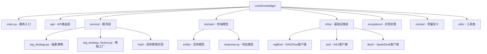
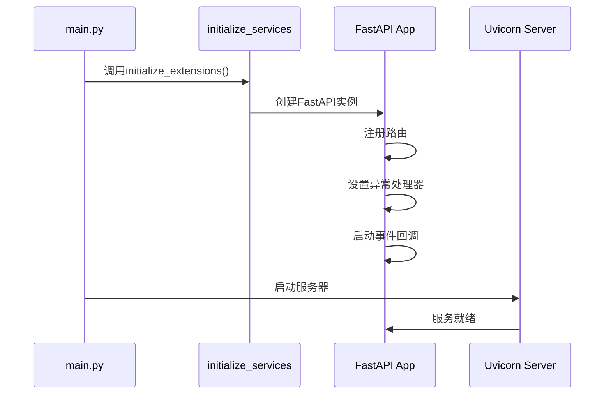
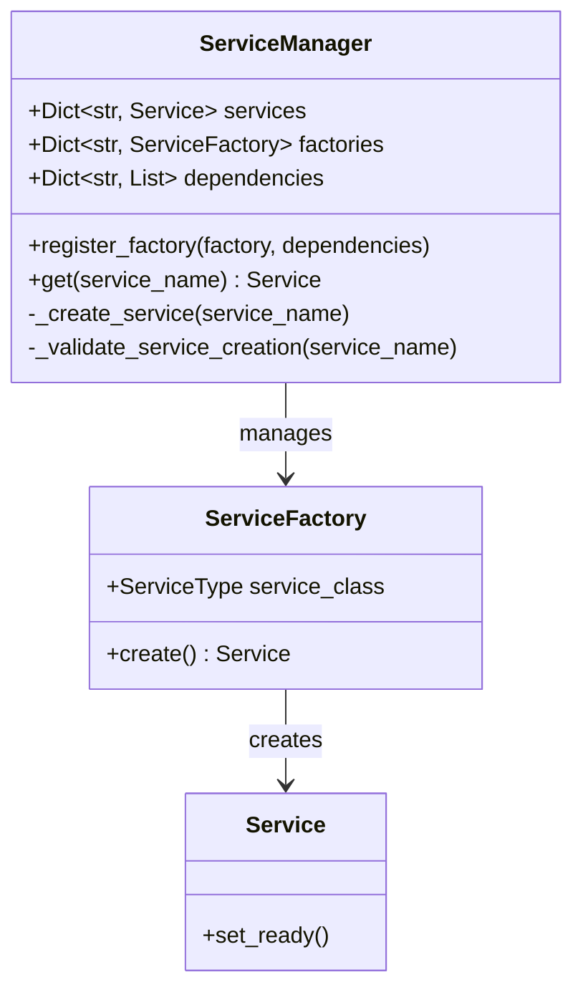
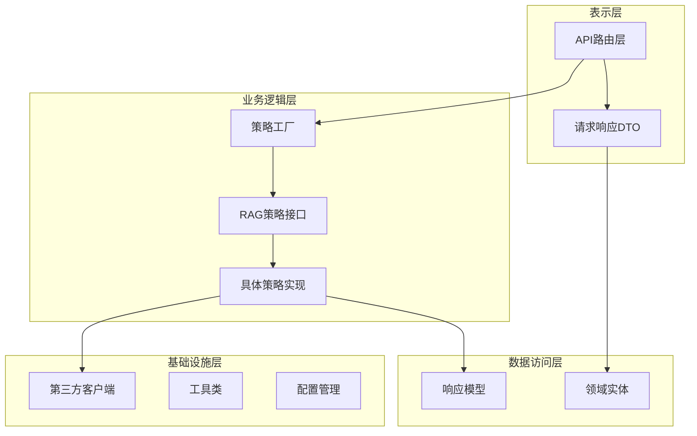
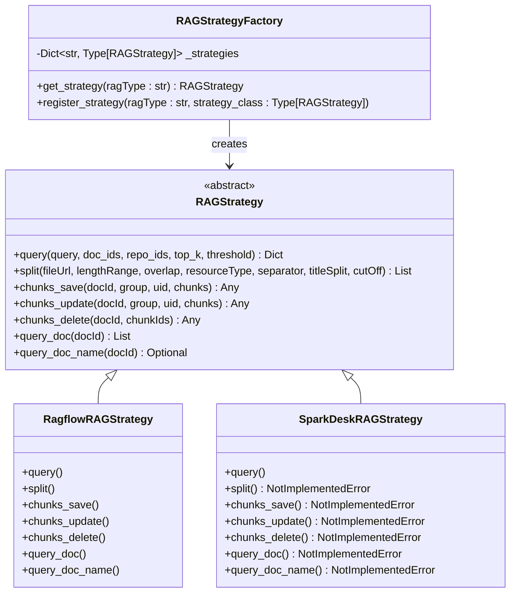
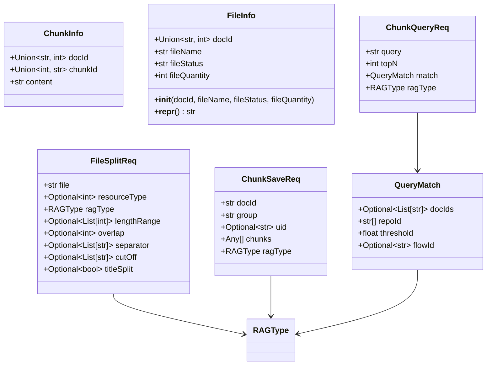
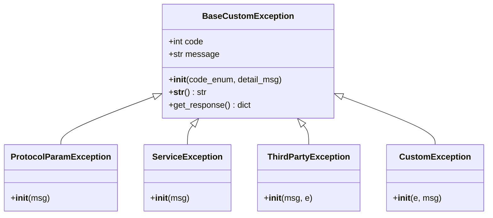
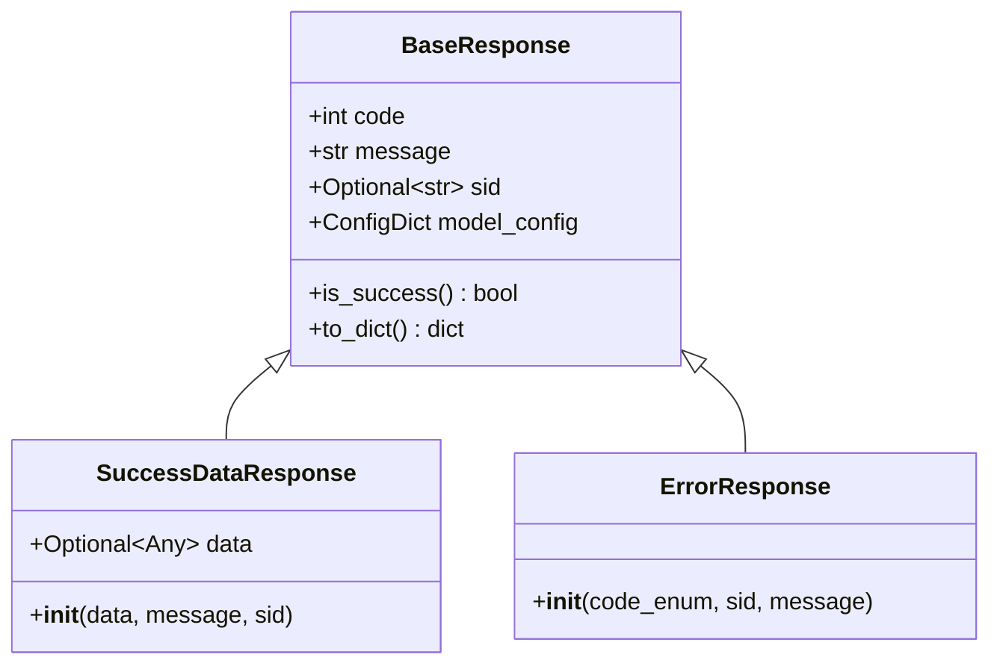
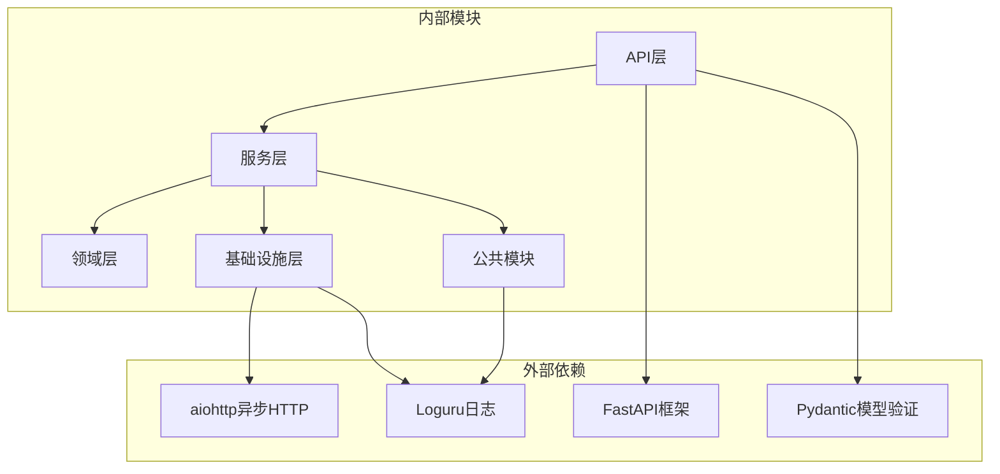

# 知识库服务架构设计文档

<cite>
**本文档引用的文件**
- [main.py](file://core/knowledge/main.py)
- [rag_strategy_factory.py](file://core/knowledge/service/rag_strategy_factory.py)
- [rag_strategy.py](file://core/knowledge/service/rag_strategy.py)
- [rag_do.py](file://core/knowledge/domain/entity/rag_do.py)
- [exception.py](file://core/knowledge/exceptions/exception.py)
- [api.py](file://core/knowledge/api/v1/api.py)
- [error_code.py](file://core/knowledge/consts/error_code.py)
- [response.py](file://core/knowledge/domain/response.py)
- [ragflow_client.py](file://core/knowledge/infra/ragflow/ragflow_client.py)
- [aiui.py](file://core/knowledge/infra/aiui/aiui.py)
- [ragflow_strategy.py](file://core/knowledge/service/impl/ragflow_strategy.py)
- [sparkdesk_strategy.py](file://core/knowledge/service/impl/sparkdesk_strategy.py)
- [chunk_dto.py](file://core/knowledge/domain/entity/chunk_dto.py)
- [initialize.py](file://core/common/initialize/initialize.py)
- [__init__.py](file://core/common/service/__init__.py)
</cite>

## 目录
1. [概述](#概述)
2. [项目结构](#项目结构)
3. [核心组件](#核心组件)
4. [架构概览](#架构概览)
5. [详细组件分析](#详细组件分析)
6. [依赖关系分析](#依赖关系分析)
7. [性能考虑](#性能考虑)
8. [故障排除指南](#故障排除指南)
9. [结论](#结论)

## 概述

知识库服务是一个基于Python FastAPI框架构建的RAG（检索增强生成）系统，提供了统一的知识库管理和文档处理能力。该系统采用分层架构设计，通过策略模式实现了对多种知识库后端的统一接口抽象，支持Ragflow、AIUI、SparkDesk等多种RAG服务提供商。

### 核心特性

- **多后端支持**：通过策略模式支持多种RAG服务提供商
- **统一接口**：为不同后端提供一致的API接口
- **模块化设计**：清晰的分层架构和职责分离
- **异常处理**：完善的错误处理和自定义异常体系
- **配置管理**：灵活的服务初始化和配置加载机制

## 项目结构

知识库服务采用标准的Python项目结构，主要分为以下几个层次：

**图表来源**
- [main.py](file://core/knowledge/main.py#L1-L113)
- [api.py](file://core/knowledge/api/v1/api.py#L1-L479)
- [rag_strategy_factory.py](file://core/knowledge/service/rag_strategy_factory.py#L1-L95)

**章节来源**
- [main.py](file://core/knowledge/main.py#L1-L113)
- [api.py](file://core/knowledge/api/v1/api.py#L1-L479)

## 核心组件

### 服务启动流程

知识库服务的启动流程遵循以下步骤：

1. **环境初始化**：加载配置文件和服务依赖
2. **FastAPI应用创建**：配置路由和中间件
3. **全局异常处理**：注册统一的异常处理器
4. **服务启动事件**：打印注册的路由信息
5. **服务器启动**：启动Uvicorn服务器

**图表来源**
- [main.py](file://core/knowledge/main.py#L25-L85)
- [initialize.py](file://core/common/initialize/initialize.py#L1-L19)

### 依赖注入机制

系统使用服务管理器实现依赖注入：

**图表来源**
- [__init__.py](file://core/common/service/__init__.py#L18-L60)

**章节来源**
- [main.py](file://core/knowledge/main.py#L25-L85)
- [__init__.py](file://core/common/service/__init__.py#L18-L136)

## 架构概览

知识库服务采用经典的分层架构模式，包含表示层、业务逻辑层、数据访问层和基础设施层：

**图表来源**
- [api.py](file://core/knowledge/api/v1/api.py#L1-L479)
- [rag_strategy_factory.py](file://core/knowledge/service/rag_strategy_factory.py#L1-L95)
- [rag_strategy.py](file://core/knowledge/service/rag_strategy.py#L1-L87)

## 详细组件分析

### RAG策略工厂模式

策略工厂是系统的核心设计模式，实现了对多种RAG后端的统一管理：

**图表来源**
- [rag_strategy_factory.py](file://core/knowledge/service/rag_strategy_factory.py#L15-L95)
- [rag_strategy.py](file://core/knowledge/service/rag_strategy.py#L10-L87)
- [ragflow_strategy.py](file://core/knowledge/service/impl/ragflow_strategy.py#L20-L799)
- [sparkdesk_strategy.py](file://core/knowledge/service/impl/sparkdesk_strategy.py#L10-L178)

#### 策略模式优势

1. **可扩展性**：新增RAG后端只需实现RAGStrategy接口
2. **解耦性**：客户端代码与具体实现解耦
3. **运行时切换**：支持根据配置动态选择策略
4. **测试友好**：便于单元测试和模拟对象

**章节来源**
- [rag_strategy_factory.py](file://core/knowledge/service/rag_strategy_factory.py#L1-L95)
- [rag_strategy.py](file://core/knowledge/service/rag_strategy.py#L1-L87)

### 领域模型设计

领域模型定义了知识库操作的核心数据结构：

**图表来源**
- [rag_do.py](file://core/knowledge/domain/entity/rag_do.py#L1-L53)
- [chunk_dto.py](file://core/knowledge/domain/entity/chunk_dto.py#L1-L164)

**章节来源**
- [rag_do.py](file://core/knowledge/domain/entity/rag_do.py#L1-L53)
- [chunk_dto.py](file://core/knowledge/domain/entity/chunk_dto.py#L1-L164)

### 异常处理体系

系统建立了完整的异常处理体系，支持多层次的错误处理：

**图表来源**
- [exception.py](file://core/knowledge/exceptions/exception.py#L1-L87)
- [error_code.py](file://core/knowledge/consts/error_code.py#L1-L48)

#### 错误码管理

系统使用枚举类统一管理错误码：

| 错误码范围 | 类型 | 描述 |
|-----------|------|------|
| 10001-10004 | 参数验证错误 | 请求参数校验失败 |
| 10016-10020 | 文件处理错误 | 文件分割、保存、更新、删除、查询失败 |
| 10024-10028 | 第三方服务错误 | 文件内容获取、存储、各RAG服务请求失败 |
| 11111 | 第三方服务通用错误 | 第三方服务调用失败 |
| 14999 | 服务通用错误 | 服务内部异常 |

**章节来源**
- [exception.py](file://core/knowledge/exceptions/exception.py#L1-L87)
- [error_code.py](file://core/knowledge/consts/error_code.py#L1-L48)

### API响应模型

系统定义了标准化的API响应格式：

**图表来源**
- [response.py](file://core/knowledge/domain/response.py#L1-L59)

**章节来源**
- [response.py](file://core/knowledge/domain/response.py#L1-L59)

## 依赖关系分析

系统的依赖关系呈现清晰的分层结构：

**图表来源**
- [main.py](file://core/knowledge/main.py#L1-L20)
- [api.py](file://core/knowledge/api/v1/api.py#L1-L30)

### 关键依赖注入点

1. **服务管理器**：负责所有服务的生命周期管理
2. **策略工厂**：动态创建RAG策略实例
3. **异常处理器**：统一处理各类异常
4. **配置加载器**：加载环境变量和配置文件

**章节来源**
- [main.py](file://core/knowledge/main.py#L25-L85)
- [__init__.py](file://core/common/service/__init__.py#L18-L136)

## 性能考虑

### 并发处理

系统采用异步编程模型提高并发性能：

- **异步HTTP客户端**：使用aiohttp处理第三方服务调用
- **异步数据库操作**：支持高并发数据库访问
- **连接池管理**：优化网络连接复用

### 缓存策略

- **会话缓存**：缓存HTTP会话减少连接开销
- **配置缓存**：避免重复读取配置文件
- **结果缓存**：缓存查询结果提高响应速度

### 资源管理

- **连接池**：限制并发连接数防止资源耗尽
- **超时控制**：设置合理的请求超时时间
- **重试机制**：处理临时性网络故障

## 故障排除指南

### 常见问题及解决方案

#### 1. 服务启动失败

**症状**：服务无法正常启动
**可能原因**：
- 环境变量配置错误
- 依赖服务不可用
- 端口被占用

**解决方法**：
- 检查`.env`配置文件
- 验证依赖服务状态
- 更换服务端口

#### 2. RAG策略执行失败

**症状**：知识库操作返回错误
**可能原因**：
- 第三方服务认证失败
- 网络连接超时
- 参数格式不正确

**解决方法**：
- 验证API密钥配置
- 检查网络连通性
- 查看详细的错误日志

#### 3. 内存泄漏

**症状**：长时间运行后内存占用过高
**可能原因**：
- HTTP会话未正确关闭
- 大量未释放的对象引用

**解决方法**：
- 定期清理会话缓存
- 使用弱引用避免循环引用
- 监控内存使用情况

**章节来源**
- [main.py](file://core/knowledge/main.py#L85-L113)
- [ragflow_client.py](file://core/knowledge/infra/ragflow/ragflow_client.py#L790-L829)

## 结论

知识库服务采用了现代化的软件架构设计，通过以下关键技术实现了高质量的系统设计：

### 设计优势

1. **分层架构**：清晰的职责分离，便于维护和扩展
2. **策略模式**：灵活的算法替换机制，支持多后端集成
3. **依赖注入**：松耦合的组件设计，提高可测试性
4. **异常处理**：完善的错误处理机制，提升系统稳定性
5. **异步编程**：充分利用现代Python的异步特性，提高并发性能

### 架构决策说明

1. **选择FastAPI框架**：因其高性能和自动API文档生成功能
2. **采用策略模式**：满足多RAG后端集成需求，保持接口一致性
3. **使用Pydantic验证**：提供强大的数据验证和序列化功能
4. **异步优先设计**：适应现代云原生应用的并发需求
5. **模块化组织**：便于团队协作和独立开发

### 扩展建议

1. **监控告警**：集成更完善的监控和告警系统
2. **负载均衡**：支持多实例部署和负载分担
3. **缓存优化**：引入Redis等缓存层提升性能
4. **安全加固**：加强API认证和授权机制
5. **文档完善**：提供更详细的API文档和使用示例

该架构设计为知识库服务提供了坚实的基础，能够满足当前和未来的业务需求，具有良好的可维护性和可扩展性。