# 知识库服务

<cite>
**本文档中引用的文件**
- [main.py](file://core/knowledge/main.py)
- [rag_strategy_factory.py](file://core/knowledge/service/rag_strategy_factory.py)
- [rag_do.py](file://core/knowledge/domain/entity/rag_do.py)
- [api.py](file://core/knowledge/api/v1/api.py)
- [ragflow_client.py](file://core/knowledge/infra/ragflow/ragflow_client.py)
- [rag_strategy.py](file://core/knowledge/service/rag_strategy.py)
- [ragflow_strategy.py](file://core/knowledge/service/impl/ragflow_strategy.py)
- [chunk_dto.py](file://core/knowledge/domain/entity/chunk_dto.py)
- [response.py](file://core/knowledge/domain/response.py)
- [constants.py](file://core/knowledge/consts/constants.py)
- [exception.py](file://core/knowledge/exceptions/exception.py)
- [error_code.py](file://core/knowledge/consts/error_code.py)
- [aiui_strategy.py](file://core/knowledge/service/impl/aiui_strategy.py)
- [cbg_strategy.py](file://core/knowledge/service/impl/cbg_strategy.py)
- [sparkdesk_strategy.py](file://core/knowledge/service/impl/sparkdesk_strategy.py)
</cite>

## 目录
1. [简介](#简介)
2. [项目架构](#项目架构)
3. [服务启动流程](#服务启动流程)
4. [API接口设计](#api接口设计)
5. [RAG策略工厂模式](#rag策略工厂模式)
6. [知识库后端集成](#知识库后端集成)
7. [领域模型分析](#领域模型分析)
8. [异常处理机制](#异常处理机制)
9. [性能优化指南](#性能优化指南)
10. [故障排除指南](#故障排除指南)
11. [总结](#总结)

## 简介

知识库服务是Astron Agent项目中的核心组件，作为RAG（检索增强生成）系统的主要实现。该服务提供了完整的知识管理功能，包括文档上传、分块处理、索引创建、查询检索等核心能力。通过工厂模式支持多种知识库后端（如RAGFlow、AIUI、CBG等），为不同场景提供灵活的解决方案。

## 项目架构

知识库服务采用分层架构设计，包含以下主要层次：

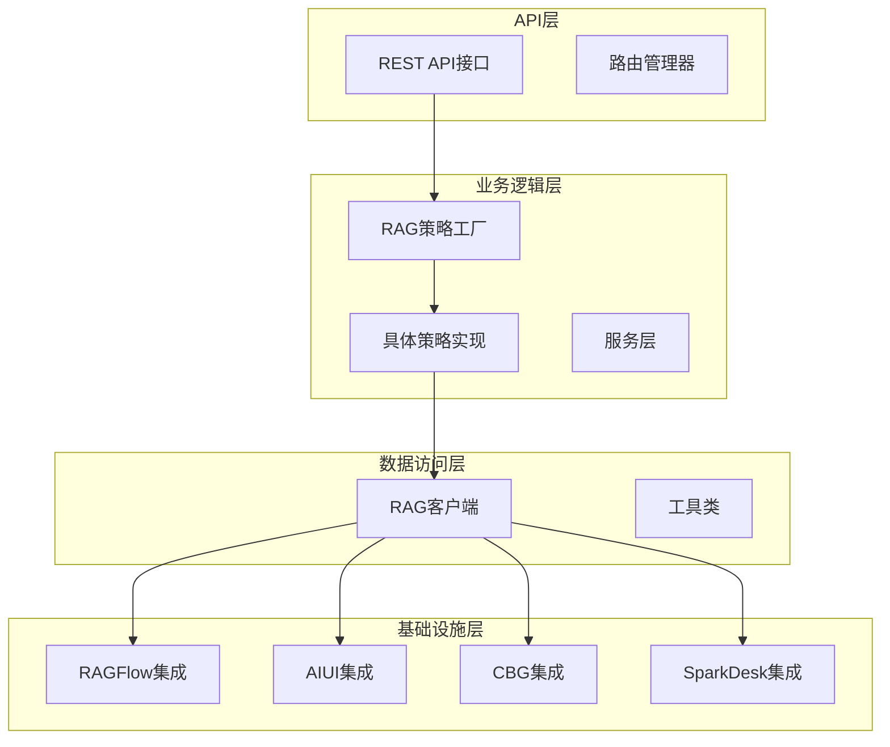

**图表来源**
- [main.py](file://core/knowledge/main.py#L1-L113)
- [api.py](file://core/knowledge/api/v1/api.py#L1-L479)
- [rag_strategy_factory.py](file://core/knowledge/service/rag_strategy_factory.py#L1-L95)

**章节来源**
- [main.py](file://core/knowledge/main.py#L1-L113)
- [api.py](file://core/knowledge/api/v1/api.py#L1-L479)

## 服务启动流程

知识库服务的启动过程遵循标准的FastAPI应用初始化流程，包含配置加载、依赖注入和服务启动等关键步骤。

### 初始化扩展模块

服务启动时首先执行扩展初始化，确保必要的服务组件就绪：

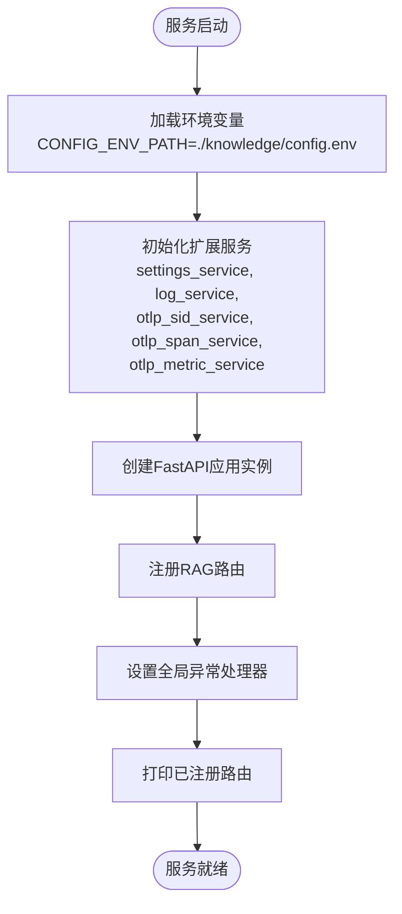

**图表来源**
- [main.py](file://core/knowledge/main.py#L20-L50)

### 配置加载机制

服务通过环境变量进行配置管理，支持动态配置更新：

| 配置项 | 默认值 | 描述 |
|--------|--------|------|
| SERVICE_PORT | 20010 | 服务监听端口 |
| WORKERS | 1 | 工作进程数量 |
| CONFIG_ENV_PATH | ./knowledge/config.env | 配置文件路径 |

### 异常处理配置

服务实现了统一的异常处理机制，确保所有错误都能以标准化格式返回：

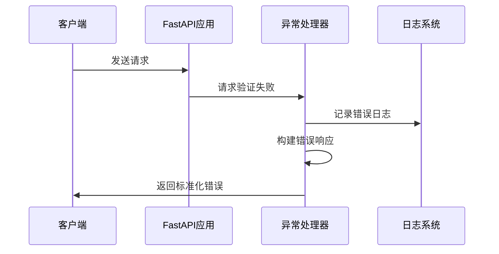

**图表来源**
- [main.py](file://core/knowledge/main.py#L35-L50)

**章节来源**
- [main.py](file://core/knowledge/main.py#L1-L113)

## API接口设计

知识库服务提供了完整的RESTful API接口，涵盖文档处理、知识管理、查询检索等核心功能。

### 核心API端点

服务定义了以下主要API端点：

| 端点 | 方法 | 功能描述 | 参数要求 |
|------|------|----------|----------|
| `/knowledge/v1/document/split` | POST | 文件分块处理 | file, ragType必需 |
| `/knowledge/v1/document/upload` | POST | 文件上传分块 | file, ragType必需 |
| `/knowledge/v1/chunks/save` | POST | 知识块保存 | docId, group, chunks必需 |
| `/knowledge/v1/chunk/update` | POST | 知识块更新 | docId, group, chunks必需 |
| `/knowledge/v1/chunk/delete` | POST | 知识块删除 | docId, chunkIds可选 |
| `/knowledge/v1/chunk/query` | POST | 知识块查询 | query, topN, match必需 |
| `/knowledge/v1/document/chunk` | POST | 文档块信息查询 | docId, ragType必需 |
| `/knowledge/v1/document/name` | POST | 文档名称查询 | docId, ragType必需 |

### 统一处理机制

所有API请求都通过统一的处理函数进行管理，确保一致的错误处理和监控：

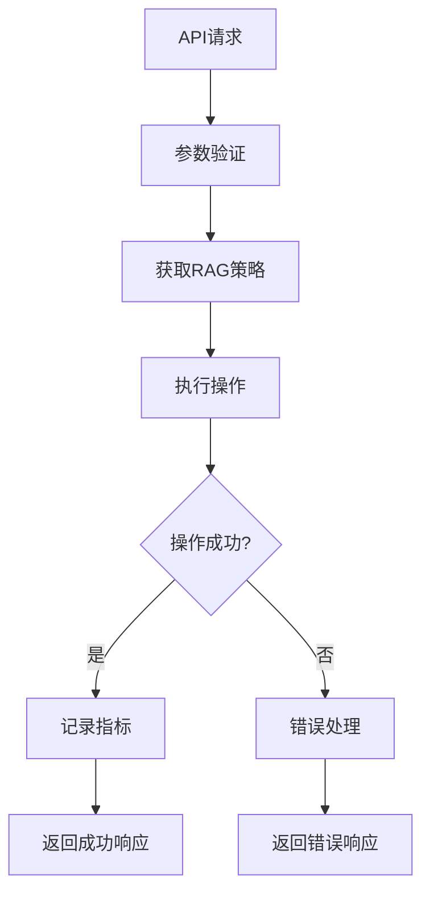

**图表来源**
- [api.py](file://core/knowledge/api/v1/api.py#L60-L120)

### 数据传输对象

服务使用Pydantic模型定义API请求和响应的数据结构：

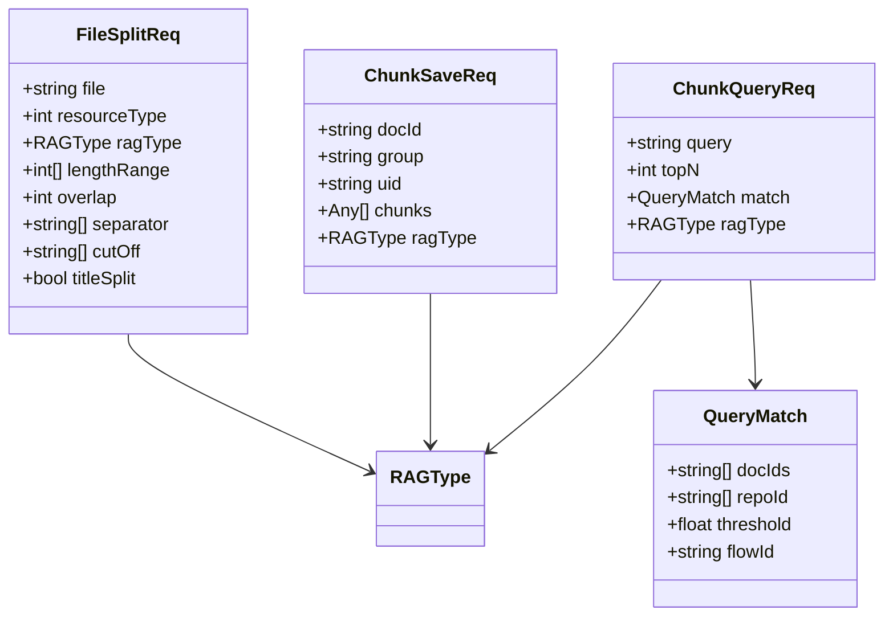

**图表来源**
- [chunk_dto.py](file://core/knowledge/domain/entity/chunk_dto.py#L1-L164)

**章节来源**
- [api.py](file://core/knowledge/api/v1/api.py#L1-L479)
- [chunk_dto.py](file://core/knowledge/domain/entity/chunk_dto.py#L1-L164)

## RAG策略工厂模式

RAG策略工厂模式是知识库服务的核心设计模式，通过抽象基类和工厂方法实现多种知识库后端的统一管理。

### 策略接口定义

所有RAG策略都必须继承自抽象基类RAGStrategy，实现标准化的操作接口：

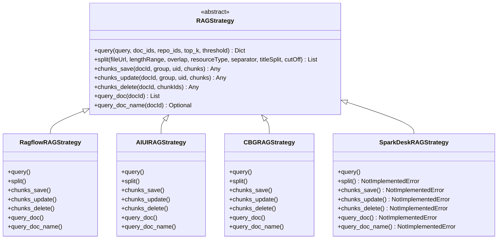

**图表来源**
- [rag_strategy.py](file://core/knowledge/service/rag_strategy.py#L1-L87)
- [ragflow_strategy.py](file://core/knowledge/service/impl/ragflow_strategy.py#L1-L100)
- [aiui_strategy.py](file://core/knowledge/service/impl/aiui_strategy.py#L1-L100)
- [cbg_strategy.py](file://core/knowledge/service/impl/cbg_strategy.py#L1-L100)
- [sparkdesk_strategy.py](file://core/knowledge/service/impl/sparkdesk_strategy.py#L1-L100)

### 工厂模式实现

工厂类维护策略映射表，根据RAG类型动态创建对应策略实例：

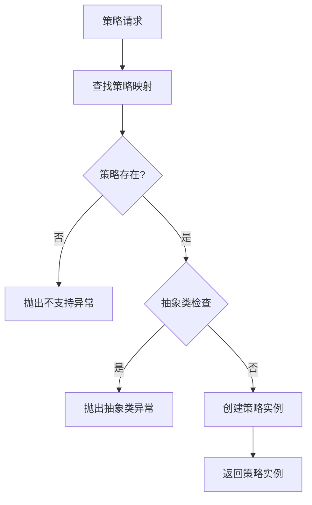

**图表来源**
- [rag_strategy_factory.py](file://core/knowledge/service/rag_strategy_factory.py#L25-L50)

### 支持的知识库后端

| 后端类型 | 策略类 | 主要功能 | 特殊特性 |
|----------|--------|----------|----------|
| RAGFlow | RagflowRAGStrategy | 完整的RAG功能 | 支持向量检索、文档管理 |
| AIUI | AIUIRAGStrategy | AIUI平台集成 | 智能分块、语义理解 |
| CBG | CBGRAGStrategy | 星火认知大模型 | 大模型推理、上下文处理 |
| SparkDesk | SparkDeskRAGStrategy | 星火认知大模型 | 仅支持查询，不支持编辑 |

**章节来源**
- [rag_strategy_factory.py](file://core/knowledge/service/rag_strategy_factory.py#L1-L95)
- [rag_strategy.py](file://core/knowledge/service/rag_strategy.py#L1-L87)

## 知识库后端集成

知识库服务通过统一的接口与不同的知识库后端进行集成，每种后端都有其特定的实现方式和优化策略。

### RAGFlow系统集成

RAGFlow是主要的向量知识库后端，提供了完整的文档管理和检索功能：

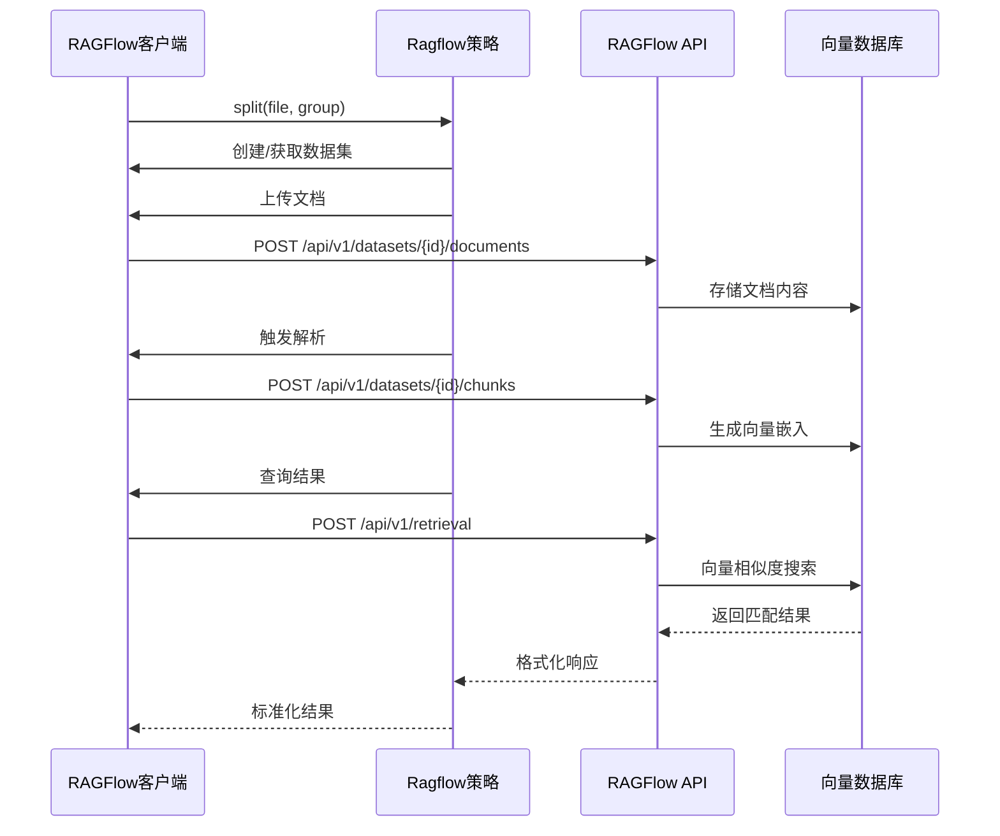

**图表来源**
- [ragflow_strategy.py](file://core/knowledge/service/impl/ragflow_strategy.py#L100-L200)
- [ragflow_client.py](file://core/knowledge/infra/ragflow/ragflow_client.py#L1-L100)

### 数据同步机制

RAGFlow集成实现了完整的数据同步流程：

| 步骤 | 操作 | 描述 | 错误处理 |
|------|------|------|----------|
| 1 | 数据集管理 | 自动创建或获取指定组的数据集 | 配置验证失败时抛出异常 |
| 2 | 文档上传 | 支持多种文件格式的文档上传 | 文件格式不支持时返回错误 |
| 3 | 内容解析 | 自动解析文档内容并生成分块 | 解析超时或失败时记录警告 |
| 4 | 向量化 | 将文本内容转换为向量表示 | 向量生成失败时跳过该分块 |
| 5 | 检索查询 | 基于向量相似度进行知识检索 | 查询失败时返回空结果 |

### 其他后端集成

#### AIUI集成特点
- 支持智能文档解析和语义分块
- 提供自然语言查询接口
- 集成AI能力进行内容理解

#### CBG集成特点  
- 基于星火认知大模型的深度语义理解
- 支持复杂的上下文关联处理
- 提供高质量的检索结果

#### SparkDesk集成特点
- 专注于查询功能，不支持文档编辑
- 实时响应速度快
- 适合高并发查询场景

**章节来源**
- [ragflow_client.py](file://core/knowledge/infra/ragflow/ragflow_client.py#L1-L829)
- [ragflow_strategy.py](file://core/knowledge/service/impl/ragflow_strategy.py#L1-L1016)

## 领域模型分析

知识库服务的领域模型定义了核心实体和它们之间的关系，为系统提供了清晰的数据结构框架。

### 核心实体关系

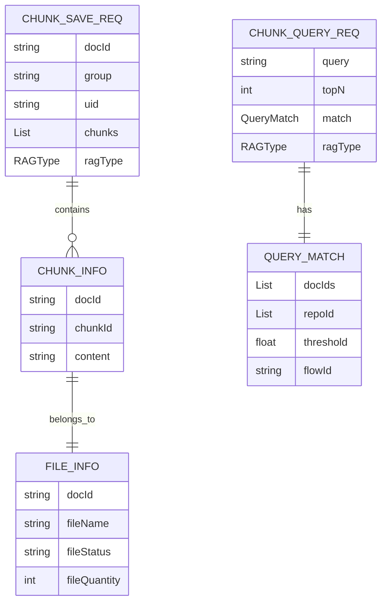

**图表来源**
- [rag_do.py](file://core/knowledge/domain/entity/rag_do.py#L1-L53)
- [chunk_dto.py](file://core/knowledge/domain/entity/chunk_dto.py#L1-L164)

### 数据结构详解

#### ChunkInfo实体
ChunkInfo表示文档的分块信息，是知识库中最基本的数据单元：

| 字段名 | 类型 | 描述 | 必需性 |
|--------|------|------|--------|
| docId | Union[str, int] | 文档标识符 | 必需 |
| chunkId | Union[int, str] | 分块标识符 | 必需 |
| content | str | 分块内容文本 | 必需 |

#### FileInfo实体
FileInfo封装了文档的基本信息：

| 字段名 | 类型 | 描述 | 默认值 |
|--------|------|------|--------|
| docId | Union[str, int] | 文档唯一标识 | 必需 |
| fileName | str | 文件显示名称 | 必需 |
| fileStatus | str | 文件处理状态 | 空字符串 |
| fileQuantity | int | 文件相关数量 | 0 |

#### 查询匹配条件
QueryMatch定义了知识检索的匹配规则：

| 字段名 | 类型 | 描述 | 取值范围 |
|--------|------|------|----------|
| docIds | Optional[List[str]] | 指定文档ID列表 | 无限制 |
| repoId | List[str] | 知识库ID列表 | 至少一个 |
| threshold | float | 相似度阈值 | 0.0-1.0 |
| flowId | Optional[str] | 流程ID | 无限制 |

### 响应数据模型

服务使用统一的响应模型确保API的一致性：

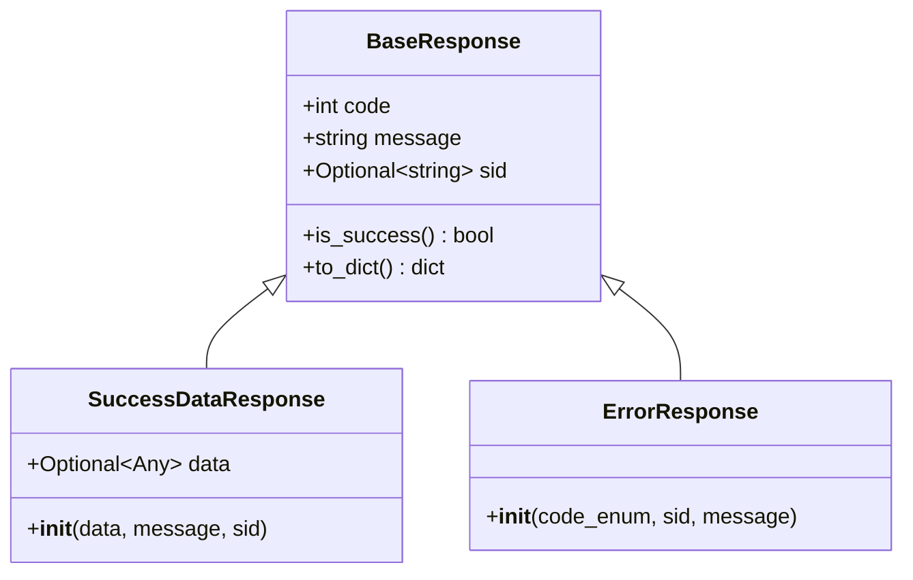

**图表来源**
- [response.py](file://core/knowledge/domain/response.py#L1-L59)

**章节来源**
- [rag_do.py](file://core/knowledge/domain/entity/rag_do.py#L1-L53)
- [chunk_dto.py](file://core/knowledge/domain/entity/chunk_dto.py#L1-L164)
- [response.py](file://core/knowledge/domain/response.py#L1-L59)

## 异常处理机制

知识库服务实现了完善的异常处理体系，确保系统稳定性和用户体验。

### 异常层次结构

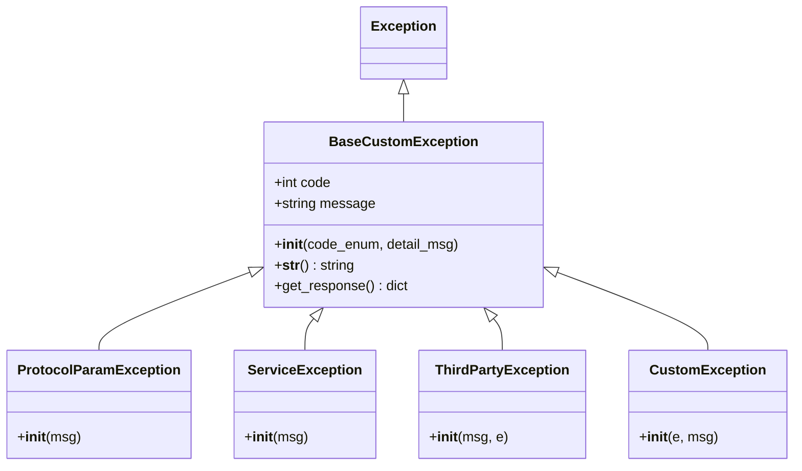

**图表来源**
- [exception.py](file://core/knowledge/exceptions/exception.py#L1-L87)

### 错误码定义

服务定义了详细的错误码体系：

| 错误码 | 错误类型 | 描述 | 处理建议 |
|--------|----------|------|----------|
| 10001 | ParameterCheckException | 参数校验异常 | 检查请求参数格式和范围 |
| 10002 | MissingParameter | 缺少必要参数 | 确保所有必需参数都已提供 |
| 10003 | ParameterInvalid | 参数无效 | 验证参数类型和值的有效性 |
| 10016 | FileSplitFailed | 文件分割失败 | 检查文件格式和大小限制 |
| 10017 | ChunkSaveFailed | 分块保存失败 | 检查存储权限和网络连接 |
| 10026 | CBG_RAGError | 星火知识库请求失败 | 检查星火服务可用性 |
| 11111 | ThirdPartyServiceFailed | 第三方服务失败 | 检查第三方服务状态 |
| 14999 | ServiceException | 服务异常 | 查看详细错误日志 |

### 异常处理流程

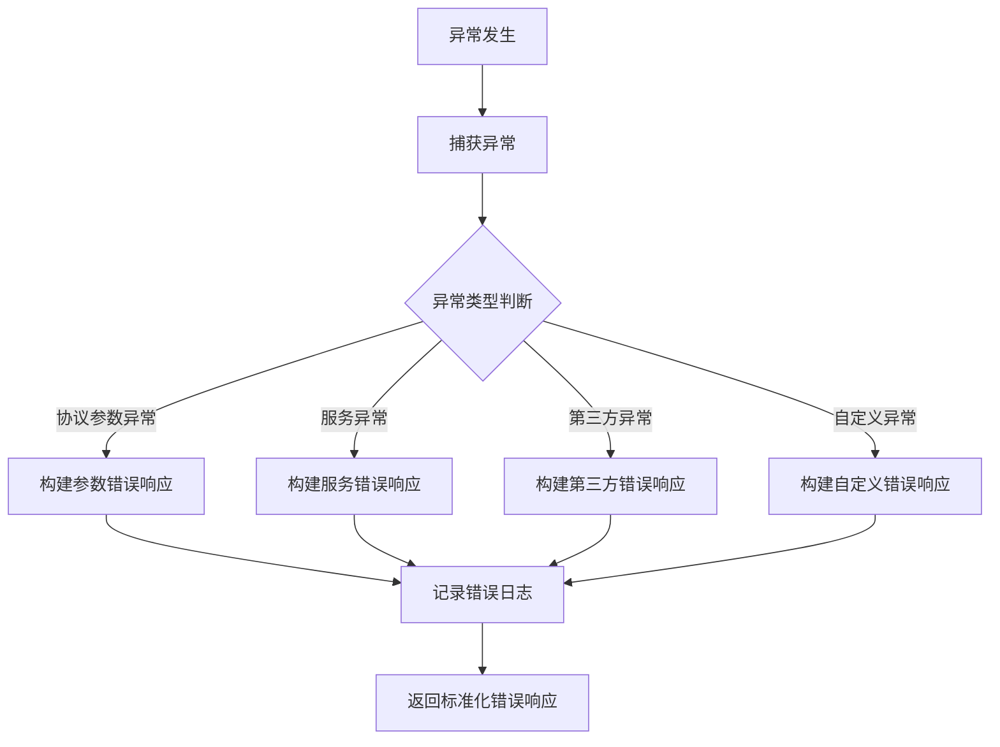

**图表来源**
- [api.py](file://core/knowledge/api/v1/api.py#L120-L200)

**章节来源**
- [exception.py](file://core/knowledge/exceptions/exception.py#L1-L87)
- [error_code.py](file://core/knowledge/consts/error_code.py#L1-L48)

## 性能优化指南

知识库服务在设计时充分考虑了性能优化，提供了多种调优策略和最佳实践。

### 索引策略优化

#### 分块策略
- **长度范围配置**：推荐设置为[256, 1024]字符，平衡信息完整性和检索精度
- **重叠长度**：建议设置为16-32字符，确保上下文连续性
- **分隔符选择**：优先使用句号、感叹号等自然断句符号

#### 向量索引优化
- **相似度阈值**：默认0.0，可根据准确率需求调整至0.7-0.9
- **返回结果数**：top_k建议设置为3-6个，避免过多噪声
- **批量操作**：对于大量文档处理，建议使用异步批量处理

### 检索算法选择

| 场景 | 推荐算法 | 配置参数 | 性能特点 |
|------|----------|----------|----------|
| 精确查询 | 向量检索 | threshold=0.8+ | 高准确性，低召回率 |
| 广泛搜索 | 混合检索 | vector_weight=0.3+ | 平衡准确率和召回率 |
| 实时查询 | 索引预热 | cache_enabled=true | 低延迟响应 |

### 缓存配置

#### HTTP会话缓存
- **连接池大小**：默认100个连接，可根据并发需求调整
- **连接复用**：启用keepalive_timeout=600秒
- **超时配置**：总超时时间30秒，可根据网络状况调整

#### 结果缓存策略
- **查询结果缓存**：对于重复查询，建议实现Redis缓存
- **文档元数据缓存**：缓存文档基本信息，减少API调用
- **分块内容缓存**：对于静态文档，可缓存分块内容

### 并发处理优化

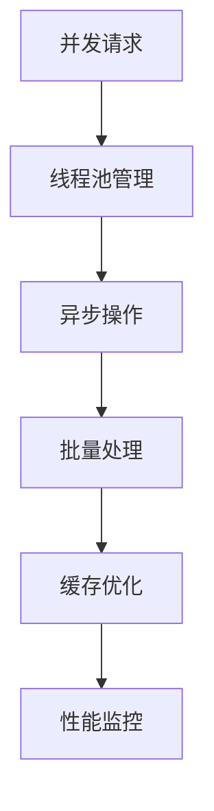

### 监控指标

关键性能指标包括：
- **响应时间**：平均查询响应时间应小于500ms
- **吞吐量**：单服务节点支持100+ QPS
- **错误率**：系统错误率应低于0.1%
- **资源利用率**：CPU和内存使用率保持在合理范围内

## 故障排除指南

### 常见问题诊断

#### 文档上传失败
**症状**：文件上传后无法正常解析
**排查步骤**：
1. 检查文件格式是否支持（PDF、Word、TXT等）
2. 验证文件大小是否超过限制
3. 确认RAGFlow服务是否正常运行
4. 检查网络连接和防火墙设置

#### 查询结果为空
**症状**：检索查询返回空结果
**排查步骤**：
1. 验证知识库中是否存在相关文档
2. 检查相似度阈值设置是否过高
3. 确认向量索引是否正常建立
4. 查看检索日志中的详细错误信息

#### 性能问题
**症状**：查询响应时间过长
**排查步骤**：
1. 检查服务器资源使用情况
2. 优化分块策略和检索参数
3. 启用适当的缓存机制
4. 考虑增加服务实例数量

### 日志分析

服务提供详细的日志记录，帮助快速定位问题：

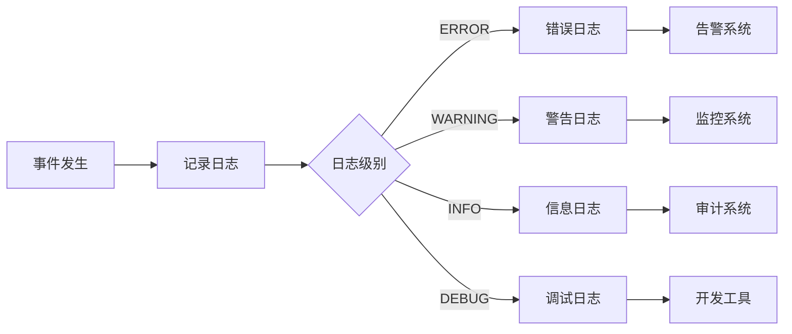

### 配置检查清单

启动前必须确认的配置项：
- [ ] RAGFlow服务地址和API密钥
- [ ] 默认知识库组名称
- [ ] HTTP会话超时配置
- [ ] 日志级别和输出路径
- [ ] 监控指标收集配置

**章节来源**
- [ragflow_client.py](file://core/knowledge/infra/ragflow/ragflow_client.py#L50-L150)
- [ragflow_strategy.py](file://core/knowledge/service/impl/ragflow_strategy.py#L300-L400)

## 总结

知识库服务作为Astron Agent项目的核心组件，通过精心设计的架构和完善的实现，为用户提供了强大而灵活的RAG功能。以下是系统的主要优势：

### 技术亮点
- **模块化设计**：采用工厂模式支持多种知识库后端，具备良好的扩展性
- **统一接口**：通过抽象基类确保不同后端的一致性体验
- **完善异常处理**：多层次的异常处理机制保证系统稳定性
- **性能优化**：内置缓存、批量处理等优化策略

### 应用价值
- **多后端支持**：兼容RAGFlow、AIUI、CBG等多种知识库平台
- **标准化API**：提供RESTful接口，便于集成和使用
- **实时监控**：完整的链路追踪和指标收集
- **故障恢复**：自动重试和降级机制

### 发展方向
- **性能提升**：进一步优化向量检索算法和缓存策略
- **功能扩展**：支持更多类型的文档和知识表示
- **智能优化**：基于机器学习的参数自动调优
- **生态建设**：与其他AI组件的深度集成

知识库服务为Astron Agent提供了坚实的知识基础，支撑着整个系统的智能化运作。通过持续的优化和改进，该服务将继续为用户提供更加优质的知识管理体验。