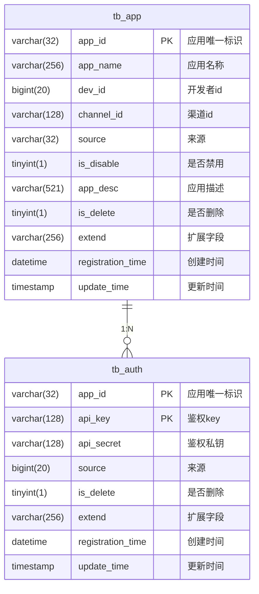

# 数据模型

<cite>
**本文档引用的文件**
- [app.go](file://core/tenant/internal/models/app.go)
- [auth.go](file://core/tenant/internal/models/auth.go)
- [app_dao.go](file://core/tenant/internal/dao/app_dao.go)
- [auth_dao.go](file://core/tenant/internal/dao/auth_dao.go)
- [database.go](file://core/tenant/tools/database/database.go)
- [config.go](file://core/tenant/config/config.go)
- [tenant.sql](file://docker/astronAgent/mysql/tenant.sql)
</cite>

## 目录
1. [引言](#引言)
2. [实体结构设计](#实体结构设计)
3. [数据访问对象实现](#数据访问对象实现)
4. [多租户数据隔离策略](#多租户数据隔离策略)
5. [数据库连接池配置](#数据库连接池配置)
6. [事务处理机制](#事务处理机制)
7. [数据库表结构示意图](#数据库表结构示意图)
8. [性能优化建议](#性能优化建议)
9. [结论](#结论)

## 引言
本文档详细描述了租户服务的数据模型设计，重点关注应用和认证信息的持久化方案。通过分析核心实体结构、数据访问层实现以及多租户环境下的数据隔离策略，为系统维护和扩展提供技术参考。

## 实体结构设计

### 应用实体（App）
应用实体定义了系统中应用的基本信息和状态，包含以下字段：

- **AppId**: 应用唯一标识符，作为主键使用
- **AppName**: 应用名称，用于展示和搜索
- **DevId**: 开发者ID，关联开发者信息
- **ChannelId**: 渠道ID，标识应用来源渠道
- **Source**: 来源标识，记录应用创建来源
- **IsDisable**: 禁用状态，true表示禁用，false表示启用
- **Desc**: 应用描述，提供应用功能说明
- **IsDelete**: 删除标记，实现软删除功能
- **CreateTime**: 创建时间，记录应用创建时间戳
- **UpdateTime**: 更新时间，自动更新的时间戳
- **Extend**: 扩展字段，用于存储额外的JSON格式数据

**业务含义与数据约束**：AppId作为主键具有唯一性约束，确保每个应用的唯一性；AppName长度限制为256字符；DevId为bigint类型，支持大规模开发者管理；IsDisable和IsDelete使用tinyint(1)存储布尔值，优化存储空间。

### 认证实体（Auth）
认证实体管理应用的API访问凭证，包含以下字段：

- **AppId**: 应用ID，与应用表关联
- **ApiKey**: 鉴权密钥，用于API请求认证
- **ApiSecret**: 鉴权私钥，用于签名验证
- **Source**: 来源标识，记录认证信息创建来源
- **IsDelete**: 删除标记，实现软删除功能
- **CreateTime**: 创建时间，记录认证信息创建时间戳
- **UpdateTime**: 更新时间，自动更新的时间戳
- **Extend**: 扩展字段，用于存储额外配置信息

**业务含义与数据约束**：主键为(AppId, ApiKey)复合主键，确保每个应用的每个API密钥唯一；ApiKey长度限制为128字符，满足安全要求；ApiSecret存储加密后的密钥值，保障安全性。

**Section sources**
- [app.go](file://core/tenant/internal/models/app.go)
- [auth.go](file://core/tenant/internal/models/auth.go)

## 数据访问对象实现

### CRUD操作实现机制
数据访问对象（DAO）采用参数化SQL构造方式，通过函数式编程模式构建动态查询条件。

#### SQL语句构造
DAO层在初始化时预编译基础SQL语句模板：
- 插入语句：包含所有字段的INSERT模板
- 更新语句：基于SET子句的UPDATE模板
- 查询语句：包含所有字段的SELECT模板
- 计数语句：COUNT(1)查询模板

#### 操作方法实现
- **Insert**: 接收实体对象和可选事务参数，执行插入操作并返回影响行数
- **Update**: 支持条件更新，通过查询条件和设置条件分离的方式构建UPDATE语句
- **Delete**: 逻辑删除实现，将IsDelete字段设置为true
- **Select**: 根据可变参数条件执行查询，返回实体列表
- **Count**: 执行计数查询，支持行级锁

#### 条件构造器
采用函数式接口`SqlOption`实现类型安全的查询条件构建：
```go
type SqlOption func() (string, []interface{})
```
每个条件方法（如WithAppId、WithName等）返回一个闭包函数，封装SQL片段和参数值，在执行时动态组合成完整SQL语句。

**Section sources**
- [app_dao.go](file://core/tenant/internal/dao/app_dao.go)
- [auth_dao.go](file://core/tenant/internal/dao/auth_dao.go)
- [base.go](file://core/tenant/internal/dao/base.go)

## 多租户数据隔离策略

### 数据分区实现
虽然当前数据模型中未直接体现租户ID字段，但通过应用ID（AppId）实现了逻辑上的租户隔离。每个应用归属于特定租户，通过应用层级的访问控制实现数据隔离。

### 访问控制机制
- 所有数据访问必须通过应用上下文进行
- API密钥与应用绑定，确保请求的身份验证
- 在业务逻辑层强制校验应用与租户的归属关系
- 通过复合主键(AppId, ApiKey)确保认证信息的唯一性和隔离性

### 扩展性设计
当前设计支持未来扩展物理租户隔离：
- 可在tb_app和tb_auth表中添加tenant_id字段
- 建立租户-应用映射关系表
- 在DAO层添加租户条件过滤器
- 实现基于租户的数据库分片策略

**Section sources**
- [app.go](file://core/tenant/internal/models/app.go)
- [auth.go](file://core/tenant/internal/models/auth.go)
- [tenant.sql](file://docker/astronAgent/mysql/tenant.sql)

## 数据库连接池配置

### 连接池管理
数据库连接池通过Database结构体封装，提供统一的MySQL连接管理。

#### 配置参数
连接池配置通过Config结构体定义，包含以下关键参数：
- **MaxOpenConns**: 最大打开连接数
- **MaxIdleConns**: 最大空闲连接数
- **DBType**: 数据库类型，当前支持MySQL
- **UserName**: 数据库用户名
- **Password**: 数据库密码
- **Url**: 数据库连接地址

#### 初始化流程
1. 验证配置参数完整性
2. 使用配置信息创建数据库连接
3. 设置连接池大小限制
4. 执行连接测试（Ping）
5. 返回数据库实例

#### 连接复用
通过单例模式管理数据库连接，确保整个应用使用同一连接池实例，提高连接复用率和性能。

**Section sources**
- [database.go](file://core/tenant/tools/database/database.go)
- [config.go](file://core/tenant/config/config.go)

## 事务处理机制

### 事务管理接口
DAO层提供统一的事务管理接口：
- **BeginTx**: 开启新事务，返回sql.Tx对象
- 事务参数传递：各CRUD方法支持可选的*sql.Tx参数
- 自动提交/回滚：由调用方控制事务生命周期

### 事务使用模式
```go
tx, err := dao.BeginTx()
if err != nil {
    return err
}
defer tx.Rollback()

// 执行多个操作
_, err = dao.Insert(data, tx)
if err != nil {
    return err
}

_, err = dao.Update(options, tx, setOptions...)
if err != nil {
    return err
}

// 所有操作成功，提交事务
return tx.Commit()
```

### 错误处理
- 事务执行过程中任何错误都导致事务回滚
- 使用defer确保事务最终被回滚
- 提供详细的错误日志记录，便于问题排查
- 支持事务嵌套的场景（通过传入tx参数）

**Section sources**
- [app_dao.go](file://core/tenant/internal/dao/app_dao.go)
- [auth_dao.go](file://core/tenant/internal/dao/auth_dao.go)

## 数据库表结构示意图



**Diagram sources**
- [tenant.sql](file://docker/astronAgent/mysql/tenant.sql)

## 性能优化建议

### 查询缓存策略
1. **应用信息缓存**：对频繁访问的应用基本信息使用Redis缓存
2. **认证信息缓存**：将API密钥对应的认证信息缓存，减少数据库查询
3. **缓存失效机制**：设置合理的TTL，并在数据更新时主动清除缓存
4. **本地缓存**：对只读配置数据使用内存缓存，减少远程调用

### 索引优化策略
当前数据库已建立以下索引：
- **tb_app表**：
  - 主键索引：app_id（唯一性约束）
  - 普通索引：registration_time（按创建时间查询）
  - 普通索引：dev_id（按开发者查询）
- **tb_auth表**：
  - 复合主键索引：(app_id, api_key)
  - 普通索引：registration_time（按创建时间查询）
  - 普通索引：api_key（按API密钥查询）

**优化建议**：
1. 添加AppName的全文索引，支持模糊搜索
2. 为Source字段添加索引，支持按来源统计
3. 考虑为IsDelete和IsDisable字段添加复合索引，优化软删除查询性能
4. 定期分析查询执行计划，识别慢查询并优化

### 其他优化建议
1. **连接池调优**：根据实际负载调整MaxOpenConns和MaxIdleConns参数
2. **批量操作**：对于批量插入或更新场景，实现批量处理接口
3. **读写分离**：在高并发场景下考虑引入读写分离架构
4. **分库分表**：当数据量达到百万级时，考虑按租户或时间进行分片

**Section sources**
- [tenant.sql](file://docker/astronAgent/mysql/tenant.sql)
- [app_dao.go](file://core/tenant/internal/dao/app_dao.go)

## 结论
本文档详细分析了租户服务的数据模型设计，涵盖了实体结构、数据访问层实现、多租户隔离策略等多个方面。系统采用逻辑租户隔离模式，通过应用ID实现数据分区，具有良好的扩展性。DAO层采用函数式编程模式构建动态查询，提高了代码的可维护性。建议在后续版本中加强查询缓存和索引优化，以应对不断增长的数据规模和访问压力。