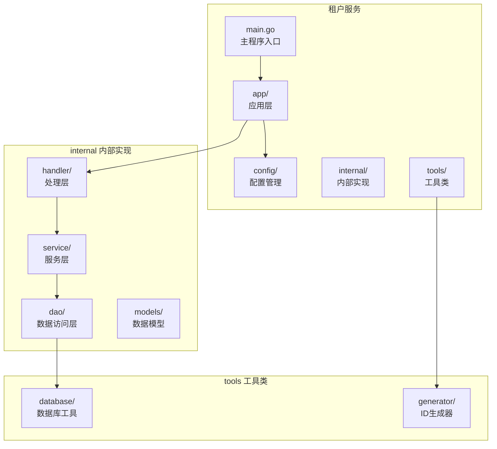
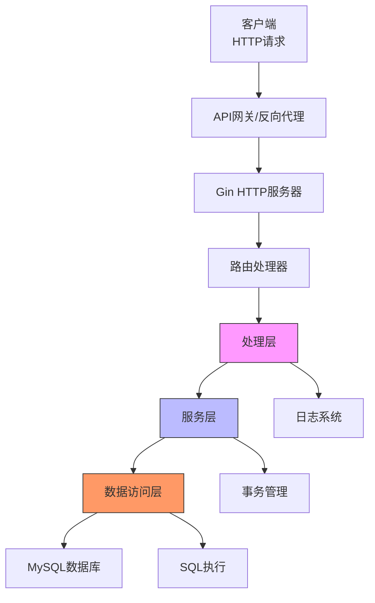
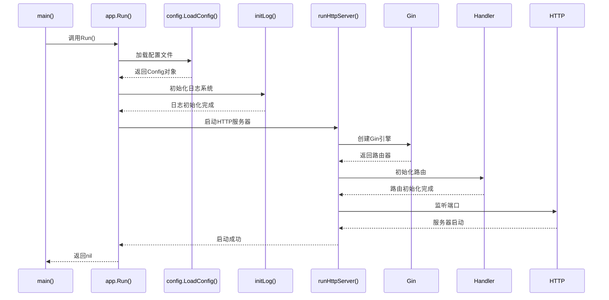
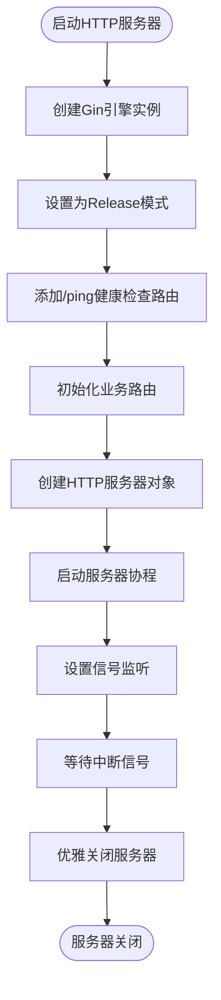
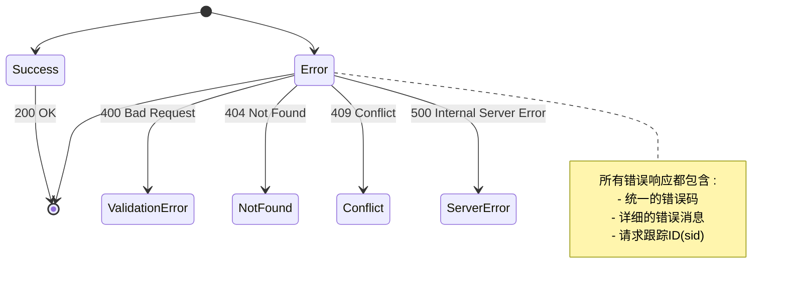
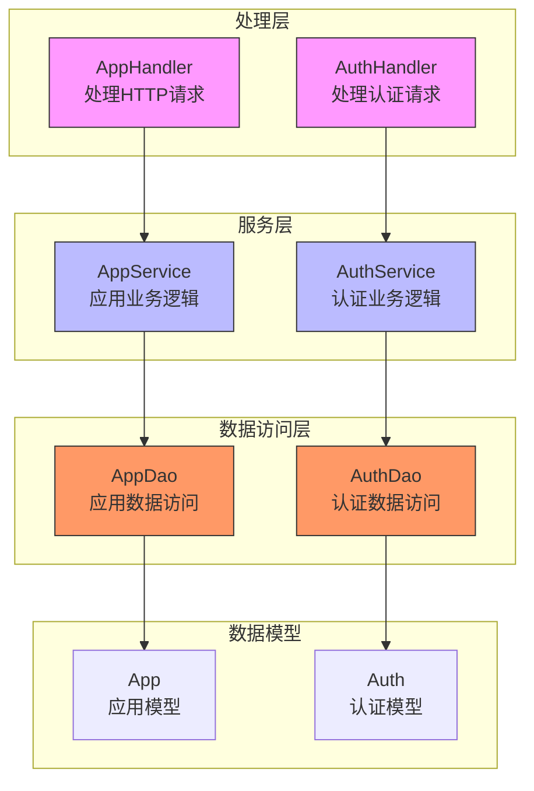
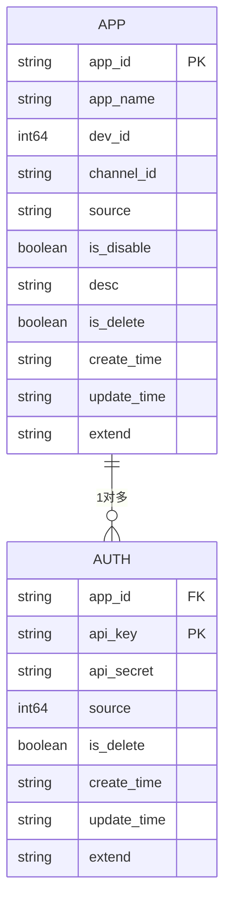
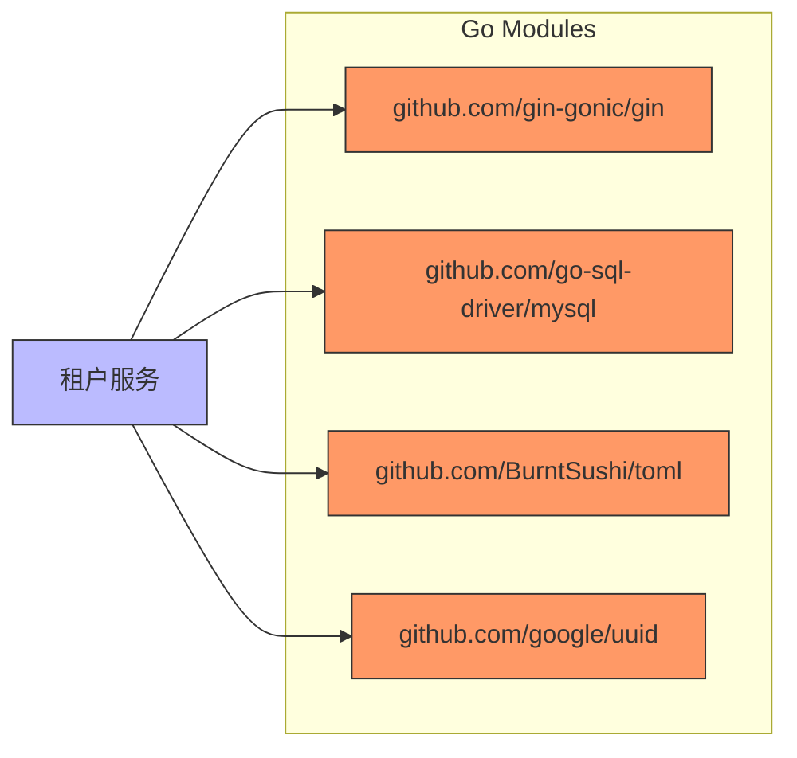

# 架构设计

<cite>
**本文档引用的文件**  
- [main.go](file://core/tenant/main.go)
- [server.go](file://core/tenant/app/server.go)
- [config.go](file://core/tenant/config/config.go)
- [router.go](file://core/tenant/internal/handler/router.go)
- [app_handler.go](file://core/tenant/internal/handler/app_handler.go)
- [auth_handler.go](file://core/tenant/internal/handler/auth_handler.go)
- [app_service.go](file://core/tenant/internal/service/app_service.go)
- [auth_service.go](file://core/tenant/internal/service/auth_service.go)
- [app.go](file://core/tenant/internal/models/app.go)
- [auth.go](file://core/tenant/internal/models/auth.go)
- [database.go](file://core/tenant/tools/database/database.go)
</cite>

## 目录
1. [引言](#引言)
2. [项目结构](#项目结构)
3. [核心组件](#核心组件)
4. [架构概述](#架构概述)
5. [详细组件分析](#详细组件分析)
6. [依赖分析](#依赖分析)
7. [性能考虑](#性能考虑)
8. [故障排除指南](#故障排除指南)
9. [结论](#结论)

## 引言
本文档详细描述了基于Go语言的租户服务微服务架构设计。该服务是astron-agent系统的核心组件之一，负责管理应用程序的生命周期、认证密钥以及租户相关的元数据。文档重点介绍了服务启动流程、HTTP服务器配置、RESTful API设计原则、分层架构设计以及与其他微服务的集成模式。

## 项目结构
租户服务采用标准的Go项目结构，遵循清晰的分层和模块化设计原则。项目根目录包含主程序入口、配置文件和依赖管理文件，而核心业务逻辑分布在不同的内部包中。



**图源**
- [main.go](file://core/tenant/main.go)
- [server.go](file://core/tenant/app/server.go)
- [config.go](file://core/tenant/config/config.go)

**本节来源**
- [main.go](file://core/tenant/main.go)
- [server.go](file://core/tenant/app/server.go)
- [config.go](file://core/tenant/config/config.go)

## 核心组件
租户服务的核心组件包括服务启动器、HTTP服务器、配置管理器、路由处理器、业务服务和数据访问层。这些组件通过清晰的依赖注入和分层架构协同工作，确保系统的可维护性和可扩展性。

**本节来源**
- [main.go](file://core/tenant/main.go#L1-L15)
- [server.go](file://core/tenant/app/server.go#L1-L90)
- [config.go](file://core/tenant/config/config.go#L1-L65)

## 架构概述
租户服务采用典型的微服务架构，遵循分层设计原则。系统从上到下分为处理层、服务层和数据访问层，每一层都有明确的职责和接口定义。



**图源**
- [server.go](file://core/tenant/app/server.go#L1-L90)
- [router.go](file://core/tenant/internal/handler/router.go#L1-L98)
- [app_handler.go](file://core/tenant/internal/handler/app_handler.go#L1-L237)

## 详细组件分析
### 服务启动流程分析
租户服务的启动流程始于`main.go`文件，通过`app.Run()`函数启动整个服务。该流程包括配置加载、日志初始化和HTTP服务器启动三个主要阶段。



**图源**
- [main.go](file://core/tenant/main.go#L1-L15)
- [server.go](file://core/tenant/app/server.go#L1-L90)
- [config.go](file://core/tenant/config/config.go#L1-L65)

**本节来源**
- [main.go](file://core/tenant/main.go#L1-L15)
- [server.go](file://core/tenant/app/server.go#L1-L90)

### HTTP服务器配置与路由注册
`server.go`文件中的`runHttpServer`函数负责配置和启动HTTP服务器。该函数使用Gin框架创建高性能的HTTP服务器，并通过`handler.InitRouter`函数注册所有API路由。



**图源**
- [server.go](file://core/tenant/app/server.go#L1-L90)
- [router.go](file://core/tenant/internal/handler/router.go#L1-L98)

**本节来源**
- [server.go](file://core/tenant/app/server.go#L1-L90)
- [router.go](file://core/tenant/internal/handler/router.go#L1-L98)

### RESTful API设计原则应用
租户服务遵循RESTful API设计原则，通过资源化的URL设计、标准的HTTP方法和一致的响应格式提供服务。

#### 资源命名与端点设计
```mermaid
classDiagram
class AppResource {
+POST /v2/app 创建应用
+PUT /v2/app 修改应用
+GET /v2/app/list 获取应用列表
+GET /v2/app/details 获取应用详情
+POST /v2/app/disable 启用/禁用应用
+DELETE /v2/app 删除应用
}
class AuthResource {
+POST /v2/app/key 创建认证密钥
+DELETE /v2/app/key 删除认证密钥
+GET /v2/app/key/{app_id} 获取应用密钥
+GET /v2/app/api_key/{api_key} 通过API密钥获取应用
}
AppResource --> AuthResource : "包含"
```

**图源**
- [router.go](file://core/tenant/internal/handler/router.go#L1-L98)
- [app_handler.go](file://core/tenant/internal/handler/app_handler.go#L1-L237)
- [auth_handler.go](file://core/tenant/internal/handler/auth_handler.go#L1-L163)

#### 状态码与错误处理模式
租户服务采用统一的错误处理模式，所有API响应都遵循相同的格式，包含状态码、消息和请求ID。



**图源**
- [app_handler.go](file://core/tenant/internal/handler/app_handler.go#L1-L237)
- [auth_handler.go](file://core/tenant/internal/handler/auth_handler.go#L1-L163)
- [errors.go](file://core/tenant/internal/handler/errors.go)

**本节来源**
- [router.go](file://core/tenant/internal/handler/router.go#L1-L98)
- [app_handler.go](file://core/tenant/internal/handler/app_handler.go#L1-L237)
- [auth_handler.go](file://core/tenant/internal/handler/auth_handler.go#L1-L163)

### 分层架构与职责分离
租户服务采用清晰的分层架构，将处理层、服务层和数据访问层分离，确保各层职责明确，降低耦合度。



**图源**
- [app_handler.go](file://core/tenant/internal/handler/app_handler.go#L1-L237)
- [auth_handler.go](file://core/tenant/internal/handler/auth_handler.go#L1-L163)
- [app_service.go](file://core/tenant/internal/service/app_service.go#L1-L298)
- [auth_service.go](file://core/tenant/internal/service/auth_service.go#L1-L155)
- [app.go](file://core/tenant/internal/models/app.go)
- [auth.go](file://core/tenant/internal/models/auth.go)

**本节来源**
- [app_handler.go](file://core/tenant/internal/handler/app_handler.go#L1-L237)
- [auth_handler.go](file://core/tenant/internal/handler/auth_handler.go#L1-L163)
- [app_service.go](file://core/tenant/internal/service/app_service.go#L1-L298)
- [auth_service.go](file://core/tenant/internal/service/auth_service.go#L1-L155)

### Go语言并发处理优势
虽然当前租户服务的实现中没有大量使用goroutine和channel进行并发处理，但Go语言的特性为未来的性能优化提供了坚实的基础。



**图源**
- [app.go](file://core/tenant/internal/models/app.go)
- [auth.go](file://core/tenant/internal/models/auth.go)
- [app_service.go](file://core/tenant/internal/service/app_service.go#L1-L298)

## 依赖分析
租户服务的依赖关系清晰，主要依赖Gin框架进行HTTP处理，使用MySQL驱动进行数据库访问，并通过TOML格式的配置文件管理配置。



**图源**
- [go.mod](file://core/tenant/go.mod)
- [server.go](file://core/tenant/app/server.go#L1-L90)
- [database.go](file://core/tenant/tools/database/database.go#L1-L72)

**本节来源**
- [go.mod](file://core/tenant/go.mod)
- [server.go](file://core/tenant/app/server.go#L1-L90)
- [database.go](file://core/tenant/tools/database/database.go#L1-L72)

## 性能考虑
租户服务在性能方面考虑了多个关键因素，包括数据库连接池配置、事务管理、错误处理和优雅关闭。

### 数据库连接池配置
服务通过配置文件中的`maxOpenConns`和`maxIdleConns`参数来优化数据库连接池，确保在高并发场景下能够有效管理数据库连接。

### 事务管理
所有修改操作都在事务中执行，确保数据的一致性和完整性。服务层通过`BeginTx`和`rollback`方法实现事务的开始和回滚。

### 优雅关闭
服务实现了优雅关闭机制，通过监听SIGINT和SIGTERM信号，在接收到关闭信号后，等待正在进行的请求完成后再关闭服务器，避免数据丢失。

**本节来源**
- [server.go](file://core/tenant/app/server.go#L1-L90)
- [database.go](file://core/tenant/tools/database/database.go#L1-L72)
- [app_service.go](file://core/tenant/internal/service/app_service.go#L1-L298)

## 故障排除指南
### 常见问题与解决方案
1. **服务启动失败**
   - 检查配置文件路径是否正确
   - 验证数据库连接信息是否准确
   - 确认端口是否被其他进程占用

2. **数据库连接失败**
   - 检查MySQL服务是否正常运行
   - 验证数据库用户名和密码是否正确
   - 确认数据库URL格式是否正确

3. **API调用失败**
   - 检查请求参数是否符合规范
   - 验证认证信息是否正确
   - 查看服务日志获取详细错误信息

**本节来源**
- [server.go](file://core/tenant/app/server.go#L1-L90)
- [config.go](file://core/tenant/config/config.go#L1-L65)
- [app_handler.go](file://core/tenant/internal/handler/app_handler.go#L1-L237)

## 结论
租户服务采用基于Go语言的微服务架构，具有清晰的分层设计、良好的可维护性和可扩展性。服务通过Gin框架提供高性能的HTTP接口，遵循RESTful API设计原则，实现了应用管理和认证密钥管理的核心功能。虽然当前实现中并发处理较为简单，但Go语言的特性为未来的性能优化提供了坚实的基础。服务与其他微服务（如Agent服务）的集成主要通过API密钥和认证令牌进行，确保了系统的安全性和可靠性。