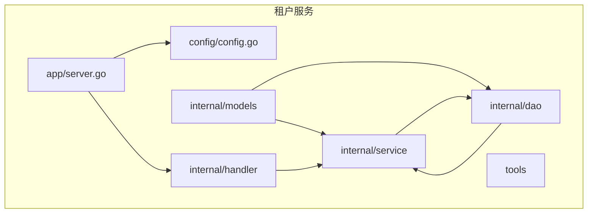
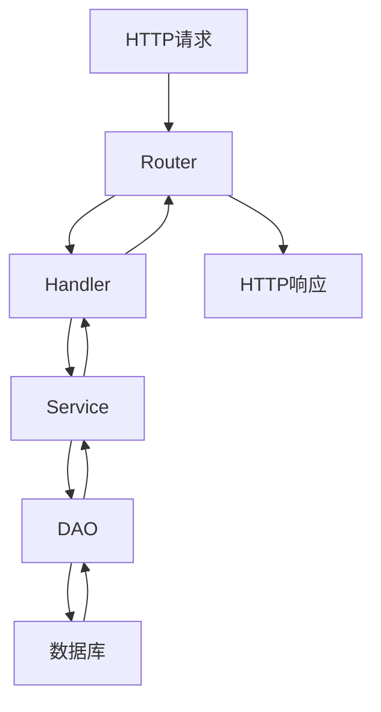
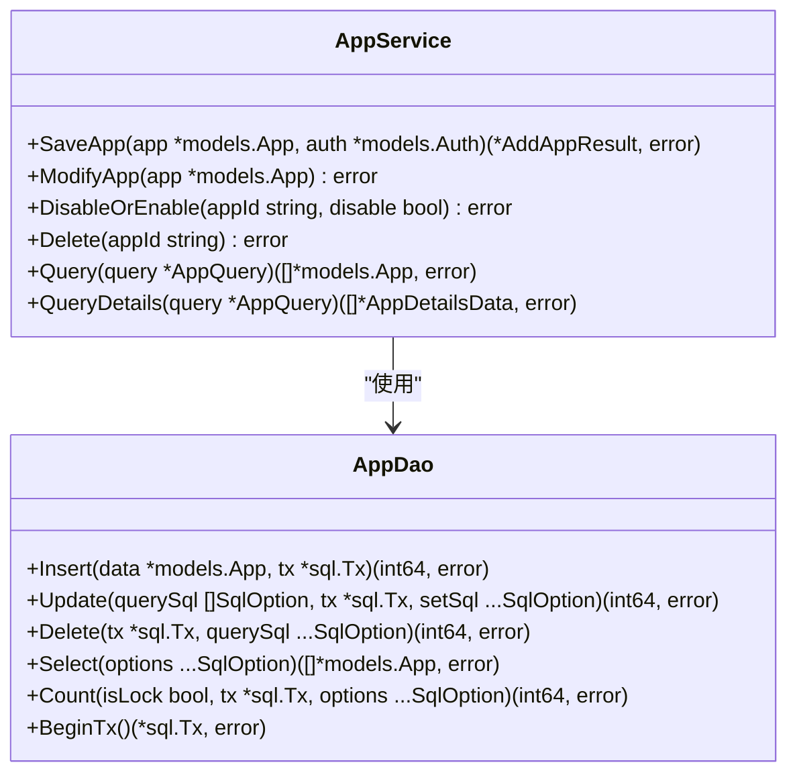
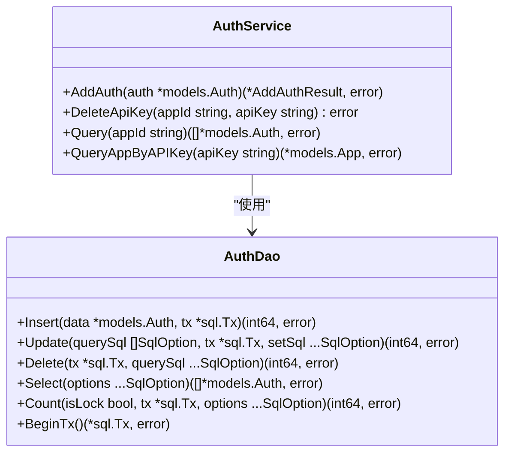
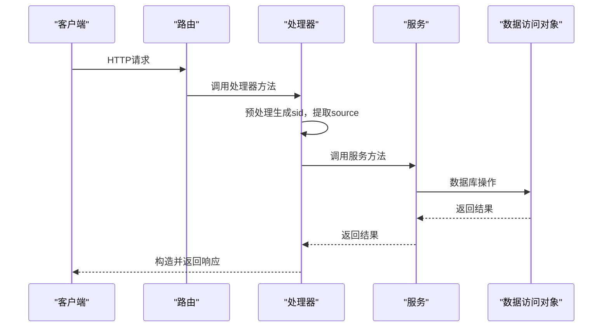
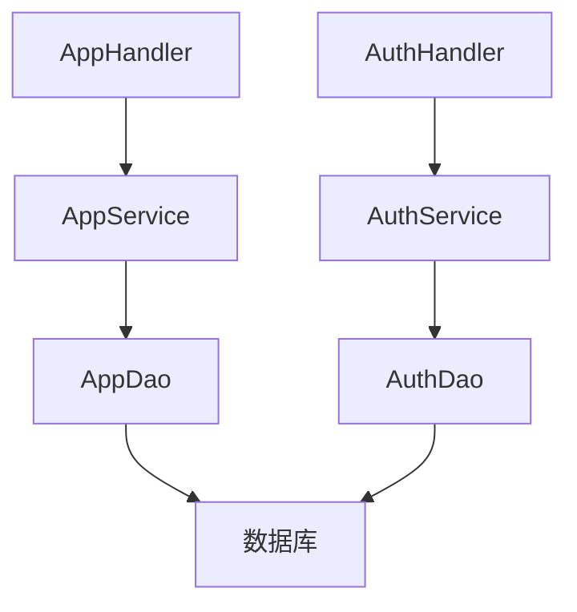

# 核心服务

<cite>
**本文档中引用的文件**  
- [app_service.go](file://core/tenant/internal/service/app_service.go)
- [auth_service.go](file://core/tenant/internal/service/auth_service.go)
- [app_handler.go](file://core/tenant/internal/handler/app_handler.go)
- [auth_handler.go](file://core/tenant/internal/handler/auth_handler.go)
- [router.go](file://core/tenant/internal/handler/router.go)
- [app_dao.go](file://core/tenant/internal/dao/app_dao.go)
- [auth_dao.go](file://core/tenant/internal/dao/auth_dao.go)
- [server.go](file://core/tenant/app/server.go)
- [config.go](file://core/tenant/config/config.go)
</cite>

## 目录
1. [简介](#简介)
2. [项目结构](#项目结构)
3. [核心组件](#核心组件)
4. [架构概述](#架构概述)
5. [详细组件分析](#详细组件分析)
6. [依赖分析](#依赖分析)
7. [性能考虑](#性能考虑)
8. [故障排除指南](#故障排除指南)
9. [结论](#结论)

## 简介
本文档详细介绍了astron-agent项目中租户服务的核心功能，重点分析了应用管理和服务鉴权的实现机制。文档深入探讨了应用的创建、更新、删除和查询业务逻辑，解析了认证授权流程，包括令牌生成、验证和权限检查机制，并说明了API端点的请求处理流程。同时，文档还描述了服务间调用的认证模式，特别是与Agent服务的集成方式。

## 项目结构
租户服务位于`core/tenant/`目录下，采用典型的Go语言项目分层架构。服务主要分为以下几个层次：应用层（app）、配置层（config）、内部实现层（internal）和工具层（tools）。内部实现层进一步细分为数据访问对象（dao）、模型（models）、处理器（handler）和服务（service）等包，实现了关注点分离的设计原则。

**图示来源**
- [server.go](file://core/tenant/app/server.go)
- [config.go](file://core/tenant/config/config.go)

**章节来源**
- [server.go](file://core/tenant/app/server.go)
- [config.go](file://core/tenant/config/config.go)

## 核心组件
租户服务的核心组件包括应用服务（AppService）、认证服务（AuthService）、应用处理器（AppHandler）和认证处理器（AuthHandler）。这些组件协同工作，提供了完整的应用生命周期管理和安全认证功能。应用服务负责处理应用的创建、修改、删除和查询等业务逻辑，而认证服务则管理API密钥的生成、验证和删除。处理器层作为HTTP请求的入口，负责参数验证和调用相应的服务层方法。

**章节来源**
- [app_service.go](file://core/tenant/internal/service/app_service.go)
- [auth_service.go](file://core/tenant/internal/service/auth_service.go)
- [app_handler.go](file://core/tenant/internal/handler/app_handler.go)
- [auth_handler.go](file://core/tenant/internal/handler/auth_handler.go)

## 架构概述
租户服务采用分层架构设计，从上到下依次为：HTTP路由层、处理器层、服务层和数据访问层。HTTP路由层使用Gin框架处理HTTP请求，处理器层负责请求参数的解析和验证，服务层实现核心业务逻辑，数据访问层则封装了对数据库的CRUD操作。这种分层设计确保了代码的可维护性和可测试性。

**图示来源**
- [router.go](file://core/tenant/internal/handler/router.go)
- [app_handler.go](file://core/tenant/internal/handler/app_handler.go)
- [app_service.go](file://core/tenant/internal/service/app_service.go)
- [app_dao.go](file://core/tenant/internal/dao/app_dao.go)

## 详细组件分析

### 应用服务分析
应用服务（AppService）是租户服务的核心业务逻辑组件，负责管理应用的整个生命周期。服务提供了创建、修改、禁用/启用、删除和查询应用的方法。在创建应用时，服务会验证应用名称的唯一性，并自动生成应用ID和API密钥。所有数据库操作都在事务中执行，确保了数据的一致性。

**图示来源**
- [app_service.go](file://core/tenant/internal/service/app_service.go)
- [app_dao.go](file://core/tenant/internal/dao/app_dao.go)

**章节来源**
- [app_service.go](file://core/tenant/internal/service/app_service.go)
- [app_dao.go](file://core/tenant/internal/dao/app_dao.go)

### 认证服务分析
认证服务（AuthService）负责管理API密钥的生命周期，包括创建、删除和查询。服务在创建新的API密钥时，会验证应用ID的有效性以及API密钥的唯一性。认证服务与应用服务紧密协作，确保只有有效的应用才能拥有API密钥，从而保障了系统的安全性。

**图示来源**
- [auth_service.go](file://core/tenant/internal/service/auth_service.go)
- [auth_dao.go](file://core/tenant/internal/dao/auth_dao.go)

**章节来源**
- [auth_service.go](file://core/tenant/internal/service/auth_service.go)
- [auth_dao.go](file://core/tenant/internal/dao/auth_dao.go)

### API请求处理流程
API请求处理流程从HTTP路由开始，经过预处理中间件，到达相应的处理器方法。处理器负责解析请求参数，调用服务层方法，并构造响应。预处理中间件生成唯一的请求ID（sid）并从请求头中提取来源信息，这些信息用于日志记录和追踪。

**图示来源**
- [router.go](file://core/tenant/internal/handler/router.go)
- [app_handler.go](file://core/tenant/internal/handler/app_handler.go)
- [app_service.go](file://core/tenant/internal/service/app_service.go)
- [app_dao.go](file://core/tenant/internal/dao/app_dao.go)

**章节来源**
- [router.go](file://core/tenant/internal/handler/router.go)
- [app_handler.go](file://core/tenant/internal/handler/app_handler.go)

## 依赖分析
租户服务的组件之间存在清晰的依赖关系。处理器层依赖于服务层，服务层依赖于数据访问层，而数据访问层直接依赖于数据库。这种单向依赖关系确保了系统的模块化和可维护性。服务层不直接依赖于处理器层，这使得服务可以被不同的处理器重用，也便于单元测试。

**图示来源**
- [app_handler.go](file://core/tenant/internal/handler/app_handler.go)
- [auth_handler.go](file://core/tenant/internal/handler/auth_handler.go)
- [app_service.go](file://core/tenant/internal/service/app_service.go)
- [auth_service.go](file://core/tenant/internal/service/auth_service.go)
- [app_dao.go](file://core/tenant/internal/dao/app_dao.go)
- [auth_dao.go](file://core/tenant/internal/dao/auth_dao.go)

**章节来源**
- [app_handler.go](file://core/tenant/internal/handler/app_handler.go)
- [auth_handler.go](file://core/tenant/internal/handler/auth_handler.go)
- [app_service.go](file://core/tenant/internal/service/app_service.go)
- [auth_service.go](file://core/tenant/internal/service/auth_service.go)

## 性能考虑
租户服务在设计时考虑了性能因素。数据库操作使用了连接池，避免了频繁创建和销毁连接的开销。所有写操作都在事务中执行，确保了数据的一致性，同时通过适当的索引优化了查询性能。服务还实现了错误处理和日志记录，便于问题排查和性能监控。

## 故障排除指南
当遇到问题时，首先检查日志文件。日志中包含了详细的错误信息和请求ID，可以帮助快速定位问题。对于数据库相关的问题，检查数据库连接配置和表结构是否正确。对于API调用失败，检查请求参数是否符合要求，以及API密钥是否有效。

**章节来源**
- [app_service.go](file://core/tenant/internal/service/app_service.go)
- [auth_service.go](file://core/tenant/internal/service/auth_service.go)
- [app_handler.go](file://core/tenant/internal/handler/app_handler.go)

## 结论
租户服务通过清晰的分层架构和模块化设计，实现了应用管理和认证授权的核心功能。服务具有良好的可维护性和可扩展性，为astron-agent项目提供了稳定可靠的基础支持。通过深入理解服务的架构和实现细节，开发者可以更有效地进行功能扩展和问题排查。