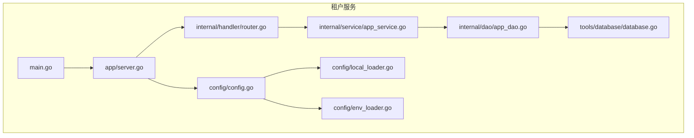
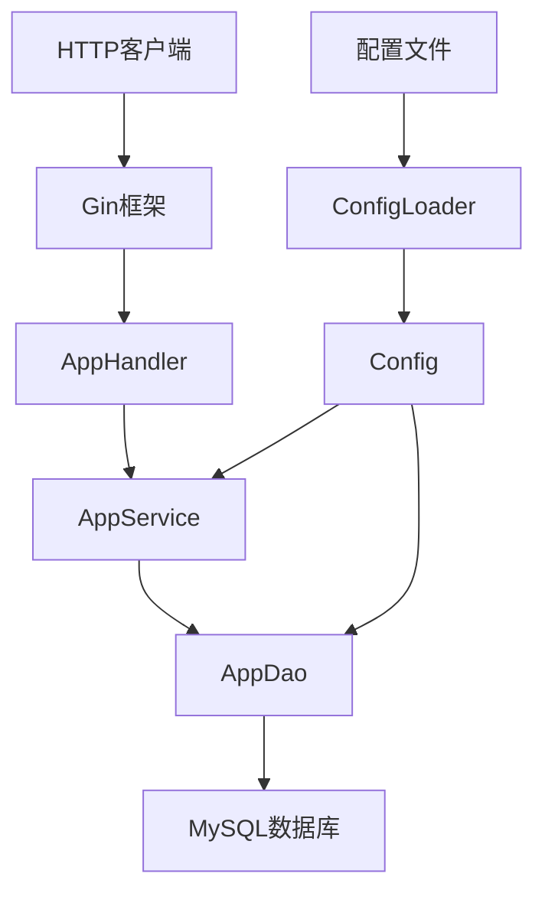
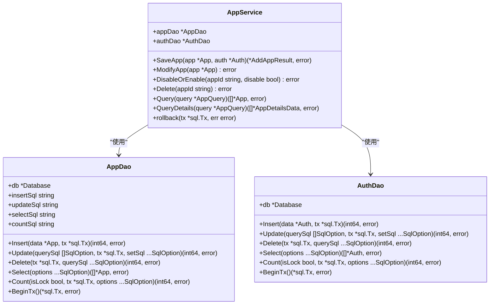
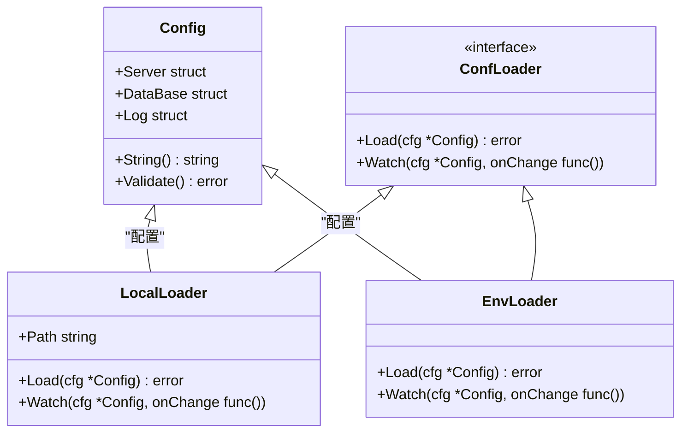
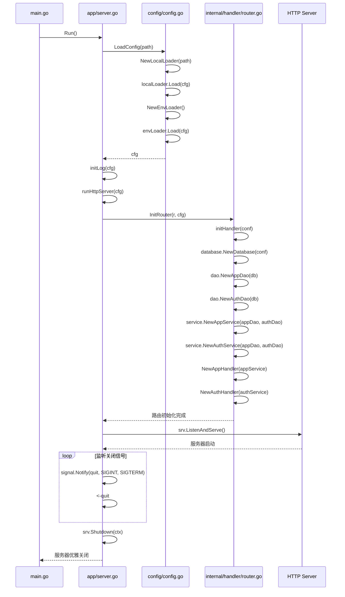
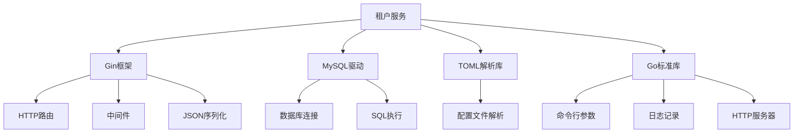

# 租户服务

<cite>
**本文档引用的文件**  
- [main.go](file://core/tenant/main.go)
- [server.go](file://core/tenant/app/server.go)
- [config.go](file://core/tenant/config/config.go)
- [env_loader.go](file://core/tenant/config/env_loader.go)
- [local_loader.go](file://core/tenant/config/local_loader.go)
- [loader.go](file://core/tenant/config/loader.go)
- [app_service.go](file://core/tenant/internal/service/app_service.go)
- [app_dao.go](file://core/tenant/internal/dao/app_dao.go)
- [app_handler.go](file://core/tenant/internal/handler/app_handler.go)
- [router.go](file://core/tenant/internal/handler/router.go)
- [database.go](file://core/tenant/tools/database/database.go)
- [config.toml](file://core/tenant/config.toml)
</cite>

## 目录
1. [简介](#简介)
2. [项目结构](#项目结构)
3. [核心组件](#核心组件)
4. [架构概述](#架构概述)
5. [详细组件分析](#详细组件分析)
6. [依赖分析](#依赖分析)
7. [性能考量](#性能考量)
8. [故障排除指南](#故障排除指南)
9. [结论](#结论)

## 简介
租户服务是Astron Agent平台的核心组件，负责管理多租户环境下的应用和认证信息。该服务使用Go语言实现，提供了应用的创建、修改、查询、禁用和删除等完整生命周期管理功能。服务通过Gin框架提供RESTful API，采用MySQL作为持久化存储，实现了租户间的数据隔离和安全访问控制。本文档详细介绍了服务的架构设计、启动流程、配置管理机制以及与其他微服务的集成方式。

## 项目结构
租户服务采用分层架构设计，主要包含以下目录结构：
- **app**: 服务启动和HTTP服务器配置
- **config**: 配置管理，支持TOML文件和环境变量加载
- **internal**: 核心业务逻辑，包含dao、handler、models和service子包
- **tools**: 工具类，包括数据库连接和ID生成器
- **go.mod**: Go模块定义

**图示来源**
- [main.go](file://core/tenant/main.go)
- [server.go](file://core/tenant/app/server.go)
- [config.go](file://core/tenant/config/config.go)
- [router.go](file://core/tenant/internal/handler/router.go)
- [app_service.go](file://core/tenant/internal/service/app_service.go)
- [app_dao.go](file://core/tenant/internal/dao/app_dao.go)
- [database.go](file://core/tenant/tools/database/database.go)
- [local_loader.go](file://core/tenant/config/local_loader.go)
- [env_loader.go](file://core/tenant/config/env_loader.go)

**本节来源**
- [main.go](file://core/tenant/main.go)
- [server.go](file://core/tenant/app/server.go)

## 核心组件
租户服务的核心组件包括配置管理、数据库访问、业务服务和HTTP处理器。配置管理组件支持从TOML文件和环境变量加载配置；数据库访问组件封装了MySQL连接和SQL操作；业务服务组件实现了应用和认证的业务逻辑；HTTP处理器组件将HTTP请求映射到相应的业务服务方法。这些组件通过依赖注入的方式组合在一起，确保了代码的可测试性和可维护性。

**本节来源**
- [config.go](file://core/tenant/config/config.go)
- [database.go](file://core/tenant/tools/database/database.go)
- [app_service.go](file://core/tenant/internal/service/app_service.go)
- [app_handler.go](file://core/tenant/internal/handler/app_handler.go)

## 架构概述
租户服务采用典型的分层架构，从上到下分为HTTP接口层、业务逻辑层、数据访问层和数据存储层。HTTP接口层使用Gin框架处理HTTP请求和响应；业务逻辑层实现应用和认证的核心业务规则；数据访问层封装了对MySQL数据库的CRUD操作；数据存储层使用MySQL存储应用和认证信息。服务启动时，通过配置加载器从TOML文件和环境变量中读取配置，初始化数据库连接，然后启动HTTP服务器。

**图示来源**
- [server.go](file://core/tenant/app/server.go)
- [app_handler.go](file://core/tenant/internal/handler/app_handler.go)
- [app_service.go](file://core/tenant/internal/service/app_service.go)
- [app_dao.go](file://core/tenant/internal/dao/app_dao.go)
- [config.go](file://core/tenant/config/config.go)

## 详细组件分析

### 应用服务分析
应用服务组件（AppService）负责处理应用相关的业务逻辑，包括应用的创建、修改、查询、禁用和删除。服务采用事务管理确保数据一致性，在创建应用时同时创建对应的认证信息。服务通过依赖注入接收AppDao和AuthDao实例，实现了业务逻辑与数据访问的解耦。

**图示来源**
- [app_service.go](file://core/tenant/internal/service/app_service.go)
- [app_dao.go](file://core/tenant/internal/dao/app_dao.go)

**本节来源**
- [app_service.go](file://core/tenant/internal/service/app_service.go)
- [app_dao.go](file://core/tenant/internal/dao/app_dao.go)

### 配置管理分析
配置管理组件支持从TOML文件和环境变量加载配置，提供了灵活的配置管理机制。配置加载器实现了ConfLoader接口，包括LocalLoader和EnvLoader两种实现。LocalLoader从TOML文件加载配置，EnvLoader从环境变量加载配置。服务启动时，首先从TOML文件加载配置，然后从环境变量加载配置，环境变量的优先级高于TOML文件。

**图示来源**
- [config.go](file://core/tenant/config/config.go)
- [loader.go](file://core/tenant/config/loader.go)
- [local_loader.go](file://core/tenant/config/local_loader.go)
- [env_loader.go](file://core/tenant/config/env_loader.go)

**本节来源**
- [config.go](file://core/tenant/config/config.go)
- [loader.go](file://core/tenant/config/loader.go)
- [local_loader.go](file://core/tenant/config/local_loader.go)
- [env_loader.go](file://core/tenant/config/env_loader.go)

### 服务启动流程分析
服务启动流程从main函数开始，调用app.Run()方法启动服务。Run方法首先解析命令行参数获取配置文件路径，然后调用config.LoadConfig()加载配置。配置加载完成后，初始化日志系统，最后调用runHttpServer()启动HTTP服务器。HTTP服务器使用Gin框架，注册了应用和认证相关的路由，并实现了优雅关闭。

**图示来源**
- [main.go](file://core/tenant/main.go)
- [server.go](file://core/tenant/app/server.go)
- [config.go](file://core/tenant/config/config.go)
- [router.go](file://core/tenant/internal/handler/router.go)
- [database.go](file://core/tenant/tools/database/database.go)

**本节来源**
- [main.go](file://core/tenant/main.go)
- [server.go](file://core/tenant/app/server.go)
- [config.go](file://core/tenant/config/config.go)
- [router.go](file://core/tenant/internal/handler/router.go)

## 依赖分析
租户服务的主要外部依赖包括Gin Web框架、MySQL驱动和TOML解析库。Gin框架用于处理HTTP请求和响应，提供了路由、中间件和JSON序列化等功能。MySQL驱动用于连接和操作MySQL数据库。TOML解析库用于从配置文件中加载配置。服务还依赖于Go标准库中的flag、log、net/http等包。

**图示来源**
- [go.mod](file://core/tenant/go.mod)

**本节来源**
- [go.mod](file://core/tenant/go.mod)

## 性能考量
租户服务在性能方面进行了多项优化。数据库连接使用连接池，通过MaxOpenConns和MaxIdleConns配置控制连接数量，避免了频繁创建和销毁连接的开销。SQL操作使用预编译语句，提高了执行效率。服务采用Gin框架，具有较高的HTTP处理性能。日志系统通过SetOutput重定向到文件，减少了标准输出的I/O开销。服务还实现了优雅关闭，在接收到关闭信号后，会等待正在进行的请求完成后再关闭服务器，确保了服务的稳定性。

## 故障排除指南
当租户服务出现问题时，可以按照以下步骤进行排查：
1. 检查服务日志，查看是否有错误信息
2. 检查配置文件和环境变量，确保配置正确
3. 检查数据库连接，确保数据库服务正常运行
4. 检查网络连接，确保服务端口未被占用
5. 检查依赖服务，确保相关微服务正常运行

常见问题包括配置加载失败、数据库连接失败、HTTP服务器启动失败等。对于配置加载失败，需要检查配置文件路径和格式；对于数据库连接失败，需要检查数据库地址、用户名和密码；对于HTTP服务器启动失败，需要检查端口是否被占用。

**本节来源**
- [server.go](file://core/tenant/app/server.go)
- [config.go](file://core/tenant/config/config.go)
- [database.go](file://core/tenant/tools/database/database.go)

## 结论
租户服务通过Go语言实现了高效、可靠的多租户管理功能。服务采用分层架构设计，代码结构清晰，易于维护和扩展。配置管理机制灵活，支持TOML文件和环境变量两种方式。数据库访问层封装了SQL操作，实现了数据访问的抽象。业务逻辑层实现了应用和认证的核心功能，确保了数据的一致性和完整性。HTTP接口层使用Gin框架，提供了高性能的RESTful API。服务还实现了优雅关闭，提高了系统的稳定性。对于未来的扩展，可以考虑增加租户配额管理、资源限制和计费集成等功能。