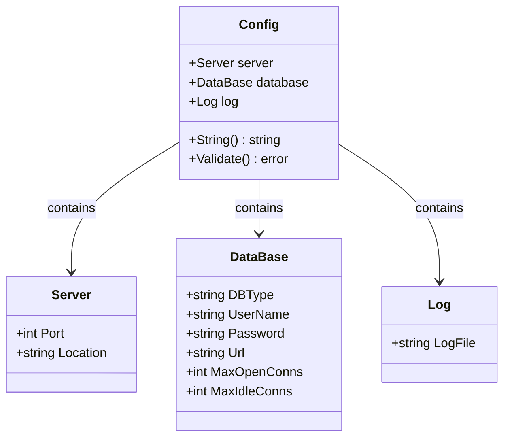
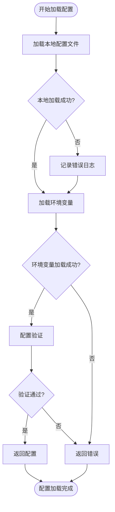
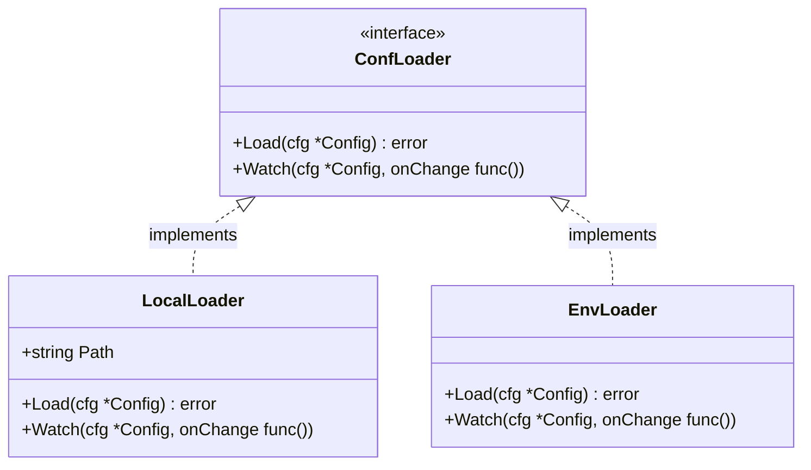
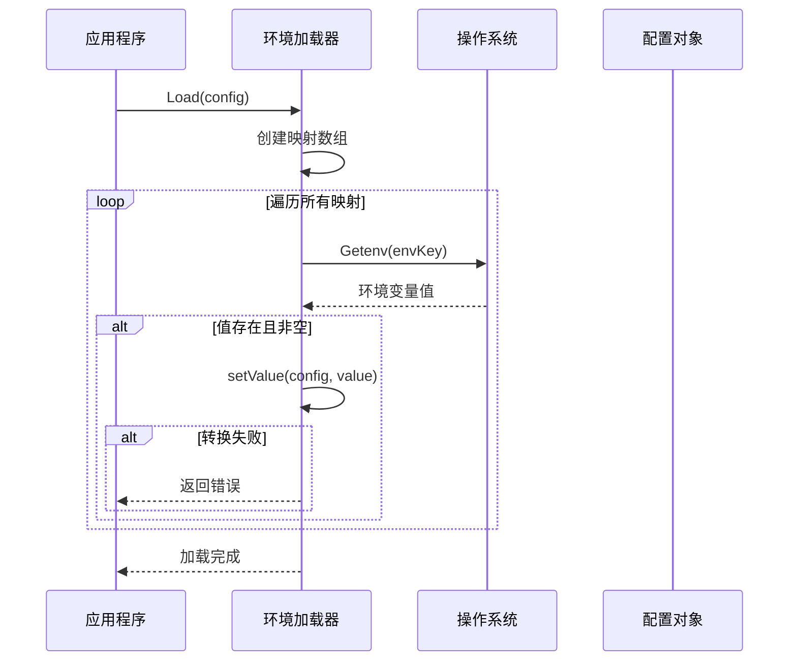
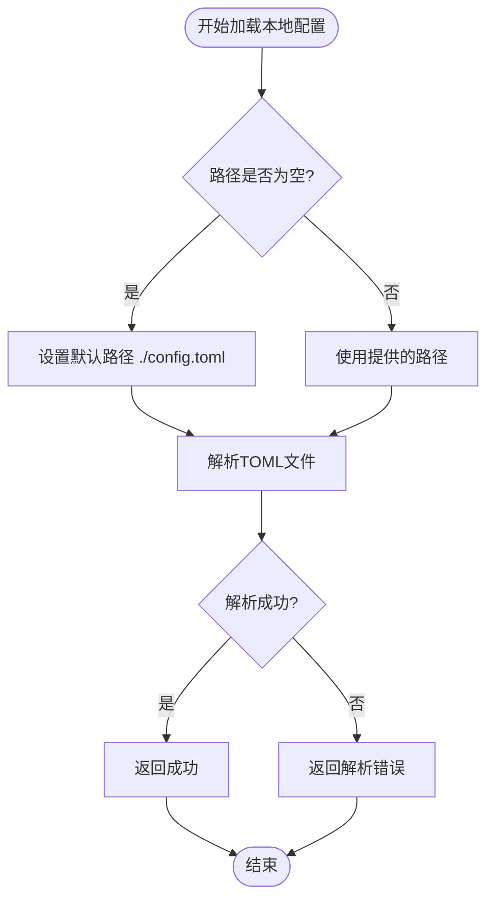
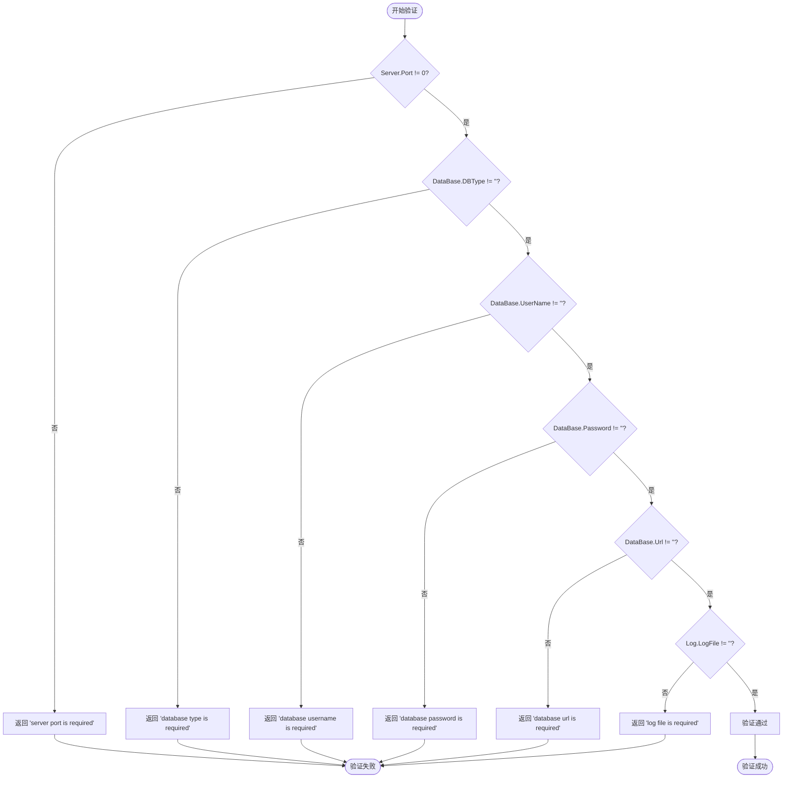
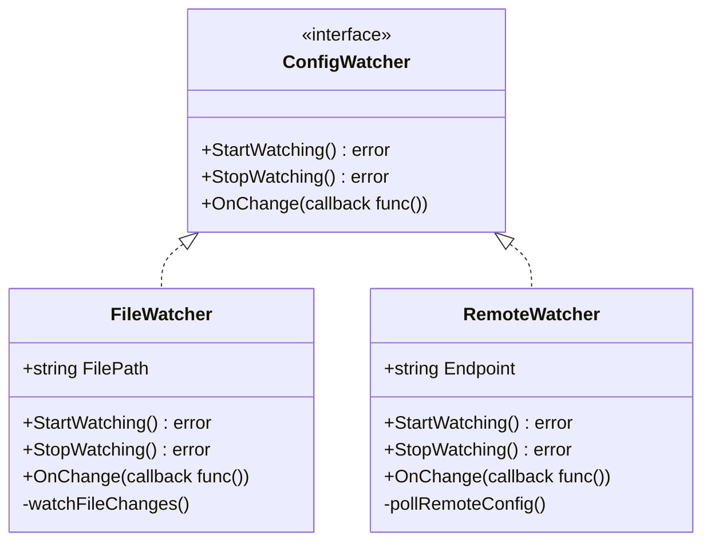

# 配置管理

<cite>
**本文档引用的文件**
- [config.go](file://core/tenant/config/config.go)
- [env_loader.go](file://core/tenant/config/env_loader.go)
- [loader.go](file://core/tenant/config/loader.go)
- [local_loader.go](file://core/tenant/config/local_loader.go)
- [config.toml](file://core/tenant/config.toml)
- [config_test.go](file://core/tenant/config/config_test.go)
- [env_loader_test.go](file://core/tenant/config/env_loader_test.go)
- [local_loader_test.go](file://core/tenant/config/local_loader_test.go)
- [server.go](file://core/tenant/app/server.go)
- [main.go](file://core/tenant/main.go)
</cite>

## 目录
1. [概述](#概述)
2. [配置结构设计](#配置结构设计)
3. [配置加载机制](#配置加载机制)
4. [环境变量处理](#环境变量处理)
5. [配置文件管理](#配置文件管理)
6. [配置验证与错误处理](#配置验证与错误处理)
7. [配置热更新机制](#配置热更新机制)
8. [最佳实践与建议](#最佳实践与建议)
9. [故障排除指南](#故障排除指南)

## 概述

astron-agent租户服务采用多层次的配置管理系统，支持本地配置文件和环境变量的灵活组合。该系统提供了完整的配置加载、验证和管理功能，确保服务在不同环境下的稳定运行。

### 核心特性

- **多源配置加载**：支持本地TOML配置文件和环境变量两种配置来源
- **配置优先级**：环境变量优先于本地配置文件
- **类型安全**：强类型的配置结构，自动类型转换和验证
- **配置验证**：内置完整性检查和错误报告
- **扩展性**：可插拔的配置加载器架构

## 配置结构设计

### 主要配置结构



**图表来源**
- [config.go](file://core/tenant/config/config.go#L4-L22)

### 配置字段详解

| 配置项 | 类型 | 默认值 | 必填 | 描述 |
|--------|------|--------|------|------|
| `Server.Port` | int | 无 | 是 | 服务监听端口号 |
| `Server.Location` | string | 空字符串 | 否 | 服务地理位置标识 |
| `DataBase.DBType` | string | 空字符串 | 是 | 数据库类型（mysql等） |
| `DataBase.UserName` | string | 空字符串 | 是 | 数据库用户名 |
| `DataBase.Password` | string | 空字符串 | 是 | 数据库密码 |
| `DataBase.Url` | string | 空字符串 | 是 | 数据库连接URL |
| `DataBase.MaxOpenConns` | int | 0 | 否 | 最大打开连接数 |
| `DataBase.MaxIdleConns` | int | 0 | 否 | 最大空闲连接数 |
| `Log.LogFile` | string | 空字符串 | 是 | 日志文件路径 |

**章节来源**
- [config.go](file://core/tenant/config/config.go#L4-L22)

## 配置加载机制

### 加载流程架构



**图表来源**
- [config.go](file://core/tenant/config/config.go#L35-L50)

### 配置加载接口

系统定义了统一的配置加载接口，支持多种加载器的扩展：



**图表来源**
- [loader.go](file://core/tenant/config/loader.go#L3-L6)
- [local_loader.go](file://core/tenant/config/local_loader.go#L5-L10)
- [env_loader.go](file://core/tenant/config/env_loader.go#L8-L12)

**章节来源**
- [loader.go](file://core/tenant/config/loader.go#L3-L6)
- [local_loader.go](file://core/tenant/config/local_loader.go#L5-L10)
- [env_loader.go](file://core/tenant/config/env_loader.go#L8-L12)

## 环境变量处理

### 环境变量映射表

系统将环境变量映射到配置结构的对应字段：

| 环境变量名 | 配置字段 | 类型转换 | 验证规则 |
|------------|----------|----------|----------|
| `SERVICE_PORT` | `Server.Port` | 字符串转整数 | 必须为有效整数 |
| `SERVICE_LOCATION` | `Server.Location` | 字符串直接赋值 | 无特殊验证 |
| `DATABASE_DB_TYPE` | `DataBase.DBType` | 字符串直接赋值 | 无特殊验证 |
| `DATABASE_USERNAME` | `DataBase.UserName` | 字符串直接赋值 | 无特殊验证 |
| `DATABASE_PASSWORD` | `DataBase.Password` | 字符串直接赋值 | 无特殊验证 |
| `DATABASE_URL` | `DataBase.Url` | 字符串直接赋值 | 无特殊验证 |
| `DATABASE_MAX_OPEN_CONNS` | `DataBase.MaxOpenConns` | 字符串转整数 | 必须为有效整数 |
| `DATABASE_MAX_IDLE_CONNS` | `DataBase.MaxIdleConns` | 字符串转整数 | 必须为有效整数 |
| `LOG_PATH` | `Log.LogFile` | 字符串直接赋值 | 无特殊验证 |

### 环境变量加载流程



**图表来源**
- [env_loader.go](file://core/tenant/config/env_loader.go#L18-L35)

**章节来源**
- [env_loader.go](file://core/tenant/config/env_loader.go#L18-L95)

## 配置文件管理

### 本地配置文件加载

系统支持从指定路径加载TOML格式的配置文件，默认路径为`./config.toml`：



**图表来源**
- [local_loader.go](file://core/tenant/config/local_loader.go#L11-L20)

### 配置文件示例

标准的配置文件结构如下：

```toml
[service]
port = 5052
location = "ss"

[database]
dbType = "mysql"
username = "root"
password = "123456"
url = "(localhost:3306)/tenant"
maxOpenConns = 10
maxIdleConns = 5

[log]
path = "./logs/app.log"
```

**章节来源**
- [local_loader.go](file://core/tenant/config/local_loader.go#L11-L20)
- [config.toml](file://core/tenant/config.toml#L1-L15)

## 配置验证与错误处理

### 验证规则

系统实现了完整的配置验证机制，确保所有必需字段都已正确设置：



**图表来源**
- [config.go](file://core/tenant/config/config.go#L24-L40)

### 错误处理策略

系统采用分层的错误处理策略：

1. **加载阶段错误**：本地文件不存在时继续尝试环境变量
2. **解析阶段错误**：环境变量格式错误时立即返回
3. **验证阶段错误**：配置不完整时阻止服务启动

**章节来源**
- [config.go](file://core/tenant/config/config.go#L24-L40)
- [config_test.go](file://core/tenant/config/config_test.go#L45-L150)

## 配置热更新机制

### 当前实现状态

目前系统的配置加载器接口定义了`Watch`方法，但实际实现均为无操作的空函数：

```go
func (l *EnvLoader) Watch(cfg *Config, onChange func()) {
    // 当前为空实现
}

func (l *LocalLoader) Watch(cfg *Config, onChange func()) {
    // 当前为空实现
}
```

### 扩展建议

为了实现真正的配置热更新，可以考虑以下扩展方案：



### 实现步骤

1. **文件监控**：使用`fsnotify`库监控配置文件变化
2. **远程同步**：集成配置中心（如Consul、Etcd）
3. **回调机制**：触发配置更新事件
4. **原子更新**：确保配置更新的原子性

**章节来源**
- [loader.go](file://core/tenant/config/loader.go#L4-L6)
- [local_loader.go](file://core/tenant/config/local_loader.go#L22-L24)

## 最佳实践与建议

### 配置管理最佳实践

1. **环境隔离**
   - 开发环境：使用本地配置文件
   - 测试环境：混合使用配置文件和环境变量
   - 生产环境：优先使用环境变量

2. **敏感信息保护**
   ```bash
   # 推荐：使用环境变量存储敏感信息
   export DATABASE_PASSWORD="secure_password_123"
   export DATABASE_URL="production.database.com:3306"
   
   # 不推荐：将敏感信息写入配置文件
   ```

3. **配置验证**
   ```go
   // 在应用启动时进行完整配置验证
   cfg, err := config.LoadConfig(configPath)
   if err != nil {
       log.Fatalf("配置加载失败: %v", err)
   }
   ```

4. **默认值设置**
   ```go
   // 在代码中设置合理的默认值
   if cfg.Server.Port == 0 {
       cfg.Server.Port = 8080
   }
   ```

### 配置命名规范

- 使用大写字母和下划线：`DATABASE_MAX_OPEN_CONNS`
- 明确的层次结构：`SERVICE_*`、`DATABASE_*`、`LOG_*`
- 避免歧义：使用具体描述而非缩写

### 安全配置建议

1. **权限控制**：配置文件应设置适当的文件权限
2. **加密存储**：敏感配置应加密存储
3. **审计日志**：记录配置变更历史
4. **版本控制**：重要配置应纳入版本控制系统

## 故障排除指南

### 常见问题及解决方案

#### 1. 配置文件加载失败

**症状**：服务启动时报错"failed to load config from file"

**可能原因**：
- 配置文件路径错误
- 文件权限不足
- TOML语法错误

**解决方案**：
```bash
# 检查文件路径
ls -la ./config/config.toml

# 检查文件权限
chmod 644 ./config/config.toml

# 验证TOML语法
cat ./config/config.toml | python -m json.tool  # 使用Python验证JSON兼容性
```

#### 2. 环境变量未生效

**症状**：环境变量设置后配置未更新

**可能原因**：
- 环境变量名称拼写错误
- 环境变量值格式不正确
- 服务重启前环境变量已设置

**解决方案**：
```bash
# 检查环境变量
echo $DATABASE_DB_TYPE

# 设置正确的环境变量
export DATABASE_DB_TYPE=mysql

# 重启服务以应用新配置
kill -HUP $(pgrep tenant)
```

#### 3. 配置验证失败

**症状**：服务启动时报错"database type is required"

**可能原因**：
- 必需字段缺失
- 字段值为空
- 类型转换失败

**解决方案**：
```bash
# 检查必需字段
echo "Database Type: $DATABASE_DB_TYPE"
echo "Database URL: $DATABASE_URL"

# 设置必需字段
export DATABASE_DB_TYPE=mysql
export DATABASE_URL=localhost:3306
```

### 调试技巧

1. **启用调试日志**
   ```go
   // 在config.go中添加调试输出
   fmt.Printf("Loaded config: %+v\n", cfg)
   ```

2. **分步验证**
   ```bash
   # 单独测试环境变量加载
   go test -run TestEnvLoader
   
   # 单独测试配置文件加载
   go test -run TestLocalLoader
   ```

3. **配置导出**
   ```go
   // 添加配置导出功能用于调试
   func (c *Config) Export() map[string]interface{} {
       return map[string]interface{}{
           "port":           c.Server.Port,
           "location":       c.Server.Location,
           "dbType":         c.DataBase.DBType,
           "dbUrl":          c.DataBase.Url,
           "logPath":        c.Log.LogFile,
       }
   }
   ```

**章节来源**
- [config_test.go](file://core/tenant/config/config_test.go#L300-L424)
- [env_loader_test.go](file://core/tenant/config/env_loader_test.go#L150-L392)

## 总结

astron-agent的租户服务配置管理系统提供了灵活、可靠的配置管理解决方案。通过本地配置文件和环境变量的结合使用，系统能够适应不同的部署环境和需求。完善的验证机制确保了配置的完整性和正确性，而可扩展的架构为未来的功能增强奠定了基础。

建议在实际使用中遵循最佳实践，特别是在生产环境中妥善处理敏感信息，并考虑实现配置热更新功能以提高系统的灵活性和可用性。