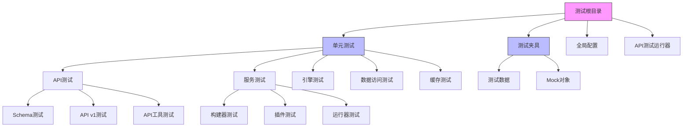
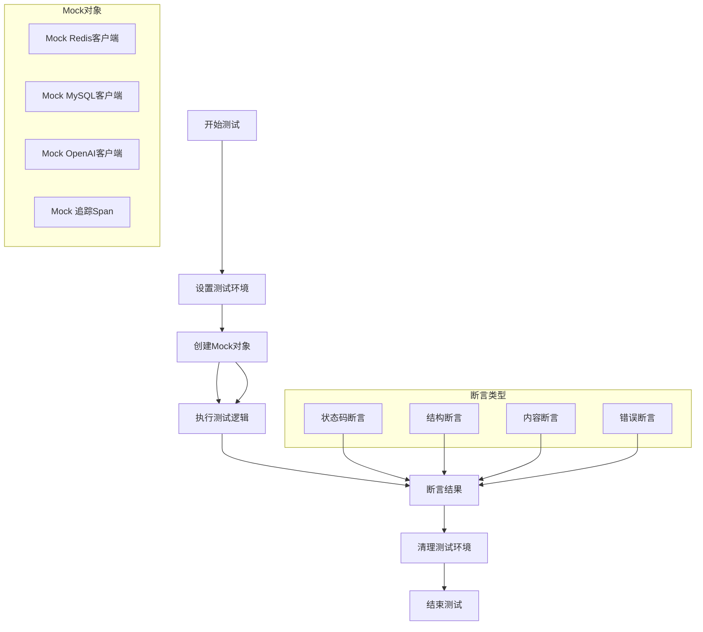
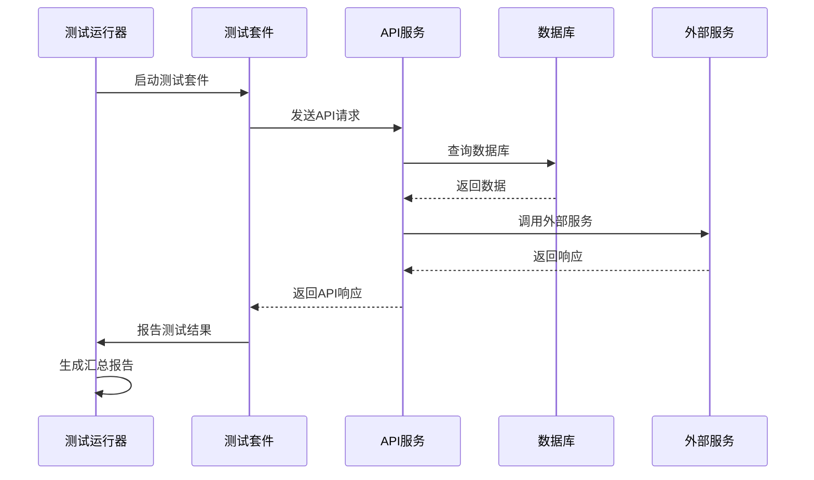
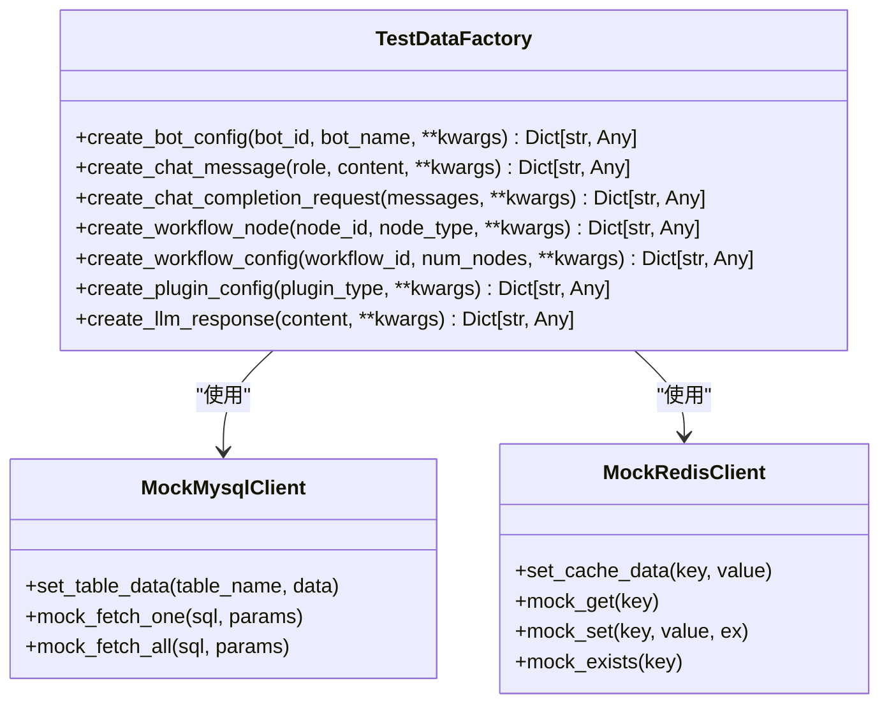
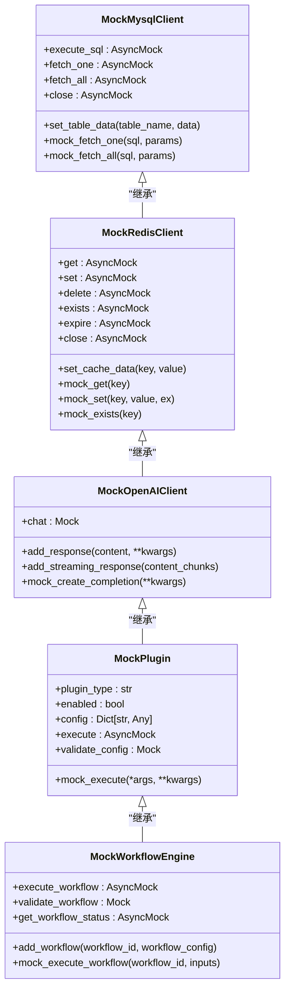
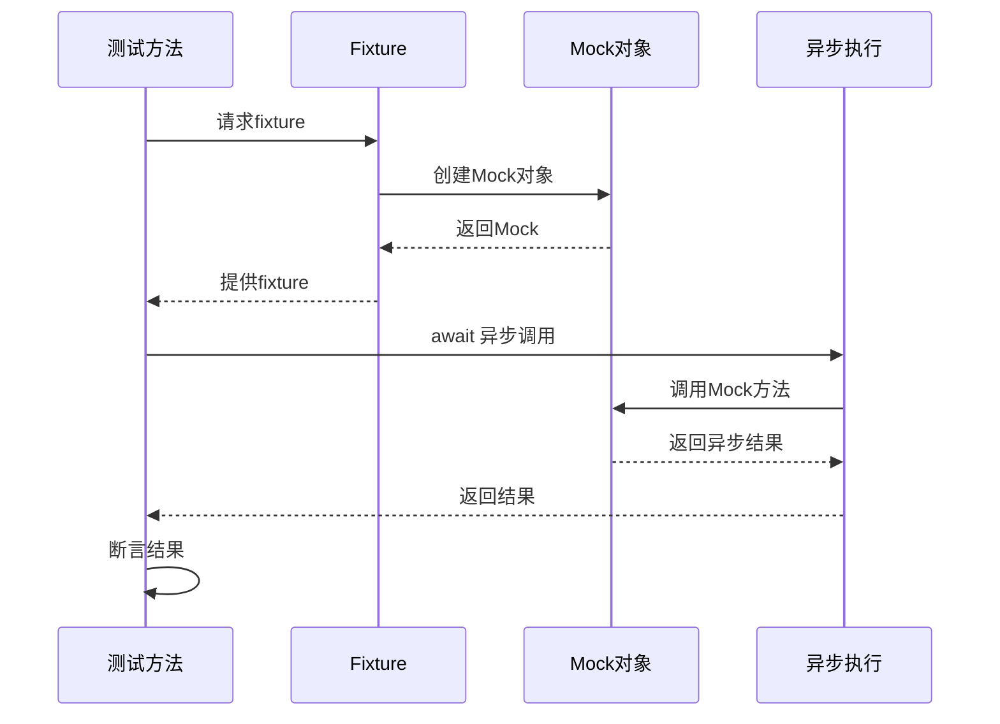
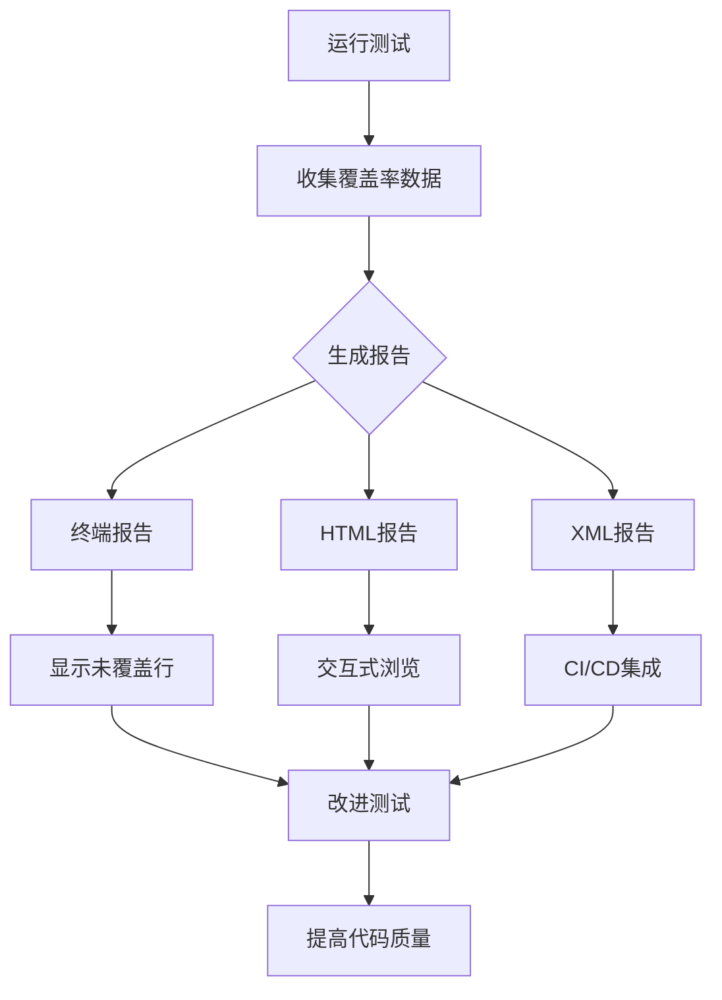
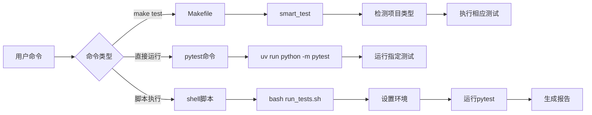
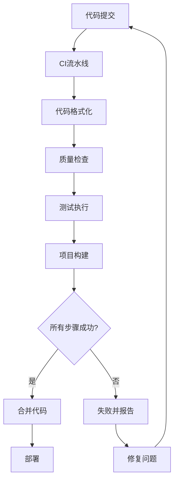

# 测试策略

<cite>
**本文档中引用的文件**  
- [conftest.py](file://core/agent/tests/conftest.py)
- [test_data.py](file://core/agent/tests/fixtures/test_data.py)
- [mocks.py](file://core/agent/tests/fixtures/mocks.py)
- [test_workflow_agent.py](file://core/agent/tests/unit/api/v1/test_workflow_agent.py)
- [test_knowledge_plugin.py](file://core/agent/tests/unit/service/plugin/test_knowledge_plugin.py)
- [test_workflow_agent_runner.py](file://core/agent/tests/unit/engine/test_workflow_agent_runner.py)
- [run_all_api_tests.py](file://core/agent/tests/run_all_api_tests.py)
- [pyproject.toml](file://core/agent/pyproject.toml)
- [pytest.ini](file://core/common/pytest.ini)
- [run_tests.sh](file://core/common/run_tests.sh)
- [Makefile](file://Makefile)
</cite>

## 目录
1. [项目测试体系概述](#项目测试体系概述)
2. [测试组织结构](#测试组织结构)
3. [测试依赖与配置](#测试依赖与配置)
4. [单元测试实践](#单元测试实践)
5. [集成测试与端到端测试](#集成测试与端到端测试)
6. [测试数据管理](#测试数据管理)
7. [Mock与Fixture使用](#mock与fixture使用)
8. [异步测试处理](#异步测试处理)
9. [测试覆盖率与报告](#测试覆盖率与报告)
10. [测试执行命令](#测试执行命令)
11. [测试驱动开发与CI集成](#测试驱动开发与ci集成)

## 项目测试体系概述

astron-agent项目的测试体系基于Python的pytest框架构建，为Python微服务提供了全面的测试支持。项目采用分层测试策略，包括单元测试、集成测试和API测试，确保代码质量和功能正确性。测试体系特别关注微服务架构下的依赖隔离、异步处理和外部服务集成，通过完善的mock机制和fixture管理来保证测试的可靠性和可重复性。

测试体系的核心目标是验证agent服务的各个组件，包括API接口、业务逻辑、工作流引擎和插件系统。通过自动化测试套件，开发团队可以确保在持续集成环境中快速发现和修复问题，同时维护高质量的代码标准。

**Section sources**
- [conftest.py](file://core/agent/tests/conftest.py)
- [pyproject.toml](file://core/agent/pyproject.toml)

## 测试组织结构

项目的测试组织结构遵循清晰的分层和模块化设计，位于`core/agent/tests/`目录下。测试代码按照测试类型和功能模块进行组织，便于维护和扩展。

测试目录结构如下：
- `unit/`：存放单元测试，按功能模块进一步细分
  - `api/`：API接口单元测试
  - `service/`：服务层单元测试
  - `engine/`：工作流引擎单元测试
  - `repository/`：数据访问层单元测试
  - `cache/`：缓存层单元测试
- `fixtures/`：存放测试数据和mock对象
  - `test_data.py`：测试数据工厂和常量
  - `mocks.py`：各种依赖的mock实现
- `conftest.py`：pytest全局配置和共享fixture
- `run_all_api_tests.py`：API测试套件运行器

这种组织结构使得测试代码与生产代码保持对应关系，开发者可以轻松找到相关测试并遵循相同的模式编写新测试。每个功能模块都有对应的测试目录，确保了测试的模块化和可维护性。

**Diagram sources**
- [core/agent/tests/](file://core/agent/tests/)
- [core/agent/tests/unit/](file://core/agent/tests/unit/)

**Section sources**
- [core/agent/tests/](file://core/agent/tests/)

## 测试依赖与配置

项目的测试依赖在`pyproject.toml`文件中明确定义，确保了测试环境的一致性和可重现性。测试依赖包括核心测试框架、覆盖率工具和mock库，为不同类型的测试提供了必要的支持。

主要测试依赖包括：
- `pytest`：核心测试框架
- `pytest-asyncio`：异步测试支持
- `pytest-mock`：mock功能增强
- `pytest-cov`：代码覆盖率分析
- `httpx`：HTTP客户端测试
- `faker`：测试数据生成

测试配置通过`pyproject.toml`中的`[tool.pytest.ini_options]`部分进行管理，定义了测试路径、文件模式、命令行选项和覆盖率报告。配置中指定了源代码目录、覆盖率报告格式和最低覆盖率要求（70%），确保了测试的全面性。

此外，`core/common/pytest.ini`文件为common模块提供了独立的测试配置，包括测试路径、Python文件模式和标记定义。这种分层配置方式允许不同模块根据需要定制测试行为，同时保持整体测试策略的一致性。

**Section sources**
- [pyproject.toml](file://core/agent/pyproject.toml)
- [pytest.ini](file://core/common/pytest.ini)

## 单元测试实践

项目的单元测试实践遵循pytest的最佳实践，通过细粒度的测试用例验证各个组件的功能。单元测试主要集中在`tests/unit/`目录下，覆盖了API接口、服务层、引擎和数据访问层等关键组件。

单元测试的特点包括：
- 使用`@pytest.mark.unit`标记标识单元测试
- 通过fixture实现测试依赖的注入和管理
- 采用参数化测试提高测试覆盖率
- 验证边界条件和异常处理
- 保持测试的独立性和可重复性

例如，在`test_workflow_agent.py`中，测试类`TestWorkflowAgentAPI`包含了多个测试方法，验证了工作流API的各种场景，包括正常执行、流式响应、错误处理和并发执行。每个测试方法专注于一个特定的功能点，确保了测试的清晰性和可维护性。

**Diagram sources**
- [test_workflow_agent.py](file://core/agent/tests/unit/api/v1/test_workflow_agent.py)
- [test_knowledge_plugin.py](file://core/agent/tests/unit/service/plugin/test_knowledge_plugin.py)

**Section sources**
- [test_workflow_agent.py](file://core/agent/tests/unit/api/v1/test_workflow_agent.py)
- [test_knowledge_plugin.py](file://core/agent/tests/unit/service/plugin/test_knowledge_plugin.py)

## 集成测试与端到端测试

项目的集成测试和端到端测试通过`run_all_api_tests.py`脚本进行管理和执行，验证了API接口的完整功能和系统集成。这些测试模拟了真实的API调用场景，确保各个组件能够正确协同工作。

集成测试的特点包括：
- 测试完整的API请求-响应周期
- 验证跨组件的交互和数据流
- 模拟真实用户场景和边界条件
- 包含性能和压力测试
- 生成详细的测试报告

`APITestRunner`类负责运行所有API测试套件，包括聊天补全、自定义聊天补全和Bot配置管理等接口。测试运行器收集执行结果，生成汇总报告，包括成功率、执行时间和详细结果。这种集中式的测试管理方式确保了API测试的全面性和可重复性。

**Diagram sources**
- [run_all_api_tests.py](file://core/agent/tests/run_all_api_tests.py)

**Section sources**
- [run_all_api_tests.py](file://core/agent/tests/run_all_api_tests.py)

## 测试数据管理

项目通过`fixtures/test_data.py`文件实现了高效的测试数据管理，使用`TestDataFactory`类作为测试数据工厂。这种设计模式提供了创建各种测试数据的标准化方法，确保了测试数据的一致性和可维护性。

`TestDataFactory`类提供了以下数据创建方法：
- `create_bot_config()`：创建Bot配置数据
- `create_chat_message()`：创建聊天消息数据
- `create_chat_completion_request()`：创建聊天补全请求
- `create_workflow_node()`：创建工作流节点
- `create_workflow_config()`：创建工作流配置
- `create_plugin_config()`：创建插件配置
- `create_llm_response()`：创建LLM响应数据

测试数据的生成利用了`faker`库，能够生成真实的中文测试数据，包括公司名称、文本内容和UUID等。这种基于工厂模式的数据管理方式使得测试用例可以轻松获取所需的数据，而无需在每个测试中重复数据创建逻辑。

**Diagram sources**
- [test_data.py](file://core/agent/tests/fixtures/test_data.py)
- [mocks.py](file://core/agent/tests/fixtures/mocks.py)

**Section sources**
- [test_data.py](file://core/agent/tests/fixtures/test_data.py)

## Mock与Fixture使用

项目通过`conftest.py`和`fixtures/mocks.py`文件实现了完善的mock和fixture机制，解决了测试中的外部依赖问题。这种设计确保了测试的独立性和可靠性，避免了对真实服务的依赖。

`conftest.py`文件定义了多个全局fixture，包括：
- `mock_agent_config`：模拟agent配置
- `mock_span`：模拟追踪span
- `mock_mysql_client`：模拟MySQL客户端
- `mock_redis_client`：模拟Redis客户端
- `mock_openai_client`：模拟OpenAI客户端
- `sample_messages`：示例消息数据
- `sample_bot_config`：示例Bot配置

这些fixture通过pytest的依赖注入机制自动提供给测试用例，简化了测试设置过程。`mocks.py`文件则提供了更复杂的mock实现，如`MockMysqlClient`、`MockRedisClient`和`MockOpenAIClient`，这些类模拟了真实客户端的行为，支持数据设置和查询模拟。

**Diagram sources**
- [conftest.py](file://core/agent/tests/conftest.py)
- [mocks.py](file://core/agent/tests/fixtures/mocks.py)

**Section sources**
- [conftest.py](file://core/agent/tests/conftest.py)
- [mocks.py](file://core/agent/tests/fixtures/mocks.py)

## 异步测试处理

项目充分利用`pytest-asyncio`插件处理异步测试，确保了异步代码的正确测试。由于agent服务大量使用异步I/O操作，异步测试是保证代码质量的关键。

异步测试的实现方式包括：
- 使用`@pytest.mark.asyncio`标记异步测试函数
- 在`pyproject.toml`中配置`asyncio_mode = "auto"`
- 使用`AsyncMock`替代`Mock`处理异步方法
- 通过`await`关键字调用异步方法
- 使用异步上下文管理器处理资源

在`test_knowledge_plugin.py`中，多个测试方法使用`@pytest.mark.asyncio`标记，验证了知识插件的异步查询功能。测试中使用`AsyncMock`模拟了`aiohttp.ClientSession`的行为，确保了异步HTTP请求的正确处理。

**Diagram sources**
- [test_knowledge_plugin.py](file://core/agent/tests/unit/service/plugin/test_knowledge_plugin.py)

**Section sources**
- [test_knowledge_plugin.py](file://core/agent/tests/unit/service/plugin/test_knowledge_plugin.py)

## 测试覆盖率与报告

项目通过`pytest-cov`插件实现代码覆盖率分析，确保测试的全面性。覆盖率配置在`pyproject.toml`中定义，包括源代码目录、报告格式和最低覆盖率要求。

覆盖率报告生成以下格式：
- 终端缺失报告（`--cov-report=term-missing`）：显示未覆盖的代码行
- HTML报告（`--cov-report=html:htmlcov`）：提供交互式覆盖率视图
- XML报告（`--cov-report=xml:coverage.xml`）：用于CI/CD集成

最低覆盖率要求设置为70%，确保了核心组件的基本测试覆盖。`tool.coverage.run`配置指定了需要覆盖的源代码目录，而`tool.coverage.report`配置定义了排除的代码行，如`pragma: no cover`和`__repr__`方法。

**Diagram sources**
- [pyproject.toml](file://core/agent/pyproject.toml)

**Section sources**
- [pyproject.toml](file://core/agent/pyproject.toml)

## 测试执行命令

项目提供了多种方式来执行测试，从单个测试文件到完整的测试套件。这些命令通过Makefile和shell脚本进行封装，简化了测试执行过程。

主要测试执行命令包括：
- `make test`：通过Makefile执行智能测试（检测活动项目）
- `uv run python -m pytest tests/`：直接运行pytest
- `bash core/common/run_tests.sh`：运行common模块测试
- `python core/agent/tests/run_all_api_tests.py`：运行所有API测试

Makefile中的`test`目标调用`smart_test`命令，根据项目上下文智能选择测试命令。`run_tests.sh`脚本为common模块提供了标准化的测试执行方式，包括环境设置和覆盖率报告生成。

**Diagram sources**
- [Makefile](file://Makefile)
- [run_tests.sh](file://core/common/run_tests.sh)

**Section sources**
- [Makefile](file://Makefile)
- [run_tests.sh](file://core/common/run_tests.sh)

## 测试驱动开发与CI集成

项目支持测试驱动开发（TDD）实践，并通过CI/CD流程确保测试的持续执行。`Makefile`中的`ci`目标实现了完整的CI流水线，包括代码格式化、质量检查、测试执行和构建。

CI/CD流程包括以下步骤：
1. 代码格式化（`make format`）
2. 质量检查（`make check`）
3. 测试执行（`make test`）
4. 项目构建（`make build`）

`smart_ci`命令按顺序执行这些步骤，确保代码在合并前通过所有质量检查。这种集成的CI流程提高了代码质量和开发效率，支持快速反馈和持续交付。

**Diagram sources**
- [Makefile](file://Makefile)

**Section sources**
- [Makefile](file://Makefile)