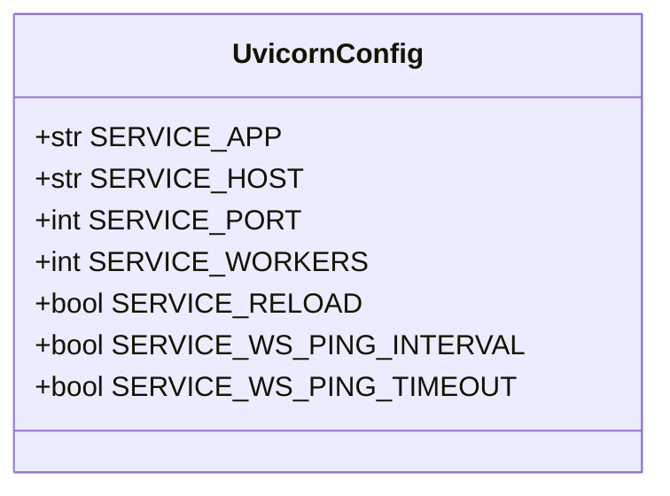
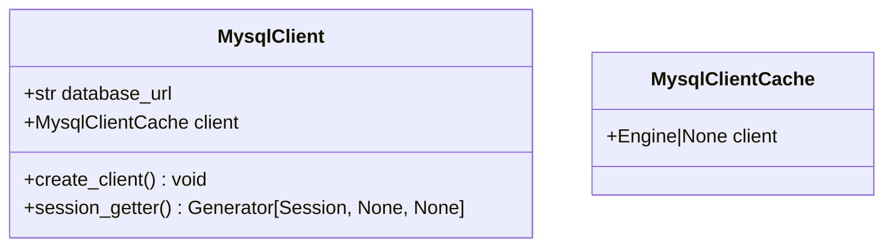
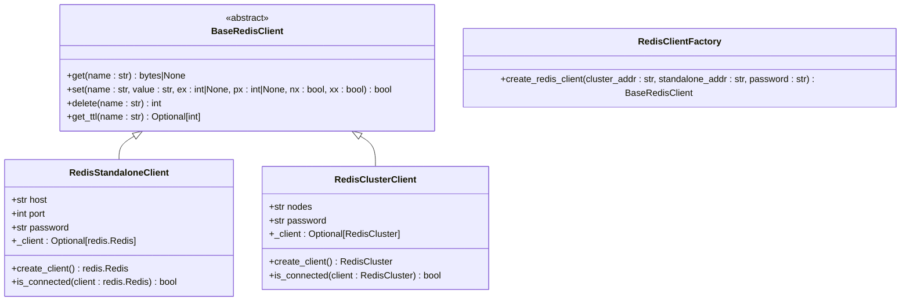
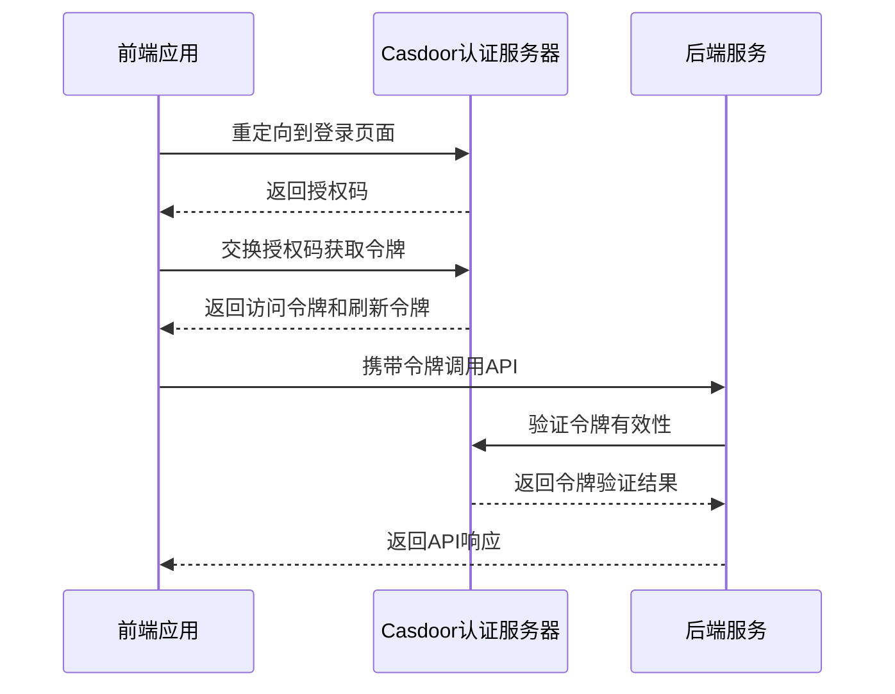

# 技术栈

<cite>
**本文档中引用的文件**  
- [package.json](file://console/frontend/package.json)
- [tsconfig.json](file://console/frontend/tsconfig.json)
- [vite.config.js](file://console/frontend/vite.config.js)
- [tailwind.config.js](file://console/frontend/tailwind.config.js)
- [casdoor.ts](file://console/frontend/src/config/casdoor.ts)
- [pyproject.toml](file://core/agent/pyproject.toml)
- [fast_uvi.py](file://core/agent/infra/config/fast_uvi.py)
- [redis_client.py](file://core/agent/cache/redis_client.py)
- [mysql_client.py](file://core/agent/repository/mysql_client.py)
- [go.mod](file://core/tenant/go.mod)
- [docker-compose.yaml](file://docker/astronAgent/docker-compose.yaml)
</cite>

## 目录
1. [前端技术栈](#前端技术栈)
2. [后端技术栈](#后端技术栈)
3. [数据库与缓存](#数据库与缓存)
4. [容器化部署](#容器化部署)
5. [对象存储](#对象存储)
6. [认证系统](#认证系统)

## 前端技术栈

前端部分基于现代JavaScript技术栈构建，采用React作为核心UI框架，Vite作为构建工具，TypeScript提供类型安全，并使用Tailwind CSS进行样式设计。

### React与TypeScript

项目使用React 18.2.0版本作为前端UI框架，结合TypeScript 5.9.2提供静态类型检查。TypeScript配置文件`tsconfig.json`中启用了严格的类型检查选项，包括`strict`、`strictNullChecks`、`strictFunctionTypes`等，确保代码的类型安全性。

**Section sources**
- [package.json](file://console/frontend/package.json#L130-L131)
- [tsconfig.json](file://console/frontend/tsconfig.json#L1-L44)

### Vite构建工具

项目采用Vite 5.4.0作为前端构建工具，提供了快速的开发服务器启动和热模块替换功能。Vite配置文件`vite.config.js`中定义了开发服务器的代理规则，将`/xingchen-api`、`/chat-`和`/workflow`等请求代理到后端服务，解决了开发环境下的跨域问题。

**Section sources**
- [package.json](file://console/frontend/package.json#L5-L6)
- [vite.config.js](file://console/frontend/vite.config.js#L1-L98)

### Tailwind CSS样式系统

项目使用Tailwind CSS 3.3.5作为CSS框架，采用实用优先的样式设计方法。Tailwind配置文件`tailwind.config.js`中扩展了默认的主题配置，包括自定义颜色`flow-handle`和断点设置，支持响应式设计。

**Section sources**
- [package.json](file://console/frontend/package.json#L129)
- [tailwind.config.js](file://console/frontend/tailwind.config.js#L1-L40)

### 状态管理：Zustand

前端状态管理采用Zustand 5.0.3库，这是一个轻量级的状态管理解决方案，提供了简单的API来管理全局状态。项目中使用Zustand管理用户登录状态、聊天会话、空间信息等全局状态，避免了传统Redux的样板代码。

**Section sources**
- [package.json](file://console/frontend/package.json#L128)

### 路由系统：React Router

项目使用React Router 7.7.0进行路由管理，实现了单页应用的导航功能。路由系统负责管理不同页面之间的跳转，如首页、聊天页面、模型管理、插件商店等。通过React Router的路由配置，实现了基于URL的页面导航和参数传递。

**Section sources**
- [package.json](file://console/frontend/package.json#L126)

## 后端技术栈

后端技术栈主要由Python和Go语言构成，其中核心服务采用FastAPI框架，租户服务使用Go语言开发。

### FastAPI框架

后端核心服务基于FastAPI 0.115.12构建，这是一个现代、快速（高性能）的Web框架，基于Python类型提示。FastAPI提供了自动生成API文档（基于OpenAPI和JSON Schema）、数据验证、序列化等功能。项目中的`core/agent`服务使用FastAPI处理智能体相关的API请求。

**Section sources**
- [pyproject.toml](file://core/agent/pyproject.toml#L10)

### Uvicorn ASGI服务器

FastAPI应用通过Uvicorn 0.34.0作为ASGI服务器进行部署。Uvicorn是一个基于uvloop和httptools的ASGI服务器，提供了高性能的HTTP处理能力。在`fast_uvi.py`配置文件中，定义了服务的主机地址、端口（17870）、工作进程数等配置项，确保服务的稳定运行。

**Diagram sources**
- [fast_uvi.py](file://core/agent/infra/config/fast_uvi.py#L1-L12)

**Section sources**
- [pyproject.toml](file://core/agent/pyproject.toml#L11)
- [fast_uvi.py](file://core/agent/infra/config/fast_uvi.py#L1-L12)

### Go语言租户服务

租户管理服务采用Go语言开发，位于`core/tenant`目录下。该服务使用Gin框架处理HTTP请求，通过Go的高效并发模型处理租户相关的业务逻辑。`go.mod`文件显示项目依赖于`github.com/gin-gonic/gin`、`github.com/go-sql-driver/mysql`等关键库。

**Section sources**
- [go.mod](file://core/tenant/go.mod#L1-L42)

## 数据库与缓存

项目使用MySQL作为主要的关系型数据库，Redis作为缓存和会话存储。

### MySQL数据库

MySQL用于存储应用的核心数据，包括用户信息、智能体配置、工作流定义等。在`mysql_client.py`文件中，使用SQLAlchemy作为ORM工具，配置了数据库连接池（大小200，最大溢出800）和连接回收策略（3600秒），确保数据库连接的高效管理和稳定性。

**Diagram sources**
- [mysql_client.py](file://core/agent/repository/mysql_client.py#L1-L53)

**Section sources**
- [mysql_client.py](file://core/agent/repository/mysql_client.py#L1-L53)

### Redis缓存

Redis用于缓存频繁访问的数据和会话信息，提高系统性能。项目支持Redis单机和集群两种部署模式。`redis_client.py`文件中实现了`RedisStandaloneClient`和`RedisClusterClient`两个类，分别处理单机和集群环境下的Redis连接。通过工厂方法`create_redis_client`根据配置选择合适的客户端实现。

**Diagram sources**
- [redis_client.py](file://core/agent/cache/redis_client.py#L1-L212)

**Section sources**
- [redis_client.py](file://core/agent/cache/redis_client.py#L1-L212)

## 容器化部署

项目采用Docker和Docker Compose进行容器化部署，实现了服务的隔离和可移植性。

### Docker容器化

各个服务组件（如前端、核心服务、租户服务）都提供了Dockerfile，定义了容器的构建过程。通过Docker容器化，确保了开发、测试和生产环境的一致性，简化了部署流程。

### Docker Compose编排

使用Docker Compose进行多容器应用的编排管理。`docker-compose.yaml`文件定义了整个应用栈的服务依赖关系，包括前端、后端、数据库、缓存等组件的配置和网络连接。通过Docker Compose，可以一键启动整个应用栈，大大简化了本地开发和测试的环境搭建。

**Section sources**
- [docker-compose.yaml](file://docker/astronAgent/docker-compose.yaml)

## 对象存储

项目使用MinIO作为对象存储服务，用于存储文件、模型和其他二进制数据。

### MinIO集成

MinIO是一个开源的S3兼容对象存储，提供了高可用、可扩展的存储解决方案。在RAGFlow的配置中，MinIO用于存储文件数据，配置了访问密钥、密码、端点URL和存储桶名称等参数。通过S3兼容的API，应用可以方便地上传、下载和管理存储在MinIO中的文件。

**Section sources**
- [README.md](file://docker/ragflow/README.md#L49-L72)

## 认证系统

项目采用Casdoor作为统一认证系统，实现了安全的用户身份验证和授权。

### Casdoor实现

前端通过`casdoor-js-sdk`与Casdoor认证服务器进行交互。在`casdoor.ts`配置文件中，定义了Casdoor服务器的URL、客户端ID、应用名称、组织名称等配置项。SDK提供了登录、登出、令牌解析等功能，实现了OAuth 2.0和OIDC协议的客户端逻辑。

**Diagram sources**
- [casdoor.ts](file://console/frontend/src/config/casdoor.ts#L1-L162)

**Section sources**
- [package.json](file://console/frontend/package.json#L125)
- [casdoor.ts](file://console/frontend/src/config/casdoor.ts#L1-L162)