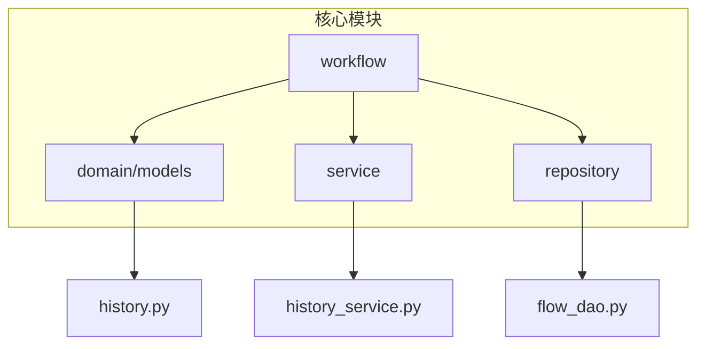
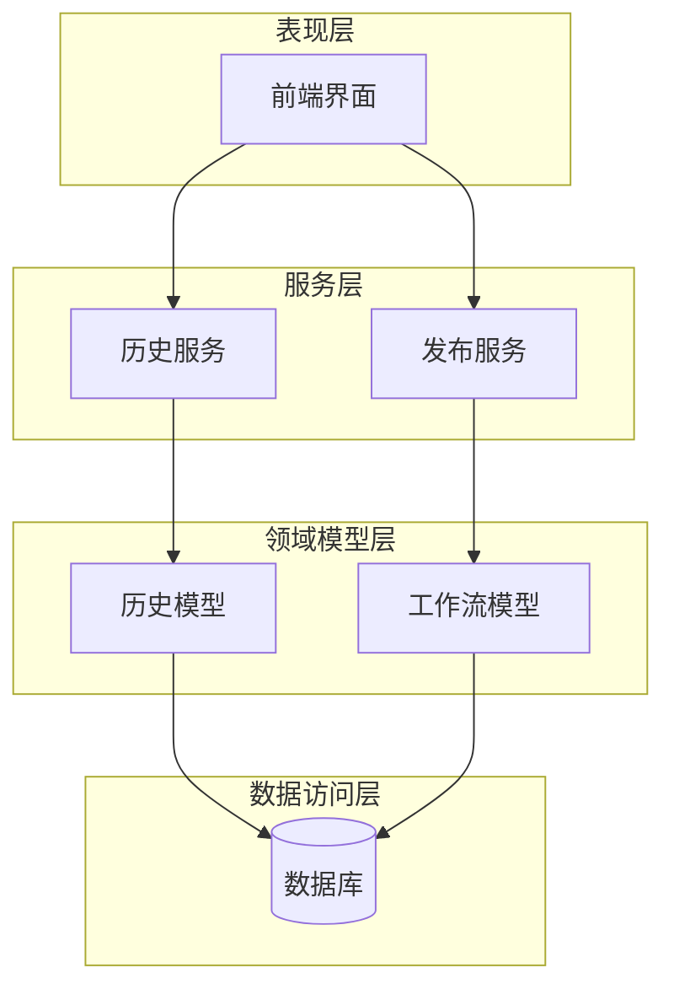
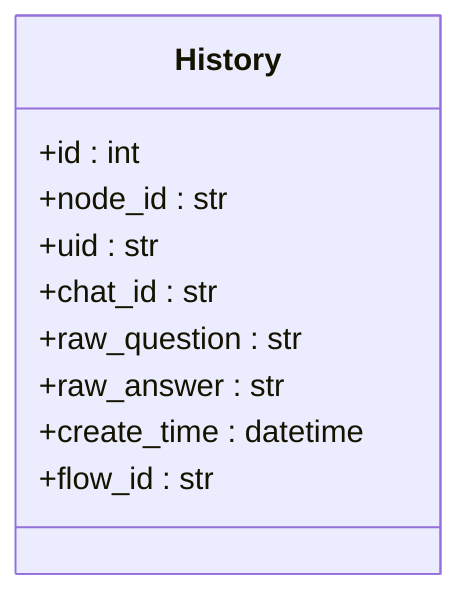
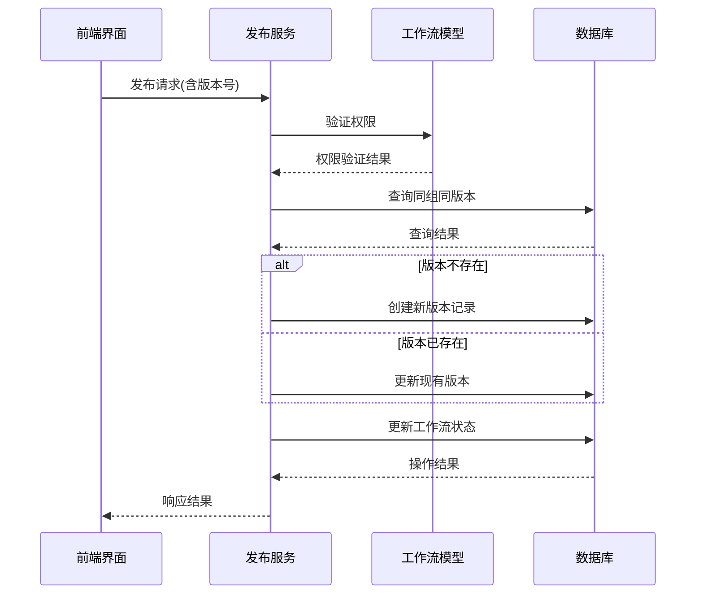
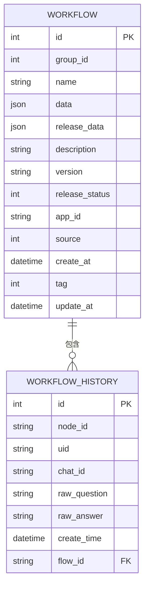
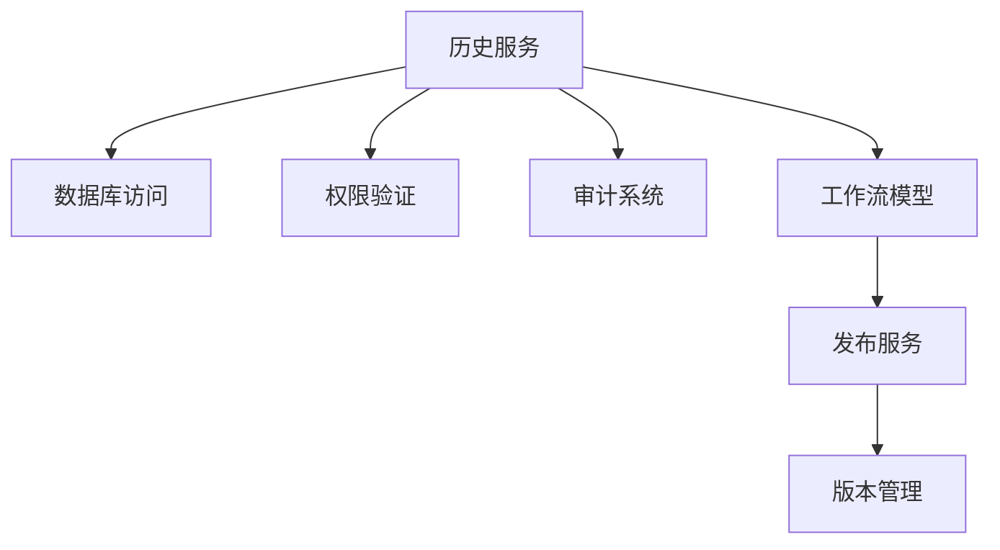

# 工作流历史记录模型

<cite>
**本文档引用的文件**
- [history.py](file://core/workflow/domain/models/history.py)
- [history_service.py](file://core/workflow/service/history_service.py)
- [flow.py](file://core/workflow/domain/models/flow.py)
- [publish_service.py](file://core/workflow/service/publish_service.py)
- [schema.sql](file://docker/astronAgent/astronRPA/volumes/mysql/schema.sql)
</cite>

## 目录
1. [引言](#引言)
2. [项目结构](#项目结构)
3. [核心组件](#核心组件)
4. [架构概述](#架构概述)
5. [详细组件分析](#详细组件分析)
6. [依赖分析](#依赖分析)
7. [性能考虑](#性能考虑)
8. [故障排除指南](#故障排除指南)
9. [结论](#结论)

## 引言
本文档详细描述了工作流历史记录模型的设计与实现，重点分析了工作流版本管理机制、历史记录与工作流实体的关联关系以及审计追踪功能。文档涵盖了历史记录模型的实体结构、版本号生成策略、存储格式、回滚流程以及元数据字段的含义和约束条件。

## 项目结构
工作流历史记录模型主要位于`core/workflow`目录下，包含领域模型、服务层和数据库访问层。历史记录功能主要由`domain/models/history.py`定义实体结构，`service/history_service.py`提供服务接口，`repository/flow_dao.py`处理数据访问。

**图示来源**
- [history.py](file://core/workflow/domain/models/history.py)
- [history_service.py](file://core/workflow/service/history_service.py)
- [flow.py](file://core/workflow/domain/models/flow.py)

**本节来源**
- [history.py](file://core/workflow/domain/models/history.py)
- [history_service.py](file://core/workflow/service/history_service.py)

## 核心组件
工作流历史记录模型的核心组件包括历史记录实体、历史服务和版本管理服务。历史记录实体定义了存储结构，历史服务提供增删改查接口，版本管理服务处理工作流的发布和版本控制。

**本节来源**
- [history.py](file://core/workflow/domain/models/history.py)
- [history_service.py](file://core/workflow/service/history_service.py)
- [publish_service.py](file://core/workflow/service/publish_service.py)

## 架构概述
工作流历史记录模型采用分层架构，包括表现层、服务层、领域模型层和数据访问层。系统通过服务层协调各组件，实现历史记录的存储、查询和版本管理功能。

**图示来源**
- [history.py](file://core/workflow/domain/models/history.py)
- [flow.py](file://core/workflow/domain/models/flow.py)
- [history_service.py](file://core/workflow/service/history_service.py)
- [publish_service.py](file://core/workflow/service/publish_service.py)

## 详细组件分析

### 历史记录实体分析
历史记录实体定义了工作流节点执行历史的存储结构，包括用户交互和节点响应的跟踪信息。

#### 实体结构

**图示来源**
- [history.py](file://core/workflow/domain/models/history.py#L1-L45)

**本节来源**
- [history.py](file://core/workflow/domain/models/history.py#L1-L45)

### 版本管理机制分析
工作流版本管理机制通过发布服务实现，支持版本号的生成、存储和回滚操作。

#### 版本管理流程

**图示来源**
- [publish_service.py](file://core/workflow/service/publish_service.py#L1-L296)
- [flow.py](file://core/workflow/domain/models/flow.py#L1-L53)

**本节来源**
- [publish_service.py](file://core/workflow/service/publish_service.py#L1-L296)

### 历史记录与工作流关联分析
历史记录与工作流实体通过flow_id字段建立关联关系，实现工作流的审计追踪功能。

#### 实体关系图

**图示来源**
- [history.py](file://core/workflow/domain/models/history.py#L1-L45)
- [flow.py](file://core/workflow/domain/models/flow.py#L1-L53)
- [schema.sql](file://docker/astronAgent/astronRPA/volumes/mysql/schema.sql#L196-L260)

**本节来源**
- [history.py](file://core/workflow/domain/models/history.py#L1-L45)
- [flow.py](file://core/workflow/domain/models/flow.py#L1-L53)

## 依赖分析
工作流历史记录模型依赖于多个核心组件，包括数据库访问层、权限验证服务和审计系统。这些依赖关系确保了历史记录功能的完整性和安全性。

**图示来源**
- [history_service.py](file://core/workflow/service/history_service.py#L1-L186)
- [publish_service.py](file://core/workflow/service/publish_service.py#L1-L296)

**本节来源**
- [history_service.py](file://core/workflow/service/history_service.py#L1-L186)
- [publish_service.py](file://core/workflow/service/publish_service.py#L1-L296)

## 性能考虑
历史记录模型在设计时考虑了性能优化，包括数据库行长度限制、token限制和历史记录大小限制。系统通过截断过长内容、限制历史记录数量等方式确保性能稳定。

**本节来源**
- [history_service.py](file://core/workflow/service/history_service.py#L1-L186)

## 故障排除指南
当历史记录功能出现问题时，应检查数据库连接、权限配置和数据格式。常见问题包括历史记录无法保存、版本发布失败和审计追踪缺失等。

**本节来源**
- [history_service.py](file://core/workflow/service/history_service.py#L1-L186)
- [publish_service.py](file://core/workflow/service/publish_service.py#L1-L296)

## 结论
工作流历史记录模型提供了一套完整的版本管理和审计追踪解决方案。通过合理的实体设计和服务架构，系统能够有效记录工作流的执行历史，支持版本控制和回滚操作，为工作流的管理和维护提供了有力支持。